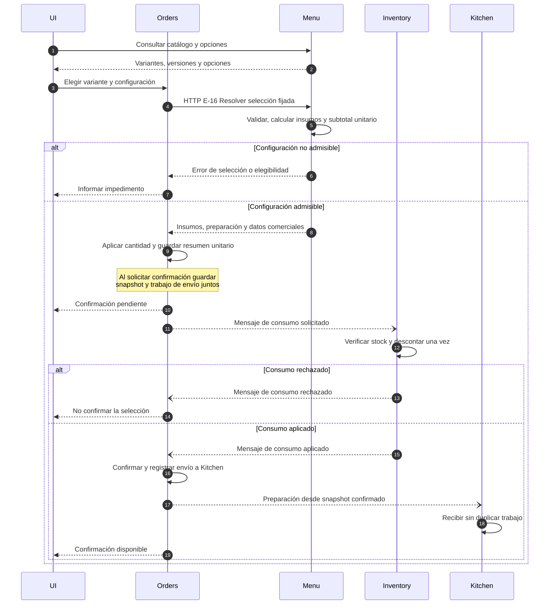

# Flujo conceptual de ordenar

Este diagrama explica la coordinación entre servicios. No define nuevos endpoints ni payloads de Orders, Inventory o Kitchen. La [especificación de interfaces](../../output/interfaces/index.md) mantiene su alcance exclusivo de Menu.

Las flechas de mensajes representan entrega mediante broker, omitido como participante para hacer visible la responsabilidad de cada servicio. El retorno final a la UI expresa actualización de estado; no prescribe mantener una conexión HTTP abierta ni un transporte de notificación concreto.

1. La UI usa IDs obtenidos del catálogo. Orders conoce el contrato público de selección, no las tablas o recetas internas de Menu.
2. Menu valida pertenencias, versiones y cantidades; aplica OMIT antes de ADD por componente y devuelve ingredientes planos. Una respuesta de resolución no descuenta ni reserva stock.
3. Menu devuelve precio base, extras agregados, subtotal unitario y moneda. Orders aplica cantidad de línea y reglas externas de la orden y persiste su snapshot, sin recibir precios por componente o modificador. Al solicitar confirmación, ese snapshot y el trabajo de envío del consumo se guardan juntos. Si ya existía una línea, conserva los datos comerciales fijados y vuelve a comprobar elegibilidad antes de confirmar.
4. El mensaje para Inventory contiene identidad de movimiento e insumos con cantidades/unidades. No necesita precio, receta ni la orden completa. Inventory exige stock suficiente, descuento integral y protección frente a concurrencia/duplicados: no es una resta aislada.
5. Mientras no hay aceptación de Inventory, la confirmación queda pendiente. Rechazo impide confirmar y enviar ese trabajo a Kitchen. Aceptación permite a Orders confirmar y preparar el envío a Kitchen de forma recuperable.
6. Kitchen recibe únicamente la información necesaria desde el snapshot confirmado. No reconstruye la receta actual consultando Menu. La identidad del trabajo evita duplicarlo al reentregar.

El descuento atómico se refiere a la lista completa de esta solicitud, no promete atomicidad de toda una orden multilínea. Un timeout no demuestra rechazo: se recupera el resultado y se reintenta con la misma identidad de movimiento. La autorización para devolver ingredientes tras cancelar es otro proceso, fuera de este flujo directo.

Disponibilidad M-03 es un flujo paralelo orientativo Menu–Inventory; no constituye aceptación del consumo de una orden. Las decisiones de confirmación y snapshot siguen la [base arquitectónica](../md/Decisiones-cierre-invariantes.md#adr-003).

[Imagen del diagrama](./flujo-ordenar.png) · [Versión SVG](./flujo-ordenar.svg).
