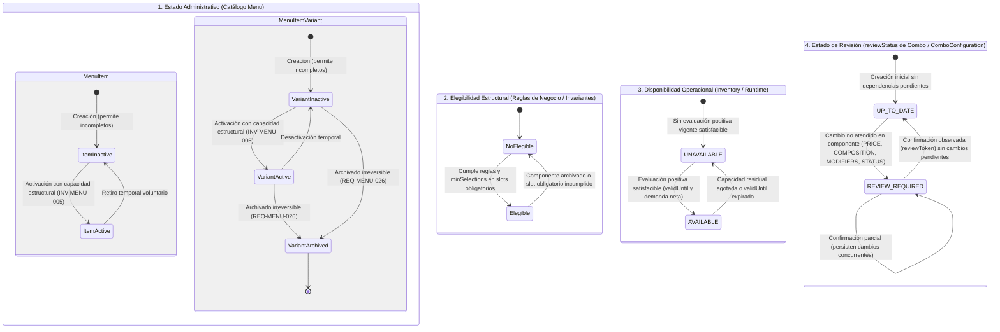
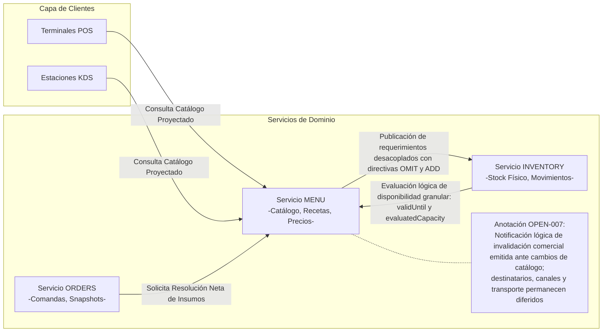

# Especificación Final Vigente del Servicio Menu

**Documento:** Especificación Técnica, Funcional y de Arquitectura de Dominio Consolidada  
**Servicio:** Menu (Sistema de Comandas para Restaurantes)  
**Versión:** 1.1.7 (Consolidada Vigente)
**Estado:** Vigente / Aprobado  
**Fecha:** 2026-09-16  

---

## 1. Índice General

- [1. Índice General](#1-índice-general)
- [2. Configuración del Documento](#2-configuración-del-documento)
  - [2.1 Identificación y Propósito](#21-identificación-y-propósito)
  - [2.2 Autoridad Temporal y Semántica de las Fuentes](#22-autoridad-temporal-y-semántica-de-las-fuentes)
  - [2.3 Alcance y Exclusiones](#23-alcance-y-exclusiones)
- [3. Contexto, Alcance y Lenguaje del Dominio](#3-contexto-alcance-y-lenguaje-del-dominio)
  - [3.1 Responsabilidades del Bounded Context Menu](#31-responsabilidades-del-bounded-context-menu)
  - [3.2 Límites de Contexto y Ownership de Datos](#32-límites-de-contexto-y-ownership-de-datos)
  - [3.3 Taxonomía Fundamental del Menú](#33-taxonomía-fundamental-del-menú)
  - [3.4 Ortogonalidad: Estado Administrativo, Elegibilidad Estructural, Disponibilidad Operacional y Estado de Revisión](#34-ortogonalidad-estado-administrativo-elegibilidad-estructural-y-disponibilidad-operacional)
  - [3.5 Glosario Normativo del Dominio](#35-glosario-normativo-del-dominio)
- [4. Requisitos Funcionales Consolidados](#4-requisitos-funcionales-consolidados)
  - [4.1 Definición y Catálogo de MenuItems](#41-definición-y-catálogo-de-menuitems)
  - [4.2 Variantes de Productos Hoja](#42-variantes-de-productos-hoja)
  - [4.3 Precios Autoritativos y Proyección de Catálogo](#43-precios-autoritativos-y-proyección-de-catálogo)
  - [4.4 Suministro y Recetas Culinarias](#44-suministro-y-recetas-culinarias)
  - [4.5 Grupos y Opciones de Modificadores](#45-grupos-y-opciones-de-modificadores)
  - [4.6 Combos, Configuraciones, Slots y Opciones](#46-combos-configuraciones-slots-y-opciones)
  - [4.7 Ciclo de Vida, Archivado y Reglas Incompletas](#47-ciclo-de-vida-archivado-y-reglas-incompletas)
  - [4.8 Resolución Neta de Insumos](#48-resolución-neta-de-insumos)
  - [4.9 Versionado Inmutable de Definiciones Comerciales](#49-versionado-inmutable-de-definiciones-comerciales)
  - [4.10 Detección y Gestión de Revisiones de Combo](#410-detección-y-gestión-de-revisiones-de-combo)
  - [4.11 Publicación, Proyecciones y Disponibilidad](#411-publicación-proyecciones-y-disponibilidad)
- [5. Requisitos No Funcionales](#5-requisitos-no-funcionales)
  - [5.1 Presupuesto de Rendimiento de Aceptación (ADR-004)](#51-presupuesto-de-rendimiento-de-aceptación-adr-004)
  - [5.2 Perfil Nominal de Operación](#52-perfil-nominal-de-operación)
  - [5.3 Objetivos de Latencia por Clase de Operación](#53-objetivos-de-latencia-por-clase-de-operación)
  - [5.4 Capacidad ante Ráfagas (Burst)](#54-capacidad-ante-ráfagas-burst)
  - [5.5 Concurrencia e Integridad Transaccional](#55-concurrencia-e-integridad-transaccional)
  - [5.6 Resiliencia y Desacoplamiento de Inventory](#56-resiliencia-y-desacoplamiento-de-inventory)
- [6. Reglas de Negocio e Invariantes del Dominio](#6-reglas-de-negocio-e-invariantes-del-dominio)
  - [6.1 Reglas de Negocio (BR-MENU)](#61-reglas-de-negocio-br-menu)
  - [6.2 Invariantes de Integridad del Dominio (INV-MENU)](#62-invariantes-de-integridad-del-dominio-inv-menu)
- [7. Modelo de Dominio](#7-modelo-de-dominio)
  - [7.1 Agregados y Límites de Consistencia](#71-agregados-y-límites-de-consistencia)
  - [7.2 Entidades y Atributos Principales](#72-entidades-y-atributos-principales)
  - [7.3 Value Objects](#73-value-objects)
  - [7.4 Proyecciones de Consulta (Read Models)](#74-proyecciones-de-consulta-read-models)
  - [7.5 Diagramas Estructurales y de Comportamiento](#75-diagramas-estructurales-y-de-comportamiento)
- [8. Arquitectura y Límites del Sistema](#8-arquitectura-y-límites-del-sistema)
  - [8.1 Diagrama de Contexto de Bounded Contexts](#81-diagrama-de-contexto-de-bounded-contexts)
  - [8.2 Patrones de Interacción y Comunicación](#82-patrones-de-interacción-y-comunicación)
  - [8.3 Aislamiento de Persistencia y Reglas de Integración](#83-aislamiento-de-persistencia-y-reglas-de-integración)
- [9. Modelo de Datos Lógico](#9-modelo-de-datos-lógico)
  - [9.1 Estructura Persistente Relacional](#91-estructura-persistente-relacional)
  - [9.2 Relaciones Internas y Restricciones](#92-relaciones-internas-y-restricciones)
  - [9.3 Referencias Externas Desacopladas](#93-referencias-externas-desacopladas)
  - [9.4 Estrategia de Versionado Histórico e Inmutabilidad](#94-estrategia-de-versionado-histórico-e-inmutabilidad)
- [10. Interfaces de Entrada y Salida (APIs)](#10-interfaces-de-entrada-y-salida-apis)
  - [10.1 Interfaz de Consulta Pública de Catálogo](#101-interfaz-de-consulta-pública-de-catálogo)
  - [10.2 Interfaz de Operaciones Administrativas y Copia en Lote](#102-interfaz-de-operaciones-administrativas-y-copia-en-lote)
  - [10.3 Interfaz de Gestión y Confirmación de Revisiones de Combo](#103-interfaz-de-gestión-y-confirmación-de-revisiones-de-combo)
  - [10.4 Interfaz de Resolución Neta de Insumos para Orders](#104-interfaz-de-resolución-neta-de-insumos-para-orders)
  - [10.5 Intercambio Lógico con Inventory](#105-intercambio-lógico-con-inventory)
- [11. Eventos de Negocio](#11-eventos-de-negocio)
  - [11.1 Eventos Emitidos por Menu](#111-eventos-emitidos-por-menu)
  - [11.2 Eventos Consumidos por Menu](#112-eventos-consumidos-por-menu)
- [12. Datos Requeridos de Otros Servicios y Ownership](#12-datos-requeridos-de-otros-servicios-y-ownership)
  - [12.1 Dependencias con Inventory](#121-dependencias-con-inventory)
  - [12.2 Dependencias con Orders](#122-dependencias-con-orders)
  - [12.3 Dependencias con POS / KDS](#123-dependencias-con-pos--kds)
- [13. Cuestiones Abiertas (Open Items)](#13-cuestiones-abiertas-open-items)
  - [13.1 OPEN-002: Emparejamiento de Slots y Conflictos en Copia Masiva](#131-open-002-emparejamiento-de-slots-y-conflictos-en-copia-masiva)
  - [13.2 OPEN-007: Especificación Técnica Formal de Contratos Externos y Transporte](#132-open-007-especificación-técnica-formal-de-contratos-externos-y-transporte)
  - [13.3 OPEN-009: Precios de Componentes Fraccionados y Modificadores Repetidos en Combos](#133-open-009-precios-de-componentes-fraccionados-y-modificadores-repetidos-en-combos)
  - [13.4 OPEN-010: Rangos Numéricos Exhaustivos y Restricciones de Dominio](#134-open-010-rangos-numéricos-exhaustivos-y-restricciones-de-dominio)
- [14. Matriz de Trazabilidad](#14-matriz-de-trazabilidad)
  - [14.1 Trazabilidad de Requisitos Funcionales (REQ-MENU-001 a REQ-MENU-046)](#141-trazabilidad-de-requisitos-funcionales-req-menu-001-a-req-menu-046)
  - [14.2 Trazabilidad de Reglas de Negocio e Invariantes](#142-trazabilidad-de-reglas-de-negocio-e-invariantes)
  - [14.3 Trazabilidad de Requisitos No Funcionales y ADRs](#143-trazabilidad-de-requisitos-no-funcionales-y-adrs)

---

## 2. Configuración del Documento

<a id="21-identificación-y-propósito"></a>
### 2.1 Identificación y Propósito

El presente documento constituye la especificación técnica, funcional, estructural y de arquitectura consolidada y vigente para el servicio **Menu**, componente central del sistema de comandas y gestión de restaurantes. Su objetivo es constituirse como la **única fuente autorizada de verdad**, autosuficiente y verificable, reemplazando ambigüedades, documentos transitorios y discusiones previas. La versión 1.1.1 incorporó formalmente el refinamiento de disponibilidad operacional granular adoptado el 2026-09-16 y aclaró la composición efectiva OMIT/ADD y la señal lógica de capacidad de Inventory. La versión 1.1.2 complementa y formaliza de manera implementable las aclaraciones normativas sobre la derivación entera y dimensional de evaluatedCapacity, el cálculo de capacidad en grupos obligatorios ante valores enteros y nulos, la reevaluación obligatoria de VariantAvailability ante cualquier reducción de capacidad con no propagación circunscrita a casos opcionales o con capacidad remanente, y la definición de opciones seleccionables y availableCapacity en ComboSlot. La versión 1.1.3 corrige y formaliza la derivación de capacidad evaluada (`evaluatedCapacity`) y límites de modificadores (`availableMaxQuantity`) basándola estrictamente en el inventario remanente tras descontar los requerimientos base netos efectivos tras OMIT ($\text{StockRemanente}(k) = \max(0, \text{StockDisponible}(k) - \text{BaseNetoTrasOMIT}(k))$), sustituyendo el cálculo sobre stock bruto para impedir que una opción o variante se declare disponible utilizando inventario ya consumido por los requerimientos base efectivos, y clarifica que la satisfacibilidad en `VariantAvailability` evalúa la demanda neta integral (base tras OMIT más ADD). La versión 1.1.4 corrige el caso de verificación de la directiva OMIT en REQ-MENU-044 —eliminando toda interpretación de reducción parcial sobre la base para establecer $\text{BaseNetoTrasOMIT} = 0$ y su consecuente recálculo de capacidad remanente— y corrige el ancla HTML y enlace de índice de trazabilidad de la sección 14.1. La versión 1.1.5 formaliza la revisión transversal de consistencia del modelo vigente: ratifica la ortogonalidad estricta entre estado administrativo (`status`), elegibilidad estructural, disponibilidad operacional (proyecciones desacopladas) y estado de revisión (`reviewStatus`), clarificando que ninguna proyección operacional constituye un estado administrativo persistente; explicita la prohibición de formulaciones heredadas basadas en peor caso, requerimientos base crudos aislados o cálculo sobre stock bruto; ratifica la derivación de `VariantAvailability`, `ModifierAvailability` y `ComboConfigurationAvailability` sobre capacidad residual y opciones seleccionables; y explicita las inconsistencias semánticas identificadas en los diagramas para su resolución diferida sin alterar el estilo ni renumerar requisitos. La versión 1.1.6 formaliza la corrección y alineación exhaustiva de los diagramas visuales con el modelo de dominio y las invariantes vigentes: representa a `MenuItem` como raíz de agregado con discriminador (`PREPARED`, `STOCKED`, `COMBO`), circunscribe variantes, dimensiones y modificadores exclusivamente a items hoja y separa las entidades persistentes de los read models desacoplados; incorpora en el diagrama de estados las cuatro dimensiones ortogonales distinguiendo los ciclos de vida de item y variante, rotulando la activación mediante capacidad estructural (INV-MENU-005) y modelando el ciclo de supervisión de `reviewStatus`; reformula el flujo de propagación de disponibilidad para ilustrar la publicación desacoplada de requerimientos, la evaluación de inventario con capacidad residual y la propagación no obstructiva hacia variantes, combos y slots; y delimita el diagrama de contexto estrictamente a la frontera de integración directa de Menu anotando la invalidación bajo OPEN-007, retirando notas de discrepancias diferidas sin alterar requisitos ni la numeración normativa. La versión 1.1.7 subsana las dos observaciones diagramáticas identificadas: en el diagrama de clases de la sección 7.5, reemplaza las composiciones de `VariantModifierConfig` por asociaciones no compositivas hacia `MenuItemVariant` y `ModifierOption` con multiplicidad exactamente 1 en cada referencia y 0..* configuraciones desde cada entidad referenciada, explicitando que cada configuración es única por la tupla `(variantId, modifierOptionId)` sin admitir doble pertenencia compositiva; y en el diagrama de propagación de disponibilidad granular, desagrega la publicación de Menu en dos salidas independientes hacia Inventory (`BaseRequirements` por variante y `ModifierRequirements` por tupla `(variantId, modifierOptionId)`), conectándolas de forma separada con la evaluación de existencias que combina la base efectiva tras OMIT con las directivas ADD sobre capacidad residual, excluyendo explícitamente todo cálculo global de peor caso.

Cualquier ingeniero, arquitecto o auditor debe ser capaz de entender e implementar el comportamiento normativo del servicio Menu a partir exclusivamente de este texto, sin requerir reconstrucción arqueológica de versiones descartadas.

<a id="22-autoridad-temporal-y-semántica-de-las-fuentes"></a>
### 2.2 Autoridad Temporal y Semántica de las Fuentes

La consolidación se fundamenta estrictamente en la evolución cronológica y jerárquica de las fuentes autorizadas del proyecto:

1. **`Problema-Inicial.md`** (Origen del problema, identificación de ambigüedades estructurales en modificadores e instrucciones de cocción).
2. **`Consultoria-1.md`** (Análisis de rendimiento, perfil de carga para restaurantes y límites de latencia).
3. **`Consultoria-2.md`** (Desacoplamiento de variantes e inventario, archivado, outbox y consistencia asíncrona).
4. **`Auditoria-1.md`** (Detección de agujeros y debilidades del modelo conceptual inicial).
5. **`Auditoria-2.md`** (Propuestas de solución: patrón Default Variant, variante como unidad vendible).
6. **`Modelo-Pre-Final.md`** (Modelo intermedio de taxonomía comercial y cumplimiento culinario/stock).
7. **`Decisiones-cierre-invariantes.md`** (Cierres arquitectónicos formales ADR-001 a ADR-008).
8. **`Req-F-Aproved.md`** (Base de requisitos funcionales formalmente aprobados REQ-MENU-001 a REQ-MENU-041).
9. **`Auditoria-3.md`** (Simplificaciones finales de dominio, propiedad de modificadores en el item hoja con especialización opcional por variante, efectos ADD/OMIT, desacoplamiento estricto de combos y reevaluación no obstructiva por archivado de variantes).
10. **Refinamiento de Disponibilidad Granular (2026-09-16)** (Máxima autoridad vigente sobre disponibilidad operacional: desacoplamiento granular por variante y opción de modificador, eliminación del cálculo por peor caso con modificadores opcionales, requerimientos base e incrementales separados y propagación por capacidad y existencia hacia combos y catálogo).

#### Regla de Prevalencia
Una fuente posterior sustituye a una anterior en caso de conflicto directo o refinamiento incompatible. En particular:
- El **Refinamiento de Disponibilidad Granular (2026-09-16)** ostenta la máxima jerarquía resolutiva sobre el modelo, contratos, proyecciones y reglas de disponibilidad operacional e intercambio con Inventory, reemplazando cualquier hipótesis o criterio previo basado en el peor caso o la activación simultánea de todos los modificadores opcionales.
- **`Auditoria-3.md`** ostenta la máxima jerarquía resolutiva para la simplificación del catálogo comercial, la propiedad de modificadores en el item hoja y la reevaluación no obstructiva por archivado de variantes.
- **`Req-F-Aproved.md`** aporta la línea base de los requisitos funcionales aprobados. Cuando una regla de `Req-F-Aproved.md` o de `Decisiones-cierre-invariantes.md` (por ejemplo, el rechazo obligatorio del archivado de variantes con dependencias) entre en contradicción con `Auditoria-3.md`, prevalece incondicionalmente la disposición de `Auditoria-3.md` (permitir el archivado y reevaluar la elegibilidad de combos dependientes marcándolos como `REVIEW_REQUIRED`).
- Las decisiones intermedias o hipótesis descartadas quedan fuera del cuerpo normativo principal y se registran exclusivamente como notas de trazabilidad histórica.

<a id="23-alcance-y-exclusiones"></a>
### 2.3 Alcance y Exclusiones

- **Dentro del alcance:** Modelado y administración de la oferta comercial (MenuItems, variantes, combos, recetas culinarias, grupos y opciones de modificadores); cálculo autoritativo de precios unitarios y proyecciones de precio de catálogo; resolución neta de insumos culinarios para órdenes; reevaluación de dependencias estructurales; versionado inmutable de definiciones comerciales.
- **Fuera del alcance (Responsabilidad de otros bounded contexts):**
  - Existencias físicas de inventario, bodegas, mermas, órdenes de compra y cálculo de disponibilidad en tiempo real (propiedad de **Inventory**).
  - Ciclo de vida transaccional de órdenes, carritos, líneas de comanda y cobros (propiedad de **Orders**).
  - Terminales de punto de venta, renderizado de pantallas y estaciones de preparación de cocina (propiedad de **POS / KDS**).

---

## 3. Contexto, Alcance y Lenguaje del Dominio

<a id="31-responsabilidades-del-bounded-context-menu"></a>
### 3.1 Responsabilidades del Bounded Context Menu

El servicio Menu es la autoridad exclusiva sobre la **oferta comercial vendible** del restaurante. Sus responsabilidades comprenden:
1. Definir la estructura del catálogo (categorías, platos, bebidas, complementos y combos).
2. Modelar las presentaciones vendibles concretas (`MenuItemVariant`) para productos hoja y configuraciones (`ComboConfiguration`) para combos.
3. Custodiar los precios unitarios absolutos autoritativos de cada variante y configuración.
4. Modelar las recetas culinarias base (`Recipe`) y los artículos de stock asociados a las variantes.
5. Administrar las opciones de personalización (`ModifierGroup`, `ModifierOption`) y sus especializaciones por variante (`VariantModifierConfig`).
6. Proyectar hacia POS/KDS las definiciones listas para venta (`ResolvedVariantModifier`, precio visual de catálogo).
7. Resolver, ante una solicitud de Orders, la descomposición neta exacta de insumos físicos (ingredientes de receta, cantidades de stock y efectos de modificadores) requeridos por una línea de comanda confirmada.
8. Gestionar las revisiones inmutables de las definiciones comerciales del menú (`<number>_<ISO8601>`).

<a id="32-límites-de-contexto-y-ownership-de-datos"></a>
### 3.2 Límites de Contexto y Ownership de Datos

```
+-------------------------------------------------------------------------+
|                              BOUNDED CONTEXTS                           |
|                                                                         |
|  +-----------------------+                    +----------------------+  |
|  |     SERVICIO MENU     |                    |  SERVICIO INVENTORY  |  |
|  |-----------------------|                    |----------------------|  |
|  | - Oferta comercial    |  Cambios de        | - Stock físico       |  |
|  | - Precios base        |  definición        | - Insumos y SKUs     |  |
|  | - Recetas culinarias  |  de insumos        | - Evaluación dispon. |  |
|  | - Variantes y Combos  |------------------->| - Deducción atómica  |  |
|  | - Modificadores       |<-------------------| - "validUntil"       |  |
|  +-----------------------+    Evaluación      +----------------------+  |
|             |                 disponibilidad              ^             |
|             | Catálogo        (Status + TTL)              |             |
|             | Publicado                                   | Movimiento  |
|             v                                             | atómico     |
|  +-----------------------+                    +----------------------+  |
|  |       POS / KDS       |    Crear Orden     |   SERVICIO ORDERS    |  |
|  |-----------------------|------------------->|----------------------|  |
|  | - Interfaz de venta   |                    | - Ciclo de orden     |  |
|  | - Selección cliente   |                    | - Snapshots precio   |  |
|  | - Comandas cocina     |                    | - Confirmación comanda| |
|  +-----------------------+                    +----------------------+  |
+-------------------------------------------------------------------------+
```

- **Menu no posee inventario:** Menu no sabe cuántos kilogramos de queso o botellas de refresco quedan en bodega. Guarda exclusivamente identificadores foráneos opacos (`inventoryItemId`) y cantidades teóricas requeridas. Menu publica cambios de definición de insumos hacia Inventory separando requerimientos base (`BaseRequirements`) e incrementales (`ModifierRequirements`), conservando la información `OMIT`/`ADD` necesaria para evaluar configuraciones efectivas sin convertir el requerimiento base crudo en una precondición independiente; Inventory calcula y publica evaluaciones lógicas de disponibilidad acompañadas de revisión, número incremental de evaluación (`evaluationRevision`), caducidad temporal (`validUntil`) y, cuando la naturaleza cuantificable del insumo lo permite, la capacidad evaluada (`evaluatedCapacity`) definida como número entero y adimensional de selecciones completas satisfacibles de una opción calculada a partir del inventario remanente $\text{StockRemanente}(k) = \max(0, \text{StockDisponible}(k) - \text{BaseNetoTrasOMIT}(k))$ tras satisfacer la base efectiva tras `OMIT` (con normalización de unidades, agregación por `inventoryItemId`, cota mínima en cero y uso del requerimiento consumidor limitante ante múltiples `ADD`) para derivar $\text{availableMaxQuantity} = \min(\text{configuredMaxQuantity}, \, \text{evaluatedCapacity})$, impidiendo que una selección se declare disponible con inventario ya comprometido por la base y distinguiendo explícitamente capacidad cero (agotada) de no aplicable (`null`, reservado cuando no existe derivación cuantitativa fiable). Menu consume las evaluaciones vigentes para derivar y materializar la disponibilidad de variantes (reevaluando ante toda reducción de capacidad y verificando la satisfacibilidad de la demanda neta completa), modificadores (aportando $0$, $\text{availableMaxQuantity}$ o $\text{configuredMaxQuantity}$ al grupo obligatorio) y configuraciones de combo (según $\text{availableCapacity}$ de cada slot obligatorio, que cuenta opciones seleccionables sin multiplicar por `quantity`) sin republicar el resultado recibido de Inventory ni transferir el ownership de datos.
- **Inventory no posee conceptos comerciales:** Inventory desconoce qué es una pizza, un combo o un tamaño familiar. Recibe requerimientos planos de insumos referenciados por claves de definición y emite evaluaciones de disponibilidad temporal con `validUntil` y capacidad evaluada cuando aplica.
- **Orders custodia la transacción:** Orders congela un snapshot inmutable del precio, variante y receta en el instante de venta. Las modificaciones posteriores en Menu no alteran órdenes en curso ni históricas.

<a id="33-taxonomía-fundamental-del-menú"></a>
### 3.3 Taxonomía Fundamental del Menú

El catálogo distingue tres tipos conceptuales de entradas bajo la jerarquía de dominio:

```
MenuEntry (Concepto abstracto del catálogo)
  ├── PreparedItem (Producto hoja elaborado mediante receta culinaria)
  ├── StockedItem  (Producto hoja terminado abastecido directamente de inventario)
  └── Combo        (Composición comercial estructurada mediante slots y opciones)
```

1. **Productos Hoja (`PreparedItem` y `StockedItem`):**
   - Son unidades de venta directa e independiente.
   - Comparten obligatoriamente el concepto de **variante** (`MenuItemVariant`).
   - Poseen grupos de modificadores (`ModifierGroup`) que pertenecen al item y aplican a sus variantes.
   - Pueden asociarse opcionalmente a una categoría de productos (`ItemCategory`) subordinada a una clasificación comercial (`PLATILLO`, `BEBIDA`, `POSTRE`, `COMPLEMENTO`).
2. **Combos (`Combo`):**
   - Son paquetes comerciales compuestos de otros productos vendibles.
   - No tienen recetas ni artículos directos de stock.
   - Se configuran mediante `ComboConfiguration`, compuestas por uno o más `ComboSlot`. El `MenuItem` COMBO contenedor puede tener cero configuraciones mientras se encuentra en estado `INACTIVE` y requiere al menos una para estar en estado `ACTIVE` (`ComboConfiguration` no posee estado administrativo propio). Los slots contienen opciones `ComboOption` vinculadas a variantes hoja (pudiendo admitir definiciones incompletas mientras el `MenuItem` COMBO esté en estado `INACTIVE`, y requiriendo alcanzar las selecciones mínimas con componentes elegibles para que cada configuración sea estructuralmente elegible para venta).
   - Cada `ComboOption` apunta directamente a una `MenuItemVariant` hoja concreta.
   - **Los modificadores propios pertenecen al modelo de items hoja y están ausentes del modelo de Combo v1** (las personalizaciones aplican y se seleccionan exclusivamente sobre los productos hoja elegidos en sus slots).
   - Pueden asociarse opcionalmente a una categoría de combos independiente (`ComboCategory`). No se les aplica la clasificación comercial de hoja.

<a id="34-ortogonalidad-estado-administrativo-elegibilidad-estructural-y-disponibilidad-operacional"></a>
### 3.4 Ortogonalidad: Estado Administrativo, Elegibilidad Estructural, Disponibilidad Operacional y Estado de Revisión

El dominio establece una distinción tajante entre cuatro dimensiones estrictamente ortogonales que jamás deben fusionarse, sobrescribirse ni confundirse mutuamente:

| Dimensión | Pregunta que responde | Dominio / Origen | Valores posibles | Impacto en el Negocio |
| :--- | :--- | :--- | :--- | :--- |
| **Estado Administrativo** | ¿El administrador comercial desea ofrecer este elemento en el catálogo? | Menu (Gestión de catálogo) | `ACTIVE`, `INACTIVE`, `ARCHIVED` (el archivado aplica a variantes). | Define la voluntad comercial de venta. `INACTIVE` permite trabajo incompleto; `ARCHIVED` es retiro irreversible. |
| **Elegibilidad Estructural** | ¿La configuración interna cumple todas las reglas de negocio e invariantes para participar en una venta nueva? | Menu (Lógica de dominio e invariantes) | `true` (Elegible) / `false` (No elegible). | Una variante archivada no es elegible. Un combo con un slot obligatorio que no alcanza `minSelections` con opciones elegibles deja de ser elegible. |
| **Disponibilidad Operacional** | ¿Hay existencias físicas suficientes en bodega/cocina en este momento para satisfacer la demanda neta requerida? | Inventory (Operación física en tiempo real) | `AVAILABLE`, `UNAVAILABLE` (acompañado de `validUntil`, `evaluationRevision`, `evaluatedCapacity` residual de Inventory y `availableMaxQuantity` en modificadores). | Semáforo momentáneo granular para POS evaluado en la menor unidad seleccionable relevante (variante, modificador, configuración de combo). Una variante permanece disponible mientras exista al menos una configuración completa válida satisfacible, contrastando el inventario contra su demanda neta completa (`BaseRequirements` tras `OMIT` más directivas `ADD`), sin exigir la cobertura aislada de insumos base crudos ni justificar disponibilidad sobre stock bruto. Si falta stock de un modificador opcional o con capacidad remanente suficiente en el grupo, se limita o bloquea dicha opción sin volver no disponible a la variante. Toda reducción de capacidad obliga a reevaluar `VariantAvailability`, pasando la variante a no disponible si algún grupo obligatorio no alcanza `minSelections` o no existe configuración completa satisfacible. En combos, `ComboSlot` evalúa `availableCapacity` contando opciones seleccionables (habilitadas, estructuralmente elegibles y disponibles, aportando a lo sumo 1 selección independientemente de `quantity`). No altera el estado administrativo ni la elegibilidad estructural. |
| **Estado de Revisión (`reviewStatus`)** | ¿Existen cambios no atendidos en variantes hoja componentes que requieran supervisión o confirmación administrativa? | Menu (Detección automática de dependencias) | `UP_TO_DATE`, `REVIEW_REQUIRED`. | Señal administrativa en `ComboConfiguration` y agregada en combos ante cambios de `PRICE`, `COMPOSITION`, `MODIFIERS` o `STATUS` en componentes. Permanece completamente separado de `MenuItem.status`, del estado de las variantes y de la disponibilidad física de inventario; no bloquea ventas por sí mismo ni constituye indisponibilidad operacional. |

**Reglas Fundamentales de Ortogonalidad y Desacoplamiento:**
1. **Ninguna proyección operacional es estado persistente:** Proyecciones como `VariantAvailability`, `ModifierAvailability`, `ComboConfigurationAvailability` y el indicador agregado de catálogo `CatalogItemProjection.isAvailable` son señales operacionales efímeras de lectura desacopladas provistas y derivadas de Inventory; bajo ninguna circunstancia constituyen un estado administrativo persistente (`status`) ni se almacenan en el modelo de datos relacional de catálogo.
2. **Invarianza administrativa y comercial ante fluctuaciones de inventario:** Los cambios operacionales en las existencias físicas o el agotamiento momentáneo de stock no mutan el `status` administrativo, no alteran la elegibilidad estructural, no disparan ni limpian `reviewStatus`, no alteran precios ni generan una nueva revisión comercial inmutable de catálogo.
3. **Independencia del estado de revisión:** El marcaje de una configuración de combo como `REVIEW_REQUIRED` es un indicador de supervisión administrativa de dependencias; no equivale a indisponibilidad física ni muta el estado administrativo `ACTIVE`/`INACTIVE` del item contenedor ni de sus variantes componentes.

<a id="35-glosario-normativo-del-dominio"></a>
### 3.5 Glosario Normativo del Dominio

- **`MenuItem`:** Entidad comercial raíz del catálogo que agrupa presentaciones vendibles bajo una misma identidad de producto.
- **`MenuItemVariant`:** Presentación vendible concreta de un producto hoja (`PREPARED` o `STOCKED`). Es la única entidad hoja que posee precio de venta unitario absoluto autoritativo (`unitPrice`). Los combos no poseen variantes.
- **`Default Variant` (Variante Técnica Predeterminada):** Instancia técnica de `MenuItemVariant` creada obligatoriamente para productos hoja que carecen comercialmente de variantes visibles. Garantiza que en Orders `variantId` nunca sea nulo (`variants.count >= 1`).
- **`VariantDimension` (Dimensión de Variante):** Característica comercial de diferenciación (ej. *Tamaño*, *Presentación*, *Sabor*).
- **`VariantValue` (Valor de Variante):** Instancia concreta dentro de una dimensión (ej. *Individual*, *Familiar*, *600 ml*). Una variante vendible selecciona como máximo un valor por dimensión perteneciente a su item.
- **`Recipe` (Receta):** Definición culinaria inmutable y versionada de los ingredientes, cantidades y unidades necesarios para preparar una presentación de un item elaborado.
- **`StockedItem`:** Producto terminado que se comercializa sin transformación culinaria, asociado a un `inventoryItemId` y una cantidad de retiro de almacén.
- **`ModifierGroup` (Grupo de Modificadores):** Conjunto de opciones de personalización perteneciente a un `MenuItem` hoja, con restricciones opcionales de selección (`minSelections`, `maxSelections`). Cada selección respeta el `maxQuantity` efectivo y la suma total de selecciones debe ubicarse entre `minSelections` y `maxSelections`. Está ausente del modelo de Combo v1.
- **`ModifierOption` (Opción de Modificador):** Opción elegible dentro de un grupo que define un ajuste de precio (`priceDelta`), un límite de cantidad (`maxQuantity`) y efectos sobre insumos. Contiene una configuración general (`generalConfig`).
- **`VariantModifierConfig`:** Especialización opcional de una `ModifierOption` para una `MenuItemVariant` específica. Sobrescribe `priceDelta`, `maxQuantity`, `enabled` (habilitación configurada) o los efectos sobre ingredientes cuando la variante requiere un comportamiento distinto al general.
- **`ResolvedVariantModifier`:** Proyección plana de lectura generada para POS/KDS que contiene los valores efectivos finales de una opción de modificador aplicada a una variante concreta, aportando el `maxQuantity` configurado. La disponibilidad operacional y `availableMaxQuantity` proceden de `ModifierAvailability` y no sobrescriben la configuración comercial.
- **`IngredientEffect`:** Directiva formal de impacto en insumos. En v1 admite exclusivamente las operaciones `ADD` (adicionar insumo) y `OMIT` (omitir insumo de la receta base). Si la lista de efectos está vacía (`[]`), representa una instrucción de preparación/cocina sin impacto en inventario.
- **`ComboConfiguration`:** Configuración vendible coordinada de un combo con precio unitario absoluto propio (`unitPrice`) y un conjunto de slots. Una configuración `DEFAULT` se concibe únicamente como posibilidad conceptual de modelado cuando un combo no requiere alternativas, sin constituir una obligación técnica ni de creación.
- **`ComboSlot` (Espacio de Selección):** Componente de un combo que define los límites enteros de opciones a elegir (`minSelections`, `maxSelections`), sus `baseOptionIds` de referencia y la retención histórica de precios de componentes. Su disponibilidad operacional se evalúa mediante `availableCapacity`.
- **`ComboOption` (Opción de Combo):** Opción elegible dentro de un slot que referencia directamente a una `MenuItemVariant` hoja concreta, con una cantidad física suministrada (`quantity > 0`, multiplicador del componente en el paquete) y un delta de precio (`priceDelta`). Porta la señal operacional heredada `ComboOption.available = VariantAvailability.available`. No se impone un mínimo obligatorio de opciones en la definición del slot.
- **`Opción Seleccionable de Combo`:** Predicado operacional aplicado a una `ComboOption` que exige copulativamente: `ComboOption.enabled = true` (habilitación administrativa), que la variante hoja referenciada sea estructuralmente elegible (no archivada, item en estado `ACTIVE`) y `VariantAvailability.available = true` (disponibilidad operacional afirmativa).
- **`ComboSlot.availableCapacity` (Capacidad Disponible de Slot):** Conteo entero y adimensional de opciones seleccionables dentro de un `ComboSlot`. Cada `ComboOption` seleccionable aporta a lo sumo una selección a `availableCapacity`, independientemente de su cantidad física entregada `ComboOption.quantity`.
- **`BaseRequirements`:** Requerimientos base de insumos de una `MenuItemVariant` para publicación hacia Inventory (`PREPARED`: ingredientes de la receta inmutable vinculada; `STOCKED`: `inventoryItemId` y cantidad de retiro). Sirven como punto de partida para evaluar la satisfacibilidad de configuraciones efectivas (aplicando directivas `OMIT` antes de `ADD`) y no constituyen una precondición independiente para la disponibilidad de la variante.
- **`ModifierRequirements`:** Requerimientos incrementales de insumos introducidos por una tupla `(variantId, modifierOptionId)` a partir de la configuración efectiva `ResolvedVariantModifier`, normalizados en identificadores de insumos y directivas `ADD`/`OMIT`, con agregación de efectos sobre un mismo `inventoryItemId`. Mantienen la información necesaria para que Inventory evalúe la satisfacibilidad de configuraciones efectivas y emita la capacidad evaluada residual (`evaluatedCapacity`).
- **`evaluatedCapacity` (Capacidad Evaluada):** Número entero y adimensional ($\ge 0$) reportado por Inventory que representa la cantidad máxima de selecciones completas satisfacibles de una opción de modificador calculada sobre el inventario remanente tras descontar la base efectiva. Para cada insumo $k$, se define $\text{BaseNetoTrasOMIT}(k)$ a partir de los `BaseRequirements` normalizados tras aplicar las directivas `OMIT` de la configuración evaluada, y se define $\text{StockRemanente}(k) = \max(0, \, \text{StockDisponible}(k) - \text{BaseNetoTrasOMIT}(k))$. A partir de dicho remanente, se calcula $\text{evaluatedCapacity} = \max\left(0, \, \min_{k \in \text{ADDEffects}} \left\lfloor \frac{\text{StockRemanente}(k)}{\text{CantidadRequeridaADD}(k)} \right\rfloor\right)$, con normalización de unidades métricas, agregación de efectos sobre un mismo `inventoryItemId` y limitante por cuello de botella ante múltiples efectos `ADD`. En combinaciones `OMIT`/`ADD`, `OMIT` modifica la receta base antes de calcular el remanente y los `ADD` determinan la demanda adicional. Se prohíbe calcular la capacidad sobre stock bruto o declarar disponible inventario ya consumido por los requerimientos base efectivos. Se reserva el valor `null` exclusivamente cuando no exista una derivación cuantitativa fiable (directivas puras `OMIT`, instrucciones cualitativas de cocina o insumos sin métrica discreta), diferenciándolo estrictamente del valor `0` (capacidad cuantitativa agotada).
- **`VariantAvailability`:** Proyección operacional de disponibilidad calculada para una `MenuItemVariant` (`variantId`, `available`), sustentada en la existencia de al menos una configuración completa válida de modificadores (respetando `enabled`, `maxQuantity` y los límites `minSelections`/`maxSelections` de cada grupo) cuya demanda neta completa de insumos (partiendo de `BaseRequirements`, aplicando primero directivas `OMIT` y posteriormente `ADD`) sea satisfacible por Inventory. Una capacidad calculada sobre stock bruto no puede justificar `VariantAvailability.available = true`. No se exige la satisfacibilidad aislada de los `BaseRequirements` crudos. Toda reducción de capacidad obliga a reevaluar `VariantAvailability`, transitando la variante a no disponible (`available = false`) si ningún grupo obligatorio alcanza `minSelections` o no existe configuración completa satisfacible.
- **`ModifierAvailability`:** Proyección operacional de disponibilidad calculada para una tupla `(variantId, modifierOptionId)` (`available`, `availableMaxQuantity`), donde $\text{availableMaxQuantity} = \min(\text{configuredMaxQuantity}, \, \text{evaluatedCapacity})$ a partir de la capacidad evaluada residual ($\text{evaluatedCapacity} \ge 0$) reportada por Inventory ($0 \le \text{availableMaxQuantity} \le \text{configuredMaxQuantity}$), impidiendo que una selección se declare disponible usando inventario ya consumido por los requerimientos base efectivos. Se reserva cero para capacidad cuantificable agotada y `null` / no aplicable cuando la naturaleza del insumo o directiva no es cuantificable (en cuyo caso la UI utiliza `available` junto con el `maxQuantity` configurado). Cada opción aporta a la capacidad de su grupo: $0$ si está deshabilitada o `available = false`; $\text{availableMaxQuantity}$ si no es `null`; o $\text{configuredMaxQuantity}$ si `available = true` y $\text{availableMaxQuantity}$ es `null`.
- **`ComboConfigurationAvailability`:** Proyección operacional de disponibilidad calculada para una `ComboConfiguration` (`configurationId`, `available`), sustentada en que cada uno de sus `ComboSlot` obligatorios ($\text{minSelections} > 0$) alcance `minSelections` mediante opciones seleccionables ($\text{availableCapacity} \ge \text{minSelections}$).
- **`reviewStatus` (Estado de Revisión):** Indicador administrativo aplicado a las configuraciones de combo (`ComboConfiguration`) y expuesto de forma agregada para items `COMBO` (`UP_TO_DATE`, `REVIEW_REQUIRED`). Señala la existencia de modificaciones no atendidas en variantes hoja componentes (`PRICE`, `COMPOSITION`, `MODIFIERS`, `STATUS`). Es un concepto ortogonal que no altera el estado administrativo persistente (`status`), la elegibilidad estructural ni la disponibilidad operacional de inventario.
- **`MenuItem.isAvailable`:** Señal agregada proyectada en el modelo de lectura de catálogo (`CatalogItemProjection`) derivada de la existencia de al menos una unidad vendible hija elegible disponible (variante en hojas o configuración en combos). Es una proyección exclusiva para conveniencia de presentación visual y filtrado en catálogo; no constituye un estado comercial autoritativo, no se persiste en el modelo de datos y no se utiliza como fuente para bloquear o validar componentes individuales.

---

## 4. Requisitos Funcionales Consolidados

Esta sección consolida formalmente los 46 requisitos normativos del servicio Menu (REQ-MENU-001 a REQ-MENU-046), integrando la línea base aprobada (`Req-F-Aproved.md`), las decisiones de `Auditoria-3.md` y el refinamiento de disponibilidad granular del 2026-09-16.

<a id="41-definición-y-catálogo-de-menuitems"></a>
### 4.1 Definición y Catálogo de MenuItems

<a id="req-menu-001"></a>
#### REQ-MENU-001 — Definición del MenuItem Comercial
- **Obligación:** El servicio Menu deberá crear y registrar un `MenuItem` con nombre, descripción, referencia de imagen, `menuId` propietario, tipo discriminador (`PREPARED`, `STOCKED` o `COMBO`) y un estado administrativo inicial (`ACTIVE` o `INACTIVE`).
- **Tipo:** Funcional.
- **Fuente Autorizada:** `Req-F-Aproved.md` (REQ-MENU-001); respaldado por `Modelo-Pre-Final.md` y `Auditoria-3.md`.
- **Verificación:** Demostración: Registrar un `MenuItem` para cada uno de los tres tipos permitidos con ambos estados administrativos iniciales y comprobar la exactitud de los atributos persistidos.
- **Trazabilidad:** Vigente sin alteraciones.

<a id="req-menu-002"></a>
#### REQ-MENU-002 — Transición de Estado Administrativo
- **Obligación:** El servicio Menu deberá permitir cambiar el estado administrativo de un `MenuItem` entre `ACTIVE` e `INACTIVE` mediante una operación administrativa explícita.
- **Tipo:** Funcional.
- **Fuente Autorizada:** `Req-F-Aproved.md` (REQ-MENU-002); `Auditoria-3.md`.
- **Verificación:** Prueba: Ejecutar las transiciones `ACTIVE -> INACTIVE` e `INACTIVE -> ACTIVE`, verificando que el estado resultante se refleje de inmediato y condicione la visibilidad del item.
- **Trazabilidad:** Vigente sin alteraciones.

---

<a id="42-variantes-de-productos-hoja"></a>
### 4.2 Variantes de Productos Hoja

<a id="req-menu-003"></a>
#### REQ-MENU-003 — Presentación Vendible de Item Hoja (Default Variant)
- **Obligación:** El servicio Menu deberá garantizar que todo `MenuItem` hoja (`PREPARED` o `STOCKED`) disponga siempre de al menos una `MenuItemVariant` vendible concreta (`variants.count >= 1`). En caso de que comercialmente el producto no posea opciones de presentación seleccionables por el cliente, el servicio deberá crear y mantener una variante técnica `DEFAULT`.
- **Tipo:** Funcional.
- **Fuente Autorizada:** `Req-F-Aproved.md` (REQ-MENU-003); `Auditoria-2.md`; `Auditoria-3.md`.
- **Verificación:** Prueba: Crear un item hoja sin dimensiones comerciales; constatar que se genera automáticamente su `MenuItemVariant` `DEFAULT` y que en los eventos emitidos hacia Orders el `variantId` es siempre no nulo.
- **Trazabilidad:** Vigente. Se refuerza que la variante técnica `DEFAULT` no se expone como elección en la UI del cliente.

<a id="req-menu-004"></a>
#### REQ-MENU-004 — Definición de Dimensión de Variante
- **Obligación:** El servicio Menu deberá permitir definir dimensiones de variante (`VariantDimension`) identificadas con nombre dentro de un `MenuItem` hoja (ej. "Tamaño", "Porción").
- **Tipo:** Funcional.
- **Fuente Autorizada:** `Req-F-Aproved.md` (REQ-MENU-004); `Auditoria-3.md`.
- **Verificación:** Demostración: Crear una dimensión de variante en un item hoja y validar que pertenece exclusivamente a dicho item.
- **Trazabilidad:** Vigente. Terminología formal unificada a `VariantDimension` según `Auditoria-3.md`.

<a id="req-menu-023"></a>
#### REQ-MENU-023 — Valor de Dimensión de Variante
- **Obligación:** El servicio Menu deberá permitir definir valores con nombre (`VariantValue`) dentro de una dimensión de variante de un `MenuItem` hoja (ej. "Chica", "Mediana", "Grande").
- **Tipo:** Funcional.
- **Fuente Autorizada:** `Req-F-Aproved.md` (REQ-MENU-023); `Auditoria-3.md`.
- **Verificación:** Demostración: Agregar dos o más valores a una dimensión y comprobar su correcta asociación jerárquica con la dimensión y el item propietario.
- **Trazabilidad:** Vigente. Se adopta formalmente el término `VariantValue`.

<a id="req-menu-005"></a>
#### REQ-MENU-005 — Definición de Variantes Vendibles
- **Obligación:** El servicio Menu deberá permitir definir una `MenuItemVariant` vendible asociándole una combinación de `VariantValue` pertenecientes a las dimensiones del `MenuItem` hoja propietario, permitiendo como máximo un valor por dimensión y prohibiendo combinaciones duplicadas dentro del mismo item.
- **Tipo:** Funcional.
- **Fuente Autorizada:** `Req-F-Aproved.md` (REQ-MENU-005); `Auditoria-3.md`.
- **Verificación:** Prueba: Registrar una variante válida; intentar registrar una variante con dos valores de la misma dimensión, una variante con valores de otro item y una combinación idéntica a una preexistente, comprobando el rechazo con error de dominio.
- **Trazabilidad:** Vigente.

<a id="req-menu-032"></a>
#### REQ-MENU-032 — Migración Atómica de Variante Predeterminada
- **Obligación:** El servicio Menu deberá permitir reemplazar la `MenuItemVariant` técnica `DEFAULT` de un `MenuItem` hoja por un conjunto de variantes con combinaciones explícitas de `VariantValue`, ejecutando dicha transición de forma atómica en una única revisión inmutable del `MenuItem`, archivando la variante técnica predeterminada y activando las nuevas presentaciones.
- **Tipo:** Funcional.
- **Fuente Autorizada:** `Req-F-Aproved.md` (REQ-MENU-032); `Decisiones-cierre-invariantes.md` (ADR-008); `Auditoria-3.md`.
- **Verificación:** Prueba: En un item con variante `DEFAULT`, agregar dimensiones y migrar a tres tamaños explícitos; validar que no se expone ningún estado transitorio inconsistente y que se genera exactamente una nueva revisión inmutable.
- **Trazabilidad:** Vigente.

<a id="req-menu-039"></a>
#### REQ-MENU-039 — Elegibilidad Estructural de Variante Hoja
- **Obligación:** El servicio Menu deberá considerar una `MenuItemVariant` hoja como elegible para nuevas ventas únicamente cuando se cumplan copulativamente las siguientes condiciones:
  1. Su `MenuItem` propietario esté en estado `ACTIVE`.
  2. La variante esté en estado administrativo `ACTIVE` y no esté en estado `ARCHIVED`.
  3. Posea una configuración de suministro completa (revisión de receta válida si es `PREPARED`, o `inventoryItemId` y cantidad válida si es `STOCKED`).
  4. Sus grupos de modificadores obligatorios (`minSelections > 0`) puedan satisfacerse.
  La falta temporal de existencias reportada por Inventory **no** alterará su elegibilidad estructural.
- **Tipo:** Funcional.
- **Fuente Autorizada:** `Req-F-Aproved.md` (REQ-MENU-039); `Auditoria-3.md`.
- **Verificación:** Demostración: Comprobar que variantes activas sin receta o archivadas son marcadas como inelegibles, mientras que una variante elegible sin stock físico mantiene su elegibilidad estructural en `true`.
- **Trazabilidad:** Vigente. Reafirma la separación entre elegibilidad y disponibilidad.

---

<a id="43-precios-autoritativos-y-proyección-de-catálogo"></a>
### 4.3 Precios Autoritativos y Proyección de Catálogo

<a id="req-menu-006"></a>
#### REQ-MENU-006 — Precio Absoluto Autoritativo de la Variante
- **Obligación:** El servicio Menu deberá asignar un precio de venta unitario absoluto autoritativo a cada `MenuItemVariant` vendible (`MenuItemVariant.unitPrice`). El atributo histórico `MenuItem.basePrice` queda totalmente descontinuado y carece de validez normativa.
- **Tipo:** Funcional.
- **Fuente Autorizada:** `Req-F-Aproved.md` (REQ-MENU-006); `Auditoria-3.md`.
- **Verificación:** Prueba: Registrar variantes con precios independientes (ej. Individual $140, Pareja $210, Familiar $290) y constatar que ningún cálculo deriva de un precio base común del item.
- **Trazabilidad:** Vigente. Prioridad de `Auditoria-3.md` consolidada: precio absoluto por variante.

<a id="req-menu-007"></a>
#### REQ-MENU-007 — Proyección del Precio de Catálogo
- **Obligación:** El servicio Menu deberá calcular y proyectar el precio visible en catálogo para cada `MenuItem` a partir exclusivamente de sus unidades vendibles estructuralmente elegibles:
  - Para items hoja: a partir de `MenuItemVariant.unitPrice` de las variantes elegibles.
  - Para combos: a partir de `ComboConfiguration.unitPrice` de las configuraciones elegibles.
  - Formato de proyección:
    - Mostrar `$X` cuando exista una sola unidad elegible o cuando todas las unidades elegibles tengan el mismo precio.
    - Mostrar `Desde $X` (siendo `$X` el menor precio absoluto) cuando existan unidades elegibles con precios distintos.
    - Omitir cualquier precio numérico cuando el item no disponga de unidades vendibles elegibles.
  El cálculo no requiere ni depende de la selección de una variante por defecto.
- **Tipo:** Funcional.
- **Fuente Autorizada:** `Req-F-Aproved.md` (REQ-MENU-007); `Decisiones-cierre-invariantes.md` (ADR-008); `Auditoria-3.md`.
- **Verificación:** Prueba: Configurar items con una sola variante, con variantes de igual precio, con variantes de precios escalonados y sin variantes elegibles; inspeccionar la proyección generada para POS/KDS verificando los formatos exactos.
- **Trazabilidad:** Vigente.

<a id="req-menu-029"></a>
#### REQ-MENU-029 — Exclusión de Catálogo sin Unidades Elegibles
- **Obligación:** Cuando un `MenuItem` no disponga de ninguna `MenuItemVariant` o `ComboConfiguration` elegible para venta, el servicio Menu deberá excluir dicho item de la oferta pública para nuevas comandas y no deberá exponer ningún valor numérico de precio.
- **Tipo:** Funcional.
- **Fuente Autorizada:** `Req-F-Aproved.md` (REQ-MENU-029); `Auditoria-3.md`.
- **Verificación:** Prueba: Archivar todas las variantes de un item hoja activo; constatar que el catálogo proyectado no ofrece el item para nuevas órdenes ni presenta precio numérico cero o falso.
- **Trazabilidad:** Vigente.

---

<a id="44-suministro-y-recetas-culinarias"></a>
### 4.4 Suministro y Recetas Culinarias

<a id="req-menu-008"></a>
#### REQ-MENU-008 — Configuración de Suministro Almacenado (Stocked)
- **Obligación:** El servicio Menu deberá permitir especificar para cada `MenuItemVariant` de un item `STOCKED` el identificador foráneo opaco de inventario (`inventoryItemId` o SKU) y la cantidad física de retiro requerida para suministrar dicha presentación.
- **Tipo:** Funcional.
- **Fuente Autorizada:** `Req-F-Aproved.md` (REQ-MENU-008); `Auditoria-3.md`.
- **Verificación:** Demostración: Configurar presentaciones de refresco embotellado (ej. 355 ml -> SKU-LATA-355, cant 1; 1 L -> SKU-BOT-1000, cant 1) y comprobar su persistencia y vinculación.
- **Trazabilidad:** Vigente. Se aclara el propósito normativo que había sido mezclado en la verificación de `Req-F-Aproved.md`.

<a id="req-menu-009"></a>
#### REQ-MENU-009 — Vinculación de Receta para Presentación Preparada (Prepared)
- **Obligación:** El servicio Menu deberá permitir asociar cada `MenuItemVariant` de un item `PREPARED` con una revisión inmutable concreta de receta (`recipeRevisionId`). Cada variante resuelve su preparación de forma independiente; la reutilización de recetas entre variantes es permitida pero opcional.
- **Tipo:** Funcional.
- **Fuente Autorizada:** `Req-F-Aproved.md` (REQ-MENU-009); `Auditoria-3.md`.
- **Verificación:** Prueba: Asociar recetas distintas con composiciones no proporcionales a las variantes Individual, Pareja y Familiar de una pizza; comprobar que cada variante referencia su propia revisión inmutable de receta.
- **Trazabilidad:** Vigente. Se ratifica que no se fuerza un factor de escala automático (`scaleFactor`).

<a id="req-menu-020"></a>
#### REQ-MENU-020 — Definición de Recetas Culinarias
- **Obligación:** El servicio Menu deberá permitir definir una receta culinaria (`Recipe`) con nombre y lista de componentes (`RecipeComponent`), especificando para cada componente el identificador del insumo de inventario (`inventoryItemId`), la cantidad requerida y la unidad de medida. Menu asignará la revisión inicial inmutable de la receta.
- **Tipo:** Funcional.
- **Fuente Autorizada:** `Req-F-Aproved.md` (REQ-MENU-020); `Auditoria-3.md`.
- **Verificación:** Demostración: Crear una receta con múltiples insumos y verificar que se genera su identificador y revisión inicial con formato canónico.
- **Trazabilidad:** Vigente.

<a id="req-menu-021"></a>
#### REQ-MENU-021 — Historial y Versionado Inmutable de Recetas
- **Obligación:** El servicio Menu deberá conservar cada modificación aceptada al nombre o a la lista de ingredientes de una receta como una nueva revisión inmutable independiente, utilizando el formato `<number>_<ISO8601>`. Las variantes que referenciaban la revisión previa conservarán inalterada su referencia hasta que un administrador decida explícitamente adoptar la nueva revisión.
- **Tipo:** Funcional.
- **Fuente Autorizada:** `Req-F-Aproved.md` (REQ-MENU-021); `Decisiones-cierre-invariantes.md` (ADR-006); `Auditoria-3.md`.
- **Verificación:** Prueba: Editar una receta existente; comprobar que se genera una nueva revisión, que la revisión previa permanece idéntica en el histórico y que las variantes asociadas no sufren modificaciones silenciosas.
- **Trazabilidad:** Vigente.

---

<a id="45-grupos-y-opciones-de-modificadores"></a>
### 4.5 Grupos y Opciones de Modificadores

<a id="req-menu-013"></a>
#### REQ-MENU-013 — Definición de Grupos de Modificadores en el Item Hoja
- **Obligación:** El servicio Menu deberá permitir definir grupos de modificadores (`ModifierGroup`) directamente en un `MenuItem` hoja (`PREPARED` o `STOCKED`). El grupo es propiedad del item y compartido por todas sus variantes, definiendo los límites enteros $0 \le \text{minSelections} \le \text{maxSelections}$. Los conceptos de `ModifierGroup` y `ModifierOption` pertenecen exclusivamente al modelo de los productos hoja y están ausentes del modelo de `MenuItem` de tipo `COMBO` en v1 (donde las personalizaciones se realizan sobre las variantes hoja seleccionadas en los slots). La regla completa de selección exige que cada cantidad seleccionada individualmente respete el `maxQuantity` efectivo de la opción (determinado por `VariantModifierConfig` si existe, o por `generalConfig` en su defecto), y que la suma de todas las cantidades seleccionadas en el grupo cumpla estrictamente $\text{minSelections} \le \sum \text{cantidades seleccionadas} \le \text{maxSelections}$. El servicio deberá validar la capacidad previa del grupo ($\sum \text{maxQuantity efectivos de opciones habilitadas} \ge \text{minSelections}$) como requisito para la transición a estado `ACTIVE`. Al momento de confirmar la línea en runtime, estos límites se revalidan para garantizar la consistencia de la comanda, respetando el ownership externo de Orders sobre el ciclo de vida de la orden y sus líneas.
- **Tipo:** Funcional.
- **Fuente Autorizada:** `Req-F-Aproved.md` (REQ-MENU-013); `Decisiones-cierre-invariantes.md` (ADR-005); `Auditoria-3.md`; Refinamiento de Disponibilidad Granular (2026-09-16).
- **Verificación:** Prueba: Crear un grupo en un item hoja y comprobar su disponibilidad para todas sus variantes; constatar que los grupos y opciones de modificadores forman parte del modelo de items hoja y están ausentes de la estructura de COMBO; validar que selecciones que violen el `maxQuantity` individual o la desigualdad $\text{minSelections} \le \sum \le \text{maxSelections}$ sean rechazadas; constatar el bloqueo de activación si la capacidad no cubre `minSelections`.
- **Trazabilidad:** Refinado (2026-09-16). Se reformula para expresar formalmente que los modificadores pertenecen al modelo de items hoja y están ausentes del modelo de Combo v1, sin describir dicha ausencia como regla negativa o prohibición.

<a id="req-menu-014"></a>
#### REQ-MENU-014 — Opciones de Modificador y Configuración General
- **Obligación:** El servicio Menu deberá permitir definir opciones de modificador (`ModifierOption`) dentro de un `ModifierGroup`. Cada opción contendrá obligatoriamente una configuración general (`generalConfig`) que define el delta de precio por defecto (`priceDelta`), la cantidad máxima elegible (`maxQuantity >= 0`) y la lista de efectos sobre insumos (`ingredientEffects[]`).
- **Tipo:** Funcional.
- **Fuente Autorizada:** `Req-F-Aproved.md` (REQ-MENU-014); `Auditoria-3.md`.
- **Verificación:** Demostración: Crear una opción "Extra queso" con `priceDelta = +25`, `maxQuantity = 2` y efecto `ADD queso 40 g` en `generalConfig`; validar su consulta.
- **Trazabilidad:** Vigente.

<a id="req-menu-015"></a>
#### REQ-MENU-015 — Especialización de Modificador por Variante (VariantModifierConfig)
- **Obligación:** Cuando el comportamiento de una `ModifierOption` deba diferir en una variante específica respecto a la configuración general (en precio, cantidad máxima, habilitación o gramaje de ingredientes), el servicio Menu deberá permitir registrar una `VariantModifierConfig` asociada a la tupla `(variantId, modifierOptionId)`. Para cualquier variante sin configuración específica, regirá plenamente `generalConfig`.
- **Tipo:** Funcional.
- **Fuente Autorizada:** `Req-F-Aproved.md` (REQ-MENU-015); `Auditoria-3.md`.
- **Verificación:** Prueba: Configurar "Extra queso" con generalConfig (+$25, 40 g) y crear una excepción para la variante Familiar (+$45, 90 g); verificar que las variantes Chica y Mediana adoptan el valor general y Familiar adopta el valor especializado.
- **Trazabilidad:** Vigente. Resuelve limpiamente la herencia y especialización sin duplicar modificadores.

<a id="req-menu-016"></a>
#### REQ-MENU-016 — Copia Administrativa de Configuraciones de Modificadores
- **Obligación:** El servicio Menu deberá permitir copiar, mediante la interfaz administrativa de catálogo, especializaciones de modificadores (`VariantModifierConfig`) desde una `MenuItemVariant` origen hacia una o más variantes destino del mismo `MenuItem`, aplicando atómicamente la política de resolución de conflictos seleccionada (`FAIL` para abortar sin cambios ante colisión, o `REPLACE` para sobrescribir la configuración existente).
- **Tipo:** Funcional.
- **Fuente Autorizada:** `Req-F-Aproved.md` (REQ-MENU-016); `Modelo-Pre-Final.md`.
- **Verificación:** Prueba: Ejecutar la operación de copia administrativa en modo `dryRun` y en modo definitivo; ensayar conflictos bajo política `FAIL` verificando atomicidad y ausencia de escrituras parciales.
- **Trazabilidad:** Vigente.

<a id="req-menu-017"></a>
#### REQ-MENU-017 — Directiva de Adición de Insumo (ADD)
- **Obligación:** El servicio Menu deberá permitir configurar directivas de adición de insumos (`operation = ADD`) dentro de `generalConfig` o `VariantModifierConfig`, especificando el `inventoryItemId`, la cantidad positiva a adicionar y la unidad de medida.
- **Tipo:** Funcional.
- **Fuente Autorizada:** `Req-F-Aproved.md` (REQ-MENU-017); `Problema-Inicial.md`; `Auditoria-3.md`.
- **Verificación:** Demostración: Configurar efectos ADD y verificar que sus campos queden registrados conforme al contrato estricto de `IngredientEffect`.
- **Trazabilidad:** Vigente. Se restringe a ADD y OMIT para v1 según `Auditoria-3.md`.

<a id="req-menu-018"></a>
#### REQ-MENU-018 — Directiva de Omisión de Insumo (OMIT)
- **Obligación:** El servicio Menu deberá permitir configurar directivas de omisión de insumos (`operation = OMIT`) dentro de `generalConfig` o `VariantModifierConfig`, especificando el `inventoryItemId` que deberá ser excluido de la preparación base del producto al ser seleccionado por el cliente.
- **Tipo:** Funcional.
- **Fuente Autorizada:** `Req-F-Aproved.md` (REQ-MENU-018); `Problema-Inicial.md`; `Auditoria-3.md`.
- **Verificación:** Demostración: Configurar la opción "Sin cebolla" con directiva `OMIT` apuntando al insumo CEBOLLA; verificar la estructura del efecto registrado.
- **Trazabilidad:** Vigente.

<a id="req-menu-019"></a>
#### REQ-MENU-019 — Modificadores de Preparación sin Efectos sobre Insumos
- **Obligación:** El servicio Menu deberá permitir registrar opciones de modificador con lista vacía de efectos sobre insumos (`ingredientEffects = []`) para representar instrucciones culinarias, de cocción o de servicio (ej. "Término medio", "Salsa aparte", "Cortar a la mitad") sin crear entidades de dominio separadas.
- **Tipo:** Funcional.
- **Fuente Autorizada:** `Req-F-Aproved.md` (REQ-MENU-019); `Problema-Inicial.md`; `Auditoria-3.md`.
- **Verificación:** Prueba: Crear un grupo "Término de cocción" con opciones que no tengan efectos de inventario; comprobar que el sistema las acepta y procesa con normalidad.
- **Trazabilidad:** Vigente. Se unifica conceptualmente en `ModifierOption` sin crear contratos redundantes.

<a id="req-menu-038"></a>
#### REQ-MENU-038 — Proyección Publicada de Modificadores Efectivos (ResolvedVariantModifier)
- **Obligación:** El servicio Menu deberá materializar y publicar en el catálogo para POS/KDS, para cada `MenuItemVariant` publicada y cada `ModifierOption` aplicable, una proyección de lectura de configuración comercial efectiva `ResolvedVariantModifier` que contenga: `variantId`, `modifierOptionId`, `enabled` (habilitación configurada), `priceDelta`, `maxQuantity` configurado y la lista efectiva de `ingredientEffects`, resolviendo la especialización de `VariantModifierConfig` cuando exista, o recurriendo a `generalConfig` en caso contrario. `ResolvedVariantModifier` aporta la configuración comercial efectiva y su `maxQuantity` configurado; la disponibilidad operacional y la cantidad máxima actualmente disponible (`availableMaxQuantity`) proceden de la proyección operacional `ModifierAvailability` y no modifican ni sobrescriben la configuración comercial persistida ni los valores de `ResolvedVariantModifier`.
- **Tipo:** Funcional.
- **Fuente Autorizada:** `Req-F-Aproved.md` (REQ-MENU-038); `Auditoria-3.md`; Refinamiento de Disponibilidad Granular (2026-09-16).
- **Verificación:** Inspección: Consultar el catálogo publicado para POS y comprobar que el terminal recibe la proyección resuelta con su `maxQuantity` configurado comercialmente, manteniéndose separada de la evaluación momentánea de `availableMaxQuantity` y disponibilidad aportada por `ModifierAvailability`.
- **Trazabilidad:** Refinado (2026-09-16). Se ratifica como proyección de configuración comercial efectiva y se distingue su `maxQuantity` configurado de la disponibilidad operacional y de `availableMaxQuantity`.

---

<a id="46-combos-configuraciones-slots-y-opciones"></a>
### 4.6 Combos, Configuraciones, Slots y Opciones

<a id="req-menu-010"></a>
#### REQ-MENU-010 — Configuración de Combo (ComboConfiguration)
- **Obligación:** El servicio Menu deberá permitir definir una o más `ComboConfiguration` para un `MenuItem` de tipo `COMBO`. Cada configuración poseerá nombre, precio unitario absoluto autoritativo (`unitPrice >= 0`) y uno o más `ComboSlot`. Si un combo no presenta configuraciones diferenciadas al cliente, la noción de configuración `DEFAULT` se concibe únicamente como una posibilidad conceptual de diseño, sin constituir una creación obligatoria ni un requisito imperativo.
- **Tipo:** Funcional.
- **Fuente Autorizada:** `Req-F-Aproved.md` (REQ-MENU-010); `Auditoria-3.md`.
- **Verificación:** Demostración: Definir un combo "Paquete Familiar" con configuración propia y precio absoluto $350; validar la entidad creada.
- **Trazabilidad:** Vigente. Se desacopla de `MenuItemVariant`: el combo usa `ComboConfiguration`.

<a id="req-menu-011"></a>
#### REQ-MENU-011 — Definición del Espacio de Selección (ComboSlot)
- **Obligación:** El servicio Menu deberá permitir configurar cada `ComboSlot` con un nombre representativo y los límites enteros `minSelections` y `maxSelections` de opciones que el cliente puede elegir, cumpliendo estrictamente la invariante $0 \le \text{minSelections} \le \text{maxSelections}$. Las fuentes no imponen una cardinalidad mínima de `ComboOption` en la definición del slot, permitiéndose definiciones incompletas mientras el `MenuItem` COMBO contenedor permanezca en estado administrativo `INACTIVE`, mientras que la elegibilidad estructural de la configuración requiere que el `MenuItem` COMBO esté en estado `ACTIVE` y que el slot pueda satisfacer `minSelections` con componentes elegibles.
- **Tipo:** Funcional.
- **Fuente Autorizada:** `Req-F-Aproved.md` (REQ-MENU-011); `Decisiones-cierre-invariantes.md` (ADR-005); `Auditoria-3.md`.
- **Verificación:** Prueba: Registrar slots con combinaciones válidas de límites (`0..0`, `0..1`, `1..1`, `2..3`) cumpliendo el invariante entero $0 \le \text{minSelections} \le \text{maxSelections}$ e intentar registrar `minSelections > maxSelections` comprobando el rechazo inmediato; verificar que se admiten slots con cero o más opciones en `INACTIVE`.
- **Trazabilidad:** Vigente.

<a id="req-menu-012"></a>
#### REQ-MENU-012 — Opciones de Combo Vinculadas Directamente a la Variante Hoja
- **Obligación:** El servicio Menu deberá permitir agregar a un `ComboSlot` opciones (`ComboOption`) que apunten directamente a una `MenuItemVariant` hoja concreta (`itemVariantId`), especificando una cantidad física suministrada entera positiva (`quantity > 0`) y un delta de precio explícito (`priceDelta`). Queda descontinuado el modelo previo de `menuItemId + AllowedVariant`.
- **Tipo:** Funcional.
- **Fuente Autorizada:** `Req-F-Aproved.md` (REQ-MENU-012); `Auditoria-3.md`.
- **Verificación:** Prueba: Asociar a un slot opciones que apunten a "Refresco 600ml" y "Refresco 1L" con distintos deltas de precio; verificar que la referencia es directa a `itemVariantId`.
- **Trazabilidad:** Vigente. Cambio fundamental introducido en `Auditoria-3.md` para evitar que el combo interprete dimensiones internas de sus componentes.

<a id="req-menu-024"></a>
#### REQ-MENU-024 — Copia Administrativa de Configuración de Combo
- **Obligación:** El servicio Menu deberá permitir copiar, mediante la interfaz administrativa de catálogo, los `ComboSlot` y sus correspondientes `ComboOption` desde una `ComboConfiguration` origen hacia otra destino del mismo `MenuItem` COMBO, regenerando identidades únicas para las entidades en el destino.
- **Tipo:** Funcional.
- **Fuente Autorizada:** `Req-F-Aproved.md` (REQ-MENU-024); `Modelo-Pre-Final.md`.
- **Verificación:** Prueba: Ejecutar copia entre configuraciones y constatar la duplicación fiel de la estructura con nuevos identificadores generados.
- **Trazabilidad:** Vigente.

<a id="req-menu-025"></a>
#### REQ-MENU-025 — Asignación Múltiple Atómica de Opciones de Combo
- **Obligación:** El servicio Menu deberá permitir aplicar, mediante la interfaz administrativa de catálogo, un conjunto seleccionado de `ComboOption` a múltiples `ComboConfiguration` del mismo item COMBO en una única operación administrativa atómica.
- **Tipo:** Funcional.
- **Fuente Autorizada:** `Req-F-Aproved.md` (REQ-MENU-025); `Modelo-Pre-Final.md`.
- **Verificación:** Prueba: Asignar un lote de opciones a dos configuraciones simultáneamente; comprobar atomicidad total ante cualquier error de validación.
- **Trazabilidad:** Vigente.

<a id="req-menu-040"></a>
#### REQ-MENU-040 — Elegibilidad Estructural de Configuración de Combo
- **Obligación:** El servicio Menu deberá considerar una `ComboConfiguration` como estructuralmente elegible para nuevas ventas ssi:
  1. Su `MenuItem` COMBO propietario esté en estado `ACTIVE`.
  2. Cada uno de sus `ComboSlot` obligatorios (`minSelections > 0`) cuente con un número de `ComboOption` habilitadas referenciando a `MenuItemVariant` hoja elegibles suficiente para alcanzar su `minSelections`.
  La disponibilidad física momentánea reportada por Inventory para los componentes no afectará su elegibilidad estructural.
- **Tipo:** Funcional.
- **Fuente Autorizada:** `Req-F-Aproved.md` (REQ-MENU-040); `Auditoria-3.md`.
- **Verificación:** Prueba: Deshabilitar o archivar variantes componentes hasta que un slot no alcance su mínimo; verificar que la configuración pasa a estado no elegible y el combo es excluido de nuevas ventas.
- **Trazabilidad:** Vigente.

---

<a id="47-ciclo-de-vida-archivado-y-reglas-incompletas"></a>
### 4.7 Ciclo de Vida, Archivado y Reglas Incompletas

<a id="req-menu-026"></a>
#### REQ-MENU-026 — Archivado de Variante y Reevaluación No Obstructiva de Dependencias
- **Obligación:** El servicio Menu deberá permitir archivar una `MenuItemVariant` vendible (`status = ARCHIVED`), acción que será permanente e irreversible. La variante archivada quedará excluida de nuevas ventas y conservada para fines históricos. La operación desencadenará la siguiente secuencia obligatoria:
  1. La variante archivada deja de ser elegible.
  2. Todas las `ComboOption` que referencien a dicha variante dejan de ser elegibles.
  3. Se reevalúan automáticamente las `ComboConfiguration` dependientes.
  4. Si una configuración dependiente ya no puede satisfacer el `minSelections` de alguno de sus slots mediante opciones elegibles, dicha configuración se marca como **no elegible** y su `MenuItem` COMBO se marca con estado de revisión `REVIEW_REQUIRED`.
  5. **El estado administrativo (`MenuItem.status`) del combo dependiente NO se modificará automáticamente ni se rechazará el archivado de la variante.**
- **Tipo:** Funcional.
- **Fuente Autorizada:** `Auditoria-3.md` (sección *Archivo de variantes y combos dependientes*); modifica y reemplaza la restricción previa de rechazo obligatorio de `Req-F-Aproved.md` (REQ-MENU-026) y `Decisiones-cierre-invariantes.md` (ADR-003, ADR-005).
- **Verificación:** Prueba: Archivar una variante componente requerida por un combo activo; constatar que el archivado se ejecuta exitosamente, la opción queda inelegible, la configuración pasa a no elegible, el combo pasa a `REVIEW_REQUIRED` y el `status` del combo permanece en `ACTIVE`.
- **Trazabilidad:** Modificado según la máxima prioridad de `Auditoria-3.md` (reconciliación explícita con ADR-005).

<a id="req-menu-027"></a>
#### REQ-MENU-027 — Guardado de Definiciones Incompletas en Contexto Inactivo
- **Obligación:** El servicio Menu deberá permitir guardar una definición incompleta cuando el contexto que contiene la regla esté en estado `INACTIVE`: para un `ModifierGroup`, el contexto puede ser su `MenuItem` hoja o la `MenuItemVariant` hoja correspondiente; para un `ComboSlot`, es el `MenuItem` COMBO contenedor, dado que `ComboConfiguration` no tiene estado propio. La capacidad calculada será inferior a `minSelections` cuando, para un `ModifierGroup`, la suma de `maxQuantity` de sus `ModifierOption` habilitadas sea menor que `minSelections` o, para un `ComboSlot`, el número de `ComboOption` habilitadas cuya `MenuItemVariant` componente esté `ACTIVE` sea menor que `minSelections`.
- **Tipo:** Funcional.
- **Fuente Autorizada:** `Req-F-Aproved.md` (REQ-MENU-027); `Decisiones-cierre-invariantes.md` (ADR-005); `Auditoria-3.md`.
- **Verificación:** Prueba: Guardar un `MenuItem` hoja `INACTIVE` con un grupo cuyo mínimo sea 2 y capacidad calculada 1, guardar una `MenuItemVariant` hoja `INACTIVE` con la misma insuficiencia y guardar un `MenuItem` COMBO `INACTIVE` con un slot cuyo mínimo sea 2 y una sola opción habilitada con componente `ACTIVE`; comprobar que se guardan con advertencia identificable y no se ofrecen como `ACTIVE`.
- **Trazabilidad:** Vigente.

<a id="req-menu-028"></a>
#### REQ-MENU-028 — Advertencias de Capacidad Faltante
- **Obligación:** El servicio Menu deberá incluir, al guardar un `MenuItem` o `MenuItemVariant` en estado `INACTIVE`, en la advertencia estructurada de capacidad incompleta la identidad y el tipo de cada entidad afectada (`ModifierGroup` o `ComboSlot`) que no pueda cumplir su `minSelections`, junto con el valor de `minSelections` y la capacidad calculada correspondiente (suma de `maxQuantity` para un grupo de modificadores o número de opciones habilitadas con componente `ACTIVE` para un slot de combo).
- **Tipo:** Funcional.
- **Fuente Autorizada:** `Req-F-Aproved.md` (REQ-MENU-028); `Decisiones-cierre-invariantes.md` (ADR-005).
- **Verificación:** Inspección: Comprobar que cada advertencia exponga la identidad, el tipo (`ModifierGroup` o `ComboSlot`), `minSelections` y la capacidad calculada correspondiente al guardar un `MenuItem` hoja `INACTIVE`, una `MenuItemVariant` hoja `INACTIVE` y un `MenuItem` COMBO `INACTIVE`.
- **Trazabilidad:** Vigente.

---

<a id="48-resolución-neta-de-insumos"></a>
### 4.8 Resolución Neta de Insumos

<a id="req-menu-030"></a>
#### REQ-MENU-030 — Resolución Neta de Insumos para Líneas de Comanda
- **Obligación:** El servicio Menu deberá calcular y retornar a Orders la lista neta aplanada de insumos requeridos para una línea de orden seleccionada, aplicando el siguiente algoritmo determinista:
  1. Para cada componente `PREPARED`, resolver los insumos de la revisión exacta de `Recipe` vinculada.
  2. Para cada componente `STOCKED`, resolver el `inventoryItemId` y la cantidad de retiro configurada.
  3. En combos, multiplicar las cantidades base de cada componente por la cantidad física `ComboOption.quantity`.
  4. Aplicar los modificadores seleccionados **confinados estrictamente al componente que los declaró**.
  5. Para cada componente, aplicar primero las directivas `OMIT` (excluyendo la aportación base de dicho insumo en la receta) y posteriormente las directivas `ADD` (sumando la cantidad configurada multiplicada por la cantidad de modificador).
- **Tipo:** Funcional.
- **Fuente Autorizada:** `Req-F-Aproved.md` (REQ-MENU-030); `Decisiones-cierre-invariantes.md` (ADR-003); `Auditoria-3.md`.
- **Verificación:** Prueba: Resolver una comanda con hamburguesa con "Sin cebolla" y "Doble queso"; verificar que la cebolla de la receta base se anula a cero y el queso base suma la cantidad del modificador, sin afectar otros componentes de la orden.
- **Trazabilidad:** Vigente. Ratificado por `Auditoria-3.md`: OMIT antes de ADD y estricto confinamiento al componente.

---

<a id="49-versionado-inmutable-de-definiciones-comerciales"></a>
### 4.9 Versionado Inmutable de Definiciones Comerciales

<a id="req-menu-031"></a>
#### REQ-MENU-031 — Generación de Revision Inmutable de MenuItem
- **Obligación:** El servicio Menu deberá crear una nueva revisión inmutable independiente de un `MenuItem` ante cualquier cambio aceptado en su definición comercial (nombre, descripción, estado administrativo, variantes, precios, grupos de modificadores, configuraciones de combo o referencias a recetas). La revisión adoptará el formato canónico `<number>_<ISO8601>`. Las fluctuaciones operacionales de disponibilidad de inventario **no** crearán versiones comerciales de `MenuItem`.
- **Tipo:** Funcional.
- **Fuente Autorizada:** `Req-F-Aproved.md` (REQ-MENU-031); `Decisiones-cierre-invariantes.md` (ADR-006); `Auditoria-3.md`.
- **Verificación:** Prueba: Modificar el precio de una variante y verificar que el contador de versión del item se incrementa exactamente en uno con timestamp ISO8601, mientras que un cambio en el reporte de disponibilidad de inventario no modifica la versión.
- **Trazabilidad:** Vigente.

---

<a id="410-detección-y-gestión-de-revisiones-de-combo"></a>
### 4.10 Detección y Gestión de Revisiones de Combo

<a id="req-menu-033"></a>
#### REQ-MENU-033 — Detección Automática de Necesidad de Revisión de Combo (REVIEW_REQUIRED)
- **Obligación:** El servicio Menu deberá marcar una `ComboConfiguration` como `REVIEW_REQUIRED` cuando una `ComboOption` configurada —incluida una opción deshabilitada (`enabled = false`), la cual continúa siendo una dependencia estructural activa de la configuración— apunte a una `MenuItemVariant` hoja cuyo cambio no atendido tenga uno o más motivos limitados estrictamente a: `PRICE`, `COMPOSITION`, `MODIFIERS` o `STATUS`. El servicio deberá ignorar cambios cosméticos, cambios de stock/existencias en inventario y cambios en variantes no referenciadas. Asimismo, una nueva revisión de receta culinaria solo generará necesidad de revisión de combo cuando la `MenuItemVariant` hoja componente adopte explícitamente dicha revisión de receta.
- **Tipo:** Funcional.
- **Fuente Autorizada:** `Req-F-Aproved.md` (REQ-MENU-033).
- **Verificación:** Consultar la interfaz de inspección de revisiones de combo después de cada caso y comprobar que los motivos anteriores generan `REVIEW_REQUIRED`, mientras que una opción deshabilitada sigue siendo dependiente, los cambios cosméticos/stock/variantes ajenas no generan aviso y una receta nueva solo lo genera después de su adopción por la variante.
- **Trazabilidad:** Vigente.

<a id="req-menu-034"></a>
#### REQ-MENU-034 — Visibilidad Administrativa del Estado de Revisión
- **Obligación:** El servicio Menu deberá exponer en las interfaces administrativas las `ComboConfiguration` con estado de revisión `REVIEW_REQUIRED` y un estado agregado por `MenuItem` COMBO; este estado de revisión deberá permanecer separado de `MenuItem.status`, del estado de cada `MenuItemVariant` y de la disponibilidad.
- **Tipo:** Funcional.
- **Fuente Autorizada:** `Req-F-Aproved.md` (REQ-MENU-034).
- **Verificación:** Inspeccionar las vistas administrativas de monitoreo e inspección, comprobar el estado por configuración y el agregado del combo y comprobar que un `MenuItem` no COMBO no recibe estado de revisión de combo.
- **Trazabilidad:** Vigente.

<a id="req-menu-035"></a>
#### REQ-MENU-035 — Confirmación Atómica de Revisión Mediante Token Observado
- **Obligación:** El servicio Menu deberá confirmar únicamente los `changeId` identificados por cada `reviewToken` observado enviado junto con el `configurationId` de las `ComboConfiguration` seleccionadas explícitamente en la interfaz de confirmación administrativa (recibiendo una o varias parejas explícitas `configurationId`/`reviewToken`). La operación confirmará y registrará como atendidos únicamente los cambios observados representados por el token; los cambios posteriores a la observación (cambios concurrentes) deberán permanecer como pendientes y mantendrán la configuración en `REVIEW_REQUIRED`. La respuesta deberá devolver o identificar los `changeId` atendidos.
- **Tipo:** Funcional.
- **Fuente Autorizada:** `Req-F-Aproved.md` (REQ-MENU-035).
- **Verificación:** Prueba: Confirmar una o varias configuraciones con sus tokens observados, comprobar que el intento “todas” enumera explícitamente las configuraciones mostradas y comprobar que cambios nuevos concurrentes permanecen pendientes manteniendo `REVIEW_REQUIRED` e identificando los `changeId` atendidos en el recibo.
- **Trazabilidad:** Vigente.

<a id="req-menu-036"></a>
#### REQ-MENU-036 — Conservación de la Configuración Comercial al Confirmar Revisión
- **Obligación:** El servicio Menu deberá permitir confirmar el `reviewToken` de una `ComboConfiguration` sin modificar su `unitPrice`, sus `ComboSlot`, sus `ComboOption` ni el estado de las opciones retiradas; la confirmación solo registra los cambios observados (`changeId`) como atendidos y devuelve su identificación, sin generar revisión comercial, sin reactivar opciones retiradas y sin alterar precios ni slots.
- **Tipo:** Funcional.
- **Fuente Autorizada:** `Req-F-Aproved.md` (REQ-MENU-036).
- **Verificación:** Prueba: Confirmar una revisión y comparar antes y después `unitPrice`, slots, opciones y estados; comprobar que no se crea revisión comercial, no se reactiva una opción retirada, la configuración comercial se conserva intacta y que el recibo identifica los `changeId` atendidos.
- **Trazabilidad:** Vigente.

<a id="req-menu-037"></a>
#### REQ-MENU-037 — Referencia Visual del Slot (Precios Informativos)
- **Obligación:** El servicio Menu deberá exponer, para cada `ComboSlot` y sus `baseOptionIds` administrativos, la suma `saved` de los `MenuItemVariant.unitPrice` fijados multiplicados por `ComboOption.quantity`, la suma `current` de esos mismos componentes con sus precios actuales y la diferencia firmada `difference = current - saved`; estos datos tendrán carácter exclusivamente informativo y no modificarán el precio de venta del combo (`ComboConfiguration.unitPrice`).
- **Tipo:** Funcional.
- **Fuente Autorizada:** `Req-F-Aproved.md` (REQ-MENU-037).
- **Verificación:** Consultar la inspección administrativa del slot con una selección base de varias opciones, comprobar el uso de `itemVariantId` y `ComboOption.quantity` en `saved` y `current`, verificar `difference = current - saved` y comprobar que `ComboConfiguration.unitPrice` no cambia.
- **Trazabilidad:** Vigente. Restituido formalmente desde `Req-F-Aproved.md`.

---

<a id="411-publicación-proyecciones-y-disponibilidad"></a>
### 4.11 Publicación, Proyecciones y Disponibilidad

<a id="req-menu-022"></a>
#### REQ-MENU-022 — Publicación y Notificación de Invalidación de Catálogo
- **Obligación:** El servicio Menu deberá exponer el catálogo activo a través de las interfaces públicas de consulta de catálogo y emitir notificaciones de invalidación ante cambios comerciales efectivos en la definición del menú. Para la disponibilidad operacional, Menu publica cambios de definición de insumos hacia Inventory, e Inventory publica evaluaciones con revisión y `validUntil`. Menu consume las evaluaciones vigentes y no republica el resultado recibido. Cualquier contrato técnico de invalidación, transporte, nombres o payloads no resuelto en las fuentes se mantiene bajo OPEN-007.
- **Tipo:** Funcional.
- **Fuente Autorizada:** `Req-F-Aproved.md` (REQ-MENU-022); `Decisiones-cierre-invariantes.md` (ADR-001); `Auditoria-3.md`.
- **Verificación:** Demostración: Realizar un cambio de precio y verificar la notificación de invalidación de catálogo comercial; comprobar que Menu consume la evaluación de disponibilidad de Inventory sin republicar dicho resultado ni generar una nueva versión comercial de item.
- **Trazabilidad:** Vigente.

<a id="req-menu-041"></a>
#### REQ-MENU-041 — Frontera General de Disponibilidad Operacional Desacoplada
- **Obligación:** El servicio Menu deberá gestionar la oferta de venta reflejando la disponibilidad operacional a partir de las evaluaciones emitidas por Inventory con su clave opaca, revisión de definición asociada, número incremental de evaluación (`evaluationRevision`) y caducidad temporal (`validUntil`). Menu consume las evaluaciones vigentes, descarta evaluaciones obsoletas y no republica el resultado de disponibilidad recibido de Inventory para evitar bucles de eventos. Un cambio exclusivamente de disponibilidad operacional no modificará el estado administrativo (`status`), no alterará la elegibilidad estructural, no modificará precios comerciales ni generará una nueva revisión comercial inmutable de `MenuItem`. La disponibilidad no se tratará como un estado comercial autoritativo dentro de `MenuItem`, sino como información operacional derivada de Inventory mediante proyecciones desacopladas.
- **Tipo:** Funcional.
- **Fuente Autorizada:** `Req-F-Aproved.md` (REQ-MENU-041); `Decisiones-cierre-invariantes.md` (ADR-001); `Auditoria-3.md`; Refinamiento de Disponibilidad Granular (2026-09-16).
- **Verificación:** Demostración: Recibir una evaluación de inventario con disponibilidad agotada para un insumo; verificar que la indisponibilidad operacional se refleja en las proyecciones correspondientes, mientras que el estado administrativo (`status`) permanece intacto, la elegibilidad estructural se mantiene en `true` y no se altera el contador de versiones comerciales del item.
- **Trazabilidad:** Refinado (2026-09-16). Se consolida como la frontera general de desacoplamiento operacional entre Menu e Inventory.

<a id="req-menu-042"></a>
#### REQ-MENU-042 — Publicación Desacoplada de Requerimientos Base e Incrementales
- **Obligación:** El servicio Menu deberá publicar hacia Inventory los requerimientos de insumos de forma desacoplada y separada entre requerimientos base de cada variante y requerimientos incrementales introducidos por sus modificadores:
  1. Para cada `MenuItemVariant` de un item `PREPARED`, publicar `BaseRequirements` a partir de los insumos, cantidades y unidades de la revisión inmutable de receta vinculada (`recipeRevisionId`).
  2. Para cada `MenuItemVariant` de un item `STOCKED`, publicar `BaseRequirements` a partir del identificador foráneo opaco `inventoryItemId` y la cantidad de retiro de almacén configurada.
  3. Para cada tupla `(variantId, modifierOptionId)` aplicable, publicar `ModifierRequirements` a partir de la configuración efectiva `ResolvedVariantModifier`, utilizando referencias a artículos de Inventory y cantidades normalizadas y aplanadas correspondientes a sus directivas `ADD` y `OMIT`, agregando los efectos sobre un mismo `inventoryItemId`.
  `BaseRequirements` y `ModifierRequirements` permanecen separados en la publicación para evitar modelar el peor caso global, pero conservan la información `OMIT`/`ADD` necesaria para que Inventory evalúe configuraciones efectivas, sin convertir el requerimiento base crudo en una precondición independiente para la disponibilidad de la variante. Queda terminantemente excluido cualquier cálculo o requerimiento global que determine la disponibilidad de una variante presuponiendo que todos sus modificadores opcionales se encuentran simultáneamente activos.
- **Tipo:** Funcional.
- **Fuente Autorizada:** Refinamiento de Disponibilidad Granular (2026-09-16).
- **Verificación:** Demostración: Configurar una variante preparada con receta y múltiples opciones de modificador; comprobar que Menu publica `BaseRequirements` basados en la receta y `ModifierRequirements` independientes para cada opción de modificador (con sus efectos `ADD`/`OMIT` normalizados y agregados por insumo), sin emitir un requerimiento compuesto de peor caso con todos los modificadores opcionales activos y sin condicionar la disponibilidad a una precondición aislada de requerimientos base.
- **Trazabilidad:** Incorporado (2026-09-16); Aclarado (v1.1.1, v1.1.2). Reemplaza cualquier política previa basada en peor caso global por descomposición granular de requerimientos que preserva la información OMIT/ADD para evaluar configuraciones efectivas sin convertir el requerimiento base en precondición independiente.

<a id="req-menu-043"></a>
#### REQ-MENU-043 — Cálculo Granular de Disponibilidad de Variante (VariantAvailability)
- **Obligación:** El servicio Menu deberá calcular y materializar para cada `MenuItemVariant` hoja (`PREPARED` o `STOCKED`) una proyección operacional `VariantAvailability(variantId, available)`. El cálculo de `VariantAvailability` no exigirá satisfacer aisladamente los `BaseRequirements` crudos de la variante: una variante permanecerá `AVAILABLE` (`available = true`) si y solo si existe al menos una configuración completa de modificadores que respete `enabled`, `maxQuantity` y los límites `minSelections` y `maxSelections` de todos los grupos del item, cuya demanda neta de insumos resulte satisfacible con el inventario actual reportado. Para cada configuración candidata, la satisfacibilidad compara Inventory contra la demanda neta completa: se parte de los `BaseRequirements`, se aplican en primer lugar las directivas `OMIT` seleccionadas (descontando o anulando el insumo de la receta base) y posteriormente las directivas `ADD` seleccionadas (incorporando la demanda adicional de insumo), evaluándose la cobertura del resultado integral normalizado frente a Inventory. Una capacidad calculada sobre stock bruto no puede justificar `VariantAvailability.available = true`, siendo obligatorio que el inventario cubra la totalidad de la demanda neta (`BaseRequirements` tras `OMIT` más las adiciones `ADD`). En cada grupo obligatorio (`minSelections > 0`), se verifica que la capacidad total aportada por sus opciones cubra `minSelections`: cada opción aporta cero si está deshabilitada o `available = false`, su `availableMaxQuantity` si no es nulo, o su `configuredMaxQuantity` si `available = true` y `availableMaxQuantity` es nulo. La falta de inventario requerida exclusivamente para una personalización opcional (`minSelections == 0` o cuando el grupo retiene capacidad remanente de opciones disponibles $\ge \text{minSelections}$) no volverá no disponible a la `MenuItemVariant`. Toda reducción de capacidad en opciones de modificadores obliga a reevaluar `VariantAvailability`. Si las opciones disponibles de un grupo obligatorio no permiten alcanzar `minSelections`, o si la totalidad de configuraciones completas posibles resultan no satisfacibles por inventario insuficiente, la `MenuItemVariant` pasa a no disponible (`available = false`).
- **Tipo:** Funcional.
- **Fuente Autorizada:** Refinamiento de Disponibilidad Granular (2026-09-16).
- **Verificación:** Prueba:
  1. *Omisión de ingrediente base agotado:* Configurar un producto cuya receta base incluye un insumo (ej. cebolla) actualmente agotado en Inventory, pero que cuenta con una opción de modificador válida con efecto `OMIT` sobre dicho insumo; comprobar que `VariantAvailability.available` permanece en `true` para la configuración que omite el insumo agotado.
  2. *Satisfacibilidad sobre demanda neta completa y exclusión de stock bruto:* Configurar una variante cuya receta base requiere 100 g de Insumo A y una opción de modificador obligatoria añade 50 g del mismo insumo (demanda neta completa = 150 g). Con un stock reportado de 100 g, constatar que aunque el stock bruto cubriría la receta base aislada y un cálculo aislado sobre stock bruto aparentaría capacidad para el modificador ($\lfloor 100 / 50 \rfloor = 2$), la demanda neta completa (150 g) excede el stock reportado, de modo que la configuración no es satisfacible y la variante pasa a `VariantAvailability.available = false`.
  3. *Insuficiencia conjunta de grupo obligatorio:* Simular en un grupo obligatorio (`minSelections > 0`) que la suma de capacidades aportadas por sus opciones disponibles (según $0$, `availableMaxQuantity` o `configuredMaxQuantity`) resulta estrictamente menor a `minSelections`; verificar que la `MenuItemVariant` pasa a `available = false`.
  4. *Modificador opcional agotado:* En una variante con receta base disponible pero con un modificador puramente opcional agotado (`minSelections = 0`), constatar que `VariantAvailability.available` permanece en `true`.
  5. *Reevaluación por reducción de capacidad:* En una variante disponible, simular una reducción de capacidad en un modificador obligatorio que deja sin configuraciones satisfacibles al grupo; constatar que la reevaluación actualiza de inmediato `VariantAvailability.available` a `false`.
- **Trazabilidad:** Incorporado (2026-09-16); Aclarado (v1.1.1, v1.1.2, v1.1.3). Establece la disponibilidad a nivel de variante por existencia de al menos una configuración completa válida satisfacible comparando Inventory contra la demanda neta completa (BaseRequirements tras OMIT más ADD), prohibiendo que capacidades sobre stock bruto justifiquen disponibilidad, sin exigir satisfacer aisladamente los BaseRequirements crudos, la regla de capacidad de grupo ante valores enteros y nulos, la reevaluación obligatoria ante reducción de capacidad y la no obstrucción por modificadores opcionales o con capacidad remanente.

<a id="req-menu-044"></a>
#### REQ-MENU-044 — Cálculo de Disponibilidad y Límite de Modificadores (ModifierAvailability)
- **Obligación:** El servicio Menu deberá calcular y materializar para cada opción de modificador en el contexto de una variante hoja la proyección `ModifierAvailability(variantId, modifierOptionId, available, availableMaxQuantity)` a partir de la evaluación de sus `ModifierRequirements`. Inventory aporta en su evaluación lógica una señal de capacidad evaluada (`evaluatedCapacity`) cuando la naturaleza cuantificable del insumo y el stock reportado lo permiten. Se define `evaluatedCapacity` de manera implementable como un número entero y adimensional ($\text{evaluatedCapacity} \in \mathbb{N}_0$) que expresa la cantidad máxima de selecciones completas satisfacibles de una opción calculada a partir del inventario remanente tras abastecer la base neta:
  1. *Normalización y agregación:* Se normalizan las unidades métricas entre Inventory y la opción, y se agregan las cantidades de efectos que apunten a un mismo `inventoryItemId`.
  2. *Base neta tras OMIT e inventario remanente:* Se define $\text{BaseNetoTrasOMIT}(k)$ a partir de los `BaseRequirements` normalizados de la variante una vez aplicadas las directivas `OMIT` de la configuración evaluada (descontando o anulando el insumo de la receta base). Para cada insumo $k$, se define el inventario remanente como:
     $$\text{StockRemanente}(k) = \max(0, \, \text{StockDisponible}(k) - \text{BaseNetoTrasOMIT}(k))$$
     asegurando que $\text{StockRemanente}(k) \ge 0$ no sea negativo en ningún caso.
  3. *Capacidad evaluada residual y cuello de botella:* Para cada efecto `ADD` sobre el insumo $k$, la capacidad no divide sobre el stock bruto, sino sobre el inventario remanente $\text{StockRemanente}(k)$. Ante múltiples efectos `ADD`, la capacidad de la opción se determina por el requerimiento consumidor limitante (cuello de botella), con un mínimo explícito de cero:
     $$\text{evaluatedCapacity} = \max\left(0, \, \min_{k \in \text{ADDEffects}} \left\lfloor \frac{\text{StockRemanente}(k)}{\text{CantidadRequeridaADD}(k)} \right\rfloor\right)$$
     manteniendo la agregación por `inventoryItemId`, la normalización de unidades métricas y la cota inferior $\text{evaluatedCapacity} \in \mathbb{N}_0$.
  A partir de dicha señal residual, Menu calcula:
  $$\text{availableMaxQuantity} = \min(\text{configuredMaxQuantity}, \, \text{evaluatedCapacity})$$
  cumpliendo estrictamente $0 \le \text{availableMaxQuantity} \le \text{configuredMaxQuantity}$. Se establece que `availableMaxQuantity` y `ModifierAvailability` operan sobre esta `evaluatedCapacity` residual; por consiguiente, una selección no puede declararse disponible (`available = true` o $\text{availableMaxQuantity} > 0$) recurriendo a inventario ya consumido por los requerimientos base efectivos ($\text{BaseNetoTrasOMIT}$). Se establece una semántica explícitamente diferenciada entre capacidad cero y capacidad no aplicable:
  - **Capacidad cuantitativa agotada:** Cuando el insumo es cuantificable pero el stock disponible o remanente no alcanza para abastecer una selección completa ($\text{evaluatedCapacity} = 0$), resulta en `availableMaxQuantity = 0` y `available = false`.
  - **Capacidad no aplicable / no cuantificable:** Se reserva `evaluatedCapacity = null` y `availableMaxQuantity = null` exclusivamente para casos donde no exista una derivación cuantitativa fiable (directivas puras `OMIT`, instrucciones cualitativas de cocina o insumos sin métrica de conteo discreto reportada por Inventory), diferenciándolo estrictamente del valor cero. En este escenario, la UI de venta utiliza el indicador booleano `available` conjuntamente con el `configuredMaxQuantity` procedente de `ResolvedVariantModifier`.
  - **Capacidad aportada al grupo:** Para comprobar si un grupo satisface sus selecciones mínimas ($\sum c(o) \ge \text{minSelections}$), la capacidad lógica aportada por cada opción $c(o)$ se define como:
    $$c(o) = \begin{cases} 0 & \text{si } o.\text{enabled} = \text{false} \lor o.\text{available} = \text{false} \\ o.\text{availableMaxQuantity} & \text{si } o.\text{available} = \text{true} \land o.\text{availableMaxQuantity} \neq \text{null} \\ o.\text{configuredMaxQuantity} & \text{si } o.\text{available} = \text{true} \land o.\text{availableMaxQuantity} = \text{null} \end{cases}$$
    manteniendo las cantidades físicas de Inventory separadas de las unidades lógicas y adimensionales de selección.
  El servicio Menu y las proyecciones de catálogo deberán mantener estrictamente separados:
  - `enabled` (habilitación configurada o administrativa);
  - `maxQuantity` configurado comercialmente;
  - `available` (disponibilidad operacional actual);
  - `availableMaxQuantity` (límite operacional disponible derivado).
  La UI de venta podrá bloquear la opción o limitar su selector de cantidad a `availableMaxQuantity` (cuando aplique) o a `configuredMaxQuantity` según `available` (cuando `availableMaxQuantity` sea no aplicable). La no propagación del bloqueo o limitación de una opción a la disponibilidad de la variante aplica únicamente cuando la opción es puramente opcional (`minSelections == 0`) o cuando el grupo obligatorio conserva capacidad remanente suficiente ($\sum c(o) \ge \text{minSelections}$). Toda reducción de capacidad obliga a reevaluar `VariantAvailability`, transitando la `MenuItemVariant` a no disponible cuando no exista al menos una configuración completa válida y satisfacible.
- **Tipo:** Funcional.
- **Fuente Autorizada:** Refinamiento de Disponibilidad Granular (2026-09-16).
- **Verificación:** Prueba:
  1. *Cálculo de límite cuantitativo sobre stock remanente y cuello de botella:* Configurar una opción con `configuredMaxQuantity = 3` y dos efectos `ADD` (Insumo A: 50 g con `StockRemanente = 120 g` $\rightarrow 2$ selecciones; Insumo B: 30 g con `StockRemanente = 90 g` $\rightarrow 3$ selecciones); constatar que `evaluatedCapacity = 2` por requerimiento consumidor limitante y `availableMaxQuantity = \min(3, 2) = 2`.
  2. *Consumo total de stock por requerimientos base:* Configurar una variante cuya base efectiva $\text{BaseNetoTrasOMIT}$ consume la totalidad del stock de un Insumo A ($\text{StockDisponible} = 100$ g, $\text{BaseNetoTrasOMIT} = 100$ g $\rightarrow \text{StockRemanente} = \max(0, 100 - 100) = 0$ g), existiendo una opción con efecto `ADD` de 50 g de Insumo A; comprobar que $\text{StockRemanente} = 0$, $\text{evaluatedCapacity} = 0$, $\text{availableMaxQuantity} = 0$ y `available = false` en `ModifierAvailability` para esa selección, demostrando que no puede declararse disponible usando inventario ya consumido por los requerimientos base efectivos.
  3. *Omisión de base por OMIT antes de calcular el remanente:* Configurar una variante con base de 100 g de Insumo A y $\text{StockDisponible} = 120$ g (remanente sin OMIT: 20 g, insuficiente para un `ADD` de 50 g); para una opción con `configuredMaxQuantity = 3` y efecto `ADD` de 50 g de Insumo A, verificar que una selección con directiva `OMIT` sobre la base de 100 g produce $\text{BaseNetoTrasOMIT} = 0$ g, permitiendo obtener $\text{StockRemanente} = \max(0, 120 - 0) = 120$ g, alcanzando $\text{evaluatedCapacity} = \lfloor 120 / 50 \rfloor = 2$ y $\text{availableMaxQuantity} = \min(3, 2) = 2$, demostrando que OMIT anula la base antes de calcular el remanente.
  4. *Combinación OMIT y ADD:* Configurar una opción que omite un insumo base y añade otro insumo; verificar que OMIT modifica la receta base y el ADD determina cuantitativamente `evaluatedCapacity` sobre el remanente del insumo añadido.
  5. *Capacidad cuantitativa agotada:* Recibir `evaluatedCapacity = 0` para una opción con insumo físico agotado o sin remanente; comprobar que `ModifierAvailability` materializa `available = false` y `availableMaxQuantity = 0`.
  6. *Capacidad no aplicable (null):* Configurar una opción con efecto puro `OMIT` o directiva de preparación; comprobar que `evaluatedCapacity = null`, `ModifierAvailability` refleja `availableMaxQuantity = null` (distinto de cero) y la opción aporta `configuredMaxQuantity` a la capacidad del grupo si `available = true`.
  7. *Aporte al grupo y propagación condicional:* Configurar un grupo con $\text{minSelections} = 2$ y dos opciones: una cuantificable con $\text{availableMaxQuantity} = 1$ y otra con $\text{availableMaxQuantity} = \text{null}$ y $\text{configuredMaxQuantity} = 1$; constatar que la capacidad del grupo es $1 + 1 = 2 \ge 2$, manteniendo la variante disponible. Simular que la primera opción pasa a $\text{availableMaxQuantity} = 0$; constatar que la capacidad del grupo desciende a $0 + 1 = 1 < 2$, obligando a la reevaluación y marcando la `MenuItemVariant` como `available = false`.
- **Trazabilidad:** Incorporado (2026-09-16); Aclarado (v1.1.1, v1.1.2, v1.1.3, v1.1.4). Define la disponibilidad y límite dinámico de modificadores derivado de `evaluatedCapacity` de Inventory calculada a partir de `StockRemanente` tras `BaseNetoTrasOMIT` como entero adimensional con normalización, agregación, cuello de botella y mínimo explícito de cero; prohibición de declarar disponibilidad con inventario comprometido por la base; semántica estricta de null vs cero; cálculo de capacidad aportada al grupo y no propagación circunscrita a opciones opcionales o con capacidad remanente.

<a id="req-menu-045"></a>
#### REQ-MENU-045 — Cálculo de Disponibilidad de Configuración de Combo por Capacidad de Slots (ComboConfigurationAvailability)
- **Obligación:** El servicio Menu deberá calcular y materializar la disponibilidad operacional de los combos por configuración vendible mediante `ComboConfigurationAvailability(configurationId, available)`. Cada `ComboOption` conservará `ComboOption.available` como señal operacional heredada directamente de la `MenuItemVariant` hoja que referencia (`ComboOption.available = VariantAvailability.available`). De manera diferenciada a dicha señal, se define el predicado de opción seleccionable dentro del slot, el cual exige copulativamente:
  1. `ComboOption.enabled = true` (habilitación administrativa configurada);
  2. La `MenuItemVariant` hoja referenciada es estructuralmente elegible (no archivada, item comercial contenedor en estado `ACTIVE`);
  3. `VariantAvailability.available = true` (disponibilidad operacional vigente).
  La capacidad disponible operacional de un `ComboSlot` (`availableCapacity`) se define como el conteo entero y adimensional de opciones seleccionables en dicho slot. Cada `ComboOption` seleccionable aporta como máximo una (1) selección a `availableCapacity`, independientemente de la cantidad física de unidades o piezas suministradas configurada en `ComboOption.quantity`. La indisponibilidad operacional o no seleccionabilidad de una `ComboOption` individual no volverá no disponible la `ComboConfiguration` mientras el `ComboSlot` al que pertenece conserve capacidad disponible suficiente para satisfacer sus selecciones mínimas ($\text{availableCapacity} \ge \text{minSelections}$). Una `ComboConfiguration` estará `AVAILABLE` (`available = true`) si y solo si todos sus slots obligatorios ($\text{minSelections} > 0$) alcanzan $\text{minSelections}$ con opciones seleccionables ($\text{availableCapacity} \ge \text{minSelections}$). Esta capacidad operacional en runtime no debe fusionarse con la invariante estructural INV-MENU-005 que rige la activación comercial.
- **Tipo:** Funcional.
- **Fuente Autorizada:** Refinamiento de Disponibilidad Granular (2026-09-16).
- **Verificación:** Prueba:
  1. *Herencia y opción seleccionable:* Configurar una opción de combo con `enabled = true` cuya variante hoja asociada pasa a no disponible en `VariantAvailability`; constatar que `ComboOption.available` refleja `false` y la opción deja de ser seleccionable.
  2. *Independencia de ComboOption.quantity:* Configurar una `ComboOption` con `quantity = 6` (ej. paquete de 6 piezas); comprobar que aporta exactamente 1 al cómputo de `availableCapacity` del slot.
  3. *Opción deshabilitada o no elegible:* Configurar una opción cuya variante asociada está disponible pero la opción tiene `enabled = false`, o cuya variante está archivada; comprobar que no califica como opción seleccionable y no aporta a `availableCapacity`.
  4. *Evaluación de slot obligatorio:* En un combo con un slot obligatorio de bebida (`minSelections = 1`) que cuenta con opciones Refresco A y Refresco B seleccionables, simular que Refresco A deja de ser seleccionable; constatar que la `ComboConfiguration` continúa `AVAILABLE` por contar con `availableCapacity = 1 >= 1`. Simular que Refresco B también deja de ser seleccionable ($\text{availableCapacity} = 0 < 1$) y verificar que la `ComboConfiguration` pasa a `available = false`.
- **Trazabilidad:** Incorporado (2026-09-16); Aclarado (v1.1.2). Establece la disponibilidad de ComboConfiguration por cobertura de slots obligatorios mediante availableCapacity; señal heredada ComboOption.available; predicado estricto de opción seleccionable y límite de aporte unitario independiente de quantity.

<a id="req-menu-046"></a>
#### REQ-MENU-046 — Derivación de Disponibilidad Agregada de MenuItem para Catálogo
- **Obligación:** El servicio Menu deberá derivar la disponibilidad agregada de cada `MenuItem` (`CatalogItemProjection.isAvailable`) a partir del estado operacional de sus unidades vendibles hijas, utilizándola exclusivamente para propósitos de presentación visual y filtrado en catálogo:
  1. Un `MenuItem` hoja (`PREPARED` o `STOCKED`) estará disponible en catálogo (`isAvailable = true`) si al menos una de sus `MenuItemVariant` estructuralmente elegibles se encuentra `AVAILABLE`.
  2. Un `MenuItem` de tipo `COMBO` estará disponible en catálogo (`isAvailable = true`) si al menos una de sus `ComboConfiguration` estructuralmente elegibles se encuentra `AVAILABLE`.
  Esta disponibilidad agregada no constituye un estado comercial autoritativo ni se utilizará como fuente para bloquear o rechazar variantes o configuraciones individuales.
- **Tipo:** Funcional.
- **Fuente Autorizada:** Refinamiento de Disponibilidad Granular (2026-09-16).
- **Verificación:** Prueba: Consultar un producto hoja con dos variantes agotadas y una disponible; comprobar que el catálogo proyecta `isAvailable = true` a nivel de item y que el detalle permite ordenar la variante disponible mientras restringe las agotadas.
- **Trazabilidad:** Incorporado (2026-09-16). Define la agregación existencial para presentación de catálogo.

---

## 5. Requisitos No Funcionales

Los requisitos no funcionales documentados en esta sección reproducen **únicamente** los compromisos técnicos, perfiles y presupuestos de rendimiento justificados en las fuentes autorizadas (`Consultoria-1.md`, `Consultoria-2.md` y `Decisiones-cierre-invariantes.md` — ADR-004). Representan **objetivos formales de aceptación de ingeniería**, no mediciones empíricas de software ya ejecutadas.

<a id="51-presupuesto-de-rendimiento-de-aceptación-adr-004"></a>
### 5.1 Presupuesto de Rendimiento de Aceptación (ADR-004)

- **Identificador:** `NFR-MENU-PERF-01`
- **Declaración:** El servicio Menu deberá dimensionarse y optimizarse para satisfacer el presupuesto de rendimiento bajo las condiciones operativas nominales y de ráfaga establecidas para los terminales POS/KDS en cada sucursal de restaurante.
- **Fuente:** `Decisiones-cierre-invariantes.md` (ADR-004); `Consultoria-1.md`.
- **Criterio:** Validación mediante pruebas de carga automatizadas (k6, Gatling o JMeter) con datasets representativos.

<a id="52-perfil-nominal-de-operación"></a>
### 5.2 Perfil Nominal de Operación

- **Identificador:** `NFR-MENU-PERF-02`
- **Condiciones de Carga Nominal por Restaurante:**
  - **Concurrencia:** Hasta **40 clientes POS/KDS concurrentes** activos simultáneamente por sucursal.
  - **Tasa de Solicitudes:** **30 solicitudes por segundo (req/s) sostenidas** durante un periodo continuo de **exactamente 30 minutos**.
  - **Mezcla de Carga Reproducible:**
    - 30% Búsqueda, filtrado o cambio de categoría del menú.
    - 20% Consulta de disponibilidad e inventario proyectado.
    - 20% Recálculo de precio y validación de configuración comercial.
    - 20% Edición de línea de comanda (agregar, modificar o retirar selecciones).
    - 10% Envío de comanda a cocina (`Enviar a cocina`).
  - **Tasa de Error Interno:** Inferior al **0.1% (<0.1%)** de las solicitudes ofrecidas bajo carga nominal.
  - **Integridad:** Cero (**0**) órdenes aceptadas perdidas, duplicadas o corrompidas.

<a id="53-objetivos-de-latencia-por-clase-de-operación"></a>
### 5.3 Objetivos de Latencia por Clase de Operación

Las duraciones se miden desde la acción física en el cliente POS hasta el resultado observable en pantalla, incluyendo el procesamiento del servicio y la red de área local (excluyendo pasarelas de pago externas):

| Clase de Operación | Objetivo Percentil 95 (p95) | Objetivo Percentil 99 (p99) | Límite Crítico Inaceptable |
| :--- | :---: | :---: | :---: |
| **Feedback táctil UI** (toque de `+`, `-`, mod) | **≤ 100 ms** | - | > 200 ms |
| **Búsqueda / Filtro / Categoría de Menú** | **≤ 200 ms** | **≤ 1.0 s** | > 500 ms |
| **Consulta de Disponibilidad Proyectada** | **≤ 300 ms** | **≤ 1.0 s** | > 750 ms |
| **Validación de Configuración y Precio** | **≤ 300 ms** | **≤ 1.0 s** | > 500 ms |
| **Edición de Línea de Comanda** | **≤ 300 ms** | **≤ 1.0 s** | > 750 ms |
| **Envío a Cocina (`Enviar a cocina` → ACK Orders)**| **≤ 500 ms** | **≤ 1.0 s** | > 2.0 s |
| **Visibilidad de Orden en KDS desde Envío** | **≤ 1.0 s** | **≤ 2.0 s** | > 3.0 s |

<a id="54-capacidad-ante-ráfagas-burst"></a>
### 5.4 Capacidad ante Ráfagas (Burst)

- **Identificador:** `NFR-MENU-PERF-03`
- **Condición de Ráfaga Intensa:**
  - Tasa de **100 solicitudes por segundo (req/s)** durante una ventana de **exactamente 60 segundos**, aplicada inmediatamente después de la prueba de perfil nominal con la misma mezcla de operaciones y clientes.
- **Criterios de Aceptación:**
  1. **Disponibilidad del Servicio:** El servicio no deberá colapsar ni reiniciar procesos durante la ráfaga.
  2. **Integridad de Comandas:** Cero (**0**) órdenes aceptadas perdidas, duplicadas o corrompidas.
  3. **Persistencia, Contabilización y Reintento:** Cada solicitud fallida o pendiente debe quedar debidamente contabilizada. Finalizada la ráfaga, se verificará que toda orden aceptada tenga su resultado persistido y que el reintento de solicitudes pendientes no duplique efectos ni en Orders ni en inventario.
  4. No se exige mantener los percentiles de latencia nominales durante la ventana de ráfaga. Se declara expresamente que no existe un plazo de recuperación de colas establecido en las fuentes ni se exige recuperación inmediata tras finalizar la ráfaga.

<a id="55-concurrencia-e-integridad-transaccional"></a>
### 5.5 Concurrencia e Integridad Transaccional

- **Identificador:** `NFR-MENU-CONS-01`
- **Idempotencia de Movimientos y Delimitación de Outbox:** Cada solicitud de confirmación de comanda transmitida por Orders a Inventory deberá portar un identificador compuesto único que distinga orden, línea, revisión y operación. Inventory procesará cada identificador exactamente una vez. Conforme a lo documentado en ADR-003, el patrón Transactional Outbox y las garantías de entrega física asociadas constituyen una responsabilidad externa asignada exclusivamente al servicio Orders para la emisión confiable de movimientos hacia Inventory, y no representan un patrón obligatorio ni una obligación de entrega atribuida al servicio Menu.
- **Desacoplamiento de Publicación en Menu:** El servicio Menu emite sus notificaciones lógicas de cambio e invalidación sin asumir obligaciones de outbox local transaccional ni garantías de entrega impuestas a su frontera de servicio.

<a id="56-resiliencia-y-desacoplamiento-de-inventory"></a>
### 5.6 Resiliencia y Desacoplamiento de Inventory

- **Identificador:** `NFR-MENU-RESI-01`
- **Manejo de Desconexión de Inventory y Caducidad Granular:** Menu dependerá del valor `validUntil` otorgado por Inventory en cada evaluación de disponibilidad. Ante desconexión de red o vencimiento del timestamp `validUntil` sin renovación, Menu marcará inmediatamente como no disponible únicamente la unidad granular (variante o modificador) cuya evaluación haya perdido vigencia. Dicha indisponibilidad se propagará hacia los niveles superiores (variante padre, configuración de combo o MenuItem) exclusivamente cuando la pérdida de vigencia impida satisfacer cualquier configuración válida restante (por ejemplo, si un grupo obligatorio o un slot obligatorio deja de cubrir sus `minSelections` con las unidades vigentes).
- **Inalterabilidad de Definiciones:** La caída total de Inventory, desconexión de red o vencimiento de evaluaciones operacionales no afectará la navegación del catálogo comercial ni modificará los precios, configuraciones, estados administrativos o elegibilidad estructural persistidos en Menu.

---

## 6. Reglas de Negocio e Invariantes del Dominio

<a id="61-reglas-de-negocio-br-menu"></a>
### 6.1 Reglas de Negocio (BR-MENU)

- <a id="br-menu-001"></a>**BR-MENU-001 (Identidad y Tipo de MenuItem):** Todo `MenuItem` debe poseer un tipo inmutable (`PREPARED`, `STOCKED` o `COMBO`) definido en su creación. Un item no puede mutar su tipo durante su ciclo de vida.
- <a id="br-menu-002"></a>**BR-MENU-002 (Unicidad de Dimensión en Variante):** Una `MenuItemVariant` puede seleccionar a lo sumo un `VariantValue` por cada `VariantDimension` perteneciente a su item hoja.
- <a id="br-menu-003"></a>**BR-MENU-003 (Pertenencia Estricta de Dimensiones):** Queda prohibido asociar a una variante valores de dimensiones (`VariantValue`) que pertenezcan a otro `MenuItem`.
- <a id="br-menu-004"></a>**BR-MENU-004 (Unicidad de Combinación de Variante):** No pueden coexistir dos variantes vendibles activas dentro del mismo `MenuItem` con exactamente la misma combinación de valores de dimensiones.
- <a id="br-menu-005"></a>**BR-MENU-005 (Variante Técnica DEFAULT):** Si un item hoja no posee dimensiones comerciales, debe poseer una única variante técnica con código `DEFAULT`, cuyo identificador es transmitido obligatoriamente a Orders en cada línea de comanda.
- <a id="br-menu-006"></a>**BR-MENU-006 (Exclusividad Item vs Variante):** Una misma presentación comercial no debe representarse simultáneamente como un `MenuItem` independiente con variante `DEFAULT` y como una variante dentro de otro `MenuItem` (ej. Coca-Cola 600ml).
- <a id="br-menu-007"></a>**BR-MENU-007 (Autoridad Absoluta de Precio):** El precio de venta unitario de una variante (`MenuItemVariant.unitPrice`) es absoluto y autoritativo. No se calculan precios de variantes mediante deltas sobre un precio base del item.
- <a id="br-menu-008"></a>**BR-MENU-008 (Cálculo del Precio del Combo):** El precio total de una unidad de combo se calcula mediante la fórmula normativa:
  $$\text{Precio Final} = \text{ComboConfiguration.unitPrice} + \sum \text{ComboOption.priceDelta} + \sum \text{priceDelta}(\text{modificadores de componentes})$$
  Bajo ninguna circunstancia se suman nuevamente los `unitPrice` de lista de los productos hoja seleccionados en los slots.
- <a id="br-menu-009"></a>**BR-MENU-009 (Asociación de Receta a Variante):** Cada variante de un item `PREPARED` debe estar asociada a una revisión concreta e inmutable de receta (`recipeRevisionId`).
- <a id="br-menu-010"></a>**BR-MENU-010 (Suministro de Stocked):** Cada variante de un item `STOCKED` debe estar asociada a un `inventoryItemId` y una cantidad entera o decimal de retiro mayor a cero.
- <a id="br-menu-011"></a>**BR-MENU-011 (Límites de Selección de ComboSlot):** En todo `ComboSlot` debe cumplirse exactamente el invariante entero $0 \le \text{minSelections} \le \text{maxSelections}$.
- <a id="br-menu-012"></a>**BR-MENU-012 (Selección de ComboOption):** En cada unidad de combo, una `ComboOption` puede seleccionarse cero o una vez. La cantidad física entregada viene determinada por `ComboOption.quantity` (entero $\ge 1$).
- <a id="br-menu-013"></a>**BR-MENU-013 (Límites de Modificadores y Selección de Grupo):** En todo `ModifierGroup`, cada cantidad seleccionada individualmente para una opción respeta el límite efectivo $0 \le q_o \le o.\text{maxQuantity}$ (definido en `VariantModifierConfig` si existe, o en `generalConfig` en su defecto), y la suma de todas las cantidades seleccionadas en el grupo debe satisfacer estrictamente $\text{minSelections} \le \sum_{o \in \text{Group}} q_o \le \text{maxSelections}$. Para autorizar la activación comercial del item, la capacidad previa del grupo ($\sum_{o \in \text{EnabledOptions}} o.\text{maxQuantity}$) debe ser mayor o igual a $\text{minSelections}$. Al momento de confirmar la línea en runtime, estos límites se revalidan para garantizar la integridad de la orden, respetando el ownership externo de Orders sobre el ciclo de vida de la orden y sus líneas.
- <a id="br-menu-014"></a>**BR-MENU-014 (Especialización de Modificadores):** La resolución de configuración de un modificador para una variante sigue una cascada estricta: si existe `VariantModifierConfig` para la tupla `(variantId, modifierOptionId)`, se utiliza dicha configuración; en caso contrario, se utiliza `ModifierOption.generalConfig`.
- <a id="br-menu-015"></a>**BR-MENU-015 (Precedencia de Efectos sobre Insumos):** Al resolver la comanda para cocina e inventario, si coexisten directivas sobre el mismo insumo, la directiva `OMIT` anula la aportación de la receta base antes de computar las adiciones de `ADD`.
- <a id="br-menu-016"></a>**BR-MENU-016 (Confinamiento de Modificadores):** Los efectos de un modificador aplican pura y exclusivamente a la receta del componente que lo declaró. Un modificador aplicado a un componente dentro de un combo jamás altera las recetas de otros componentes.
- <a id="br-menu-017"></a>**BR-MENU-017 (Ausencia del Concepto de Modificadores en Combo v1):** En el modelo de Combo v1, los conceptos de `ModifierGroup` y `ModifierOption` pertenecen exclusivamente a los productos hoja y están ausentes de la estructura de `Combo`. Las opciones de personalización aplican y se seleccionan exclusivamente sobre las variantes de productos hoja elegidas dentro de sus slots.
- <a id="br-menu-018"></a>**BR-MENU-018 (Clasificación Comercial Exclusiva de Hoja):** Las clasificaciones comerciales (`PLATILLO`, `BEBIDA`, `POSTRE`, `COMPLEMENTO`) aplican exclusivamente a `PreparedItem` y `StockedItem`. No aplican a `Combo`.
- <a id="br-menu-019"></a>**BR-MENU-019 (Separación de Categorías):** Cuando se asignen categorías, los productos hoja se agrupan en `ItemCategory` y los combos en `ComboCategory`. La asignación de categorías es una clasificación organizativa opcional y no una exigencia obligatoria; un combo no hereda las categorías de sus productos componentes.
- <a id="br-menu-020"></a>**BR-MENU-020 (Reevaluación de Dependencias al Archivar):** Archivar una variante está siempre permitido; la variante se excluye de nuevas ventas y las configuraciones de combo que dependan de ella se reevalúan marcándose como no elegibles y en estado `REVIEW_REQUIRED` si ya no alcanzan sus selecciones mínimas, sin mutar el `MenuItem.status` del combo.
- <a id="br-menu-021"></a>**BR-MENU-021 (Agotamiento de Modificador y Reevaluación de Variante):** La falta de inventario de una opción de modificador bloquea o limita dicha opción en `ModifierAvailability` (con $\text{availableMaxQuantity}$ basado en la capacidad residual de `StockRemanente`) y no vuelve no disponible a la `MenuItemVariant` únicamente cuando la opción es puramente opcional (`minSelections == 0`) o cuando el grupo retiene capacidad remanente de opciones disponibles suficiente para cubrir $\text{minSelections}$. Toda reducción de capacidad obliga a reevaluar `VariantAvailability`; la variante transita a no disponible (`available = false`) si ya no existe al menos una configuración completa válida cuya demanda neta integral resulte satisfacible frente al inventario. Asimismo, el agotamiento de un insumo de la receta base no bloquea la variante si este puede ser omitido válidamente mediante una selección `OMIT` dentro de los límites de los grupos de modificadores.
- <a id="br-menu-022"></a>**BR-MENU-022 (Capacidad de Grupo Obligatorio y Bloqueo de Variante):** En todo `ModifierGroup` con requerimiento de selección mínima ($\text{minSelections} > 0$), la capacidad disponible del grupo se evalúa sumando la capacidad lógica aportada por cada opción: cero ($0$) si está deshabilitada (`enabled = false`) o no disponible (`available = false`); $\text{availableMaxQuantity}$ si está disponible y dicho valor es un entero no nulo; o $\text{configuredMaxQuantity}$ si está disponible y $\text{availableMaxQuantity}$ es `null` (no cuantificable). Si la suma de las capacidades aportadas no alcanza $\text{minSelections}$ ($\sum c(o) < \text{minSelections}$), o si ninguna configuración completa válida de modificadores puede ser satisfecha por Inventory al contrastar la demanda neta completa (`BaseRequirements` tras aplicar `OMIT` antes de `ADD`) contra el inventario disponible —sin que una capacidad evaluada sobre stock bruto pueda justificar satisfacibilidad—, la `MenuItemVariant` completa pasa operacionalmente a no disponible (`VariantAvailability.available = false`), manteniendo las cantidades físicas de Inventory separadas de las unidades lógicas y adimensionales de selección.
- <a id="br-menu-023"></a>**BR-MENU-023 (Herencia de Disponibilidad y Opción Seleccionable en ComboOption):** Cada `ComboOption` conserva `ComboOption.available` como señal operacional heredada directamente de la `MenuItemVariant` hoja referenciada (`ComboOption.available = VariantAvailability.available`). De manera separada a dicha señal, se define el predicado de opción seleccionable dentro del slot, el cual exige copulativamente: `ComboOption.enabled = true` (habilitación administrativa), que la variante hoja referenciada sea estructuralmente elegible (no archivada, item comercial en estado `ACTIVE`) y `VariantAvailability.available = true` (disponibilidad operacional afirmativa). Una opción no seleccionable no aporta capacidad operacional al slot.
- <a id="br-menu-024"></a>**BR-MENU-024 (Capacidad Disponible de ComboSlot y Disponibilidad de ComboConfiguration):** La capacidad disponible operacional de un `ComboSlot` (`availableCapacity`) se define como el conteo exacto de sus opciones seleccionables. Cada `ComboOption` seleccionable aporta como máximo una (1) selección a `availableCapacity`, independientemente del multiplicador físico entregado configurado en `ComboOption.quantity`. La indisponibilidad operacional o no seleccionabilidad de una `ComboOption` individual no vuelve no disponible a la `ComboConfiguration` mientras el `ComboSlot` conserve $\text{availableCapacity} \ge \text{minSelections}$. Una `ComboConfiguration` pasa a no disponible (`ComboConfigurationAvailability.available = false`) si al menos uno de sus `ComboSlot` obligatorios ($\text{minSelections} > 0$) no alcanza $\text{minSelections}$ con opciones seleccionables. Esta capacidad operacional en runtime es independiente y no se fusiona con la capacidad estructural de INV-MENU-005.
- <a id="br-menu-025"></a>**BR-MENU-025 (Disponibilidad Agregada de MenuItem por Existencia):** Un `MenuItem` hoja o COMBO se considera disponible en catálogo (`isAvailable = true`) si y solo si existe al menos una unidad vendible hija (`MenuItemVariant` o `ComboConfiguration` estructuralmente elegible) con disponibilidad operacional afirmativa. Esta disponibilidad agregada es una derivación exclusiva para presentación en catálogo y no bloquea unidades hijas individualmente.

---

<a id="62-invariantes-de-integridad-del-dominio-inv-menu"></a>
### 6.2 Invariantes de Integridad del Dominio (INV-MENU)

- <a id="inv-menu-001"></a>**INV-MENU-001 (Invariante de Variante Obligatoria):**
  $$\forall \, i \in (\text{PreparedItem} \cup \text{StockedItem}), \quad \text{count}(i.\text{variants}) \ge 1$$
- <a id="inv-menu-002"></a>**INV-MENU-002 (Invariante de VariantId No Nulo):** En toda línea de orden procesada o proyectada (`OrderLine`), el campo `variantId` es estrictamente obligatorio y no nulo.
- <a id="inv-menu-003"></a>**INV-MENU-003 (Invariante de Precios No Negativos):**
  $$\forall \, v \in \text{MenuItemVariant}, \quad v.\text{unitPrice} \ge 0$$
  $$\forall \, c \in \text{ComboConfiguration}, \quad c.\text{unitPrice} \ge 0$$
- <a id="inv-menu-004"></a>**INV-MENU-004 (Invariante de Inmutabilidad de Versiones):** Una vez persistida una revisión comercial de `MenuItem` (`<number>_<ISO8601>`) o de `Recipe`, sus atributos y composición son estrictamente inmutables. Toda edición posterior produce una nueva revisión con contador incrementado.
- <a id="inv-menu-005"></a>**INV-MENU-005 (Invariante de Capacidad Vendible en Estado Activo):**
  Para que un `MenuItem` o `MenuItemVariant` pase a estado `ACTIVE`, todos sus grupos obligatorios y slots deben satisfacer:
  $$\text{Capacidad}(\text{ModifierGroup}) = \sum_{o \in \text{EnabledOptions}} o.\text{maxQuantity} \ge \text{ModifierGroup.minSelections}$$
  $$\text{Capacidad}(\text{ComboSlot}) = \text{count}(\{o \in \text{EnabledOptions} \mid o.\text{component}.\text{status} = \text{ACTIVE}\}) \ge \text{ComboSlot.minSelections}$$
  Se permite registrar definiciones incompletas que no satisfagan estas capacidades mientras el elemento permanezca en estado `INACTIVE`. *(Nota: INV-MENU-005 regula la capacidad estructural y administrativa requerida para transiciones a ACTIVE, sin fusionarse con la capacidad operacional availableCapacity evaluada en runtime en BR-MENU-024).*
- <a id="inv-menu-006"></a>**INV-MENU-006 (Invariante de Aislamiento de Persistencia):** La base de datos de Menu no contendrá llaves foráneas (*Foreign Keys*), disparadores (*triggers*) ni transacciones distribuidas vinculadas a tablas o esquemas de Inventory u Orders.

---

## 7. Modelo de Dominio

<a id="71-agregados-y-límites-de-consistencia"></a>
### 7.1 Agregados y Límites de Consistencia

El dominio se estructura en torno a tres límites de agregado (*Aggregate Roots*) claramente definidos con restricciones y subtipos explícitos:

1. **Agregado `MenuItem` (Productos Hoja):**
   - **Raíz:** `MenuItem` (subtipos `PREPARED` y `STOCKED`).
   - **Entidades internas:** `MenuItemVariant` (poseída única y exclusivamente por los items hoja `PREPARED` y `STOCKED`, nunca por `COMBO`), `VariantDimension`, `VariantValue`, `ModifierGroup`, `ModifierOption`, `VariantModifierConfig`.
   - **Límite de consistencia:** Garantiza la coherencia entre dimensiones, variantes vendibles, reglas completas de modificadores y precios unitarios.
2. **Agregado `Combo` (Composición Comercial):**
   - **Raíz:** `MenuItem` (con discriminador inmutable `type = COMBO`). No posee `MenuItemVariant`.
   - **Entidades internas:** `ComboConfiguration` (`0..*` configuraciones mientras el `MenuItem` COMBO contenedor esté en estado `INACTIVE`, requiriendo `1..*` para estar en estado `ACTIVE`; `ComboConfiguration` no posee estado administrativo propio), `ComboSlot` (`1..*`), `ComboOption` (`0..*`, sin mínimo obligatorio no respaldado).
   - **Límite de consistencia:** Controla las configuraciones vendibles con precio unitario absoluto propio, slots con límites de selección, opciones referenciadas a variantes hoja, datos históricos de precios para cálculo informativo (`saved`) y reevaluación de elegibilidad estructural.
3. **Agregado `Recipe` (Formulación Culinaria):**
   - **Raíz:** `Recipe`.
   - **Entidades internas:** `RecipeComponent`.
   - **Límite de consistencia:** Garantiza la inmutabilidad de la formulación culinaria de ingredientes y su versionado independiente por revisión.

---

<a id="72-entidades-y-atributos-principales"></a>
### 7.2 Entidades y Atributos Principales

#### MenuItem (Aggregate Root)
- `id`: Identificador único UUID.
- `menuId`: Identificador del menú al que pertenece.
- `name`: Nombre comercial del producto.
- `description`: Descripción comercial.
- `imageRef`: URI o identificador de imagen de catálogo.
- `type`: Discriminador inmutable (`PREPARED`, `STOCKED`, `COMBO`).
- `status`: Estado administrativo (`ACTIVE`, `INACTIVE`). *(Nota: `MenuItem` no posee un atributo autoritativo persistente de disponibilidad; el indicador `isAvailable` se proyecta dinámicamente como read model en `CatalogItemProjection`).*
- `itemCategoryId`: Referencia opcional a categoría de producto (`ItemCategory`) para `PREPARED` y `STOCKED`.
- `comboCategoryId`: Referencia opcional a categoría de combo (`ComboCategory`) para `COMBO`.
- `commercialClassification`: Enum (`PLATILLO`, `BEBIDA`, `POSTRE`, `COMPLEMENTO`), nulo para `COMBO`.
- `version`: String con formato `<number>_<ISO8601>`.

#### MenuItemVariant (Entity)
*Exclusiva de productos hoja (`PREPARED` y `STOCKED`). Queda excluida de `COMBO`.*
- `id`: Identificador único UUID.
- `menuItemId`: Identificador del `MenuItem` hoja propietario.
- `unitPrice`: Decimal absoluto autoritativo ($\ge 0$).
- `status`: Estado administrativo (`ACTIVE`, `INACTIVE`, `ARCHIVED`). *(Nota: No almacena disponibilidad operacional; esta se calcula y expone de forma desacoplada en la proyección `VariantAvailability`).*
- `recipeRevisionId`: Cadena identificadora de la revisión inmutable de receta (si el item es `PREPARED`).
- `inventoryItemId`: Identificador opaco de inventario (si el item es `STOCKED`).
- `stockedQuantity`: Cantidad de retiro de inventario (si el item es `STOCKED`).

#### VariantDimension & VariantValue (Entities)
- `VariantDimension`: `id`, `menuItemId`, `name`.
- `VariantValue`: `id`, `dimensionId`, `name`.

#### ModifierGroup & ModifierOption (Entities)
- `ModifierGroup`: `id`, `menuItemId`, `name`, `minSelections` ($\ge 0$), `maxSelections` ($\ge \text{minSelections}$).
- `ModifierOption`: `id`, `modifierGroupId`, `name`, `generalConfig` (`ModifierOptionConfig`).

#### VariantModifierConfig (Entity / Mapping)
- `id`: Identificador único UUID.
- `variantId`: Referencia a `MenuItemVariant`.
- `modifierOptionId`: Referencia a `ModifierOption`.
- `enabled`: Booleano (indica si la opción está habilitada para esta variante).
- `priceDelta`: Decimal con signo (ajuste de precio para esta variante).
- `maxQuantity`: Entero $\ge 0$ (límite de selección para esta variante).
- `ingredientEffects`: Lista de `IngredientEffect` específicos para esta variante.

#### ComboConfiguration, ComboSlot & ComboOption (Entities)
*Exclusivas de `COMBO`.*
- `ComboConfiguration`: `id`, `menuItemId`, `name`, `unitPrice` ($\ge 0$), `reviewStatus` (estado de revisión: `UP_TO_DATE`, `REVIEW_REQUIRED`). Es un indicador de supervisión administrativa ortogonal a `MenuItem.status`, al estado de las variantes y a la disponibilidad física. (Una configuración `DEFAULT` se concibe únicamente como posibilidad conceptual sin obligación de existencia).
- `ComboSlot`: `id`, `comboConfigurationId`, `name`, `minSelections` ($\ge 0$), `maxSelections` ($\ge \text{minSelections}$), `baseOptionIds` (conjunto de identificadores de opciones base del slot para referencia administrativa y comparación de precios). Su disponibilidad operacional en runtime se evalúa mediante `availableCapacity` (conteo de opciones seleccionables).
- `ComboOption`: `id`, `comboSlotId`, `itemVariantId` (referencia directa a `MenuItemVariant` hoja), `quantity` (entero $\ge 1$, multiplicador físico entregado del componente; aporta a lo sumo 1 selección a `availableCapacity` del slot independientemente de su valor), `priceDelta` (decimal con signo), `enabled` (booleano, habilitación administrativa de la opción), `savedUnitPrice` (precio unitario histórico de la variante fijado al guardar la opción o configuración, conservado para el cálculo informativo de `saved`). Porta la señal operacional heredada `available` derivada de `VariantAvailability` (`ComboOption.available = VariantAvailability.available`), participando en el predicado de opción seleccionable (`enabled = true`, variante estructuralmente elegible y `available = true`). No posee un estado de disponibilidad independiente ni persistente.

#### Recipe & RecipeComponent (Aggregate / Entity)
- `Recipe`: `id`, `name`, `version` (`<number>_<ISO8601>`).
- `RecipeComponent`: `id`, `recipeId`, `inventoryItemId`, `quantity` (decimal $> 0$), `unit` (unidad de medida formal).

*(Nota de Arquitectura y Ortogonalidad: Todas las entidades de esta sección pertenecen al modelo transaccional y administrativo persistente de Menu. Ninguna de estas entidades almacena proyecciones de disponibilidad operacional como atributos persistentes; las evaluaciones operacionales de runtime corresponden estrictamente a los Read Models desacoplados de la Sección 7.4).*

---

<a id="73-value-objects"></a>
### 7.3 Value Objects

#### ModifierOptionConfig (Value Object)
- `priceDelta`: Decimal con signo (ej. `+25.00`, `0.00`).
- `maxQuantity`: Entero $\ge 0$.
- `ingredientEffects`: Colección inmutable de `IngredientEffect`.

#### IngredientEffect (Value Object)
- `operation`: Enum inmutable (`ADD`, `OMIT`).
- `inventoryItemId`: Identificador del insumo en inventario.
- `quantity`: Decimal positivo (para `ADD`).
- `unit`: Unidad métrica de inventario (ej. `g`, `ml`, `piezas`).

---

<a id="74-proyecciones-de-consulta-read-models"></a>
### 7.4 Proyecciones de Consulta (Read Models)

#### ResolvedVariantModifier (Proyección de Configuración Comercial para POS/KDS)
- `variantId`: UUID de la variante hoja.
- `modifierOptionId`: UUID de la opción.
- `name`: Nombre descriptivo de la opción.
- `enabled`: Booleano efectivo (habilitación configurada o administrativa).
- `priceDelta`: Precio delta resuelto.
- `maxQuantity`: Límite resuelto configurado comercialmente ($\ge 0$).
- `ingredientEffects`: Lista resuelta de directivas `ADD`/`OMIT`.
*(Nota: Aporta la configuración comercial efectiva y su maxQuantity configurado; no contiene disponibilidad ni availableMaxQuantity).*

#### VariantAvailability (Proyección Operacional de Variante)
- `variantId`: UUID de la variante hoja (`PREPARED` o `STOCKED`).
- `available`: Booleano (disponibilidad operacional calculada por la existencia de al menos una configuración completa válida de modificadores que respete `enabled`, `maxQuantity` y los límites `minSelections`/`maxSelections` de cada grupo, contrastando Inventory contra la demanda neta completa resultante tras aplicar directivas `OMIT` antes de `ADD` sobre `BaseRequirements`, sin exigir la satisfacibilidad aislada de los requerimientos base crudos y sin que una capacidad calculada sobre stock bruto pueda justificar disponibilidad afirmativa; toda reducción de capacidad obliga a reevaluar la variante, pasando a `false` si ningún grupo obligatorio alcanza `minSelections` o ninguna configuración resulta satisfacible).
- `revision`: String (revisión de definición evaluada).
- `evaluationRevision`: Entero / secuencial (número incremental de evaluación de inventario).
- `validUntil`: DateTime (instante de caducidad temporal de la evaluación).

#### ModifierAvailability (Proyección Operacional de Modificador)
- `variantId`: UUID de la variante hoja.
- `modifierOptionId`: UUID de la opción de modificador.
- `available`: Booleano (disponibilidad operacional de la opción).
- `availableMaxQuantity`: Entero $\ge 0$ o `null` / no aplicable. Cuando Inventory aporta capacidad evaluada residual (`evaluatedCapacity`: número entero y adimensional de selecciones completas satisfacibles calculado a partir de $\text{StockRemanente}(k) = \max(0, \text{StockDisponible}(k) - \text{BaseNetoTrasOMIT}(k))$, con normalización de unidades, agregación por `inventoryItemId`, mínimo explícito de cero y limitante por cuello de botella ante múltiples `ADD`), refleja $\min(\text{configuredMaxQuantity}, \, \text{evaluatedCapacity})$ con $0 \le \text{availableMaxQuantity} \le \text{configuredMaxQuantity}$, impidiendo que una selección se declare disponible usando inventario ya consumido por los requerimientos base efectivos y reservando el valor `0` para capacidad cuantitativa agotada. Cuando no existe derivación cuantitativa fiable (directivas puras `OMIT`, instrucciones cualitativas de cocina o insumos sin métrica discreta), se representa como `null` / no aplicable (distinto de cero) y la UI de venta utiliza `available` junto con `configuredMaxQuantity`. La capacidad lógica aportada por cada opción al grupo se define como: $0$ si está deshabilitada o `available = false`; $\text{availableMaxQuantity}$ si no es `null`; o $\text{configuredMaxQuantity}$ si `available = true` y $\text{availableMaxQuantity}$ es `null`.
- `revision`: String (revisión de definición evaluada).
- `evaluationRevision`: Entero / secuencial.
- `validUntil`: DateTime (instante de caducidad temporal).

#### ComboConfigurationAvailability (Proyección Operacional de Configuración de Combo)
- `configurationId`: UUID de la `ComboConfiguration`.
- `available`: Booleano (disponibilidad operacional calculada por la cobertura de todos sus `ComboSlot` obligatorios con opciones seleccionables, requiriendo $\text{availableCapacity} \ge \text{minSelections}$ en cada slot con $\text{minSelections} > 0$, donde cada opción seleccionable —habilitada, elegible y disponible— aporta a lo sumo una selección independientemente de `ComboOption.quantity`).
- `revision`: String (revisión de definición evaluada).
- `evaluationRevision`: Entero / secuencial.
- `validUntil`: DateTime (instante de caducidad temporal).

#### CatalogItemProjection (Proyección de Catálogo)
- `menuItemId`: UUID.
- `name`: Nombre del producto.
- `displayPrice`: String formateado (`"$140"`, `"Desde $140"`, o cadena vacía si no hay unidades vendibles elegibles).
- `isAvailable`: Booleano (agregado de conveniencia para presentación visual derivado dinámicamente de la existencia de al menos una unidad vendible hija elegible disponible: `MenuItemVariant` en hojas o `ComboConfiguration` en combos; no constituye una fuente autoritativa de disponibilidad ni un estado administrativo persistente).
- `variants`: Lista de variantes vendibles con su disponibilidad operacional (`VariantAvailability`).
- `modifiers`: Proyección de modificadores aplicables (`ResolvedVariantModifier` con `maxQuantity` configurado) junto con su disponibilidad y límite momentáneo (`ModifierAvailability`).
- `configurations`: Lista de configuraciones de combo con su disponibilidad operacional (`ComboConfigurationAvailability`).

*(Nota de Desacoplamiento Operacional y Ortogonalidad: Todas las proyecciones de esta sección constituyen modelos de lectura en memoria y caché desacoplados. Ninguna proyección operacional de disponibilidad se persiste como estado administrativo de catálogo en base de datos ni altera precios, versiones o elegibilidad estructural).*

---

<a id="75-diagramas-estructurales-y-de-comportamiento"></a>
### 7.5 Diagramas Estructurales y de Comportamiento

#### Modelo Estructural de Dominio (Taxonomía y Agregados)

```mermaid
classDiagram
    class MenuItem {
        <<Aggregate Root>>
        +UUID id
        +UUID menuId
        +String name
        +String description
        +String imageRef
        +MenuItemType type
        +Status status
        +UUID itemCategoryId
        +UUID comboCategoryId
        +CommercialClassification commercialClassification
        +String version
    }

    class LeafMenuItemConcept {
        <<Conceptual Taxonomy>>
        PREPARED o STOCKED
    }

    class ComboMenuItemConcept {
        <<Conceptual Taxonomy>>
        COMBO
    }

    class MenuItemVariant {
        <<Entity>>
        +UUID id
        +UUID menuItemId
        +Decimal unitPrice
        +VariantStatus status
        +String recipeRevisionId
        +String inventoryItemId
        +Decimal stockedQuantity
    }

    class VariantDimension {
        <<Entity>>
        +UUID id
        +UUID menuItemId
        +String name
    }

    class VariantValue {
        <<Entity>>
        +UUID id
        +UUID dimensionId
        +String name
    }

    class ModifierGroup {
        <<Entity>>
        +UUID id
        +UUID menuItemId
        +String name
        +int minSelections
        +int maxSelections
    }

    class ModifierOption {
        <<Entity>>
        +UUID id
        +UUID modifierGroupId
        +String name
        +ModifierOptionConfig generalConfig
    }

    class VariantModifierConfig {
        <<Entity>>
        +UUID id
        +UUID variantId
        +UUID modifierOptionId
        +boolean enabled
        +Decimal priceDelta
        +int maxQuantity
    }

    class ComboConfiguration {
        <<Entity>>
        +UUID id
        +UUID menuItemId
        +String name
        +Decimal unitPrice
        +ReviewStatus reviewStatus
    }

    class ComboSlot {
        <<Entity>>
        +UUID id
        +UUID comboConfigurationId
        +String name
        +int minSelections
        +int maxSelections
        +List~UUID~ baseOptionIds
    }

    class ComboOption {
        <<Entity>>
        +UUID id
        +UUID comboSlotId
        +UUID itemVariantId
        +int quantity
        +Decimal priceDelta
        +Decimal savedUnitPrice
        +boolean enabled
    }

    class Recipe {
        <<Aggregate Root>>
        +UUID id
        +String name
        +String version
    }

    class RecipeComponent {
        <<Entity>>
        +UUID id
        +UUID recipeId
        +String inventoryItemId
        +Decimal quantity
        +String unit
    }

    class InventoryItemRef {
        <<External Reference>>
        +String inventoryItemId
    }

    class CatalogItemProjection {
        <<Read Model>>
        +UUID menuItemId
        +String name
        +String displayPrice
        +boolean isAvailable
    }

    class VariantAvailability {
        <<Read Model>>
        +UUID variantId
        +boolean available
        +String revision
        +int evaluationRevision
        +DateTime validUntil
    }

    class ModifierAvailability {
        <<Read Model>>
        +UUID variantId
        +UUID modifierOptionId
        +boolean available
        +Integer availableMaxQuantity
        +String revision
        +int evaluationRevision
        +DateTime validUntil
    }

    class ComboConfigurationAvailability {
        <<Read Model>>
        +UUID configurationId
        +boolean available
        +String revision
        +int evaluationRevision
        +DateTime validUntil
    }

    MenuItem <|-- LeafMenuItemConcept : conceptual (PREPARED / STOCKED)
    MenuItem <|-- ComboMenuItemConcept : conceptual (COMBO)

    LeafMenuItemConcept "1" *-- "1..*" MenuItemVariant : contiene (solo hoja)
    LeafMenuItemConcept "1" *-- "0..*" VariantDimension : define (solo hoja)
    VariantDimension "1" *-- "1..*" VariantValue : contiene
    MenuItemVariant "1" o-- "0..*" VariantValue : selecciona (max 1 por dimension)

    LeafMenuItemConcept "1" *-- "0..*" ModifierGroup : posee (solo hoja)
    ModifierGroup "1" *-- "1..*" ModifierOption : agrupa
    VariantModifierConfig "0..*" --> "1" MenuItemVariant : referencia obligatoria (variantId)
    VariantModifierConfig "0..*" --> "1" ModifierOption : referencia obligatoria (modifierOptionId)
    note for VariantModifierConfig "Única por tupla (variantId, modifierOptionId); asociación no compositiva (sin dos propietarios de composición)"

    ComboMenuItemConcept "1" *-- "0..*" ComboConfiguration : define (0..* INACTIVE, 1..* ACTIVE)
    ComboConfiguration "1" *-- "1..*" ComboSlot : estructura
    ComboSlot "1" *-- "0..*" ComboOption : admite (0..* opciones)
    ComboOption "0..*" --> "1" MenuItemVariant : referencia directa hoja

    MenuItemVariant ..> Recipe : vincula revision (solo PREPARED)
    Recipe "1" *-- "1..*" RecipeComponent : compone
    MenuItemVariant ..> InventoryItemRef : referencia externa (solo STOCKED)
    RecipeComponent ..> InventoryItemRef : referencia externa (insumo)

    MenuItemVariant ..> VariantAvailability : evaluacion operacional (demanda neta OMIT/ADD)
    MenuItemVariant ..> ModifierAvailability : contexto conjunto (variantId)
    ModifierOption ..> ModifierAvailability : contexto conjunto (modifierOptionId)
    ComboOption ..> VariantAvailability : deriva available en runtime (señal efímera)
    ComboConfiguration ..> ComboConfigurationAvailability : evaluacion operacional

    MenuItem ..> CatalogItemProjection : proyecta catalogo
    VariantAvailability ..> CatalogItemProjection : compone
    ComboConfigurationAvailability ..> CatalogItemProjection : compone
```



#### Ciclo de Vida y Ortogonalidad de Estados



#### Modelo de Propagación de Disponibilidad Granular

```mermaid
flowchart TD
    subgraph MenuPubLayer["Publicación de Requerimientos desde Menu"]
        MenuPub["Servicio Menu"]
        BaseReq["BaseRequirements por variante<br/>-Ingredientes de receta o SKU de stock-"]
        ModReq["ModifierRequirements por tupla (variantId, modifierOptionId)<br/>-ResolvedVariantModifier con directivas OMIT y ADD-"]
        MenuPub --> BaseReq
        MenuPub --> ModReq
    end

    subgraph InvLayer["Evaluación Lógica en Inventory"]
        InvEval["Inventory evalúa existencias físicas combinando la base efectiva tras OMIT<br/>con directivas ADD sobre capacidad residual (sin requerimiento global de peor caso):<br/>emite revisión, evaluationRevision, validUntil y evaluatedCapacity residual"]
    end

    subgraph MenuDerivLayer["Derivación Granular en Menu -Proyecciones Read Model Desacopladas-"]
        MA["ModifierAvailability -variantId, modifierOptionId-<br/>- available booleano<br/>- availableMaxQuantity = min -configurado, evaluatedCapacity-"]
        VA["VariantAvailability -MenuItemVariant-<br/>- Demanda neta satisfacible: Base tras OMIT + directivas ADD<br/>- Requiere cobertura de minSelections en grupos obligatorios"]

        EvalRule["Regla de Reevaluación y No Propagación Indebida:<br/>Toda reducción de ModifierAvailability obliga a reevaluar VariantAvailability;<br/>solo produce indisponibilidad si grupo obligatorio no cubre minSelections o no queda configuración satisfacible<br/>-modificador opcional agotado no propaga indisponibilidad a la variante-"]

        COA["ComboOption.available<br/>Señal operacional heredada directamente de VariantAvailability"]
        SelPred["Predicado de Opción Seleccionable<br/>enabled = true + variante elegible + available = true"]
        CSA["ComboSlot.availableCapacity<br/>Conteo de opciones seleccionables >= minSelections<br/>cada opción aporta como máximo 1 selección independientemente de quantity"]
        CCA["ComboConfigurationAvailability<br/>Todos los slots obligatorios cubiertos: availableCapacity >= minSelections"]

        MIA["Disponibilidad Agregada de MenuItem Hoja<br/>isAvailable: existe al menos 1 variante elegible disponible"]
        MIC["Disponibilidad Agregada de MenuItem COMBO<br/>isAvailable: existe al menos 1 configuración elegible disponible"]
    end

    BaseReq -->|Publicación base por variante| InvEval
    ModReq -->|Publicación modificadores con directivas OMIT y ADD| InvEval
    InvEval -->|Evaluación de capacidad residual| MA
    InvEval -->|Evaluación de demanda neta integral| VA

    MA --> EvalRule
    EvalRule --> VA

    VA --> COA
    COA --> SelPred
    SelPred --> CSA
    CSA --> CCA

    VA --> MIA
    CCA --> MIC
```



---

## 8. Arquitectura y Límites del Sistema

<a id="81-diagrama-de-contexto-de-bounded-contexts"></a>
### 8.1 Diagrama de Contexto de Bounded Contexts

El sistema se organiza bajo arquitectura orientada a servicios y principios de *Domain-Driven Design* (DDD):



<a id="82-patrones-de-interacción-y-comunicación"></a>
### 8.2 Patrones de Interacción y Comunicación

1. **CQRS / Proyecciones Especializadas:** Separación nítida entre el modelo transaccional de escritura administrativo y las vistas aplanadas desnormalizadas (`CatalogItemProjection`, `ResolvedVariantModifier`, `VariantAvailability`, `ModifierAvailability`, `ComboConfigurationAvailability`) optimizadas para lecturas masivas en POS sin joins en runtime.
2. **Desacoplamiento Lógico de Integración:** Menu emite notificaciones lógicas de cambio e invalidación sin prescribir mensajería asíncrona ni un transporte concreto, y sin asumir obligaciones de Transactional Outbox ni garantías de entrega física asignadas a su frontera de servicio. Los contratos técnicos formales, destinatarios, canales y mecanismos de transporte permanecen diferidos a la cuestión abierta OPEN-007. Conforme a lo documentado en ADR-003, el patrón Transactional Outbox y las garantías de entrega corresponden exclusivamente a la responsabilidad externa del servicio Orders para la persistencia y transmisión confiable de sus solicitudes de movimiento a Inventory.
3. **Validación Basada en Snapshots:** Orders no recalcula precios ni insumos al momento del cierre de orden; consume y almacena un snapshot inmutable fijado en la confirmación de la línea.

<a id="83-aislamiento-de-persistencia-y-reglas-de-integración"></a>
### 8.3 Aislamiento de Persistencia y Reglas de Integración

- Cada bounded context opera sobre su propio esquema de base de datos aislado.
- Queda terminantemente prohibido el acoplamiento a nivel de base de datos: no existen llaves foráneas (*Foreign Keys*), disparadores ni consultas cruzadas (*cross-database queries*) entre Menu, Inventory y Orders.
- Las referencias a identidades externas se tratan exclusivamente como tipos escalares opacos (`String` o `UUID`).

---

## 9. Modelo de Datos Lógico

<a id="91-estructura-persistente-relacional"></a>
### 9.1 Estructura Persistente Relacional

El modelo de datos lógico describe las entidades, atributos y relaciones persistentes del servicio Menu de forma neutral e independiente de un motor físico de base de datos específico. Se emplean tipos abstractos de datos (`UUID`/`ID`, `String`, `Decimal`, `Integer`, `Boolean`, `DateTime`), sin presuponer precisiones fijas, longitudes de almacenamiento físico ni valores predeterminados de base de datos, cuyas definiciones permanecen abiertas bajo OPEN-010:

#### Entidad: MenuItem
- `id`: UUID (Llave primaria lógica).
- `menu_id`: UUID (Identificador del menú contenedor).
- `name`: String (Nombre comercial del item).
- `description`: String (Descripción comercial).
- `image_ref`: String (Referencia a imagen de catálogo).
- `type`: String / Discriminador (`PREPARED`, `STOCKED`, `COMBO`).
- `status`: String / Enum administrativo (`ACTIVE`, `INACTIVE`).
- `item_category_id`: UUID (Referencia opcional a `ItemCategory` para items hoja).
- `combo_category_id`: UUID (Referencia opcional a `ComboCategory` para combos).
- `commercial_classification`: String / Enum (`PLATILLO`, `BEBIDA`, `POSTRE`, `COMPLEMENTO`, nulo para `COMBO`).
- `version`: String (Identificador de revisión inmutable `<number>_<ISO8601>`).

#### Entidad: MenuItemVariant
*Aplica exclusivamente a items hoja (`PREPARED` y `STOCKED`). Un `COMBO` no posee registros en esta entidad.*
- `id`: UUID (Llave primaria lógica).
- `menu_item_id`: UUID (Referencia lógica a `MenuItem` hoja).
- `unit_price`: Decimal (Precio de venta unitario absoluto autoritativo $\ge 0$).
- `status`: String / Enum administrativo (`ACTIVE`, `INACTIVE`, `ARCHIVED`).
- `recipe_revision_id`: String (Identificador de revisión inmutable de receta culinaria, requerido si `type = PREPARED`).
- `inventory_item_id`: String (Identificador foráneo opaco de insumo en Inventory, requerido si `type = STOCKED`).
- `stocked_quantity`: Decimal (Cantidad de retiro de inventario $> 0$, requerida si `type = STOCKED`).

#### Entidad: VariantDimension
- `id`: UUID (Llave primaria lógica).
- `menu_item_id`: UUID (Referencia lógica a `MenuItem` hoja).
- `name`: String (Nombre de la dimensión, ej. "Tamaño", "Sabor").

#### Entidad: VariantValue
- `id`: UUID (Llave primaria lógica).
- `dimension_id`: UUID (Referencia lógica a `VariantDimension`).
- `name`: String (Nombre del valor, ej. "Chica", "Mediana", "Grande").

#### Entidad: VariantValueAssignment
*Asociación lógica entre variante y valor de dimensión.*
- `variant_id`: UUID (Referencia a `MenuItemVariant`).
- `variant_value_id`: UUID (Referencia a `VariantValue`).

#### Entidad: ModifierGroup
- `id`: UUID (Llave primaria lógica).
- `menu_item_id`: UUID (Referencia lógica al `MenuItem` hoja propietario).
- `name`: String (Nombre comercial del grupo de personalización).
- `min_selections`: Integer (Límite entero de selección mínima $\ge 0$).
- `max_selections`: Integer (Límite entero de selección máxima $\ge \text{minSelections}$).

#### Entidad: ModifierOption
- `id`: UUID (Llave primaria lógica).
- `modifier_group_id`: UUID (Referencia lógica al `ModifierGroup` contenedor).
- `name`: String (Nombre comercial de la opción).
- `default_price_delta`: Decimal (Ajuste de precio base general).
- `default_max_quantity`: Integer (Cantidad máxima elegible general $\ge 0$).
- `general_effects`: Colección lógica estructurada de directivas `IngredientEffect` (`ADD`/`OMIT`).

#### Entidad: VariantModifierConfig
*Especialización opcional de una opción de modificador para una variante hoja específica.*
- `id`: UUID (Llave primaria lógica).
- `variant_id`: UUID (Referencia lógica a `MenuItemVariant`).
- `modifier_option_id`: UUID (Referencia lógica a `ModifierOption`).
- `enabled`: Boolean (Habilitación configurada/efectiva de la opción para esta variante).
- `price_delta`: Decimal (Ajuste de precio especializado para la variante).
- `max_quantity`: Integer (Límite de selección especializado $\ge 0$).
- `ingredient_effects`: Colección lógica estructurada de directivas `IngredientEffect` específicas para la variante.

#### Entidad: ComboConfiguration
*Aplica exclusivamente a items de tipo `COMBO`.*
- `id`: UUID (Llave primaria lógica).
- `menu_item_id`: UUID (Referencia lógica al `MenuItem` COMBO propietario).
- `name`: String (Nombre de la configuración comercial).
- `unit_price`: Decimal (Precio unitario absoluto autoritativo del combo $\ge 0$).
- `review_status`: String / Enum (`UP_TO_DATE`, `REVIEW_REQUIRED`).

#### Entidad: ComboSlot
- `id`: UUID (Llave primaria lógica).
- `combo_configuration_id`: UUID (Referencia lógica a `ComboConfiguration`).
- `name`: String (Nombre descriptivo del espacio de elección, ej. "Bebida", "Plato fuerte").
- `min_selections`: Integer (Selección mínima requerida $\ge 0$).
- `max_selections`: Integer (Selección máxima permitida $\ge \text{minSelections}$).
- `base_option_ids`: Colección lógica de identificadores de `ComboOption` designadas como base para referencia administrativa.

#### Entidad: ComboOption
- `id`: UUID (Llave primaria lógica).
- `combo_slot_id`: UUID (Referencia lógica a `ComboSlot`).
- `item_variant_id`: UUID (Referencia lógica directa a `MenuItemVariant` hoja).
- `quantity`: Integer (Cantidad física entregada $> 0$).
- `price_delta`: Decimal (Ajuste de precio relativo al precio base de la configuración).
- `enabled`: Boolean (Habilitación administrativa de la opción).
- `saved_unit_price`: Decimal (Precio unitario autoritativo de la variante fijado al momento del guardado o asociación, conservado para calcular informativamente la suma histórica `saved`).

#### Entidad: Recipe
- `id`: UUID (Identificador lógico de la receta).
- `name`: String (Nombre descriptivo culinario).
- `version`: String (Revisión inmutable `<number>_<ISO8601>`).

#### Entidad: RecipeComponent
- `id`: UUID (Llave primaria lógica).
- `recipe_id`: UUID (Referencia lógica a `Recipe`).
- `inventory_item_id`: String (Identificador foráneo opaco de insumo en Inventory).
- `quantity`: Decimal (Cantidad requerida $> 0$).
- `unit`: String (Unidad de medida formal de inventario).

#### Ortogonalidad del Esquema Persistente y Exclusión de Disponibilidad Operacional

El esquema relacional de persistencia de Menu almacena exclusivamente la definición comercial del catálogo, configuraciones estructurales, precios unitarios autoritativos, estados administrativos (`status`), referencias opacas externas e indicadores de auditoría de dependencias (`review_status`).

Queda terminantemente prohibido almacenar proyecciones de disponibilidad operacional (`VariantAvailability`, `ModifierAvailability`, `ComboConfigurationAvailability`, `isAvailable`) o valores temporales de existencias físicas (`evaluatedCapacity`, `availableMaxQuantity`, `validUntil`, `evaluationRevision`) como columnas o tablas del modelo persistente. Estas señales operacionales se gestionan exclusivamente en la capa de proyecciones en memoria y caché de lectura (Sección 7.4), garantizando que las fluctuaciones operacionales de stock en Inventory no provoquen escrituras, bloqueos transaccionales ni modificaciones de versión en el repositorio de datos de Menu.

<a id="92-relaciones-internas-y-restricciones"></a>
### 9.2 Relaciones Internas y Restricciones

Las relaciones e invariantes de integridad entre entidades se gobiernan mediante reglas lógicas de dominio y validaciones transaccionales de aplicación, distinguiéndose de los mecanismos físicos de base de datos (cuyos índices, llaves y motores concretos no han sido decididos):

1. **Validación de un máximo de un `VariantValue` por dimensión:**  
   Un esquema relacional estándar no garantiza a través de llaves primarias en tablas de asociación que una variante no reciba múltiples valores de una misma dimensión. Esta restricción se valida a nivel de servicio de dominio dentro de la transacción consistente de persistencia: al registrar o modificar una variante, se recopilan las dimensiones a las que pertenecen los `VariantValue` asignados y se comprueba que el conjunto de identificadores de dimensión no presente duplicados.
2. **Pertenencia estricta de valores y dimensiones al mismo `MenuItem`:**  
   La pertenencia no queda garantizada únicamente por llaves foráneas aisladas. La operación consistente de validación verifica que para cada `VariantValue` asignado a una variante, la dimensión asociada pertenezca estrictamente al mismo `menuItemId` de la variante y del item raíz (`dimension.menuItemId == variant.menuItemId`).
3. **Unicidad de la combinación de variante:**  
   No pueden coexistir dos variantes vendibles activas del mismo `MenuItem` con idéntica combinación de valores de dimensión. Esta invariante se valida en una operación transaccional consistente evaluando la tupla canónica de `VariantValue` frente a las variantes existentes del item.
4. **Referencia a una revisión exacta e inmutable de `Recipe`:**  
   Para items de tipo `PREPARED`, la asignación de `recipe_revision_id` valida la existencia y correspondencia de la tupla inmutable `(recipe_id, version)` persistida en el agregado `Recipe`. Una vez aceptada la revisión comercial, la receta vinculada no puede mutar retroactivamente.
5. **Aislamiento de decisiones físicas:**  
   No se afirman garantías físicas a nivel de base de datos relacional (tales como índices físicos específicos, eliminaciones automáticas en cascada o disparadores de motor) que el modelo lógico neutral no implementa. Las restricciones de integridad referencial y de ciclo de vida se ejecutan en el límite transaccional de los agregados de dominio.

<a id="93-referencias-externas-desacopladas"></a>
### 9.3 Referencias Externas Desacopladas

- `inventory_item_id` se maneja exclusivamente como un identificador escalar opaco (`String`), sin llaves foráneas ni dependencias físicas hacia la base de datos de Inventory.
- No existen tablas de asociación física ni dependencias de persistencia con el esquema de Orders; cualquier intercambio se realiza mediante contratos lógicos de comunicación.

<a id="94-estrategia-versionado-histórico-e-inmutabilidad"></a>
### 9.4 Estrategia de Versionado Histórico e Inmutabilidad

- Cada modificación comercial aceptada sobre `MenuItem` o `Recipe` incrementa su versión bajo el patrón inmutable `<number>_<ISO8601>`, preservando el registro histórico sin sobrescribir definiciones anteriores.
- La información histórica necesaria para contrastar precios de combos (como `saved_unit_price` en `ComboOption`) se conserva en el modelo lógico para permitir que la referencia informativa de `REQ-MENU-037` (`saved`, `current`, `difference`) sea evaluable en cualquier momento sin inventar tipos físicos ni contratos de red adicionales.

---

## 10. Interfaces de Entrada y Salida (APIs)

Esta sección consolida las interfaces lógicas confirmadas por las fuentes autorizadas sin inventar esquemas ni depender de numeraciones de interfaces externas no respaldadas.

<a id="101-interfaz-de-consulta-pública-de-catálogo"></a>
### 10.1 Interfaz de Consulta Pública de Catálogo

- **Consulta Estructurada de Menú:** Expone las categorías activas y los `MenuItem` comercialmente vigentes con sus unidades vendibles elegibles, precios proyectados (`Desde $X` / `$X`) y el indicador agregado de presentación visual `isAvailable` (afirmativo si y solo si al menos una unidad vendible hija está disponible operacionalmente).
- **Detalle Vendible de Item y Modificadores:** Retorna la definición completa de un item, sus variantes activas con su disponibilidad operacional (`VariantAvailability`), sus dimensiones y la proyección plana `ResolvedVariantModifier` (con `enabled` y `maxQuantity` configurado) junto con `ModifierAvailability` (`available`, `availableMaxQuantity`), permitiendo a la UI de venta deshabilitar opciones agotadas o limitar su cantidad seleccionable sin bloquear indebidamente la variante vendible completa cuando se trate de opciones puramente opcionales o con capacidad remanente suficiente en el grupo obligatorio.
- **Detalle Estructurado de Combo:** Expone las `ComboConfiguration` elegibles de un combo con su disponibilidad operacional (`ComboConfigurationAvailability`), sus `ComboSlot` con sus límites de selección (`minSelections`, `maxSelections`), su `availableCapacity` operacional y las `ComboOption` con su disponibilidad heredada `available`, su condición de seleccionable y sus `priceDelta`.

<a id="102-interfaz-de-operaciones-administrativas-y-copia-en-lote"></a>
### 10.2 Interfaz de Operaciones Administrativas y Copia en Lote

- **Operaciones Administrativas en Lote:** Permite ejecutar operaciones masivas de catálogo con soporte de simulación (`dryRun = true/false`) y control transaccional:
  - Copia de configuraciones de modificadores (`VariantModifierConfig`) entre variantes con política `FAIL` o `REPLACE`.
  - Copia de slots y opciones de combo entre configuraciones del mismo item.
  - Asignación atómica múltiple de opciones de combo a múltiples configuraciones.

<a id="103-interfaz-de-gestión-y-confirmación-de-revisiones-de-combo"></a>
### 10.3 Interfaz de Gestión y Confirmación de Revisiones de Combo

- **Monitoreo de Revisiones de Combo:** Expone en las interfaces administrativas las `ComboConfiguration` con estado de revisión `REVIEW_REQUIRED` y un estado agregado por `MenuItem` COMBO, manteniéndose completamente separado de `MenuItem.status`, del estado de cada `MenuItemVariant` y de la disponibilidad.
- **Referencia Visual del Slot:** Expone para cada `ComboSlot` y sus `baseOptionIds` administrativos la suma `saved` de los precios unitarios fijados de las variantes componentes por cantidad, la suma `current` con los precios actuales y la diferencia firmada `current - saved`, con carácter exclusivamente informativo y sin modificar el precio de venta del combo.
- **Confirmación Administrativa de Revisión:** Admite la confirmación de una o varias configuraciones seleccionadas explícitamente mediante el envío de cada `reviewToken` observado junto con su `configurationId` (rechazando comodines implícitos). Confirma y marca como atendidos **únicamente** los `changeId` correspondientes a los tokens observados. Si concurren cambios adicionales posteriores a la observación, dichos cambios se conservan como pendientes y la configuración mantiene el estado `REVIEW_REQUIRED`. La operación devuelve o identifica en su recibo los `changeId` efectivamente atendidos, sin modificar en ningún caso el `unitPrice`, los `ComboSlot`, las `ComboOption` ni el estado administrativo de opciones retiradas, y sin generar una nueva revisión comercial.

<a id="104-interfaz-de-resolución-neta-de-insumos-para-orders"></a>
### 10.4 Interfaz de Resolución Neta de Insumos para Orders

- **Propósito:** Resolver la descomposición neta exacta de insumos y cantidades físicas requeridas para una línea de comanda al momento de su confirmación mediante integración lógica inter-servicio.
- **Entrada Lógica:** Identificador de variante (`variantId`), versión de receta o variante, cantidad solicitada, y lista de identificadores de opciones de modificadores seleccionados con sus cantidades.
- **Salida Lógica:** Lista plana de requerimientos de insumo:
  $$\{ \text{inventoryItemId}, \, \text{quantityTotal}, \, \text{unit} \}$$
  aplicando estrictamente la precedencia de `OMIT` antes de `ADD` y confinado exclusivamente al componente seleccionado.

<a id="105-intercambio-lógico-con-inventory"></a>
### 10.5 Intercambio Lógico con Inventory

- **Publicación de Requerimientos de Insumos (Menu → Inventory):** Menu publica de forma separada y desacoplada:
  1. `BaseRequirements` por variante (`PREPARED`: insumos y cantidades de la revisión de receta inmutable; `STOCKED`: `inventoryItemId` y cantidad de retiro).
  2. `ModifierRequirements` por cada tupla `(variantId, modifierOptionId)` usando la configuración efectiva `ResolvedVariantModifier` con referencias a insumos de Inventory y cantidades normalizadas/aplanadas (directivas `ADD`/`OMIT`), agregando efectos sobre un mismo `inventoryItemId`.
  `BaseRequirements` y `ModifierRequirements` se mantienen separados para evitar presuponer el peor caso con todos los modificadores opcionales activos, pero conservan íntegramente la información `OMIT`/`ADD` requerida para que Inventory evalúe la satisfacibilidad de configuraciones efectivas, sin convertir el requerimiento base crudo en una precondición independiente para la disponibilidad de la variante. Queda excluido expresamente cualquier requerimiento global compuesto de peor caso.
- **Evaluaciones Granulares de Disponibilidad (Inventory → Menu):** Inventory aporta en su evaluación lógica la clave opaca de requerimiento, revisión de definición asociada, número incremental de evaluación (`evaluationRevision`), resultado de disponibilidad granular (`AVAILABLE` / `UNAVAILABLE`), fecha/hora límite `validUntil` y, cuando la naturaleza cuantificable del insumo lo permite, la capacidad evaluada (`evaluatedCapacity`), definida como número entero y adimensional ($\ge 0$) de selecciones completas satisfacibles de una opción calculada sobre el inventario remanente $\text{StockRemanente}(k) = \max(0, \text{StockDisponible}(k) - \text{BaseNetoTrasOMIT}(k))$ tras descontar los requerimientos base netos tras `OMIT`, con normalización de unidades, agregación por `inventoryItemId`, mínimo explícito de cero y limitante por cuello de botella en múltiples `ADD`. En combinaciones `OMIT`/`ADD`, `OMIT` reduce la receta base antes de computar el remanente y los `ADD` determinan cuantitativamente la demanda adicional, impidiendo declarar capacidad disponible usando inventario ya consumido por la base. La señal de capacidad se representa como `null` / no aplicable exclusivamente cuando no exista una derivación cuantitativa fiable, reservándose el valor `0` para capacidad cuantitativa agotada.
- **Derivación y Materialización en Menu:** Menu consume las evaluaciones vigentes, descarta evaluaciones obsoletas o de revisiones previas, y deriva las proyecciones:
  1. `VariantAvailability`: Evaluada por la existencia de al menos una configuración completa válida y satisfacible cuya demanda neta completa (`BaseRequirements` tras aplicar directivas `OMIT` más las adiciones `ADD` seleccionadas) sea cubierta por el inventario actual reportado, sin exigir la cobertura independiente de los `BaseRequirements` crudos y sin que una capacidad evaluada sobre stock bruto pueda justificar disponibilidad afirmativa. Toda reducción de capacidad obliga a reevaluar la variante, pasando a no disponible si la capacidad disponible de algún grupo obligatorio resulta insuficiente o no existe configuración completa satisfacible.
  2. `ModifierAvailability`: Calculando $\text{availableMaxQuantity} = \min(\text{configuredMaxQuantity}, \, \text{evaluatedCapacity})$ a partir de dicha capacidad residual para insumos cuantificables, garantizando que no se asigne disponibilidad sobre existencias comprometidas por la base, o preservando `availableMaxQuantity = null` / no aplicable si `evaluatedCapacity` no aplica (en cuyo caso la UI de venta utiliza `available` junto con `configuredMaxQuantity`). La capacidad lógica aportada por cada opción al grupo se computa como: $0$ si está deshabilitada o `available = false`; $\text{availableMaxQuantity}$ si no es `null`; o $\text{configuredMaxQuantity}$ si `available = true` y $\text{availableMaxQuantity}$ es `null`.
  3. `ComboConfigurationAvailability`: Derivada a partir de `availableCapacity` en cada `ComboSlot` obligatorio ($\text{minSelections} > 0$), contando opciones seleccionables (`ComboOption.enabled = true`, variante hoja estructuralmente elegible y `VariantAvailability.available = true`), donde cada opción aporta como máximo 1 selección independientemente de `ComboOption.quantity`.
  4. Disponibilidad agregada de `MenuItem` para presentación en catálogo.
  Menu no republica el resultado de disponibilidad recibido de Inventory. Estas derivaciones se confinan estrictamente a la capa de proyecciones operacionales efímeras de lectura. Se ratifica que estado administrativo, elegibilidad estructural, disponibilidad operacional y estado de revisión (`reviewStatus`) son conceptos ortogonales: ninguna evaluación de disponibilidad proveniente de Inventory muta el estado administrativo persistente (`status`), altera la elegibilidad estructural, dispara o atiende `reviewStatus`, ni genera revisiones comerciales inmutables en base de datos.

---

## 11. Eventos de Negocio

Esta sección documenta exclusivamente los intercambios lógicos respaldados por las fuentes autorizadas (`Decisiones-cierre-invariantes.md` — ADR-001, ADR-003; `Auditoria-3.md`; Refinamiento de Disponibilidad Granular del 2026-09-16). No se introducen códigos de eventos arbitrarios ni nombres técnicos o payloads físicos no normados; los contratos formales de red permanecen delimitados en OPEN-007.

<a id="111-eventos-emitidos-por-menu"></a>
### 11.1 Mensajes y Notificaciones Emitidas por Menu

1. **Publicación de Requerimientos Base e Incrementales de Insumos:**
   - **Receptor:** Inventory.
   - **Disparador:** Creación, edición comercial, cambio en recetas o retiro/archivado de presentaciones vendibles hoja o configuraciones de modificadores.
   - **Contenido Lógico:** Clave opaca de requerimiento, revisión de definición, requerimientos base (`BaseRequirements`: ingredientes de receta para productos preparados; SKU y cantidad de retiro para productos almacenados) y requerimientos incrementales (`ModifierRequirements`: por cada opción de modificador en el contexto de la variante hoja mediante `ResolvedVariantModifier` con sus directivas `ADD` y `OMIT`). `BaseRequirements` y `ModifierRequirements` se publican desacoplados conservando la información `OMIT`/`ADD` necesaria para que Inventory evalúe configuraciones efectivas, sin convertir el requerimiento base crudo en una precondición independiente para la disponibilidad de la variante. Se excluye explícitamente el cómputo de peor caso que active simultáneamente todos los modificadores opcionales.
   - **Propósito:** Proveer a Inventory la información granular necesaria para evaluar la disponibilidad física sin exponer la jerarquía comercial de menú ni el árbol de combos.

2. **Notificación de Invalidación de Catálogo Comercial:**
   - **Naturaleza:** Obligación exclusivamente lógica de notificación de cambio de catálogo.
   - **Disparador:** Cambios comerciales efectivos en precios de variantes/configuraciones, modificaciones de estructura o transiciones administrativas de estado.
   - **Propósito Lógico:** Notificar a los consumidores de catálogo que el estado comercial ha cambiado y que sus proyecciones locales de consulta requieren refresco contra las interfaces autorizadas de lectura de catálogo.
   - **Delimitación de Alcance:** Se retiran receptores concretos, campos de payload y cualquier ruta específica hacia POS; los nombres de eventos, destinatarios, esquemas de payload y protocolos de transporte permanecen diferidos bajo la cuestión abierta OPEN-007.

<a id="112-eventos-consumidos-por-menu"></a>
### 11.2 Evaluaciones y Mensajes Consumidos por Menu

1. **Evaluación Granular de Disponibilidad Operacional:**
   - **Emisor:** Inventory.
   - **Disparador:** Evaluación y reevaluación continua de existencias físicas en bodega y cocina por parte de Inventory.
   - **Contenido Lógico:** Clave opaca de requerimiento, revisión de definición evaluada, revisión incremental de evaluación (`evaluationRevision`), resultado de disponibilidad granular (`AVAILABLE` / `UNAVAILABLE`), instante de expiración `validUntil` y señal opcional de capacidad evaluada (`evaluatedCapacity`: número entero y adimensional $\ge 0$ de selecciones completas satisfacibles calculado a partir del inventario remanente $\text{StockRemanente}(k) = \max(0, \text{StockDisponible}(k) - \text{BaseNetoTrasOMIT}(k))$ tras satisfacer la base neta tras `OMIT`, con normalización de unidades, agregación por `inventoryItemId`, mínimo explícito de cero y limitante por cuello de botella en múltiples `ADD`, impidiendo declarar disponible inventario ya comprometido por la base efectiva, o `null` / no aplicable cuando no proceda cuantificación fiable, diferenciada explícitamente del valor cero para capacidad cuantitativa agotada).
   - **Reacción en Menu:** Menu consume la evaluación vigente para derivar la disponibilidad de variantes (`VariantAvailability`, validando la existencia de al menos una configuración completa válida cuya demanda neta total —`BaseRequirements` tras `OMIT` más directivas `ADD`— sea satisfacible frente a Inventory sin admitir justificación por stock bruto y reevaluando ante cualquier reducción de capacidad), modificadores (`ModifierAvailability`, calculando $\text{availableMaxQuantity} = \min(\text{configuredMaxQuantity}, \, \text{evaluatedCapacity})$ a partir de la capacidad residual para insumos cuantificables, preservándolo como `null` cuando corresponda y determinando la capacidad lógica aportada al grupo obligatorio) y configuraciones de combo (`ComboConfigurationAvailability`, exigiendo $\text{availableCapacity} \ge \text{minSelections}$ en cada slot obligatorio mediante opciones seleccionables). Menu descarta evaluaciones para revisiones anteriores de definición o con número de evaluación obsoleto, y **no republica el resultado de disponibilidad recibido** para evitar bucles de eventos. Asimismo, la recepción de estas evaluaciones operacionales actualiza exclusivamente las proyecciones efímeras de disponibilidad en memoria, sin mutar el estado administrativo (`status`), sin alterar la elegibilidad estructural, sin alterar `reviewStatus` ni generar nuevas versiones comerciales inmutables de catálogo.

---

## 12. Datos Requeridos de Otros Servicios y Ownership

Esta sección delimita estrictamente el ownership de datos entre bounded contexts conforme a las decisiones aprobadas:

<a id="121-dependencias-con-inventory"></a>
### 12.1 Dependencias con Inventory

| Dato Requerido | Propietario Exclusivo | Finalidad en Menu | Modo de Referencia o Consumo |
| :--- | :--- | :--- | :--- |
| `inventoryItemId` / SKU | **Inventory** | Identificar artículos de almacén e ingredientes de recetas culinarias. | Referencia foránea escalar opaca almacenada en Menu. |
| Evaluación Granular de Disponibilidad | **Inventory** | Evaluar existencias de requerimientos base e incrementales (`BaseRequirements`, `ModifierRequirements`) con información `OMIT`/`ADD` para evaluar configuraciones efectivas. | Intercambio lógico de integración (transporte abierto bajo OPEN-007) / proyecciones en memoria con caducidad. |
| Capacidad Evaluada (`evaluatedCapacity`) | **Inventory** | Señal cuantitativa de stock residual para derivar $\text{availableMaxQuantity} = \min(\text{configuredMaxQuantity}, \, \text{evaluatedCapacity})$ en opciones cuantificables sin declarar disponible stock consumido por la base efectiva. | Consumido en runtime en la evaluación lógica; entero adimensional $\ge 0$ de selecciones completas satisfacibles calculado sobre $\text{StockRemanente} = \max(0, \text{StockDisponible} - \text{BaseNetoTrasOMIT})$; valor nulo cuando no existe derivación fiable y cero para capacidad cuantitativa agotada. |
| `validUntil` y `evaluationRevision` | **Inventory** | Vigencia temporal y orden secuencial de la evaluación de stock. | Consumido en runtime para invalidación por caducidad y descarte de evaluaciones obsoletas. |

*Ownership:* Menu **no** posee inventario físico, costos de compra, existencias en almacén, mermas ni bodegas. Inventory es el propietario exclusivo de las existencias y de las evaluaciones operacionales de disponibilidad. La adopción de la estrategia de disponibilidad granular modifica el contrato, el cálculo y las proyecciones de disponibilidad, pero no transfiere el ownership comercial de `MenuItem`, `MenuItemVariant`, `ModifierGroup`, `ModifierOption`, `ComboConfiguration`, `ComboSlot` o `ComboOption` a Inventory, ni convierte la disponibilidad operacional en estado administrativo, elegibilidad estructural o estado de revisión (`reviewStatus`). Estado administrativo, elegibilidad estructural, disponibilidad operacional y `reviewStatus` permanecen estrictamente ortogonales. Menu publica `BaseRequirements` y `ModifierRequirements` de forma separada manteniendo la información `OMIT`/`ADD` para que Inventory evalúe configuraciones efectivas sin convertir los requerimientos base crudos en una precondición independiente.

<a id="122-dependencias-con-orders"></a>
### 12.2 Dependencias con Orders

| Dato Requerido | Propietario Exclusivo | Finalidad en Menu | Modo de Referencia o Consumo |
| :--- | :--- | :--- | :--- |
| Solicitud de resolución neta (`variantId`, selecciones) | **Orders** | Descomponer los insumos netos de la línea de comanda al confirmarla. | Solicitud lógica de integración inter-servicio. |

*Ownership:* Orders es el propietario exclusivo del ciclo de vida transaccional de órdenes, carritos, líneas de comanda y los snapshots inmutables de precio y versión capturados al momento de la venta. Menu **no** almacena comandas ni requiere como entrada los snapshots custodiados por Orders.

<a id="123-dependencias-con-pos--kds"></a>
### 12.3 Interacción con POS / KDS

Los clientes de punto de venta (POS) y estaciones de cocina (KDS) actúan como consumidores de las interfaces de consulta y notificaciones de catálogo. Menu no requiere entradas de estado ni identificación de dispositivos o estaciones por parte de los clientes terminales.

*Ownership:* Menu **no** controla el flujo de navegación de pantallas, el estado del carrito ni el orden de visualización de comandas en cocina.

---

## 13. Cuestiones Abiertas (Open Items)

Conforme a las reglas de consolidación normativas, los aspectos no resueltos por las fuentes autorizadas permanecen formalmente registrados como **cuestiones abiertas**. Queda estrictamente prohibido introducir decisiones arbitrarias o supuestos no fundamentados.

<a id="131-open-002-emparejamiento-de-slots-y-conflictos-en-copia-masiva"></a>
### 13.1 OPEN-002: Emparejamiento de Slots y Conflictos en Copia Masiva
- **Problema:** En operaciones de copia masiva entre configuraciones de combo con distinta cardinalidad o semántica de slots, no está definido el algoritmo de emparejamiento automático (*slot matching*) ni el comportamiento detallado ante fallos parciales en lotes grandes cuando no aplica una política simple de `FAIL` o `REPLACE`.
- **Impacto:** Posible ambigüedad operativa o inconsistencias estructurales si el administrador copia slots entre combos asimétricos.
- **Información Faltante:** Reglas comerciales sobre emparejamiento por nombre exacto vs orden posicional de slots, y estrategia de reversión fina en lotes heterogéneos.

<a id="132-open-007-especificación-técnica-formal-de-contratos-externos-y-transporte"></a>
### 13.2 OPEN-007: Especificación Técnica Formal de Contratos Externos, Invalidación y Transporte
- **Problema:** Los contratos lógicos de integración entre Menu, Inventory y Orders están delimitados a nivel funcional (desacoplamiento de disponibilidad, snapshots de línea de comanda y resolución neta; delimitando expresamente que el patrón Transactional Outbox aplica en Orders conforme a ADR-003 y no constituye una decisión vigente ni un patrón obligatorio para Menu), pero los contratos técnicos formales —incluyendo destinatarios concretos, nombres de eventos, esquemas de payload normalizados, transporte (gRPC vs REST/JSON vs broker Pub/Sub) y la especificación técnica concreta de las notificaciones de invalidación de catálogo y su ruta hacia los clientes— no fueron definidos en las fuentes autorizadas.
- **Impacto:** Bloqueo en la interoperabilidad de red a bajo nivel y en la definición formal de esquemas, destinatarios y canales entre microservicios.
- **Información Faltante:** Destinatarios concretos, especificación formal de invalidación de catálogo, selección de protocolo de transporte, esquemas formales de payload (Protobuf / JSON Schema), nombres definitivos de eventos o tópicos y catálogo estandarizado de códigos de error de integración.

<a id="133-open-009-precios-de-componentes-fraccionados-y-modificadores-repetidos-en-combos"></a>
### 13.3 OPEN-009: Precios de Componentes Fraccionados y Modificadores Repetidos en Combos
- **Problema:** Las fuentes no definen la regla de tarificación comercial cuando un combo suministra porciones fraccionadas de un producto hoja (ej. media pizza dentro de un combo individual) ni la política de cálculo cuando un mismo modificador con costo adicional se selecciona repetidamente en múltiples componentes del mismo combo.
- **Impacto:** Incertidumbre en la lógica de cálculo de precios para casos comerciales avanzados de combos y bundles complejos.
- **Información Faltante:** Definición comercial de coeficientes de precio por porción y reglas de agregación o bonificación de modificadores repetidos dentro de paquetes.

<a id="134-open-010-rangos-numéricos-exhaustivos-y-restricciones-de-dominio"></a>
### 13.4 OPEN-010: Rangos Numéricos Exhaustivos y Restricciones de Dominio
- **Problema:** Aunque se fijaron los límites de no negatividad ($\ge 0$) y orden relativo de enteros ($0 \le \text{min} \le \text{max}$), no se han determinado los límites máximos permitidos para: precios monetarios absolutos, deltas de modificadores, longitud física de almacenamiento de cadenas de texto (nombres y descripciones), ni el tipo de dato decimal exacto en persistencia física (`DECIMAL(12,2)` vs `DECIMAL(18,4)`).
- **Impacto:** Falta de restricciones de validación a nivel de capa de presentación y selección de tipos físicos estrictos en motores de persistencia.
- **Información Faltante:** Políticas de negocio sobre precios máximos razonables, reglas de internacionalización de moneda y límites máximos de caracteres por campo textual.

---

## 14. Matriz de Trazabilidad

<a id="141-trazabilidad-de-requisitos-funcionales-req-menu-001-a-req-menu-046"></a>
### 14.1 Trazabilidad de Requisitos Funcionales (REQ-MENU-001 a REQ-MENU-046)

La siguiente matriz documenta la consideración y el estado normativo exacto de los 46 requisitos del servicio Menu:

| Identificador | Título Normativo | Estado | Fuente Primaria Base | Fuente de Refinamiento / Autoridad Vigente | Justificación de Modificación o Continuidad |
| :--- | :--- | :---: | :--- | :--- | :--- |
| **REQ-MENU-001** | Definición MenuItem Comercial | Vigente | `Req-F-Aproved.md` (p. 1) | `Auditoria-3.md` (pp. 1–2) | Conservado. Define atributos base y discriminador de tipo. |
| **REQ-MENU-002** | Estado Administrativo | Vigente | `Req-F-Aproved.md` (p. 2) | `Auditoria-3.md` (p. 18) | Conservado. Regula transiciones ACTIVE / INACTIVE. |
| **REQ-MENU-003** | Presentación Vendible Hoja | Vigente | `Req-F-Aproved.md` (p. 2) | `Auditoria-3.md` (pp. 2–3) | Conservado. Ratifica patrón Default Variant técnica. |
| **REQ-MENU-004** | Dimensión de Variante | Vigente | `Req-F-Aproved.md` (p. 3) | `Auditoria-3.md` (pp. 4–5) | Conservado. Unifica término a `VariantDimension`. |
| **REQ-MENU-005** | Definición Variantes Vendibles | Vigente | `Req-F-Aproved.md` (p. 3) | `Auditoria-3.md` (pp. 4–5) | Conservado. Combinación única de `VariantValue`. |
| **REQ-MENU-006** | Precio Absoluto de Variante | Vigente | `Req-F-Aproved.md` (p. 4) | `Auditoria-3.md` (pp. 5–6) | Conservado. Precio unitario absoluto autoritativo. |
| **REQ-MENU-007** | Precio de Catálogo | Vigente | `Req-F-Aproved.md` (p. 4) | `Auditoria-3.md` (p. 6); ADR-008 | Conservado. Proyección `$X` / `Desde $X` por elegibles. |
| **REQ-MENU-008** | Suministro Almacenado (Stocked)| Vigente | `Req-F-Aproved.md` (p. 5) | `Auditoria-3.md` (pp. 7–8) | Conservado y aclarado frente a errata en verificación previa. |
| **REQ-MENU-009** | Receta Presentación Preparada | Vigente | `Req-F-Aproved.md` (p. 5) | `Auditoria-3.md` (pp. 6–7) | Conservado. Vinculación a revisión inmutable de Recipe. |
| **REQ-MENU-010** | Configuración de Combo | Vigente | `Req-F-Aproved.md` (p. 6) | `Auditoria-3.md` (pp. 12–13) | Conservado. Uso de `ComboConfiguration` con precio propio. |
| **REQ-MENU-011** | Espacio de Selección (Slot) | Vigente | `Req-F-Aproved.md` (p. 6) | `Auditoria-3.md` (p. 13); ADR-005 | Conservado. Límites exactos `0 <= minSelections <= maxSelections` sin restricción inferior forzada en maxSelections. |
| **REQ-MENU-012** | Opciones de Combo Directas | Vigente | `Req-F-Aproved.md` (p. 7) | `Auditoria-3.md` (pp. 13–14) | Conservado. Apunta directo a `itemVariantId`. |
| **REQ-MENU-013** | Grupos de Modificadores | **Refinado** | `Req-F-Aproved.md` (p. 7) | `Auditoria-3.md`; Refinamiento de Disponibilidad Granular (2026-09-16) | **Actualizado:** Modificadores pertenecen al modelo de items hoja y están ausentes del modelo de Combo v1 sin regla prohibitiva. |
| **REQ-MENU-014** | Opciones y Config General | Vigente | `Req-F-Aproved.md` (p. 8) | `Auditoria-3.md` (pp. 9–10) | Conservado. `ModifierOption` porta `generalConfig`. |
| **REQ-MENU-015** | Especialización por Variante | Vigente | `Req-F-Aproved.md` (p. 8) | `Auditoria-3.md` (pp. 9–10) | Conservado. `VariantModifierConfig` sobrescribe general. |
| **REQ-MENU-016** | Copia de Modificadores | Vigente | `Req-F-Aproved.md` (p. 9) | `Modelo-Pre-Final.md` | Conservado. Copia administrativa con FAIL / REPLACE. |
| **REQ-MENU-017** | Directiva de Adición (ADD) | Vigente | `Req-F-Aproved.md` (p. 9) | `Auditoria-3.md` (pp. 10–11) | Conservado. Semántica formal de adición de insumos. |
| **REQ-MENU-018** | Directiva de Omisión (OMIT) | Vigente | `Req-F-Aproved.md` (p. 10) | `Auditoria-3.md` (pp. 10–11) | Conservado. Semántica formal de omisión de insumos. |
| **REQ-MENU-019** | Modificadores sin Efectos | Vigente | `Req-F-Aproved.md` (p. 10) | `Auditoria-3.md` (p. 11) | Conservado. Efectos vacíos para instrucciones de cocina. |
| **REQ-MENU-020** | Definición de Recetas | Vigente | `Req-F-Aproved.md` (p. 11) | `Auditoria-3.md` (p. 7); ADR-006 | Conservado. Definición culinaria separada de variantes. |
| **REQ-MENU-021** | Historial de Recetas | Vigente | `Req-F-Aproved.md` (p. 11) | `Auditoria-3.md` (p. 7); ADR-006 | Conservado. Revisiones inmutables `<number>_<ISO8601>`. |
| **REQ-MENU-022** | Publicación de Catálogo | Vigente | `Req-F-Aproved.md` (p. 12) | `Auditoria-3.md`; ADR-001 | Conservado. Notificación de invalidación comercial; consumo de evaluaciones de Inventory sin republicación. |
| **REQ-MENU-023** | Valor de Dimensión | Vigente | `Req-F-Aproved.md` (p. 12) | `Auditoria-3.md` (pp. 4–5) | Conservado. Entidad formal `VariantValue`. |
| **REQ-MENU-024** | Copia de Combo | Vigente | `Req-F-Aproved.md` (p. 13) | `Modelo-Pre-Final.md` | Conservado. Copia de slots y opciones con nuevos IDs. |
| **REQ-MENU-025** | Asignación Múltiple Opciones | Vigente | `Req-F-Aproved.md` (p. 13) | `Modelo-Pre-Final.md` | Conservado. Asignación atómica mediante operación administrativa. |
| **REQ-MENU-026** | Archivado de Variante | **Modificado** | `Req-F-Aproved.md` (p. 14); ADR-005 | `Auditoria-3.md` (pp. 19–20) | **Actualizado por prioridad posterior:** Permite archivado y reevalúa dependencias a REVIEW_REQUIRED sin rechazar ni mutar status del combo. |
| **REQ-MENU-027** | Guardado Incompleto Inactivo | Vigente | `Req-F-Aproved.md` (p. 14) | `Auditoria-3.md`; ADR-005 | Conservado. Permite guardado incompleto solo si INACTIVE en MenuItem o Variant para ModifierGroup, o en MenuItem COMBO para ComboSlot. |
| **REQ-MENU-028** | Informar Selecciones Faltantes| Vigente | `Req-F-Aproved.md` (p. 15) | ADR-005 | Conservado. Advertencia estructurada con identidad, tipo, minSelections y capacidad calculada. |
| **REQ-MENU-029** | Sin Precio de Catálogo | Vigente | `Req-F-Aproved.md` (p. 15) | `Auditoria-3.md` (p. 6); ADR-008 | Conservado. Sin unidades elegibles no muestra precio. |
| **REQ-MENU-030** | Resolución Neta Insumos | Vigente | `Req-F-Aproved.md` (p. 16) | `Auditoria-3.md` (pp. 11, 15); ADR-003 | Conservado. Confinamiento, OMIT antes de ADD. |
| **REQ-MENU-031** | Revisión de MenuItem | Vigente | `Req-F-Aproved.md` (p. 16) | ADR-006 | Conservado. Formato `<number>_<ISO8601>` ante cambios comerciales. |
| **REQ-MENU-032** | Migración Default Variant | Vigente | `Req-F-Aproved.md` (p. 17) | ADR-008; `Auditoria-3.md` | Conservado. Transición atómica de DEFAULT a explícitas. |
| **REQ-MENU-033** | Detección Revisión Combo | Vigente | `Req-F-Aproved.md` (p. 17) | `Req-F-Aproved.md` (p. 17) | Conservado. Marca `REVIEW_REQUIRED` ante cambios no atendidos de motivos PRICE, COMPOSITION, MODIFIERS y STATUS; opciones deshabilitadas permanecen dependientes; recetas requieren adopción explícita por la variante. |
| **REQ-MENU-034** | Visibilidad Revisión Combo | Vigente | `Req-F-Aproved.md` (p. 18) | `Req-F-Aproved.md` (p. 18) | Conservado. Exposición administrativa de ComboConfiguration en REVIEW_REQUIRED y estado agregado por MenuItem COMBO, separado de MenuItem.status, estado de variantes y disponibilidad. |
| **REQ-MENU-035** | Confirmación con Token | Vigente | `Req-F-Aproved.md` (p. 18) | `Req-F-Aproved.md` (p. 18) | Conservado. Confirmación únicamente de los changeId identificados por reviewToken observado con configurationId explícitos; cambios posteriores permanecen pendientes. |
| **REQ-MENU-036** | Conservación al Confirmar | Vigente | `Req-F-Aproved.md` (p. 19) | `Req-F-Aproved.md` (p. 19) | Conservado. Confirmación de reviewToken sin modificar unitPrice, slots, opciones ni reactivar bajas; solo registra cambios observados como atendidos identificando changeId en recibo. |
| **REQ-MENU-037** | Referencia Visual del Slot | Vigente | `Req-F-Aproved.md` (p. 19) | `Req-F-Aproved.md` (p. 19) | Conservado. Exposición por ComboSlot de baseOptionIds con sumas saved, current y difference con carácter informativo sin alterar precio del combo. |
| **REQ-MENU-038** | Proyección Modificadores | **Refinado** | `Req-F-Aproved.md` (p. 20) | `Auditoria-3.md`; Refinamiento de Disponibilidad Granular (2026-09-16) | **Actualizado:** Aporta maxQuantity configurado comercialmente; disponibilidad y availableMaxQuantity proceden de ModifierAvailability. |
| **REQ-MENU-039** | Elegibilidad Variante Hoja | Vigente | `Req-F-Aproved.md` (p. 20) | `Auditoria-3.md` (p. 18) | Conservado. Condiciones estructurales independientes de stock. |
| **REQ-MENU-040** | Elegibilidad Config Combo | Vigente | `Req-F-Aproved.md` (p. 21) | `Auditoria-3.md` (p. 18) | Conservado. Mínimos alcanzables con variantes elegibles. |
| **REQ-MENU-041** | Frontera de Disponibilidad | **Refinado** | `Req-F-Aproved.md` (p. 21) | `Auditoria-3.md`; Refinamiento de Disponibilidad Granular (2026-09-16); Consistencia v1.1.5 | **Actualizado:** Frontera general de disponibilidad desacoplada; evaluaciones con revisión y validUntil; sin republicación de resultados; ortogonalidad estricta frente a status, elegibilidad y reviewStatus. |
| **REQ-MENU-042** | Publicación de Requerimientos | Vigente | Refinamiento de Disponibilidad Granular (2026-09-16) | Refinamiento de Disponibilidad Granular (2026-09-16); Aclaración v1.1.1, v1.1.2; Consistencia v1.1.5 | Incorporado. BaseRequirements y ModifierRequirements separados conservando información OMIT/ADD para evaluar configuraciones efectivas sin convertir el requerimiento base crudo en precondición independiente; normalización de unidades y agregación por insumo; exclusión expresa de peor caso global. |
| **REQ-MENU-043** | Disponibilidad de Variante | Vigente | Refinamiento de Disponibilidad Granular (2026-09-16) | Refinamiento de Disponibilidad Granular (2026-09-16); Aclaración v1.1.1, v1.1.2, v1.1.3; Consistencia v1.1.5 | Incorporado. VariantAvailability por existencia de al menos una configuración completa válida y satisfacible evaluando la demanda neta integral (BaseRequirements tras OMIT más ADD) frente a Inventory sin admitir justificación sobre stock bruto; omisión válida de insumos base agotados; reevaluación ante toda reducción de capacidad; bloqueo si grupo obligatorio insuficiente (< minSelections) o ausencia de configuración satisfacible. |
| **REQ-MENU-044** | Disponibilidad de Modificadores | Vigente | Refinamiento de Disponibilidad Granular (2026-09-16) | Refinamiento de Disponibilidad Granular (2026-09-16); Aclaración v1.1.1, v1.1.2, v1.1.3, v1.1.4; Consistencia v1.1.5 | Incorporado. ModifierAvailability con $\text{availableMaxQuantity} = \min(\text{configuredMaxQuantity}, \, \text{evaluatedCapacity})$; evaluatedCapacity calculada a partir de $\text{StockRemanente}(k) = \max(0, \text{StockDisponible}(k) - \text{BaseNetoTrasOMIT}(k))$ como entero adimensional $\ge 0$ con normalización, agregación y limitante; prohibición de declarar disponibilidad con stock comprometido por la base; diferenciación de null vs cero; cálculo de capacidad aportada al grupo y no propagación circunscrita a casos opcionales o con capacidad remanente. |
| **REQ-MENU-045** | Disponibilidad de Combo | Vigente | Refinamiento de Disponibilidad Granular (2026-09-16) | Refinamiento de Disponibilidad Granular (2026-09-16); Aclaración v1.1.2; Consistencia v1.1.5 | Incorporado. ComboConfigurationAvailability; señal heredada ComboOption.available; predicado estricto de opción seleccionable (enabled, elegible y available); evaluación de slots por availableCapacity (conteo de opciones seleccionables aportando a lo sumo 1 selección independientemente de quantity). |
| **REQ-MENU-046** | Disponibilidad Agregada MenuItem | Vigente | Refinamiento de Disponibilidad Granular (2026-09-16) | Refinamiento de Disponibilidad Granular (2026-09-16); Consistencia v1.1.5 | Incorporado. Derivación de presentación en catálogo si existe al menos una unidad hija disponible; no constituye estado autoritativo ni bloquea unidades individuales. |

---

<a id="142-trazabilidad-de-reglas-de-negocio-e-invariantes"></a>
### 14.2 Trazabilidad de Reglas de Negocio e Invariantes

| Identificador | Concepto Normativo | Fuente Autorizada | Relación y Justificación |
| :--- | :--- | :--- | :--- |
| **BR-MENU-001** | Tipo inmutable de MenuItem | `Modelo-Pre-Final.md`; `Auditoria-3.md` | Discriminador estructural `PREPARED`, `STOCKED`, `COMBO`. |
| **BR-MENU-002..004**| Dimensiones y unicidad de variante | `Modelo-Pre-Final.md`; `Auditoria-3.md` | Garantiza no colisión de combinaciones en el item. |
| **BR-MENU-005..006**| Patrón Default Variant y exclusividad | `Auditoria-2.md`; `Auditoria-3.md` | Evita null en `variantId` y duplicidad de representación. |
| **BR-MENU-007..008**| Precios absolutos autoritativos | `Auditoria-3.md` (pp. 5, 14–15) | Precios no derivados; fórmula del combo sin sumar precios de lista. |
| **BR-MENU-009..010**| Fulfillment por Recipe / Stock | `Auditoria-3.md` (pp. 6–8) | Desacoplamiento culinario vs almacén. |
| **BR-MENU-011..013**| Límites y capacidades de selección | ADR-005; `Auditoria-3.md` | Límites enteros ordenados, regla completa de ModifierGroup (maxQuantity, min <= suma <= max) y validación en runtime. |
| **BR-MENU-014** | Cascada de resolución de modificador | `Auditoria-3.md` (pp. 9–10) | Prevalencia de `VariantModifierConfig` sobre `generalConfig`. |
| **BR-MENU-015..016**| Precedencia OMIT antes de ADD | ADR-003; `Auditoria-3.md` | Algoritmo determinista de insumos confinado al componente. |
| **BR-MENU-017** | Ausencia de modificadores en Combo v1 | `Auditoria-3.md` (p. 14); Refinamiento (2026-09-16) | Ausencia del concepto en el modelo de Combo v1 sin regla prohibitiva; personalizaciones en variantes hoja. |
| **BR-MENU-018..019**| Separación de clasificaciones/categorías| `Auditoria-3.md` (pp. 16–17) | `ItemCategory` vs `ComboCategory`; combos no clasifican como hoja. |
| **BR-MENU-020** | Reevaluación no obstructiva por archivo | `Auditoria-3.md` (pp. 19–20) | Prevalece sobre ADR-005: permite archivo y marca `REVIEW_REQUIRED`. |
| **BR-MENU-021** | Modificador agotado y reevaluación | Refinamiento (2026-09-16); Aclaración v1.1.2, v1.1.3; Consistencia v1.1.5 | Falta de stock en modificador no bloquea la variante únicamente si es opcional o con capacidad remanente (evaluada sobre StockRemanente); toda reducción obliga a reevaluar VariantAvailability. |
| **BR-MENU-022** | Capacidad de grupo obligatorio | Refinamiento (2026-09-16); Aclaración v1.1.2, v1.1.3; Consistencia v1.1.5 | Grupo obligatorio calcula capacidad sumando aportes (0 si deshabilitada/indisponible, availableMaxQuantity residual si entero, configuredMaxQuantity si null); menor a minSelections o sin configuración satisfacible frente a demanda neta total vuelve no disponible a la variante. |
| **BR-MENU-023** | Herencia y opción seleccionable en ComboOption | Refinamiento (2026-09-16); Aclaración v1.1.2; Consistencia v1.1.5 | ComboOption.available como señal heredada; predicado separado de opción seleccionable exige enabled=true, variante elegible y VariantAvailability.available=true. |
| **BR-MENU-024** | Capacidad en ComboSlot y Combo | Refinamiento (2026-09-16); Aclaración v1.1.2; Consistencia v1.1.5 | availableCapacity es el conteo de opciones seleccionables (a lo sumo 1 por opción sin contar quantity); combo requiere todos los slots obligatorios cubiertos con availableCapacity >= minSelections. |
| **BR-MENU-025** | Disponibilidad existencial MenuItem | Refinamiento (2026-09-16); Consistencia v1.1.5 | MenuItem hoja o COMBO disponible si existe al menos una unidad hija disponible; presentación de catálogo. |
| **INV-MENU-001..003**| Invariantes estructurales y precios | `Auditoria-2.md`; `Auditoria-3.md` | Variantes $\ge 1$, `variantId` obligatorio, precios no negativos. |
| **INV-MENU-004** | Inmutabilidad de versiones comerciales | ADR-006 | Formato `<number>_<ISO8601>` para MenuItem y Recipe. |
| **INV-MENU-005** | Validación de capacidad completa | ADR-005; `Auditoria-3.md` | Bloqueo de transición a ACTIVE si capacidad < minSelections. |
| **INV-MENU-006** | Aislamiento estricto de persistencia | `Consultoria-2.md`; ADR-003 | Prohibición total de FKs y transacciones inter-servicios. |

---

<a id="143-trazabilidad-de-requisitos-no-funcionales-y-adrs"></a>
### 14.3 Trazabilidad de Requisitos No Funcionales y ADRs

| Decisión Arquitectónica | Título de la Decisión | Fuente Autorizada | Estado en la Especificación Final |
| :--- | :--- | :--- | :--- |
| **ADR-001** | Disponibilidad y consumo separados | `Decisiones-cierre-invariantes.md` | Plenamente incorporado en REQ-041, NFR-RESI-01 e INV-MENU-006. |
| **ADR-003** | Archivado, historia y movimientos | `Decisiones-cierre-invariantes.md` | Incorporado en REQ-030 e INV-MENU-006; outbox transaccional asignado externamente a Orders; refinado por `Auditoria-3.md` en REQ-026. |
| **ADR-004** | Presupuesto de rendimiento de aceptación | `Decisiones-cierre-invariantes.md`; `Consultoria-1.md` | Plenamente incorporado en Sección 5 (NFR-MENU-PERF-01 a 03: nominal 30 req/s por 30 minutos, ráfaga 100 req/s por 60 segundos). |
| **ADR-005** | Conteo y habilitación | `Decisiones-cierre-invariantes.md` | Incorporado en REQ-027/028 y BR-011/013; la prohibición de archivar fue sustituida por `Auditoria-3.md`. |
| **ADR-006** | Versiones de producto y receta | `Decisiones-cierre-invariantes.md` | Plenamente incorporado en REQ-021, REQ-031 e INV-MENU-004. |
| **ADR-008** | Elegibilidad, precio y DEFAULT | `Decisiones-cierre-invariantes.md` | Plenamente incorporado en REQ-007, REQ-032 y BR-MENU-005/006. |

---
*Fin de la especificación técnica consolidada y vigente del servicio Menu.*
