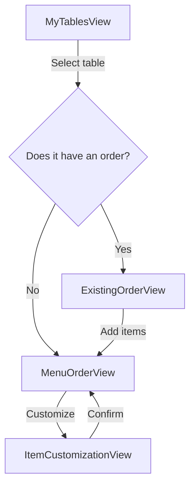
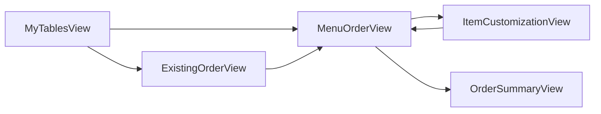
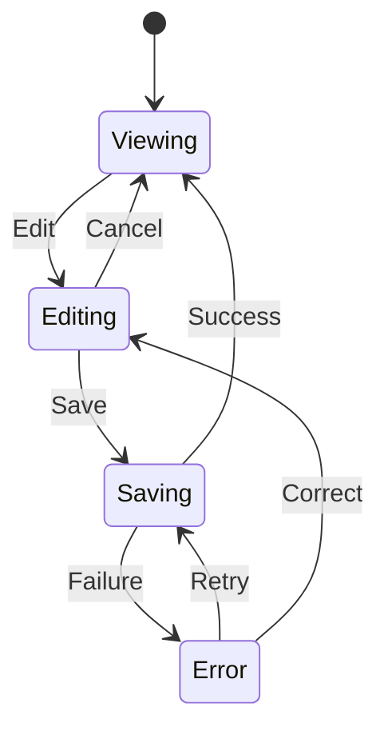

# UI Specification Architecture

## Objective

Transform a **Software Requirements Specification (SRS)** into a structured representation of the user interface that makes it possible to:

- identify the required views;
- define what information each view displays;
- define its controls, actions, states, and constraints;
- represent interaction flows;
- maintain traceability to requirements;
- later generate low-fidelity wireframes or mockups;
- avoid introducing visual design decisions too early.

The UI specification must describe **what must exist and how it relates**, not how it should look.

---

## 1. General Principle

Do not go directly from:

```text
SRS → Mockups
```

Use:

```text
SRS
 ↓
Semantic UI Specification
 ↓
Validation / Audit
 ↓
Low-Fidelity Wireframes
```

The intermediate specification must clearly separate:

```text
UI SEMANTICS

what exists
what information it contains
what the user can do
what states exist
how navigation works
```

from:

```text
VISUAL DESIGN

colors
typography
branding
shadows
border radius
exact spacing
aesthetics
component styling
```

Decisions from the second group do not belong to this stage.

## 2. Artifact Architecture

Three categories of artifacts are used.

### 2.1 Structured Semantic Artifacts

These represent information where explicit structure is more important than visual representation.

Canonical format:

```text
YAML
```

Examples include:

- views;
- regions or sections;
- displayed data;
- input data;
- controls;
- actions;
- constraints;
- declared states;
- requirement references.

YAML is the **source of truth**.

When useful for human readability, Markdown documentation may be automatically generated from the YAML.

```text
YAML
 ├── consumed by agents
 └── generation
       ↓
   Markdown
       ↓
     humans
```

Generated documentation must never become a second source of truth.

---

### 2.2 Graph Semantic Artifacts

When a concept can be properly represented through an existing graphical notation that is also understandable as text, it should not be duplicated in YAML.

Preferred format:

```text
Mermaid
```

It may be used to represent:

- User Flows;
- Task Flows;
- Navigation Flows;
- UML Activity Diagrams;
- State Machines;
- Sequence Diagrams when necessary.

These diagrams function simultaneously as:

- structured representations;
- documentation;
- agent-readable input;
- human-readable visualizations.

Therefore, Mermaid itself is the **source of truth** for these concepts.

Do not create an equivalent YAML representation unless there is a concrete technical need.

---

### 2.3 Derived Artifacts

Artifacts that can be obtained deterministically from other artifacts must not be maintained manually.

Examples:

- Markdown documentation for views;
- Screen Inventory;
- traceability matrix;
- control catalogs;
- view indexes;
- requirement-to-view mappings;
- requirement-to-flow mappings.

These artifacts must be generated from canonical sources.

Rule:

> If an artifact can be deterministically derived from another artifact, it must not become a new source of truth.

---

## 3. Canonical Sources

The architecture must explicitly distinguish sources of truth from projections.

```text
views/*.yaml
    CANONICAL

flows/*.md + Mermaid
    CANONICAL

navigation/*.md + Mermaid
    CANONICAL

states/*.md + Mermaid
    CANONICAL when the diagram is necessary

generated/*
    DERIVED
```

Agents should modify canonical artifacts.

Derived files should be regenerated whenever their sources change.

---

## 4. View Specification

Each view must have a structured YAML specification.

A view represents a meaningful unit of user interaction.

Conceptual example:

```yaml
view:
  id: MenuOrderView

  purpose: >
    Allow the waiter to browse the menu
    and add items to an order.

  actors:
    - WAITER

  requirements:
    - REQ-MENU-ORD-001
    - REQ-MENU-ORD-004

  inputs:
    - name: tableId
      type: UUID
      required: true

    - name: orderId
      type: UUID
      required: false

  regions:
    - id: menu
      role: primary

      data:
        - categories
        - menuItems

      controls:
        - search
        - categoryFilter
        - personalizeItem
        - addItem

    - id: orderSummary
      role: secondary

      data:
        - itemCount
        - total

      controls:
        - viewOrder

  states:
    - normal
    - noResults
    - emptyCategory

  constraints:
    - Only available items may be selectable.
```

The exact schema may evolve, but it must preserve these semantic responsibilities.

---

## 5. What a View Must Define

At minimum, a view specification must be able to express:

```text
Identity
Purpose
Actors
Source requirements

Inputs

Regions / Sections

Displayed data

Controls

Actions

States

Constraints
```

When applicable, it may also include:

```text
outputs
permissions
preconditions
validation
business rules
references to flows
references to state machines
```

---

## 6. Regions and Hierarchy

The specification may indicate semantic hierarchy, but not exact visual layout.

Allowed:

```yaml
regions:
  - id: menu
    role: primary

  - id: orderSummary
    role: secondary
```

This expresses relative importance.

It must not define decisions such as:

```text
sidebar width: 320px
grid columns: 3
margin: 24px
border-radius: 12px
```

Those decisions belong to the design stage.

---

## 7. Controls

Controls must be specified according to their functional intent.

Examples:

```text
input
selection
action
primary_action
navigation
toggle
search
quantity_control
```

The specification should describe:

```text
what the control operates on
what data it requires
what action it triggers
what constraints apply
```

It should not unnecessarily impose a graphical representation.

For example:

```text
categoryFilter
```

does not automatically imply:

```text
dropdown
chips
tabs
sidebar
```

unless an existing requirement explicitly requires one of them.

---

## 8. User Flows and Task Flows

Flows represent how an actor achieves a goal.

They should preferably be modeled using Mermaid.

Example:



Flows should focus on:

```text
goal
actions
decisions
involved views
relevant alternative paths
```

They must not be used to describe visual design.

---

## 9. Navigation Map

A global navigation representation should exist when it provides value.

Its purpose is to show the topology between views independently of a specific use case.

Example:



This artifact may be used to automatically derive the Screen Inventory.

---

## 10. Activity Diagrams

Activity Diagrams are not mandatory.

Use a UML Activity Diagram when a flow has enough complexity to justify it, such as:

- multiple decisions;
- branches;
- loops;
- alternative paths;
- parallelism;
- relevant business rules.

For simple flows, prefer a normal User Flow.

---

## 11. State Machines

Do not create a state machine for every view.

Use one only when a view has temporal behavior or sufficiently complex state transitions.

Example:



For simple states such as:

```text
normal
empty
noResults
```

declaring them directly inside the YAML is sufficient.

---

## 12. Traceability

Every UI decision derived from the SRS must be traceable to one or more requirements.

Example:

```yaml
requirements:
  - REQ-MENU-ORD-001
  - REQ-MENU-ORD-004
```

Flows may also declare related requirements through metadata.

Example:

```yaml
---
id: AddItemsToOrder
requirements:
  - REQ-MENU-ORD-001
  - REQ-MENU-ORD-004
---
```

These references should make it possible to automatically generate a mapping such as:

```text
Requirement → Flow → View → UI Element
```

Traceability should support detection of:

```text
requirements with no UI representation;

views not justified by requirements;

controls not backed by requirements;

requirements unnecessarily duplicated across views.
```

---

## 13. Screen Inventory

The Screen Inventory should not be maintained manually if it can be derived from:

```text
views/*.yaml
+
navigation diagrams
```

It may be generated as documentation:

```text
SCR-001 MyTablesView
SCR-002 ExistingOrderView
SCR-003 MenuOrderView
SCR-004 ItemCustomizationView
...
```

---

## 14. Human Documentation

When YAML is appropriate as a structured representation but inconvenient for human reading, Markdown documentation should be generated.

Example:

```text
MenuOrderView.yaml
       ↓
generator
       ↓
MenuOrderView.md
```

The Markdown representation may include:

- purpose;
- actor;
- requirements;
- input table;
- displayed information;
- controls;
- constraints;
- states;
- flow references.

It must never be maintained independently from the YAML.

---

## 15. Minimal Duplication Principle

Before creating a new artifact, evaluate:

```text
Does another artifact already represent this information correctly?
```

If the answer is yes, do not create a new one.

In particular:

```text
Flow → Mermaid only.

State Machine → Mermaid only.

Structured View Specification → YAML.

Human-readable view documentation → generated from YAML.

Screen Inventory → generated.

Traceability Matrix → generated.
```

---

## 16. Separation Between Specification and Design

The agent responsible for producing this architecture may decide:

```text
which views are necessary;

what purpose each view serves;

what data it displays;

what controls it requires;

what actions exist;

what constraints exist;

what states exist;

how views relate to one another;

how requirements are satisfied.
```

It must not decide yet:

```text
color palette;

typography;

visual aesthetics;

branding;

border radius;

shadows;

exact spacing;

decoration;

final visual style.
```

---

## 17. Wireframe Generation

Wireframes are a later projection of the specification.

```text
              SRS
               │
               ▼
     ┌───────────────────┐
     │ UI specification  │
     └─────────┬─────────┘
               │
        ┌──────┴──────┐
        ▼             ▼
       YAML         Mermaid
        │             │
        └──────┬──────┘
               ▼
             Audit
               │
               ▼
        Low-fi Wireframes
```

The wireframe generator must use the canonical sources and must not freely reinterpret the SRS again.

The wireframe should materialize:

- regions;
- hierarchy;
- data;
- controls;
- navigation;
- relevant states.

It may decide low-level spatial organization when it has not been specified, but it must not introduce new functionality.

---

## 18. No-Unjustified-Inference Rule

The agent may resolve necessary structural presentation decisions, but it must not invent functionality.

If an element cannot be justified by:

- the SRS;
- approved rules;
- the YAML specification;
- an existing flow;
- an existing constraint;

it must not be introduced as new functionality.

---

## 19. Recommended Structure

```text
ui-spec/
│
├── views/
│   ├── MyTablesView.yaml
│   ├── ExistingOrderView.yaml
│   ├── MenuOrderView.yaml
│   └── ...
│
├── flows/
│   ├── create-order.md
│   ├── add-items.md
│   └── ...
│
├── navigation/
│   └── screen-navigation.md
│
├── states/
│   └── ...
│
└── generated/
    ├── views/
    │   ├── MyTablesView.md
    │   ├── MenuOrderView.md
    │   └── ...
    │
    ├── screen-inventory.md
    └── traceability.md
```

The `states/` directory should contain diagrams only when they are actually necessary.

---

## 20. Final Conceptual Model

The architecture uses three types of representation:

| Type                | Canonical Source | Primary Consumer   |
| ------------------- | ---------------- | ------------------ |
| Structured Semantic | YAML             | Agents and tooling |
| Graph Semantic      | Mermaid          | Agents and humans  |
| Derived             | Generated        | Humans / auditing  |

The general principle is:

> Use explicit structure when it improves automated processing, use existing graphical notations when they better represent relationships and behavior, and automatically generate human-readable representations whenever manually maintaining them would duplicate information.

The result should be a **design-independent semantic UI specification**, structured enough to be consumed by agents and traceable enough to generate and audit low-fidelity wireframes from an SRS.
