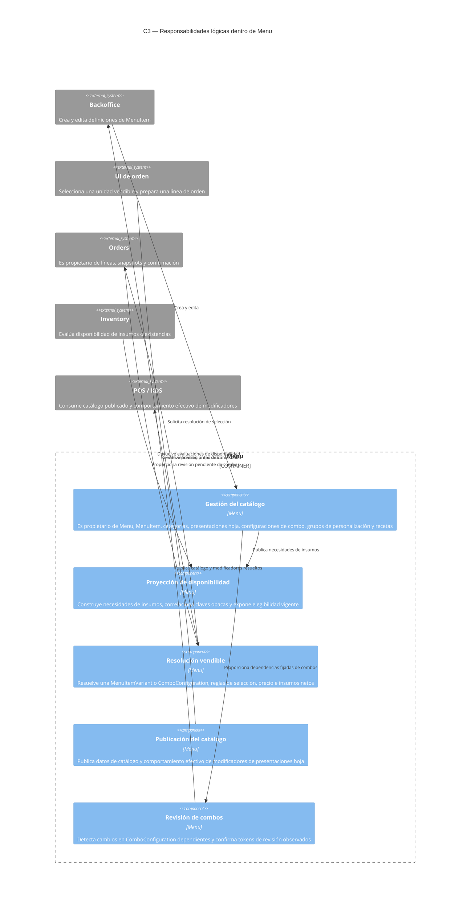
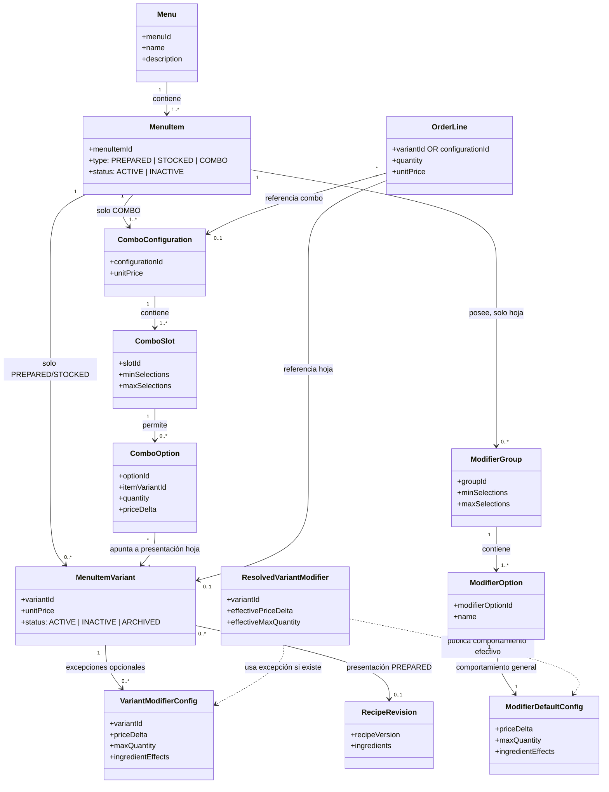

[← Índice](./index.md)

# Diagramas de arquitectura y del dominio

Estos diagramas resumen la especificación vigente de Menu después de `Auditoria-4.md`. Son vistas explicativas de los límites y conceptos documentados; no prescriben clases, unidades de despliegue ni un framework. El comportamiento autoritativo permanece en los requisitos, reglas de negocio y esquemas de interfaces.

## C3 — Componentes lógicos de Menu

La vista C3 separa las responsabilidades ya asignadas a Menu de las responsabilidades que permanecen en servicios externos. `MenuItemVariant` es la unidad vendible de un item hoja; `ComboConfiguration` es la unidad vendible de un combo.

### Cómo leer la vista C3

- `Gestión del catálogo` es propietaria de las definiciones comerciales. No es propietaria de órdenes, existencias ni ajustes finales de Billing.
- `Proyección de disponibilidad` intercambia necesidades y evaluaciones con Inventory mediante claves opacas. Inventory no interpreta MenuItem, presentaciones, recetas, grupos ni espacios.
- `Resolución vendible` recibe `variantId` para una presentación hoja o `configurationId` para un combo; no crea órdenes ni reserva existencias.
- `Publicación del catálogo` es el límite donde los defaults de modificadores y las excepciones de presentaciones hoja se convierten en datos `ResolvedVariantModifier`. POS/KDS y los consumidores de toma de órdenes no resuelven esa precedencia durante la ejecución.
- `Revisión de combos` aplica únicamente a configuraciones de combo dependientes. El historial de versiones de recetas es distinto de la revisión de combos.

## Modelo del dominio

El modelo distingue un item del catálogo de la unidad concreta que se vende al cliente. Un item hoja tiene presentaciones; un combo tiene configuraciones y espacios. Una opción de combo apunta a una presentación hoja y conserva una cantidad física, pero esa cantidad no cambia automáticamente el precio de la configuración.

### Reglas de precio e identidad mostradas por el modelo

- `MenuItemVariant.unitPrice` es el precio absoluto de una presentación PREPARED o STOCKED.
- `ComboConfiguration.unitPrice` es el precio absoluto de una configuración de combo.
- El subtotal de un combo es el precio de su configuración más los `priceDelta` de sus opciones y los modificadores seleccionados en sus presentaciones hoja. No se agregan los `unitPrice` de los componentes.
- Una línea hoja conserva `variantId`; una línea combo conserva `configurationId`. Dos líneas con la misma identidad de item y unidad vendible siguen siendo distintas cuando sus selecciones son diferentes.
