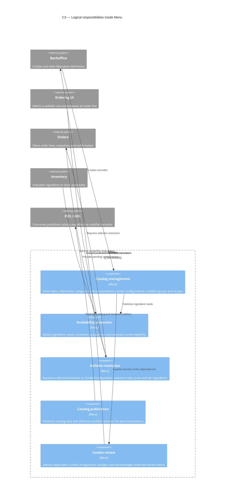
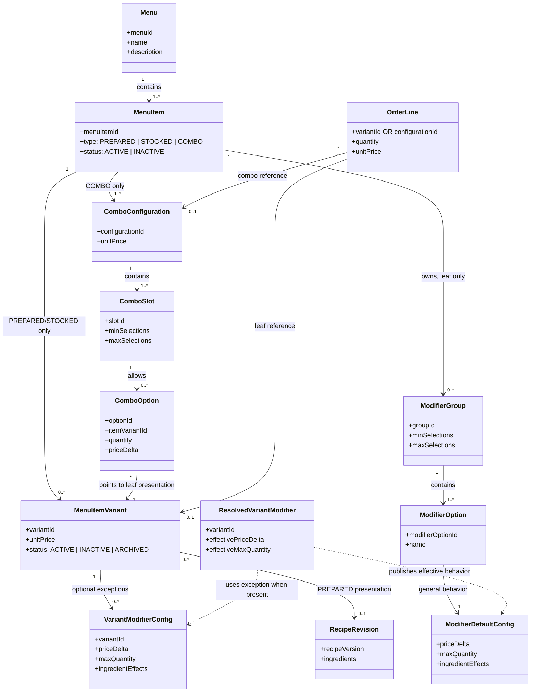

[← Index](./index.md)

# Architecture and domain diagrams

These diagrams summarize the active Menu specification after `Auditoria-4.md`. They are explanatory views of the documented boundaries and concepts; they do not prescribe classes, deployment units or a framework. The authoritative behavior remains in requirements, business rules and interface schemas.

## C3 — Logical components of Menu

The C3 view separates the responsibilities that are already assigned to Menu from the responsibilities that remain with external services. A `MenuItemVariant` is the sellable unit for a leaf item; a `ComboConfiguration` is the sellable unit for a combo.

### Reading the C3 view

- `Catalog management` is the owner of commercial definitions. It does not own orders, stock balances or final billing adjustments.
- `Availability projection` communicates needs and evaluations with Inventory through opaque keys. Inventory does not interpret MenuItem, variants, recipes, groups or slots.
- `Sellable resolution` receives either a leaf `variantId` or a combo `configurationId`; it does not create an order or reserve stock.
- `Catalog publication` is the boundary where modifier defaults and leaf-presentation exceptions become `ResolvedVariantModifier` data. POS/KDS and order-taking consumers do not infer that precedence at runtime.
- `Combo review` applies only to dependent combo configurations. Recipe version history is a separate concern from combo review.

## Domain model

The model distinguishes a catalog item from the concrete unit sold to a customer. A leaf item has presentations; a combo has configurations and slots. A combo option points to a leaf presentation and includes a physical quantity, but that quantity does not automatically change the combo configuration price.

### Price and identity rules shown by the model

- `MenuItemVariant.unitPrice` is the absolute price of a PREPARED or STOCKED presentation.
- `ComboConfiguration.unitPrice` is the absolute price of a combo configuration.
- A combo subtotal is its configuration price plus option `priceDelta` values and modifiers selected on its leaf presentations. Component `unitPrice` values are not added.
- A leaf order line retains `variantId`; a combo order line retains `configurationId`. Two lines with the same item and sellable reference remain different when their selections differ.
