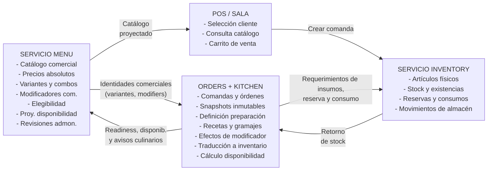
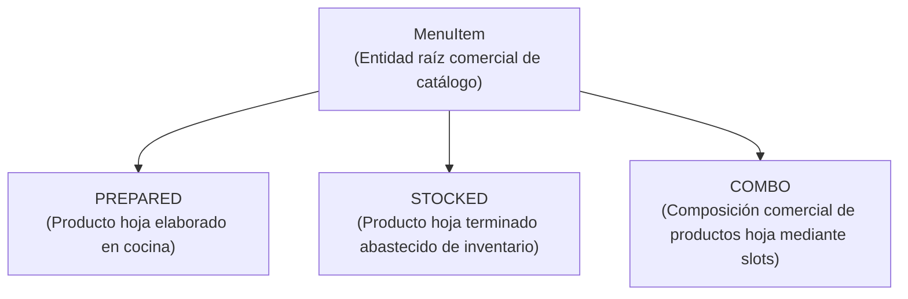
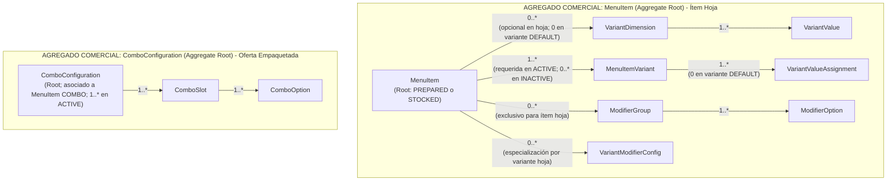
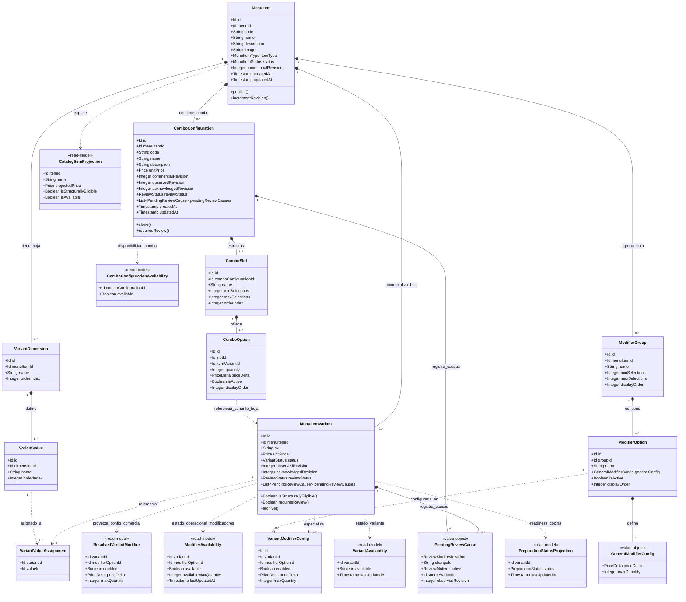
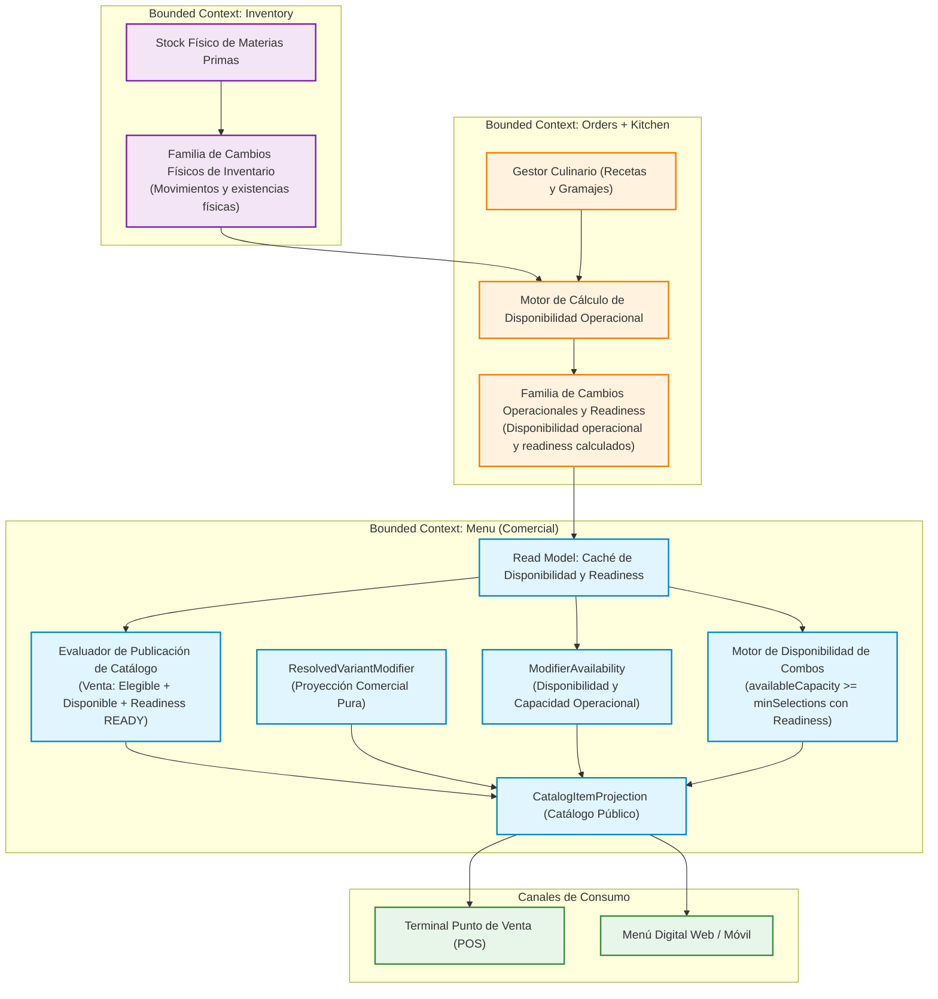

# Especificación Final Vigente del Servicio Menu

**Documento:** Especificación Técnica, Funcional y de Arquitectura de Dominio Consolidada 
**Servicio:** Menu (Sistema de Comandas para Restaurantes) 
**Versión:** 1.3.5 (Consolidada Vigente) 
**Estado:** Vigente / En Revisión con Cuestiones Abiertas Pendientes 
**Fecha:** 2026-09-20

---

## 1. Índice General

- [Especificación Final Vigente del Servicio Menu](#especificación-final-vigente-del-servicio-menu)
  - [1. Índice General](#1-índice-general)
  - [2. Configuración del Documento](#2-configuración-del-documento)
    - [2.1 Identificación y Propósito](#21-identificación-y-propósito)
    - [2.2 Autoridad Temporal y Semántica de las Fuentes](#22-autoridad-temporal-y-semántica-de-las-fuentes)
      - [Regla de Prevalencia](#regla-de-prevalencia)
    - [2.3 Alcance y Exclusiones](#23-alcance-y-exclusiones)
  - [3. Contexto, Alcance y Lenguaje del Dominio](#3-contexto-alcance-y-lenguaje-del-dominio)
    - [3.1 Responsabilidades del Bounded Context Menu](#31-responsabilidades-del-bounded-context-menu)
    - [3.2 Límites de Contexto y Ownership de Datos](#32-límites-de-contexto-y-ownership-de-datos)
    - [3.3 Taxonomía Fundamental del Menú](#33-taxonomía-fundamental-del-menú)
    - [3.4 Ortogonalidad de Dimensiones Operacionales y Administrativas](#34-ortogonalidad-de-dimensiones-operacionales-y-administrativas)
    - [3.5 Glosario Normativo del Dominio](#35-glosario-normativo-del-dominio)
  - [4. Requisitos Funcionales Consolidados](#4-requisitos-funcionales-consolidados)
    - [4.1 Definición y Catálogo de MenuItems](#41-definición-y-catálogo-de-menuitems)
      - [REQ-MENU-ITM-001 — Definición del MenuItem Comercial](#req-menu-itm-001--definición-del-menuitem-comercial)
      - [REQ-MENU-ITM-002 — Transición de Estado Administrativo](#req-menu-itm-002--transición-de-estado-administrativo)
    - [4.2 Variantes de Productos Hoja](#42-variantes-de-productos-hoja)
      - [REQ-MENU-VAR-001 — Presentación Vendible de Item Hoja (Default Variant)](#req-menu-var-001--presentación-vendible-de-item-hoja-default-variant)
      - [REQ-MENU-VAR-002 — Definición de Dimensión de Variante](#req-menu-var-002--definición-de-dimensión-de-variante)
      - [REQ-MENU-VAR-003 — Valor de Dimensión de Variante](#req-menu-var-003--valor-de-dimensión-de-variante)
      - [REQ-MENU-VAR-004 — Definición de Variantes Vendibles](#req-menu-var-004--definición-de-variantes-vendibles)
      - [REQ-MENU-VAR-005 — Migración Atómica de Variante Predeterminada](#req-menu-var-005--migración-atómica-de-variante-predeterminada)
      - [REQ-MENU-VAR-006 — Elegibilidad Estructural de Variante Hoja](#req-menu-var-006--elegibilidad-estructural-de-variante-hoja)
    - [4.3 Precios Autoritativos y Proyección de Catálogo](#43-precios-autoritativos-y-proyección-de-catálogo)
      - [REQ-MENU-PRC-001 — Precio Absoluto Autoritativo de la Variante](#req-menu-prc-001--precio-absoluto-autoritativo-de-la-variante)
      - [REQ-MENU-PRC-002 — Proyección del Precio de Catálogo](#req-menu-prc-002--proyección-del-precio-de-catálogo)
      - [REQ-MENU-PRC-003 — Exclusión de Catálogo sin Unidades Elegibles](#req-menu-prc-003--exclusión-de-catálogo-sin-unidades-elegibles)
    - [4.4 Grupos y Opciones de Modificadores Comerciales](#44-grupos-y-opciones-de-modificadores-comerciales)
      - [REQ-MENU-MOD-001 — Definición de Grupos de Modificadores en el Item Hoja](#req-menu-mod-001--definición-de-grupos-de-modificadores-en-el-item-hoja)
      - [REQ-MENU-MOD-002 — Opciones de Modificador y Configuración General Comercial](#req-menu-mod-002--opciones-de-modificador-y-configuración-general-comercial)
      - [REQ-MENU-MOD-003 — Especialización Comercial de Modificador por Variante (VariantModifierConfig)](#req-menu-mod-003--especialización-comercial-de-modificador-por-variante-variantmodifierconfig)
      - [REQ-MENU-MOD-004 — Copia Administrativa de Configuraciones de Modificadores](#req-menu-mod-004--copia-administrativa-de-configuraciones-de-modificadores)
      - [REQ-MENU-MOD-005 — Proyección de Modificadores Efectivos Comerciales (ResolvedVariantModifier)](#req-menu-mod-005--proyección-de-modificadores-efectivos-comerciales-resolvedvariantmodifier)
    - [4.5 Combos, Configuraciones, Slots y Opciones](#45-combos-configuraciones-slots-y-opciones)
      - [REQ-MENU-COM-001 — Configuración de Combo (ComboConfiguration)](#req-menu-com-001--configuración-de-combo-comboconfiguration)
      - [REQ-MENU-COM-002 — Definición del Espacio de Selección (ComboSlot)](#req-menu-com-002--definición-del-espacio-de-selección-comboslot)
      - [REQ-MENU-COM-003 — Opciones de Combo Vinculadas Directamente a la Variante Hoja](#req-menu-com-003--opciones-de-combo-vinculadas-directamente-a-la-variante-hoja)
      - [REQ-MENU-COM-004 — Copia Administrativa de Configuración de Combo](#req-menu-com-004--copia-administrativa-de-configuración-de-combo)
      - [REQ-MENU-COM-005 — Asignación Múltiple de Opciones de Combo con Atomicidad por Destino](#req-menu-com-005--asignación-múltiple-de-opciones-de-combo-con-atomicidad-por-destino)
      - [REQ-MENU-COM-006 — Elegibilidad Estructural de Configuración de Combo](#req-menu-com-006--elegibilidad-estructural-de-configuración-de-combo)
    - [4.6 Ciclo de Vida, Archivado y Reglas Incompletas](#46-ciclo-de-vida-archivado-y-reglas-incompletas)
      - [REQ-MENU-LIF-001 — Archivado de Variante y Reevaluación No Obstructiva de Dependencias](#req-menu-lif-001--archivado-de-variante-y-reevaluación-no-obstructiva-de-dependencias)
      - [REQ-MENU-LIF-002 — Guardado de Definiciones Incompletas en Contexto Inactivo](#req-menu-lif-002--guardado-de-definiciones-incompletas-en-contexto-inactivo)
      - [REQ-MENU-LIF-003 — Advertencias de Capacidad Faltante](#req-menu-lif-003--advertencias-de-capacidad-faltante)
    - [4.7 Versionado Inmutable de Definiciones Comerciales](#47-versionado-inmutable-de-definiciones-comerciales)
      - [REQ-MENU-VER-001 — Generación de Revisión Inmutable de MenuItem](#req-menu-ver-001--generación-de-revisión-inmutable-de-menuitem)
    - [4.8 Detección, Gestión y Seguimiento de Revisiones](#48-detección-gestión-y-seguimiento-de-revisiones)
      - [REQ-MENU-REV-001 — Detección de Necesidad de Revisión (REVIEW\_REQUIRED) por Cambios Comerciales y Culinarios](#req-menu-rev-001--detección-de-necesidad-de-revisión-review_required-por-cambios-comerciales-y-culinarios)
      - [REQ-MENU-REV-002 — Visibilidad Administrativa del Estado de Revisión](#req-menu-rev-002--visibilidad-administrativa-del-estado-de-revisión)
      - [REQ-MENU-REV-003 — Seguimiento Desacoplado Mediante observedRevision y acknowledgedRevision](#req-menu-rev-003--seguimiento-desacoplado-mediante-observedrevision-y-acknowledgedrevision)
      - [REQ-MENU-REV-004 — Conservación de la Configuración Comercial al Confirmar Revisión](#req-menu-rev-004--conservación-de-la-configuración-comercial-al-confirmar-revisión)
      - [REQ-MENU-REV-005 — Referencia Visual del Slot (Precios Informativos)](#req-menu-rev-005--referencia-visual-del-slot-precios-informativos)
      - [REQ-MENU-REV-006 — No Disparación de Revisión por Disponibilidad Operacional](#req-menu-rev-006--no-disparación-de-revisión-por-disponibilidad-operacional)
    - [4.9 Publicación, Proyecciones, Readiness y Disponibilidad](#49-publicación-proyecciones-readiness-y-disponibilidad)
      - [REQ-MENU-AVL-001 — Publicación Conceptual y Notificación de Catálogo](#req-menu-avl-001--publicación-conceptual-y-notificación-de-catálogo)
      - [REQ-MENU-AVL-002 — Recepción y Proyección de Disponibilidad Operacional Desacoplada](#req-menu-avl-002--recepción-y-proyección-de-disponibilidad-operacional-desacoplada)
      - [REQ-MENU-AVL-003 — Recepción y Proyección de Readiness de Preparación (PreparationStatus)](#req-menu-avl-003--recepción-y-proyección-de-readiness-de-preparación-preparationstatus)
      - [REQ-MENU-AVL-004 — Proyección de Disponibilidad Granular de Variante (VariantAvailability)](#req-menu-avl-004--proyección-de-disponibilidad-granular-de-variante-variantavailability)
      - [REQ-MENU-AVL-005 — Proyección de Disponibilidad de Modificadores (ModifierAvailability)](#req-menu-avl-005--proyección-de-disponibilidad-de-modificadores-modifieravailability)
      - [REQ-MENU-AVL-006 — Propagación de Disponibilidad a Opciones, Slots y Configuraciones de Combo (ComboConfigurationAvailability)](#req-menu-avl-006--propagación-de-disponibilidad-a-opciones-slots-y-configuraciones-de-combo-comboconfigurationavailability)
      - [REQ-MENU-AVL-007 — Derivación de Disponibilidad Agregada de MenuItem para Catálogo](#req-menu-avl-007--derivación-de-disponibilidad-agregada-de-menuitem-para-catálogo)
  - [5. Requisitos No Funcionales](#5-requisitos-no-funcionales)
    - [5.1 Presupuesto de Rendimiento de Aceptación (ADR-004)](#51-presupuesto-de-rendimiento-de-aceptación-adr-004)
    - [5.2 Perfil Nominal de Operación](#52-perfil-nominal-de-operación)
    - [5.3 Objetivos de Latencia por Clase de Operación](#53-objetivos-de-latencia-por-clase-de-operación)
    - [5.4 Capacidad ante Ráfagas (Burst)](#54-capacidad-ante-ráfagas-burst)
    - [5.5 Concurrencia e Integridad Transaccional](#55-concurrencia-e-integridad-transaccional)
    - [5.6 Resiliencia y Desacoplamiento de Disponibilidad Operacional](#56-resiliencia-y-desacoplamiento-de-disponibilidad-operacional)
  - [6. Reglas de Negocio e Invariantes del Dominio](#6-reglas-de-negocio-e-invariantes-del-dominio)
    - [6.1 Reglas de Negocio (BR-MENU)](#61-reglas-de-negocio-br-menu)
    - [6.2 Invariantes de Integridad del Dominio (INV-MENU)](#62-invariantes-de-integridad-del-dominio-inv-menu)
  - [7. Modelo de Dominio](#7-modelo-de-dominio)
    - [7.1 Agregados y Límites de Consistencia](#71-agregados-y-límites-de-consistencia)
      - [Agregado MenuItem](#agregado-menuitem)
      - [Agregado ComboConfiguration](#agregado-comboconfiguration)
    - [7.2 Entidades y Atributos Principales](#72-entidades-y-atributos-principales)
    - [7.3 Value Objects](#73-value-objects)
      - [1. PreparationStatus (Proyectado)](#1-preparationstatus-proyectado)
      - [2. DimensionSelection](#2-dimensionselection)
      - [3. PriceDelta](#3-pricedelta)
      - [4. RevisionMetadata](#4-revisionmetadata)
      - [5. PendingReviewCause](#5-pendingreviewcause)
    - [7.4 Proyecciones de Consulta (Read Models)](#74-proyecciones-de-consulta-read-models)
      - [1. ResolvedVariantModifier (DTO de Lectura Comercial)](#1-resolvedvariantmodifier-dto-de-lectura-comercial)
      - [2. VariantAvailability (Read Model de Cocina)](#2-variantavailability-read-model-de-cocina)
      - [3. PreparationStatus (Read Model de Readiness de Cocina)](#3-preparationstatus-read-model-de-readiness-de-cocina)
      - [4. ModifierAvailability (Read Model de Cocina)](#4-modifieravailability-read-model-de-cocina)
      - [5. ComboConfigurationAvailability (Proyección Dinámica)](#5-comboconfigurationavailability-proyección-dinámica)
      - [6. CatalogItemProjection](#6-catalogitemprojection)
      - [7. SlotPriceReference (DTO de Lectura Informativa)](#7-slotpricereference-dto-de-lectura-informativa)
    - [7.5 Diagramas Estructurales y de Comportamiento](#75-diagramas-estructurales-y-de-comportamiento)
      - [Diagrama de Clases del Dominio Comercial](#diagrama-de-clases-del-dominio-comercial)
      - [Diagrama de Estados: 5 Dimensiones Ortogonales](#diagrama-de-estados-5-dimensiones-ortogonales)
      - [Diagrama de Flujo: Proyección y Propagación de Disponibilidad](#diagrama-de-flujo-proyección-y-propagación-de-disponibilidad)
  - [8. Arquitectura y Límites del Sistema](#8-arquitectura-y-límites-del-sistema)
    - [8.1 Diagrama de Contexto de Bounded Contexts](#81-diagrama-de-contexto-de-bounded-contexts)
    - [8.2 Patrones de Interacción y Comunicación](#82-patrones-de-interacción-y-comunicación)
    - [8.3 Aislamiento Lógico y Reglas de Integración](#83-aislamiento-lógico-y-reglas-de-integración)
  - [9. Modelo de Datos Lógico](#9-modelo-de-datos-lógico)
    - [9.1 Modelo Lógico de Datos Comercial](#91-modelo-lógico-de-datos-comercial)
      - [Entidad Lógica: `MenuItem`](#entidad-lógica-menuitem)
      - [Entidad Lógica: `VariantDimension`](#entidad-lógica-variantdimension)
      - [Entidad Lógica: `VariantValue`](#entidad-lógica-variantvalue)
      - [Entidad Lógica: `MenuItemVariant`](#entidad-lógica-menuitemvariant)
      - [Estructura Lógica: `VariantValueAssignment`](#estructura-lógica-variantvalueassignment)
      - [Entidad Lógica: `ModifierGroup`](#entidad-lógica-modifiergroup)
      - [Entidad Lógica: `ModifierOption`](#entidad-lógica-modifieroption)
      - [Estructura Lógica: `VariantModifierConfig`](#estructura-lógica-variantmodifierconfig)
      - [Entidad Lógica: `ComboConfiguration`](#entidad-lógica-comboconfiguration)
      - [Estructura Lógica: `PendingReviewCause`](#estructura-lógica-pendingreviewcause)
      - [Entidad Lógica: `ComboSlot`](#entidad-lógica-comboslot)
      - [Entidad Lógica: `ComboOption`](#entidad-lógica-combooption)
    - [9.2 Proyecciones Lógicas de Disponibilidad y Readiness (Caché Local)](#92-proyecciones-lógicas-de-disponibilidad-y-readiness-caché-local)
      - [Proyección Lógica: `VariantAvailability`](#proyección-lógica-variantavailability)
      - [Proyección Lógica: `PreparationStatus`](#proyección-lógica-preparationstatus)
      - [Proyección Lógica: `ModifierAvailability`](#proyección-lógica-modifieravailability)
    - [9.3 Referencias Externas Desacopladas](#93-referencias-externas-desacopladas)
    - [9.4 Estrategia de Versionado Histórico e Inmutabilidad](#94-estrategia-de-versionado-histórico-e-inmutabilidad)
  - [10. Capacidades y Flujos Lógicos de Entrada y Salida](#10-capacidades-y-flujos-lógicos-de-entrada-y-salida)
    - [10.1 Capacidad Lógica de Consulta Pública de Catálogo](#101-capacidad-lógica-de-consulta-pública-de-catálogo)
      - [1. Flujo Lógico de Consulta General de Catálogo](#1-flujo-lógico-de-consulta-general-de-catálogo)
      - [2. Flujo Lógico de Detalle Comercial y Configuración de Ítem](#2-flujo-lógico-de-detalle-comercial-y-configuración-de-ítem)
      - [3. Flujo Lógico de Consulta y Evaluación de Combos](#3-flujo-lógico-de-consulta-y-evaluación-de-combos)
    - [10.2 Capacidades Lógicas Administrativas y de Gestión de Combos](#102-capacidades-lógicas-administrativas-y-de-gestión-de-combos)
      - [1. Flujo Lógico de Clonación Profunda de Combo](#1-flujo-lógico-de-clonación-profunda-de-combo)
      - [2. Flujo Lógico de Copia de Ranuras (Slots) entre Combos](#2-flujo-lógico-de-copia-de-ranuras-slots-entre-combos)
      - [3. Flujo Lógico de Replicación Masiva de Configuraciones de Combos](#3-flujo-lógico-de-replicación-masiva-de-configuraciones-de-combos)
    - [10.3 Capacidad Lógica de Gestión y Confirmación de Revisiones](#103-capacidad-lógica-de-gestión-y-confirmación-de-revisiones)
      - [1. Flujo Lógico de Consulta de Revisiones Pendientes](#1-flujo-lógico-de-consulta-de-revisiones-pendientes)
      - [2. Flujo Lógico de Confirmación Formal de Revisión](#2-flujo-lógico-de-confirmación-formal-de-revisión)
  - [11. Familias Conceptuales de Eventos y Notificaciones](#11-familias-conceptuales-de-eventos-y-notificaciones)
    - [11.1 Familias Conceptuales de Notificaciones Emitidas por Menú](#111-familias-conceptuales-de-notificaciones-emitidas-por-menú)
    - [11.2 Familias Conceptuales de Notificaciones Consumidas por Menú](#112-familias-conceptuales-de-notificaciones-consumidas-por-menú)
    - [11.3 Delimitación de Eventos Físicos de Cocina e Inventario](#113-delimitación-de-eventos-físicos-de-cocina-e-inventario)
    - [11.4 Estado de Transporte y Middleware (OPEN-007)](#114-estado-de-transporte-y-middleware-open-007)
  - [12. Datos Requeridos de Otros Servicios y Ownership](#12-datos-requeridos-de-otros-servicios-y-ownership)
    - [12.1 Integración con Orders + Kitchen](#121-integración-con-orders--kitchen)
    - [12.2 Relación Indirecta con Inventory](#122-relación-indirecta-con-inventory)
    - [12.3 Interacción con POS / Sala](#123-interacción-con-pos--sala)
  - [13. Decisiones de Diseño, Integración y Cuestiones Abiertas (OPEN)](#13-decisiones-de-diseño-integración-y-cuestiones-abiertas-open)
    - [13.1 Estado de OPEN-002: Copia de ComboSlot y Atomicidad de Copia Masiva](#131-estado-de-open-002-copia-de-comboslot-y-atomicidad-de-copia-masiva)
      - [1. Decisiones Consolidadas en Auditoría 4](#1-decisiones-consolidadas-en-auditoría-4)
      - [2. Cuestiones Técnicas Pendientes (OPEN)](#2-cuestiones-técnicas-pendientes-open)
    - [13.2 Estado de OPEN-007: Contratos Técnicos Externos, Invalidación y Transporte](#132-estado-de-open-007-contratos-técnicos-externos-invalidación-y-transporte)
      - [1. Decisiones Consolidadas en Auditoría 4](#1-decisiones-consolidadas-en-auditoría-4-1)
      - [2. Cuestiones Técnicas Pendientes (OPEN)](#2-cuestiones-técnicas-pendientes-open-1)
    - [13.3 Estado de OPEN-009: Porciones de Componentes y Modificadores Repetidos en Combos](#133-estado-de-open-009-porciones-de-componentes-y-modificadores-repetidos-en-combos)
      - [1. Decisiones Consolidadas en Auditoría 4](#1-decisiones-consolidadas-en-auditoría-4-2)
      - [2. Cuestiones Técnicas Pendientes (OPEN)](#2-cuestiones-técnicas-pendientes-open-2)
    - [13.4 Estado de OPEN-010: Restricciones Cuantitativas, Moneda y Tipos Lógicos](#134-estado-de-open-010-restricciones-cuantitativas-moneda-y-tipos-lógicos)
      - [1. Decisiones Consolidadas en Auditoría 4](#1-decisiones-consolidadas-en-auditoría-4-3)
      - [2. Cuestiones Técnicas Pendientes (OPEN)](#2-cuestiones-técnicas-pendientes-open-3)
  - [14. Matriz de Trazabilidad](#14-matriz-de-trazabilidad)
    - [14.1 Trazabilidad de Requisitos Aprobados (Req-F-Aproved.md)](#141-trazabilidad-de-requisitos-aprobados-req-f-aprovedmd)
    - [14.2 Trazabilidad de Nuevas Obligaciones de Auditoria-4.md](#142-trazabilidad-de-nuevas-obligaciones-de-auditoria-4md)
    - [14.3 Trazabilidad de Reglas de Negocio e Invariantes](#143-trazabilidad-de-reglas-de-negocio-e-invariantes)
    - [14.4 Trazabilidad de Cuestiones de Diseño e Integración (OPEN)](#144-trazabilidad-de-cuestiones-de-diseño-e-integración-open)

---

## 2. Configuración del Documento

### 2.1 Identificación y Propósito

El presente documento constituye la especificación técnica, funcional, estructural y de arquitectura consolidada y vigente para el servicio **Menu**, componente del sistema de comandas y gestión de restaurantes.

Su objetivo es constituirse como la **fuente autorizada de verdad consolidada del servicio Menu**, proporcionando un modelo coherente, riguroso y verificable derivado exclusivamente de las diez fuentes autorizadas del proyecto.

La versión **1.3.5** (fecha 2026-09-20) consolida la especificación del servicio Menu aplicando **Auditoria-4.md** como autoridad cronológica final y subsana las inconsistencias normativas y estructurales detectadas:

1. Precisa las cardinalidades por tipo y la completitud dependiente del estado: los ítems hoja utilizan `MenuItemVariant` y dimensiones comerciales opcionales (`0..*`) que permiten la variante técnica `DEFAULT` sin valores de dimensión, mientras que los ítems COMBO utilizan `ComboConfiguration` y no poseen variantes ni dimensiones; las definiciones incompletas y advertencias de capacidad insuficiente son admisibles exclusivamente en estado `INACTIVE`, exigiéndose validez completa para activar (`ACTIVE`) sin imponer mínimos incondicionales incompatibles.
2. Unifica de forma rigurosa la semántica y nomenclatura de disponibilidad: adopta de manera uniforme `VariantAvailability(variantId, available)`, `ModifierAvailability(variantId, modifierOptionId, available, availableMaxQuantity)` y `ComboConfigurationAvailability.available` para la disponibilidad granular y de configuraciones, reservando `isAvailable` de forma exclusiva para la disponibilidad agregada de `CatalogItemProjection`.
3. Modela `PreparationStatus` como proyección independiente de `VariantAvailability` y de la disponibilidad agregada, limitando `INCOMPLETE` exclusivamente a readiness operacional inválido o incompleto informado por Orders + Kitchen, excluyendo explícitamente `reviewStatus` y cualquier revisión administrativa como causa, garantizando que una revisión pendiente no bloquee por sí sola la venta.
4. Mantiene `ResolvedVariantModifier` como proyección exclusivamente comercial con `variantId`, `modifierOptionId`, `enabled`, `priceDelta` y `maxQuantity`, desacoplada de la disponibilidad operacional y de efectos culinarios.
5. Retira cualquier prescripción sobre topología o implementación física de persistencia (eliminando afirmaciones sobre compartir o no tablas o bases de datos), manteniendo explícitamente abierta la topología física bajo un modelo de aislamiento lógico estricto entre bounded contexts, ownership exclusivo y referencias inter-contexto mediante identificadores opacos.
6. Representa `ModifierOption.generalConfig` explícitamente como estructura anidada que contiene `priceDelta` y `maxQuantity` en todas las representaciones (requisitos, glosario, tablas de entidades, modelo lógico y diagramas), sin exponer dichos atributos como campos planos directos de `ModifierOption`, conservando planos únicamente `VariantModifierConfig` y `ResolvedVariantModifier`.
7. Ajusta los metadatos de revisión inmutable a los principios conceptuales de versionado de ADR-006 sin esquemas físicos prescriptivos ni campos no autorizados.
8. Elimina límites numéricos no sustentados para `orderIndex`, `displayOrder`, `observedRevision`, `acknowledgedRevision` y `availableMaxQuantity`, conservando sus conceptos lógicos sin fijar rangos artificiales, y preservando estrictamente las restricciones cuantitativas confirmadas para selecciones, `maxQuantity` y `ComboOption.quantity`.
9. Incorpora una representación lógica de las causas pendientes de revisión para `MenuItemVariant` y `ComboConfiguration`, formalizando en una regla específica (`BR-MENU-031`) que una `ComboOption` configurada continúa siendo dependencia aunque esté deshabilitada y que una nueva revisión de receta no produce aviso hasta que la `MenuItemVariant` la adopte explícitamente, excluyendo cambios cosméticos, stock y variantes no referenciadas, con motivos estructurados (`PRICE`, `COMPOSITION`, `MODIFIERS`, `STATUS`) y propagación culinaria hacia combos dependientes sin bloquear la venta.
10. Mantiene la referencia visual de precios por slot en `REQ-MENU-REV-005`: para cada `ComboSlot` y sus `baseOptionIds`, `saved` suma los precios fijados de las variantes base multiplicados por `ComboOption.quantity`; `current` usa los precios actuales de esas mismas variantes y cantidades; `difference = current - saved`; los tres valores son informativos y no modifican `ComboConfiguration.unitPrice`.
11. Exige en `REQ-MENU-COM-005` y en los flujos administrativos de copia identificadores explícitos y mapeo unívoco `sourceSlotId -> targetSlotId` o directiva de creación por cada destino, rechazando heurísticas basadas en nombres o posiciones, y corrigiendo las referencias hacia las reglas pertinentes de copia (`BR-MENU-026`, `BR-MENU-027`, `BR-MENU-028`).
12. Incorpora explícitamente los atributos principales `menuId` e `image` a la entidad `MenuItem` de forma coherente en la tabla de entidades, el diagrama de clases Mermaid y el modelo lógico.

Por consiguiente, el estado del documento se declara como **Vigente / En Revisión con Cuestiones Abiertas Pendientes**, reflejando con honestidad técnica que el modelo conceptual y funcional se encuentra consolidado bajo las fuentes vigentes mientras que los detalles técnicos de implementación no definidos por el negocio permanecen abiertos. La presente revisión documental constituye una especificación analítica y normativa, no una prueba de implementación, integración o comportamiento en ejecución.

### 2.2 Autoridad Temporal y Semántica de las Fuentes

La especificación se fundamenta estrictamente en la evolución cronológica y jerárquica de las diez fuentes autorizadas del proyecto:

1. **`Problema-Inicial.md`** (Origen del problema, identificación de ambigüedades estructurales en modificadores e instrucciones de cocción).
2. **`Consultoria-1.md`** (Análisis de rendimiento, perfil de carga para restaurantes y límites de latencia).
3. **`Consultoria-2.md`** (Desacoplamiento de variantes e inventario, archivado, outbox y consistencia asíncrona).
4. **`Auditoria-1.md`** (Detección de agujeros y debilidades del modelo conceptual inicial).
5. **`Auditoria-2.md`** (Propuestas de solución: patrón Default Variant, variante como unidad vendible).
6. **`Modelo-Pre-Final.md`** (Modelo intermedio de taxonomía comercial y cumplimiento).
7. **`Decisiones-cierre-invariantes.md`** (Cierres arquitectónicos formales ADR-001 a ADR-008).
8. **`Req-F-Aproved.md`** (Base de 41 requisitos funcionales formalmente aprobados).
9. **`Auditoria-3.md`** (Diseño consolidado de dominio, propiedad de modificadores en item hoja con especialización opcional, desacoplamiento estricto de combos y reevaluación no obstructiva por archivado de variantes).
10. **`Auditoria-4.md`** (Autoridad cronológica final: síntesis consolidada del modelo, separación estricta de responsabilidades entre Menu, Orders + Kitchen e Inventory, eliminación de recetas y efectos físicos en Menu, readiness y disponibilidad calculados por Orders + Kitchen, revisiones comerciales y culinarias desacopladas).

#### Regla de Prevalencia

Una fuente posterior sustituye a una anterior en caso de contradicción explícita o cuando la decisión posterior refine de forma incompatible el modelo previo:

- **`Auditoria-4.md`** ostenta la máxima jerarquía resolutiva y cronológica sobre la arquitectura, ownership de datos, separación de servicios, eventos e interfaces. Cualquier modelo previo que asignara a Menu recetas, efectos sobre ingredientes, cálculo físico de disponibilidad, mapeo de artículos de almacén o resolución neta de insumos queda formalmente reemplazado por la separación Menu → Orders + Kitchen → Inventory establecida en `Auditoria-4.md`.
- **`Auditoria-3.md`** representa la base más estable del catálogo comercial para la propiedad de modificadores en el item hoja, la especialización comercial por variante, el desacoplamiento de combos y la reevaluación no obstructiva por archivado de variantes (prevaleciendo sobre la restricción previa de rechazo obligatorio de `Req-F-Aproved.md` y ADR-005).
- **`Req-F-Aproved.md`** aporta la línea base de los 41 requisitos funcionales aprobados. Sus requisitos se conservan vigentes salvo cuando una decisión posterior de `Auditoria-3.md` o `Auditoria-4.md` los contradiga, refine o vuelva obsoletos, en cuyo caso se actualizan o marcan como reemplazados con trazabilidad explícita individual.
- Se excluyen terminantemente del historial y de la regla de prevalencia todas las referencias a refinamientos, aclaraciones o revisiones posteriores no contenidas en las diez fuentes autorizadas.

### 2.3 Alcance y Exclusiones

- **Dentro del alcance del servicio Menu:**
  - Definición y mantenimiento del catálogo comercial: items, presentaciones vendibles hoja (`MenuItemVariant`), combos (`ComboConfiguration`), slots y opciones.
  * Custodia de precios unitarios absolutos autoritativos en variantes y configuraciones de combo, así como deltas comerciales de modificadores y opciones.
  - Proyección de precios de catálogo (`$X`, `Desde $X`).
  - Modelado de dimensiones (`VariantDimension`) y valores (`VariantValue`) para variantes hoja.
  - Variante técnica predeterminada (`DEFAULT`) cuando comercialmente no se exponen opciones de presentación.
  - Grupos de modificadores (`ModifierGroup`) y opciones (`ModifierOption`) comerciales en items hoja, junto con especializaciones comerciales por variante (`VariantModifierConfig`).
  - Proyección comercial efectiva de modificadores (`ResolvedVariantModifier`) hacia canales de venta (POS).
  - Gestión de estados administrativos (`ACTIVE`, `INACTIVE` para `MenuItem`; transiciones `ACTIVE <-> INACTIVE` y archivado irreversible `ARCHIVED` para `MenuItemVariant`; `ComboConfiguration` no posee estado administrativo de ciclo de vida propio).
  - Reglas de elegibilidad estructural de items hoja y combos.
  - Exclusión estricta de conceptos no autorizados: no se adoptan banderas booleanas redundantes para modificadores, ni conceptos de niveles o conteos de gratuidad no respaldados.
  - Recepción y proyección operacional de readiness de preparación (`PreparationStatus`: `READY` / `INCOMPLETE`) publicado por Orders + Kitchen.
  - Recepción y proyección operacional de disponibilidad de variantes y modificadores publicada por Orders + Kitchen.
  - Propagación de disponibilidad operacional hacia opciones de combo, slots (`availableCapacity`) y configuraciones de combo (`ComboConfigurationAvailability`), así como derivación agregada para catálogo (`CatalogItemProjection.isAvailable`).
  - Gestión y visibilidad del estado de supervisión administrativa de revisiones (`reviewStatus`: `UP_TO_DATE`, `REVIEW_REQUIRED`) diferenciando causas comerciales de avisos culinarios, con seguimiento desacoplado mediante `observedRevision` y `acknowledgedRevision`.
  - Versionado inmutable de definiciones comerciales del menú (`<number>_<ISO8601>`).

- **Fuera del alcance del servicio Menu (Responsabilidad exclusiva de otros servicios):**
  - **Orders + Kitchen:** Creación y ciclo de vida de órdenes de comanda; congelamiento de snapshots inmutables de venta; definiciones culinarias de preparación; recetas (`Recipe`), ingredientes, gramajes e instrucciones de cocina; revisiones de preparación (`PreparationRevision`); interpretación física de modificadores (adición u omisión de insumos); resolución física de productos almacenados (`STOCKED`) hacia artículos de inventario; traducción de variantes y modificadores a requerimientos físicos de Inventory; evaluación y cálculo de disponibilidad operacional en tiempo real; gestión y publicación de readiness de preparación; emisión de comandas físicas o electrónicas para estaciones de cocina.
  - **Inventory:** Custodia del inventario físico, bodegas, almacenes, existencias disponibles, cálculo de stock remanente, mermas, órdenes de compra, reservas físicas, liberaciones, consumos atómicos y movimientos de almacén.
  - **POS / Sala:** Renderizado de interfaces gráficas de usuario, interacción táctil, lógica local de carritos de compra, navegación de pantallas y hardware terminal.

---

---

## 3. Contexto, Alcance y Lenguaje del Dominio

### 3.1 Responsabilidades del Bounded Context Menu

El servicio Menu es la autoridad exclusiva sobre la **oferta comercial vendible** del restaurante. Sus responsabilidades se concentran en responder tres preguntas comerciales fundamentales:

1. ¿Qué productos o paquetes se venden al cliente?
2. ¿Cómo puede el cliente configurar o personalizar comercialmente su selección?
3. ¿Cuánto cuesta cada producto, opción o combinación ofrecida?

En consecuencia, las responsabilidades de Menu abarcan:

- Administrar el catálogo de productos comerciales y su clasificación (categorías de hojas y categorías de combos).
- Definir las presentaciones vendibles hoja (`MenuItemVariant`) y las configuraciones de combo (`ComboConfiguration`).
- Custodiar los precios unitarios absolutos autoritativos de variantes y configuraciones de combo.
- Modelar las dimensiones comerciales y sus valores para variantes hoja, de carácter opcional para admitir la variante técnica `DEFAULT` sin dimensiones.
- Proveer la variante técnica `DEFAULT` para productos hoja sin dimensiones comerciales explícitas.
- Definir grupos y opciones de modificadores comerciales, así como excepciones de configuración por variante (`VariantModifierConfig`).
- Proyectar hacia canales de venta (POS) las opciones comerciales resueltas (`ResolvedVariantModifier`) y la presentación visual de precios (`CatalogItemProjection`).
- Gestionar los estados administrativos (`ACTIVE` e `INACTIVE` para `MenuItem`; transiciones `ACTIVE <-> INACTIVE` y archivado irreversible `ARCHIVED` para `MenuItemVariant`) y validar la elegibilidad estructural del catálogo para nuevas ventas, admitiendo definiciones incompletas en `INACTIVE` y exigiendo validez íntegra en `ACTIVE`.
- Recibir y proyectar las señales operacionales publicadas por Orders + Kitchen: readiness de preparación (`PreparationStatus`) y disponibilidad granular (`VariantAvailability` y `ModifierAvailability`, cuya identidad lógica compuesta está formada por `variantId` y `modifierOptionId`, proyectando `available` y `availableMaxQuantity`).
- Propagar la disponibilidad operacional sobre composiciones comerciales: opciones de combo, slots (`availableCapacity`) y configuraciones de combo (`ComboConfigurationAvailability`), donde `PreparationStatus == INCOMPLETE` en variantes que requieren preparación impide su disponibilidad para venta, mientras que una revisión pendiente no bloquea la disponibilidad.
- Administrar el ciclo de supervisión de revisiones comerciales y culinarias (`reviewStatus` aplicable a `MenuItemVariant` para cambios culinarios y a `ComboConfiguration` para cambios comerciales o culinarios propagados), manteniendo el seguimiento desacoplado mediante `observedRevision`, `acknowledgedRevision` y causas estructuradas (`PRICE`, `COMPOSITION`, `MODIFIERS`, `STATUS`).
- Versionar inmutablemente las definiciones comerciales de catálogo (`<number>_<ISO8601>`).

### 3.2 Límites de Contexto y Ownership de Datos

La arquitectura global del sistema divide responsabilidades en tres bounded contexts autónomos y complementarios:

Los principios de ownership y límites de contexto son:

1. **Menu es la autoridad comercial:** Custodia qué se vende, su estructura comercial, sus variantes vendibles y sus precios autoritativos. Menu **no posee** recetas, ingredientes, gramajes, instrucciones físicas de cocina, existencias en almacén ni órdenes de venta.
2. **Orders + Kitchen es la autoridad culinaria y operacional:** Custodia qué pidió el cliente y cómo se ejecuta físicamente. Almacena las órdenes transaccionales y sus snapshots. Custodia las recetas culinarias (`Recipe`), revisiones de preparación (`PreparationRevision`), gramajes e instrucciones de cocina. Interpreta físicamente los modificadores (adición u omisión de insumos). Es el único servicio responsable de traducir variantes y modificadores a requerimientos de artículos de inventario, evaluar con Inventory las existencias físicas y calcular y publicar la disponibilidad operacional y el readiness de preparación hacia Menu.
3. **Inventory es la autoridad física:** Custodia exclusivamente las existencias físicas de artículos e insumos en bodega, almacenes y cocina, así como los movimientos, reservas y consumos ejecutados. Inventory no conoce qué es un `MenuItem`, un combo, un modificador comercial ni una regla culinaria. Responde sobre cantidades y recursos físicos ante Orders + Kitchen.
4. **Aislamiento lógico, ownership exclusivo e identificadores opacos:** Cada bounded context mantiene ownership exclusivo sobre sus datos y su estado interno, sin acceso directo a estructuras internas entre servicios. Las referencias entre dominios se realizan exclusivamente mediante identificadores escalares opacos (`itemVariantId`, `modifierOptionId`, `inventoryItemId`), preservando el aislamiento lógico y manteniendo explícitamente abierta la topología e implementación física de persistencia.
5. **Naturaleza de los datos replicados:** Cualquier dato originado en otro servicio que resida en Menu (por ejemplo, el espejo de disponibilidad o readiness) constituye una **proyección**, **snapshot** o **caché**, y jamás una segunda fuente autoritativa.

### 3.3 Taxonomía Fundamental del Menú

El catálogo comercial del servicio Menu se estructura a partir de tres tipos de entradas bajo la raíz comercial `MenuItem`:

1. **Productos Hoja (`PREPARED` y `STOCKED`):**
   - Representan unidades de venta directa e independiente.
   - Utilizan obligatoriamente **variantes** (`MenuItemVariant`). Cada variante constituye una presentación vendible concreta del producto (ej. Pizza Individual, Pareja, Familiar; o Refresco 355 ml, 600 ml, 1 L). En estado `ACTIVE` exigen al menos una variante vendible válida; en `INACTIVE` se admiten definiciones en construcción.
   - Poseen grupos de modificadores comerciales (`ModifierGroup`) que pertenecen al item hoja y aplican a sus variantes.
   - Poseen opcionalmente dimensiones comerciales (`VariantDimension`) y valores (`VariantValue`). La ausencia de dimensiones comerciales habilita la variante técnica `DEFAULT`.
   - Se asocian opcionalmente a una categoría de productos (`ItemCategory`) bajo clasificaciones comerciales (`PLATILLO`, `BEBIDA`, `POSTRE`, `COMPLEMENTO`).
   - **Distinción entre PREPARED y STOCKED en Menu:** Para Menu, la distinción entre `PREPARED` y `STOCKED` es una clasificación comercial de catálogo. Menu no conoce la receta de un item `PREPARED` ni el artículo de inventario o cantidad de retiro de un item `STOCKED`. Orders + Kitchen asocia internamente la preparación culinaria o la resolución física correspondiente a cada variante vendible.
2. **Combos (`COMBO`):**
   - Representan paquetes comerciales estructurados compuestos por elecciones de productos hoja. No son productos `PREPARED` ni `STOCKED`.
   - Se configuran mediante una o más configuraciones comerciales (`ComboConfiguration`), cada una con precio unitario absoluto propio y uno o más espacios de selección (`ComboSlot`). En `ACTIVE` exigen al menos una configuración con capacidad suficiente; en `INACTIVE` se permiten configuraciones preliminares.
   - Cada slot contiene opciones de combo (`ComboOption`) que apuntan **directamente** a variantes hoja vendibles concretas (`itemVariantId`), con una cantidad entera positiva de unidades físicas completas (`quantity >= 1`) y un delta de precio (`priceDelta`).
   - **Ausencia de variantes, dimensiones y modificadores en el modelo de Combo:** Un combo no posee `MenuItemVariant`, `VariantDimension` ni modificadores propios. Las personalizaciones son las de las variantes hoja seleccionadas en sus slots.
   - Los combos se asocian opcionalmente a un catálogo de categorías separado (`ComboCategory`) y no heredan categorías de sus productos hoja componentes.

### 3.4 Ortogonalidad de Dimensiones Operacionales y Administrativas

El modelo del servicio Menu establece una separación estricta entre cinco dimensiones ortogonales que responden a preguntas de negocio distintas, provienen de autoridades diferentes y jamás deben fusionarse:

| Dimensión                                  | Pregunta que responde                                                                                         | Autoridad / Origen                                | Valores posibles                                                                                                                                                                                        | Impacto en el Dominio                                                                                                                                                                                                                                                                                                                                                                      |
| :----------------------------------------- | :------------------------------------------------------------------------------------------------------------ | :------------------------------------------------ | :------------------------------------------------------------------------------------------------------------------------------------------------------------------------------------------------------ | :----------------------------------------------------------------------------------------------------------------------------------------------------------------------------------------------------------------------------------------------------------------------------------------------------------------------------------------------------------------------------------------- |
| **1. Estado Administrativo**               | ¿El administrador comercial desea ofrecer este elemento en el catálogo?                                       | Menu (Gestión de catálogo)                        | Para `MenuItem`: `ACTIVE`, `INACTIVE`. Para `MenuItemVariant`: `ACTIVE`, `INACTIVE` y `ARCHIVED` (archivado irreversible). `ComboConfiguration` no posee estado administrativo de ciclo de vida propio. | Expresa la voluntad comercial. `INACTIVE` permite guardar definiciones incompletas; `ARCHIVED` retira irreversiblemente una `MenuItemVariant` de nuevas ventas conservando histórico.                                                                                                                                                                                                      |
| **2. Elegibilidad Estructural**            | ¿La definición comercial cumple todas las reglas de negocio e invariantes para participar en una nueva venta? | Menu (Lógica de dominio)                          | `true` (Elegible) / `false` (No elegible).                                                                                                                                                              | Una variante archivada no es elegible. Un combo con un slot obligatorio que no alcanza `minSelections` con componentes elegibles deja de ser elegible. No depende de existencias físicas de inventario.                                                                                                                                                                                    |
| **3. Readiness de Preparación**            | ¿Dispone cocina de una definición de preparación válida para elaborar o satisfacer la variante?               | Orders + Kitchen (Cocina)                         | `READY`, `INCOMPLETE` (publicado por Kitchen como `PreparationStatus`).                                                                                                                                 | Indica exclusivamente readiness de Kitchen, definido como `INCOMPLETE` únicamente por preparación inválida o incompleta de Cocina, excluyendo `reviewStatus` y cualquier revisión administrativa. Cuando la variante requiera preparación (`PREPARED`), `INCOMPLETE` impide su disponibilidad operacional para venta. Es independiente de la elegibilidad estructural y de `reviewStatus`. |
| **4. Disponibilidad Operacional**          | ¿Hay existencias físicas suficientes en este momento para vender, preparar y entregar la unidad?              | Orders + Kitchen (Traducción física e inventario) | `AVAILABLE`, `UNAVAILABLE` (con capacidades en `ModifierAvailability`: identidad lógica compuesta `(variantId, modifierOptionId)`, `available` y `availableMaxQuantity`).                               | Semáforo momentáneo granular para POS. Calculado por Orders + Kitchen; Menu lo proyecta y propaga a combos. Para variantes que requieren preparación, exige `PreparationStatus == READY`. Una revisión pendiente no bloquea la disponibilidad operacional.                                                                                                                                 |
| **5. Estado de Revisión (`reviewStatus`)** | ¿Existen cambios no atendidos que requieran supervisión administrativa?                                       | Menu (Detección de dependencias y avisos)         | `UP_TO_DATE`, `REVIEW_REQUIRED`. Aplica a dos targets: `MenuItemVariant` (cambios culinarios de cocina) y `ComboConfiguration` (cambios en variantes componentes o culinarios propagados).              | Señal de supervisión lógica desacoplada con causas estructuradas (`PRICE`, `COMPOSITION`, `MODIFIERS`, `STATUS`). Se gestiona mediante `observedRevision` y `acknowledgedRevision`, separada de `commercialRevision`. Una revisión pendiente no bloquea automáticamente la venta ni la disponibilidad operacional.                                                                         |

**Reglas Fundamentales de Ortogonalidad:**

1. **El precio comercial no se altera por disponibilidad:** La falta de disponibilidad operacional no elimina, no sobrescribe ni reduce a cero el precio de lista (`unitPrice`) de una variante o combo. Precio de catálogo y disponibilidad son proyecciones separadas.
2. **La disponibilidad no muta estados comerciales ni genera revisiones:** Un cambio en la disponibilidad operacional (`AVAILABLE` / `UNAVAILABLE`) o en la capacidad de un modificador no modifica el estado administrativo (`status`), no altera la elegibilidad estructural y **no dispara una revisión comercial ni culinaria** (`AvailabilityChanged != REVIEW_REQUIRED`).
3. **Las proyecciones operacionales son efímeras:** Las señales de disponibilidad y readiness son modelos de lectura desacoplados y no forman parte de la definición persistida del catálogo comercial ni modifican su estado propio.
4. **Independencia del estado de revisión:** Una configuración o variante marcada como `REVIEW_REQUIRED` es un recordatorio de supervisión para el administrador; no bloquea automáticamente la venta ni vuelve operacionalmente no disponible la unidad si sus condiciones operativas continúan satisfechas.

### 3.5 Glosario Normativo del Dominio

- **`MenuItem`:** Entidad comercial raíz del catálogo que agrupa presentaciones vendibles bajo una identidad común de producto.
- **`MenuItemVariant`:** Presentación vendible concreta de un producto hoja (`PREPARED` o `STOCKED`). Custodia el precio unitario absoluto autoritativo (`unitPrice`). Los combos no poseen variantes.
- **`Default Variant` (Variante Técnica Predeterminada):** Instancia técnica de `MenuItemVariant` creada obligatoriamente para productos hoja que no presentan dimensiones comerciales visibles al cliente. Garantiza que en comanda `variantId != null` sin requerir dimensiones ni valores de dimensión.
- **`VariantDimension` (Dimensión de Variante):** Característica comercial opcional de diferenciación para un producto hoja (ej. _Tamaño_, _Presentación_). Ausente en COMBO y no requerida en variantes `DEFAULT`.
- **`VariantValue` (Valor de Dimensión):** Instancia concreta dentro de una dimensión (ej. _Individual_, _Familiar_, _600 ml_). Una variante vendible selecciona como máximo un valor por dimensión perteneciente a su item.
- **`ModifierGroup` (Grupo de Modificadores):** Conjunto de opciones de personalización perteneciente a un `MenuItem` hoja, con límites enteros de selección (`minSelections`, `maxSelections`). Está ausente del modelo de Combo.
- **`ModifierOption` (Opción de Modificador):** Opción comercial dentro de un grupo que contiene la estructura anidada `generalConfig`, la cual agrupa el ajuste relativo de precio (`priceDelta`) y el límite máximo de selección (`maxQuantity`), sin exponer dichos atributos como campos planos directos de `ModifierOption`.
- **`VariantModifierConfig`:** Especialización comercial opcional de una `ModifierOption` para una `MenuItemVariant` específica. Contiene de forma plana `variantId`, `modifierOptionId`, `enabled`, `priceDelta` y `maxQuantity`.
- **`ResolvedVariantModifier`:** Proyección plana de lectura generada para POS que contiene exclusivamente la configuración comercial efectiva final: `variantId`, `modifierOptionId`, `enabled`, `priceDelta` y `maxQuantity`. No contiene efectos sobre ingredientes ni campos de disponibilidad operacional.
- **`Combo`:** Composición comercial vendible perteneciente a Menu. No posee variantes, recetas, dimensiones ni modificadores propios.
- **`ComboConfiguration`:** Configuración vendible concreta de un combo con precio unitario absoluto autoritativo propio (`unitPrice`) y un conjunto de slots.
- **`ComboSlot` (Espacio de Selección):** Espacio de elección dentro de una configuración de combo que define los límites enteros `minSelections` y `maxSelections` de opciones que el cliente puede seleccionar.
- **`ComboOption` (Opción de Combo):** Opción elegible dentro de un slot que referencia directamente a una `MenuItemVariant` hoja concreta, con una cantidad física entregada entera positiva (`quantity >= 1`) de unidades completas y un ajuste de precio (`priceDelta`).
- **`Mapeo Explícito de Slots (sourceSlotId -> targetSlotId)`:** Requisito de correspondencia explícita obligatoria en operaciones de copia hacia una `ComboConfiguration` preexistente, excluyendo cualquier matching heurístico por nombre o posición.
- **`Atomicidad por Destino`:** Principio transaccional de copia donde cada `ComboConfiguration` destino se aplica íntegramente o no produce cambios, admitiendo éxito parcial en lotes heterogéneos.
- **`PreparationStatus` (Readiness de Preparación):** Proyección operacional independiente informada por Orders + Kitchen a Menu que indica exclusivamente si existe una definición de preparación válida para una variante. `INCOMPLETE` se define únicamente por readiness operacional inválido o incompleto de cocina, excluyendo `reviewStatus` y cualquier revisión administrativa como causa. Cuando la variante requiera preparación (`PREPARED`), `INCOMPLETE` impide su disponibilidad operacional para venta; una revisión pendiente no bloquea por sí sola la venta.
- **`VariantAvailability`:** Proyección operacional de disponibilidad granular (`available`) para una `MenuItemVariant`, calculada por Orders + Kitchen a partir de insumos y preparación y reflejada localmente en Menu de forma independiente de `PreparationStatus`.
- **`ModifierAvailability`:** Proyección operacional de disponibilidad para una opción de modificador en el contexto de una variante específica, identificada lógicamente por la tupla compuesta `(variantId, modifierOptionId)`, con su estado de disponibilidad (`available`) y su cantidad máxima disponible (`availableMaxQuantity`), calculada por Orders + Kitchen y reflejada en Menu.
- **`ComboSlot.availableCapacity`:** Conteo entero de opciones seleccionables dentro de un `ComboSlot`. Cada opción seleccionable aporta a lo sumo una selección a `availableCapacity`, independientemente de `ComboOption.quantity`.
- **`ComboConfigurationAvailability`:** Proyección operacional de disponibilidad (`available`) calculada por Menu para una `ComboConfiguration`, sustentada en que cada slot obligatorio satisfaga `availableCapacity >= minSelections`.
- **`CatalogItemProjection.isAvailable`:** Señal agregada proyectada exclusivamente para presentación en catálogo, afirmativa si existe al menos una unidad vendible hija elegible disponible.
- **`observedRevision` y `acknowledgedRevision`:** Mecanismo desacoplado de seguimiento de revisiones donde `observedRevision` identifica el cambio observado por el administrador y `acknowledgedRevision` registra los cambios atendidos, impidiendo que el reconocimiento de un cambio anterior borre revisiones más recientes concurrentes.
- **`PendingReviewCause` (Causa Pendiente de Revisión):** Representación lógica que registra el motivo de revisión pendiente distinguiendo revisión culinaria de comercial, con la identidad del cambio (`changeId`), motivo (`PRICE`, `COMPOSITION`, `MODIFIERS`, `STATUS`), y que permite la propagación de una causa culinaria desde la variante hacia combos dependientes.

---

---

## 4. Requisitos Funcionales Consolidados

Esta sección establece las obligaciones normativas del servicio Menu derivadas de los 41 requisitos de `Req-F-Aproved.md`, las decisiones de `Auditoria-3.md` y las resoluciones de ownership y arquitectura de `Auditoria-4.md`.

### 4.1 Definición y Catálogo de MenuItems

#### REQ-MENU-ITM-001 — Definición del MenuItem Comercial

- **Obligación:** El servicio Menu deberá crear y registrar un `MenuItem` comercial con nombre, descripción, referencia de imagen, `menuId` propietario, un tipo discriminador (`PREPARED`, `STOCKED` o `COMBO`) y un estado administrativo inicial (`ACTIVE` o `INACTIVE`).
- **Tipo:** Funcional.
- **Fuente Autorizada:** `Req-F-Aproved.md` (REQ-MENU-001); respaldado por `Auditoria-3.md` y `Auditoria-4.md` (Sección 2).
- **Verificación:** Demostración: Registrar un `MenuItem` con cada uno de los tres tipos permitidos y cada estado inicial permitido, verificando la consistencia de los atributos registrados.
- **Trazabilidad:** Vigente.

#### REQ-MENU-ITM-002 — Transición de Estado Administrativo

- **Obligación:** El servicio Menu deberá permitir cambiar el estado administrativo de un `MenuItem` entre `ACTIVE` e `INACTIVE` mediante una operación administrativa explícita.
- **Tipo:** Funcional.
- **Fuente Autorizada:** `Req-F-Aproved.md` (REQ-MENU-002); respaldado por `Auditoria-3.md` y `Auditoria-4.md` (Sección 21).
- **Verificación:** Prueba: Ejecutar ambas transiciones de estado administrativo e inspeccionar el estado resultante.
- **Trazabilidad:** Vigente.

---

### 4.2 Variantes de Productos Hoja

#### REQ-MENU-VAR-001 — Presentación Vendible de Item Hoja (Default Variant)

- **Obligación:** El servicio Menu deberá proveer al menos una `MenuItemVariant` vendible concreta para cada `MenuItem` hoja (`PREPARED` o `STOCKED`) en estado `ACTIVE`. Cuando comercialmente no se expongan opciones de presentación diferenciadas al cliente, el servicio deberá proveer una variante técnica predeterminada (`DEFAULT`), garantizando que en órdenes de venta `variantId != null` sin requerir dimensiones comerciales (`VariantDimension`) ni valores de dimensión. En estado `INACTIVE`, se admite guardar definiciones preliminares sin variantes vendibles con la advertencia correspondiente.
- **Tipo:** Funcional.
- **Fuente Autorizada:** `Req-F-Aproved.md` (REQ-MENU-003); respaldado por `Auditoria-3.md` y `Auditoria-4.md` (Sección 3).
- **Verificación:** Prueba: Definir un `MenuItem` PREPARED y uno STOCKED sin variantes comerciales visibles y comprobar que disponen de una presentación vendible concreta con `variantId` no nulo.
- **Trazabilidad:** Vigente.

#### REQ-MENU-VAR-002 — Definición de Dimensión de Variante

- **Obligación:** El servicio Menu deberá permitir definir dimensiones de variante con nombre (`VariantDimension`) para un `MenuItem` hoja (ej. _Tamaño_, _Presentación_).
- **Tipo:** Funcional.
- **Fuente Autorizada:** `Req-F-Aproved.md` (REQ-MENU-004); respaldado por `Auditoria-3.md` y `Auditoria-4.md` (Sección 4).
- **Verificación:** Demostración: Definir una característica comercial en un item hoja y verificar su pertenencia exclusiva al `MenuItem` propietario.
- **Trazabilidad:** Vigente.

#### REQ-MENU-VAR-003 — Valor de Dimensión de Variante

- **Obligación:** El servicio Menu deberá permitir definir valores con nombre (`VariantValue`, ej. _Chica_, _Mediana_, _Familiar_) dentro de una `VariantDimension` perteneciente a un `MenuItem` hoja.
- **Tipo:** Funcional.
- **Fuente Autorizada:** `Req-F-Aproved.md` (REQ-MENU-023); respaldado por `Auditoria-3.md` y `Auditoria-4.md` (Sección 4).
- **Verificación:** Demostración: Registrar valores de dimensión y comprobar que pertenecen a la dimensión y al `MenuItem` correspondiente.
- **Trazabilidad:** Vigente.

#### REQ-MENU-VAR-004 — Definición de Variantes Vendibles

- **Obligación:** El servicio Menu deberá permitir definir una `MenuItemVariant` vendible asociándole valores de dimensiones pertenecientes a su `MenuItem` hoja, como máximo un valor por dimensión y sin repetir combinaciones idénticas dentro del mismo item.
- **Tipo:** Funcional.
- **Fuente Autorizada:** `Req-F-Aproved.md` (REQ-MENU-005); respaldado por `Auditoria-3.md` y `Auditoria-4.md` (Sección 4).
- **Verificación:** Prueba: Registrar una variante válida e intentar registrar combinaciones duplicadas o valores de dimensiones de otro item, comprobando el rechazo correspondiente.
- **Trazabilidad:** Vigente.

#### REQ-MENU-VAR-005 — Migración Atómica de Variante Predeterminada

- **Obligación:** El servicio Menu deberá permitir reemplazar, en un `MenuItem` hoja, la `MenuItemVariant` técnica `DEFAULT` por variantes con valores de presentación explícitos como una única operación y revisión comercial consistente.
- **Tipo:** Funcional.
- **Fuente Autorizada:** `Req-F-Aproved.md` (REQ-MENU-032); respaldado por `Auditoria-3.md`.
- **Verificación:** Prueba: Ejecutar la transición de variante técnica a variantes explícitas verificando que no se exponen estados parciales no vendibles.
- **Trazabilidad:** Vigente.

#### REQ-MENU-VAR-006 — Elegibilidad Estructural de Variante Hoja

- **Obligación:** El servicio Menu deberá considerar una `MenuItemVariant` hoja como estructuralmente elegible para nuevas ventas si y solo si su `MenuItem` propietario está `ACTIVE`, la variante está activa y no `ARCHIVED`, su configuración comercial está completa y sus reglas comerciales obligatorias pueden satisfacerse. La elegibilidad estructural es independiente de las existencias físicas de inventario y del readiness de cocina.
- **Tipo:** Funcional.
- **Fuente Autorizada:** `Req-F-Aproved.md` (REQ-MENU-039); refinado por `Auditoria-4.md` (Secciones 22 y 23).
- **Verificación:** Demostración: Configurar variantes activas y archivadas bajo items activos e inactivos; verificar que solo las variantes estructuralmente elegibles participan en la oferta y que la falta temporal de stock no altera la elegibilidad.
- **Trazabilidad:** Refinado por `Auditoria-4.md` para explicitar la ortogonalidad frente a stock y readiness.

---

### 4.3 Precios Autoritativos y Proyección de Catálogo

#### REQ-MENU-PRC-001 — Precio Absoluto Autoritativo de la Variante

- **Obligación:** El servicio Menu deberá permitir asignar un precio unitario de venta absoluto y autoritativo (`unitPrice`) a cada `MenuItemVariant` vendible. No se utilizará un precio base en `MenuItem` como fuente autoritativa de pricing.
- **Tipo:** Funcional.
- **Fuente Autorizada:** `Req-F-Aproved.md` (REQ-MENU-006); respaldado por `Auditoria-3.md` y `Auditoria-4.md` (Sección 5).
- **Verificación:** Prueba: Asignar precios distintos a variantes del mismo item y verificar su independencia y carácter absoluto.
- **Trazabilidad:** Vigente.

#### REQ-MENU-PRC-002 — Proyección del Precio de Catálogo

- **Obligación:** El servicio Menu deberá derivar y proyectar el precio visible de catálogo para un `MenuItem` a partir de sus unidades vendibles elegibles (`MenuItemVariant.unitPrice` en hojas o `ComboConfiguration.unitPrice` en combos):
  - Proyectar `$X` cuando exista una sola unidad elegible o cuando todas las unidades elegibles tengan el mismo precio.
  - Proyectar `Desde $X` (donde `$X` es el menor precio unitario) cuando existan unidades elegibles con precios distintos.
  - Omitir cualquier precio numérico cuando no existan unidades elegibles.
    La falta de disponibilidad operacional no elimina ni reescribe el `unitPrice` comercial.
- **Tipo:** Funcional.
- **Fuente Autorizada:** `Req-F-Aproved.md` (REQ-MENU-007); respaldado por `Auditoria-3.md` y `Auditoria-4.md` (Sección 5).
- **Verificación:** Prueba: Evaluar la proyección de catálogo con variantes de precios idénticos, precios escalonados y sin unidades elegibles; verificar los formatos generados y constatar que la indisponibilidad temporal no altera el precio de catálogo.
- **Trazabilidad:** Vigente.

#### REQ-MENU-PRC-003 — Exclusión de Catálogo sin Unidades Elegibles

- **Obligación:** Cuando un `MenuItem` no disponga de ninguna `MenuItemVariant` o `ComboConfiguration` estructuralmente elegible para venta, el servicio Menu deberá excluir dicho item de la oferta pública para nuevas comandas y no deberá exponer ningún precio numérico.
- **Tipo:** Funcional.
- **Fuente Autorizada:** `Req-F-Aproved.md` (REQ-MENU-029); respaldado por `Auditoria-3.md` y `Auditoria-4.md`.
- **Verificación:** Prueba: Archivar todas las variantes de un item activo y comprobar que se excluye de nuevas ventas y no muestra precio numérico.
- **Trazabilidad:** Vigente.

---

### 4.4 Grupos y Opciones de Modificadores Comerciales

#### REQ-MENU-MOD-001 — Definición de Grupos de Modificadores en el Item Hoja

- **Obligación:** El servicio Menu deberá permitir definir grupos de modificadores (`ModifierGroup`) directamente en un `MenuItem` hoja (`PREPARED` o `STOCKED`). El grupo es propiedad del item hoja y compartido por todas sus variantes, definiendo los límites enteros $0 <= \text{minSelections} <= \text{maxSelections}$. El concepto de grupo de modificadores pertenece al modelo de items hoja y está ausente del modelo de `COMBO`.
- **Tipo:** Funcional.
- **Fuente Autorizada:** `Req-F-Aproved.md` (REQ-MENU-013); respaldado por `Auditoria-3.md` y `Auditoria-4.md` (Sección 9).
- **Verificación:** Demostración: Registrar un `ModifierGroup` en un item hoja con sus límites enteros de selección; verificar su disponibilidad en todas sus variantes y constatar su ausencia de la estructura de combos.
- **Trazabilidad:** Vigente.

#### REQ-MENU-MOD-002 — Opciones de Modificador y Configuración General Comercial

- **Obligación:** El servicio Menu deberá permitir definir opciones de modificador (`ModifierOption`) dentro de un `ModifierGroup` con nombre y una estructura anidada de configuración comercial general (`generalConfig`) que contiene el delta de precio (`priceDelta`) y el límite de cantidad máxima (`maxQuantity`), sin exponer dichos atributos como campos planos directos de `ModifierOption`. La configuración comercial de Menu no incluye recetas, ingredientes, gramajes ni efectos sobre insumos físicos.
- **Tipo:** Funcional.
- **Fuente Autorizada:** `Req-F-Aproved.md` (REQ-MENU-014); refinado por `Auditoria-4.md` (Secciones 9 y 11).
- **Verificación:** Demostración: Definir una opción comercial con su ajuste de precio y límite de cantidad anidados en `generalConfig`; comprobar que el modelo de Menu almacena exclusivamente atributos comerciales sin directivas de insumos.
- **Trazabilidad:** Refinado por `Auditoria-4.md` para excluir efectos sobre ingredientes de la responsabilidad de Menu.

#### REQ-MENU-MOD-003 — Especialización Comercial de Modificador por Variante (VariantModifierConfig)

- **Obligación:** Cuando el comportamiento comercial de una `ModifierOption` deba diferir en una variante específica respecto a la configuración general, el servicio Menu deberá permitir registrar una `VariantModifierConfig` asociada a la tupla `(variantId, modifierOptionId)` que contiene de forma plana `variantId`, `modifierOptionId`, `enabled`, `priceDelta` y `maxQuantity`. Para variantes sin configuración específica, regirá plenamente `generalConfig`.
- **Tipo:** Funcional.
- **Fuente Autorizada:** `Req-F-Aproved.md` (REQ-MENU-015); refinado por `Auditoria-4.md` (Sección 10).
- **Verificación:** Prueba: Registrar una opción con configuración general y una excepción comercial por variante; verificar que las variantes sin excepción aplican la configuración general y la variante especializada aplica sus propios valores comerciales.
- **Trazabilidad:** Refinado por `Auditoria-4.md` para circunscribir la especialización a datos comerciales.

#### REQ-MENU-MOD-004 — Copia Administrativa de Configuraciones de Modificadores

- **Obligación:** El servicio Menu deberá permitir copiar excepciones comerciales de modificadores (`VariantModifierConfig`) desde una `MenuItemVariant` hoja origen hacia una o más variantes hoja destino del mismo `MenuItem`, aplicando de forma atómica la política de resolución de conflictos seleccionada (`FAIL` o `REPLACE`).
- **Tipo:** Funcional.
- **Fuente Autorizada:** `Req-F-Aproved.md` (REQ-MENU-016); refinado por `Auditoria-4.md` (Sección 10).
- **Verificación:** Prueba: Copiar configuraciones comerciales entre variantes del mismo item y verificar la atomicidad y aplicación de la política de conflicto sin involucrar información de insumos.
- **Trazabilidad:** Refinado por `Auditoria-4.md` para excluir efectos sobre ingredientes y detalles no confirmados.

#### REQ-MENU-MOD-005 — Proyección de Modificadores Efectivos Comerciales (ResolvedVariantModifier)

- **Obligación:** El servicio Menu deberá materializar para cada `MenuItemVariant` publicada y cada `ModifierOption` aplicable una proyección de lectura comercial efectiva `ResolvedVariantModifier` que contenga de forma plana y exclusiva: `variantId`, `modifierOptionId`, `enabled`, `priceDelta` y `maxQuantity`, resolviendo la especialización de `VariantModifierConfig` cuando exista o recurriendo a los valores anidados en `generalConfig` en su defecto. Esta proyección es estrictamente comercial; no incluye disponibilidad operacional, límites operativos disponibles (`availableMaxQuantity`) ni efectos físicos de preparación e ingredientes, representándose los datos operacionales únicamente a través de `ModifierAvailability` y en Orders + Kitchen.
- **Tipo:** Funcional.
- **Fuente Autorizada:** `Req-F-Aproved.md` (REQ-MENU-038); refinado por `Auditoria-4.md` (Sección 12).
- **Verificación:** Inspección: Publicar un item con una opción general y una excepción por variante; constatar que la proyección resuelta contiene exclusivamente los valores comerciales efectivos sin campos de disponibilidad operacional ni de insumos o recetas.
- **Trazabilidad:** Refinado por `Auditoria-4.md` para desacoplar la proyección comercial de efectos culinarios y de disponibilidad física.

---

### 4.5 Combos, Configuraciones, Slots y Opciones

#### REQ-MENU-COM-001 — Configuración de Combo (ComboConfiguration)

- **Obligación:** El servicio Menu deberá permitir definir una o más `ComboConfiguration` para un `MenuItem` de tipo `COMBO` en estado `ACTIVE`, cada una con nombre, precio unitario absoluto autoritativo (`unitPrice`) y uno o más `ComboSlot`. En estado `INACTIVE`, se permite guardar definiciones con capacidad incompleta conforme a REQ-MENU-LIF-002.
- **Tipo:** Funcional.
- **Fuente Autorizada:** `Req-F-Aproved.md` (REQ-MENU-010); respaldado por `Auditoria-3.md` y `Auditoria-4.md` (Sección 13.1).
- **Verificación:** Demostración: Definir un combo con configuraciones vendibles de precios absolutos propios; verificar su registro en el catálogo.
- **Trazabilidad:** Vigente.

#### REQ-MENU-COM-002 — Definición del Espacio de Selección (ComboSlot)

- **Obligación:** El servicio Menu deberá permitir configurar cada `ComboSlot` con nombre y los límites enteros `minSelections` y `maxSelections` de opciones que el cliente puede seleccionar, cumpliendo estrictamente $0 <= 	ext{minSelections} <= 	ext{maxSelections}$.
- **Tipo:** Funcional.
- **Fuente Autorizada:** `Req-F-Aproved.md` (REQ-MENU-011); respaldado por `Auditoria-3.md` y `Auditoria-4.md` (Sección 13.2).
- **Verificación:** Demostración: Configurar un slot con nombre y límites enteros; comprobar que se validan los límites y se aceptan definiciones incompletas mientras el combo permanezca `INACTIVE`.
- **Trazabilidad:** Vigente.

#### REQ-MENU-COM-003 — Opciones de Combo Vinculadas Directamente a la Variante Hoja

- **Obligación:** El servicio Menu deberá permitir agregar a un `ComboSlot` opciones (`ComboOption`) que apunten directamente a una `MenuItemVariant` hoja concreta (`itemVariantId`), con una cantidad entera positiva de unidades físicas completas (`quantity >= 1`) y un ajuste de precio (`priceDelta`). No se admiten coeficientes fraccionarios inferidos en combos; presentaciones fraccionadas diferenciadas deben modelarse como variantes hoja independientes.
- **Tipo:** Funcional.
- **Fuente Autorizada:** `Req-F-Aproved.md` (REQ-MENU-012); respaldado por `Auditoria-3.md` y `Auditoria-4.md` (Secciones 13.2 y 16).
- **Verificación:** Prueba: Asociar opciones a slots apuntando directamente a variantes hoja con cantidades enteras positivas y deltas de precio explícitos; verificar su persistencia y rechazo de cantidades fraccionarias.
- **Trazabilidad:** Vigente.

#### REQ-MENU-COM-004 — Copia Administrativa de Configuración de Combo

- **Obligación:** El servicio Menu deberá permitir copiar configuraciones de combo cumpliendo las siguientes reglas:
  1. Al clonar una `ComboConfiguration` completa, sus slots y opciones se crean con nuevas identidades independientes.
  2. Al copiar hacia una `ComboConfiguration` destino existente, la solicitud deberá proporcionar un mapeo explícito de slots (`sourceSlotId -> targetSlotId`) o directiva explícita de creación de nuevo slot.
  3. Queda estrictamente excluido el emparejamiento automático o matching heurístico por nombre o posición.
- **Tipo:** Funcional.
- **Fuente Autorizada:** `Req-F-Aproved.md` (REQ-MENU-024); refinado por `Auditoria-4.md` (Sección 37).
- **Verificación:** Prueba: Ejecutar clonación verificando asignación de nuevas identidades; ejecutar copia a configuración existente con mapeo explícito comprobando correspondencia unívoca; verificar rechazo ante ausencia de mapeo explícito.
- **Trazabilidad:** Refinado por `Auditoria-4.md` para excluir matching heurístico y simplificar requisitos de copia.

#### REQ-MENU-COM-005 — Asignación Múltiple de Opciones de Combo con Atomicidad por Destino

- **Obligación:** El servicio Menu deberá permitir aplicar operaciones de copia de opciones de combo hacia múltiples configuraciones destino en un único lote administrativo. La solicitud deberá exigir, por cada configuración destino del lote, su identificador explícito (`targetConfigurationId`) y el mapeo explícito de ranuras `sourceSlotId -> targetSlotId` o la directiva explícita de creación de nuevo slot en el destino. Se deberán rechazar solicitudes con datos omitidos, ambiguos o incompletos, y queda estrictamente prohibida cualquier heurística basada en coincidencia de nombres, orden o posición ordinal, o semántica inferida. Cada `ComboConfiguration` destino constituirá una unidad atómica independiente (se aplica íntegramente o se rechaza por completo), admitiendo éxito parcial entre destinos independientes del lote.
- **Tipo:** Funcional.
- **Fuente Autorizada:** `Req-F-Aproved.md` (REQ-MENU-025); refinado por `Auditoria-4.md` (Sección 37).
- **Verificación:** Prueba: Enviar un lote hacia múltiples configuraciones destino donde cada una especifica su identificador y mapeo explícito `sourceSlotId -> targetSlotId` o directiva de creación; verificar el rechazo inmediato ante omisión de identificadores, mapeos ambiguos o intentos de inferencia por nombre/posición; verificar en un lote mixto con un destino válido y otro con colisión o error que el válido se aplica íntegramente y el erróneo se rechaza sin escrituras parciales (éxito parcial entre destinos).
- **Trazabilidad:** Refinado por `Auditoria-4.md` para consagrar la exigencia de IDs y mapeos explícitos por destino sin heurísticas, junto con atomicidad por destino y éxito parcial (`BR-MENU-026`, `BR-MENU-027`, `BR-MENU-028`).

#### REQ-MENU-COM-006 — Elegibilidad Estructural de Configuración de Combo

- **Obligación:** El servicio Menu deberá considerar una `ComboConfiguration` como estructuralmente elegible para nuevas ventas si y solo si su `MenuItem` COMBO está `ACTIVE` y cada uno de sus `ComboSlot` obligatorios (`minSelections > 0`) puede satisfacer `minSelections` mediante `ComboOption` habilitadas que referencien `MenuItemVariant` hoja elegibles. La disponibilidad de inventario no determina la elegibilidad estructural.
- **Tipo:** Funcional.
- **Fuente Autorizada:** `Req-F-Aproved.md` (REQ-MENU-040); refinado por `Auditoria-4.md` (Secciones 22 y 26).
- **Verificación:** Demostración: Configurar combos con variantes componentes elegibles e inelegibles; comprobar que la configuración pasa a no elegible cuando no puede alcanzar `minSelections` con componentes elegibles, con total independencia del stock.
- **Trazabilidad:** Refinado por `Auditoria-4.md`.

---

### 4.6 Ciclo de Vida, Archivado y Reglas Incompletas

#### REQ-MENU-LIF-001 — Archivado de Variante y Reevaluación No Obstructiva de Dependencias

- **Obligación:** El servicio Menu deberá permitir archivar una `MenuItemVariant` vendible (`status = ARCHIVED`) de manera permanente e irreversible desde un estado vigente (`ACTIVE` o `INACTIVE`). La variante archivada deja de ser elegible para nuevas ventas y se conserva exclusivamente para fines históricos y de auditoría. No se permite ninguna reactivación desde `ARCHIVED` ni existen estados preliminares de borrador. El archivado irreversible aplica únicamente a `MenuItemVariant`: `MenuItem` utiliza exclusivamente transiciones `ACTIVE <-> INACTIVE`, y `ComboConfiguration` no posee estado administrativo de ciclo de vida propio. La operación desencadenará la siguiente secuencia:
  1. La variante archivada deja de ser elegible.
  2. Las `ComboOption` que referencien dicha variante dejan de ser elegibles.
  3. Se reevalúan automáticamente las `ComboConfiguration` dependientes.
  4. Si una configuración dependiente ya no puede satisfacer el `minSelections` de alguno de sus slots mediante opciones elegibles, dicha configuración se marca como no elegible y su estado de revisión se actualiza a `REVIEW_REQUIRED`.
  5. El estado administrativo (`MenuItem.status`) del combo dependiente **no cambia automáticamente** ni se bloquea el archivado de la variante por existir dependencias activas.
- **Tipo:** Funcional.
- **Fuente Autorizada:** `Auditoria-3.md` y `Auditoria-4.md` (Sección 36); modifica la restricción de rechazo previo de `Req-F-Aproved.md` (REQ-MENU-026) y ADR-005.
- **Verificación:** Prueba: Archivar una variante componente utilizada por un combo activo; comprobar que el archivado se ejecuta exitosamente, la opción queda no elegible, la configuración se marca `REVIEW_REQUIRED` si no alcanza mínimos y `MenuItem.status` del combo permanece inalterado.
- **Trazabilidad:** Refinado por `Auditoria-3.md` y ratificado por `Auditoria-4.md`.

#### REQ-MENU-LIF-002 — Guardado de Definiciones Incompletas en Contexto Inactivo

- **Obligación:** El servicio Menu deberá permitir guardar una definición incompleta cuando el contexto que contiene la regla esté en estado `INACTIVE`: para un `ModifierGroup`, cuando su `MenuItem` hoja o la variante estén `INACTIVE`; para un `ComboSlot`, cuando el `MenuItem` COMBO contenedor esté `INACTIVE`. Las restricciones de capacidad mínima y de presencia de unidades vendibles aplican únicamente como condición obligatoria para la activación comercial en `ACTIVE`, permitiendo en `INACTIVE` definiciones parciales o con capacidad insuficiente acompañadas de advertencias identificables, sin imponer mínimos incondicionales incompatibles.
- **Tipo:** Funcional.
- **Fuente Autorizada:** `Req-F-Aproved.md` (REQ-MENU-027); respaldado por `Auditoria-3.md` y ADR-005.
- **Verificación:** Prueba: Guardar items hoja o combos en `INACTIVE` con capacidad menor a `minSelections`; verificar que se guardan exitosamente con advertencia y se bloquea su activación comercial.
- **Trazabilidad:** Vigente.

#### REQ-MENU-LIF-003 — Advertencias de Capacidad Faltante

- **Obligación:** El servicio Menu deberá incluir, al guardar un `MenuItem` o `MenuItemVariant` en estado `INACTIVE` con capacidad insuficiente, una advertencia estructurada que identifique la entidad afectada (`ModifierGroup` o `ComboSlot`), el valor de `minSelections` y la capacidad calculada correspondiente.
- **Tipo:** Funcional.
- **Fuente Autorizada:** `Req-F-Aproved.md` (REQ-MENU-028); respaldado por ADR-005.
- **Verificación:** Inspección: Comprobar que la advertencia incluye la identidad de la entidad, el tipo, `minSelections` y la capacidad calculada.
- **Trazabilidad:** Vigente.

---

### 4.7 Versionado Inmutable de Definiciones Comerciales

#### REQ-MENU-VER-001 — Generación de Revisión Inmutable de MenuItem

- **Obligación:** El servicio Menu deberá crear una nueva revisión inmutable independiente de un `MenuItem` ante cualquier modificación aceptada en su definición comercial (nombre, descripción, estado administrativo, variantes, precios, modificadores o combos), bajo el formato `<number>_<ISO8601>`. Las fluctuaciones operacionales de disponibilidad de inventario **no** crearán versiones comerciales de `MenuItem`.
- **Tipo:** Funcional.
- **Fuente Autorizada:** `Req-F-Aproved.md` (REQ-MENU-031); refinado por `Auditoria-4.md` (Secciones 6, 31, 35).
- **Verificación:** Prueba: Modificar el precio de una variante y verificar incremento de revisión; simular cambios de disponibilidad operacional y comprobar que no se incrementa la versión comercial.
- **Trazabilidad:** Refinado por `Auditoria-4.md` para excluir recetas y vincular exclusivamente a definiciones comerciales.

---

### 4.8 Detección, Gestión y Seguimiento de Revisiones

#### REQ-MENU-REV-001 — Detección de Necesidad de Revisión (REVIEW_REQUIRED) por Cambios Comerciales y Culinarios

- **Obligación:** El servicio Menu deberá gestionar el estado de revisión lógica (`reviewStatus`) y representar lógicamente las causas pendientes de revisión distinguiendo con precisión los dos targets aplicables:
  1. **`MenuItemVariant` (Target inicial de revisión culinaria):** Menu marcará la `MenuItemVariant` en `REVIEW_REQUIRED` y registrará una causa lógica de revisión culinaria (`CULINARY`) cuando Orders + Kitchen notifique una alteración en la preparación (e.g., alteraciones de receta o composición técnica, referidas de forma ilustrativa como `RecipeChanged` o `IngredientEffectChanged`), conservando la identidad del cambio (`changeId`) y el motivo (`COMPOSITION` o `STATUS`). Una nueva revisión de receta no producirá aviso de revisión en Menu hasta que la `MenuItemVariant` la adopte explícitamente.
  2. **`ComboConfiguration` (Target de revisión comercial o culinaria propagada):** Menu marcará una `ComboConfiguration` como `REVIEW_REQUIRED` cuando una `ComboOption` configurada —incluida una opción deshabilitada que continúa siendo dependencia configurada— apunte a una `MenuItemVariant` hoja cuyo cambio no atendido presente causas con uno o más motivos `PRICE`, `COMPOSITION`, `MODIFIERS` o `STATUS`, o cuando se propague una causa culinaria desde la variante hacia el combo dependiente.
     En ambos targets, los cambios cosméticos, los cambios en variantes no referenciadas y las fluctuaciones operacionales de disponibilidad no generarán estado de revisión. Una revisión pendiente no bloqueará automáticamente la disponibilidad operacional para venta.
- **Tipo:** Funcional.
- **Fuente Autorizada:** `Req-F-Aproved.md` (REQ-MENU-033); refinado por `Auditoria-4.md` (Secciones 30, 31, 34, 35).
- **Verificación:** Prueba: Modificar precio de una variante componente y comprobar que el combo pasa a `REVIEW_REQUIRED`, incluso si la `ComboOption` que la referencia está deshabilitada; verificar que una nueva revisión de receta no produce aviso hasta que la `MenuItemVariant` la adopte explícitamente; simular aviso de cambio culinario desde Kitchen y verificar que la variante y sus combos dependientes reflejan revisión; simular cambios de stock, cambios cosméticos o modificaciones en variantes no referenciadas y comprobar ausencia de aviso.
- **Trazabilidad:** Refinado por `Auditoria-4.md` para distinguir causas comerciales y culinarias, formalizar la representación lógica de causas pendientes, declarar que una `ComboOption` configurada continúa siendo dependencia aunque esté deshabilitada y establecer que una nueva revisión de receta no produce aviso hasta que la `MenuItemVariant` la adopte explícitamente (`BR-MENU-031`).

#### REQ-MENU-REV-002 — Visibilidad Administrativa del Estado de Revisión

- **Obligación:** El servicio Menu deberá exponer en sus interfaces y vistas administrativas el estado de revisión (`reviewStatus`) y el desglose lógico de causas pendientes para los dos targets aplicables:
  1. Las `MenuItemVariant` en estado `REVIEW_REQUIRED` con indicación de las causas culinarias notificadas (`changeId`, motivo `COMPOSITION` o `STATUS`).
  2. Las `ComboConfiguration` en estado `REVIEW_REQUIRED` junto con un estado agregado por `MenuItem` COMBO y el detalle de causas comerciales y culinarias propagadas con sus motivos de discrepancia (`PRICE`, `COMPOSITION`, `MODIFIERS`, `STATUS`).
     Este estado de revisión y sus causas permanecerán estrictamente separados de `MenuItem.status`, de los estados de ciclo de vida de las variantes y de la disponibilidad operacional momentánea.
- **Tipo:** Funcional.
- **Fuente Autorizada:** `Req-F-Aproved.md` (REQ-MENU-034); respaldado por `Auditoria-4.md` (Sección 34).
- **Verificación:** Inspección: Consultar las vistas administrativas y constatar visibilidad de revisiones por configuración y combo agregado con detalle de motivos, sin alteración de estados comerciales.
- **Trazabilidad:** Vigente.

#### REQ-MENU-REV-003 — Seguimiento Desacoplado Mediante observedRevision y acknowledgedRevision

- **Obligación:** El servicio Menu deberá implementar un mecanismo lógico coherente de seguimiento de revisiones para los dos targets aplicables (`MenuItemVariant` y `ComboConfiguration`), sustentado en los atributos `observedRevision`, `acknowledgedRevision` y causas pendientes:
  1. Al producirse un cambio no atendido relevante, Menu incrementa `observedRevision`, asocia la causa lógica correspondiente y deriva la condición `reviewStatus = REVIEW_REQUIRED` dado que `observedRevision > acknowledgedRevision`.
  2. Al confirmar administrativamente la revisión de una `MenuItemVariant` o `ComboConfiguration` seleccionada explícitamente en base a su versión observada, Menu actualiza `acknowledgedRevision = observedRevision`, liquidando las causas atendidas y restableciendo `reviewStatus = UP_TO_DATE`.
  3. Los cambios posteriores que incrementen `observedRevision` permanecerán pendientes con sus respectivas causas sin que la confirmación previa los suprima accidentalmente. Este mecanismo opera de manera independiente y desacoplada de `commercialRevision` (contador de versión del catálogo) y sin inventar esquemas físicos.
- **Tipo:** Funcional.
- **Fuente Autorizada:** `Req-F-Aproved.md` (REQ-MENU-035); refinado por `Auditoria-4.md` (Sección 33).
- **Verificación:** Prueba: Con `observedRevision = 8` y `acknowledgedRevision = 7` (`REVIEW_REQUIRED`), confirmar la revisión (`acknowledgedRevision = 8`); simular un nuevo cambio concurrente con `observedRevision = 9` y constatar que el estado vuelve automáticamente a `REVIEW_REQUIRED`.
- **Trazabilidad:** Refinado por `Auditoria-4.md` para implementar el seguimiento desacoplado observed/acknowledged con causas estructuradas.

#### REQ-MENU-REV-004 — Conservación de la Configuración Comercial al Confirmar Revisión

- **Obligación:** El servicio Menu deberá permitir confirmar administrativamente la revisión de una `ComboConfiguration` sin modificar su `unitPrice`, sus slots ni sus opciones; la confirmación únicamente registra los cambios observados como atendidos sin generar revisión comercial del item.
- **Tipo:** Funcional.
- **Fuente Autorizada:** `Req-F-Aproved.md` (REQ-MENU-036); respaldado por `Auditoria-4.md` (Sección 33).
- **Verificación:** Prueba: Confirmar una revisión observada y constatar que precios, slots y opciones se conservan intactos.
- **Trazabilidad:** Vigente.

#### REQ-MENU-REV-005 — Referencia Visual del Slot (Precios Informativos)

- **Obligación:** Para cada `ComboSlot` y sus opciones base (`baseOptionIds`), el servicio Menu deberá exponer con carácter estrictamente informativo de referencia administrativa:
  - `saved`: suma de los precios fijados guardados de las variantes base multiplicados por `ComboOption.quantity` ($\sum \text{savedUnitPrice} \times \text{quantity}$).
  - `current`: suma de los precios actuales de esas mismas variantes base multiplicados por `ComboOption.quantity` ($\sum \text{currentUnitPrice} \times \text{quantity}$).
  - `difference`: cálculo firmado de la diferencia, $\text{difference} = \text{current} - \text{saved}$.
    Estos tres valores son exclusivamente de referencia visual informativa y no alteran ni modifican el precio de venta unitario del combo (`ComboConfiguration.unitPrice`).
- **Tipo:** Funcional.
- **Fuente Autorizada:** `Req-F-Aproved.md` (REQ-MENU-037); respaldado por `Auditoria-4.md`.
- **Verificación:** Consulta: Verificar el cálculo informativo `saved`, `current` y `difference` en la administración de slots con `baseOptionIds` y multiplicación por `quantity`, sin alteración de `unitPrice`.
- **Trazabilidad:** Vigente.

#### REQ-MENU-REV-006 — No Disparación de Revisión por Disponibilidad Operacional

- **Obligación:** El servicio Menu deberá garantizar que las fluctuaciones operacionales de disponibilidad comunicadas por Orders + Kitchen no generen revisiones comerciales ni culinarias (`AvailabilityChanged != REVIEW_REQUIRED`). La disminución o agotamiento momentáneo de stock no marcará entidades comerciales en estado de revisión pendiente.
- **Tipo:** Funcional.
- **Fuente Autorizada:** `Auditoria-4.md` (Sección 35).
- **Verificación:** Prueba: Simular transiciones de disponibilidad de variantes y modificadores de disponible a no disponible; constatar que `reviewStatus` permanece inalterado en `UP_TO_DATE`.
- **Trazabilidad:** Incorporado formalmente a partir de `Auditoria-4.md`.

---

### 4.9 Publicación, Proyecciones, Readiness y Disponibilidad

#### REQ-MENU-AVL-001 — Publicación Conceptual y Notificación de Catálogo

- **Obligación:** El servicio Menu deberá exponer su catálogo comercial hacia consumidores autorizados y emitir notificaciones conceptuales ante cambios comerciales efectivos en la definición del menú (precios, estructura de variantes/combos o estados administrativos) para permitir el refresco de cachés en POS y la actualización de identidades en Orders + Kitchen.
- **Tipo:** Funcional.
- **Fuente Autorizada:** `Req-F-Aproved.md` (REQ-MENU-022); refinado por `Auditoria-4.md` (Secciones 28 y 39).
- **Verificación:** Demostración: Ejecutar cambios comerciales y constatar la emisión de la notificación de cambio para sincronización de clientes y Kitchen.
- **Trazabilidad:** Refinado por `Auditoria-4.md` para documentar la notificación como familia conceptual.

#### REQ-MENU-AVL-002 — Recepción y Proyección de Disponibilidad Operacional Desacoplada

- **Obligación:** El servicio Menu deberá reflejar la disponibilidad operacional a partir de las evaluaciones y notificaciones publicadas por Orders + Kitchen pertenecientes a la familia conceptual de cambios de disponibilidad operacional (ilustradas de manera no normativa en Auditoria-4.md bajo nombres como `VariantAvailabilityChanged` y `ModifierAvailabilityChanged`). Menu **no calculará físicamente la disponibilidad** a partir de recetas ni interactuará directamente con Inventory. Un cambio de disponibilidad operacional no alterará el estado administrativo (`status`), la elegibilidad estructural ni el precio comercial (`unitPrice`), y no generará una nueva versión comercial inmutable de `MenuItem`.
- **Tipo:** Funcional.
- **Fuente Autorizada:** `Req-F-Aproved.md` (REQ-MENU-041); refinado por `Auditoria-4.md` (Secciones 24 y 25).
- **Verificación:** Demostración: Recibir actualización de disponibilidad desde Kitchen; comprobar que Menu proyecta la señal operacional localmente mientras que `status`, elegibilidad, precio y versión comercial se mantienen inalterados.
- **Trazabilidad:** Refinado por `Auditoria-4.md` para trasladar el cálculo a Orders + Kitchen y definir la proyección en Menu.

#### REQ-MENU-AVL-003 — Recepción y Proyección de Readiness de Preparación (PreparationStatus)

- **Obligación:** El servicio Menu deberá recibir y proyectar como proyección independiente la señal operacional de readiness de preparación perteneciente a la familia conceptual de readiness culinario (`status = READY | INCOMPLETE`) publicada por Orders + Kitchen para variantes hoja. Esta señal indica exclusivamente el readiness operacional de Kitchen, definiéndose `INCOMPLETE` únicamente por readiness operacional inválido o incompleto informado por Orders + Kitchen y excluyendo explícitamente `reviewStatus` y cualquier causa o revisión administrativa. Cuando la variante requiera preparación (`PREPARED`), el estado `INCOMPLETE` impedirá su disponibilidad operacional para venta (`available = false`). `reviewStatus` y sus causas de revisión permanecerán estrictamente independientes y una revisión pendiente no bloqueará la disponibilidad operacional ni la venta.
- **Tipo:** Funcional.
- **Fuente Autorizada:** `Auditoria-4.md` (Sección 23).
- **Verificación:** Demostración: Recibir `PreparationStatusChanged` con estado `INCOMPLETE` para una variante estructuralmente elegible; verificar que Menu mantiene elegibilidad en `true` y proyecta disponibilidad en `false` para venta, constatando que el readiness no altera `reviewStatus`.
- **Trazabilidad:** Incorporado formalmente a partir de `Auditoria-4.md`.

#### REQ-MENU-AVL-004 — Proyección de Disponibilidad Granular de Variante (VariantAvailability)

- **Obligación:** El servicio Menu deberá mantener una proyección local `VariantAvailability(variantId, available)` alimentada por los eventos de Orders + Kitchen de forma desacoplada de `PreparationStatus` y de la disponibilidad agregada de catálogo. Para variantes que requieren preparación, el readiness `INCOMPLETE` de Kitchen impedirá que la variante se proyecte como disponible para venta. La indisponibilidad de personalizaciones opcionales no volverá no disponible a la variante; sin embargo, si Kitchen reporta que un grupo obligatorio no puede satisfacerse, la variante se reflejará como no disponible (`available = false`). Una revisión pendiente (`reviewStatus = REVIEW_REQUIRED`) no bloqueará la disponibilidad operacional ni la venta.
- **Tipo:** Funcional.
- **Fuente Autorizada:** `Auditoria-4.md` (Secciones 24 y 25).
- **Verificación:** Prueba: Consultar la disponibilidad proyectada de una variante y verificar que coincide con la última señal reportada por Kitchen, comprobando que una revisión pendiente no bloquea la disponibilidad.
- **Trazabilidad:** Incorporado formalmente a partir de `Auditoria-4.md`.

#### REQ-MENU-AVL-005 — Proyección de Disponibilidad de Modificadores (ModifierAvailability)

- **Obligación:** El servicio Menu deberá mantener una proyección local `ModifierAvailability(variantId, modifierOptionId, available, availableMaxQuantity)` a partir de las señales emitidas por Kitchen. Un modificador opcional sin disponibilidad (`available = false`) **no bloqueará** la variante vendible.
- **Tipo:** Funcional.
- **Fuente Autorizada:** `Auditoria-4.md` (Sección 25).
- **Verificación:** Prueba: Simular indisponibilidad de un modificador puramente opcional; verificar que la opción se proyecta como no disponible mientras la variante permanece disponible.
- **Trazabilidad:** Incorporado formalmente a partir de `Auditoria-4.md`.

#### REQ-MENU-AVL-006 — Propagación de Disponibilidad a Opciones, Slots y Configuraciones de Combo (ComboConfigurationAvailability)

- **Obligación:** El servicio Menu deberá propagar la disponibilidad operacional de variantes hacia sus composiciones comerciales:
  1. Cada `ComboOption` hereda la señal de disponibilidad de la variante referenciada (`ComboOption.available = VariantAvailability.available`), requiriendo que la variante cuente con insumos y, si requiere preparación, `PreparationStatus == READY`.
  2. La capacidad disponible de un slot (`ComboSlot.availableCapacity`) es el conteo de opciones seleccionables (habilitadas, con componente elegible y disponible). Cada opción aporta a lo sumo 1 selección independientemente de `quantity`.
  3. Una `ComboOption` no disponible no bloquea el combo mientras el slot conserve `availableCapacity >= minSelections`.
  4. Una `ComboConfiguration` queda no disponible (`ComboConfigurationAvailability.available = false`) cuando alguno de sus slots obligatorios no puede satisfacer `minSelections`.
  5. Una revisión pendiente (`REVIEW_REQUIRED`) en una variante componente o en la propia configuración no bloquea automáticamente la disponibilidad del combo.
- **Tipo:** Funcional.
- **Fuente Autorizada:** `Auditoria-4.md` (Sección 26).
- **Verificación:** Prueba: En un combo con slot de 2 opciones disponibles y mínimo 1, simular indisponibilidad de una opción; constatar que la configuración de combo continúa disponible. Simular indisponibilidad de la segunda y verificar que la configuración pasa a no disponible. Comprobar que marcar la configuración en `REVIEW_REQUIRED` no altera su disponibilidad operacional.
- **Trazabilidad:** Incorporado formalmente a partir de `Auditoria-4.md`.

#### REQ-MENU-AVL-007 — Derivación de Disponibilidad Agregada de MenuItem para Catálogo

- **Obligación:** El servicio Menu deberá derivar la señal agregada `CatalogItemProjection.isAvailable` para presentación visual en catálogo: un item hoja estará disponible si al menos una variante elegible está disponible; un combo estará disponible si al menos una configuración elegible está disponible. Esta señal es exclusiva para catálogo y no es fuente autoritativa individual.
- **Tipo:** Funcional.
- **Fuente Autorizada:** `Auditoria-4.md` (Sección 26).
- **Verificación:** Prueba: Consultar un item con una variante disponible y una agotada; comprobar que el catálogo expone `isAvailable = true`.
- **Trazabilidad:** Incorporado formalmente a partir de `Auditoria-4.md`.

---

---

## 5. Requisitos No Funcionales

Los requisitos no funcionales documentados en esta sección reproducen los compromisos técnicos, perfiles operativos y presupuestos de rendimiento justificados en las fuentes autorizadas (`Consultoria-1.md`, `Consultoria-2.md` y `Decisiones-cierre-invariantes.md` — ADR-004). Constituyen **objetivos formales de aceptación de ingeniería**, no mediciones empíricas de software ya ejecutadas.

### 5.1 Presupuesto de Rendimiento de Aceptación (ADR-004)

- **Identificador:** `NFR-MENU-PERF-01`
- **Declaración:** El servicio Menu deberá dimensionarse y optimizarse para satisfacer el presupuesto de rendimiento bajo las condiciones operativas nominales y de ráfaga establecidas para los terminales de venta en cada sucursal de restaurante.
- **Fuente:** `Decisiones-cierre-invariantes.md` (ADR-004); `Consultoria-1.md`.
- **Criterio:** Validación mediante pruebas de carga automatizadas con datasets representativos del restaurante.

### 5.2 Perfil Nominal de Operación

- **Identificador:** `NFR-MENU-PERF-02`
- **Condiciones de Carga Nominal por Restaurante:**
  - **Concurrencia:** Hasta **40 clientes POS concurrentes** activos simultáneamente por sucursal.
  - **Tasa de Solicitudes:** **30 solicitudes por segundo (req/s) sostenidas** durante un periodo continuo de **30 minutos**.
  - **Mezcla de Carga Reproducible:**
    - 30% Búsqueda, filtrado o cambio de categoría del menú.
    - 20% Consulta de disponibilidad proyectada.
    - 20% Recálculo de precio y validación de configuración comercial.
    - 20% Edición de selecciones de comanda.
    - 10% Envío de comanda a cocina.
  - **Tasa de Error Interno:** Inferior al **0.1% (<0.1%)** de las solicitudes bajo carga nominal.
  - **Integridad:** Cero (**0**) órdenes aceptadas perdidas, duplicadas o corrompidas.

### 5.3 Objetivos de Latencia por Clase de Operación

Las duraciones se miden desde la acción física en el cliente POS hasta el resultado observable en pantalla, incluyendo red local:

| Clase de Operación                                       | Objetivo Percentil 95 (p95) | Objetivo Percentil 99 (p99) | Límite Crítico Inaceptable |
| :------------------------------------------------------- | :-------------------------: | :-------------------------: | :------------------------: |
| **Feedback táctil UI** (toque de selección, modificador) |        **≤ 100 ms**         |              -              |          > 200 ms          |
| **Búsqueda / Filtro / Categoría de Menú**                |        **≤ 200 ms**         |         **≤ 1.0 s**         |          > 500 ms          |
| **Consulta de Disponibilidad Proyectada**                |        **≤ 300 ms**         |         **≤ 1.0 s**         |          > 750 ms          |
| **Validación de Configuración y Precio**                 |        **≤ 300 ms**         |         **≤ 1.0 s**         |          > 500 ms          |
| **Edición de Selección en Comanda**                      |        **≤ 300 ms**         |         **≤ 1.0 s**         |          > 750 ms          |
| **Envío a Cocina (`Enviar a cocina` → ACK Orders)**      |        **≤ 500 ms**         |         **≤ 1.0 s**         |          > 2.0 s           |

### 5.4 Capacidad ante Ráfagas (Burst)

- **Identificador:** `NFR-MENU-PERF-03`
- **Condición de Ráfaga Intensa:** Tasa de **100 solicitudes por segundo (req/s)** durante una ventana de **60 segundos**, aplicada inmediatamente después de la prueba de perfil nominal.
- **Criterios de Aceptación:**
  1. **Disponibilidad del Servicio:** El servicio no deberá colapsar ni reiniciar procesos durante la ráfaga.
  2. **Integridad:** Cero (**0**) solicitudes confirmadas perdidas o corrompidas.
  3. No se exige mantener los percentiles de latencia nominales durante la ventana de ráfaga, y no existe un plazo de recuperación preestablecido en las fuentes.

### 5.5 Concurrencia e Integridad Transaccional

- **Identificador:** `NFR-MENU-CONS-01`
- **Delimitación de Outbox e Integración:** Conforme a lo documentado en ADR-003, el patrón Transactional Outbox y las garantías de entrega física asociadas constituyen una responsabilidad externa asignada exclusivamente al servicio Orders para la emisión confiable de movimientos hacia Inventory, y **no representan una obligación impuesta al servicio Menu**. Menu emite sus notificaciones conceptuales de cambio de catálogo de forma asíncrona sin asumir transactional outbox local.

### 5.6 Resiliencia y Desacoplamiento de Disponibilidad Operacional

- **Identificador:** `NFR-MENU-RESI-01`
- **Inalterabilidad de Definiciones Comerciales:** La desconexión temporal de red o la demora en la recepción de eventos de disponibilidad operacional desde Orders + Kitchen no afectará la navegación del catálogo comercial, ni modificará precios, configuraciones, estados administrativos ni la elegibilidad estructural persistida en Menu.

---

## 6. Reglas de Negocio e Invariantes del Dominio

### 6.1 Reglas de Negocio (BR-MENU)

- **BR-MENU-001 (Identidad y Tipo de MenuItem):** Todo `MenuItem` debe poseer un tipo inmutable (`PREPARED`, `STOCKED` o `COMBO`) asignado en su creación. Un item no puede mutar su tipo durante su ciclo de vida.
- **BR-MENU-002 (Unicidad de Dimensión en Variante):** Una `MenuItemVariant` puede seleccionar como máximo un `VariantValue` por cada `VariantDimension` perteneciente a su item hoja.
- **BR-MENU-003 (Pertenencia Estricta de Dimensiones):** Queda prohibido asociar a una variante valores de dimensiones (`VariantValue`) que pertenezcan a otro `MenuItem`.
- **BR-MENU-004 (Unicidad de Combinación de Variante):** No pueden coexistir dos variantes vendibles activas dentro del mismo `MenuItem` con idéntica combinación de valores de dimensiones.
- **BR-MENU-005 (Variante Técnica DEFAULT):** Si un item hoja no posee dimensiones comerciales, debe poseer una única variante técnica `DEFAULT` sin valores de dimensión, cuyo identificador es transmitido a Orders en cada línea de venta (`variantId != null`).
- **BR-MENU-006 (Exclusividad Item vs Variante):** Una misma oferta comercial no debe representarse simultáneamente como un `MenuItem` independiente con variante `DEFAULT` y como una variante dentro de otro `MenuItem` (ej. Coca-Cola 600 ml).
- **BR-MENU-007 (Autoridad Absoluta de Precio):** El precio de venta unitario de una variante (`MenuItemVariant.unitPrice`) es absoluto y autoritativo. No se calculan precios de variantes mediante deltas sobre un precio base del item.
- **BR-MENU-008 (Cálculo del Precio del Combo):** Cada `ComboConfiguration` posee un precio unitario absoluto propio. El precio total final de una selección de combo se calcula mediante la fórmula normativa:
  $$\text{Precio Final} = \text{ComboConfiguration.unitPrice} + \sum \text{ComboOption.priceDelta} + \sum \text{modifiers seleccionados en los componentes}$$
  No se suman los precios regulares `MenuItemVariant.unitPrice` de los productos hoja componentes.
- **BR-MENU-009 (Clasificación Comercial PREPARED en Menu):** `PREPARED` es una clasificación comercial del catálogo en Menu. Menu no almacena ni administra recetas, ingredientes, gramajes ni asociaciones `recipeRevisionId`. La definición culinaria y preparación de cada variante hoja pertenece a Orders + Kitchen.
- **BR-MENU-010 (Clasificación Comercial STOCKED en Menu):** `STOCKED` es una clasificación comercial de catálogo en Menu. Menu no almacena identificadores físicos de inventario ni cantidades de retiro para las variantes. La resolución física hacia artículos de Inventory pertenece al flujo entre Orders + Kitchen e Inventory.
- **BR-MENU-011 (Límites de Selección de ComboSlot):** En todo `ComboSlot` debe cumplirse exactamente el invariante entero $0 <= \text{minSelections} <= \text{maxSelections}$.
- **BR-MENU-012 (Selección de ComboOption):** En cada selección de combo, una `ComboOption` suministra una cantidad entera positiva de unidades físicas completas (`quantity \ge 1`). No se admiten coeficientes fraccionarios; las presentaciones comerciales diferenciadas deben modelarse como variantes hoja independientes.
- **BR-MENU-013 (Límites de Modificadores en Item Hoja):** En todo `ModifierGroup`, los límites de selección cumplen $0 <= \text{minSelections} <= \text{maxSelections}$. Cada opción respeta su límite máximo efectivo ($0 <= q_o <= o.\text{maxQuantity}$), admitiendo `maxQuantity >= 0` (incluyendo opciones configuradas con capacidad cero).
- **BR-MENU-014 (Especialización Comercial de Modificadores):** La resolución comercial de un modificador sigue una cascada estricta: si existe `VariantModifierConfig` (con `variantId`, `modifierOptionId`, `enabled`, `priceDelta`, `maxQuantity`) para la tupla `(variantId, modifierOptionId)`, se utiliza dicha configuración; en caso contrario, rige `ModifierOption.generalConfig` (con `priceDelta` y `maxQuantity`).
- **BR-MENU-015 (Ownership Culinario de Efectos de Modificador):** Los efectos físicos de los modificadores (adición o retiro de insumos, gramajes e instrucciones de cocción) no forman parte del modelo comercial de Menu; pertenecen a Orders + Kitchen.
- **BR-MENU-016 (Confinamiento de Modificadores en Combos):** Las personalizaciones de modificadores aplicadas a un componente dentro de un combo se confinan exclusivamente a dicho componente y no alteran a los demás.
- **BR-MENU-017 (Ausencia del Concepto de Modificadores en Combo):** En el modelo de Menu, los conceptos de `ModifierGroup` y `ModifierOption` pertenecen exclusivamente a los productos hoja y están ausentes de la estructura de `Combo`.
- **BR-MENU-018 (Clasificación Comercial Exclusiva de Hoja):** Las clasificaciones comerciales (`PLATILLO`, `BEBIDA`, `POSTRE`, `COMPLEMENTO`) aplican exclusivamente a items hoja (`PREPARED` y `STOCKED`), no a combos.
- **BR-MENU-019 (Separación de Categorías):** Los productos hoja se agrupan en `ItemCategory` y los combos en `ComboCategory`. Un combo no hereda categorías de sus componentes.
- **BR-MENU-020 (Reevaluación de Dependencias al Archivar):** Archivar una variante está siempre permitido; la variante se excluye de nuevas ventas y las configuraciones de combo que dependan de ella se reevalúan marcándose como no elegibles y actualizando su estado a `REVIEW_REQUIRED` si ya no alcanzan sus selecciones mínimas, sin mutar automáticamente `MenuItem.status` del combo ni bloquear el archivado por dependencias.
- **BR-MENU-021 (No Bloqueo por Modificador Opcional No Disponible):** Un modificador puramente opcional (`minSelections == 0`) sin disponibilidad operacional no bloquea la `MenuItemVariant` hoja.
- **BR-MENU-022 (Bloqueo Operacional de Variante por Grupo Obligatorio o Readiness):** Si un grupo obligatorio de modificadores (`minSelections > 0`) no puede satisfacer sus selecciones mínimas por indisponibilidad física de sus opciones, o si la variante requiere preparación (`PREPARED`) y presenta `PreparationStatus == INCOMPLETE` (definido únicamente por readiness operacional inválido o incompleto de Cocina, excluyendo `reviewStatus` y causas administrativas), la `MenuItemVariant` completa se proyecta como no disponible para venta (`available = false`). Una revisión pendiente (`reviewStatus == REVIEW_REQUIRED`) no bloquea automáticamente la disponibilidad ni la venta.
- **BR-MENU-023 (Herencia de Disponibilidad en ComboOption):** Cada `ComboOption` hereda la señal operacional de la variante referenciada (`ComboOption.available = VariantAvailability.available`). Una opción seleccionable exige copulativamente: `ComboOption.enabled = true`, variante hoja estructuralmente elegible y `VariantAvailability.available = true` (lo que para ítems preparados requiere `PreparationStatus == READY`). Una revisión pendiente en la variante no bloquea la opción.
- **BR-MENU-024 (Capacidad Disponible de ComboSlot y Combo):** La capacidad disponible operacional de un slot (`availableCapacity`) es el conteo exacto de sus opciones seleccionables (cada una aporta a lo sumo 1 independientemente de `quantity`). Una `ComboConfiguration` pasa a no disponible si alguno de sus slots obligatorios no alcanza `minSelections`. Una revisión pendiente en el combo o componentes no bloquea la disponibilidad.
- **BR-MENU-025 (Disponibilidad Agregada de MenuItem por Existencia):** Un `MenuItem` hoja o COMBO se considera disponible en catálogo (`CatalogItemProjection.isAvailable = true`) si existe al menos una unidad vendible hija elegible con disponibilidad operacional afirmativa.
- **BR-MENU-026 (Identidad y Mapeo Explícito de Slots):** El nombre y orden de un slot son descriptivos. En clonación completa (`FULL_CLONE`), los slots se crean con nuevas identidades. En copia a configuración existente (`COPY_TO_EXISTING`), se requiere mapeo explícito `sourceSlotId -> targetSlotId` o directiva explícita de creación. Se prohíbe el matching heurístico.
- **BR-MENU-027 (Atomicidad por Destino y Éxito Parcial):** En operaciones de copia hacia múltiples configuraciones destino, cada destino constituye una unidad atómica independiente (se aplica íntegramente o se rechaza por completo), admitiendo éxito parcial entre destinos independientes.
- **BR-MENU-028 (Ausencia de Rollback Parcial por Slot):** Dentro de una `ComboConfiguration` destino individual, la operación no admite aplicaciones parciales por slot; si un slot falla, se revierte la configuración destino completa.
- **BR-MENU-029 (Independencia de Modificadores Repetidos en Combos):** Los modificadores seleccionados en componentes de combo se calculan de manera independiente por cada componente o instancia física; no existe deduplicación ni bonificación implícita.
- **BR-MENU-030 (Multiplicidad de Opciones de Combo hacia la Misma Variante):** Dos o más `ComboOption` distintas dentro de un mismo `ComboSlot` pueden referenciar válidamente la misma `MenuItemVariant` hoja (por ejemplo, con distintas cantidades fijadas o deltas de precio). No existe restricción de unicidad de variante por slot a nivel lógico de dominio. La repetición de una misma opción concreta en slots con `maxSelections > 1` y su modelado técnico en órdenes continúan abiertos conforme a OPEN-009.
- **BR-MENU-031 (Condiciones de Detección de Necesidad de Revisión):** La condición de revisión requerida (`REVIEW_REQUIRED`) en una `ComboConfiguration` se genera cuando una `ComboOption` configurada apunta a una `MenuItemVariant` hoja con cambios no atendidos (`PRICE`, `COMPOSITION`, `MODIFIERS`, `STATUS`), manteniendo la dependencia activa aun cuando la `ComboOption` esté deshabilitada (`isActive = false` / `enabled = false`). Asimismo, una nueva revisión de receta en cocina no produce aviso de revisión en Menú hasta que la `MenuItemVariant` la adopte explícitamente. Se excluyen estrictamente de la generación de revisiones los cambios cosméticos, las variaciones de stock o disponibilidad operacional y los cambios en variantes no referenciadas.

### 6.2 Invariantes de Integridad del Dominio (INV-MENU)

- **INV-MENU-001 (Invariante de Variante Obligatoria en Estado Activo):**
  $$\forall \, i \in (\text{PREPARED} \cup \text{STOCKED}) \text{ con } i.\text{status} = \text{ACTIVE}, \quad \text{count}(i.\text{variants}) \ge 1$$
  Se permite registrar definiciones sin variantes vendibles mientras el ítem permanezca en estado `INACTIVE`.
- **INV-MENU-002 (Invariante de VariantId No Nulo):** En toda línea de orden o referencia de producto hoja, el campo `variantId` es estrictamente obligatorio y no nulo.
- **INV-MENU-004 (Invariante de Inmutabilidad de Versiones Comerciales):** Una vez aceptada y persistida una revisión comercial de `MenuItem` (`<number>_<ISO8601>`), sus atributos y composición comercial son estrictamente inmutables.
- **INV-MENU-005 (Invariante de Capacidad Vendible en Estado Activo):** Para autorizar la activación comercial (`status = ACTIVE`) de un `MenuItem` o variante, todos sus grupos obligatorios y slots deben contar con capacidad previa suficiente para cubrir sus selecciones mínimas:
  $$\text{Capacidad}(\text{ModifierGroup}) = \sum_{o \in \text{EnabledOptions}} o.\text{maxQuantity} \ge \text{ModifierGroup.minSelections}$$
  $$\text{Capacidad}(\text{ComboSlot}) = \text{count}(\{o \in \text{EnabledOptions} \mid o.\text{variant}.\text{status} = \text{ACTIVE}\}) \ge \text{ComboSlot.minSelections}$$
  Se permite registrar definiciones incompletas mientras el elemento permanezca en estado `INACTIVE`.

---

## 7. Modelo de Dominio

### 7.1 Agregados y Límites de Consistencia

El subsistema de Menú modela y gestiona la oferta comercial del restaurante garantizando consistencia transaccional y encapsulamiento estricto. Conforme a las fronteras de bounded contexts delimitadas en la Auditoría 4, el modelo de dominio de Menú está estrictamente desacoplado de las entidades culinarias (recetas, ingredientes físicos, gramajes) y de las entidades de inventario físico (stock en almacén, unidades de medida de compra).

Se identifican dos agregados comerciales principales:

#### Agregado MenuItem

1. **Límite de Consistencia:** Encapsula la definición de un artículo de catálogo, su árbol combinatorio de presentaciones vendibles hoja (`MenuItemVariant`), sus dimensiones comerciales (`VariantDimension`, cardinalidad `0..*` para admitir variantes técnicas `DEFAULT`), sus grupos de modificadores comerciales (`ModifierGroup`) y la especialización de modificadores por variante (`VariantModifierConfig`). Los ítems de tipo `COMBO` no poseen variantes, dimensiones ni modificadores.
2. **Invariantes del Agregado:**
   - La raíz `MenuItem` garantiza que, en estado `ACTIVE`, todo ítem hoja cuente con al menos una variante vendible con una combinación única y completa de valores de dimensión (`INV-MENU-001`), o bien la variante técnica `DEFAULT` sin dimensiones. Se permite registrar definiciones y capacidades incompletas mientras el elemento permanezca en estado `INACTIVE`.
   - Las opciones de modificadores pertenecen al ítem hoja. Las configuraciones de modificadores por variante (`VariantModifierConfig`) se identifican por la tupla `(variantId, modifierOptionId)` y especializan `enabled`, `priceDelta` y `maxQuantity` para la variante (`INV-MENU-002`), mientras que `ModifierGroup` custodia los límites enteros $0 \le \text{minSelections} \le \text{maxSelections}$ y `ModifierOption` aporta la configuración general `generalConfig` con `priceDelta` y `maxQuantity`.
   - Mantiene la trazabilidad de revisiones comerciales inmutables (`commercialRevision`), detectando desalineaciones y registrando causas lógicas de revisión (`pendingReviewCauses`) ante cambios comerciales o culinarios notificados (`REV-001`, `REV-003`). La presencia de revisiones pendientes no bloquea la disponibilidad operacional para la venta.
3. **Exclusiones Explícitas del Agregado:**
   - No contiene entidades `Recipe`, `RecipeRevision`, `RecipeComponent` ni directivas de modificación culinaria `IngredientEffect` (ADD/OMIT).
   - No contiene dependencias directas ni atributos hacia ítems físicos de stock (`inventoryItemId`).

#### Agregado ComboConfiguration

1. **Límite de Consistencia:** Encapsula la oferta agrupada de múltiples presentaciones hoja bajo una regla de precio empaquetado absoluto autoritativo propio (`unitPrice`). Está asociado unívocamente a un `MenuItem` de tipo `COMBO` (que requiere al menos una configuración en estado `ACTIVE`, permitiendo definiciones incompletas en `INACTIVE`).
2. **Invariantes del Agregado:**
   - La raíz `ComboConfiguration` controla sus slots o espacios de selección (`ComboSlot`).
   - Cada slot define sus restricciones de cardinalidad ($0 \le \text{minSelections} \le \text{maxSelections}$). En estado `ACTIVE`, cada slot obligatorio debe contar con capacidad suficiente de opciones habilitadas; en `INACTIVE` se admiten capacidades incompletas.
   - Cada slot contiene una o más opciones (`ComboOption`) que referencian directamente una variante vendible hoja concreta (`itemVariantId`) con una cantidad física entera positiva de unidades completas (`quantity >= 1`) y un delta de precio explícito (`priceDelta`).
   - Mantiene el registro de causas lógicas de revisión (`pendingReviewCauses`) ante alteraciones no atendidas en variantes componentes o propagación de cambios culinarios. El estado de revisión pendiente no bloquea la disponibilidad operacional para la venta.
   - Controla las operaciones de clonación y copia profunda de configuración (`COM-004`, `COM-005`), asignando identificadores nuevos a nivel agregado y slot sin depender de heurísticas, y exigiendo mapeo explícito de slots (`sourceSlotId -> targetSlotId`) en copias hacia configuraciones existentes.
3. **Exclusiones Explícitas del Agregado:**
   - No gestiona la disponibilidad operativa en tiempo real; dicha disponibilidad se calcula dinámicamente mediante proyecciones de lectura a partir de las opciones disponibles y su estado de preparación culinaria (`COM-006`, `AVL-002`, `AVL-006`).

---

### 7.2 Entidades y Atributos Principales

A continuación se detallan las entidades pertenecientes a los agregados comerciales de Menú:

| Entidad                    | Agregado                  | Responsabilidad Comercial                                                                                                                                                                                                                                                                                                                                                                                                                                                 | Atributos Principales                                                                                                                                                                                                                                                                                                                                                                                                                                                                |
| :------------------------- | :------------------------ | :------------------------------------------------------------------------------------------------------------------------------------------------------------------------------------------------------------------------------------------------------------------------------------------------------------------------------------------------------------------------------------------------------------------------------------------------------------------------ | :----------------------------------------------------------------------------------------------------------------------------------------------------------------------------------------------------------------------------------------------------------------------------------------------------------------------------------------------------------------------------------------------------------------------------------------------------------------------------------- |
| **MenuItem**               | MenuItem (Root)           | Raíz del artículo de catálogo. Define identidad comercial, código, nombre, descripción, tipo (`PREPARED`, `STOCKED`, `COMBO`), estado de ciclo de vida (`ACTIVE`, `INACTIVE`) y revisión comercial. Cardinalidad por tipo: hoja requiere al menos una variante en `ACTIVE`; COMBO requiere al menos una `ComboConfiguration` en `ACTIVE` y no admite variantes, dimensiones ni modificadores. No admite `ARCHIVED` ni indicadores booleanos redundantes de modificadores. | `id` (Identificador lógico), `menuId` (Identificador del `Menu` propietario), `code` (Texto), `name` (Texto), `description` (Texto), `image` (Referencia de imagen), `itemType` (Enum: `PREPARED`, `STOCKED`, `COMBO`), `status` (Enum: `ACTIVE`, `INACTIVE`), `commercialRevision` (Entero positivo), `createdAt` (Timestamp), `updatedAt` (Timestamp).                                                                                                                             |
| **VariantDimension**       | MenuItem                  | Eje de diferenciación estructural del ítem hoja (e.g., Tamaño, Tipo de Pan). Cardinalidad opcional `0..*` (0 para variante técnica `DEFAULT`).                                                                                                                                                                                                                                                                                                                            | `id` (Identificador lógico), `menuItemId` (Identificador de `MenuItem` hoja), `name` (Texto), `orderIndex` (Entero).                                                                                                                                                                                                                                                                                                                                                                 |
| **VariantValue**           | MenuItem                  | Opción o coordenada discreta dentro de una dimensión (e.g., Mediano, Grande).                                                                                                                                                                                                                                                                                                                                                                                             | `id` (Identificador lógico), `dimensionId` (Identificador de `VariantDimension`), `name` (Texto), `orderIndex` (Entero).                                                                                                                                                                                                                                                                                                                                                             |
| **MenuItemVariant**        | MenuItem                  | Presentación vendible concreta de un ítem hoja. Custodia el precio unitario absoluto autoritativo (conforme a OPEN-010). Target de revisión culinaria.                                                                                                                                                                                                                                                                                                                    | `id` (Identificador lógico), `menuItemId` (Identificador de `MenuItem` hoja), `sku` (Texto único), `unitPrice` (Magnitud numérica), `status` (Enum: `ACTIVE`, `INACTIVE`, `ARCHIVED`), `observedRevision` (Contador de revisión), `acknowledgedRevision` (Contador de revisión), `reviewStatus` (Enum: `UP_TO_DATE`, `REVIEW_REQUIRED`), `pendingReviewCauses` (Colección lógica de `PendingReviewCause`), `createdAt` (Timestamp), `updatedAt` (Timestamp).                         |
| **VariantValueAssignment** | MenuItem                  | Asignación asociativa de valor de dimensión a una variante específica.                                                                                                                                                                                                                                                                                                                                                                                                    | `variantId` (Identificador de `MenuItemVariant`), `valueId` (Identificador de `VariantValue`).                                                                                                                                                                                                                                                                                                                                                                                       |
| **ModifierGroup**          | MenuItem                  | Agrupador comercial de opciones de personalización vinculadas al ítem hoja.                                                                                                                                                                                                                                                                                                                                                                                               | `id` (Identificador lógico), `menuItemId` (Identificador de `MenuItem` hoja), `name` (Texto), `minSelections` (Entero >= 0), `maxSelections` (Entero >= minSelections), `displayOrder` (Entero).                                                                                                                                                                                                                                                                                     |
| **ModifierOption**         | MenuItem                  | Opción de personalización comercial dentro de un grupo (e.g., Queso Extra, Salsa). Contiene la estructura anidada `generalConfig` que agrupa `priceDelta` y `maxQuantity`.                                                                                                                                                                                                                                                                                                | `id` (Identificador lógico), `groupId` (Identificador de `ModifierGroup`), `name` (Texto), `generalConfig` (Estructura anidada que contiene `priceDelta` como valor monetario y `maxQuantity` como entero >= 0), `isActive` (Booleano), `displayOrder` (Entero).                                                                                                                                                                                                                     |
| **VariantModifierConfig**  | MenuItem                  | Especialización comercial de una opción de modificador para una variante hoja concreta (`variantId`, `modifierOptionId`).                                                                                                                                                                                                                                                                                                                                                 | `id` (Identificador lógico), `variantId` (Identificador de `MenuItemVariant`), `modifierOptionId` (Identificador de `ModifierOption`), `enabled` (Booleano), `priceDelta` (Valor monetario), `maxQuantity` (Entero >= 0).                                                                                                                                                                                                                                                            |
| **ComboConfiguration**     | ComboConfiguration (Root) | Raíz de la oferta empaquetada asociada a `MenuItem` COMBO. Define código, nombre, precio unitario absoluto propio (conforme a OPEN-010) y revisión comercial. Target de revisión comercial o propagada. No posee estado administrativo propio.                                                                                                                                                                                                                            | `id` (Identificador lógico), `menuItemId` (Identificador de `MenuItem` COMBO), `code` (Texto), `name` (Texto), `description` (Texto), `unitPrice` (Magnitud numérica), `commercialRevision` (Entero positivo), `observedRevision` (Contador de revisión), `acknowledgedRevision` (Contador de revisión), `reviewStatus` (Enum: `UP_TO_DATE`, `REVIEW_REQUIRED`), `pendingReviewCauses` (Colección lógica de `PendingReviewCause`), `createdAt` (Timestamp), `updatedAt` (Timestamp). |
| **ComboSlot**              | ComboConfiguration        | Ranura de elección dentro del combo (e.g., Plato Fuerte, Bebida).                                                                                                                                                                                                                                                                                                                                                                                                         | `id` (Identificador lógico), `comboConfigurationId` (Identificador de `ComboConfiguration`), `name` (Texto), `minSelections` (Entero >= 0), `maxSelections` (Entero >= minSelections), `orderIndex` (Entero).                                                                                                                                                                                                                                                                        |
| **ComboOption**            | ComboConfiguration        | Opción asignada a una ranura de combo. Referencia directamente una variante hoja concreta con cantidad física entera positiva y delta de precio.                                                                                                                                                                                                                                                                                                                          | `id` (Identificador lógico), `slotId` (Identificador de `ComboSlot`), `itemVariantId` (Identificador de `MenuItemVariant` hoja obligatoria), `quantity` (Entero positivo >= 1), `priceDelta` (Valor monetario), `isActive` (Booleano), `displayOrder` (Entero).                                                                                                                                                                                                                      |

---

### 7.3 Value Objects

Los Value Objects modelan conceptos inmutables del dominio sin identidad propia persistente, garantizando validación semántica compartida. En conformidad con OPEN-010, Menú trata los precios a nivel lógico como magnitudes numéricas (`unitPrice`, `priceDelta`), sin adoptar un Value Object `Money` cerrado, columnas de catálogo de moneda ni decisiones físicas de precisión, redondeo, signo o almacenamiento, las cuales permanecen abiertas, preservando las restricciones de selección y límites de cantidad confirmados en ADR-005:

#### 1. PreparationStatus (Proyectado)

- **Definición:** Estado proyectado de forma independiente desde el servicio de _Orders + Kitchen_ que indica exclusivamente el readiness operacional culinario de cocina, desacoplado de `VariantAvailability` y de la disponibilidad agregada de catálogo.
- **Valores Permitidos:**
  - `READY`: La variante cuenta con una receta activa completa y lista para ser despachada operacionalmente en cocina.
  - `INCOMPLETE`: La variante carece de receta válida o presenta formulación técnica incompleta informada por Orders + Kitchen. Se excluyen explícitamente `reviewStatus` y cualquier revisión administrativa como causa.
- **Semántica de Venta:** Cuando una variante requiere preparación culinaria (`PREPARED`), el estado `INCOMPLETE` impide su disponibilidad operacional para la venta. El estado de revisión (`reviewStatus`) y sus causas permanecen estrictamente independientes y una revisión pendiente no bloquea por sí sola la venta.
- **Inmutabilidad en Menú:** El catálogo de Menú solo consume y proyecta este valor; no puede alterarlo arbitrariamente mediante comandos comerciales.

#### 2. DimensionSelection

- **Definición:** Par ordenado inmutable `(dimensionId, valueId)` que identifica unívocamente una coordenada dentro del espacio cartesiano de variantes de un ítem.

#### 3. PriceDelta

- **Definición:** Ajuste aditivo de precio aplicable a una opción de modificador o a una opción de combo (magnitud numérica conforme a OPEN-010).

#### 4. RevisionMetadata

- **Definición:** Estructura inmutable que captura la traza de versión de un cambio de revisión: `revisionNumber` (Entero positivo), `timestamp` (Timestamp). Conforme a las directrices de auditoría, se eliminan los atributos prescriptivos de autoría física, preservando los metadatos conceptuales de ADR-006 sin esquema físico.

#### 5. PendingReviewCause

- **Definición:** Estructura inmutable de valor lógico (sin esquema físico prescrito) que captura la causa de una desalineación o revisión pendiente en una `MenuItemVariant` o `ComboConfiguration`:
  - `reviewKind`: Naturaleza de la revisión (`CULINARY` para cambios originados en cocina; `COMMERCIAL` para cambios en variantes o configuraciones comerciales).
  - `changeId`: Identificador lógico unívoco del evento o mutación que originó la desalineación.
  - `motive`: Motivo comercial o culinario estructurado (`PRICE`, `COMPOSITION`, `MODIFIERS`, `STATUS`).
  - `sourceVariantId`: Identificador lógico opcional de la `MenuItemVariant` origen (utilizado cuando una causa culinaria o comercial se propaga a las configuraciones de combo que la referencian).
  - `observedRevision`: Número de revisión comercial o culinaria en el momento de la observación.

---

### 7.4 Proyecciones de Consulta (Read Models)

Para satisfacer las demandas de consulta de alto rendimiento de clientes web, móviles y terminales POS, el subsistema implementa modelos de lectura optimizados que combinan la estructura comercial con el estado operacional reportado por Cocina:

#### 1. ResolvedVariantModifier (DTO de Lectura Comercial)

- **Responsabilidad:** Proyectar la configuración comercial final de modificadores para una variante concreta (`MOD-005`, `REQ-MENU-038`).
- **Lógica de Resolución:**
  1. Si existe un registro `VariantModifierConfig` para la tupla `(variantId, modifierOptionId)`, la proyección toma sus valores específicos de `enabled`, `priceDelta` y `maxQuantity`.
  2. En ausencia de dicho registro, la proyección toma por defecto los valores generales de `ModifierOption.generalConfig` (`priceDelta`, `maxQuantity`) y `enabled = true` (si la opción está activa).
  3. Expone exclusivamente los valores comerciales efectivos finales (`variantId`, `modifierOptionId`, `enabled`, `priceDelta`, `maxQuantity`).
  4. **Aislamiento Comercial y Exclusión de Campos Operacionales:** No incluye indicadores de disponibilidad operativa en tiempo real, capacidades máximas operacionales (`availableMaxQuantity`), directivas de preparación física (`ADD`, `OMIT`), recetas ni referencias a almacenes de inventario. La disponibilidad y capacidad operacional se representan de forma desacoplada y exclusiva a través de `ModifierAvailability(variantId, modifierOptionId)`.

#### 2. VariantAvailability (Read Model de Cocina)

- **Responsabilidad:** Almacenar en caché local el estado operativo notificado por _Orders + Kitchen_, desacoplado del readiness culinario y de la disponibilidad agregada.
- **Estructura:** `variantId`, `available` (Booleano), `lastUpdatedAt` (Timestamp).
- **Semántica de Venta:** Para variantes de tipo `PREPARED`, la disponibilidad para la venta exige adicionalmente `PreparationStatus == READY`. El estado de revisión (`reviewStatus`) y las causas en `pendingReviewCauses` no bloquean la disponibilidad operativa ni la venta.

#### 3. PreparationStatus (Read Model de Readiness de Cocina)

- **Responsabilidad:** Almacenar en caché local el estado de readiness culinario proyectado de forma independiente desde _Orders + Kitchen_.
- **Estructura:** `variantId`, `status` (`READY` | `INCOMPLETE`), `lastUpdatedAt` (Timestamp).
- **Semántica de Venta:** Define `INCOMPLETE` exclusivamente por readiness operacional inválido o incompleto informado por Kitchen; excluye explícitamente `reviewStatus` y revisiones administrativas.

#### 4. ModifierAvailability (Read Model de Cocina)

- **Responsabilidad:** Almacenar en caché local el estado operativo de modificadores notificado por _Orders + Kitchen_.
- **Estructura e Identidad:** Identidad lógica compuesta por `(variantId, modifierOptionId)`, `available` (Booleano), `availableMaxQuantity` (Entero), `lastUpdatedAt` (Timestamp).
- **Semántica Multivariante:** La clave compuesta por `variantId` y `modifierOptionId` representa de forma exclusiva las disponibilidades y capacidades operacionales máximas diferenciadas para una misma opción de modificador entre distintas variantes de un mismo ítem hoja, preservando `availableMaxQuantity` en todas las consultas y proyecciones.

#### 5. ComboConfigurationAvailability (Proyección Dinámica)

- **Responsabilidad:** Calcular en tiempo de consulta la disponibilidad operativa de un combo completo (`COM-006`, `AVL-002`, `AVL-006`).
- **Estructura:** `comboConfigurationId`, `available` (Booleano).
- **Algoritmo de Proyección:**
  1. Para cada `ComboSlot` perteneciente al combo:
     - Se computa `availableCapacity` = Conteo de opciones (`ComboOption`) habilitadas cuyo componente hoja referenciado sea estructuralmente elegible, presente `available = true` y, para variantes `PREPARED`, cuente con `PreparationStatus == READY`. Cada opción aporta a lo sumo 1 selección a `availableCapacity`, independientemente de `ComboOption.quantity`.
     - Si `minSelections > 0` y `availableCapacity < minSelections`, el slot se marca como no disponible (`isSlotAvailable = false`).
  2. El combo completo proyecta `ComboConfigurationAvailability.available = true` si y sólo si TODOS sus slots obligatorios (`minSelections > 0`) presentan `isSlotAvailable = true`.
  3. La existencia de revisiones pendientes en el combo o en sus variantes componentes no bloquea la disponibilidad operativa del combo.

#### 6. CatalogItemProjection

- **Responsabilidad:** Proyección pública integral consumida por el menú digital y POS (`AVL-001`).
- **Regla de Publicación:** Presenta el ítem y sus variantes diferenciando explícitamente entre elegibilidad estructural (`isStructurallyEligible`) y disponibilidad agregada de catálogo (`isAvailable`). Para variantes preparadas, la disponibilidad exige `PreparationStatus == READY`. Proyecta el precio comercial conforme a REQ-MENU-PRC-002 (`$X`, `Desde $X` o ausencia de precio numérico).

#### 7. SlotPriceReference (DTO de Lectura Informativa)

- **Responsabilidad:** Exponer para cada `ComboSlot` y sus opciones base (`baseOptionIds`) la referencia visual de precios requerida por `REQ-MENU-REV-005`.
- **Atributos:** `slotId`, `baseOptionIds`, `saved` (suma de `savedUnitPrice * quantity`), `current` (suma de `currentUnitPrice * quantity`), `difference` (diferencia firmada `current - saved`).
- **Carácter Informativo:** Es una proyección estrictamente visual y administrativa que no altera el precio unitario del combo (`ComboConfiguration.unitPrice`).

---

### 7.5 Diagramas Estructurales y de Comportamiento

#### Diagrama de Clases del Dominio Comercial

A continuación se presenta el modelo estructural de entidades comerciales de Menú y sus proyecciones de lectura, evidenciando el desacoplamiento de conceptos culinarios y de inventario:

#### Diagrama de Estados: 5 Dimensiones Ortogonales

El estado operativo y comercial de un elemento del menú se determina por la composición ortogonal de cinco dimensiones independientes (`BR-MENU-019`):

```mermaid
stateDiagram-v2
    direction TB

    state "Dimensión 1: Ciclo de Vida Administrativo" as D1 {
        state "MenuItem (Catálogo)" as D1_Item {
            [*] --> Inactivo_Item : Creación
            Inactivo_Item : INACTIVE (Edición / Guardado incompleto)
            Inactivo_Item --> Activo_Item : Activar (Completitud válida)
            Activo_Item : ACTIVE (Vigente en catálogo)
            Activo_Item --> Inactivo_Item : Desactivar
        }

        state "MenuItemVariant (Presentación Vendible)" as D1_Variant {
            [*] --> Inactivo_Var : Creación
            Inactivo_Var : INACTIVE (Edición / Incompleto)
            Inactivo_Var --> Activo_Var : Activar
            Activo_Var : ACTIVE (Vigente para venta)
            Activo_Var --> Inactivo_Var : Desactivar
            Activo_Var --> Archivado_Var : Archivar (Irreversible)
            Inactivo_Var --> Archivado_Var : Archivar (Irreversible)
            Archivado_Var : ARCHIVED (Inmutable / Histórico)
        }
    }

    state "Dimensión 2: Elegibilidad Estructural (Reglas Comerciales)" as D2 {
        [*] --> NoElegible_D2
        NoElegible_D2 : STRUCTURALLY_INELIGIBLE
        NoElegible_D2 : (Incompleto o datos faltantes)
        NoElegible_D2 --> Elegible_D2 : Cumple completitud comercial
        Elegible_D2 : STRUCTURALLY_ELIGIBLE
        Elegible_D2 : (Definición comercial íntegra)
        Elegible_D2 --> NoElegible_D2 : Desactivación o error de estructura
    }

    state "Dimensión 3: Disponibilidad Operativa (Proyección Cocina)" as D3 {
        [*] --> NoDisponible_D3
        NoDisponible_D3 : OPERATIONALLY_UNAVAILABLE
        NoDisponible_D3 : (Sin capacidad o insumos en cocina)
        NoDisponible_D3 --> Disponible_D3 : Notificación Cocina (Capacidad OK)
        Disponible_D3 : OPERATIONALLY_AVAILABLE
        Disponible_D3 : (Insumos listos para despacho)
        Disponible_D3 --> NoDisponible_D3 : Quiebre de stock en Cocina
    }

    state "Dimensión 4: Completitud Culinaria / Readiness (Proyección Cocina)" as D4 {
        [*] --> Incompleto_D4
        Incompleto_D4 : PREPARATION_INCOMPLETE
        Incompleto_D4 : (Sin receta o en formulación)
        Incompleto_D4 : [En variantes PREPARED: Bloquea disponibilidad para venta]
        Incompleto_D4 --> Listo_D4 : Notificación Cocina (Receta activa lista)
        Listo_D4 : PREPARATION_READY
        Listo_D4 : (Receta aprobada y lista operacionalmente)
        Listo_D4 --> Incompleto_D4 : Receta invalidada o modificada
    }

    state "Dimensión 5: Supervisión y Seguimiento de Revisiones (reviewStatus)" as D5 {
        state "Aplica a: MenuItemVariant (Culinaria) y ComboConfiguration (Comercial / Propagada)" as D5_Scope {
            [*] --> SinRevision_D5
            SinRevision_D5 : UP_TO_DATE
            SinRevision_D5 : (observedRevision == acknowledgedRevision)
            SinRevision_D5 --> RequiereRevision_D5 : Registro de PendingReviewCause (PRICE, COMPOSITION, MODIFIERS, STATUS)
            RequiereRevision_D5 : REVIEW_REQUIRED
            RequiereRevision_D5 : (observedRevision > acknowledgedRevision)
            RequiereRevision_D5 : [Independiente: NO bloquea disponibilidad ni venta]
            RequiereRevision_D5 --> SinRevision_D5 : Confirmación formal administrativa (acknowledgedRevision = observedRevision)
        }
    }
```

#### Diagrama de Flujo: Proyección y Propagación de Disponibilidad

Este diagrama describe cómo los eventos operacionales de la cocina e inventario se transforman en proyecciones de disponibilidad en Menú sin violar el aislamiento de contextos:

---

## 8. Arquitectura y Límites del Sistema

### 8.1 Diagrama de Contexto de Bounded Contexts

El sistema se estructura en Bounded Contexts estrictamente desacoplados, conservando aislamiento lógico entre dominios y comunicación asíncrona mediante publicación de eventos de negocio:

```mermaid
flowchart LR
    Admin["Administrador / Gerente Comercial"] -->|Operaciones de Administración de Catálogo| MenuService["Bounded Context: MENU<br/>- Catálogo Comercial<br/>- Precios Absolutos y Variantes<br/>- Modificadores Comerciales<br/>- Proyecciones de Disponibilidad<br/>- Gestión de Revisiones"]

    MenuService -->|Familia de Cambios Estructurales de Catálogo| IntegrationChannel["Canal de Integración Asíncrono"]

    IntegrationChannel -->|Notificaciones de Catálogo| KitchenService["Bounded Context: ORDERS + KITCHEN<br/>- Fichas Técnicas / Recetas<br/>- Gramajes y Preparación Culinaria<br/>- Interpretación Física de Modificadores<br/>- Cálculo de Readiness Culinario<br/>- Cálculo de Disponibilidad Operacional<br/>- Comandas y Snapshots de Órdenes"]

    KitchenService -->|Familias de Disponibilidad, Readiness y Avisos Culinarios| IntegrationChannel
    IntegrationChannel -->|Consumo de Disponibilidad y Readiness| MenuService

    KitchenService <-->|Requerimientos de Insumos y Consulta de Stock| InventoryService["Bounded Context: INVENTORY<br/>- Almacenes y Recursos Físicos<br/>- Stock Físico y Mermas<br/>- Movimientos y Reservas"]

    POSClient["Terminal POS / Canales de Venta"] -->|1. Consulta de Catálogo y Proyecciones| MenuService
    POSClient -->|2. Creación de Comanda con Snapshot| KitchenService

    classDef menuBox fill:#e1f5fe,stroke:#0288d1,stroke-width:2px;
    classDef kitchenBox fill:#fff3e0,stroke:#f57c00,stroke-width:2px;
    classDef invBox fill:#f3e5f5,stroke:#7b1fa2,stroke-width:2px;
    classDef busBox fill:#fce4ec,stroke:#c2185b,stroke-width:2px;

    class MenuService menuBox;
    class KitchenService kitchenBox;
    class InventoryService invBox;
    class IntegrationChannel busBox;
```

---

### 8.2 Patrones de Interacción y Comunicación

1. **Separación de Responsabilidades de Consulta y Comando (CQRS):**
   - **Lado de Comando (Escritura):** Administrado exclusivamente por las raíces de agregado `MenuItem` y `ComboConfiguration`. Aplica validación transaccional estricta, comprobación de invariantes combinatorias, incremento de números de revisión y generación de eventos de dominio.
   - **Lado de Consulta (Lectura):** Gestionado mediante proyecciones desnormalizadas (`CatalogItemProjection`, `ResolvedVariantModifier`, `ModifierAvailability`). Estas proyecciones combinan el estado del catálogo comercial con la caché local de disponibilidad y readiness proveniente de los eventos emitidos por Cocina.
2. **Comunicación Asíncrona Desacoplada:**
   - La integración inter-contexto entre Menú, Cocina e Inventario se efectúa mediante mecanismos asíncronos y desacoplados.
   - Menú atiende las solicitudes de catálogo a partir de su propio almacenamiento y modelos de lectura locales, sin depender de llamadas sincrónicas de bloqueo a otros servicios durante la consulta pública.
   - La selección concreta del middleware o tecnología de transporte de eventos permanece abierta conforme a OPEN-007.
3. **Resiliencia y Degradación Aceptable (Graceful Degradation):**
   - En caso de indisponibilidad temporal del canal de eventos o del servicio de Cocina, el subsistema de Menú continúa sirviendo el catálogo comercial utilizando el último estado de disponibilidad conocido en su caché local.
   - Si una variante o modificador no cuenta con registro de disponibilidad en caché, el catálogo asume por defecto `OPERATIONALLY_UNAVAILABLE` para evitar vender ítems que no puedan ser despachados físicamente.

---

### 8.3 Aislamiento Lógico y Reglas de Integración

1. **Aislamiento Lógico entre Bounded Contexts:**
   - Cada bounded context mantiene ownership exclusivo sobre sus datos y su estado interno.
   - Ningún otro servicio accede directamente a las estructuras internas de Menú. Las referencias inter-contexto se limitan estrictamente a identificadores lógicos opacos.
   - Los datos externos provenientes de otros bounded contexts son tratados exclusivamente como proyecciones, snapshots o modelos de lectura en caché, sin constituir fuentes autoritativas secundarias.
   - La topología e implementación física de persistencia permanece explícitamente abierta; la arquitectura garantiza aislamiento lógico y no acceso directo a estructuras internas sin prescribir si los servicios comparten o separan físicamente bases de datos o tablas de almacenamiento.
2. **Inexistencia de Entidades Culinarias en Menú:**
   - El modelo comercial de Menú no contiene entidades de recetas, directivas de modificación física (`ingredient_effects`), ni referencias a insumos de almacén (`inventoryItemId`).
3. **Snapshots de Pedidos en Orders + Kitchen:**
   - Cuando un cliente o terminal POS coloca una orden, el servicio de _Orders + Kitchen_ registra un snapshot inmutable de los ítems seleccionados, incluyendo la revisión comercial observada (`commercialRevision`) y los precios facturados.
   - _Orders + Kitchen_ valida dicho snapshot contra su propia versión técnica y procesa las recetas vigentes sin requerir bloqueos sobre el agregado de Menú.

---

## 9. Modelo de Datos Lógico

### 9.1 Modelo Lógico de Datos Comercial

El modelo de datos del servicio Menu se formula a nivel estrictamente conceptual y lógico, definiendo entidades, atributos de negocio, relaciones e invariantes respaldadas por el dominio. Se omiten por completo decisiones sobre topología o implementación física de persistencia y motores relacionales (tales como esquemas de normalización física, sentencias DDL, claves foráneas a nivel de motor o base de datos, políticas de borrado en cascada o restricción referencial física, tipos físicos de precisión decimal o de almacenamiento, definiciones canónicas de moneda y restricciones técnicas de almacenamiento), las cuales permanecen abiertas conforme a OPEN-007, OPEN-009 y OPEN-010. La topología e implementación física de persistencia se mantiene explícitamente abierta bajo un modelo de ownership exclusivo, aislamiento lógico y no acceso directo a estructuras internas.

A continuación se definen las entidades y estructuras lógicas autorizadas:

#### Entidad Lógica: `MenuItem`

- **Responsabilidad:** Raíz del ítem comercial de catálogo.
- **Atributos Lógicos:**
  - `id`: Identificador lógico unívoco del ítem.
  - `menuId`: Identificador del `Menu` propietario.
  - `code`: Código comercial legible.
  - `name`: Nombre comercial en catálogo.
  - `description`: Descripción comercial detallada (opcional).
  - `image`: Referencia de imagen.
  - `itemType`: Tipo comercial inmutable (`PREPARED`, `STOCKED`, `COMBO`).
  - `status`: Estado administrativo de ciclo de vida (`ACTIVE`, `INACTIVE`). No admite `ARCHIVED`.
  - `commercialRevision`: Contador monótono de versión comercial inmutable del ítem.
  - `createdAt`, `updatedAt`: Marcas temporales lógicas de auditoría.
- **Relaciones e Invariantes:** Posee cero o más dimensiones (`VariantDimension`, `0..*`) para ítems hoja (0 en variante técnica `DEFAULT`), o una o más configuraciones de combo (`ComboConfiguration`, `1..*` en `ACTIVE`, `0..*` en `INACTIVE`) para COMBO. Los ítems hoja en `ACTIVE` requieren al menos una variante vendible (`MenuItemVariant`); se permite registrar definiciones incompletas en estado `INACTIVE`. Puede agrupar modificadores (`ModifierGroup`) únicamente en ítems hoja; los ítems COMBO no admiten variantes, dimensiones ni modificadores.

#### Entidad Lógica: `VariantDimension`

- **Responsabilidad:** Eje de diferenciación comercial de variantes en un ítem hoja.
- **Atributos Lógicos:** `id`, `menuItemId`, `name`, `orderIndex`.
- **Relaciones:** Pertenece a un `MenuItem` hoja (cardinalidad opcional `0..*`, vacía para variante técnica `DEFAULT`). Contiene uno o más `VariantValue`.

#### Entidad Lógica: `VariantValue`

- **Responsabilidad:** Coordenada o valor discreto dentro de una dimensión de variante.
- **Atributos Lógicos:** `id`, `dimensionId`, `name`, `orderIndex`.
- **Relaciones:** Pertenece a una `VariantDimension`.

#### Entidad Lógica: `MenuItemVariant`

- **Responsabilidad:** Presentación vendible concreta de un ítem hoja (`PREPARED` o `STOCKED`). Custodia el precio unitario absoluto autoritativo y actúa como target inicial de revisión culinaria.
- **Atributos Lógicos:**
  - `id`: Identificador lógico unívoco de variante vendible.
  - `menuItemId`: Identificador del `MenuItem` hoja propietario.
  - `sku`: Código comercial unívoco de venta.
  - `unitPrice`: Precio unitario absoluto autoritativo (magnitud numérica conforme a OPEN-010).
  - `status`: Estado de ciclo de vida administrativo (`ACTIVE`, `INACTIVE`, `ARCHIVED`).
  - `observedRevision`: Contador de revisión culinaria observada (notificada desde Cocina).
  - `acknowledgedRevision`: Contador de última revisión culinaria atendida o confirmada.
  - `reviewStatus`: Estado derivado de revisión (`UP_TO_DATE` si `observedRevision == acknowledgedRevision`; `REVIEW_REQUIRED` si `observedRevision > acknowledgedRevision`).
  - `pendingReviewCauses`: Colección lógica estructurada de `PendingReviewCause`.
  - `createdAt`, `updatedAt`: Marcas temporales lógicas.
- **Relaciones e Invariantes:** Toda variante vendible se compone de a lo sumo un valor por dimensión de su ítem hoja, sin combinaciones duplicadas (`BR-MENU-002`, `BR-MENU-004`). Admite transiciones libres `ACTIVE <-> INACTIVE` y archivado permanente e irreversible (`ARCHIVED`) desde un estado vigente, retirando la variante de nuevas ventas sin reactivación posterior (`REQ-MENU-LIF-001`). La presencia de revisiones pendientes en `pendingReviewCauses` no bloquea la disponibilidad operacional para la venta.

#### Estructura Lógica: `VariantValueAssignment`

- **Responsabilidad:** Asociación lógica entre una `MenuItemVariant` y un `VariantValue` de su ítem hoja.
- **Atributos Lógicos:** `variantId`, `valueId`.

#### Entidad Lógica: `ModifierGroup`

- **Responsabilidad:** Agrupador comercial de opciones de modificador en un ítem hoja.
- **Atributos Lógicos:**
  - `id`: Identificador lógico del grupo.
  - `menuItemId`: Identificador del `MenuItem` hoja propietario.
  - `name`: Nombre comercial del grupo.
  - `minSelections`, `maxSelections`: Restricciones de selección enteras que cumplen la invariante lógica confirmada $0 \le \text{minSelections} \le \text{maxSelections}$.
  - `displayOrder`: Orden de presentación visual.
- **Invariantes:** No incluye conceptos no autorizados como niveles de gratuidad ni contadores de selecciones gratuitas.

#### Entidad Lógica: `ModifierOption`

- **Responsabilidad:** Opción de personalización comercial dentro de un grupo de modificadores.
- **Atributos Lógicos:**
  - `id`: Identificador lógico de la opción.
  - `groupId`: Identificador del `ModifierGroup` contenedor.
  - `name`: Nombre comercial de la opción.
  - `generalConfig`: Estructura anidada de configuración comercial general que contiene:
    - `priceDelta`: Ajuste diferencial de precio (magnitud numérica conforme a OPEN-010).
    - `maxQuantity`: Límite máximo de selección (entero no negativo, `maxQuantity >= 0`).
  - `isActive`: Estado de activación comercial.
  - `displayOrder`: Orden de presentación visual (Entero).
- **Invariantes:** Los atributos `priceDelta` y `maxQuantity` no se exponen como campos planos de `ModifierOption`, sino agrupados en `generalConfig`. Satisface $0 \le q_o \le o.\text{generalConfig}.\text{maxQuantity}$, admitiendo `maxQuantity >= 0` para contemplar opciones sin capacidad.

#### Estructura Lógica: `VariantModifierConfig`

- **Responsabilidad:** Especialización comercial opcional de una opción de modificador para una variante hoja específica.
- **Identidad Lógica Compuesta:** `(variantId, modifierOptionId)`.
- **Atributos Lógicos:** `variantId`, `modifierOptionId`, `enabled` (Booleano), `priceDelta` (magnitud numérica conforme a OPEN-010), `maxQuantity` (entero no negativo, `maxQuantity >= 0`).

#### Entidad Lógica: `ComboConfiguration`

- **Responsabilidad:** Configuración comercial vendible concreta de un paquete combo. Target de revisión comercial o propagada.
- **Atributos Lógicos:**
  - `id`: Identificador lógico unívoco de la configuración.
  - `menuItemId`: Identificador del `MenuItem` COMBO contenedor.
  - `code`: Código comercial de la configuración.
  - `name`, `description`: Textos comerciales.
  - `unitPrice`: Precio de venta unitario absoluto del paquete combo (magnitud numérica conforme a OPEN-010).
  - `commercialRevision`: Contador de versión comercial inmutable de la configuración de combo.
  - `observedRevision`: Contador de revisión observada ante cambios en variantes componentes.
  - `acknowledgedRevision`: Contador de última revisión de componentes confirmada.
  - `reviewStatus`: Estado derivado de revisión (`UP_TO_DATE` si `observedRevision == acknowledgedRevision`; `REVIEW_REQUIRED` si `observedRevision > acknowledgedRevision`).
  - `pendingReviewCauses`: Colección lógica estructurada de `PendingReviewCause`.
  - `createdAt`, `updatedAt`: Marcas temporales lógicas.
- **Invariantes:** `ComboConfiguration` no posee estado administrativo de ciclo de vida propio (`status`), gobernándose comercialmente por el estado de su `MenuItem` y su elegibilidad estructural. En estado `ACTIVE` requiere capacidad completa de selección en sus ranuras obligatorias; en `INACTIVE` se admiten definiciones incompletas. Las revisiones pendientes no bloquean la disponibilidad operativa.

#### Estructura Lógica: `PendingReviewCause`

- **Responsabilidad:** Estructura de valor que captura de manera lógica y desacoplada la causa de una desalineación o revisión pendiente en una `MenuItemVariant` o `ComboConfiguration`.
- **Atributos Lógicos:**
  - `reviewKind`: Naturaleza de la revisión (`CULINARY` | `COMMERCIAL`).
  - `changeId`: Identificador lógico unívoco del evento de cambio.
  - `motive`: Motivo de desalineación (`PRICE`, `COMPOSITION`, `MODIFIERS`, `STATUS`).
  - `sourceVariantId`: Identificador opcional de la variante origen para causas propagadas a combos.
  - `observedRevision`: Número de versión observado al momento de detectar la alteración.

#### Entidad Lógica: `ComboSlot`

- **Responsabilidad:** Ranura o espacio de selección dentro de una configuración de combo.
- **Atributos Lógicos:**
  - `id`: Identificador lógico del slot.
  - `comboConfigurationId`: Identificador de la `ComboConfiguration` contenedora.
  - `name`: Nombre comercial del slot.
  - `minSelections`, `maxSelections`: Límites enteros que cumplen la invariante lógica confirmada $0 \le \text{minSelections} \le \text{maxSelections}$.
  - `orderIndex`: Orden de presentación visual (Entero).

#### Entidad Lógica: `ComboOption`

- **Responsabilidad:** Opción asignada a un `ComboSlot` que enlaza directamente a una presentación vendible hoja.
- **Atributos Lógicos:**
  - `id`: Identificador lógico de la opción.
  - `slotId`: Identificador del `ComboSlot` contenedor.
  - `itemVariantId`: Referencia inequívoca a una `MenuItemVariant` hoja vendible concreta.
  - `quantity`: Cantidad física incluida (entero positivo confirmado, `quantity >= 1`).
  - `priceDelta`: Ajuste diferencial de precio por selección de esta opción.
  - `isActive`: Flag de activación de la opción.
  - `displayOrder`: Orden de presentación visual (Entero).
- **Invariantes y Apertura Técnica (OPEN-009):** No existe restricción de unicidad de variante por slot a nivel lógico. Dos o más `ComboOption` distintas dentro de un mismo slot pueden referenciar la misma `MenuItemVariant` hoja (por ejemplo, con distintas cantidades fijadas o deltas de precio). La repetición de una misma opción en selecciones con `maxSelections > 1` y su modelado técnico en órdenes continúan abiertos conforme a OPEN-009.

---

### 9.2 Proyecciones Lógicas de Disponibilidad y Readiness (Caché Local)

Las estructuras lógicas de caché local permiten a Menú proyectar el estado operacional notificado por _Orders + Kitchen_ de forma desacoplada y sin decisiones de persistencia física:

#### Proyección Lógica: `VariantAvailability`

- **Identificador Lógico:** `variantId`.
- **Atributos Lógicos:**
  - `available`: Booleano indicador de disponibilidad operacional granular.
  - `lastUpdatedAt`: Marca temporal lógica de la última notificación.
- **Semántica:** Proyección granular desacoplada del readiness culinario (`PreparationStatus`) y de la disponibilidad agregada de catálogo (`CatalogItemProjection.isAvailable`).

#### Proyección Lógica: `PreparationStatus`

- **Identificador Lógico:** `variantId`.
- **Atributos Lógicos:**
  - `status`: Estado de completitud culinaria proyectado (`READY` | `INCOMPLETE`).
  - `lastUpdatedAt`: Marca temporal lógica de la última notificación.
- **Semántica de Readiness:** Proyección independiente de `VariantAvailability` y de la disponibilidad agregada. `INCOMPLETE` se define únicamente por un readiness operacional inválido o incompleto informado por _Orders + Kitchen_. Se excluye explícitamente `reviewStatus` y cualquier causa de revisión administrativa como condición de readiness; una revisión pendiente no bloquea por sí sola la venta.

#### Proyección Lógica: `ModifierAvailability`

- **Identidad Lógica Compuesta:** `(variantId, modifierOptionId)`.
- **Atributos Lógicos:**
  - `available`: Booleano indicador de disponibilidad de la opción en esa variante.
  - `availableMaxQuantity`: Cantidad máxima disponible en cocina (entero).
  - `lastUpdatedAt`: Marca temporal lógica de la última notificación.
- **Semántica Multivariante:** La clave compuesta por `variantId` y `modifierOptionId` asegura que la disponibilidad y capacidad de un mismo modificador puedan variar según la variante vendible que lo emplee.

---

### 9.3 Referencias Externas Desacopladas

Las integraciones entre Menú y los demás bounded contexts se gestionan mediante identificadores lógicos inmutables y opacos, preservando el ownership exclusivo y el aislamiento lógico, y manteniendo explícitamente abierta la topología e implementación física de persistencia:

1. **Referencias a Catálogo:** Los canales de consumo (POS, clientes) consumen las proyecciones `CatalogItemProjection` y `ResolvedVariantModifier`.
2. **Referencias en Órdenes:** Orders + Kitchen custodia las comandas y sus líneas de orden (`OrderLine`), donde se capturan los snapshots de `variantId`, precios y revisiones comerciales vigentes, con ownership exclusivo, sin acceso directo a estructuras internas de Menú y manteniendo abierta la topología física de persistencia bajo OPEN-007.
3. **Referencias a Inventario:** Menú no mantiene referencias a almacenes ni existencias físicas; toda relación con el stock se media a través de las evaluaciones de disponibilidad y readiness emitidas por Orders + Kitchen.

---

### 9.4 Estrategia de Versionado Histórico e Inmutabilidad

1. **Inmutabilidad de Revisiones Comerciales:**
   - Todo cambio comercial aceptado a nivel de catálogo genera una nueva revisión comercial inmutable de `MenuItem` (`commercialRevision`), garantizando la reproducibilidad histórica de ventas.
   - Las fluctuaciones operacionales de disponibilidad no alteran `commercialRevision`.
2. **Seguimiento Desacoplado de Revisiones:**
   - El seguimiento de desalineaciones en `MenuItemVariant` (cambios culinarios) y en `ComboConfiguration` (cambios en componentes) se gobierna mediante `observedRevision` y `acknowledgedRevision`.
   - La confirmación administrativa de una revisión observada no genera una nueva versión comercial del catálogo ni altera precios o composiciones.

---

## 10. Capacidades y Flujos Lógicos de Entrada y Salida

### 10.1 Capacidad Lógica de Consulta Pública de Catálogo

El subsistema expone capacidades lógicas de lectura optimizadas para terminales de Punto de Venta (POS), aplicaciones móviles y quioscos de auto-atención. Estas interfaces consumen las proyecciones de lectura desacopladas (`CatalogItemProjection`, `ResolvedVariantModifier`), combinando la estructura comercial activa con el estado operacional proyectado desde Cocina:

| Capacidad | Descripción |
| --- | --- |
| Consulta General de Catálogo | Recupera la proyección de artículos comerciales activos evaluando su elegibilidad y disponibilidad operacional. |
| Detalle Comercial de Ítem | Entrega el árbol combinatorio de un ítem, sus variantes con precio unitario absoluto y modificadores resueltos efectivos. |
| Consulta y Evaluación de Combos | Evalúa paquetes comerciales activos verificando la regla de suficiencia operacional por ranura (`availableCapacity >= min`). |
| Detalle de Configuración de Combo | Expone ranuras, opciones con variantes hoja y deltas vigentes. |

#### 1. Flujo Lógico de Consulta General de Catálogo

- **Propósito:** Recuperar el catálogo comercial vigente para su presentación a clientes y cajeros.
- **Parámetros de Entrada Lógicos:**
  - Criterio taxonómico de agrupación o categoría (opcional).
  - Indicador de exclusión de artículos no disponibles operacionalmente (opcional).
- **Proyección de Salida (`CatalogItemProjection`):**
  - Identificador lógico del ítem y código comercial legible.
  - Nombre y descripción comercial.
  - Naturaleza de ítem (`PREPARED`, `STOCKED`, `COMBO`).
  - Presentación de precio de catálogo conforme a `REQ-MENU-PRC-001`:
    - `$X` cuando todas las unidades vendibles elegibles comparten idéntico precio.
    - `Desde $X` cuando las unidades vendibles elegibles presentan precios divergentes.
    - Ausencia de precio numérico cuando el artículo carece de unidades vendibles elegibles.
  - Contador monótono de revisión comercial (`commercialRevision`).
  - Estado de elegibilidad estructural (`isStructurallyEligible`).
  - Disponibilidad operacional granular de variantes (`available`).
  - Estado de completitud culinaria proyectado (`PreparationStatus`: `READY` / `INCOMPLETE`).
  - Disponibilidad agregada para catálogo (`isAvailable`).

#### 2. Flujo Lógico de Detalle Comercial y Configuración de Ítem

- **Propósito:** Obtener la configuración completa y árbol de opciones de un ítem para su configuración en comanda.
- **Parámetros de Entrada Lógicos:**
  - Identificador lógico del ítem.
- **Estructura Lógica de Salida:**
  - Identificador lógico, código y revisión comercial activa.
  - Colección de variantes vendibles concretas (`MenuItemVariant`):
    - Identificador lógico de variante y SKU comercial unívoco.
    - Asignaciones de dimensiones de variante (e.g., Dimensión: 'Tamaño', Valor: 'Mediana').
    - Precio de venta unitario absoluto (`unitPrice`).
    - Indicadores de elegibilidad estructural, disponibilidad operacional y preparación culinaria.
    - Señal de alerta de revisión pendiente (`REVIEW_REQUIRED`).
  - Colección de modificadores resueltos (`ResolvedVariantModifier` - Configuración Comercial Efectiva):
    - Identificador de grupo y nombre comercial.
    - Restricciones de selección del grupo (`minSelections`, `maxSelections`).
    - Lista de opciones de modificador proyectadas:
      - Identificador lógico de opción y nombre comercial.
      - Estado efectivo de habilitación (`enabled`).
      - Ajuste o recargo diferencial efectivo (`priceDelta`).
      - Cantidad máxima permitida por selección (`maxQuantity >= 0`).
  - Estado Operacional de Modificadores (proyectado desacopladamente desde `ModifierAvailability(variantId, modifierOptionId)`):
    - Estado de disponibilidad operacional (`available`).
    - Cantidad máxima disponible en cocina (`availableMaxQuantity`).

#### 3. Flujo Lógico de Consulta y Evaluación de Combos

- **Propósito:** Retornar los paquetes comerciales activos evaluando la disponibilidad operativa combinada de sus componentes (`COM-006`, `AVL-002`, `AVL-006`).
- **Lógica de Evaluación:** Un combo reporta `ComboConfigurationAvailability.available = true` únicamente si cada uno de sus slots obligatorios (`minSelections > 0`) cuenta con `availableCapacity >= minSelections`. Para cada slot, la capacidad disponible se calcula sumando las opciones habilitadas cuyas variantes componentes referenciadas (`itemVariantId`) se encuentran elegibles, operacionalmente disponibles (`available = true`) y, si requieren preparación (`PREPARED`), presentan `PreparationStatus == READY`. Las revisiones pendientes (`REVIEW_REQUIRED`) en el combo o en sus componentes no bloquean la disponibilidad operativa.
- **Referencia Visual de Precios por Slot:** Para fines informativos y de supervisión administrativa, cada slot expone la proyección `SlotPriceReference` (`baseOptionIds`, `saved`, `current`, `difference = current - saved`) conforme a `REQ-MENU-REV-005`, sin alterar el precio unitario absoluto del combo (`ComboConfiguration.unitPrice`).

---

### 10.2 Capacidades Lógicas Administrativas y de Gestión de Combos

Proporciona a los gestores de catálogo las operaciones para la administración de ítems, variantes, modificadores y duplicación atómica de configuraciones de combos:

| Capacidad | Descripción |
| --- | --- |
| Definición y Edición de Artículos | Creación y actualización de ítems, variantes y modificadores. |
| Clonación Profunda de Combo | Duplicación completa e independiente asignando nuevos IDs. |
| Copia de Ranuras entre Combos | Sincronización de slots con mapeo explícito de identidades. |
| Replicación Masiva de Configuraciones | Copia por lotes con atomicidad por destino y éxito parcial. |

#### 1. Flujo Lógico de Clonación Profunda de Combo

- **Requisito Asociado:** `REQ-MENU-COM-004` (Refinado con Auditoría 4), `BR-MENU-026`.
- **Comportamiento:** Realiza una duplicación completa e independiente de la configuración del combo origen.
- **Reglas Lógicas:**
  - Asigna nuevas identidades lógicas e independientes al combo resultante, a cada una de sus ranuras (`ComboSlot`) y a cada una de sus opciones (`ComboOption`) conforme a `BR-MENU-026`.
  - No requiere ni admite mapeo de identificadores preexistentes.
  - Rechaza la operación si el código comercial propuesto ya se encuentra registrado.
  - Fija un nuevo precio unitario absoluto (`unitPrice`) independiente del combo origen.

#### 2. Flujo Lógico de Copia de Ranuras (Slots) entre Combos

- **Requisito Asociado:** `REQ-MENU-COM-004`, `BR-MENU-026`, `BR-MENU-028`, `OPEN-002`.
- **Comportamiento:** Copia o sincroniza ranuras específicas desde un combo origen hacia un combo destino preexistente dentro del mismo ítem COMBO.
- **Reglas Lógicas:**
  - Requiere un mapeo explícito e inequívoco de identificadores de ranura (`sourceSlotId` -> `targetSlotId`) conforme a `BR-MENU-026` o directiva explícita de creación de nuevo slot.
  - Si un identificador de ranura de destino referenciado no existe en el combo destino, o si se omite en la especificación de mapeo, la solicitud es rechazada por validación estructural.
  - Se prohíbe estrictamente el uso de heurísticas basadas en coincidencia de nombres o posiciones ordinales.
  - La transacción de copia es estrictamente atómica sobre la configuración destino (`BR-MENU-028`).

#### 3. Flujo Lógico de Replicación Masiva de Configuraciones de Combos

- **Requisito Asociado:** `REQ-MENU-COM-005` (Refinado con Auditoría 4), `BR-MENU-026`, `BR-MENU-027`, `BR-MENU-028`, `OPEN-002`.
- **Comportamiento:** Ejecuta la replicación de opciones o configuraciones de combos hacia múltiples configuraciones destino en un único lote administrativo.
- **Reglas Lógicas y Mapeo:**
  - Exige, por cada configuración destino del lote, su identificador explícito (`targetConfigurationId`) y el mapeo explícito de ranuras `sourceSlotId -> targetSlotId` o la directiva explícita de creación de slot en el destino (`BR-MENU-026`).
  - Se rechazan inmediatamente solicitudes con datos omitidos, ambiguos o incompletos, y se prohíbe terminantemente cualquier heurística basada en nombres, orden/posición ordinal o semántica inferida.
- **Semántica Transaccional:**
  - **Atomicidad por Destino:** Cada `ComboConfiguration` destino constituye una unidad atómica independiente (`BR-MENU-027`); dentro de cada destino rige la ausencia de rollback parcial por slot (`BR-MENU-028`). El fallo en un destino específico (por conflicto, identificador inexistente o error de validación) no revierte ni aborta el lote sobre los restantes destinos procesados.
  - **Soporte de Éxito Parcial:** El resultado consolida los identificadores de los destinos actualizados exitosamente junto con el detalle estructurado de las causas de fallo de aquellos no procesados.
  - Los códigos canónicos de error y las políticas de concurrencia para transacciones prolongadas permanecen abiertos bajo OPEN-002.

---

### 10.3 Capacidad Lógica de Gestión y Confirmación de Revisiones

Permite a los administradores y personal autorizado supervisar, gestionar y atender las alertas de desalineación estructural y culinaria (`REV-001`, `REV-003`):

| Capacidad | Descripción |
| --- | --- |
| Consulta de Revisiones Pendientes | Identificación de variantes hoja y configuraciones de combo con señal activa `REVIEW_REQUIRED` (`observed > acknowledged`). |
| Confirmación Formal de Revisión | Aceptación explícita de versión observada para variante o combo (establece `acknowledgedRevision = observedRevision`). |

#### 1. Flujo Lógico de Consulta de Revisiones Pendientes

- **Requisitos y Reglas Asociadas:** `REQ-MENU-REV-001`, `REQ-MENU-REV-002`, `BR-MENU-031`.
- **Propósito:** Identificar las entidades comerciales que demandan atención administrativa debido a alteraciones no atendidas.
- **Targets Evaluados:**
  1. `MenuItemVariant`: Variantes hoja con cambios culinarios notificados desde Cocina (`CULINARY`, motivos `COMPOSITION`, `STATUS`). Una nueva revisión de receta no produce aviso en Menú hasta que la `MenuItemVariant` la adopte explícitamente (`BR-MENU-031`).
  2. `ComboConfiguration`: Configuraciones de combo con cambios comerciales en variantes componentes (`COMMERCIAL`, motivos `PRICE`, `COMPOSITION`, `MODIFIERS`, `STATUS`), además de la propagación de causas culinarias desde las variantes referenciadas, manteniendo la dependencia activa aun cuando una `ComboOption` configurada se encuentre deshabilitada (`BR-MENU-031`).
- **Condiciones y Exclusiones:** Se excluyen estrictamente de la generación de revisiones los cambios cosméticos, las variaciones de stock o disponibilidad operacional y los cambios en variantes no referenciadas (`BR-MENU-031`).
- **Información Expuesta:** Identificador de entidad, target de revisión, revisión observada actual (`observedRevision`), última revisión atendida (`acknowledgedRevision`), estado (`REVIEW_REQUIRED`), colección estructurada de causas (`pendingReviewCauses`), y confirmación de que la revisión pendiente no bloquea la disponibilidad operacional para la venta.

#### 2. Flujo Lógico de Confirmación Formal de Revisión

- **Requisito Asociado:** `REQ-MENU-REV-003`, `REQ-MENU-REV-004`.
- **Efecto de Negocio:**
  - Actualiza `acknowledgedRevision = observedRevision` en la `MenuItemVariant` o `ComboConfiguration` especificada explícitamente.
  - La condición de alerta `REVIEW_REQUIRED` se extingue, pasando a `UP_TO_DATE` para los cambios observados hasta dicha revisión. Las causas concurrentes posteriores a la observación permanecen registradas como pendientes.
  - La confirmación no modifica precios, ranuras ni opciones de la configuración del combo, ni incrementa `commercialRevision` en el catálogo.
- **Restricción de Operación:** La confirmación requiere acción administrativa explícita; bajo ninguna circunstancia puede ejecutarse de forma implícita por lecturas de catálogo o recepciones de disponibilidad operativa.

---

## 11. Familias Conceptuales de Eventos y Notificaciones

El sistema adopta una arquitectura orientada a eventos para desacoplar el ciclo de vida comercial del catálogo de las operaciones en tiempo real de la cocina e inventario. Las obligaciones del sistema se definen en términos de **familias conceptuales de eventos**, mientras que los nombres específicos referenciados en análisis previos o en la Auditoría 4 se documentan exclusivamente como ejemplos ilustrativos no normativos:

**FAMILIAS EMITIDAS POR MENÚ (CATÁLOGO COMERCIAL)**

- Familia de Catálogo Publicado y Cambios Estructurales (e.g., `CatalogItemPublished`, etc.)
- Familia de Retiro y Archivado Comercial No Destructivo (e.g., `MenuItemArchived`, etc.)
- Familia de Variación de Precios y Deltas (e.g., `MenuItemPriceChanged`, etc.)
- Familia de Confirmación Formal de Revisión (e.g., `MenuItemRevisionConfirmed`, etc.)
- Familia de Actualización Estructural de Combos (e.g., `ComboConfigurationUpdated`, etc.)

**FAMILIAS CONSUMIDAS POR MENÚ (DESDE ORDERS + KITCHEN)**

- Familia de Disponibilidad Operativa en Vivo (e.g., `VariantOperationalAvailabilityChanged`)
- Familia de Estado de Preparación y Readiness (e.g., `VariantPreparationStatusUpdated`)
- Familia de Alteraciones Culinarias y Recetas (e.g., `RecipeChanged`, `CulinaryReviewRequired`)

**FAMILIAS EXTERNAS A MENÚ (FRONTERA ORDERS + KITCHEN E INVENTORY)**

- Familia de Movimientos y Existencias de Almacén (e.g., `PhysicalStockDepleted/Replenished`)
- Familia de Deducciones Físicas por Comanda (e.g., `InventoryReserved`, `InventoryDeducted`)

---

### 11.1 Familias Conceptuales de Notificaciones Emitidas por Menú

1. **Familia de Catálogo Publicado y Cambios Estructurales:**
   - **Propósito:** Notificar a los canales de venta y consumidores periféricos que un nuevo artículo, variante o paquete combo ha completado su definición y se encuentra activo para exhibición.
   - _Ejemplo ilustrativo no normativo:_ `CatalogItemPublished`.
   - _Atributos conceptuales:_ Identificador del ítem o variante, SKU comercial, precio unitario absoluto, revisión comercial y marca temporal.
2. **Familia de Retiro y Archivado Comercial No Destructivo:**
   - **Propósito:** Señalizar que un ítem, variante o modificador ha sido retirado de la oferta comercial activa conservando su integridad histórica (`LIF-001`), propagando la necesidad de reevaluación hacia configuraciones dependientes.
   - _Ejemplo ilustrativo no normativo:_ `MenuItemArchived`.
   - _Atributos conceptuales:_ Tipo de entidad, identificador lógico, motivo y marca temporal de retiro.
3. **Familia de Variación de Precios y Deltas:**
   - **Propósito:** Informar variaciones en precios unitarios absolutos o recargos de opciones para actualización de terminales y auditoría fiscal.
   - _Ejemplo ilustrativo no normativo:_ `MenuItemPriceChanged`.
   - _Atributos conceptuales:_ Identificador de la entidad, precio previo, nuevo precio unitario, revisión comercial resultante y fecha efectiva.
4. **Familia de Confirmación Formal de Revisión:**
   - **Propósito:** Publicar la aceptación y homologación formal de una versión observada por parte del gestor comercial (`REV-003`).
   - _Ejemplo ilustrativo no normativo:_ `MenuItemRevisionConfirmed`.
   - _Atributos conceptuales:_ Identificador de la entidad comercial, revisión reconocida formalmente, responsable administrativo y marca temporal.
5. **Familia de Actualización Estructural de Combos:**
   - **Propósito:** Notificar alteraciones en la composición de ranuras, mínimos/máximos o asociaciones de opciones de combos.
   - _Ejemplo ilustrativo no normativo:_ `ComboConfigurationUpdated`.
   - _Atributos conceptuales:_ Identificador de configuración de combo, revisión comercial y resumen de cambios estructurales.

---

### 11.2 Familias Conceptuales de Notificaciones Consumidas por Menú

1. **Familia de Disponibilidad Operativa en Vivo:**
   - **Origen:** Emitida por _Orders + Kitchen_ ante variaciones en la capacidad de despacho o agotamiento temporal de insumos en estaciones de preparación.
   - _Ejemplos ilustrativos no normativos:_ `VariantOperationalAvailabilityChanged`, `VariantAvailabilityChanged`, `ModifierAvailabilityChanged`.
   - **Regla Estricta:** Actualiza exclusivamente los modelos de lectura en caché local (`kitchen_variant_readiness_cache`, `kitchen_modifier_readiness_cache`). NO incrementa la revisión comercial (`commercialRevision`) en Menú ni genera eventos de versionado o auditoría de catálogo (`VER-001`, Auditoría 4).
2. **Familia de Estado de Preparación y Readiness Culinario:**
   - **Origen:** Notifica la transición del estado de preparación de la receta (`READY` o `INCOMPLETE`).
   - _Ejemplo ilustrativo no normativo:_ `PreparationStatusChanged`, `VariantPreparationStatusUpdated`.
   - **Impacto:** Afecta la proyección de disponibilidad para venta (`available` granular y de configuraciones, e `isAvailable` agregada de catálogo), pero no muta el ciclo de vida comercial (`status`) ni la elegibilidad estructural del ítem.
3. **Familia de Alteraciones Culinarias y Recetas:**
   - **Origen:** Notifica que el personal de cocina ha modificado de forma sustancial una receta técnica o directiva física asociada a una variante vendible.
   - _Ejemplos ilustrativos no normativos:_ `RecipeChanged`, `IngredientEffectChanged`, `CulinaryReviewRequired`.
   - **Impacto:** Menú incrementa la revisión observada (`observedRevision`) sobre la variante comercial vinculada, activando la bandera de atención administrativa `REVIEW_REQUIRED` (`REV-001`).

---

### 11.3 Delimitación de Eventos Físicos de Cocina e Inventario

Los eventos de movimientos de bodega, existencias físicas, órdenes de compra y deducciones de ingredientes por comanda pertenecen estrictamente a la integración interna entre _Orders + Kitchen_ e _Inventory_:

- Menú no suscribe, procesa ni almacena eventos de inventario de bajo nivel (_ejemplos ilustrativos no normativos:_ `PhysicalStockDepleted`, `PhysicalStockReplenished`, `InventoryReserved`, `InventoryDeducted`).
- La deducción de materias primas ocurre en Cocina en función de las fichas técnicas activas.
- Esta separación garantiza que cambios en la gestión de proveedores, compras o almacenes físicos no impacten la estabilidad ni la lógica comercial del catálogo de Menú.

---

### 11.4 Estado de Transporte y Middleware (OPEN-007)

La especificación formal de la infraestructura de transporte asíncrono, los brokers de mensajería, la estructura formal de los envelopes de eventos y los protocolos de sincronización periférica no forman parte de las obligaciones normativas del catálogo comercial y permanecen deliberadamente abiertos bajo la cuestión técnica OPEN-007.

---

## 12. Datos Requeridos de Otros Servicios y Ownership

### 12.1 Integración con Orders + Kitchen

La interacción entre Menú y _Orders + Kitchen_ se rige por un esquema de responsabilidades complementarias pero no solapadas:

| Concepto de negocio | Servicio propietario | Consumidores y alcance |
| --- | --- | --- |
| Definición Comercial de Artículos | Menu | POS, Clientes, Orders + Kitchen |
| Precios Unitarios y Deltas | Menu | POS, Facturación, Orders + Kitchen |
| Combinatoria y Dimensiones | Menu | POS, Clientes |
| Grupos y Opciones Modificadoras | Menu | POS, Clientes, Orders + Kitchen |
| Configuración de Combos (Slots) | Menu | POS, Clientes |
| Revisiones Comerciales | Menu | Auditoría, POS, Orders + Kitchen |
| Fichas Técnicas / Recetas | Orders + Kitchen | Cocina, Operaciones |
| Gramajes y Rendimientos | Orders + Kitchen | Cocina, Inventory |
| Directivas Físicas ADD/OMIT | Orders + Kitchen | Comandas, Línea de Cocina |
| Readiness (READY / INCOMPLETE) | Orders + Kitchen | Menu (Proyección), POS |
| Disponibilidad Operativa en Vivo | Orders + Kitchen | Menu (Proyección), POS |
| Snapshots de Pedidos y Comandas | Orders + Kitchen | Facturación, Auditoría de Ventas |

---

### 12.2 Relación Indirecta con Inventory

- **Aislamiento Absoluto de Inventario:** Menú no interactúa directamente con el servicio de Inventario ni almacena referencias a sus entidades.
- **Intermediación por Cocina:** La disponibilidad operativa de un artículo comercial depende de los insumos de inventario únicamente a través de la interpretación que _Orders + Kitchen_ realiza de la receta.
- **Ventaja de Arquitectura:** Las mermas de almacén, rotaciones de lote o reabastecimientos a granel son completamente transparentes para la estructura del catálogo comercial.

---

### 12.3 Interacción con POS / Sala

1. **Fase de Exhibición y Captura de Pedido:**
   - La terminal de Punto de Venta (POS) o aplicación de autoservicio consulta a Menú el catálogo disponible mediante la capacidad lógica de consulta pública de catálogo.
   - Menú responde con la lista de ítems elegibles estructuralmente y disponibles operacionalmente, acompañados de su `commercialRevision` vigente.
2. **Fase de Envío y Formalización de Comanda:**
   - El canal de venta (POS o Menú Digital) interactúa directamente con _Orders + Kitchen_ para la emisión y creación de comandas, bounded context que posee el ownership exclusivo de `OrderLine` y de las órdenes en curso.
   - Cada línea de orden (`OrderLine`) captura la semántica lógica respaldada del pedido, vinculando la presentación vendible concreta (`variantId != null`), las opciones de modificador seleccionadas y los snapshots inmutables requeridos (precios y revisión comercial vigente).
   - En estricto cumplimiento de OPEN-007, no se fija un payload técnico cerrado, estructura serializada de transporte ni contrato técnico físico de comanda en esta especificación comercial, preservando la independencia técnica entre servicios.

---

## 13. Decisiones de Diseño, Integración y Cuestiones Abiertas (OPEN)

Esta sección consolida las decisiones de diseño adoptadas en cumplimiento de la Auditoría 4 y documenta el estado de las cuestiones abiertas de integración técnica. Dado que el subsistema presenta contratos técnicos pendientes de definición formal por los equipos de infraestructura y transporte, el documento mantiene el estado de "Vigente / En Revisión con Cuestiones Abiertas Pendientes" sin declarar una aprobación cerrada:

| Identificador | Título de la cuestión | Alcance resuelto en Auditoría 4 | Alcance técnico pendiente (OPEN) |
| --- | --- | --- | --- |
| OPEN-002 | Copia de ComboSlot y Atomicidad en Copia Masiva de Combos | Semántica de clonación con nuevos IDs, mapeo explícito y éxito parcial por destino. | Códigos de error y política de concurrencia en transacciones masivas. |
| OPEN-007 | Contratos Técnicos de Integración, Mecanismos de Invalidación, Transporte y Topología Física de Persistencia | Aislamiento de Menu frente a Inventory, consumo asíncrono y topología abierta. | Protocolos RPC/Event, tópicos, esquemas de envelopes, cachés y topología física. |
| OPEN-009 | Porciones Culinarias y Modificadores Repetidos dentro de Ranuras de Combo | Delimitación: porciones son de Cocina; Menu gestiona opciones con `priceDelta`. | Restricción de ítems repetidos en ranuras con `maxSelections > 1` a nivel de datos. |
| OPEN-010 | Tipos Numéricos, Restricciones Cuantitativas y Moneda Canónica | Invariantes lógicas de selección cuantitativa `0 <= min <= max`, `maxQuantity >= 0` y `quantity >= 1` (ADR-005). | Signo y rangos de precios (`unitPrice`, `priceDelta`), precisión, moneda y almacenamiento físico de datos. |
a
---

### 13.1 Estado de OPEN-002: Copia de ComboSlot y Atomicidad de Copia Masiva

#### 1. Decisiones Consolidadas en Auditoría 4

- **Clonación Profunda de Combo:** Se crea una duplicación completa e independiente asignando nuevas identidades lógicas al combo destino y a cada uno de sus slots e hijos. No se admiten colisiones ni se reutilizan identidades.
- **Copia a Combo Preexistente:** Se exige un mapeo explícito e inequívoco de identificadores de ranura (`sourceSlotId` -> `targetSlotId`). Se prohíben heurísticas basadas en coincidencia de nombres o posiciones ordinales.
- **Copia Masiva de Configuraciones:** Se define la semántica transaccional con atomicidad por destino y soporte de éxito parcial. Si la copia hacia un combo destino falla (por validación o conflicto), dicho fallo no revierte los destinos procesados con éxito. Se retorna un resumen con los identificadores exitosos y el detalle de fallos individuales.

#### 2. Cuestiones Técnicas Pendientes (OPEN)

- Especificación del catálogo canónico de códigos de error estructurados para fallos parciales en lotes (e.g., conflictos de concurrencia, capacidades de ranura no satisfechas o desalineación de revisiones).
- Política de aislamiento transaccional y control de concurrencia ante operaciones masivas prolongadas.

---

### 13.2 Estado de OPEN-007: Contratos Técnicos Externos, Invalidación y Transporte

#### 1. Decisiones Consolidadas en Auditoría 4

- **Aislamiento Total de Inventario:** Menú no expone ni consume contratos directos con el servicio de Inventario.
- **Consumo Asíncrono de Disponibilidad:** Menú mantiene una caché local de proyecciones actualizada mediante notificaciones emitidas por _Orders + Kitchen_.
- **Independencia de Revisiones:** Las notificaciones de cambio en la disponibilidad operativa (e.g., `VariantOperationalAvailabilityChanged`) NO incrementan `commercialRevision` ni disparan la condición `REVIEW_REQUIRED`.
- **Topología Física Abierta y Aislamiento Lógico:** Se mantiene explícitamente abierta la topología e implementación física de persistencia; la integración entre bounded contexts se rige por ownership exclusivo, no acceso directo a estructuras internas e identificadores opacos, sin prescribir compartición ni separación física de bases de datos o tablas de almacenamiento.

#### 2. Cuestiones Técnicas Pendientes (OPEN)

- Selección formal del middleware de transporte para eventos de dominio (evaluando alternativas asíncronas como Kafka, RabbitMQ o servicios gestionados de mensajería en la nube).
- Nomenclatura, esquemas y versionado de los tópicos o canales de mensajería.
- Estructura formal del envelope de eventos (evaluando la adopción de CloudEvents frente a especificaciones corporativas).
- Estrategia de sincronización e invalidación de proyecciones en terminales de Punto de Venta (WebSockets, Server-Sent Events o sondeo condicional).
- Definición de la topología e implementación física definitiva de persistencia y almacenamiento de datos entre bounded contexts.

---

### 13.3 Estado de OPEN-009: Porciones de Componentes y Modificadores Repetidos en Combos

#### 1. Decisiones Consolidadas en Auditoría 4

- **Responsabilidad de Porciones Físicas:** El dimensionamiento de porciones (e.g., "media ración de papas fritas en combo infantil") corresponde exclusivamente a la receta técnica gestionada por _Orders + Kitchen_. Menú únicamente asocia la opción comercial con su recargo o ajuste diferencial (`priceDelta`).
- **Modificadores en Combos:** Las opciones de combo que correspondan a artículos con modificadores heredan la resolución comercial definida en `ResolvedVariantModifier`.
- **Múltiples Opciones referenciando la Misma Variante:** A nivel lógico, dos o más `ComboOption` distintas dentro de un mismo `ComboSlot` pueden referenciar válidamente la misma `MenuItemVariant` hoja (por ejemplo, con distintas cantidades fijadas o deltas de precio). No existe restricción lógica de unicidad de variante por ranura.

#### 2. Cuestiones Técnicas Pendientes (OPEN)

- Definición de la regla de validación de comanda y persistencia para permitir o prohibir la selección repetida de una misma `ComboOption` concreta cuando un slot admite `maxSelections > 1` (e.g., seleccionar dos veces exactamente la misma bebida frente a requerir opciones diferenciadas).
- Modelado de identificadores de instancia de ítem dentro de la comanda para soportar personalizaciones divergentes sobre opciones repetidas dentro de una misma ranura.

---

### 13.4 Estado de OPEN-010: Restricciones Cuantitativas, Moneda y Tipos Lógicos

#### 1. Decisiones Consolidadas en Auditoría 4

- **Validación de Límites Cuantitativos (ADR-005):** Se consolidan las restricciones estructurales enteras $0 \le \text{minSelections} \le \text{maxSelections}$ en todos los grupos de modificadores y ranuras de combo, junto con `maxQuantity >= 0` en opciones de modificadores y `quantity >= 1` en opciones de combo.
- **Modelo Lógico de Precios:** Menú gestiona los precios y deltas conceptualmente como magnitudes numéricas (`unitPrice`, `priceDelta`), sin adoptar un Value Object `Money` cerrado, catálogo de monedas físicas ni decisiones de precisión fija obligatoria en el dominio.

#### 2. Cuestiones Técnicas Pendientes (OPEN)

- **Signo y Rangos de Precios:** Permanecen deliberadamente abiertos el signo, rangos admisibles, reglas de redondeo y semántica de valores en precios (`unitPrice`) y deltas (`priceDelta`), sin prescribir restricciones de no-negatividad a nivel de dominio.
- **Persistencia y Tipos Físicos:** Fijación de los tipos de datos físicos definitivos de almacenamiento y persistencia (precisión y escala decimal, almacenamiento en enteros de céntimos o coma flotante).
- **Moneda y Multimoneda:** Definición del catálogo estándar de monedas admitidas, soporte para entornos multimoneda simultáneos por sucursal frente a imposición de moneda única por tenant comercial.

---

## 14. Matriz de Trazabilidad

### 14.1 Trazabilidad de Requisitos Aprobados (Req-F-Aproved.md)

Esta matriz contabiliza e individualiza los 41 requisitos originales aprobados en `Req-F-Aproved.md`, preservando por cada requisito su ID original, título exacto, texto del requisito, tipo, fuente y estado de origen (indicando 'No declarado' cuando no conste en la fuente), y documentando de forma separada su estado vigente en la presente especificación v1.3.5 y su asociación con los requisitos o reglas consolidadas en estricta conformidad con las directrices de la Auditoría 4:

| ID Original      | Título Exacto de Origen                                     | Texto del Requisito Original                                                                                                                                                                                                                                                                                                                                                                                                                                                                                                                                                                                    | Tipo de Origen | Fuente de Origen                                                                                                                                                                            | Estado de Origen | Estado Vigente en v1.3.5 | Requisito / Regla Asociada                                                   | Justificación y Criterio de Auditoría 4                                                                                                                                                                                                                                                                                                                                                                                                                                          |
| :--------------- | :---------------------------------------------------------- | :-------------------------------------------------------------------------------------------------------------------------------------------------------------------------------------------------------------------------------------------------------------------------------------------------------------------------------------------------------------------------------------------------------------------------------------------------------------------------------------------------------------------------------------------------------------------------------------------------------------- | :------------- | :------------------------------------------------------------------------------------------------------------------------------------------------------------------------------------------ | :--------------- | :----------------------- | :--------------------------------------------------------------------------- | :------------------------------------------------------------------------------------------------------------------------------------------------------------------------------------------------------------------------------------------------------------------------------------------------------------------------------------------------------------------------------------------------------------------------------------------------------------------------------- |
| **REQ-MENU-001** | Definición del MenuItem comercial                           | El servicio Menu deberá crear un `MenuItem` con nombre, descripción, referencia de imagen, `Menu` propietario, un tipo de `MenuItem` (`PREPARED`, `STOCKED` o `COMBO`) y un estado administrativo inicial (`ACTIVE` o `INACTIVE`).                                                                                                                                                                                                                                                                                                                                                                              | Funcional      | `docs/md/Modelo-Final.md` pp. 36–37                                                                                                                                                         | Confirmado       | **Refinado**             | [REQ-MENU-ITM-001](#req-menu-itm-001)                                        | Definición comercial con tipo (`PREPARED`, `STOCKED`, `COMBO`), `menuId` propietario, referencia `image` y estado administrativo inicial (`ACTIVE`, `INACTIVE`), sin acoplamiento a recetas físicas.                                                                                                                                                                                                                                                                             |
| **REQ-MENU-002** | Estado administrativo                                       | El servicio Menu deberá permitir cambiar el estado administrativo de un `MenuItem` entre `ACTIVE` e `INACTIVE`.                                                                                                                                                                                                                                                                                                                                                                                                                                                                                                 | Funcional      | `docs/md/Modelo-Final.md` pp. 18–19                                                                                                                                                         | Confirmado       | **Vigente**              | [REQ-MENU-ITM-002](#req-menu-itm-002)                                        | Transición de estado administrativo entre `ACTIVE` e `INACTIVE` para `MenuItem`. El archivado irreversible no aplica a `MenuItem`, sino exclusivamente a `MenuItemVariant`.                                                                                                                                                                                                                                                                                                      |
| **REQ-MENU-003** | Presentación vendible de item hoja                          | El servicio Menu deberá proporcionar al menos una `MenuItemVariant` vendible concreta para cada `MenuItem` hoja cuyo tipo sea `PREPARED` o `STOCKED`.                                                                                                                                                                                                                                                                                                                                                                                                                                                           | Funcional      | `docs/md/Modelo-Final.md` pp. 7–8                                                                                                                                                           | Confirmado       | **Vigente**              | [REQ-MENU-VAR-001](#req-menu-var-001)                                        | Provisión de al menos una `MenuItemVariant` vendible concreta para cada ítem hoja PREPARED o STOCKED (incluyendo variante técnica `DEFAULT`).                                                                                                                                                                                                                                                                                                                                    |
| **REQ-MENU-004** | Definición de dimensión de variante                         | El servicio Menu deberá permitir definir una dimensión de variante con nombre para un `MenuItem` hoja.                                                                                                                                                                                                                                                                                                                                                                                                                                                                                                          | Funcional      | `docs/md/Modelo-Final.md` pp. 21, 36–37                                                                                                                                                     | Confirmado       | **Vigente**              | [REQ-MENU-VAR-002](#req-menu-var-002)                                        | Definición de dimensiones de variante con nombre (`VariantDimension`, ej. Tamaño) estructuradas en el ítem hoja.                                                                                                                                                                                                                                                                                                                                                                 |
| **REQ-MENU-005** | Definición de variantes vendibles                           | El servicio Menu deberá permitir definir una `MenuItemVariant` vendible asociándole valores de dimensiones de variante pertenecientes a su `MenuItem` hoja, como máximo un valor por característica y sin repetir la misma combinación, conforme a BR-MENU-002 a BR-MENU-004.                                                                                                                                                                                                                                                                                                                                   | Funcional      | `docs/md/Modelo-Final.md` pp. 21                                                                                                                                                            | Confirmado       | **Vigente**              | [REQ-MENU-VAR-004](#req-menu-var-004)                                        | Definición de variantes vendibles asignando valores de dimensiones pertenecientes a su ítem hoja, a lo sumo un valor por dimensión y sin combinaciones duplicadas (`BR-MENU-002`, `BR-MENU-004`).                                                                                                                                                                                                                                                                                |
| **REQ-MENU-006** | Precio absoluto de la variante                              | El servicio Menu deberá permitir asignar un precio de venta absoluto a cada `MenuItemVariant` vendible.                                                                                                                                                                                                                                                                                                                                                                                                                                                                                                         | Funcional      | `docs/md/Modelo-Final.md` pp. 26–28                                                                                                                                                         | Confirmado       | **Vigente**              | [REQ-MENU-PRC-001](#req-menu-prc-001)                                        | Asignación de precio de venta unitario absoluto autoritativo (`unitPrice` conforme a OPEN-010) a cada `MenuItemVariant` vendible.                                                                                                                                                                                                                                                                                                                                                |
| **REQ-MENU-007** | Presentación del precio de catálogo                         | El servicio Menu deberá mostrar el precio de catálogo a partir de las unidades vendibles elegibles de un `MenuItem`: para un item hoja usará `MenuItemVariant.unitPrice`; para un combo usará `ComboConfiguration.unitPrice`. Mostrará `Desde $X` cuando esas unidades tengan precios distintos, `$X` cuando todas tengan el mismo precio y ningún precio numérico cuando no haya unidades elegibles.                                                                                                                                                                                                           | Funcional      | [ADR-008 — Elegibilidad, precio de catálogo y presentación predeterminada](../../docs/md/Decisiones-cierre-invariantes.md#adr-008), junto con `docs/md/Auditoria-4.md`, items 8–10 y 23–32. | Confirmado       | **Vigente**              | [REQ-MENU-PRC-002](#req-menu-prc-002)                                        | Proyección del precio de catálogo a partir de unidades vendibles elegibles (`MenuItemVariant.unitPrice` o `ComboConfiguration.unitPrice`): `$X`, `Desde $X` o sin precio numérico.                                                                                                                                                                                                                                                                                               |
| **REQ-MENU-008** | Configuración de suministro almacenado                      | El servicio Menu deberá permitir especificar el artículo de inventario y la cantidad de retiro que suministran una variante vendible almacenada.                                                                                                                                                                                                                                                                                                                                                                                                                                                                | Funcional      | `docs/md/Modelo-Final.md` pp. 8–9, 37                                                                                                                                                       | Confirmado       | **Reemplazado**          | Fuera de Menú (Orders + Kitchen / Inventory)                                 | La especificación del artículo de inventario y la cantidad física de retiro de almacén corresponden a _Orders + Kitchen_ e _Inventory_.                                                                                                                                                                                                                                                                                                                                          |
| **REQ-MENU-009** | Receta de presentación preparada                            | El servicio Menu deberá permitir asociar cada `MenuItemVariant` `PREPARED` con una revisión concreta de receta que contenga los ingredientes, cantidades y unidades usados para elaborar esa presentación.                                                                                                                                                                                                                                                                                                                                                                                                      | Funcional      | `docs/md/Modelo-Final.md` pp. 8–9, 35–37; `docs/md/Auditoria-4.md`, items 11–13                                                                                                             | Confirmado       | **Reemplazado**          | Fuera de Menú (Orders + Kitchen)                                             | Las recetas culinarias, ingredientes, unidades y cantidades pertenecen exclusivamente a _Orders + Kitchen_.                                                                                                                                                                                                                                                                                                                                                                      |
| **REQ-MENU-010** | Configuración de combo                                      | El servicio Menu deberá permitir definir una o más `ComboConfiguration` para un `MenuItem` COMBO, cada una con nombre, precio unitario absoluto y uno o más `ComboSlot` de selección.                                                                                                                                                                                                                                                                                                                                                                                                                           | Funcional      | `docs/md/Modelo-Final.md` pp. 9–10, 37                                                                                                                                                      | Confirmado       | **Vigente**              | [REQ-MENU-COM-001](#req-menu-com-001)                                        | Definición de `ComboConfiguration` con precio unitario absoluto autoritativo (`unitPrice`) y ranuras de selección (`ComboSlot`).                                                                                                                                                                                                                                                                                                                                                 |
| **REQ-MENU-011** | Definición del espacio de selección de                      | El servicio Menu deberá permitir configurar cada `ComboSlot` con un nombre y los límites enteros `minSelections` y `maxSelections` de opciones que el cliente puede seleccionar, cumpliendo `0 <= minSelections <= maxSelections` conforme a BR-MENU-024.                                                                                                                                                                                                                                                                                                                                                       | Funcional      | `docs/md/Modelo-Final.md` pp. 10                                                                                                                                                            | Confirmado       | **Vigente**              | [REQ-MENU-COM-002](#req-menu-com-002)                                        | Configuración de `ComboSlot` con nombre y límites enteros $0 \le \text{minSelections} \le \text{maxSelections}$ (`BR-MENU-011`).                                                                                                                                                                                                                                                                                                                                                 |
| **REQ-MENU-012** | Definición de opciones de combo                             | El servicio Menu deberá agregar a un espacio de combo una opción que apunte a una `MenuItemVariant` hoja concreta, conserve una cantidad incluida positiva y conserve un `priceDelta` explícito.                                                                                                                                                                                                                                                                                                                                                                                                                | Funcional      | `docs/md/Auditoria-4.md`, items 23–32; sustituye la interpretación de precio fijo de opción del paquete de alineación anterior.                                                             | Confirmado       | **Vigente**              | [REQ-MENU-COM-003](#req-menu-com-003)                                        | Opción de combo vinculada directamente a una `MenuItemVariant` hoja concreta, con cantidad física entera positiva (`quantity >= 1`) y ajuste diferencial de precio explícito (`priceDelta`).                                                                                                                                                                                                                                                                                     |
| **REQ-MENU-013** | Definición de grupos de modificadores                       | El servicio Menu deberá permitir definir un `ModifierGroup` directamente en un `MenuItem` PREPARED o STOCKED conforme a BR-MENU-024. El grupo es compartido por las variantes hoja del item y no se adjunta a un COMBO.                                                                                                                                                                                                                                                                                                                                                                                         | Funcional      | `docs/md/Modelo-Final.md` pp. 12–13, 48; `docs/md/Auditoria-4.md`, items 14–20                                                                                                              | Confirmado       | **Vigente**              | [REQ-MENU-MOD-001](#req-menu-mod-001)                                        | Definición de `ModifierGroup` en ítems hoja PREPARED o STOCKED con límites $0 \le \text{minSelections} \le \text{maxSelections}$.                                                                                                                                                                                                                                                                                                                                                |
| **REQ-MENU-014** | Definición de opciones de modificadores                     | El servicio Menu deberá permitir definir una `ModifierOption` con nombre dentro de un `ModifierGroup` del mismo `MenuItem` PREPARED o STOCKED y una configuración general `generalConfig` (configuración de un modificador que aplica a todas las variantes) para sus variantes.                                                                                                                                                                                                                                                                                                                                | Funcional      | `docs/md/Modelo-Final.md` pp. 42–44; `docs/md/Auditoria-4.md`, items 14–18                                                                                                                  | Confirmado       | **Refinado**             | [REQ-MENU-MOD-002](#req-menu-mod-002)                                        | Definición de `ModifierOption` con `generalConfig` comercial (`priceDelta`, `maxQuantity >= 0`), sin directivas físicas de insumos.                                                                                                                                                                                                                                                                                                                                              |
| **REQ-MENU-015** | Precio de modificador por variante                          | El servicio Menu deberá permitir definir el `priceDelta` de `ModifierOption.generalConfig` y, cuando el comportamiento efectivo de una presentación difiera del general, una `VariantModifierConfig` para esa `MenuItemVariant` hoja con el ajuste específico.                                                                                                                                                                                                                                                                                                                                                  | Funcional      | `docs/md/Modelo-Final.md` pp. 42–47; `docs/md/Auditoria-4.md`, items 14–18                                                                                                                  | Confirmado       | **Refinado**             | [REQ-MENU-MOD-003](#req-menu-mod-003)                                        | `VariantModifierConfig` identificado por la tupla compuesta `(variantId, modifierOptionId)` para especializar comercialmente `enabled`, `priceDelta` y `maxQuantity`.                                                                                                                                                                                                                                                                                                            |
| **REQ-MENU-016** | Copia de configuraciones de modificadores                   | El servicio Menu deberá permitir copiar, mediante E-17, excepciones de modificadores seleccionadas —incluidos sus ajustes de precio, límites de cantidad y efectos sobre ingredientes— desde una `MenuItemVariant` hoja origen hacia una o más variantes hoja destino del mismo `MenuItem`, aplicando la política `FAIL` o `REPLACE` solicitada.                                                                                                                                                                                                                                                                | Funcional      | `docs/md/Modelo-Final.md` pp. 45–46                                                                                                                                                         | Confirmado       | **Refinado**             | [REQ-MENU-MOD-004](#req-menu-mod-004)                                        | Copia administrativa atómica de configuraciones y excepciones comerciales de modificadores entre variantes sin efectos sobre ingredientes.                                                                                                                                                                                                                                                                                                                                       |
| **REQ-MENU-017** | Directiva de adición de ingrediente                         | El servicio Menu deberá permitir configurar una adición de ingrediente en `ModifierOption.generalConfig` o en `VariantModifierConfig`, identificando el artículo de Inventory, la cantidad añadida y la unidad de medida.                                                                                                                                                                                                                                                                                                                                                                                       | Funcional      | `docs/md/Modelo-Final.md` pp. 34, 42–43                                                                                                                                                     | Confirmado       | **Reemplazado**          | Fuera de Menú (Orders + Kitchen)                                             | Menú modela la opción comercial y su delta de precio; el efecto físico de adición de ingredientes lo ejecuta _Orders + Kitchen_.                                                                                                                                                                                                                                                                                                                                                 |
| **REQ-MENU-018** | Directiva de omisión de ingrediente                         | El servicio Menu deberá permitir configurar una omisión de ingrediente en `ModifierOption.generalConfig` o en `VariantModifierConfig` mediante la identificación del artículo de Inventory que se omitirá en la preparación.                                                                                                                                                                                                                                                                                                                                                                                    | Funcional      | `docs/md/Modelo-Final.md` pp. 33–34, 46                                                                                                                                                     | Confirmado       | **Reemplazado**          | Fuera de Menú (Orders + Kitchen)                                             | Menú modela la opción comercial; la exclusión física de ingredientes en preparación la ejecuta _Orders + Kitchen_.                                                                                                                                                                                                                                                                                                                                                               |
| **REQ-MENU-019** | Modificadores de preparación sin efectos sobre ingredientes | El servicio Menu deberá permitir definir un modificador de preparación para un `MenuItem` hoja sin efectos asociados sobre ingredientes.                                                                                                                                                                                                                                                                                                                                                                                                                                                                        | Funcional      | `docs/md/Problema-Inicial.md` pp. 108–110; `docs/md/Modelo-Final.md` pp. 42                                                                                                                 | Confirmado       | **Refinado**             | [REQ-MENU-MOD-001](#req-menu-mod-001), [REQ-MENU-MOD-002](#req-menu-mod-002) | Absorbido en la definición de modificador comercial general en Menú; instrucciones culinarias de preparación son interpretadas por Cocina.                                                                                                                                                                                                                                                                                                                                       |
| **REQ-MENU-020** | Definición de recetas                                       | El servicio Menu deberá permitir definir una receta culinaria con nombre y composición de ingredientes que especifique cada artículo de Inventory, cantidad requerida y unidad de medida; Menu deberá asignar la revisión inicial de la receta.                                                                                                                                                                                                                                                                                                                                                                 | Funcional      | `docs/md/Modelo-Final.md` pp. 20–23, 37–38                                                                                                                                                  | Confirmado       | **Reemplazado**          | Fuera de Menú (Orders + Kitchen)                                             | Definición técnica de recetas, ingredientes y gramajes transferida íntegramente a _Orders + Kitchen_.                                                                                                                                                                                                                                                                                                                                                                            |
| **REQ-MENU-021** | Historial de versiones de receta                            | El servicio Menu deberá conservar cada cambio aceptado al nombre o a la lista de ingredientes de una receta como una nueva revisión inmutable de esa receta.                                                                                                                                                                                                                                                                                                                                                                                                                                                    | Funcional      | [ADR-006 — Versiones de MenuItem y receta](../../docs/md/Decisiones-cierre-invariantes.md#adr-006).                                                                                         | Confirmado       | **Reemplazado**          | Fuera de Menú (Orders + Kitchen)                                             | El ciclo de vida e historial de revisiones inmutables de recetas culinarias pertenece a _Orders + Kitchen_.                                                                                                                                                                                                                                                                                                                                                                      |
| **REQ-MENU-022** | Publicación de catálogo                                     | El servicio Menu deberá exponer las definiciones vigentes mediante E-01 a E-03 y publicar las invalidaciones M-07 para cambios comerciales efectivos y M-08 para cambios efectivos de disponibilidad, para que las vistas consumidoras puedan actualizarse.                                                                                                                                                                                                                                                                                                                                                     | Funcional      | [ALIGN](../../docs/reviews/ers-interfaces-alignment/decisions.md)                                                                                                                           | Confirmado       | **Refinado**             | [REQ-MENU-AVL-001](#req-menu-avl-001), [REQ-MENU-AVL-002](#req-menu-avl-002) | Proyección pública desacoplada y notificación conceptual de catálogo y de disponibilidad operacional.                                                                                                                                                                                                                                                                                                                                                                            |
| **REQ-MENU-023** | Valor de dimensión de variante                              | El servicio Menu deberá permitir definir valores con nombre, como Pequeño o Grande, dentro de una dimensión de variante de un `MenuItem` hoja.                                                                                                                                                                                                                                                                                                                                                                                                                                                                  | Funcional      | `docs/md/Modelo-Final.md` pp. 21, 36–37                                                                                                                                                     | Confirmado       | **Vigente**              | [REQ-MENU-VAR-003](#req-menu-var-003)                                        | Definición de valores discretos con nombre (`VariantValue`, ej. Pequeño, Grande) dentro de una dimensión de variante de un ítem hoja.                                                                                                                                                                                                                                                                                                                                            |
| **REQ-MENU-024** | Copia de configuración de combo                             | El servicio Menu deberá permitir copiar, mediante E-17, los `ComboSlot` y sus `ComboOption` desde una `ComboConfiguration` origen a una `ComboConfiguration` destino del mismo `MenuItem` COMBO, generando nuevas identidades en el destino.                                                                                                                                                                                                                                                                                                                                                                    | Funcional      | `docs/md/Modelo-Final.md` pp. 30–31                                                                                                                                                         | Confirmado       | **Refinado**             | [REQ-MENU-COM-004](#req-menu-com-004)                                        | Clonación profunda con asignación de nuevas identidades lógicas y copia hacia combo preexistente con mapeo explícito de slots, excluyendo matching heurístico.                                                                                                                                                                                                                                                                                                                   |
| **REQ-MENU-025** | Asignación múltiple de opciones de combo                    | El servicio Menu deberá permitir aplicar, mediante E-17 y usando los IDs explícitos de cada destino, un conjunto seleccionado de `ComboOption` a varias `ComboConfiguration` del mismo `MenuItem` COMBO en una operación administrativa atómica.                                                                                                                                                                                                                                                                                                                                                                | Funcional      | `docs/md/Modelo-Final.md` pp. 31                                                                                                                                                            | Confirmado       | **Refinado**             | [REQ-MENU-COM-005](#req-menu-com-005)                                        | Asignación múltiple de opciones de combo en lote exigiendo IDs y mapeo explícito de ranuras (`sourceSlotId -> targetSlotId`) o directiva de creación por cada destino, rechazando heurísticas o datos ambiguos, con atomicidad por destino y éxito parcial (`BR-MENU-026`, `BR-MENU-027`, `BR-MENU-028`).                                                                                                                                                                        |
| **REQ-MENU-026** | Archivar variante                                           | El servicio Menu deberá permitir archivar una `MenuItemVariant` conservando sus referencias históricas y excluyéndola de nuevas ventas. Las `ComboOption` que la referencien dejarán de ser elegibles. Menu deberá reevaluar las `ComboConfiguration` dependientes y marcar como inelegibles aquellas cuyos `ComboSlot` ya no puedan satisfacer sus mínimos, además de señalarlas para revisión administrativa.                                                                                                                                                                                                 | Funcional      | [ADR-003](../../docs/md/Decisiones-cierre-invariantes.md#adr-003)                                                                                                                           | Confirmado       | **Refinado**             | [REQ-MENU-LIF-001](#req-menu-lif-001)                                        | Archivado permanente e irreversible de `MenuItemVariant` conservando trazabilidad histórica; reevaluación no obstructiva de elegibilidad y marcado `REVIEW_REQUIRED` en combos dependientes.                                                                                                                                                                                                                                                                                     |
| **REQ-MENU-027** | Guardar reglas de selección incompletas                     | El servicio Menu deberá permitir guardar una definición incompleta cuando el contexto que contiene la regla esté `INACTIVE`: para un `ModifierGroup`, el contexto puede ser su `MenuItem` o la `MenuItemVariant` hoja correspondiente; para un `ComboSlot`, es el `MenuItem` COMBO porque `ComboConfiguration` no tiene estado propio. La capacidad será inferior a `minSelections` cuando, para `ModifierGroup`, sea menor la suma de `maxQuantity` de sus `ModifierOption` habilitadas o, para `ComboSlot`, sea menor el número de `ComboOption` habilitadas cuyo `MenuItemVariant` componente está `ACTIVE`. | Funcional      | [ADR-005](../../docs/md/Decisiones-cierre-invariantes.md#adr-005)                                                                                                                           | Confirmado       | **Vigente**              | [REQ-MENU-LIF-002](#req-menu-lif-002)                                        | Guardado de reglas con capacidad inferior a `minSelections` admitido únicamente cuando el contexto contenedor se encuentra en estado `INACTIVE`.                                                                                                                                                                                                                                                                                                                                 |
| **REQ-MENU-028** | Informar selecciones faltantes                              | El servicio Menu deberá incluir, al guardar un `MenuItem` o `MenuItemVariant` `INACTIVE`, en la advertencia de capacidad incompleta la identidad y el tipo de cada `ModifierGroup` o `ComboSlot` que no pueda cumplir su `minSelections`, junto con el mínimo y la capacidad calculada: suma de `maxQuantity` para un grupo o número de opciones habilitadas con componente `ACTIVE` para un slot.                                                                                                                                                                                                              | Funcional      | [ADR-005](../../docs/md/Decisiones-cierre-invariantes.md#adr-005)                                                                                                                           | Confirmado       | **Vigente**              | [REQ-MENU-LIF-003](#req-menu-lif-003)                                        | Advertencia detallada de capacidad incompleta al guardar en `INACTIVE`, informando identidad, tipo, mínimo y capacidad calculada.                                                                                                                                                                                                                                                                                                                                                |
| **REQ-MENU-029** | Sin precio de catálogo elegible                             | Cuando un MenuItem no tenga ninguna `MenuItemVariant` o `ComboConfiguration` elegible, el servicio Menu deberá excluirlo de nuevas selecciones de venta y no deberá exponer un precio de catálogo numérico.                                                                                                                                                                                                                                                                                                                                                                                                     | Funcional      | Decisión de usuario.                                                                                                                                                                        | Confirmado       | **Vigente**              | [REQ-MENU-PRC-003](#req-menu-prc-003)                                        | Exclusión de oferta comercial y omisión de precio numérico cuando el ítem carece de variantes o configuraciones estructuralmente elegibles.                                                                                                                                                                                                                                                                                                                                      |
| **REQ-MENU-030** | Resolución neta de ingredientes                             | El servicio Menu deberá calcular la lista de ingredientes de una línea de orden a partir de la revisión de receta fijada para cada `MenuItemVariant` PREPARED, del artículo y cantidad de retiro de cada `MenuItemVariant` STOCKED, de la cantidad física `ComboOption.quantity` de cada componente seleccionado de un combo y de las personalizaciones ADD u OMIT seleccionadas en el componente propietario.                                                                                                                                                                                                  | Funcional      | [ADR-003](../../docs/md/Decisiones-cierre-invariantes.md#adr-003)                                                                                                                           | Confirmado       | **Reemplazado**          | Fuera de Menú (Orders + Kitchen / Inventory)                                 | La resolución neta de insumos por línea de orden corresponde exclusivamente a _Orders + Kitchen_ e _Inventory_.                                                                                                                                                                                                                                                                                                                                                                  |
| **REQ-MENU-031** | Revisión de MenuItem                                        | El servicio Menu deberá crear una revisión inmutable nueva de un `MenuItem` por cada cambio aceptado de su definición comercial, incluidos cambios de estado administrativo, presentación hoja, referencia de receta, configuración de combo, opción de combo o configuración de modificador.                                                                                                                                                                                                                                                                                                                   | Funcional      | [ADR-006 — Versiones de MenuItem y receta](../../docs/md/Decisiones-cierre-invariantes.md#adr-006).                                                                                         | Confirmado       | **Refinado**             | [REQ-MENU-VER-001](#req-menu-ver-001)                                        | Generación de revisión inmutable de `MenuItem` ante cambios comerciales aceptados; variaciones exclusivamente de disponibilidad operacional no incrementan la revisión.                                                                                                                                                                                                                                                                                                          |
| **REQ-MENU-032** | Migración de variante predeterminada                        | El servicio Menu deberá reemplazar, en un `MenuItem` hoja, la `MenuItemVariant` técnica `DEFAULT` por `MenuItemVariant` con valores de presentación explícitos como una sola revisión de `MenuItem`.                                                                                                                                                                                                                                                                                                                                                                                                            | Funcional      | [ADR-008 — Elegibilidad, precio de catálogo y presentación predeterminada](../../docs/md/Decisiones-cierre-invariantes.md#adr-008).                                                         | Confirmado       | **Vigente**              | [REQ-MENU-VAR-005](#req-menu-var-005)                                        | Sustitución atómica de la variante técnica `DEFAULT` por variantes con valores de presentación explícitos como una única revisión comercial.                                                                                                                                                                                                                                                                                                                                     |
| **REQ-MENU-033** | Detección de revisión de combo                              | El servicio Menu deberá marcar una `ComboConfiguration` como `REVIEW_REQUIRED` cuando una `ComboOption` configurada —incluida una opción deshabilitada— apunte a una `MenuItemVariant` hoja cuyo cambio no atendido tenga uno o más motivos `PRICE`, `COMPOSITION`, `MODIFIERS` o `STATUS`; deberá ignorar cambios cosméticos, de stock y de variantes no referenciadas, y no deberá generar aviso por una nueva revisión de receta hasta que la variante la adopte explícitamente.                                                                                                                             | Funcional      | [ALIGN](../../docs/reviews/ers-interfaces-alignment/decisions.md)                                                                                                                           | Confirmado       | **Refinado**             | [REQ-MENU-REV-001](#req-menu-rev-001), BR-MENU-031                           | Detección de desalineación y marcado `REVIEW_REQUIRED` en `MenuItemVariant` y `ComboConfiguration` con motivos estructurados (`PRICE`, `COMPOSITION`, `MODIFIERS`, `STATUS`), declarando que una `ComboOption` configurada continúa siendo dependencia aunque esté deshabilitada y que una nueva revisión de receta no produce aviso hasta que la `MenuItemVariant` la adopte explícitamente, excluyendo cambios cosméticos, stock y variantes no referenciadas (`BR-MENU-031`). |
| **REQ-MENU-034** | Visibilidad administrativa de revisión                      | El servicio Menu deberá exponer en E-19 y E-20 las `ComboConfiguration` con estado de revisión `REVIEW_REQUIRED` y un estado agregado por `MenuItem` COMBO; este estado de revisión deberá permanecer separado de `MenuItem.status`, del estado de cada `MenuItemVariant` y de la disponibilidad.                                                                                                                                                                                                                                                                                                               | Funcional      | [ALIGN](../../docs/reviews/ers-interfaces-alignment/decisions.md)                                                                                                                           | Confirmado       | **Refinado**             | [REQ-MENU-REV-002](#req-menu-rev-002)                                        | Visibilidad administrativa de configuraciones con `REVIEW_REQUIRED` y estado agregado por combo, desacoplado de estados administrativos y de disponibilidad operacional.                                                                                                                                                                                                                                                                                                         |
| **REQ-MENU-035** | Confirmación de revisión observada                          | El servicio Menu deberá confirmar únicamente los `changeId` identificados por cada `reviewToken` observado enviado junto con el `configurationId` de las `ComboConfiguration` seleccionadas explícitamente en E-21; los cambios posteriores a la observación deberán permanecer pendientes.                                                                                                                                                                                                                                                                                                                     | Funcional      | [ALIGN](../../docs/reviews/ers-interfaces-alignment/decisions.md)                                                                                                                           | Confirmado       | **Refinado**             | [REQ-MENU-REV-003](#req-menu-rev-003)                                        | Seguimiento desacoplado mediante `observedRevision` y `acknowledgedRevision`; la confirmación atiende los cambios observados (`acknowledgedRevision = observedRevision`), manteniendo pendientes cambios concurrentes posteriores.                                                                                                                                                                                                                                               |
| **REQ-MENU-036** | Conservación de configuración revisada                      | El servicio Menu deberá permitir confirmar el `reviewToken` de una `ComboConfiguration` sin modificar su `unitPrice`, sus `ComboSlot`, sus `ComboOption` ni el estado de las opciones retiradas; la confirmación solo registra los cambios observados como atendidos.                                                                                                                                                                                                                                                                                                                                           | Funcional      | [ALIGN](../../docs/reviews/ers-interfaces-alignment/decisions.md)                                                                                                                           | Confirmado       | **Vigente**              | [REQ-MENU-REV-004](#req-menu-rev-004)                                        | Confirmación administrativa de revisión conservando íntegros el precio unitario del combo, sus ranuras y sus opciones, sin mutaciones comerciales.                                                                                                                                                                                                                                                                                                                               |
| **REQ-MENU-037** | Referencia visual del slot                                  | El servicio Menu deberá exponer, para cada `ComboSlot` y sus `baseOptionIds` administrativos, la suma `saved` de los `MenuItemVariant.unitPrice` fijados multiplicados por `ComboOption.quantity`, la suma `current` de esos mismos componentes con sus precios actuales y la diferencia firmada `current - saved`; estos datos serán solo referencia administrativa y no modificarán el precio de venta del combo.                                                                                                                                                                                             | Funcional      | [ALIGN](../../docs/reviews/ers-interfaces-alignment/decisions.md)                                                                                                                           | Confirmado       | **Vigente**              | [REQ-MENU-REV-005](#req-menu-rev-005)                                        | Exposición de precios de referencia visual del slot (`baseOptionIds`, `saved`, `current`, `difference = current - saved`) con carácter estrictamente informativo y sin alterar el precio unitario del combo.                                                                                                                                                                                                                                                                     |
| **REQ-MENU-038** | Proyección publicada de modificadores efectivos             | El servicio Menu deberá materializar, para cada `MenuItemVariant` hoja publicada y cada `ModifierOption` aplicable, una `ResolvedVariantModifier` con `enabled`, `priceDelta`, `maxQuantity` e `ingredientEffects`, aplicando la `VariantModifierConfig` cuando exista y `ModifierOption.generalConfig` en caso contrario.                                                                                                                                                                                                                                                                                      | Funcional      | `docs/md/Auditoria-4.md`, items 14–18 y 21–22.                                                                                                                                              | Confirmado       | **Refinado**             | [REQ-MENU-MOD-005](#req-menu-mod-005)                                        | Materialización de `ResolvedVariantModifier` con atributos comerciales efectivos (`variantId`, `modifierOptionId`, `enabled`, `priceDelta`, `maxQuantity`), desacoplada de la disponibilidad operacional asignada a `ModifierAvailability`, sin campos culinarios físicos.                                                                                                                                                                                                       |
| **REQ-MENU-039** | Elegibilidad de variante hoja                               | El servicio Menu deberá considerar una MenuItemVariant PREPARED o STOCKED elegible para nuevas ventas únicamente cuando: - su MenuItem propietario esté ACTIVE; - la variante esté activa y no ARCHIVED; - posea una configuración completa y válida para su tipo; - sus reglas comerciales obligatorias puedan satisfacerse. La disponibilidad temporal derivada de Inventory no determinará su elegibilidad.                                                                                                                                                                                                  | Funcional      | Decisión de usuario.                                                                                                                                                                        | Confirmado       | **Refinado**             | [REQ-MENU-VAR-006](#req-menu-var-006)                                        | Elegibilidad estructural de variante hoja dependiente de estado activo, configuración completa y satisfacción de reglas, independiente de la disponibilidad temporal de inventario.                                                                                                                                                                                                                                                                                              |
| **REQ-MENU-040** | Elegibilidad de configuración de combo                      | El servicio Menu deberá considerar una ComboConfiguration elegible para nuevas ventas únicamente cuando su MenuItem COMBO esté ACTIVE y cada ComboSlot pueda satisfacer su minSelections mediante ComboOption habilitadas que referencien MenuItemVariant hoja elegibles.                                                                                                                                                                                                                                                                                                                                       | Funcional      | Decisión de usuario.                                                                                                                                                                        | Confirmado       | **Vigente**              | [REQ-MENU-COM-006](#req-menu-com-006)                                        | Elegibilidad estructural de configuración de combo condicionada a `MenuItem` COMBO activo y satisfacción de `minSelections` en cada slot obligatorio mediante opciones elegibles.                                                                                                                                                                                                                                                                                                |
| **REQ-MENU-041** | Disponibilidad operacional                                  | El servicio Menu deberá determinar y publicar por separado la disponibilidad operacional de una unidad vendible elegible a partir de las condiciones actuales de Inventory. Un cambio exclusivamente de disponibilidad no deberá cambiar su estado administrativo, su elegibilidad estructural ni generar una nueva revisión comercial del MenuItem.                                                                                                                                                                                                                                                            | Funcional      | Decisión de usuario.                                                                                                                                                                        | No declarado     | **Refinado**             | [REQ-MENU-AVL-002](#req-menu-avl-002)                                        | Determinación externa de disponibilidad por _Orders + Kitchen_ y proyección desacoplada en Menú, sin mutar revisiones comerciales ni elegibilidad estructural.                                                                                                                                                                                                                                                                                                                   |

_Resumen de Clasificación:_ 18 Vigentes, 16 Refinados, 7 Reemplazados (transferidos a _Orders + Kitchen_ e _Inventory_). Total: 41 requisitos aprobados estrictamente justificados.

---

### 14.2 Trazabilidad de Nuevas Obligaciones de Auditoria-4.md

Esta matriz documenta el cumplimiento directo de los requerimientos y directrices emitidos en la Auditoría 4 en la versión 1.3.5:

| Obligación Mandatada en Auditoría 4                       | Sección del Documento                             | Mecanismo de Implementación en ERS v1.3.5                                                                                                                                                                                                                                                                                                                                                                                                        |
| :-------------------------------------------------------- | :------------------------------------------------ | :----------------------------------------------------------------------------------------------------------------------------------------------------------------------------------------------------------------------------------------------------------------------------------------------------------------------------------------------------------------------------------------------------------------------------------------------- |
| **Desacoplamiento Estricto de Cocina e Inventario**       | Secciones 3.2, 7.1, 8.1, 8.3, 9.1, 9.2, 9.3, 12.1 | Eliminación total de recetas, gramajes, directivas ADD/OMIT y mapeos de stock de almacén de las entidades y esquemas de Menú, rigiéndose por ownership exclusivo, aislamiento lógico e identificadores opacos, manteniendo abierta la topología física de persistencia.                                                                                                                                                                          |
| **Proyección de Readiness Culinario**                     | Secciones 3.4, 7.3, 7.4, 10.1                     | Adopción de la proyección independiente `PreparationStatus` (`READY` / `INCOMPLETE`) informada desde Cocina; definida como `INCOMPLETE` únicamente por readiness operacional inválido o incompleto de Cocina, excluyendo `reviewStatus` y revisiones administrativas. En variantes que requieren preparación (`PREPARED`), `INCOMPLETE` impide la disponibilidad operacional para la venta, mientras que `reviewStatus` permanece independiente. |
| **Propagación de Disponibilidad de Combos por Ranura**    | Secciones 4.5, 7.4, 10.1                          | Algoritmo formal: disponibilidad de slot si `availableCapacity >= minSelections` considerando readiness culinario; disponibilidad de combo si todos los slots obligatorios cumplen la regla.                                                                                                                                                                                                                                                     |
| **Separación de Revisiones Culinarias y Comerciales**     | Secciones 4.8, 7.5, 11.2                          | Detección de revisiones comerciales internas y recepción de la familia de cambios culinarios desde Cocina.                                                                                                                                                                                                                                                                                                                                       |
| **Mecanismo de Observación y Reconocimiento de Revisión** | Secciones 4.8, 6.1, 7.2, 9.2, 10.3                | Implementación de atributos lógicos `observedRevision`, `acknowledgedRevision`, causas estructuradas `pendingReviewCauses` y regla específica `BR-MENU-031` (dependencia de opciones deshabilitadas y adopción explícita de receta sin avisos anticipados, excluyendo cambios cosméticos y stock) para gestionar `REVIEW_REQUIRED` sin bloquear la venta.                                                                                        |
| **Invariante de No-Mutabilidad por Disponibilidad**       | Secciones 4.7, 6.2, 9.4, 11.2                     | Regla estricta: las notificaciones de disponibilidad no alteran `commercialRevision` ni versionan el ítem.                                                                                                                                                                                                                                                                                                                                       |
| **Clonación de Combos con Nuevos Identificadores**        | Secciones 4.5, 6.1, 10.2, 13.1                    | Clonación profunda asignando nuevas identidades lógicas al combo, slots y opciones (`BR-MENU-026`), garantizando unicidad sin heurísticas.                                                                                                                                                                                                                                                                                                       |
| **Copia de Slots con Mapeo Explícito**                    | Secciones 4.5, 6.1, 10.2, 13.1                    | Operación de copia de ranuras que exige IDs y mapeo explícito e inequívoco (`sourceSlotId` -> `targetSlotId`) o directiva de creación (`BR-MENU-026`, `BR-MENU-028`), rechazando heurísticas basadas en nombres o posiciones.                                                                                                                                                                                                                    |
| **Copia Masiva de Combos con Éxito Parcial**              | Secciones 4.5, 6.1, 10.2, 13.1                    | Replicación masiva exigiendo IDs y mapeo explícito de ranuras (`sourceSlotId -> targetSlotId`) o directiva de creación por destino, con atomicidad por destino y reporte individual de éxitos y fallos (`BR-MENU-026`, `BR-MENU-027`, `BR-MENU-028`).                                                                                                                                                                                            |

---

### 14.3 Trazabilidad de Reglas de Negocio e Invariantes

| Identificador    | Nombre de Regla / Invariante                               | Módulo Funcional    | Requisito Principal                                                                                                 |
| :--------------- | :--------------------------------------------------------- | :------------------ | :------------------------------------------------------------------------------------------------------------------ |
| **BR-MENU-001**  | Identidad y Tipo de MenuItem                               | Artículos           | [REQ-MENU-ITM-001](#req-menu-itm-001)                                                                               |
| **BR-MENU-002**  | Unicidad de Dimensión en Variante                          | Variantes           | [REQ-MENU-VAR-004](#req-menu-var-004)                                                                               |
| **BR-MENU-003**  | Pertenencia Estricta de Dimensiones                        | Variantes           | [REQ-MENU-VAR-004](#req-menu-var-004)                                                                               |
| **BR-MENU-004**  | Unicidad de Combinación de Variante                        | Variantes           | [REQ-MENU-VAR-004](#req-menu-var-004)                                                                               |
| **BR-MENU-005**  | Variante Técnica DEFAULT                                   | Variantes           | [REQ-MENU-VAR-001](#req-menu-var-001)                                                                               |
| **BR-MENU-006**  | Exclusividad Item vs Variante                              | Variantes           | [REQ-MENU-VAR-001](#req-menu-var-001)                                                                               |
| **BR-MENU-007**  | Autoridad Absoluta de Precio                               | Precios             | [REQ-MENU-PRC-001](#req-menu-prc-001)                                                                               |
| **BR-MENU-008**  | Cálculo del Precio del Combo                               | Precios / Combos    | [REQ-MENU-COM-001](#req-menu-com-001), [REQ-MENU-COM-003](#req-menu-com-003)                                        |
| **BR-MENU-009**  | Clasificación Comercial PREPARED en Menu                   | Artículos           | [REQ-MENU-ITM-001](#req-menu-itm-001)                                                                               |
| **BR-MENU-010**  | Clasificación Comercial STOCKED en Menu                    | Artículos           | [REQ-MENU-ITM-001](#req-menu-itm-001)                                                                               |
| **BR-MENU-011**  | Límites de Selección de ComboSlot                          | Combos              | [REQ-MENU-COM-002](#req-menu-com-002)                                                                               |
| **BR-MENU-012**  | Selección de ComboOption                                   | Combos              | [REQ-MENU-COM-003](#req-menu-com-003)                                                                               |
| **BR-MENU-013**  | Límites de Modificadores en Item Hoja                      | Modificadores       | [REQ-MENU-MOD-001](#req-menu-mod-001), [REQ-MENU-MOD-002](#req-menu-mod-002)                                        |
| **BR-MENU-014**  | Especialización Comercial de Modificadores                 | Modificadores       | [REQ-MENU-MOD-003](#req-menu-mod-003)                                                                               |
| **BR-MENU-015**  | Ownership Culinario de Efectos de Modificador              | Modificadores       | [REQ-MENU-MOD-002](#req-menu-mod-002)                                                                               |
| **BR-MENU-016**  | Confinamiento de Modificadores en Combos                   | Combos              | [REQ-MENU-COM-003](#req-menu-com-003)                                                                               |
| **BR-MENU-017**  | Ausencia del Concepto de Modificadores en Combo            | Combos              | [REQ-MENU-COM-001](#req-menu-com-001)                                                                               |
| **BR-MENU-018**  | Clasificación Comercial Exclusiva de Hoja                  | Artículos           | [REQ-MENU-ITM-001](#req-menu-itm-001)                                                                               |
| **BR-MENU-019**  | Separación de Categorías                                   | Taxonomía           | [REQ-MENU-ITM-001](#req-menu-itm-001)                                                                               |
| **BR-MENU-020**  | Reevaluación de Dependencias al Archivar                   | Ciclo de Vida       | [REQ-MENU-LIF-001](#req-menu-lif-001)                                                                               |
| **BR-MENU-021**  | No Bloqueo por Modificador Opcional No Disponible          | Disponibilidad      | [REQ-MENU-AVL-005](#req-menu-avl-005)                                                                               |
| **BR-MENU-022**  | Bloqueo Operacional de Variante por Grupo Obligatorio      | Disponibilidad      | [REQ-MENU-AVL-004](#req-menu-avl-004)                                                                               |
| **BR-MENU-023**  | Herencia de Disponibilidad en ComboOption                  | Combos              | [REQ-MENU-AVL-006](#req-menu-avl-006)                                                                               |
| **BR-MENU-024**  | Capacidad Disponible de ComboSlot y Combo                  | Combos              | [REQ-MENU-AVL-006](#req-menu-avl-006)                                                                               |
| **BR-MENU-025**  | Disponibilidad Agregada de MenuItem por Existencia         | Publicación         | [REQ-MENU-AVL-007](#req-menu-avl-007)                                                                               |
| **BR-MENU-026**  | Identidad y Mapeo Explícito de Slots                       | Combos              | [REQ-MENU-COM-004](#req-menu-com-004), [REQ-MENU-COM-005](#req-menu-com-005)                                        |
| **BR-MENU-027**  | Atomicidad por Destino y Éxito Parcial                     | Combos              | [REQ-MENU-COM-005](#req-menu-com-005)                                                                               |
| **BR-MENU-028**  | Ausencia de Rollback Parcial por Slot                      | Combos              | [REQ-MENU-COM-005](#req-menu-com-005)                                                                               |
| **BR-MENU-029**  | Independencia de Modificadores Repetidos en Combos         | Combos              | [REQ-MENU-COM-003](#req-menu-com-003)                                                                               |
| **BR-MENU-030**  | Multiplicidad de Opciones de Combo hacia la Misma Variante | Combos              | [REQ-MENU-COM-003](#req-menu-com-003)                                                                               |
| **BR-MENU-031**  | Condiciones de Detección de Necesidad de Revisión          | Revisiones / Combos | [REQ-MENU-REV-001](#req-menu-rev-001)                                                                               |
| **INV-MENU-001** | Invariante de Variante Obligatoria                         | Invariante          | [REQ-MENU-VAR-001](#req-menu-var-001)                                                                               |
| **INV-MENU-002** | Invariante de VariantId No Nulo                            | Invariante          | [REQ-MENU-VAR-001](#req-menu-var-001), [REQ-MENU-COM-003](#req-menu-com-003)                                        |
| **INV-MENU-004** | Invariante de Inmutabilidad de Versiones Comerciales       | Invariante          | [REQ-MENU-VER-001](#req-menu-ver-001)                                                                               |
| **INV-MENU-005** | Invariante de Capacidad Vendible en Estado Activo          | Invariante          | [REQ-MENU-LIF-002](#req-menu-lif-002), [REQ-MENU-MOD-001](#req-menu-mod-001), [REQ-MENU-COM-002](#req-menu-com-002) |

---

### 14.4 Trazabilidad de Cuestiones de Diseño e Integración (OPEN)

| Identificador | Título del Asunto                                                | Estado de la Especificación               | Criterio de Resolución / Plan de Trabajo Técnico                                                                                                                                                                                                                                                                                                               |
| :------------ | :--------------------------------------------------------------- | :---------------------------------------- | :------------------------------------------------------------------------------------------------------------------------------------------------------------------------------------------------------------------------------------------------------------------------------------------------------------------------------------------------------------- |
| **OPEN-002**  | Copia de Slots y Copia Masiva de Combos                          | **Conceptual Resuelto / Técnico Abierto** | Semántica consolidada en `COM-004` y `COM-005`. Pendiente: Catálogo canónico de errores para reporte consolidado y estrategia de concurrencia en lotes masivos.                                                                                                                                                                                                |
| **OPEN-007**  | Contratos Técnicos de Integración, Transporte y Topología Física | **Conceptual Resuelto / Técnico Abierto** | Desacoplamiento consolidado en `AVL-002`, Sección 8 y Sección 9, manteniendo explícitamente abierta la topología física bajo ownership exclusivo y aislamiento lógico. Pendiente: Selección de broker de mensajería asíncrona, nombres de tópicos, especificación CloudEvents y definición de la topología e implementación física definitiva de persistencia. |
| **OPEN-009**  | Porciones Culinarias y Opciones Repetidas en Combos              | **Conceptual Resuelto / Técnico Abierto** | Delimitación consolidada: porciones físicas pertenecen a Cocina; Menú gestiona deltas de precio. Pendiente: Regla de esquema para permitir/prohibir duplicados de una misma opción en slots con `maxSelections > 1`.                                                                                                                                           |
| **OPEN-010**  | Restricciones Cuantitativas y Moneda Canónica                    | **Conceptual Resuelto / Técnico Abierto** | Invariantes de selección cuantitativa $0 \le \text{minSelections} \le \text{maxSelections}$, $maxQuantity \ge 0$ y $quantity \ge 1$ consolidadas a nivel lógico (ADR-005). Pendiente: Signo y rangos de precios (`unitPrice`, `priceDelta`), fijación de tipos físicos, precisión decimal, límites de almacenamiento y catálogo multimoneda por tenant.        |
