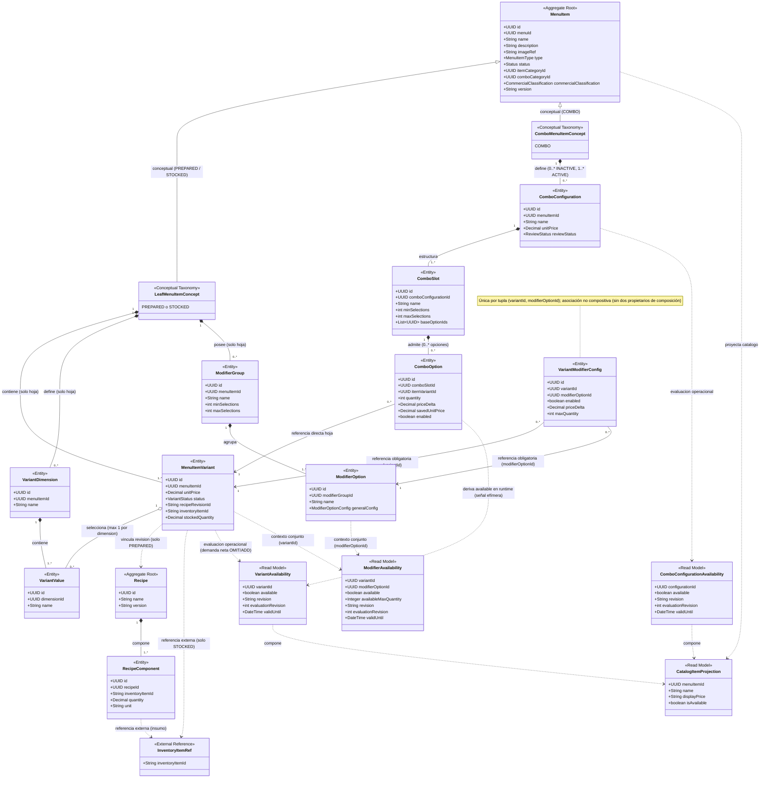
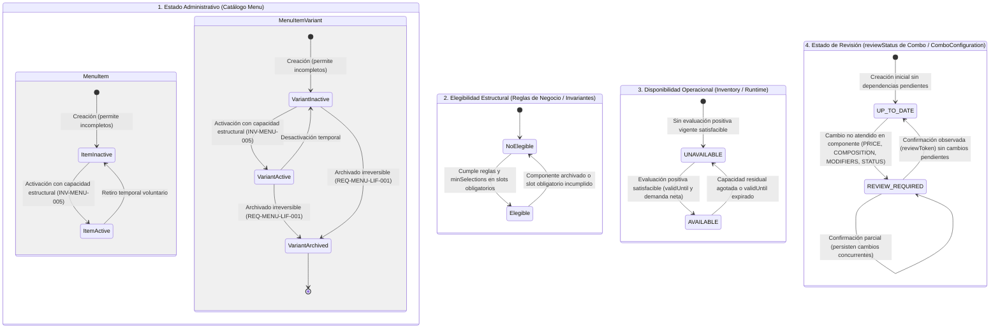
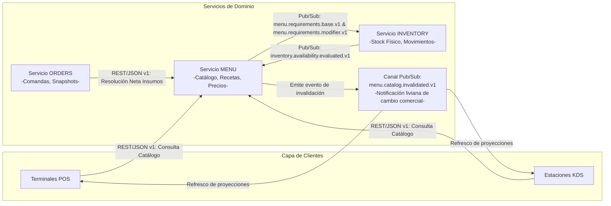

# Especificación Final Vigente del Servicio Menu

**Documento:** Especificación Técnica, Funcional y de Arquitectura de Dominio Consolidada  
**Servicio:** Menu (Sistema de Comandas para Restaurantes)  
**Versión:** 1.2.3 (Consolidada Vigente)  
**Estado:** Vigente / Aprobado  
**Fecha:** 2026-09-17

---

## 1. Índice General

- [Especificación Final Vigente del Servicio Menu](#especificación-final-vigente-del-servicio-menu)
  - [1. Índice General](#1-índice-general)
  - [2. Configuración del Documento](#2-configuración-del-documento)
    - [2.1 Identificación y Propósito](#21-identificación-y-propósito)
    - [2.2 Autoridad Temporal y Semántica de las Fuentes](#22-autoridad-temporal-y-semántica-de-las-fuentes)
      - [Regla de Prevalencia](#regla-de-prevalencia)
    - [2.3 Alcance y Exclusiones](#23-alcance-y-exclusiones)
  - [3. Contexto, Alcance y Lenguaje del Dominio](#3-contexto-alcance-y-lenguaje-del-dominio)
    - [3.1 Responsabilidades del Bounded Context Menu](#31-responsabilidades-del-bounded-context-menu)
    - [3.2 Límites de Contexto y Ownership de Datos](#32-límites-de-contexto-y-ownership-de-datos)
    - [3.3 Taxonomía Fundamental del Menú](#33-taxonomía-fundamental-del-menú)
    - [3.4 Ortogonalidad: Estado Administrativo, Elegibilidad Estructural, Disponibilidad Operacional y Estado de Revisión](#34-ortogonalidad-estado-administrativo-elegibilidad-estructural-disponibilidad-operacional-y-estado-de-revisión)
    - [3.5 Glosario Normativo del Dominio](#35-glosario-normativo-del-dominio)
  - [4. Requisitos Funcionales Consolidados](#4-requisitos-funcionales-consolidados)
    - [4.1 Definición y Catálogo de MenuItems](#41-definición-y-catálogo-de-menuitems)
      - [REQ-MENU-ITM-001 — Definición del MenuItem Comercial](#req-menu-itm-001--definición-del-menuitem-comercial)
      - [REQ-MENU-ITM-002 — Transición de Estado Administrativo](#req-menu-itm-002--transición-de-estado-administrativo)
    - [4.2 Variantes de Productos Hoja](#42-variantes-de-productos-hoja)
      - [REQ-MENU-VAR-001 — Presentación Vendible de Item Hoja (Default Variant)](#req-menu-var-001--presentación-vendible-de-item-hoja-default-variant)
      - [REQ-MENU-VAR-002 — Definición de Dimensión de Variante](#req-menu-var-002--definición-de-dimensión-de-variante)
      - [REQ-MENU-VAR-003 — Valor de Dimensión de Variante](#req-menu-var-003--valor-de-dimensión-de-variante)
      - [REQ-MENU-VAR-004 — Definición de Variantes Vendibles](#req-menu-var-004--definición-de-variantes-vendibles)
      - [REQ-MENU-VAR-005 — Migración Atómica de Variante Predeterminada](#req-menu-var-005--migración-atómica-de-variante-predeterminada)
      - [REQ-MENU-VAR-006 — Elegibilidad Estructural de Variante Hoja](#req-menu-var-006--elegibilidad-estructural-de-variante-hoja)
    - [4.3 Precios Autoritativos y Proyección de Catálogo](#43-precios-autoritativos-y-proyección-de-catálogo)
      - [REQ-MENU-PRC-001 — Precio Absoluto Autoritativo de la Variante](#req-menu-prc-001--precio-absoluto-autoritativo-de-la-variante)
      - [REQ-MENU-PRC-002 — Proyección del Precio de Catálogo](#req-menu-prc-002--proyección-del-precio-de-catálogo)
      - [REQ-MENU-PRC-003 — Exclusión de Catálogo sin Unidades Elegibles](#req-menu-prc-003--exclusión-de-catálogo-sin-unidades-elegibles)
    - [4.4 Suministro y Recetas Culinarias](#44-suministro-y-recetas-culinarias)
      - [REQ-MENU-FUL-001 — Configuración de Suministro Almacenado (Stocked)](#req-menu-ful-001--configuración-de-suministro-almacenado-stocked)
      - [REQ-MENU-FUL-002 — Vinculación de Receta para Presentación Preparada (Prepared)](#req-menu-ful-002--vinculación-de-receta-para-presentación-preparada-prepared)
      - [REQ-MENU-FUL-003 — Definición de Recetas Culinarias](#req-menu-ful-003--definición-de-recetas-culinarias)
      - [REQ-MENU-FUL-004 — Historial y Versionado Inmutable de Recetas](#req-menu-ful-004--historial-y-versionado-inmutable-de-recetas)
    - [4.5 Grupos y Opciones de Modificadores](#45-grupos-y-opciones-de-modificadores)
      - [REQ-MENU-MOD-001 — Definición de Grupos de Modificadores en el Item Hoja](#req-menu-mod-001--definición-de-grupos-de-modificadores-en-el-item-hoja)
      - [REQ-MENU-MOD-002 — Opciones de Modificador y Configuración General](#req-menu-mod-002--opciones-de-modificador-y-configuración-general)
      - [REQ-MENU-MOD-003 — Especialización de Modificador por Variante (VariantModifierConfig)](#req-menu-mod-003--especialización-de-modificador-por-variante-variantmodifierconfig)
      - [REQ-MENU-MOD-004 — Copia Administrativa de Configuraciones de Modificadores](#req-menu-mod-004--copia-administrativa-de-configuraciones-de-modificadores)
      - [REQ-MENU-MOD-005 — Directiva de Adición de Insumo (ADD)](#req-menu-mod-005--directiva-de-adición-de-insumo-add)
      - [REQ-MENU-MOD-006 — Directiva de Omisión de Insumo (OMIT)](#req-menu-mod-006--directiva-de-omisión-de-insumo-omit)
      - [REQ-MENU-MOD-007 — Modificadores de Preparación sin Efectos sobre Insumos](#req-menu-mod-007--modificadores-de-preparación-sin-efectos-sobre-insumos)
      - [REQ-MENU-MOD-008 — Proyección Publicada de Modificadores Efectivos (ResolvedVariantModifier)](#req-menu-mod-008--proyección-publicada-de-modificadores-efectivos-resolvedvariantmodifier)
    - [4.6 Combos, Configuraciones, Slots y Opciones](#46-combos-configuraciones-slots-y-opciones)
      - [REQ-MENU-COM-001 — Configuración de Combo (ComboConfiguration)](#req-menu-com-001--configuración-de-combo-comboconfiguration)
      - [REQ-MENU-COM-002 — Definición del Espacio de Selección (ComboSlot)](#req-menu-com-002--definición-del-espacio-de-selección-comboslot)
      - [REQ-MENU-COM-003 — Opciones de Combo Vinculadas Directamente a la Variante Hoja](#req-menu-com-003--opciones-de-combo-vinculadas-directamente-a-la-variante-hoja)
      - [REQ-MENU-COM-004 — Copia Administrativa de Configuración de Combo](#req-menu-com-004--copia-administrativa-de-configuración-de-combo)
      - [REQ-MENU-COM-005 — Asignación Múltiple de Opciones de Combo con Atomicidad por Destino](#req-menu-com-005--asignación-múltiple-de-opciones-de-combo-con-atomicidad-por-destino)
      - [REQ-MENU-COM-006 — Elegibilidad Estructural de Configuración de Combo](#req-menu-com-006--elegibilidad-estructural-de-configuración-de-combo)
    - [4.7 Ciclo de Vida, Archivado y Reglas Incompletas](#47-ciclo-de-vida-archivado-y-reglas-incompletas)
      - [REQ-MENU-LIF-001 — Archivado de Variante y Reevaluación No Obstructiva de Dependencias](#req-menu-lif-001--archivado-de-variante-y-reevaluación-no-obstructiva-de-dependencias)
      - [REQ-MENU-LIF-002 — Guardado de Definiciones Incompletas en Contexto Inactivo](#req-menu-lif-002--guardado-de-definiciones-incompletas-en-contexto-inactivo)
      - [REQ-MENU-LIF-003 — Advertencias de Capacidad Faltante](#req-menu-lif-003--advertencias-de-capacidad-faltante)
    - [4.8 Resolución Neta de Insumos](#48-resolución-neta-de-insumos)
      - [REQ-MENU-ING-001 — Resolución Neta de Insumos para Líneas de Comanda](#req-menu-ing-001--resolución-neta-de-insumos-para-líneas-de-comanda)
    - [4.9 Versionado Inmutable de Definiciones Comerciales](#49-versionado-inmutable-de-definiciones-comerciales)
      - [REQ-MENU-VER-001 — Generación de Revisión Inmutable de MenuItem](#req-menu-ver-001--generación-de-revisión-inmutable-de-menuitem)
    - [4.10 Detección y Gestión de Revisiones de Combo](#410-detección-y-gestión-de-revisiones-de-combo)
      - [REQ-MENU-REV-001 — Detección Automática de Necesidad de Revisión de Combo (REVIEW\_REQUIRED)](#req-menu-rev-001--detección-automática-de-necesidad-de-revisión-de-combo-review_required)
      - [REQ-MENU-REV-002 — Visibilidad Administrativa del Estado de Revisión](#req-menu-rev-002--visibilidad-administrativa-del-estado-de-revisión)
      - [REQ-MENU-REV-003 — Confirmación Atómica de Revisión Mediante Token Observado](#req-menu-rev-003--confirmación-atómica-de-revisión-mediante-token-observado)
      - [REQ-MENU-REV-004 — Conservación de la Configuración Comercial al Confirmar Revisión](#req-menu-rev-004--conservación-de-la-configuración-comercial-al-confirmar-revisión)
      - [REQ-MENU-REV-005 — Referencia Visual del Slot (Precios Informativos)](#req-menu-rev-005--referencia-visual-del-slot-precios-informativos)
    - [4.11 Publicación, Proyecciones y Disponibilidad](#411-publicación-proyecciones-y-disponibilidad)
      - [REQ-MENU-AVL-001 — Publicación y Notificación de Invalidación de Catálogo](#req-menu-avl-001--publicación-y-notificación-de-invalidación-de-catálogo)
      - [REQ-MENU-AVL-002 — Frontera General de Disponibilidad Operacional Desacoplada](#req-menu-avl-002--frontera-general-de-disponibilidad-operacional-desacoplada)
      - [REQ-MENU-AVL-003 — Publicación Desacoplada de Requerimientos Base e Incrementales](#req-menu-avl-003--publicación-desacoplada-de-requerimientos-base-e-incrementales)
      - [REQ-MENU-AVL-004 — Cálculo Granular de Disponibilidad de Variante (VariantAvailability)](#req-menu-avl-004--cálculo-granular-de-disponibilidad-de-variante-variantavailability)
      - [REQ-MENU-AVL-005 — Cálculo de Disponibilidad y Límite de Modificadores (ModifierAvailability)](#req-menu-avl-005--cálculo-de-disponibilidad-y-límite-de-modificadores-modifieravailability)
      - [REQ-MENU-AVL-006 — Cálculo de Disponibilidad de Configuración de Combo por Capacidad de Slots (ComboConfigurationAvailability)](#req-menu-avl-006--cálculo-de-disponibilidad-de-configuración-de-combo-por-capacidad-de-slots-comboconfigurationavailability)
      - [REQ-MENU-AVL-007 — Derivación de Disponibilidad Agregada de MenuItem para Catálogo](#req-menu-avl-007--derivación-de-disponibilidad-agregada-de-menuitem-para-catálogo)
  - [5. Requisitos No Funcionales](#5-requisitos-no-funcionales)
    - [5.1 Presupuesto de Rendimiento de Aceptación (ADR-004)](#51-presupuesto-de-rendimiento-de-aceptación-adr-004)
    - [5.2 Perfil Nominal de Operación](#52-perfil-nominal-de-operación)
    - [5.3 Objetivos de Latencia por Clase de Operación](#53-objetivos-de-latencia-por-clase-de-operación)
    - [5.4 Capacidad ante Ráfagas (Burst)](#54-capacidad-ante-ráfagas-burst)
    - [5.5 Concurrencia e Integridad Transaccional](#55-concurrencia-e-integridad-transaccional)
    - [5.6 Resiliencia y Desacoplamiento de Inventory](#56-resiliencia-y-desacoplamiento-de-inventory)
  - [6. Reglas de Negocio e Invariantes del Dominio](#6-reglas-de-negocio-e-invariantes-del-dominio)
    - [6.1 Reglas de Negocio (BR-MENU)](#61-reglas-de-negocio-br-menu)
    - [6.2 Invariantes de Integridad del Dominio (INV-MENU)](#62-invariantes-de-integridad-del-dominio-inv-menu)
  - [7. Modelo de Dominio](#7-modelo-de-dominio)
    - [7.1 Agregados y Límites de Consistencia](#71-agregados-y-límites-de-consistencia)
    - [7.2 Entidades y Atributos Principales](#72-entidades-y-atributos-principales)
      - [MenuItem (Aggregate Root)](#menuitem-aggregate-root)
      - [MenuItemVariant (Entity)](#menuitemvariant-entity)
      - [VariantDimension \& VariantValue (Entities)](#variantdimension--variantvalue-entities)
      - [ModifierGroup \& ModifierOption (Entities)](#modifiergroup--modifieroption-entities)
      - [VariantModifierConfig (Entity / Mapping)](#variantmodifierconfig-entity--mapping)
      - [ComboConfiguration, ComboSlot \& ComboOption (Entities)](#comboconfiguration-comboslot--combooption-entities)
      - [Recipe \& RecipeComponent (Aggregate / Entity)](#recipe--recipecomponent-aggregate--entity)
    - [7.3 Value Objects](#73-value-objects)
      - [ModifierOptionConfig (Value Object)](#modifieroptionconfig-value-object)
      - [IngredientEffect (Value Object)](#ingredienteffect-value-object)
    - [7.4 Proyecciones de Consulta (Read Models)](#74-proyecciones-de-consulta-read-models)
      - [ResolvedVariantModifier (Proyección de Configuración Comercial para POS/KDS)](#resolvedvariantmodifier-proyección-de-configuración-comercial-para-poskds)
      - [VariantAvailability (Proyección Operacional de Variante)](#variantavailability-proyección-operacional-de-variante)
      - [ModifierAvailability (Proyección Operacional de Modificador)](#modifieravailability-proyección-operacional-de-modificador)
      - [ComboConfigurationAvailability (Proyección Operacional de Configuración de Combo)](#comboconfigurationavailability-proyección-operacional-de-configuración-de-combo)
      - [CatalogItemProjection (Proyección de Catálogo)](#catalogitemprojection-proyección-de-catálogo)
    - [7.5 Diagramas Estructurales y de Comportamiento](#75-diagramas-estructurales-y-de-comportamiento)
      - [Modelo Estructural de Dominio (Taxonomía y Agregados)](#modelo-estructural-de-dominio-taxonomía-y-agregados)
      - [Ciclo de Vida y Ortogonalidad de Estados](#ciclo-de-vida-y-ortogonalidad-de-estados)
      - [Modelo de Propagación de Disponibilidad Granular](#modelo-de-propagación-de-disponibilidad-granular)
  - [8. Arquitectura y Límites del Sistema](#8-arquitectura-y-límites-del-sistema)
    - [8.1 Diagrama de Contexto de Bounded Contexts](#81-diagrama-de-contexto-de-bounded-contexts)
    - [8.2 Patrones de Interacción y Comunicación](#82-patrones-de-interacción-y-comunicación)
    - [8.3 Aislamiento de Persistencia y Reglas de Integración](#83-aislamiento-de-persistencia-y-reglas-de-integración)
  - [9. Modelo de Datos Lógico](#9-modelo-de-datos-lógico)
    - [9.1 Estructura Persistente Relacional](#91-estructura-persistente-relacional)
      - [Entidad: MenuItem](#entidad-menuitem)
      - [Entidad: MenuItemVariant](#entidad-menuitemvariant)
      - [Entidad: VariantDimension](#entidad-variantdimension)
      - [Entidad: VariantValue](#entidad-variantvalue)
      - [Entidad: VariantValueAssignment](#entidad-variantvalueassignment)
      - [Entidad: ModifierGroup](#entidad-modifiergroup)
      - [Entidad: ModifierOption](#entidad-modifieroption)
      - [Entidad: VariantModifierConfig](#entidad-variantmodifierconfig)
      - [Entidad: ComboConfiguration](#entidad-comboconfiguration)
      - [Entidad: ComboSlot](#entidad-comboslot)
      - [Entidad: ComboOption](#entidad-combooption)
      - [Entidad: Recipe](#entidad-recipe)
      - [Entidad: RecipeComponent](#entidad-recipecomponent)
      - [Ortogonalidad del Esquema Persistente y Exclusión de Disponibilidad Operacional](#ortogonalidad-del-esquema-persistente-y-exclusión-de-disponibilidad-operacional)
    - [9.2 Relaciones Internas y Restricciones](#92-relaciones-internas-y-restricciones)
    - [9.3 Referencias Externas Desacopladas](#93-referencias-externas-desacopladas)
    - [9.4 Estrategia de Versionado Histórico e Inmutabilidad](#94-estrategia-de-versionado-histórico-e-inmutabilidad)
  - [10. Interfaces de Entrada y Salida (APIs)](#10-interfaces-de-entrada-y-salida-apis)
    - [10.1 Interfaz de Consulta Pública de Catálogo](#101-interfaz-de-consulta-pública-de-catálogo)
    - [10.2 Interfaz de Operaciones Administrativas y Copia en Lote](#102-interfaz-de-operaciones-administrativas-y-copia-en-lote)
    - [10.3 Interfaz de Gestión y Confirmación de Revisiones de Combo](#103-interfaz-de-gestión-y-confirmación-de-revisiones-de-combo)
    - [10.4 Interfaz de Resolución Neta de Insumos para Orders](#104-interfaz-de-resolución-neta-de-insumos-para-orders)
    - [10.5 Intercambio Lógico con Inventory](#105-intercambio-lógico-con-inventory)
    - [10.6 Catálogo Estandarizado de Códigos de Error de Integración](#106-catálogo-estandarizado-de-códigos-de-error-de-integración)
  - [11. Eventos de Negocio](#11-eventos-de-negocio)
    - [11.0 Sobre Común de Mensajes (Event Envelope v1)](#110-sobre-común-de-mensajes-event-envelope-v1)
    - [11.1 Mensajes y Notificaciones Emitidas por Menu](#111-mensajes-y-notificaciones-emitidas-por-menu)
    - [11.2 Evaluaciones y Mensajes Consumidos por Menu](#112-evaluaciones-y-mensajes-consumidos-por-menu)
  - [12. Datos Requeridos de Otros Servicios y Ownership](#12-datos-requeridos-de-otros-servicios-y-ownership)
    - [12.1 Dependencias con Inventory](#121-dependencias-con-inventory)
    - [12.2 Dependencias con Orders](#122-dependencias-con-orders)
    - [12.3 Interacción con POS / KDS](#123-interacción-con-pos--kds)
  - [13. Decisiones Cerradas de Diseño e Integración](#13-decisiones-cerradas-de-diseño-e-integración)
    - [13.1 Cierre de OPEN-002: Emparejamiento de Slots y Atomicidad de Copia Masiva](#131-cierre-de-open-002-emparejamiento-de-slots-y-atomicidad-de-copia-masiva)
    - [13.2 Cierre de OPEN-007: Especificación Técnica Formal de Contratos Externos, Invalidación y Transporte](#132-cierre-de-open-007-especificación-técnica-formal-de-contratos-externos-invalidación-y-transporte)
    - [13.3 Cierre de OPEN-009: Porciones de Componentes y Modificadores Repetidos en Combos](#133-cierre-de-open-009-porciones-de-componentes-y-modificadores-repetidos-en-combos)
    - [13.4 Cierre de OPEN-010: Rangos Numéricos Exhaustivos, Moneda y Restricciones de Dominio](#134-cierre-de-open-010-rangos-numéricos-exhaustivos-moneda-y-restricciones-de-dominio)
  - [14. Matriz de Trazabilidad](#14-matriz-de-trazabilidad)
    - [14.1 Trazabilidad de Requisitos Funcionales (46 Requisitos por Apartados)](#141-trazabilidad-de-requisitos-funcionales-46-requisitos-por-apartados)
    - [14.2 Trazabilidad de Reglas de Negocio e Invariantes](#142-trazabilidad-de-reglas-de-negocio-e-invariantes)
    - [14.3 Trazabilidad de Requisitos No Funcionales y ADRs](#143-trazabilidad-de-requisitos-no-funcionales-y-adrs)
      - [Decisiones Arquitectónicas (ADRs)](#decisiones-arquitectónicas-adrs)
      - [Cierre Normativo de Cuestiones de Diseño e Integración (Históricas OPEN)](#cierre-normativo-de-cuestiones-de-diseño-e-integración-históricas-open)

---

## 2. Configuración del Documento

### 2.1 Identificación y Propósito

El presente documento constituye la especificación técnica, funcional, estructural y de arquitectura consolidada y vigente para el servicio **Menu**, componente central del sistema de comandas y gestión de restaurantes. Su objetivo es constituirse como la **única fuente autorizada de verdad**, autosuficiente y verificable, reemplazando ambigüedades, documentos transitorios y discusiones previas. La versión 1.1.1 incorporó formalmente el refinamiento de disponibilidad operacional granular adoptado el 2026-09-16 y aclaró la composición efectiva OMIT/ADD y la señal lógica de capacidad de Inventory. La versión 1.1.2 complementa y formaliza de manera implementable las aclaraciones normativas sobre la derivación entera y dimensional de evaluatedCapacity, el cálculo de capacidad en grupos obligatorios ante valores enteros y nulos, la reevaluación obligatoria de VariantAvailability ante cualquier reducción de capacidad con no propagación circunscrita a casos opcionales o con capacidad remanente, y la definición de opciones seleccionables y availableCapacity en ComboSlot. La versión 1.1.3 corrige y formaliza la derivación de capacidad evaluada (`evaluatedCapacity`) y límites de modificadores (`availableMaxQuantity`) basándola estrictamente en el inventario remanente tras descontar los requerimientos base netos efectivos tras OMIT ($\text{StockRemanente}(k) = \max(0, \text{StockDisponible}(k) - \text{BaseNetoTrasOMIT}(k))$), sustituyendo el cálculo sobre stock bruto para impedir que una opción o variante se declare disponible utilizando inventario ya consumido por los requerimientos base efectivos, y clarifica que la satisfacibilidad en `VariantAvailability` evalúa la demanda neta integral (base tras OMIT más ADD). La versión 1.1.4 corrige el caso de verificación de la directiva OMIT en REQ-MENU-AVL-005 —eliminando toda interpretación de reducción parcial sobre la base para establecer $\text{BaseNetoTrasOMIT} = 0$ y su consecuente recálculo de capacidad remanente— y corrige el ancla HTML y enlace de índice de trazabilidad de la sección 14.1. La versión 1.1.5 formaliza la revisión transversal de consistencia del modelo vigente: ratifica la ortogonalidad estricta entre estado administrativo (`status`), elegibilidad estructural, disponibilidad operacional (proyecciones desacopladas) y estado de revisión (`reviewStatus`), clarificando que ninguna proyección operacional constituye un estado administrativo persistente; explicita la prohibición de formulaciones heredadas basadas en peor caso, requerimientos base crudos aislados o cálculo sobre stock bruto; ratifica la derivación de `VariantAvailability`, `ModifierAvailability` y `ComboConfigurationAvailability` sobre capacidad residual y opciones seleccionables; y explicita las inconsistencias semánticas identificadas en los diagramas para su resolución diferida sin alterar el estilo ni renumerar requisitos. La versión 1.1.6 formaliza la corrección y alineación exhaustiva de los diagramas visuales con el modelo de dominio y las invariantes vigentes: representa a `MenuItem` como raíz de agregado con discriminador (`PREPARED`, `STOCKED`, `COMBO`), circunscribe variantes, dimensiones y modificadores exclusivamente a items hoja y separa las entidades persistentes de los read models desacoplados; incorpora en el diagrama de estados las cuatro dimensiones ortogonales distinguiendo los ciclos de vida de item y variante, rotulando la activación mediante capacidad estructural (INV-MENU-005) y modelando el ciclo de supervisión de `reviewStatus`; reformula el flujo de propagación de disponibilidad para ilustrar la publicación desacoplada de requerimientos, la evaluación de inventario con capacidad residual y la propagación no obstructiva hacia variantes, combos y slots; y delimita el diagrama de contexto estrictamente a la frontera de integración directa de Menu anotando la invalidación bajo OPEN-007, retirando notas de discrepancias diferidas sin alterar requisitos ni la numeración normativa. La versión 1.1.7 subsana las dos observaciones diagramáticas identificadas: en el diagrama de clases de la sección 7.5, reemplaza las composiciones de `VariantModifierConfig` por asociaciones no compositivas hacia `MenuItemVariant` y `ModifierOption` con multiplicidad exactamente 1 en cada referencia y 0..\* configuraciones desde cada entidad referenciada, explicitando que cada configuración es única por la tupla `(variantId, modifierOptionId)` sin admitir doble pertenencia compositiva; y en el diagrama de propagación de disponibilidad granular, desagrega la publicación de Menu en dos salidas independientes hacia Inventory (`BaseRequirements` por variante y `ModifierRequirements` por tupla `(variantId, modifierOptionId)`), conectándolas de forma separada con la evaluación de existencias que combina la base efectiva tras OMIT con las directivas ADD sobre capacidad residual, excluyendo explícitamente todo cálculo global de peor caso. La versión 1.1.8 normaliza la nomenclatura de los 46 requisitos funcionales mediante identificadores estructurados por apartado funcional (REQ-MENU-{APARTADO}-{NNN}) y actualiza integralmente sus referencias internas, anclas y matriz de trazabilidad sin alterar el contenido normativo. La versión 1.1.9 aplica una corrección sintáctica y de formato sobre encabezados, listas, tablas, bloques de código, enlaces internos, diagramas Mermaid y expresiones matemáticas, sin alteraciones normativas. La versión 1.1.10 elimina las anclas HTML fuera de bloques de código cercados y normaliza los enlaces internos mediante Markdown nativo, sin alteraciones normativas. La versión 1.1.11 formaliza la auditoría final de consistencia y subsana erratas menores: clasifica los errores tipográficos y alineamientos corregidos como inconsistencias menores, sin identificar inconsistencias bloqueantes ni introducir cuestiones abiertas nuevas; corrige errores tipográficos («ssi» por «si y solo si», tilde en «Revisión»); alinea transversalmente las formulaciones abreviadas del predicado de elegibilidad de MenuItemVariant con REQ-MENU-VAR-006 (status ACTIVE, no ARCHIVED y MenuItem propietario ACTIVE) en el glosario, REQ-MENU-AVL-006, su verificación, BR-MENU-023, resumen de ComboOption, diagrama de propagación, interfaz lógica con Inventory y trazabilidad; y ajusta REQ-MENU-LIF-001 para que la pérdida de elegibilidad marque REVIEW_REQUIRED en cada ComboConfiguration afectada produciendo únicamente el estado agregado correspondiente en el MenuItem COMBO sin modificar MenuItem.status. La versión 1.2.0 formaliza el cierre normativo de las cuatro cuestiones abiertas históricas (OPEN-002, OPEN-007, OPEN-009 y OPEN-010): (1) Cierra OPEN-002 eliminando el matching heurístico o implícito de slots en operaciones de copia entre `ComboConfiguration`, estableciendo que la clonación completa regenera identidades únicas para slots y opciones preservando estructura y orden, que la copia sobre destinos existentes exige mapeos explícitos `sourceSlotId -> targetSlotId` o instrucción explícita de creación, y que la atomicidad transaccional aplica por `ComboConfiguration` destino admitiendo éxito parcial en lotes, evaluación local de `FAIL`/`REPLACE`, resultados individuales con diagnóstico y reintentos idempotentes sin duplicación. (2) Cierra OPEN-007 formalizando los contratos técnicos externos mediante REST/JSON síncrono versionado (v1) para catálogo, administración y resolución neta de Orders, y mensajería Pub/Sub JSON versionada (v1) con sobre común (`messageId`, `eventType`, `schemaVersion`, `occurredAt`, `correlationId`, `idempotencyKey`, `payload`) sobre los canales lógicos `menu.requirements.base.v1`, `menu.requirements.modifier.v1`, `inventory.availability.evaluated.v1` y `menu.catalog.invalidated.v1`, especificando esquemas de payload mínimos coherentes, invalidación liviana de catálogo para re-consulta sin transporte de catálogo completo y un catálogo estándar de errores (`VALIDATION_ERROR`, `NOT_FOUND`, `CONFLICT`, `STALE_REVISION`, `DEPENDENCY_UNAVAILABLE`, `IDEMPOTENCY_CONFLICT`, `INTERNAL_ERROR`) con diagnósticos de campo y flag `retryable`, sin imponer transactional outbox a Menu. (3) Cierra OPEN-009 fijando `ComboOption.quantity` como entero en el rango $1..99$ de unidades físicas completas, prohibiendo coeficientes fraccionarios de cantidad o precio sobre variantes y exigiendo modelar presentaciones fraccionadas comerciales diferenciadas como variantes hoja concretas e independientes; asimismo, formaliza la fórmula de cálculo del precio de combo sumando al precio base de la configuración los deltas de opciones seleccionadas y los deltas de modificadores calculados independientemente por cada instancia y cantidad efectiva dentro de cada componente, sin deduplicación entre componentes, sin bonificación implícita y sin sumar `MenuItemVariant.unitPrice`, garantizando un precio final no negativo. (4) Cierra OPEN-010 estableciendo una única moneda ISO 4217 por `menuId`, montos monetarios en `DECIMAL(12,2)` (precios absolutos entre 0.00 y 9,999,999,999.99, deltas dentro del mismo rango con signo, con rechazo estricto de entradas con más de dos decimales), límites enteros de selecciones y capacidades máximas en el rango $0..99$, cantidad física de combo en $1..99$, nombres en $1..120$ caracteres Unicode recortados y descripciones en $0..1000$ caracteres Unicode; e incorpora las reglas normativas BR-MENU-026 a BR-MENU-029 y las invariantes INV-MENU-007 a INV-MENU-012. La versión 1.2.1 formaliza las correcciones de implementabilidad y consistencia resultantes de la auditoría técnica de los cierres normativos: (1) Aplica explícitamente el rango entero $0..99$ a `maxQuantity` en `REQ-MENU-MOD-002`, su verificación, `ModifierOptionConfig`, `ResolvedVariantModifier` y demás referencias normativas, eliminando formulaciones abiertas sin cota superior y validando ambos límites extremos (0 y 99) junto con el rechazo de valores inválidos. (2) Completa los contratos con Inventory en `menu.requirements.base.v1`, `menu.requirements.modifier.v1` e `inventory.availability.evaluated.v1` incorporando `requirementKey`, `requirementType`, `menuId`, `variantId`, `modifierOptionId` (cuando corresponda) y `definitionRevision` en publicación y evaluación, definiendo reglas de unicidad, estabilidad y correlación exacta bidireccional, así como el descarte de evaluaciones que no coincidan con la definición vigente. (3) Reestructura el contrato de batch-copy con un discriminador de modalidad (`FULL_CLONE` vs `COPY_TO_EXISTING`), soportando la clonación completa con identificación del destino propietario, creación de nueva `ComboConfiguration`, regeneración de IDs para configuración, slots y opciones, preservación de estructura y orden, y retorno de mapeos de IDs, manteniendo la copia sobre destinos existentes con `targetConfigurationId` y `slotMappings` explícitos. (4) Formaliza `dryRun = true` como evaluación completa sin persistencia, sin eventos, sin incremento de revisión ni cambio de estados, estableciendo resultados predictivos e idempotencia separada por modo que no bloquea la ejecución definitiva posterior. (5) Convierte el contrato de resolución para Orders en una unión discriminada (`LEAF` vs `COMBO`), representando para combos slots, opciones e instancias físicas numeradas ($1..o.\text{quantity}$) con modificadores propios por instancia, multiplicador de línea de orden, desglose normativo de precio unitario resuelto (con exclusión estricta de `MenuItemVariant.unitPrice` y rechazo de precios negativos) y cálculo de insumos. (6) Sustituye `reason` singular en `menu.catalog.invalidated.v1` por la colección no vacía y sin duplicados `changeTypes` con valores enumerados (`PRICE_UPDATE`, `CATALOG_STRUCTURE_UPDATE`, `ADMINISTRATIVE_STATUS_UPDATE`), permitiendo informar múltiples tipos de cambio simultáneamente. La versión 1.2.2 formaliza cuatro correcciones de consistencia e implementabilidad identificadas en la auditoría técnica de los contratos y reglas normativas: (1) En la resolución de órdenes de combos (Sección 10.4 y REQ-MENU-ING-001), sustituye `selectedOption` singular por la colección `selectedOptions` en la solicitud y desglose de respuesta, estableciendo su cardinalidad estricta frente a `minSelections` y `maxSelections` del `ComboSlot`, generalizando la fórmula matemática para sumar todas las opciones seleccionadas por slot y sus respectivas instancias físicas, y actualizando ejemplos y verificación con casos válidos de múltiples opciones por slot. (2) En la copia masiva de combos (Sección 10.2 y REQ-MENU-COM-004/005), declara el invariante de completitud de `idMappings` —exigiendo exactamente un mapeo de configuración en `FULL_CLONE`, $|\text{idMappings.slots}| = \text{createdSlotsCount}$ e $|\text{idMappings.options}| = \text{createdOptionsCount}$ tanto en ejecución definitiva como en `dryRun`— y completa los ejemplos exitosos con dos mapeos de slots y cinco mapeos de opciones con identificadores únicos. (3) En el modelo de modificadores y restricciones cuantitativas (Sección 6.2, 7.2, 9.1, 13.4, REQ-MENU-MOD-002 e INV-MENU-011), normaliza uniformemente `defaultMaxQuantity` y `defaultPriceDelta` a `maxQuantity` (entero en $0..99$) y `priceDelta` (`DECIMAL(12,2)` en $[-9999999999.99, +9999999999.99]$) en `ModifierOptionConfig`/`generalConfig`, eliminando referencias residuales con prefijo `default`. (4) En la frontera de disponibilidad operacional con Inventory (REQ-MENU-AVL-002, Sección 10.5, 11.2 y 13.2), unifica la política de ordenamiento bajo `evaluationRevision <= última procesada`, definiendo que una revisión igual es un duplicado descartado de forma idempotente, una menor es obsoleta y únicamente una estrictamente mayor puede actualizar las proyecciones vigentes, incorporando en la verificación pruebas separadas para revisiones menor, igual y mayor. La versión 1.2.3 se limita a una corrección de formato Markdown en la tabla 14.1 para restaurar su renderizado como tabla de seis columnas (sustituyendo la fila separadora defectuosa y utilizando notación segura para las cardinalidades en REQ-MENU-COM-004), indicando expresamente que no contiene cambios normativos.

Cualquier ingeniero, arquitecto o auditor debe ser capaz de entender e implementar el comportamiento normativo del servicio Menu a partir exclusivamente de este texto, sin requerir reconstrucción arqueológica de versiones descartadas.

### 2.2 Autoridad Temporal y Semántica de las Fuentes

La consolidación se fundamenta estrictamente en la evolución cronológica y jerárquica de las fuentes autorizadas del proyecto:

1. **`Problema-Inicial.md`** (Origen del problema, identificación de ambigüedades estructurales en modificadores e instrucciones de cocción).
2. **`Consultoria-1.md`** (Análisis de rendimiento, perfil de carga para restaurantes y límites de latencia).
3. **`Consultoria-2.md`** (Desacoplamiento de variantes e inventario, archivado, outbox y consistencia asíncrona).
4. **`Auditoria-1.md`** (Detección de agujeros y debilidades del modelo conceptual inicial).
5. **`Auditoria-2.md`** (Propuestas de solución: patrón Default Variant, variante como unidad vendible).
6. **`Modelo-Pre-Final.md`** (Modelo intermedio de taxonomía comercial y cumplimiento culinario/stock).
7. **`Decisiones-cierre-invariantes.md`** (Cierres arquitectónicos formales ADR-001 a ADR-008).
8. **`Req-F-Aproved.md`** (Base de 41 requisitos funcionales formalmente aprobados).
9. **`Auditoria-3.md`** (Simplificaciones finales de dominio, propiedad de modificadores en el item hoja con especialización opcional por variante, efectos ADD/OMIT, desacoplamiento estricto de combos y reevaluación no obstructiva por archivado de variantes).
10. **Refinamiento de Disponibilidad Granular (2026-09-16)** (Máxima autoridad vigente sobre disponibilidad operacional: desacoplamiento granular por variante y opción de modificador, eliminación del cálculo por peor caso con modificadores opcionales, requerimientos base e incrementales separados y propagación por capacidad y existencia hacia combos y catálogo).

#### Regla de Prevalencia

Una fuente posterior sustituye a una anterior en caso de conflicto directo o refinamiento incompatible. En particular:

- El **Refinamiento de Disponibilidad Granular (2026-09-16)** ostenta la máxima jerarquía resolutiva sobre el modelo, contratos, proyecciones y reglas de disponibilidad operacional e intercambio con Inventory, reemplazando cualquier hipótesis o criterio previo basado en el peor caso o la activación simultánea de todos los modificadores opcionales.
- **`Auditoria-3.md`** ostenta la máxima jerarquía resolutiva para la simplificación del catálogo comercial, la propiedad de modificadores en el item hoja y la reevaluación no obstructiva por archivado de variantes.
- **`Req-F-Aproved.md`** aporta la línea base de los requisitos funcionales aprobados. Cuando una regla de `Req-F-Aproved.md` o de `Decisiones-cierre-invariantes.md` (por ejemplo, el rechazo obligatorio del archivado de variantes con dependencias) entre en contradicción con `Auditoria-3.md`, prevalece incondicionalmente la disposición de `Auditoria-3.md` (permitir el archivado y reevaluar la elegibilidad de combos dependientes marcándolos como `REVIEW_REQUIRED`).
- Las decisiones intermedias o hipótesis descartadas quedan fuera del cuerpo normativo principal y se registran exclusivamente como notas de trazabilidad histórica.

### 2.3 Alcance y Exclusiones

- **Dentro del alcance:** Modelado y administración de la oferta comercial (MenuItems, variantes, combos, recetas culinarias, grupos y opciones de modificadores); cálculo autoritativo de precios unitarios y proyecciones de precio de catálogo; resolución neta de insumos culinarios para órdenes; reevaluación de dependencias estructurales; versionado inmutable de definiciones comerciales.
- **Fuera del alcance (Responsabilidad de otros bounded contexts):**
  - Existencias físicas de inventario, bodegas, mermas, órdenes de compra y cálculo de disponibilidad en tiempo real (propiedad de **Inventory**).
  - Ciclo de vida transaccional de órdenes, carritos, líneas de comanda y cobros (propiedad de **Orders**).
  - Terminales de punto de venta, renderizado de pantallas y estaciones de preparación de cocina (propiedad de **POS / KDS**).

---

## 3. Contexto, Alcance y Lenguaje del Dominio

### 3.1 Responsabilidades del Bounded Context Menu

El servicio Menu es la autoridad exclusiva sobre la **oferta comercial vendible** del restaurante. Sus responsabilidades comprenden:

1. Definir la estructura del catálogo (categorías, platos, bebidas, complementos y combos).
2. Modelar las presentaciones vendibles concretas (`MenuItemVariant`) para productos hoja y configuraciones (`ComboConfiguration`) para combos.
3. Custodiar los precios unitarios absolutos autoritativos de cada variante y configuración.
4. Modelar las recetas culinarias base (`Recipe`) y los artículos de stock asociados a las variantes.
5. Administrar las opciones de personalización (`ModifierGroup`, `ModifierOption`) y sus especializaciones por variante (`VariantModifierConfig`).
6. Proyectar hacia POS/KDS las definiciones listas para venta (`ResolvedVariantModifier`, precio visual de catálogo).
7. Resolver, ante una solicitud de Orders, la descomposición neta exacta de insumos físicos (ingredientes de receta, cantidades de stock y efectos de modificadores) requeridos por una línea de comanda confirmada.
8. Gestionar las revisiones inmutables de las definiciones comerciales del menú (`<number>_<ISO8601>`).

### 3.2 Límites de Contexto y Ownership de Datos

```text
+-------------------------------------------------------------------------+
|                              BOUNDED CONTEXTS                           |
|                                                                         |
|  +-----------------------+                    +----------------------+  |
|  |     SERVICIO MENU     |                    |  SERVICIO INVENTORY  |  |
|  |-----------------------|                    |----------------------|  |
|  | - Oferta comercial    |  Cambios de        | - Stock físico       |  |
|  | - Precios base        |  definición        | - Insumos y SKUs     |  |
|  | - Recetas culinarias  |  de insumos        | - Evaluación dispon. |  |
|  | - Variantes y Combos  |------------------->| - Deducción atómica  |  |
|  | - Modificadores       |<-------------------| - "validUntil"       |  |
|  +-----------------------+    Evaluación      +----------------------+  |
|             |                 disponibilidad              ^             |
|             | Catálogo        (Status + TTL)              |             |
|             | Publicado                                   | Movimiento  |
|             v                                             | atómico     |
|  +-----------------------+                    +----------------------+  |
|  |       POS / KDS       |    Crear Orden     |   SERVICIO ORDERS    |  |
|  |-----------------------|------------------->|----------------------|  |
|  | - Interfaz de venta   |                    | - Ciclo de orden     |  |
|  | - Selección cliente   |                    | - Snapshots precio   |  |
|  | - Comandas cocina     |                    | - Confirmación comanda| |
|  +-----------------------+                    +----------------------+  |
+-------------------------------------------------------------------------+
```

- **Menu no posee inventario:** Menu no sabe cuántos kilogramos de queso o botellas de refresco quedan en bodega. Guarda exclusivamente identificadores foráneos opacos (`inventoryItemId`) y cantidades teóricas requeridas. Menu publica cambios de definición de insumos hacia Inventory separando requerimientos base (`BaseRequirements`) e incrementales (`ModifierRequirements`), conservando la información `OMIT`/`ADD` necesaria para evaluar configuraciones efectivas sin convertir el requerimiento base crudo en una precondición independiente; Inventory calcula y publica evaluaciones lógicas de disponibilidad acompañadas de revisión, número incremental de evaluación (`evaluationRevision`), caducidad temporal (`validUntil`) y, cuando la naturaleza cuantificable del insumo lo permite, la capacidad evaluada (`evaluatedCapacity`) definida como número entero y adimensional de selecciones completas satisfacibles de una opción calculada a partir del inventario remanente $\text{StockRemanente}(k) = \max(0, \text{StockDisponible}(k) - \text{BaseNetoTrasOMIT}(k))$ tras satisfacer la base efectiva tras `OMIT` (con normalización de unidades, agregación por `inventoryItemId`, cota mínima en cero y uso del requerimiento consumidor limitante ante múltiples `ADD`) para derivar $\text{availableMaxQuantity} = \min(\text{configuredMaxQuantity}, \, \text{evaluatedCapacity})$, impidiendo que una selección se declare disponible con inventario ya comprometido por la base y distinguiendo explícitamente capacidad cero (agotada) de no aplicable (`null`, reservado cuando no existe derivación cuantitativa fiable). Menu consume las evaluaciones vigentes para derivar y materializar la disponibilidad de variantes (reevaluando ante toda reducción de capacidad y verificando la satisfacibilidad de la demanda neta completa), modificadores (aportando $0$, $\text{availableMaxQuantity}$ o $\text{configuredMaxQuantity}$ al grupo obligatorio) y configuraciones de combo (según $\text{availableCapacity}$ de cada slot obligatorio, que cuenta opciones seleccionables sin multiplicar por `quantity`) sin republicar el resultado recibido de Inventory ni transferir el ownership de datos.
- **Inventory no posee conceptos comerciales:** Inventory desconoce qué es una pizza, un combo o un tamaño familiar. Recibe requerimientos planos de insumos referenciados por claves de definición y emite evaluaciones de disponibilidad temporal con `validUntil` y capacidad evaluada cuando aplica.
- **Orders custodia la transacción:** Orders congela un snapshot inmutable del precio, variante y receta en el instante de venta. Las modificaciones posteriores en Menu no alteran órdenes en curso ni históricas.

### 3.3 Taxonomía Fundamental del Menú

El catálogo distingue tres tipos conceptuales de entradas bajo la jerarquía de dominio:

```text
MenuEntry (Concepto abstracto del catálogo)
  ├── PreparedItem (Producto hoja elaborado mediante receta culinaria)
  ├── StockedItem  (Producto hoja terminado abastecido directamente de inventario)
  └── Combo        (Composición comercial estructurada mediante slots y opciones)
```

1. **Productos Hoja (`PreparedItem` y `StockedItem`):**
   - Son unidades de venta directa e independiente.
   - Comparten obligatoriamente el concepto de **variante** (`MenuItemVariant`).
   - Poseen grupos de modificadores (`ModifierGroup`) que pertenecen al item y aplican a sus variantes.
   - Pueden asociarse opcionalmente a una categoría de productos (`ItemCategory`) subordinada a una clasificación comercial (`PLATILLO`, `BEBIDA`, `POSTRE`, `COMPLEMENTO`).
2. **Combos (`Combo`):**
   - Son paquetes comerciales compuestos de otros productos vendibles.
   - No tienen recetas ni artículos directos de stock.
   - Se configuran mediante `ComboConfiguration`, compuestas por uno o más `ComboSlot`. El `MenuItem` COMBO contenedor puede tener cero configuraciones mientras se encuentra en estado `INACTIVE` y requiere al menos una para estar en estado `ACTIVE` (`ComboConfiguration` no posee estado administrativo propio). Los slots contienen opciones `ComboOption` vinculadas a variantes hoja (pudiendo admitir definiciones incompletas mientras el `MenuItem` COMBO esté en estado `INACTIVE`, y requiriendo alcanzar las selecciones mínimas con componentes elegibles para que cada configuración sea estructuralmente elegible para venta).
   - Cada `ComboOption` apunta directamente a una `MenuItemVariant` hoja concreta.
   - **Los modificadores propios pertenecen al modelo de items hoja y están ausentes del modelo de Combo v1** (las personalizaciones aplican y se seleccionan exclusivamente sobre los productos hoja elegidos en sus slots).
   - Pueden asociarse opcionalmente a una categoría de combos independiente (`ComboCategory`). No se les aplica la clasificación comercial de hoja.

### 3.4 Ortogonalidad: Estado Administrativo, Elegibilidad Estructural, Disponibilidad Operacional y Estado de Revisión

El dominio establece una distinción tajante entre cuatro dimensiones estrictamente ortogonales que jamás deben fusionarse, sobrescribirse ni confundirse mutuamente:

| Dimensión                               | Pregunta que responde                                                                                                | Dominio / Origen                            | Valores posibles                                                                                                                                                    | Impacto en el Negocio                                                                                                                                                                                                                                                                                                                                                                                                                                                                                                                                                                                                                                                                                                                                                                                                                                                                                                                                                                                                                                                                                                                                                                                                                                                                                               |
| :-------------------------------------- | :------------------------------------------------------------------------------------------------------------------- | :------------------------------------------ | :------------------------------------------------------------------------------------------------------------------------------------------------------------------ | :------------------------------------------------------------------------------------------------------------------------------------------------------------------------------------------------------------------------------------------------------------------------------------------------------------------------------------------------------------------------------------------------------------------------------------------------------------------------------------------------------------------------------------------------------------------------------------------------------------------------------------------------------------------------------------------------------------------------------------------------------------------------------------------------------------------------------------------------------------------------------------------------------------------------------------------------------------------------------------------------------------------------------------------------------------------------------------------------------------------------------------------------------------------------------------------------------------------------------------------------------------------------------------------------------------------ |
| **Estado Administrativo**               | ¿El administrador comercial desea ofrecer este elemento en el catálogo?                                              | Menu (Gestión de catálogo)                  | `ACTIVE`, `INACTIVE`, `ARCHIVED` (el archivado aplica a variantes).                                                                                                 | Define la voluntad comercial de venta. `INACTIVE` permite trabajo incompleto; `ARCHIVED` es retiro irreversible.                                                                                                                                                                                                                                                                                                                                                                                                                                                                                                                                                                                                                                                                                                                                                                                                                                                                                                                                                                                                                                                                                                                                                                                                    |
| **Elegibilidad Estructural**            | ¿La configuración interna cumple todas las reglas de negocio e invariantes para participar en una venta nueva?       | Menu (Lógica de dominio e invariantes)      | `true` (Elegible) / `false` (No elegible).                                                                                                                          | Una variante archivada no es elegible. Un combo con un slot obligatorio que no alcanza `minSelections` con opciones elegibles deja de ser elegible.                                                                                                                                                                                                                                                                                                                                                                                                                                                                                                                                                                                                                                                                                                                                                                                                                                                                                                                                                                                                                                                                                                                                                                 |
| **Disponibilidad Operacional**          | ¿Hay existencias físicas suficientes en bodega/cocina en este momento para satisfacer la demanda neta requerida?     | Inventory (Operación física en tiempo real) | `AVAILABLE`, `UNAVAILABLE` (acompañado de `validUntil`, `evaluationRevision`, `evaluatedCapacity` residual de Inventory y `availableMaxQuantity` en modificadores). | Semáforo momentáneo granular para POS evaluado en la menor unidad seleccionable relevante (variante, modificador, configuración de combo). Una variante permanece disponible mientras exista al menos una configuración completa válida satisfacible, contrastando el inventario contra su demanda neta completa (`BaseRequirements` tras `OMIT` más directivas `ADD`), sin exigir la cobertura aislada de insumos base crudos ni justificar disponibilidad sobre stock bruto. Si falta stock de un modificador opcional o con capacidad remanente suficiente en el grupo, se limita o bloquea dicha opción sin volver no disponible a la variante. Toda reducción de capacidad obliga a reevaluar `VariantAvailability`, pasando la variante a no disponible si algún grupo obligatorio no alcanza `minSelections` o no existe configuración completa satisfacible. En combos, `ComboSlot` evalúa `availableCapacity` contando opciones seleccionables (`ComboOption.enabled = true`, variante estructuralmente elegible según REQ-MENU-VAR-006 con `MenuItemVariant.status = ACTIVE`, no `ARCHIVED` y `MenuItem.status = ACTIVE`, y `VariantAvailability.available = true`, aportando a lo sumo 1 selección independientemente de `quantity`). No altera el estado administrativo ni la elegibilidad estructural. |
| **Estado de Revisión (`reviewStatus`)** | ¿Existen cambios no atendidos en variantes hoja componentes que requieran supervisión o confirmación administrativa? | Menu (Detección automática de dependencias) | `UP_TO_DATE`, `REVIEW_REQUIRED`.                                                                                                                                    | Señal administrativa en `ComboConfiguration` y agregada en combos ante cambios de `PRICE`, `COMPOSITION`, `MODIFIERS` o `STATUS` en componentes. Permanece completamente separado de `MenuItem.status`, del estado de las variantes y de la disponibilidad física de inventario; no bloquea ventas por sí mismo ni constituye indisponibilidad operacional.                                                                                                                                                                                                                                                                                                                                                                                                                                                                                                                                                                                                                                                                                                                                                                                                                                                                                                                                                         |

**Reglas Fundamentales de Ortogonalidad y Desacoplamiento:**

1. **Ninguna proyección operacional es estado persistente:** Proyecciones como `VariantAvailability`, `ModifierAvailability`, `ComboConfigurationAvailability` y el indicador agregado de catálogo `CatalogItemProjection.isAvailable` son señales operacionales efímeras de lectura desacopladas provistas y derivadas de Inventory; bajo ninguna circunstancia constituyen un estado administrativo persistente (`status`) ni se almacenan en el modelo de datos relacional de catálogo.
2. **Invarianza administrativa y comercial ante fluctuaciones de inventario:** Los cambios operacionales en las existencias físicas o el agotamiento momentáneo de stock no mutan el `status` administrativo, no alteran la elegibilidad estructural, no disparan ni limpian `reviewStatus`, no alteran precios ni generan una nueva revisión comercial inmutable de catálogo.
3. **Independencia del estado de revisión:** El marcaje de una configuración de combo como `REVIEW_REQUIRED` es un indicador de supervisión administrativa de dependencias; no equivale a indisponibilidad física ni muta el estado administrativo `ACTIVE`/`INACTIVE` del item contenedor ni de sus variantes componentes.

### 3.5 Glosario Normativo del Dominio

- **`MenuItem`:** Entidad comercial raíz del catálogo que agrupa presentaciones vendibles bajo una misma identidad de producto.
- **`MenuItemVariant`:** Presentación vendible concreta de un producto hoja (`PREPARED` o `STOCKED`). Es la única entidad hoja que posee precio de venta unitario absoluto autoritativo (`unitPrice`). Los combos no poseen variantes.
- **`Default Variant` (Variante Técnica Predeterminada):** Instancia técnica de `MenuItemVariant` creada obligatoriamente para productos hoja que carecen comercialmente de variantes visibles. Garantiza que en Orders `variantId` nunca sea nulo (`variants.count >= 1`).
- **`VariantDimension` (Dimensión de Variante):** Característica comercial de diferenciación (ej. _Tamaño_, _Presentación_, _Sabor_).
- **`VariantValue` (Valor de Variante):** Instancia concreta dentro de una dimensión (ej. _Individual_, _Familiar_, _600 ml_). Una variante vendible selecciona como máximo un valor por dimensión perteneciente a su item.
- **`Recipe` (Receta):** Definición culinaria inmutable y versionada de los ingredientes, cantidades y unidades necesarios para preparar una presentación de un item elaborado.
- **`StockedItem`:** Producto terminado que se comercializa sin transformación culinaria, asociado a un `inventoryItemId` y una cantidad de retiro de almacén.
- **`ModifierGroup` (Grupo de Modificadores):** Conjunto de opciones de personalización perteneciente a un `MenuItem` hoja, con restricciones opcionales de selección (`minSelections`, `maxSelections`). Cada selección respeta el `maxQuantity` efectivo y la suma total de selecciones debe ubicarse entre `minSelections` y `maxSelections`. Está ausente del modelo de Combo v1.
- **`ModifierOption` (Opción de Modificador):** Opción elegible dentro de un grupo que define un ajuste de precio (`priceDelta`), un límite de cantidad (`maxQuantity`) y efectos sobre insumos. Contiene una configuración general (`generalConfig`).
- **`VariantModifierConfig`:** Especialización opcional de una `ModifierOption` para una `MenuItemVariant` específica. Sobrescribe `priceDelta`, `maxQuantity`, `enabled` (habilitación configurada) o los efectos sobre ingredientes cuando la variante requiere un comportamiento distinto al general.
- **`ResolvedVariantModifier`:** Proyección plana de lectura generada para POS/KDS que contiene los valores efectivos finales de una opción de modificador aplicada a una variante concreta, aportando el `maxQuantity` configurado. La disponibilidad operacional y `availableMaxQuantity` proceden de `ModifierAvailability` y no sobrescriben la configuración comercial.
- **`IngredientEffect`:** Directiva formal de impacto en insumos. En v1 admite exclusivamente las operaciones `ADD` (adicionar insumo) y `OMIT` (omitir insumo de la receta base). Si la lista de efectos está vacía (`[]`), representa una instrucción de preparación/cocina sin impacto en inventario.
- **`ComboConfiguration`:** Configuración vendible coordinada de un combo con precio unitario absoluto propio (`unitPrice`) y un conjunto de slots. Una configuración `DEFAULT` se concibe únicamente como posibilidad conceptual de modelado cuando un combo no requiere alternativas, sin constituir una obligación técnica ni de creación.
- **`ComboSlot` (Espacio de Selección):** Componente de un combo que define los límites enteros de opciones a elegir (`minSelections`, `maxSelections`), sus `baseOptionIds` de referencia y la retención histórica de precios de componentes. Su disponibilidad operacional se evalúa mediante `availableCapacity`.
- **`ComboOption` (Opción de Combo):** Opción elegible dentro de un slot que referencia directamente a una `MenuItemVariant` hoja concreta, con una cantidad física suministrada entera en el rango de 1 a 99 unidades físicas completas (`quantity \in [1, 99]`, multiplicador del componente en el paquete sin coeficientes fraccionarios) y un delta de precio (`priceDelta` en `DECIMAL(12,2)`). Porta la señal operacional heredada `ComboOption.available = VariantAvailability.available`. No se impone un mínimo obligatorio de opciones en la definición del slot.
- **`Mapeo Explícito de Slots (sourceSlotId -> targetSlotId)`:** Declaración exhaustiva requerida en operaciones de copia sobre una `ComboConfiguration` preexistente que asocia unívocamente un slot origen con un slot destino, o bien suministra una directiva explícita de creación de un nuevo slot (`createNewSlot: true`). Se prohíbe categóricamente el matching heurístico por nombre u orden posicional.
- **`Atomicidad por Destino (ComboConfiguration)`:** Principio transaccional de operaciones administrativas en lote en el cual cada configuración de combo destino actúa como unidad atómica independiente: sus modificaciones se confirman en su totalidad o se rechazan completamente sin alterar el destino (sin rollback parcial por slot), admitiendo éxito parcial en lotes donde destinos independientes resultan `SUCCESS` y otros `FAILED`.
- **`idempotencyKey`:** Identificador único suministrado por el cliente para operaciones administrativas y mensajes Pub/Sub que garantiza la ejecución o consumo exactamente una vez de sus efectos lógicos, permitiendo reintentos seguros sin duplicar configuraciones, slots, opciones ni transacciones.
- **`Opción Seleccionable de Combo`:** Predicado operacional aplicado a una `ComboOption` que exige copulativamente: `ComboOption.enabled = true` (habilitación administrativa), que la variante hoja referenciada sea estructuralmente elegible según REQ-MENU-VAR-006 (`MenuItemVariant.status = ACTIVE`, no `ARCHIVED`, `MenuItem.status = ACTIVE` y demás condiciones de elegibilidad) y `VariantAvailability.available = true` (disponibilidad operacional afirmativa).
- **`ComboSlot.availableCapacity` (Capacidad Disponible de Slot):** Conteo entero y adimensional de opciones seleccionables dentro de un `ComboSlot`. Cada `ComboOption` seleccionable aporta a lo sumo una selección a `availableCapacity`, independientemente de su cantidad física entregada `ComboOption.quantity`.
- **`BaseRequirements`:** Requerimientos base de insumos de una `MenuItemVariant` para publicación hacia Inventory (`PREPARED`: ingredientes de la receta inmutable vinculada; `STOCKED`: `inventoryItemId` y cantidad de retiro). Sirven como punto de partida para evaluar la satisfacibilidad de configuraciones efectivas (aplicando directivas `OMIT` antes de `ADD`) y no constituyen una precondición independiente para la disponibilidad de la variante.
- **`ModifierRequirements`:** Requerimientos incrementales de insumos introducidos por una tupla `(variantId, modifierOptionId)` a partir de la configuración efectiva `ResolvedVariantModifier`, normalizados en identificadores de insumos y directivas `ADD`/`OMIT`, con agregación de efectos sobre un mismo `inventoryItemId`. Mantienen la información necesaria para que Inventory evalúe la satisfacibilidad de configuraciones efectivas y emita la capacidad evaluada residual (`evaluatedCapacity`).
- **`evaluatedCapacity` (Capacidad Evaluada):** Número entero y adimensional ($\ge 0$) reportado por Inventory que representa la cantidad máxima de selecciones completas satisfacibles de una opción de modificador calculada sobre el inventario remanente tras descontar la base efectiva. Para cada insumo $k$, se define $\text{BaseNetoTrasOMIT}(k)$ a partir de los `BaseRequirements` normalizados tras aplicar las directivas `OMIT` de la configuración evaluada, y se define $\text{StockRemanente}(k) = \max(0, \, \text{StockDisponible}(k) - \text{BaseNetoTrasOMIT}(k))$. A partir de dicho remanente, se calcula $\text{evaluatedCapacity} = \max\left(0, \, \min_{k \in \text{ADDEffects}} \left\lfloor \frac{\text{StockRemanente}(k)}{\text{CantidadRequeridaADD}(k)} \right\rfloor\right)$, con normalización de unidades métricas, agregación de efectos sobre un mismo `inventoryItemId` y limitante por cuello de botella ante múltiples efectos `ADD`. En combinaciones `OMIT`/`ADD`, `OMIT` modifica la receta base antes de calcular el remanente y los `ADD` determinan la demanda adicional. Se prohíbe calcular la capacidad sobre stock bruto o declarar disponible inventario ya consumido por los requerimientos base efectivos. Se reserva el valor `null` exclusivamente cuando no exista una derivación cuantitativa fiable (directivas puras `OMIT`, instrucciones cualitativas de cocina o insumos sin métrica discreta), diferenciándolo estrictamente del valor `0` (capacidad cuantitativa agotada).
- **`VariantAvailability`:** Proyección operacional de disponibilidad calculada para una `MenuItemVariant` (`variantId`, `available`), sustentada en la existencia de al menos una configuración completa válida de modificadores (respetando `enabled`, `maxQuantity` y los límites `minSelections`/`maxSelections` de cada grupo) cuya demanda neta completa de insumos (partiendo de `BaseRequirements`, aplicando primero directivas `OMIT` y posteriormente `ADD`) sea satisfacible por Inventory. Una capacidad calculada sobre stock bruto no puede justificar `VariantAvailability.available = true`. No se exige la satisfacibilidad aislada de los `BaseRequirements` crudos. Toda reducción de capacidad obliga a reevaluar `VariantAvailability`, transitando la variante a no disponible (`available = false`) si ningún grupo obligatorio alcanza `minSelections` o no existe configuración completa satisfacible.
- **`ModifierAvailability`:** Proyección operacional de disponibilidad calculada para una tupla `(variantId, modifierOptionId)` (`available`, `availableMaxQuantity`), donde $\text{availableMaxQuantity} = \min(\text{configuredMaxQuantity}, \, \text{evaluatedCapacity})$ a partir de la capacidad evaluada residual ($\text{evaluatedCapacity} \ge 0$) reportada por Inventory ($0 \le \text{availableMaxQuantity} \le \text{configuredMaxQuantity}$), impidiendo que una selección se declare disponible usando inventario ya consumido por los requerimientos base efectivos. Se reserva cero para capacidad cuantificable agotada y `null` / no aplicable cuando la naturaleza del insumo o directiva no es cuantificable (en cuyo caso la UI utiliza `available` junto con el `maxQuantity` configurado). Cada opción aporta a la capacidad de su grupo: $0$ si está deshabilitada o `available = false`; $\text{availableMaxQuantity}$ si no es `null`; o $\text{configuredMaxQuantity}$ si `available = true` y $\text{availableMaxQuantity}$ es `null`.
- **`ComboConfigurationAvailability`:** Proyección operacional de disponibilidad calculada para una `ComboConfiguration` (`configurationId`, `available`), sustentada en que cada uno de sus `ComboSlot` obligatorios ($\text{minSelections} > 0$) alcance `minSelections` mediante opciones seleccionables ($\text{availableCapacity} \ge \text{minSelections}$).
- **`reviewStatus` (Estado de Revisión):** Indicador administrativo aplicado a las configuraciones de combo (`ComboConfiguration`) y expuesto de forma agregada para items `COMBO` (`UP_TO_DATE`, `REVIEW_REQUIRED`). Señala la existencia de modificaciones no atendidas en variantes hoja componentes (`PRICE`, `COMPOSITION`, `MODIFIERS`, `STATUS`). Es un concepto ortogonal que no altera el estado administrativo persistente (`status`), la elegibilidad estructural ni la disponibilidad operacional de inventario.
- **`MenuItem.isAvailable`:** Señal agregada proyectada en el modelo de lectura de catálogo (`CatalogItemProjection`) derivada de la existencia de al menos una unidad vendible hija elegible disponible (variante en hojas o configuración en combos). Es una proyección exclusiva para conveniencia de presentación visual y filtrado en catálogo; no constituye un estado comercial autoritativo, no se persiste en el modelo de datos y no se utiliza como fuente para bloquear o validar componentes individuales.

---

## 4. Requisitos Funcionales Consolidados

Esta sección consolida formalmente los 46 requisitos normativos del servicio Menu (46 requisitos por apartados), integrando la línea base aprobada (`Req-F-Aproved.md`), las decisiones de `Auditoria-3.md` y el refinamiento de disponibilidad granular del 2026-09-16.

### 4.1 Definición y Catálogo de MenuItems

#### REQ-MENU-ITM-001 — Definición del MenuItem Comercial

- **Obligación:** El servicio Menu deberá crear y registrar un `MenuItem` con nombre, descripción, referencia de imagen, `menuId` propietario, tipo discriminador (`PREPARED`, `STOCKED` o `COMBO`) y un estado administrativo inicial (`ACTIVE` o `INACTIVE`).
- **Tipo:** Funcional.
- **Fuente Autorizada:** `Req-F-Aproved.md` (REQ-MENU-ITM-001); respaldado por `Modelo-Pre-Final.md` y `Auditoria-3.md`.
- **Verificación:** Demostración: Registrar un `MenuItem` para cada uno de los tres tipos permitidos con ambos estados administrativos iniciales y comprobar la exactitud de los atributos persistidos.
- **Trazabilidad:** Vigente sin alteraciones.

#### REQ-MENU-ITM-002 — Transición de Estado Administrativo

- **Obligación:** El servicio Menu deberá permitir cambiar el estado administrativo de un `MenuItem` entre `ACTIVE` e `INACTIVE` mediante una operación administrativa explícita.
- **Tipo:** Funcional.
- **Fuente Autorizada:** `Req-F-Aproved.md` (REQ-MENU-ITM-002); `Auditoria-3.md`.
- **Verificación:** Prueba: Ejecutar las transiciones `ACTIVE -> INACTIVE` e `INACTIVE -> ACTIVE`, verificando que el estado resultante se refleje de inmediato y condicione la visibilidad del item.
- **Trazabilidad:** Vigente sin alteraciones.

---

### 4.2 Variantes de Productos Hoja

#### REQ-MENU-VAR-001 — Presentación Vendible de Item Hoja (Default Variant)

- **Obligación:** El servicio Menu deberá garantizar que todo `MenuItem` hoja (`PREPARED` o `STOCKED`) disponga siempre de al menos una `MenuItemVariant` vendible concreta (`variants.count >= 1`). En caso de que comercialmente el producto no posea opciones de presentación seleccionables por el cliente, el servicio deberá crear y mantener una variante técnica `DEFAULT`.
- **Tipo:** Funcional.
- **Fuente Autorizada:** `Req-F-Aproved.md` (REQ-MENU-VAR-001); `Auditoria-2.md`; `Auditoria-3.md`.
- **Verificación:** Prueba: Crear un item hoja sin dimensiones comerciales; constatar que se genera automáticamente su `MenuItemVariant` `DEFAULT` y que en los eventos emitidos hacia Orders el `variantId` es siempre no nulo.
- **Trazabilidad:** Vigente. Se refuerza que la variante técnica `DEFAULT` no se expone como elección en la UI del cliente.

#### REQ-MENU-VAR-002 — Definición de Dimensión de Variante

- **Obligación:** El servicio Menu deberá permitir definir dimensiones de variante (`VariantDimension`) identificadas con nombre dentro de un `MenuItem` hoja (ej. "Tamaño", "Porción").
- **Tipo:** Funcional.
- **Fuente Autorizada:** `Req-F-Aproved.md` (REQ-MENU-VAR-002); `Auditoria-3.md`.
- **Verificación:** Demostración: Crear una dimensión de variante en un item hoja y validar que pertenece exclusivamente a dicho item.
- **Trazabilidad:** Vigente. Terminología formal unificada a `VariantDimension` según `Auditoria-3.md`.

#### REQ-MENU-VAR-003 — Valor de Dimensión de Variante

- **Obligación:** El servicio Menu deberá permitir definir valores con nombre (`VariantValue`) dentro de una dimensión de variante de un `MenuItem` hoja (ej. "Chica", "Mediana", "Grande").
- **Tipo:** Funcional.
- **Fuente Autorizada:** `Req-F-Aproved.md` (REQ-MENU-VAR-003); `Auditoria-3.md`.
- **Verificación:** Demostración: Agregar dos o más valores a una dimensión y comprobar su correcta asociación jerárquica con la dimensión y el item propietario.
- **Trazabilidad:** Vigente. Se adopta formalmente el término `VariantValue`.

#### REQ-MENU-VAR-004 — Definición de Variantes Vendibles

- **Obligación:** El servicio Menu deberá permitir definir una `MenuItemVariant` vendible asociándole una combinación de `VariantValue` pertenecientes a las dimensiones del `MenuItem` hoja propietario, permitiendo como máximo un valor por dimensión y prohibiendo combinaciones duplicadas dentro del mismo item.
- **Tipo:** Funcional.
- **Fuente Autorizada:** `Req-F-Aproved.md` (REQ-MENU-VAR-004); `Auditoria-3.md`.
- **Verificación:** Prueba: Registrar una variante válida; intentar registrar una variante con dos valores de la misma dimensión, una variante con valores de otro item y una combinación idéntica a una preexistente, comprobando el rechazo con error de dominio.
- **Trazabilidad:** Vigente.

#### REQ-MENU-VAR-005 — Migración Atómica de Variante Predeterminada

- **Obligación:** El servicio Menu deberá permitir reemplazar la `MenuItemVariant` técnica `DEFAULT` de un `MenuItem` hoja por un conjunto de variantes con combinaciones explícitas de `VariantValue`, ejecutando dicha transición de forma atómica en una única revisión inmutable del `MenuItem`, archivando la variante técnica predeterminada y activando las nuevas presentaciones.
- **Tipo:** Funcional.
- **Fuente Autorizada:** `Req-F-Aproved.md` (REQ-MENU-VAR-005); `Decisiones-cierre-invariantes.md` (ADR-008); `Auditoria-3.md`.
- **Verificación:** Prueba: En un item con variante `DEFAULT`, agregar dimensiones y migrar a tres tamaños explícitos; validar que no se expone ningún estado transitorio inconsistente y que se genera exactamente una nueva revisión inmutable.
- **Trazabilidad:** Vigente.

#### REQ-MENU-VAR-006 — Elegibilidad Estructural de Variante Hoja

- **Obligación:** El servicio Menu deberá considerar una `MenuItemVariant` hoja como elegible para nuevas ventas únicamente cuando se cumplan copulativamente las siguientes condiciones:
  1. Su `MenuItem` propietario esté en estado `ACTIVE`.
  2. La variante esté en estado administrativo `ACTIVE` y no esté en estado `ARCHIVED`.
  3. Posea una configuración de suministro completa (revisión de receta válida si es `PREPARED`, o `inventoryItemId` y cantidad válida si es `STOCKED`).
  4. Sus grupos de modificadores obligatorios (`minSelections > 0`) puedan satisfacerse.
     La falta temporal de existencias reportada por Inventory **no** alterará su elegibilidad estructural.
- **Tipo:** Funcional.
- **Fuente Autorizada:** `Req-F-Aproved.md` (REQ-MENU-VAR-006); `Auditoria-3.md`.
- **Verificación:** Demostración: Comprobar que variantes activas sin receta o archivadas son marcadas como inelegibles, mientras que una variante elegible sin stock físico mantiene su elegibilidad estructural en `true`.
- **Trazabilidad:** Vigente. Reafirma la separación entre elegibilidad y disponibilidad.

---

### 4.3 Precios Autoritativos y Proyección de Catálogo

#### REQ-MENU-PRC-001 — Precio Absoluto Autoritativo de la Variante

- **Obligación:** El servicio Menu deberá asignar un precio de venta unitario absoluto autoritativo a cada `MenuItemVariant` vendible (`MenuItemVariant.unitPrice`). El atributo histórico `MenuItem.basePrice` queda totalmente descontinuado y carece de validez normativa.
- **Tipo:** Funcional.
- **Fuente Autorizada:** `Req-F-Aproved.md` (REQ-MENU-PRC-001); `Auditoria-3.md`.
- **Verificación:** Prueba: Registrar variantes con precios independientes (ej. Individual $140, Pareja $210, Familiar $290) y constatar que ningún cálculo deriva de un precio base común del item.
- **Trazabilidad:** Vigente. Prioridad de `Auditoria-3.md` consolidada: precio absoluto por variante.

#### REQ-MENU-PRC-002 — Proyección del Precio de Catálogo

- **Obligación:** El servicio Menu deberá calcular y proyectar el precio visible en catálogo para cada `MenuItem` a partir exclusivamente de sus unidades vendibles estructuralmente elegibles:
  - Para items hoja: a partir de `MenuItemVariant.unitPrice` de las variantes elegibles.
  - Para combos: a partir de `ComboConfiguration.unitPrice` de las configuraciones elegibles.
  - Formato de proyección:
    - Mostrar `$X` cuando exista una sola unidad elegible o cuando todas las unidades elegibles tengan el mismo precio.
    - Mostrar `Desde $X` (siendo `$X` el menor precio absoluto) cuando existan unidades elegibles con precios distintos.
    - Omitir cualquier precio numérico cuando el item no disponga de unidades vendibles elegibles.
      El cálculo no requiere ni depende de la selección de una variante por defecto.
- **Tipo:** Funcional.
- **Fuente Autorizada:** `Req-F-Aproved.md` (REQ-MENU-PRC-002); `Decisiones-cierre-invariantes.md` (ADR-008); `Auditoria-3.md`.
- **Verificación:** Prueba: Configurar items con una sola variante, con variantes de igual precio, con variantes de precios escalonados y sin variantes elegibles; inspeccionar la proyección generada para POS/KDS verificando los formatos exactos.
- **Trazabilidad:** Vigente.

#### REQ-MENU-PRC-003 — Exclusión de Catálogo sin Unidades Elegibles

- **Obligación:** Cuando un `MenuItem` no disponga de ninguna `MenuItemVariant` o `ComboConfiguration` elegible para venta, el servicio Menu deberá excluir dicho item de la oferta pública para nuevas comandas y no deberá exponer ningún valor numérico de precio.
- **Tipo:** Funcional.
- **Fuente Autorizada:** `Req-F-Aproved.md` (REQ-MENU-PRC-003); `Auditoria-3.md`.
- **Verificación:** Prueba: Archivar todas las variantes de un item hoja activo; constatar que el catálogo proyectado no ofrece el item para nuevas órdenes ni presenta precio numérico cero o falso.
- **Trazabilidad:** Vigente.

---

### 4.4 Suministro y Recetas Culinarias

#### REQ-MENU-FUL-001 — Configuración de Suministro Almacenado (Stocked)

- **Obligación:** El servicio Menu deberá permitir especificar para cada `MenuItemVariant` de un item `STOCKED` el identificador foráneo opaco de inventario (`inventoryItemId` o SKU) y la cantidad física de retiro requerida para suministrar dicha presentación.
- **Tipo:** Funcional.
- **Fuente Autorizada:** `Req-F-Aproved.md` (REQ-MENU-FUL-001); `Auditoria-3.md`.
- **Verificación:** Demostración: Configurar presentaciones de refresco embotellado (ej. 355 ml -> SKU-LATA-355, cant 1; 1 L -> SKU-BOT-1000, cant 1) y comprobar su persistencia y vinculación.
- **Trazabilidad:** Vigente. Se aclara el propósito normativo que había sido mezclado en la verificación de `Req-F-Aproved.md`.

#### REQ-MENU-FUL-002 — Vinculación de Receta para Presentación Preparada (Prepared)

- **Obligación:** El servicio Menu deberá permitir asociar cada `MenuItemVariant` de un item `PREPARED` con una revisión inmutable concreta de receta (`recipeRevisionId`). Cada variante resuelve su preparación de forma independiente; la reutilización de recetas entre variantes es permitida pero opcional.
- **Tipo:** Funcional.
- **Fuente Autorizada:** `Req-F-Aproved.md` (REQ-MENU-FUL-002); `Auditoria-3.md`.
- **Verificación:** Prueba: Asociar recetas distintas con composiciones no proporcionales a las variantes Individual, Pareja y Familiar de una pizza; comprobar que cada variante referencia su propia revisión inmutable de receta.
- **Trazabilidad:** Vigente. Se ratifica que no se fuerza un factor de escala automático (`scaleFactor`).

#### REQ-MENU-FUL-003 — Definición de Recetas Culinarias

- **Obligación:** El servicio Menu deberá permitir definir una receta culinaria (`Recipe`) con nombre y lista de componentes (`RecipeComponent`), especificando para cada componente el identificador del insumo de inventario (`inventoryItemId`), la cantidad requerida y la unidad de medida. Menu asignará la revisión inicial inmutable de la receta.
- **Tipo:** Funcional.
- **Fuente Autorizada:** `Req-F-Aproved.md` (REQ-MENU-FUL-003); `Auditoria-3.md`.
- **Verificación:** Demostración: Crear una receta con múltiples insumos y verificar que se genera su identificador y revisión inicial con formato canónico.
- **Trazabilidad:** Vigente.

#### REQ-MENU-FUL-004 — Historial y Versionado Inmutable de Recetas

- **Obligación:** El servicio Menu deberá conservar cada modificación aceptada al nombre o a la lista de ingredientes de una receta como una nueva revisión inmutable independiente, utilizando el formato `<number>_<ISO8601>`. Las variantes que referenciaban la revisión previa conservarán inalterada su referencia hasta que un administrador decida explícitamente adoptar la nueva revisión.
- **Tipo:** Funcional.
- **Fuente Autorizada:** `Req-F-Aproved.md` (REQ-MENU-FUL-004); `Decisiones-cierre-invariantes.md` (ADR-006); `Auditoria-3.md`.
- **Verificación:** Prueba: Editar una receta existente; comprobar que se genera una nueva revisión, que la revisión previa permanece idéntica en el histórico y que las variantes asociadas no sufren modificaciones silenciosas.
- **Trazabilidad:** Vigente.

---

### 4.5 Grupos y Opciones de Modificadores

#### REQ-MENU-MOD-001 — Definición de Grupos de Modificadores en el Item Hoja

- **Obligación:** El servicio Menu deberá permitir definir grupos de modificadores (`ModifierGroup`) directamente en un `MenuItem` hoja (`PREPARED` o `STOCKED`). El grupo es propiedad del item y compartido por todas sus variantes, definiendo los límites enteros $0 \le \text{minSelections} \le \text{maxSelections}$. Los conceptos de `ModifierGroup` y `ModifierOption` pertenecen exclusivamente al modelo de los productos hoja y están ausentes del modelo de `MenuItem` de tipo `COMBO` en v1 (donde las personalizaciones se realizan sobre las variantes hoja seleccionadas en los slots). La regla completa de selección exige que cada cantidad seleccionada individualmente respete el `maxQuantity` efectivo de la opción (determinado por `VariantModifierConfig` si existe, o por `generalConfig` en su defecto), y que la suma de todas las cantidades seleccionadas en el grupo cumpla estrictamente $\text{minSelections} \le \sum \text{cantidades seleccionadas} \le \text{maxSelections}$. El servicio deberá validar la capacidad previa del grupo ($\sum \text{maxQuantity efectivos de opciones habilitadas} \ge \text{minSelections}$) como requisito para la transición a estado `ACTIVE`. Al momento de confirmar la línea en runtime, estos límites se revalidan para garantizar la consistencia de la comanda, respetando el ownership externo de Orders sobre el ciclo de vida de la orden y sus líneas.
- **Tipo:** Funcional.
- **Fuente Autorizada:** `Req-F-Aproved.md` (REQ-MENU-MOD-001); `Decisiones-cierre-invariantes.md` (ADR-005); `Auditoria-3.md`; Refinamiento de Disponibilidad Granular (2026-09-16).
- **Verificación:** Prueba: Crear un grupo en un item hoja y comprobar su disponibilidad para todas sus variantes; constatar que los grupos y opciones de modificadores forman parte del modelo de items hoja y están ausentes de la estructura de COMBO; validar que selecciones que violen el `maxQuantity` individual o la desigualdad $\text{minSelections} \le \sum \le \text{maxSelections}$ sean rechazadas; constatar el bloqueo de activación si la capacidad no cubre `minSelections`.
- **Trazabilidad:** Refinado (2026-09-16). Se reformula para expresar formalmente que los modificadores pertenecen al modelo de items hoja y están ausentes del modelo de Combo v1, sin describir dicha ausencia como regla negativa o prohibición.

#### REQ-MENU-MOD-002 — Opciones de Modificador y Configuración General

- **Obligación:** El servicio Menu deberá permitir definir opciones de modificador (`ModifierOption`) dentro de un `ModifierGroup`. Cada opción contendrá obligatoriamente una configuración general (`generalConfig`) que define el delta de precio por defecto (`priceDelta`), la cantidad máxima elegible como entero en el rango de 0 a 99 (`maxQuantity \in [0, 99]`) y la lista de efectos sobre insumos (`ingredientEffects[]`). Quedan excluidas formulaciones abiertas indefinidas (como cotas inferiores no acotadas superiormente) para campos de configuración comercial.
- **Tipo:** Funcional.
- **Fuente Autorizada:** `Req-F-Aproved.md` (REQ-MENU-MOD-002); `Auditoria-3.md`; Cierre normativo OPEN-010.
- **Verificación:** Demostración y Prueba de Límites: Crear una opción "Extra queso" con `priceDelta = +25.00`, `maxQuantity = 2` y efecto `ADD queso 40 g` en `generalConfig`; validar su consulta; verificar la persistencia y respuesta exitosa al configurar los límites extremos válidos del rango normativo (`maxQuantity = 0` y `maxQuantity = 99`); y constatar el rechazo categórico con error de validación (`VALIDATION_ERROR`) ante valores inválidos negativos (`maxQuantity = -1`), valores que excedan el límite superior (`maxQuantity = 100`) o valores no enteros (`maxQuantity = 1.5`).
- **Trazabilidad:** Vigente. Refinado en v1.2.1 para formalizar explícitamente el rango entero $[0, 99]$ y pruebas exhaustivas de límites. Normalizado en v1.2.2 para estandarizar `priceDelta` y `maxQuantity` en `ModifierOption`/`generalConfig`, eliminando términos redundantes con prefijo default.

#### REQ-MENU-MOD-003 — Especialización de Modificador por Variante (VariantModifierConfig)

- **Obligación:** Cuando el comportamiento de una `ModifierOption` deba diferir en una variante específica respecto a la configuración general (en precio, cantidad máxima, habilitación o gramaje de ingredientes), el servicio Menu deberá permitir registrar una `VariantModifierConfig` asociada a la tupla `(variantId, modifierOptionId)`. Para cualquier variante sin configuración específica, regirá plenamente `generalConfig`.
- **Tipo:** Funcional.
- **Fuente Autorizada:** `Req-F-Aproved.md` (REQ-MENU-MOD-003); `Auditoria-3.md`.
- **Verificación:** Prueba: Configurar "Extra queso" con generalConfig (+$25, 40 g) y crear una excepción para la variante Familiar (+$45, 90 g); verificar que las variantes Chica y Mediana adoptan el valor general y Familiar adopta el valor especializado.
- **Trazabilidad:** Vigente. Resuelve limpiamente la herencia y especialización sin duplicar modificadores.

#### REQ-MENU-MOD-004 — Copia Administrativa de Configuraciones de Modificadores

- **Obligación:** El servicio Menu deberá permitir copiar, mediante la interfaz administrativa de catálogo, especializaciones de modificadores (`VariantModifierConfig`) desde una `MenuItemVariant` origen hacia una o más variantes destino del mismo `MenuItem`, aplicando atómicamente la política de resolución de conflictos seleccionada (`FAIL` para abortar sin cambios ante colisión, o `REPLACE` para sobrescribir la configuración existente).
- **Tipo:** Funcional.
- **Fuente Autorizada:** `Req-F-Aproved.md` (REQ-MENU-MOD-004); `Modelo-Pre-Final.md`.
- **Verificación:** Prueba: Ejecutar la operación de copia administrativa en modo `dryRun` y en modo definitivo; ensayar conflictos bajo política `FAIL` verificando atomicidad y ausencia de escrituras parciales.
- **Trazabilidad:** Vigente.

#### REQ-MENU-MOD-005 — Directiva de Adición de Insumo (ADD)

- **Obligación:** El servicio Menu deberá permitir configurar directivas de adición de insumos (`operation = ADD`) dentro de `generalConfig` o `VariantModifierConfig`, especificando el `inventoryItemId`, la cantidad positiva a adicionar y la unidad de medida.
- **Tipo:** Funcional.
- **Fuente Autorizada:** `Req-F-Aproved.md` (REQ-MENU-MOD-005); `Problema-Inicial.md`; `Auditoria-3.md`.
- **Verificación:** Demostración: Configurar efectos ADD y verificar que sus campos queden registrados conforme al contrato estricto de `IngredientEffect`.
- **Trazabilidad:** Vigente. Se restringe a ADD y OMIT para v1 según `Auditoria-3.md`.

#### REQ-MENU-MOD-006 — Directiva de Omisión de Insumo (OMIT)

- **Obligación:** El servicio Menu deberá permitir configurar directivas de omisión de insumos (`operation = OMIT`) dentro de `generalConfig` o `VariantModifierConfig`, especificando el `inventoryItemId` que deberá ser excluido de la preparación base del producto al ser seleccionado por el cliente.
- **Tipo:** Funcional.
- **Fuente Autorizada:** `Req-F-Aproved.md` (REQ-MENU-MOD-006); `Problema-Inicial.md`; `Auditoria-3.md`.
- **Verificación:** Demostración: Configurar la opción "Sin cebolla" con directiva `OMIT` apuntando al insumo CEBOLLA; verificar la estructura del efecto registrado.
- **Trazabilidad:** Vigente.

#### REQ-MENU-MOD-007 — Modificadores de Preparación sin Efectos sobre Insumos

- **Obligación:** El servicio Menu deberá permitir registrar opciones de modificador con lista vacía de efectos sobre insumos (`ingredientEffects = []`) para representar instrucciones culinarias, de cocción o de servicio (ej. "Término medio", "Salsa aparte", "Cortar a la mitad") sin crear entidades de dominio separadas.
- **Tipo:** Funcional.
- **Fuente Autorizada:** `Req-F-Aproved.md` (REQ-MENU-MOD-007); `Problema-Inicial.md`; `Auditoria-3.md`.
- **Verificación:** Prueba: Crear un grupo "Término de cocción" con opciones que no tengan efectos de inventario; comprobar que el sistema las acepta y procesa con normalidad.
- **Trazabilidad:** Vigente. Se unifica conceptualmente en `ModifierOption` sin crear contratos redundantes.

#### REQ-MENU-MOD-008 — Proyección Publicada de Modificadores Efectivos (ResolvedVariantModifier)

- **Obligación:** El servicio Menu deberá materializar y publicar en el catálogo para POS/KDS, para cada `MenuItemVariant` publicada y cada `ModifierOption` aplicable, una proyección de lectura de configuración comercial efectiva `ResolvedVariantModifier` que contenga: `variantId`, `modifierOptionId`, `enabled` (habilitación configurada), `priceDelta`, `maxQuantity` configurado (entero en el rango $0..99$) y la lista efectiva de `ingredientEffects`, resolviendo la especialización de `VariantModifierConfig` cuando exista, o recurriendo a `generalConfig` en caso contrario. `ResolvedVariantModifier` aporta la configuración comercial efectiva y su `maxQuantity` configurado en el rango $0..99$; la disponibilidad operacional y la cantidad máxima actualmente disponible (`availableMaxQuantity`) proceden de la proyección operacional `ModifierAvailability` y no modifican ni sobrescriben la configuración comercial persistida ni los valores de `ResolvedVariantModifier`.
- **Tipo:** Funcional.
- **Fuente Autorizada:** `Req-F-Aproved.md` (REQ-MENU-MOD-008); `Auditoria-3.md`; Refinamiento de Disponibilidad Granular (2026-09-16); Cierre normativo OPEN-010.
- **Verificación:** Inspección y Prueba de Límites: Consultar el catálogo publicado para POS y comprobar que el terminal recibe la proyección resuelta con su `maxQuantity` configurado comercialmente confinado estrictamente al rango entero $0..99$; verificar que la proyección expone correctamente ambos valores límite extremos (`0` y `99`), y comprobar el rechazo estricto ante valores inválidos fuera del rango entero normativo ($< 0$ o $> 99$), manteniéndose separada de la evaluación momentánea de `availableMaxQuantity` y disponibilidad aportada por `ModifierAvailability`.
- **Trazabilidad:** Refinado (2026-09-16, v1.2.1). Se ratifica como proyección de configuración comercial efectiva con rango entero $0..99$ y se distingue su `maxQuantity` configurado de la disponibilidad operacional y de `availableMaxQuantity`.

---

### 4.6 Combos, Configuraciones, Slots y Opciones

#### REQ-MENU-COM-001 — Configuración de Combo (ComboConfiguration)

- **Obligación:** El servicio Menu deberá permitir definir una o más `ComboConfiguration` para un `MenuItem` de tipo `COMBO`. Cada configuración poseerá nombre, precio unitario absoluto autoritativo (`unitPrice >= 0`) y uno o más `ComboSlot`. Si un combo no presenta configuraciones diferenciadas al cliente, la noción de configuración `DEFAULT` se concibe únicamente como una posibilidad conceptual de diseño, sin constituir una creación obligatoria ni un requisito imperativo.
- **Tipo:** Funcional.
- **Fuente Autorizada:** `Req-F-Aproved.md` (REQ-MENU-COM-001); `Auditoria-3.md`.
- **Verificación:** Demostración: Definir un combo "Paquete Familiar" con configuración propia y precio absoluto $350; validar la entidad creada.
- **Trazabilidad:** Vigente. Se desacopla de `MenuItemVariant`: el combo usa `ComboConfiguration`.

#### REQ-MENU-COM-002 — Definición del Espacio de Selección (ComboSlot)

- **Obligación:** El servicio Menu deberá permitir configurar cada `ComboSlot` con un nombre representativo y los límites enteros `minSelections` y `maxSelections` de opciones que el cliente puede elegir, cumpliendo estrictamente la invariante $0 \le \text{minSelections} \le \text{maxSelections}$. Las fuentes no imponen una cardinalidad mínima de `ComboOption` en la definición del slot, permitiéndose definiciones incompletas mientras el `MenuItem` COMBO contenedor permanezca en estado administrativo `INACTIVE`, mientras que la elegibilidad estructural de la configuración requiere que el `MenuItem` COMBO esté en estado `ACTIVE` y que el slot pueda satisfacer `minSelections` con componentes elegibles.
- **Tipo:** Funcional.
- **Fuente Autorizada:** `Req-F-Aproved.md` (REQ-MENU-COM-002); `Decisiones-cierre-invariantes.md` (ADR-005); `Auditoria-3.md`.
- **Verificación:** Prueba: Registrar slots con combinaciones válidas de límites (`0..0`, `0..1`, `1..1`, `2..3`) cumpliendo el invariante entero $0 \le \text{minSelections} \le \text{maxSelections}$ e intentar registrar `minSelections > maxSelections` comprobando el rechazo inmediato; verificar que se admiten slots con cero o más opciones en `INACTIVE`.
- **Trazabilidad:** Vigente.

#### REQ-MENU-COM-003 — Opciones de Combo Vinculadas Directamente a la Variante Hoja

- **Obligación:** El servicio Menu deberá permitir agregar a un `ComboSlot` opciones (`ComboOption`) que apunten directamente a una `MenuItemVariant` hoja concreta (`itemVariantId`), especificando una cantidad física suministrada entera obligatoria en el rango de 1 a 99 unidades completas (`quantity \in [1, 99]`) y un delta de precio explícito (`priceDelta` en `DECIMAL(12,2)`). Se prohíbe el uso de coeficientes fraccionarios de cantidad o precio sobre las variantes componentes en el modelo de combo. Cuando el modelo comercial requiera comercializar una porción fraccionada diferenciada (por ejemplo, media porción de pizza o medio sándwich), dicha porción deberá modelarse previamente como una unidad hoja (`MenuItemVariant`) concreta e independiente para que sea referenciada directamente por la `ComboOption`.
- **Tipo:** Funcional.
- **Fuente Autorizada:** `Req-F-Aproved.md` (REQ-MENU-COM-003); `Auditoria-3.md`; Cierre normativo OPEN-009 y OPEN-010.
- **Verificación:** Prueba: Asociar a un slot opciones que apunten directamente a variantes hoja con cantidades enteras válidas (ej. `quantity = 1`, `quantity = 2`) y deltas de precio exactos; intentar registrar valores fraccionarios (ej. `quantity = 0.5`) o fuera de rango (`0` o `100`), comprobando su rechazo categórico con error de validación de dominio.
- **Trazabilidad:** Vigente. Refinado por el cierre normativo de OPEN-009 y OPEN-010 para exigir unidades físicas completas sin coeficientes fraccionarios inferidos en combos.

#### REQ-MENU-COM-004 — Copia Administrativa de Configuración de Combo

- **Obligación:** El servicio Menu deberá soportar dos modalidades administrativas de copia para configuraciones de combo mediante un discriminador de modalidad (`mode`), prohibiendo categóricamente cualquier mecanismo de emparejamiento automático o matching heurístico (por nombre, orden o posición):
  1. **Clonación completa de configuración (`FULL_CLONE`):** Copia integral de una `ComboConfiguration` origen identificando explícitamente el `MenuItem` COMBO destino propietario (`targetMenuItemId`), creando una nueva `ComboConfiguration` y regenerando identidades universales únicas (`UUID`) completamente nuevas e independientes para la configuración (`createdConfigurationId`), sus `ComboSlot` y sus `ComboOption`, preservando fielmente su estructura y orden descriptivo original, y retornando el identificador creado junto con el mapeo completo de IDs (`idMappings`).
  2. **Copia sobre configuración destino existente (`COPY_TO_EXISTING`):** Copia de slots y opciones hacia una `ComboConfiguration` ya existente (`targetConfigurationId`), requiriendo que la solicitud suministre un mapeo explícito y exhaustivo de slots (`sourceSlotId -> targetSlotId`) o una instrucción explícita de creación de un nuevo slot (`createNewSlot: true`). El nombre y el orden de un slot son atributos puramente descriptivos y no constituyen su identidad.
- **Tipo:** Funcional.
- **Fuente Autorizada:** `Req-F-Aproved.md` (REQ-MENU-COM-004); `Modelo-Pre-Final.md`; Cierre normativo OPEN-002.
- **Verificación:** Prueba: Ejecutar clonación completa (`FULL_CLONE`) indicando `targetMenuItemId` y constatar la creación de una nueva `ComboConfiguration` con regeneración exhaustiva de identificadores independientes y entrega de `idMappings`; ejecutar copia sobre configuración existente (`COPY_TO_EXISTING`) proporcionando mapeos explícitos `sourceSlotId -> targetSlotId` y órdenes `createNewSlot: true`; constatar el rechazo categórico si la solicitud omite los mapeos explícitos o asume matching implícito por nombre o posición; y verificar que la misma `idempotencyKey` reproduce exactamente los mismos IDs y resultados.
- **Trazabilidad:** Vigente. Refinado por el cierre normativo de OPEN-002 y remediación de auditoría (v1.2.1, v1.2.2) para formalizar el discriminador de modalidad, destino propietario, regeneración de IDs, trazabilidad de mapeos y el invariante de completitud estricta de `idMappings` en `FULL_CLONE` (tanto en ejecución definitiva como `dryRun`).

#### REQ-MENU-COM-005 — Asignación Múltiple de Opciones de Combo con Atomicidad por Destino

- **Obligación:** El servicio Menu deberá permitir aplicar, mediante la interfaz administrativa de catálogo, operaciones de asignación y copia de opciones de combo hacia múltiples destinos en un único lote administrativo. La unidad de atomicidad transaccional será cada destino individual (cada nueva configuración en `FULL_CLONE` o cada `targetConfigurationId` en `COPY_TO_EXISTING`): cada destino se aplicará completamente o no producirá cambio alguno (sin rollback parcial por slot). La operación en lote admitirá éxito parcial entre destinos independientes, de modo que el fallo en un destino no revertirá las modificaciones confirmadas en otros destinos del lote. Las políticas de conflicto (`FAIL` o `REPLACE`) se evaluarán localmente dentro de cada destino. El servicio deberá soportar simulación predictiva (`dryRun = true`) que ejecuta validación completa determinista sin escrituras persistentes en base de datos, sin publicación de eventos en Pub/Sub, sin incremento de revisión comercial ni alteración de estados (`status` o `reviewStatus`). La respuesta deberá retornar el resultado individual por cada configuración (`SUCCESS` o `FAILED` con diagnóstico estructurado y bandera `retryable`), garantizando idempotencia separada por modo: repetir la misma carga en el mismo modo devuelve el resultado previo; modificar la carga útil en el mismo modo produce `IDEMPOTENCY_CONFLICT`; y una simulación previa (`dryRun = true`) no bloquea la posterior ejecución definitiva (`dryRun = false`).
- **Tipo:** Funcional.
- **Fuente Autorizada:** `Req-F-Aproved.md` (REQ-MENU-COM-005); `Modelo-Pre-Final.md`; Cierre normativo OPEN-002.
- **Verificación:** Prueba: Enviar un lote de asignación hacia dos configuraciones destino independientes donde una es válida y la otra contiene un conflicto bajo política `FAIL` o un error de validación; comprobar que la primera se confirma exitosamente (`SUCCESS`) y la segunda se rechaza íntegramente (`FAILED`) sin reversión de la primera; probar `dryRun = true` comprobando la predicción de resultados e IDs sin persistencia ni eventos; reintentar con la misma `idempotencyKey` en el mismo modo y constatar respuesta idempotente sin duplicaciones; variar la carga con la misma clave en el mismo modo y validar error `IDEMPOTENCY_CONFLICT`; y confirmar que una ejecución previa con `dryRun = true` permite ejecutar definitivamente la operación con la misma clave en `dryRun = false`.
- **Trazabilidad:** Vigente. Renombrado y reformulado por el cierre normativo de OPEN-002 y remediación de auditoría (v1.2.1) para establecer atomicidad a nivel de configuración destino, éxito parcial en lote, garantías de simulación (`dryRun`) e idempotencia separada por modo.

#### REQ-MENU-COM-006 — Elegibilidad Estructural de Configuración de Combo

- **Obligación:** El servicio Menu deberá considerar una `ComboConfiguration` como estructuralmente elegible para nuevas ventas si y solo si:
  1. Su `MenuItem` COMBO propietario esté en estado `ACTIVE`.
  2. Cada uno de sus `ComboSlot` obligatorios (`minSelections > 0`) cuente con un número de `ComboOption` habilitadas referenciando a `MenuItemVariant` hoja elegibles suficiente para alcanzar su `minSelections`.
     La disponibilidad física momentánea reportada por Inventory para los componentes no afectará su elegibilidad estructural.
- **Tipo:** Funcional.
- **Fuente Autorizada:** `Req-F-Aproved.md` (REQ-MENU-COM-006); `Auditoria-3.md`.
- **Verificación:** Prueba: Deshabilitar o archivar variantes componentes hasta que un slot no alcance su mínimo; verificar que la configuración pasa a estado no elegible y el combo es excluido de nuevas ventas.
- **Trazabilidad:** Vigente.

---

### 4.7 Ciclo de Vida, Archivado y Reglas Incompletas

#### REQ-MENU-LIF-001 — Archivado de Variante y Reevaluación No Obstructiva de Dependencias

- **Obligación:** El servicio Menu deberá permitir archivar una `MenuItemVariant` vendible (`status = ARCHIVED`), acción que será permanente e irreversible. La variante archivada quedará excluida de nuevas ventas y conservada para fines históricos. La operación desencadenará la siguiente secuencia obligatoria:
  1. La variante archivada deja de ser elegible.
  2. Todas las `ComboOption` que referencien a dicha variante dejan de ser elegibles.
  3. Se reevalúan automáticamente las `ComboConfiguration` dependientes.
  4. Si una configuración dependiente ya no puede satisfacer el `minSelections` de alguno de sus slots mediante opciones elegibles, dicha configuración se marca como **no elegible**, su estado de revisión se actualiza a `REVIEW_REQUIRED` (`ComboConfiguration.reviewStatus = REVIEW_REQUIRED`) y produce únicamente el estado agregado correspondiente en el `MenuItem` COMBO.
  5. **El estado administrativo (`MenuItem.status`) del combo dependiente NO se modificará automáticamente (permanece sin cambios) ni se rechazará el archivado de la variante.**
- **Tipo:** Funcional.
- **Fuente Autorizada:** `Auditoria-3.md` (sección _Archivo de variantes y combos dependientes_); modifica y reemplaza la restricción previa de rechazo obligatorio de `Req-F-Aproved.md` (REQ-MENU-LIF-001) y `Decisiones-cierre-invariantes.md` (ADR-003, ADR-005).
- **Verificación:** Prueba: Archivar una variante componente requerida por un combo activo; constatar que el archivado se ejecuta exitosamente, la opción queda inelegible, la configuración pasa a no elegible y se marca con `reviewStatus = REVIEW_REQUIRED`, el `MenuItem` COMBO refleja el estado agregado correspondiente `REVIEW_REQUIRED` y el estado administrativo (`MenuItem.status`) del combo permanece sin cambios (ej. en `ACTIVE`).
- **Trazabilidad:** Modificado según la máxima prioridad de `Auditoria-3.md` (reconciliación explícita con ADR-005).

#### REQ-MENU-LIF-002 — Guardado de Definiciones Incompletas en Contexto Inactivo

- **Obligación:** El servicio Menu deberá permitir guardar una definición incompleta cuando el contexto que contiene la regla esté en estado `INACTIVE`: para un `ModifierGroup`, el contexto puede ser su `MenuItem` hoja o la `MenuItemVariant` hoja correspondiente; para un `ComboSlot`, es el `MenuItem` COMBO contenedor, dado que `ComboConfiguration` no tiene estado propio. La capacidad calculada será inferior a `minSelections` cuando, para un `ModifierGroup`, la suma de `maxQuantity` de sus `ModifierOption` habilitadas sea menor que `minSelections` o, para un `ComboSlot`, el número de `ComboOption` habilitadas cuya `MenuItemVariant` componente esté `ACTIVE` sea menor que `minSelections`.
- **Tipo:** Funcional.
- **Fuente Autorizada:** `Req-F-Aproved.md` (REQ-MENU-LIF-002); `Decisiones-cierre-invariantes.md` (ADR-005); `Auditoria-3.md`.
- **Verificación:** Prueba: Guardar un `MenuItem` hoja `INACTIVE` con un grupo cuyo mínimo sea 2 y capacidad calculada 1, guardar una `MenuItemVariant` hoja `INACTIVE` con la misma insuficiencia y guardar un `MenuItem` COMBO `INACTIVE` con un slot cuyo mínimo sea 2 y una sola opción habilitada con componente `ACTIVE`; comprobar que se guardan con advertencia identificable y no se ofrecen como `ACTIVE`.
- **Trazabilidad:** Vigente.

#### REQ-MENU-LIF-003 — Advertencias de Capacidad Faltante

- **Obligación:** El servicio Menu deberá incluir, al guardar un `MenuItem` o `MenuItemVariant` en estado `INACTIVE`, en la advertencia estructurada de capacidad incompleta la identidad y el tipo de cada entidad afectada (`ModifierGroup` o `ComboSlot`) que no pueda cumplir su `minSelections`, junto con el valor de `minSelections` y la capacidad calculada correspondiente (suma de `maxQuantity` para un grupo de modificadores o número de opciones habilitadas con componente `ACTIVE` para un slot de combo).
- **Tipo:** Funcional.
- **Fuente Autorizada:** `Req-F-Aproved.md` (REQ-MENU-LIF-003); `Decisiones-cierre-invariantes.md` (ADR-005).
- **Verificación:** Inspección: Comprobar que cada advertencia exponga la identidad, el tipo (`ModifierGroup` o `ComboSlot`), `minSelections` y la capacidad calculada correspondiente al guardar un `MenuItem` hoja `INACTIVE`, una `MenuItemVariant` hoja `INACTIVE` y un `MenuItem` COMBO `INACTIVE`.
- **Trazabilidad:** Vigente.

---

### 4.8 Resolución Neta de Insumos

#### REQ-MENU-ING-001 — Resolución Neta de Insumos para Líneas de Comanda

- **Obligación:** El servicio Menu deberá calcular y retornar a Orders la lista neta aplanada de insumos requeridos y la liquidación autoritativa de precio para una línea de comanda seleccionada (soportando una unión discriminada entre línea hoja y línea combo), aplicando el siguiente algoritmo determinista:
  1. Para cada componente `PREPARED`, resolver los insumos de la revisión exacta de `Recipe` inmutable vinculada.
  2. Para cada componente `STOCKED`, resolver el `inventoryItemId` y la cantidad de retiro configurada.
  3. En líneas de combo, estructurar las selecciones por slot y opción de combo, asociando a cada opción un número exacto de instancias físicas de $1$ a `ComboOption.quantity`, cada una con sus propios modificadores seleccionados.
  4. Aplicar los modificadores seleccionados confinados estrictamente a la instancia física del componente que los declaró; si una misma `ModifierOption` se selecciona en instancias o componentes distintos, cada una calcula sus efectos sobre insumos y deltas de precio de forma independiente sin deduplicación ni bonificación implícita.
  5. Para cada instancia física de componente, aplicar en primer lugar las directivas `OMIT` (excluyendo o reduciendo la aportación base de dicho insumo en la receta) y posteriormente las directivas `ADD` (sumando la cantidad configurada multiplicada por la cantidad efectiva de modificador).
  6. Multiplicar las cantidades netas agregadas de insumos y el precio unitario resuelto (`resolvedUnitPrice`) por la cantidad total de la línea de comanda (`quantity \ge 1`).
  7. Liquidar el precio unitario del combo sumando `ComboConfiguration.unitPrice` más los deltas de opciones de slots y deltas de modificadores por instancia, prohibiendo terminantemente sumar `MenuItemVariant.unitPrice` y rechazando con error de validación cualquier resultado con precio unitario resuelto negativo.
- **Tipo:** Funcional.
- **Fuente Autorizada:** `Req-F-Aproved.md` (REQ-MENU-ING-001); `Decisiones-cierre-invariantes.md` (ADR-003); `Auditoria-3.md`; Cierre normativo OPEN-009.
- **Verificación:** Prueba: Resolver una comanda de combo con `quantity = 2` donde un slot incluye una opción con `ComboOption.quantity = 2` instancias físicas y el mismo `ModifierOption` ("Extra queso", ADD 30 g, priceDelta = +15.00) se selecciona con cantidad efectiva 2 en la primera instancia y cantidad 1 en la segunda instancia, y adicionalmente en otro componente de otro slot; verificar que los insumos y precios se computan independientemente por instancia sin deduplicación ni bonificación; verificar que no se suman los precios regulares `MenuItemVariant.unitPrice` de los componentes; constatar que la cantidad de línea (2) multiplica exactamente tanto los insumos netos totales como el precio unitario resuelto (`resolvedUnitPrice \ge 0.00`); y comprobar el rechazo categórico con `VALIDATION_ERROR` si una combinación de deltas negativos produjese un precio unitario negativo.
- **Trazabilidad:** Vigente. Refinado en v1.2.1 y actualizado en v1.2.2 conforme al cierre normativo de OPEN-009 y resolución de comanda: unión discriminada, soporte explícito de múltiples opciones seleccionadas (`selectedOptions`) por slot dentro de $[minSelections, maxSelections]$, instancias físicas numeradas de combo, cálculo independiente por instancia, exclusión de precio regular de componentes, multiplicación por cantidad de línea y precio final no negativo.

---

### 4.9 Versionado Inmutable de Definiciones Comerciales

#### REQ-MENU-VER-001 — Generación de Revisión Inmutable de MenuItem

- **Obligación:** El servicio Menu deberá crear una nueva revisión inmutable independiente de un `MenuItem` ante cualquier cambio aceptado en su definición comercial (nombre, descripción, estado administrativo, variantes, precios, grupos de modificadores, configuraciones de combo o referencias a recetas). La revisión adoptará el formato canónico `<number>_<ISO8601>`. Las fluctuaciones operacionales de disponibilidad de inventario **no** crearán versiones comerciales de `MenuItem`.
- **Tipo:** Funcional.
- **Fuente Autorizada:** `Req-F-Aproved.md` (REQ-MENU-VER-001); `Decisiones-cierre-invariantes.md` (ADR-006); `Auditoria-3.md`.
- **Verificación:** Prueba: Modificar el precio de una variante y verificar que el contador de versión del item se incrementa exactamente en uno con timestamp ISO8601, mientras que un cambio en el reporte de disponibilidad de inventario no modifica la versión.
- **Trazabilidad:** Vigente.

---

### 4.10 Detección y Gestión de Revisiones de Combo

#### REQ-MENU-REV-001 — Detección Automática de Necesidad de Revisión de Combo (REVIEW_REQUIRED)

- **Obligación:** El servicio Menu deberá marcar una `ComboConfiguration` como `REVIEW_REQUIRED` cuando una `ComboOption` configurada —incluida una opción deshabilitada (`enabled = false`), la cual continúa siendo una dependencia estructural activa de la configuración— apunte a una `MenuItemVariant` hoja cuyo cambio no atendido tenga uno o más motivos limitados estrictamente a: `PRICE`, `COMPOSITION`, `MODIFIERS` o `STATUS`. El servicio deberá ignorar cambios cosméticos, cambios de stock/existencias en inventario y cambios en variantes no referenciadas. Asimismo, una nueva revisión de receta culinaria solo generará necesidad de revisión de combo cuando la `MenuItemVariant` hoja componente adopte explícitamente dicha revisión de receta.
- **Tipo:** Funcional.
- **Fuente Autorizada:** `Req-F-Aproved.md` (REQ-MENU-REV-001).
- **Verificación:** Consultar la interfaz de inspección de revisiones de combo después de cada caso y comprobar que los motivos anteriores generan `REVIEW_REQUIRED`, mientras que una opción deshabilitada sigue siendo dependiente, los cambios cosméticos/stock/variantes ajenas no generan aviso y una receta nueva solo lo genera después de su adopción por la variante.
- **Trazabilidad:** Vigente.

#### REQ-MENU-REV-002 — Visibilidad Administrativa del Estado de Revisión

- **Obligación:** El servicio Menu deberá exponer en las interfaces administrativas las `ComboConfiguration` con estado de revisión `REVIEW_REQUIRED` y un estado agregado por `MenuItem` COMBO; este estado de revisión deberá permanecer separado de `MenuItem.status`, del estado de cada `MenuItemVariant` y de la disponibilidad.
- **Tipo:** Funcional.
- **Fuente Autorizada:** `Req-F-Aproved.md` (REQ-MENU-REV-002).
- **Verificación:** Inspeccionar las vistas administrativas de monitoreo e inspección, comprobar el estado por configuración y el agregado del combo y comprobar que un `MenuItem` no COMBO no recibe estado de revisión de combo.
- **Trazabilidad:** Vigente.

#### REQ-MENU-REV-003 — Confirmación Atómica de Revisión Mediante Token Observado

- **Obligación:** El servicio Menu deberá confirmar únicamente los `changeId` identificados por cada `reviewToken` observado enviado junto con el `configurationId` de las `ComboConfiguration` seleccionadas explícitamente en la interfaz de confirmación administrativa (recibiendo una o varias parejas explícitas `configurationId`/`reviewToken`). La operación confirmará y registrará como atendidos únicamente los cambios observados representados por el token; los cambios posteriores a la observación (cambios concurrentes) deberán permanecer como pendientes y mantendrán la configuración en `REVIEW_REQUIRED`. La respuesta deberá devolver o identificar los `changeId` atendidos.
- **Tipo:** Funcional.
- **Fuente Autorizada:** `Req-F-Aproved.md` (REQ-MENU-REV-003).
- **Verificación:** Prueba: Confirmar una o varias configuraciones con sus tokens observados, comprobar que el intento “todas” enumera explícitamente las configuraciones mostradas y comprobar que cambios nuevos concurrentes permanecen pendientes manteniendo `REVIEW_REQUIRED` e identificando los `changeId` atendidos en el recibo.
- **Trazabilidad:** Vigente.

#### REQ-MENU-REV-004 — Conservación de la Configuración Comercial al Confirmar Revisión

- **Obligación:** El servicio Menu deberá permitir confirmar el `reviewToken` de una `ComboConfiguration` sin modificar su `unitPrice`, sus `ComboSlot`, sus `ComboOption` ni el estado de las opciones retiradas; la confirmación solo registra los cambios observados (`changeId`) como atendidos y devuelve su identificación, sin generar revisión comercial, sin reactivar opciones retiradas y sin alterar precios ni slots.
- **Tipo:** Funcional.
- **Fuente Autorizada:** `Req-F-Aproved.md` (REQ-MENU-REV-004).
- **Verificación:** Prueba: Confirmar una revisión y comparar antes y después `unitPrice`, slots, opciones y estados; comprobar que no se crea revisión comercial, no se reactiva una opción retirada, la configuración comercial se conserva intacta y que el recibo identifica los `changeId` atendidos.
- **Trazabilidad:** Vigente.

#### REQ-MENU-REV-005 — Referencia Visual del Slot (Precios Informativos)

- **Obligación:** El servicio Menu deberá exponer, para cada `ComboSlot` y sus `baseOptionIds` administrativos, la suma `saved` de los `MenuItemVariant.unitPrice` fijados multiplicados por `ComboOption.quantity`, la suma `current` de esos mismos componentes con sus precios actuales y la diferencia firmada `difference = current - saved`; estos datos tendrán carácter exclusivamente informativo y no modificarán el precio de venta del combo (`ComboConfiguration.unitPrice`).
- **Tipo:** Funcional.
- **Fuente Autorizada:** `Req-F-Aproved.md` (REQ-MENU-REV-005).
- **Verificación:** Consultar la inspección administrativa del slot con una selección base de varias opciones, comprobar el uso de `itemVariantId` y `ComboOption.quantity` en `saved` y `current`, verificar `difference = current - saved` y comprobar que `ComboConfiguration.unitPrice` no cambia.
- **Trazabilidad:** Vigente. Restituido formalmente desde `Req-F-Aproved.md`.

---

### 4.11 Publicación, Proyecciones y Disponibilidad

#### REQ-MENU-AVL-001 — Publicación y Notificación de Invalidación de Catálogo

- **Obligación:** El servicio Menu deberá exponer el catálogo activo a través de las interfaces públicas de consulta de catálogo y emitir notificaciones de invalidación ante cambios comerciales efectivos en la definición del menú. Para la disponibilidad operacional, Menu publica cambios de definición de insumos hacia Inventory mediante los canales Pub/Sub `menu.requirements.base.v1` y `menu.requirements.modifier.v1`, e Inventory publica evaluaciones mediante `inventory.availability.evaluated.v1` con correlación exacta y `validUntil`. Menu consume las evaluaciones vigentes y no republica el resultado recibido. Las notificaciones de invalidación de catálogo se emiten de forma asíncrona mediante el canal Pub/Sub `menu.catalog.invalidated.v1` bajo un sobre común estructurado y un payload liviano que identifica el menú (`menuId`), la revisión comercial confirmada (`commercialRevision`), las entidades modificadas (`invalidatedEntities`) y la colección no vacía y sin elementos duplicados `changeTypes` con valores enumerados estrictamente dentro de `["PRICE_UPDATE", "CATALOG_STRUCTURE_UPDATE", "ADMINISTRATIVE_STATUS_UPDATE"]`. El contrato permite informar simultáneamente múltiples naturalezas de cambio comercial en una única emisión para instruir el refresco de proyecciones a los clientes, sin transportar el catálogo completo y sin asumir el patrón Transactional Outbox en Menu.
- **Tipo:** Funcional.
- **Fuente Autorizada:** `Req-F-Aproved.md` (REQ-MENU-AVL-001); `Decisiones-cierre-invariantes.md` (ADR-001); `Auditoria-3.md`; Cierre normativo OPEN-007; Corrección de Implementabilidad v1.2.1.
- **Verificación:** Demostración: Realizar cambios comerciales combinados (actualización simultánea de precios y estructura de catálogo) y verificar la emisión del mensaje en `menu.catalog.invalidated.v1` con el sobre común estandarizado, el payload liviano de entidades afectadas y el campo `changeTypes` conteniendo la colección enumerada correspondiente (ej. `["PRICE_UPDATE", "CATALOG_STRUCTURE_UPDATE"]`) sin elementos duplicados; comprobar que Menu consume la evaluación de disponibilidad de Inventory sin republicar dicho resultado ni generar una nueva versión comercial de item.
- **Trazabilidad:** Vigente. Formalizado por el cierre normativo de OPEN-007 y refinado en v1.2.1 para sustituir `reason` por la colección enumerada `changeTypes` multidominio, especificar canales lógicos, sobre común y semántica de invalidación liviana sin outbox transaccional.

#### REQ-MENU-AVL-002 — Frontera General de Disponibilidad Operacional Desacoplada

- **Obligación:** El servicio Menu deberá gestionar la oferta de venta reflejando la disponibilidad operacional a partir de las evaluaciones emitidas por Inventory en `inventory.availability.evaluated.v1`, las cuales deben devolver de forma exacta los mismos atributos de correlación publicados por Menu: clave única y estable de requerimiento (`requirementKey`), tipo de requerimiento (`requirementType`), identificador de menú (`menuId`), identificador de variante (`variantId`), identificador de opción de modificador (`modifierOptionId`, cuando corresponda), revisión de definición comercial asociada (`definitionRevision`), número incremental de evaluación (`evaluationRevision`), resultado de disponibilidad (`status`: `AVAILABLE` / `UNAVAILABLE`), capacidad evaluada (`evaluatedCapacity`) y caducidad temporal (`validUntil`). Menu correlaciona de manera exacta y unívoca cada evaluación con la definición comercial activa; si la clave (`requirementKey`), identidades (`menuId`, `variantId`, `modifierOptionId`) o revisión (`definitionRevision`) no coinciden con la definición comercial vigente en Menu, la evaluación es descartada de forma segura sin mutar proyecciones ni republicar eventos. Asimismo, Menu aplica la política estricta de ordenamiento $\text{evaluationRevision} \le \text{última procesada}$: una evaluación con `evaluationRevision` menor a la última procesada se descarta por obsoleta, una evaluación con `evaluationRevision` igual a la última procesada se descarta idempotentemente como duplicado sin mutar proyecciones ni emitir eventos, y únicamente una evaluación con `evaluationRevision` estrictamente mayor a la última procesada puede reemplazar la evaluación vigente si supera satisfactoriamente las demás validaciones de correlación y vigencia temporal por `validUntil`; Menu no republica el resultado de disponibilidad recibido de Inventory para evitar bucles de eventos. Un cambio exclusivamente de disponibilidad operacional no modificará el estado administrativo (`status`), no alterará la elegibilidad estructural, no modificará precios comerciales ni generará una nueva revisión comercial inmutable de `MenuItem`. La disponibilidad no se tratará como un estado comercial autoritativo dentro de `MenuItem`, sino como información operacional derivada de Inventory mediante proyecciones desacopladas.
- **Tipo:** Funcional.
- **Fuente Autorizada:** `Req-F-Aproved.md` (REQ-MENU-AVL-002); `Decisiones-cierre-invariantes.md` (ADR-001); `Auditoria-3.md`; Refinamiento de Disponibilidad Granular (2026-09-16); Corrección de Implementabilidad v1.2.1; Corrección v1.2.2.
- **Verificación:** Demostración:
  1. Recibir una evaluación de inventario con disponibilidad agotada para un insumo correlacionada inequívocamente por `requirementKey`, `requirementType`, `menuId`, `variantId` y `definitionRevision`; verificar que la indisponibilidad operacional se refleja en las proyecciones correspondientes, mientras que el estado administrativo (`status`) permanece intacto, la elegibilidad estructural se mantiene en `true` y no se altera el contador de versiones comerciales del item.
  2. Simular la recepción de una evaluación cuya `definitionRevision`, `requirementKey` o identidades no coincidan con la versión activa en Menu (evaluación desfasada o de una revisión archivada); verificar que el servicio Menu descarta la evaluación sin alterar las proyecciones vigentes ni emitir eventos.
  3. Simular la recepción de una evaluación con `evaluationRevision` menor a la procesada previamente; constatar su descarte inmediato por obsolescencia, comprobando que no altera proyecciones vigentes ni emite eventos.
  4. Simular la recepción de una evaluación duplicada con `evaluationRevision` igual a la última procesada para la misma clave; verificar su descarte idempotente como duplicado, comprobando que no altera proyecciones ni emite eventos.
  5. Simular la recepción de una evaluación válida con `evaluationRevision` estrictamente mayor a la última procesada cumpliendo correlación y vigencia temporal; constatar que reemplaza la evaluación vigente y actualiza satisfactoriamente las proyecciones operacionales correspondientes sin alterar el estado administrativo persistente ni emitir eventos a Pub/Sub.
- **Trazabilidad:** Refinado (2026-09-16); Actualizado en v1.2.1 y v1.2.2. Se consolida como la frontera general de desacoplamiento operacional entre Menu e Inventory con correlación exacta, política estricta $\text{evaluationRevision} \le \text{última procesada}$ (descarte de duplicados idénticos y revisiones menores) y pruebas separadas para revisiones menor, igual y mayor.

#### REQ-MENU-AVL-003 — Publicación Desacoplada de Requerimientos Base e Incrementales

- **Obligación:** El servicio Menu deberá publicar hacia Inventory los requerimientos de insumos de forma desacoplada y separada entre requerimientos base de cada variante y requerimientos incrementales introducidos por sus modificadores. Cada requerimiento emitido incluirá una clave única, determinista y estable (`requirementKey`), el tipo de requerimiento (`requirementType`: `"BASE"` o `"MODIFIER"`), identificador de menú (`menuId`), identificador de variante (`variantId`), identificador de opción de modificador (`modifierOptionId`, obligatorio para requerimientos de modificador y nulo para requerimientos base) y la revisión inmutable de la definición comercial vigente (`definitionRevision`):
  1. Para cada `MenuItemVariant` de un item `PREPARED`, publicar `BaseRequirements` (`requirementType = "BASE"`, `modifierOptionId = null`) a partir de los insumos, cantidades y unidades de la revisión inmutable de receta vinculada (`recipeRevisionId`).
  2. Para cada `MenuItemVariant` de un item `STOCKED`, publicar `BaseRequirements` (`requirementType = "BASE"`, `modifierOptionId = null`) a partir del identificador foráneo opaco `inventoryItemId` y la cantidad de retiro de almacén configurada.
  3. Para cada tupla `(variantId, modifierOptionId)` aplicable, publicar `ModifierRequirements` (`requirementType = "MODIFIER"`, con `modifierOptionId` poblado) a partir de la configuración efectiva `ResolvedVariantModifier`, utilizando referencias a artículos de Inventory y cantidades normalizadas y aplanadas correspondientes a sus directivas `ADD` y `OMIT`, agregando los efectos sobre un mismo `inventoryItemId`.
     `BaseRequirements` y `ModifierRequirements` permanecen separados en la publicación para evitar modelar el peor caso global, pero conservan la información `OMIT`/`ADD` necesaria para que Inventory evalúe configuraciones efectivas, sin convertir el requerimiento base crudo en una precondición independiente para la disponibilidad de la variante. Queda terminantemente excluido cualquier cálculo o requerimiento global que determine la disponibilidad de una variante presuponiendo que todos sus modificadores opcionales se encuentran simultáneamente activos.
- **Tipo:** Funcional.
- **Fuente Autorizada:** Refinamiento de Disponibilidad Granular (2026-09-16); Corrección de Implementabilidad v1.2.1.
- **Verificación:** Demostración: Configurar una variante preparada con receta y múltiples opciones de modificador; comprobar que Menu publica `BaseRequirements` (`requirementKey`, `requirementType: "BASE"`, `menuId`, `variantId`, `modifierOptionId: null`, `definitionRevision`) basados en la receta y `ModifierRequirements` independientes para cada opción de modificador (`requirementKey`, `requirementType: "MODIFIER"`, `menuId`, `variantId`, `modifierOptionId`, `definitionRevision`, con efectos `ADD`/`OMIT` normalizados y agregados por insumo), verificando que la clave y revisión son estables y no se emite un requerimiento compuesto de peor caso con todos los modificadores opcionales activos.
- **Trazabilidad:** Incorporado (2026-09-16); Aclarado (v1.1.1, v1.1.2); Actualizado en v1.2.1. Reemplaza cualquier política previa basada en peor caso global por descomposición granular de requerimientos que preserva la información OMIT/ADD e incorpora claves estables, tipo e identidades completas para correlación unívoca bidireccional con Inventory.

#### REQ-MENU-AVL-004 — Cálculo Granular de Disponibilidad de Variante (VariantAvailability)

- **Obligación:** El servicio Menu deberá calcular y materializar para cada `MenuItemVariant` hoja (`PREPARED` o `STOCKED`) una proyección operacional `VariantAvailability(variantId, available)`. El cálculo de `VariantAvailability` no exigirá satisfacer aisladamente los `BaseRequirements` crudos de la variante: una variante permanecerá `AVAILABLE` (`available = true`) si y solo si existe al menos una configuración completa de modificadores que respete `enabled`, `maxQuantity` y los límites `minSelections` y `maxSelections` de todos los grupos del item, cuya demanda neta de insumos resulte satisfacible con el inventario actual reportado. Para cada configuración candidata, la satisfacibilidad compara Inventory contra la demanda neta completa: se parte de los `BaseRequirements`, se aplican en primer lugar las directivas `OMIT` seleccionadas (descontando o anulando el insumo de la receta base) y posteriormente las directivas `ADD` seleccionadas (incorporando la demanda adicional de insumo), evaluándose la cobertura del resultado integral normalizado frente a Inventory. Una capacidad calculada sobre stock bruto no puede justificar `VariantAvailability.available = true`, siendo obligatorio que el inventario cubra la totalidad de la demanda neta (`BaseRequirements` tras `OMIT` más las adiciones `ADD`). En cada grupo obligatorio (`minSelections > 0`), se verifica que la capacidad total aportada por sus opciones cubra `minSelections`: cada opción aporta cero si está deshabilitada o `available = false`, su `availableMaxQuantity` si no es nulo, o su `configuredMaxQuantity` si `available = true` y `availableMaxQuantity` es nulo. La falta de inventario requerida exclusivamente para una personalización opcional (`minSelections == 0` o cuando el grupo retiene capacidad remanente de opciones disponibles $\ge \text{minSelections}$) no volverá no disponible a la `MenuItemVariant`. Toda reducción de capacidad en opciones de modificadores obliga a reevaluar `VariantAvailability`. Si las opciones disponibles de un grupo obligatorio no permiten alcanzar `minSelections`, o si la totalidad de configuraciones completas posibles resultan no satisfacibles por inventario insuficiente, la `MenuItemVariant` pasa a no disponible (`available = false`).
- **Tipo:** Funcional.
- **Fuente Autorizada:** Refinamiento de Disponibilidad Granular (2026-09-16).
- **Verificación:** Prueba:
  1. _Omisión de ingrediente base agotado:_ Configurar un producto cuya receta base incluye un insumo (ej. cebolla) actualmente agotado en Inventory, pero que cuenta con una opción de modificador válida con efecto `OMIT` sobre dicho insumo; comprobar que `VariantAvailability.available` permanece en `true` para la configuración que omite el insumo agotado.
  2. _Satisfacibilidad sobre demanda neta completa y exclusión de stock bruto:_ Configurar una variante cuya receta base requiere 100 g de Insumo A y una opción de modificador obligatoria añade 50 g del mismo insumo (demanda neta completa = 150 g). Con un stock reportado de 100 g, constatar que aunque el stock bruto cubriría la receta base aislada y un cálculo aislado sobre stock bruto aparentaría capacidad para el modificador ($\lfloor 100 / 50 \rfloor = 2$), la demanda neta completa (150 g) excede el stock reportado, de modo que la configuración no es satisfacible y la variante pasa a `VariantAvailability.available = false`.
  3. _Insuficiencia conjunta de grupo obligatorio:_ Simular en un grupo obligatorio (`minSelections > 0`) que la suma de capacidades aportadas por sus opciones disponibles (según $0$, `availableMaxQuantity` o `configuredMaxQuantity`) resulta estrictamente menor a `minSelections`; verificar que la `MenuItemVariant` pasa a `available = false`.
  4. _Modificador opcional agotado:_ En una variante con receta base disponible pero con un modificador puramente opcional agotado (`minSelections = 0`), constatar que `VariantAvailability.available` permanece en `true`.
  5. _Reevaluación por reducción de capacidad:_ En una variante disponible, simular una reducción de capacidad en un modificador obligatorio que deja sin configuraciones satisfacibles al grupo; constatar que la reevaluación actualiza de inmediato `VariantAvailability.available` a `false`.
- **Trazabilidad:** Incorporado (2026-09-16); Aclarado (v1.1.1, v1.1.2, v1.1.3). Establece la disponibilidad a nivel de variante por existencia de al menos una configuración completa válida satisfacible comparando Inventory contra la demanda neta completa (BaseRequirements tras OMIT más ADD), prohibiendo que capacidades sobre stock bruto justifiquen disponibilidad, sin exigir satisfacer aisladamente los BaseRequirements crudos, la regla de capacidad de grupo ante valores enteros y nulos, la reevaluación obligatoria ante reducción de capacidad y la no obstrucción por modificadores opcionales o con capacidad remanente.

#### REQ-MENU-AVL-005 — Cálculo de Disponibilidad y Límite de Modificadores (ModifierAvailability)

- **Obligación:** El servicio Menu deberá calcular y materializar para cada opción de modificador en el contexto de una variante hoja la proyección `ModifierAvailability(variantId, modifierOptionId, available, availableMaxQuantity)` a partir de la evaluación de sus `ModifierRequirements`. Inventory aporta en su evaluación lógica una señal de capacidad evaluada (`evaluatedCapacity`) cuando la naturaleza cuantificable del insumo y el stock reportado lo permiten. Se define `evaluatedCapacity` de manera implementable como un número entero y adimensional ($\text{evaluatedCapacity} \in \mathbb{N}_0$) que expresa la cantidad máxima de selecciones completas satisfacibles de una opción calculada a partir del inventario remanente tras abastecer la base neta:
  1. _Normalización y agregación:_ Se normalizan las unidades métricas entre Inventory y la opción, y se agregan las cantidades de efectos que apunten a un mismo `inventoryItemId`.
  2. _Base neta tras OMIT e inventario remanente:_ Se define $\text{BaseNetoTrasOMIT}(k)$ a partir de los `BaseRequirements` normalizados de la variante una vez aplicadas las directivas `OMIT` de la configuración evaluada (descontando o anulando el insumo de la receta base). Para cada insumo $k$, se define el inventario remanente como:
     $$\text{StockRemanente}(k) = \max(0, \, \text{StockDisponible}(k) - \text{BaseNetoTrasOMIT}(k))$$
     asegurando que $\text{StockRemanente}(k) \ge 0$ no sea negativo en ningún caso.
  3. _Capacidad evaluada residual y cuello de botella:_ Para cada efecto `ADD` sobre el insumo $k$, la capacidad no divide sobre el stock bruto, sino sobre el inventario remanente $\text{StockRemanente}(k)$. Ante múltiples efectos `ADD`, la capacidad de la opción se determina por el requerimiento consumidor limitante (cuello de botella), con un mínimo explícito de cero:
     $$\text{evaluatedCapacity} = \max\left(0, \, \min_{k \in \text{ADDEffects}} \left\lfloor \frac{\text{StockRemanente}(k)}{\text{CantidadRequeridaADD}(k)} \right\rfloor\right)$$
     manteniendo la agregación por `inventoryItemId`, la normalización de unidades métricas y la cota inferior $\text{evaluatedCapacity} \in \mathbb{N}_0$.
     A partir de dicha señal residual, Menu calcula:
     $$\text{availableMaxQuantity} = \min(\text{configuredMaxQuantity}, \, \text{evaluatedCapacity})$$
     cumpliendo estrictamente $0 \le \text{availableMaxQuantity} \le \text{configuredMaxQuantity}$. Se establece que `availableMaxQuantity` y `ModifierAvailability` operan sobre esta `evaluatedCapacity` residual; por consiguiente, una selección no puede declararse disponible (`available = true` o $\text{availableMaxQuantity} > 0$) recurriendo a inventario ya consumido por los requerimientos base efectivos ($\text{BaseNetoTrasOMIT}$). Se establece una semántica explícitamente diferenciada entre capacidad cero y capacidad no aplicable:
  - **Capacidad cuantitativa agotada:** Cuando el insumo es cuantificable pero el stock disponible o remanente no alcanza para abastecer una selección completa ($\text{evaluatedCapacity} = 0$), resulta en `availableMaxQuantity = 0` y `available = false`.
  - **Capacidad no aplicable / no cuantificable:** Se reserva `evaluatedCapacity = null` y `availableMaxQuantity = null` exclusivamente para casos donde no exista una derivación cuantitativa fiable (directivas puras `OMIT`, instrucciones cualitativas de cocina o insumos sin métrica de conteo discreto reportada por Inventory), diferenciándolo estrictamente del valor cero. En este escenario, la UI de venta utiliza el indicador booleano `available` conjuntamente con el `configuredMaxQuantity` procedente de `ResolvedVariantModifier`.
  - **Capacidad aportada al grupo:** Para comprobar si un grupo satisface sus selecciones mínimas ($\sum c(o) \ge \text{minSelections}$), la capacidad lógica aportada por cada opción $c(o)$ se define como:
    $$c(o) = \begin{cases} 0 & \text{si } o.\text{enabled} = \text{false} \lor o.\text{available} = \text{false} \\ o.\text{availableMaxQuantity} & \text{si } o.\text{available} = \text{true} \land o.\text{availableMaxQuantity} \neq \text{null} \\ o.\text{configuredMaxQuantity} & \text{si } o.\text{available} = \text{true} \land o.\text{availableMaxQuantity} = \text{null} \end{cases}$$
    manteniendo las cantidades físicas de Inventory separadas de las unidades lógicas y adimensionales de selección.
    El servicio Menu y las proyecciones de catálogo deberán mantener estrictamente separados:
  - `enabled` (habilitación configurada o administrativa);
  - `maxQuantity` configurado comercialmente;
  - `available` (disponibilidad operacional actual);
  - `availableMaxQuantity` (límite operacional disponible derivado).
    La UI de venta podrá bloquear la opción o limitar su selector de cantidad a `availableMaxQuantity` (cuando aplique) o a `configuredMaxQuantity` según `available` (cuando `availableMaxQuantity` sea no aplicable). La no propagación del bloqueo o limitación de una opción a la disponibilidad de la variante aplica únicamente cuando la opción es puramente opcional (`minSelections == 0`) o cuando el grupo obligatorio conserva capacidad remanente suficiente ($\sum c(o) \ge \text{minSelections}$). Toda reducción de capacidad obliga a reevaluar `VariantAvailability`, transitando la `MenuItemVariant` a no disponible cuando no exista al menos una configuración completa válida y satisfacible.
- **Tipo:** Funcional.
- **Fuente Autorizada:** Refinamiento de Disponibilidad Granular (2026-09-16).
- **Verificación:** Prueba:
  1. _Cálculo de límite cuantitativo sobre stock remanente y cuello de botella:_ Configurar una opción con `configuredMaxQuantity = 3` y dos efectos `ADD` (Insumo A: 50 g con `StockRemanente = 120 g` $\rightarrow 2$ selecciones; Insumo B: 30 g con `StockRemanente = 90 g` $\rightarrow 3$ selecciones); constatar que `evaluatedCapacity = 2` por requerimiento consumidor limitante y $\text{availableMaxQuantity} = \min(3, 2) = 2$.
  2. _Consumo total de stock por requerimientos base:_ Configurar una variante cuya base efectiva $\text{BaseNetoTrasOMIT}$ consume la totalidad del stock de un Insumo A ($\text{StockDisponible} = 100$ g, $\text{BaseNetoTrasOMIT} = 100$ g $\rightarrow \text{StockRemanente} = \max(0, 100 - 100) = 0$ g), existiendo una opción con efecto `ADD` de 50 g de Insumo A; comprobar que $\text{StockRemanente} = 0$, $\text{evaluatedCapacity} = 0$, $\text{availableMaxQuantity} = 0$ y `available = false` en `ModifierAvailability` para esa selección, demostrando que no puede declararse disponible usando inventario ya consumido por los requerimientos base efectivos.
  3. _Omisión de base por OMIT antes de calcular el remanente:_ Configurar una variante con base de 100 g de Insumo A y $\text{StockDisponible} = 120$ g (remanente sin OMIT: 20 g, insuficiente para un `ADD` de 50 g); para una opción con `configuredMaxQuantity = 3` y efecto `ADD` de 50 g de Insumo A, verificar que una selección con directiva `OMIT` sobre la base de 100 g produce $\text{BaseNetoTrasOMIT} = 0$ g, permitiendo obtener $\text{StockRemanente} = \max(0, 120 - 0) = 120$ g, alcanzando $\text{evaluatedCapacity} = \lfloor 120 / 50 \rfloor = 2$ y $\text{availableMaxQuantity} = \min(3, 2) = 2$, demostrando que OMIT anula la base antes de calcular el remanente.
  4. _Combinación OMIT y ADD:_ Configurar una opción que omite un insumo base y añade otro insumo; verificar que OMIT modifica la receta base y el ADD determina cuantitativamente `evaluatedCapacity` sobre el remanente del insumo añadido.
  5. _Capacidad cuantitativa agotada:_ Recibir `evaluatedCapacity = 0` para una opción con insumo físico agotado o sin remanente; comprobar que `ModifierAvailability` materializa `available = false` y `availableMaxQuantity = 0`.
  6. _Capacidad no aplicable (null):_ Configurar una opción con efecto puro `OMIT` o directiva de preparación; comprobar que `evaluatedCapacity = null`, `ModifierAvailability` refleja `availableMaxQuantity = null` (distinto de cero) y la opción aporta `configuredMaxQuantity` a la capacidad del grupo si `available = true`.
  7. _Aporte al grupo y propagación condicional:_ Configurar un grupo con $\text{minSelections} = 2$ y dos opciones: una cuantificable con $\text{availableMaxQuantity} = 1$ y otra con $\text{availableMaxQuantity} = \text{null}$ y $\text{configuredMaxQuantity} = 1$; constatar que la capacidad del grupo es $1 + 1 = 2 \ge 2$, manteniendo la variante disponible. Simular que la primera opción pasa a $\text{availableMaxQuantity} = 0$; constatar que la capacidad del grupo desciende a $0 + 1 = 1 < 2$, obligando a la reevaluación y marcando la `MenuItemVariant` como `available = false`.
- **Trazabilidad:** Incorporado (2026-09-16); Aclarado (v1.1.1, v1.1.2, v1.1.3, v1.1.4). Define la disponibilidad y límite dinámico de modificadores derivado de `evaluatedCapacity` de Inventory calculada a partir de `StockRemanente` tras `BaseNetoTrasOMIT` como entero adimensional con normalización, agregación, cuello de botella y mínimo explícito de cero; prohibición de declarar disponibilidad con inventario comprometido por la base; semántica estricta de null vs cero; cálculo de capacidad aportada al grupo y no propagación circunscrita a opciones opcionales o con capacidad remanente.

#### REQ-MENU-AVL-006 — Cálculo de Disponibilidad de Configuración de Combo por Capacidad de Slots (ComboConfigurationAvailability)

- **Obligación:** El servicio Menu deberá calcular y materializar la disponibilidad operacional de los combos por configuración vendible mediante `ComboConfigurationAvailability(configurationId, available)`. Cada `ComboOption` conservará `ComboOption.available` como señal operacional heredada directamente de la `MenuItemVariant` hoja que referencia (`ComboOption.available = VariantAvailability.available`). De manera diferenciada a dicha señal, se define el predicado de opción seleccionable dentro del slot, el cual exige copulativamente:
  1. `ComboOption.enabled = true` (habilitación administrativa configurada);
  2. La `MenuItemVariant` hoja referenciada es estructuralmente elegible según REQ-MENU-VAR-006 (`MenuItemVariant.status = ACTIVE`, no `ARCHIVED`, `MenuItem.status = ACTIVE`, con configuración de suministro completa y modificadores obligatorios satisfacibles);
  3. `VariantAvailability.available = true` (disponibilidad operacional vigente).
     La capacidad disponible operacional de un `ComboSlot` (`availableCapacity`) se define como el conteo entero y adimensional de opciones seleccionables en dicho slot. Cada `ComboOption` seleccionable aporta como máximo una (1) selección a `availableCapacity`, independientemente de la cantidad física de unidades o piezas suministradas configurada en `ComboOption.quantity`. La indisponibilidad operacional o no seleccionabilidad de una `ComboOption` individual no volverá no disponible la `ComboConfiguration` mientras el `ComboSlot` al que pertenece conserve capacidad disponible suficiente para satisfacer sus selecciones mínimas ($\text{availableCapacity} \ge \text{minSelections}$). Una `ComboConfiguration` estará `AVAILABLE` (`available = true`) si y solo si todos sus slots obligatorios ($\text{minSelections} > 0$) alcanzan $\text{minSelections}$ con opciones seleccionables ($\text{availableCapacity} \ge \text{minSelections}$). Esta capacidad operacional en runtime no debe fusionarse con la invariante estructural INV-MENU-005 que rige la activación comercial.
- **Tipo:** Funcional.
- **Fuente Autorizada:** Refinamiento de Disponibilidad Granular (2026-09-16).
- **Verificación:** Prueba:
  1. _Herencia y opción seleccionable:_ Configurar una opción de combo con `enabled = true` cuya variante hoja asociada pasa a no disponible en `VariantAvailability`; constatar que `ComboOption.available` refleja `false` y la opción deja de ser seleccionable.
  2. _Independencia de ComboOption.quantity:_ Configurar una `ComboOption` con `quantity = 6` (ej. paquete de 6 piezas); comprobar que aporta exactamente 1 al cómputo de `availableCapacity` del slot.
  3. _Opción deshabilitada o no elegible:_ Configurar una opción cuya variante asociada está disponible pero la opción tiene `enabled = false`, o cuya variante hoja no cumple con REQ-MENU-VAR-006 (`MenuItemVariant.status` distinto de `ACTIVE`, estado `ARCHIVED` o `MenuItem.status` distinto de `ACTIVE`); comprobar que no califica como opción seleccionable y no aporta a `availableCapacity`.
  4. _Evaluación de slot obligatorio:_ En un combo con un slot obligatorio de bebida (`minSelections = 1`) que cuenta con opciones Refresco A y Refresco B seleccionables, simular que Refresco A deja de ser seleccionable; constatar que la `ComboConfiguration` continúa `AVAILABLE` por contar con `availableCapacity = 1 >= 1`. Simular que Refresco B también deja de ser seleccionable ($\text{availableCapacity} = 0 < 1$) y verificar que la `ComboConfiguration` pasa a `available = false`.
- **Trazabilidad:** Incorporado (2026-09-16); Aclarado (v1.1.2). Establece la disponibilidad de ComboConfiguration por cobertura de slots obligatorios mediante availableCapacity; señal heredada ComboOption.available; predicado estricto de opción seleccionable y límite de aporte unitario independiente de quantity.

#### REQ-MENU-AVL-007 — Derivación de Disponibilidad Agregada de MenuItem para Catálogo

- **Obligación:** El servicio Menu deberá derivar la disponibilidad agregada de cada `MenuItem` (`CatalogItemProjection.isAvailable`) a partir del estado operacional de sus unidades vendibles hijas, utilizándola exclusivamente para propósitos de presentación visual y filtrado en catálogo:
  1. Un `MenuItem` hoja (`PREPARED` o `STOCKED`) estará disponible en catálogo (`isAvailable = true`) si al menos una de sus `MenuItemVariant` estructuralmente elegibles se encuentra `AVAILABLE`.
  2. Un `MenuItem` de tipo `COMBO` estará disponible en catálogo (`isAvailable = true`) si al menos una de sus `ComboConfiguration` estructuralmente elegibles se encuentra `AVAILABLE`.
     Esta disponibilidad agregada no constituye un estado comercial autoritativo ni se utilizará como fuente para bloquear o rechazar variantes o configuraciones individuales.
- **Tipo:** Funcional.
- **Fuente Autorizada:** Refinamiento de Disponibilidad Granular (2026-09-16).
- **Verificación:** Prueba: Consultar un producto hoja con dos variantes agotadas y una disponible; comprobar que el catálogo proyecta `isAvailable = true` a nivel de item y que el detalle permite ordenar la variante disponible mientras restringe las agotadas.
- **Trazabilidad:** Incorporado (2026-09-16). Define la agregación existencial para presentación de catálogo.

---

## 5. Requisitos No Funcionales

Los requisitos no funcionales documentados en esta sección reproducen **únicamente** los compromisos técnicos, perfiles y presupuestos de rendimiento justificados en las fuentes autorizadas (`Consultoria-1.md`, `Consultoria-2.md` y `Decisiones-cierre-invariantes.md` — ADR-004). Representan **objetivos formales de aceptación de ingeniería**, no mediciones empíricas de software ya ejecutadas.

### 5.1 Presupuesto de Rendimiento de Aceptación (ADR-004)

- **Identificador:** `NFR-MENU-PERF-01`
- **Declaración:** El servicio Menu deberá dimensionarse y optimizarse para satisfacer el presupuesto de rendimiento bajo las condiciones operativas nominales y de ráfaga establecidas para los terminales POS/KDS en cada sucursal de restaurante.
- **Fuente:** `Decisiones-cierre-invariantes.md` (ADR-004); `Consultoria-1.md`.
- **Criterio:** Validación mediante pruebas de carga automatizadas (k6, Gatling o JMeter) con datasets representativos.

### 5.2 Perfil Nominal de Operación

- **Identificador:** `NFR-MENU-PERF-02`
- **Condiciones de Carga Nominal por Restaurante:**
  - **Concurrencia:** Hasta **40 clientes POS/KDS concurrentes** activos simultáneamente por sucursal.
  - **Tasa de Solicitudes:** **30 solicitudes por segundo (req/s) sostenidas** durante un periodo continuo de **exactamente 30 minutos**.
  - **Mezcla de Carga Reproducible:**
    - 30% Búsqueda, filtrado o cambio de categoría del menú.
    - 20% Consulta de disponibilidad e inventario proyectado.
    - 20% Recálculo de precio y validación de configuración comercial.
    - 20% Edición de línea de comanda (agregar, modificar o retirar selecciones).
    - 10% Envío de comanda a cocina (`Enviar a cocina`).
  - **Tasa de Error Interno:** Inferior al **0.1% (<0.1%)** de las solicitudes ofrecidas bajo carga nominal.
  - **Integridad:** Cero (**0**) órdenes aceptadas perdidas, duplicadas o corrompidas.

### 5.3 Objetivos de Latencia por Clase de Operación

Las duraciones se miden desde la acción física en el cliente POS hasta el resultado observable en pantalla, incluyendo el procesamiento del servicio y la red de área local (excluyendo pasarelas de pago externas):

| Clase de Operación                                  | Objetivo Percentil 95 (p95) | Objetivo Percentil 99 (p99) | Límite Crítico Inaceptable |
| :-------------------------------------------------- | :-------------------------: | :-------------------------: | :------------------------: |
| **Feedback táctil UI** (toque de `+`, `-`, mod)     |        **≤ 100 ms**         |              -              |          > 200 ms          |
| **Búsqueda / Filtro / Categoría de Menú**           |        **≤ 200 ms**         |         **≤ 1.0 s**         |          > 500 ms          |
| **Consulta de Disponibilidad Proyectada**           |        **≤ 300 ms**         |         **≤ 1.0 s**         |          > 750 ms          |
| **Validación de Configuración y Precio**            |        **≤ 300 ms**         |         **≤ 1.0 s**         |          > 500 ms          |
| **Edición de Línea de Comanda**                     |        **≤ 300 ms**         |         **≤ 1.0 s**         |          > 750 ms          |
| **Envío a Cocina (`Enviar a cocina` → ACK Orders)** |        **≤ 500 ms**         |         **≤ 1.0 s**         |          > 2.0 s           |
| **Visibilidad de Orden en KDS desde Envío**         |         **≤ 1.0 s**         |         **≤ 2.0 s**         |          > 3.0 s           |

### 5.4 Capacidad ante Ráfagas (Burst)

- **Identificador:** `NFR-MENU-PERF-03`
- **Condición de Ráfaga Intensa:**
  - Tasa de **100 solicitudes por segundo (req/s)** durante una ventana de **exactamente 60 segundos**, aplicada inmediatamente después de la prueba de perfil nominal con la misma mezcla de operaciones y clientes.
- **Criterios de Aceptación:**
  1. **Disponibilidad del Servicio:** El servicio no deberá colapsar ni reiniciar procesos durante la ráfaga.
  2. **Integridad de Comandas:** Cero (**0**) órdenes aceptadas perdidas, duplicadas o corrompidas.
  3. **Persistencia, Contabilización y Reintento:** Cada solicitud fallida o pendiente debe quedar debidamente contabilizada. Finalizada la ráfaga, se verificará que toda orden aceptada tenga su resultado persistido y que el reintento de solicitudes pendientes no duplique efectos ni en Orders ni en inventario.
  4. No se exige mantener los percentiles de latencia nominales durante la ventana de ráfaga. Se declara expresamente que no existe un plazo de recuperación de colas establecido en las fuentes ni se exige recuperación inmediata tras finalizar la ráfaga.

### 5.5 Concurrencia e Integridad Transaccional

- **Identificador:** `NFR-MENU-CONS-01`
- **Idempotencia de Movimientos y Delimitación de Outbox:** Cada solicitud de confirmación de comanda transmitida por Orders a Inventory deberá portar un identificador compuesto único que distinga orden, línea, revisión y operación. Inventory procesará cada identificador exactamente una vez. Conforme a lo documentado en ADR-003, el patrón Transactional Outbox y las garantías de entrega física asociadas constituyen una responsabilidad externa asignada exclusivamente al servicio Orders para la emisión confiable de movimientos hacia Inventory, y no representan un patrón obligatorio ni una obligación de entrega atribuida al servicio Menu.
- **Desacoplamiento de Publicación en Menu:** El servicio Menu emite sus notificaciones lógicas de cambio e invalidación sin asumir obligaciones de outbox local transaccional ni garantías de entrega impuestas a su frontera de servicio.

### 5.6 Resiliencia y Desacoplamiento de Inventory

- **Identificador:** `NFR-MENU-RESI-01`
- **Manejo de Desconexión de Inventory y Caducidad Granular:** Menu dependerá del valor `validUntil` otorgado por Inventory en cada evaluación de disponibilidad. Ante desconexión de red o vencimiento del timestamp `validUntil` sin renovación, Menu marcará inmediatamente como no disponible únicamente la unidad granular (variante o modificador) cuya evaluación haya perdido vigencia. Dicha indisponibilidad se propagará hacia los niveles superiores (variante padre, configuración de combo o MenuItem) exclusivamente cuando la pérdida de vigencia impida satisfacer cualquier configuración válida restante (por ejemplo, si un grupo obligatorio o un slot obligatorio deja de cubrir sus `minSelections` con las unidades vigentes).
- **Inalterabilidad de Definiciones:** La caída total de Inventory, desconexión de red o vencimiento de evaluaciones operacionales no afectará la navegación del catálogo comercial ni modificará los precios, configuraciones, estados administrativos o elegibilidad estructural persistidos en Menu.

---

## 6. Reglas de Negocio e Invariantes del Dominio

### 6.1 Reglas de Negocio (BR-MENU)

- **BR-MENU-001 (Identidad y Tipo de MenuItem):** Todo `MenuItem` debe poseer un tipo inmutable (`PREPARED`, `STOCKED` o `COMBO`) definido en su creación. Un item no puede mutar su tipo durante su ciclo de vida.
- **BR-MENU-002 (Unicidad de Dimensión en Variante):** Una `MenuItemVariant` puede seleccionar a lo sumo un `VariantValue` por cada `VariantDimension` perteneciente a su item hoja.
- **BR-MENU-003 (Pertenencia Estricta de Dimensiones):** Queda prohibido asociar a una variante valores de dimensiones (`VariantValue`) que pertenezcan a otro `MenuItem`.
- **BR-MENU-004 (Unicidad de Combinación de Variante):** No pueden coexistir dos variantes vendibles activas dentro del mismo `MenuItem` con exactamente la misma combinación de valores de dimensiones.
- **BR-MENU-005 (Variante Técnica DEFAULT):** Si un item hoja no posee dimensiones comerciales, debe poseer una única variante técnica con código `DEFAULT`, cuyo identificador es transmitido obligatoriamente a Orders en cada línea de comanda.
- **BR-MENU-006 (Exclusividad Item vs Variante):** Una misma presentación comercial no debe representarse simultáneamente como un `MenuItem` independiente con variante `DEFAULT` y como una variante dentro de otro `MenuItem` (ej. Coca-Cola 600ml).
- **BR-MENU-007 (Autoridad Absoluta de Precio):** El precio de venta unitario de una variante (`MenuItemVariant.unitPrice`) es absoluto y autoritativo. No se calculan precios de variantes mediante deltas sobre un precio base del item.
- **BR-MENU-008 (Cálculo del Precio del Combo):** El precio total de una unidad de combo se calcula mediante la fórmula normativa:
  $$\text{Precio Final} = \text{ComboConfiguration.unitPrice} + \sum_{s \in \text{Slots}} \sum_{o \in \text{SelectedOptions}(s)} \left( o.\text{priceDelta} + \sum_{i=1}^{o.\text{quantity}} \sum_{m \in \text{SelectedModifiers}(o, i)} (m.\text{priceDelta} \times q_{m, i}) \right)$$
  donde $o.\text{quantity}$ representa el número entero ($1..99$) de unidades completas del componente suministrado por la opción seleccionada, e $i$ itera sobre cada una de las instancias físicas de dicho componente. Cada selección de modificador $m$ aplica su cargo adicional o reducción ($m.\text{priceDelta}$) multiplicado por su cantidad efectiva ($q_{m, i} \ge 1$) de forma estrictamente individual e independiente dentro de cada instancia física $i$ del componente al que pertenece. La repetición de una misma `ModifierOption` en componentes distintos o instancias múltiples no genera deduplicación, agregación especial ni bonificación implícita. Bajo ninguna circunstancia se suman al precio del combo los precios de lista regulares `MenuItemVariant.unitPrice` de los productos hoja seleccionados en los slots. El precio final resultante de cualquier combinación debe ser siempre no negativo ($\text{Precio Final} \ge 0.00$).
- **BR-MENU-009 (Asociación de Receta a Variante):** Cada variante de un item `PREPARED` debe estar asociada a una revisión concreta e inmutable de receta (`recipeRevisionId`).
- **BR-MENU-010 (Suministro de Stocked):** Cada variante de un item `STOCKED` debe estar asociada a un `inventoryItemId` y una cantidad entera o decimal de retiro mayor a cero.
- **BR-MENU-011 (Límites de Selección de ComboSlot):** En todo `ComboSlot` debe cumplirse exactamente el invariante entero $0 \le \text{minSelections} \le \text{maxSelections}$.
- **BR-MENU-012 (Selección de ComboOption):** En cada unidad de combo, una `ComboOption` puede seleccionarse cero o una vez. La cantidad física entregada viene determinada por `ComboOption.quantity` (entero $\ge 1$).
- **BR-MENU-013 (Límites de Modificadores y Selección de Grupo):** En todo `ModifierGroup`, cada cantidad seleccionada individualmente para una opción respeta el límite efectivo $0 \le q_o \le o.\text{maxQuantity}$ (definido en `VariantModifierConfig` si existe, o en `generalConfig` en su defecto), y la suma de todas las cantidades seleccionadas en el grupo debe satisfacer estrictamente $\text{minSelections} \le \sum_{o \in \text{Group}} q_o \le \text{maxSelections}$. Para autorizar la activación comercial del item, la capacidad previa del grupo ($\sum_{o \in \text{EnabledOptions}} o.\text{maxQuantity}$) debe ser mayor o igual a $\text{minSelections}$. Al momento de confirmar la línea en runtime, estos límites se revalidan para garantizar la integridad de la orden, respetando el ownership externo de Orders sobre el ciclo de vida de la orden y sus líneas.
- **BR-MENU-014 (Especialización de Modificadores):** La resolución de configuración de un modificador para una variante sigue una cascada estricta: si existe `VariantModifierConfig` para la tupla `(variantId, modifierOptionId)`, se utiliza dicha configuración; en caso contrario, se utiliza `ModifierOption.generalConfig`.
- **BR-MENU-015 (Precedencia de Efectos sobre Insumos):** Al resolver la comanda para cocina e inventario, si coexisten directivas sobre el mismo insumo, la directiva `OMIT` anula la aportación de la receta base antes de computar las adiciones de `ADD`.
- **BR-MENU-016 (Confinamiento de Modificadores):** Los efectos de un modificador aplican pura y exclusivamente a la receta del componente que lo declaró. Un modificador aplicado a un componente dentro de un combo jamás altera las recetas de otros componentes.
- **BR-MENU-017 (Ausencia del Concepto de Modificadores en Combo v1):** En el modelo de Combo v1, los conceptos de `ModifierGroup` y `ModifierOption` pertenecen exclusivamente a los productos hoja y están ausentes de la estructura de `Combo`. Las opciones de personalización aplican y se seleccionan exclusivamente sobre las variantes de productos hoja elegidas dentro de sus slots.
- **BR-MENU-018 (Clasificación Comercial Exclusiva de Hoja):** Las clasificaciones comerciales (`PLATILLO`, `BEBIDA`, `POSTRE`, `COMPLEMENTO`) aplican exclusivamente a `PreparedItem` y `StockedItem`. No aplican a `Combo`.
- **BR-MENU-019 (Separación de Categorías):** Cuando se asignen categorías, los productos hoja se agrupan en `ItemCategory` y los combos en `ComboCategory`. La asignación de categorías es una clasificación organizativa opcional y no una exigencia obligatoria; un combo no hereda las categorías de sus productos componentes.
- **BR-MENU-020 (Reevaluación de Dependencias al Archivar):** Archivar una variante está siempre permitido; la variante se excluye de nuevas ventas y las configuraciones de combo que dependan de ella se reevalúan marcándose como no elegibles y actualizando su estado a `ComboConfiguration.reviewStatus = REVIEW_REQUIRED` si ya no alcanzan sus selecciones mínimas, produciendo únicamente el estado agregado correspondiente en el `MenuItem` COMBO sin mutar su estado administrativo (`MenuItem.status`).
- **BR-MENU-021 (Agotamiento de Modificador y Reevaluación de Variante):** La falta de inventario de una opción de modificador bloquea o limita dicha opción en `ModifierAvailability` (con $\text{availableMaxQuantity}$ basado en la capacidad residual de `StockRemanente`) y no vuelve no disponible a la `MenuItemVariant` únicamente cuando la opción es puramente opcional (`minSelections == 0`) o cuando el grupo retiene capacidad remanente de opciones disponibles suficiente para cubrir $\text{minSelections}$. Toda reducción de capacidad obliga a reevaluar `VariantAvailability`; la variante transita a no disponible (`available = false`) si ya no existe al menos una configuración completa válida cuya demanda neta integral resulte satisfacible frente al inventario. Asimismo, el agotamiento de un insumo de la receta base no bloquea la variante si este puede ser omitido válidamente mediante una selección `OMIT` dentro de los límites de los grupos de modificadores.
- **BR-MENU-022 (Capacidad de Grupo Obligatorio y Bloqueo de Variante):** En todo `ModifierGroup` con requerimiento de selección mínima ($\text{minSelections} > 0$), la capacidad disponible del grupo se evalúa sumando la capacidad lógica aportada por cada opción: cero ($0$) si está deshabilitada (`enabled = false`) o no disponible (`available = false`); $\text{availableMaxQuantity}$ si está disponible y dicho valor es un entero no nulo; o $\text{configuredMaxQuantity}$ si está disponible y $\text{availableMaxQuantity}$ es `null` (no cuantificable). Si la suma de las capacidades aportadas no alcanza $\text{minSelections}$ ($\sum c(o) < \text{minSelections}$), o si ninguna configuración completa válida de modificadores puede ser satisfecha por Inventory al contrastar la demanda neta completa (`BaseRequirements` tras aplicar `OMIT` antes de `ADD`) contra el inventario disponible —sin que una capacidad evaluada sobre stock bruto pueda justificar satisfacibilidad—, la `MenuItemVariant` completa pasa operacionalmente a no disponible (`VariantAvailability.available = false`), manteniendo las cantidades físicas de Inventory separadas de las unidades lógicas y adimensionales de selección.
- **BR-MENU-023 (Herencia de Disponibilidad y Opción Seleccionable en ComboOption):** Cada `ComboOption` conserva `ComboOption.available` como señal operacional heredada directamente de la `MenuItemVariant` hoja referenciada (`ComboOption.available = VariantAvailability.available`). De manera separada a dicha señal, se define el predicado de opción seleccionable dentro del slot, el cual exige copulativamente: `ComboOption.enabled = true` (habilitación administrativa), que la variante hoja referenciada sea estructuralmente elegible según REQ-MENU-VAR-006 (`MenuItemVariant.status = ACTIVE`, no `ARCHIVED`, `MenuItem.status = ACTIVE` y demás condiciones de elegibilidad) y `VariantAvailability.available = true` (disponibilidad operacional afirmativa). Una opción no seleccionable no aporta capacidad operacional al slot.
- **BR-MENU-024 (Capacidad Disponible de ComboSlot y Disponibilidad de ComboConfiguration):** La capacidad disponible operacional de un `ComboSlot` (`availableCapacity`) se define como el conteo exacto de sus opciones seleccionables. Cada `ComboOption` seleccionable aporta como máximo una (1) selección a `availableCapacity`, independientemente del multiplicador físico entregado configurado en `ComboOption.quantity`. La indisponibilidad operacional o no seleccionabilidad de una `ComboOption` individual no vuelve no disponible a la `ComboConfiguration` mientras el `ComboSlot` conserve $\text{availableCapacity} \ge \text{minSelections}$. Una `ComboConfiguration` pasa a no disponible (`ComboConfigurationAvailability.available = false`) si al menos uno de sus `ComboSlot` obligatorios ($\text{minSelections} > 0$) no alcanza $\text{minSelections}$ con opciones seleccionables. Esta capacidad operacional en runtime es independiente y no se fusiona con la capacidad estructural de INV-MENU-005.
- **BR-MENU-025 (Disponibilidad Agregada de MenuItem por Existencia):** Un `MenuItem` hoja o COMBO se considera disponible en catálogo (`isAvailable = true`) si y solo si existe al menos una unidad vendible hija (`MenuItemVariant` o `ComboConfiguration` estructuralmente elegible) con disponibilidad operacional afirmativa. Esta disponibilidad agregada es una derivación exclusiva para presentación en catálogo y no bloquea unidades hijas individualmente.
- **BR-MENU-026 (Identidad y Mapeo Explícito de Slots):** El nombre y el orden de un `ComboSlot` son propiedades puramente descriptivas y no constituyen su identidad ni determinan correspondencias automáticas. En la clonación completa (`FULL_CLONE`), se identifica explícitamente el `MenuItem` COMBO destino propietario, creándose una nueva `ComboConfiguration` y regenerando identidades únicas (`UUID`) para la configuración, sus slots y opciones, conservando su estructura y orden descriptivo original y devolviendo el identificador creado junto con los mapeos de IDs. Al aplicar una copia sobre una `ComboConfiguration` preexistente (`COPY_TO_EXISTING`), el mapeo entre slots origen y destino debe proporcionarse explícitamente como `sourceSlotId -> targetSlotId`; asimismo, la creación de un nuevo slot destino debe indicarse explícitamente (`createNewSlot: true`). Se prohíbe terminantemente cualquier algoritmo de emparejamiento automático o matching heurístico (por nombre, posición o semántica).
- **BR-MENU-027 (Atomicidad por Destino y Éxito Parcial en Lotes):** En operaciones administrativas en lote que involucren múltiples destinos (configuraciones nuevas o preexistentes), cada destino constituye una unidad atómica e independiente de transacción. Las políticas de conflicto (`FAIL` y `REPLACE`) se evalúan localmente dentro de cada configuración destino. La operación en lote admite éxito parcial: el fallo en un destino no revertirá ni invalidará las modificaciones confirmadas sobre otros destinos del lote. El servicio soporta simulación predictiva (`dryRun = true`) con validación completa y generación de IDs sin persistencia en base de datos, sin publicación de eventos en Pub/Sub ni incremento de versión. El servicio debe reportar el resultado individual de cada destino (`SUCCESS` o `FAILED` con diagnóstico estructurado y bandera `retryable`) y garantizar idempotencia separada por modo basada en `idempotencyKey` que reproduce deterministamente los mismos IDs asignados y no bloquea una ejecución definitiva posterior.
- **BR-MENU-028 (Ausencia de Rollback Parcial por Slot):** Dentro de cada `ComboConfiguration` destino individual, la operación se aplica íntegramente o no produce cambio alguno sobre dicha configuración. Queda excluida cualquier estrategia de persistencia o rollback parcial por slot individual ante fallos en otros slots de la misma configuración.
- **BR-MENU-029 (Independencia de Modificadores Repetidos en Componentes):** Los modificadores seleccionados sobre los componentes de un combo se calculan de manera estrictamente independiente por cada instancia del componente al que pertenecen. La selección repetida de una misma `ModifierOption` en componentes distintos (o en diferentes instancias del mismo componente suministradas por `ComboOption.quantity`) no producirá deduplicación, agregación especial ni bonificación implícita de precio; cada selección aplicará su `priceDelta` íntegro multiplicado por su cantidad efectiva. Cualquier bonificación o descuento comercial entre modificadores de combo debe formularse como una regla comercial explícita e independiente y no como comportamiento implícito del combo.

---

### 6.2 Invariantes de Integridad del Dominio (INV-MENU)

- **INV-MENU-001 (Invariante de Variante Obligatoria):**
  $$\forall \, i \in (\text{PreparedItem} \cup \text{StockedItem}), \quad \text{count}(i.\text{variants}) \ge 1$$
- **INV-MENU-002 (Invariante de VariantId No Nulo):** En toda línea de orden procesada o proyectada (`OrderLine`), el campo `variantId` es estrictamente obligatorio y no nulo.
- **INV-MENU-003 (Invariante de Precios No Negativos):**
  $$\forall \, v \in \text{MenuItemVariant}, \quad v.\text{unitPrice} \ge 0$$
  $$\forall \, c \in \text{ComboConfiguration}, \quad c.\text{unitPrice} \ge 0$$
- **INV-MENU-004 (Invariante de Inmutabilidad de Versiones):** Una vez persistida una revisión comercial de `MenuItem` (`<number>_<ISO8601>`) o de `Recipe`, sus atributos y composición son estrictamente inmutables. Toda edición posterior produce una nueva revisión con contador incrementado.
- **INV-MENU-005 (Invariante de Capacidad Vendible en Estado Activo):**
  Para que un `MenuItem` o `MenuItemVariant` pase a estado `ACTIVE`, todos sus grupos obligatorios y slots deben satisfacer:
  $$\text{Capacidad}(\text{ModifierGroup}) = \sum_{o \in \text{EnabledOptions}} o.\text{maxQuantity} \ge \text{ModifierGroup.minSelections}$$
  $$\text{Capacidad}(\text{ComboSlot}) = \text{count}(\{o \in \text{EnabledOptions} \mid o.\text{component}.\text{status} = \text{ACTIVE}\}) \ge \text{ComboSlot.minSelections}$$
  Se permite registrar definiciones incompletas que no satisfagan estas capacidades mientras el elemento permanezca en estado `INACTIVE`. _(Nota: INV-MENU-005 regula la capacidad estructural y administrativa requerida para transiciones a ACTIVE, sin fusionarse con la capacidad operacional availableCapacity evaluada en runtime en BR-MENU-024)._
- **INV-MENU-006 (Invariante de Aislamiento de Persistencia):** La base de datos de Menu no contendrá llaves foráneas (_Foreign Keys_), disparadores (_triggers_) ni transacciones distribuidas vinculadas a tablas o esquemas de Inventory u Orders.
- **INV-MENU-007 (Moneda Única por Menú):**
  Cada menú (`menuId`) opera bajo una única moneda comercial fija definida mediante un código estándar ISO 4217 de 3 caracteres (ej. `"MXN"`, `"USD"`). Todas las entidades y precios dependientes del menú comparten dicha moneda sin conversión cambiaria en runtime dentro del servicio Menu.
- **INV-MENU-008 (Precisión y Escala Monetaria):**
  Todos los montos monetarios (`MenuItemVariant.unitPrice`, `ComboConfiguration.unitPrice`, `priceDelta`, `savedUnitPrice`) se expresan en tipo exacto `DECIMAL(12,2)` con exactamente dos dígitos decimales de escala. Se rechaza cualquier solicitud de entrada que suministre valores con más de dos cifras decimales.
- **INV-MENU-009 (Rangos Numéricos y Magnitudes Monetarias):**
  Los precios unitarios absolutos de variantes y configuraciones de combo deben ubicarse en el rango cerrado $[0.00, \, 9999999999.99]$. Los ajustes relativos de precio (`priceDelta`) en `ModifierOption`, `VariantModifierConfig` y `ComboOption` deben ubicarse en el rango cerrado $[-9999999999.99, \, +9999999999.99]$.
- **INV-MENU-010 (Precio Final No Negativo):**
  El precio total final de venta de cualquier producto hoja o combinación vendible de combo con modificadores debe resultar siempre mayor o igual a cero:
  $$\text{Precio Final} \ge 0.00$$
  Cualquier combinación de selecciones o deltas negativos que reduzca el precio final por debajo de cero es inválida y rechazada por el dominio.
- **INV-MENU-011 (Límites de Cantidades Físicas y Parámetros de Selección):**
  Los límites de selección (`minSelections`, `maxSelections`) en `ModifierGroup` y `ComboSlot`, así como los topes de selección (`maxQuantity`) en modificadores se restringen estrictamente al rango entero $[0, 99]$. La cantidad física suministrada en opciones de combo (`ComboOption.quantity`) se restringe estrictamente al rango entero $[1, 99]$ de unidades físicas completas.
- **INV-MENU-012 (Longitud y Restricciones de Cadenas de Texto):**
  Los nombres (`name`) de `MenuItem`, `VariantDimension`, `VariantValue`, `ModifierGroup`, `ModifierOption`, `ComboConfiguration`, `ComboSlot` y `Recipe` deben tener una longitud de entre 1 y 120 caracteres Unicode tras recortar espacios en blanco en extremos (`strip()`). Las descripciones comerciales (`description`) admiten una longitud de 0 a 1000 caracteres Unicode.

---

## 7. Modelo de Dominio

### 7.1 Agregados y Límites de Consistencia

El dominio se estructura en torno a tres límites de agregado (_Aggregate Roots_) claramente definidos con restricciones y subtipos explícitos:

1. **Agregado `MenuItem` (Productos Hoja):**
   - **Raíz:** `MenuItem` (subtipos `PREPARED` y `STOCKED`).
   - **Entidades internas:** `MenuItemVariant` (poseída única y exclusivamente por los items hoja `PREPARED` y `STOCKED`, nunca por `COMBO`), `VariantDimension`, `VariantValue`, `ModifierGroup`, `ModifierOption`, `VariantModifierConfig`.
   - **Límite de consistencia:** Garantiza la coherencia entre dimensiones, variantes vendibles, reglas completas de modificadores y precios unitarios.
2. **Agregado `Combo` (Composición Comercial):**
   - **Raíz:** `MenuItem` (con discriminador inmutable `type = COMBO`). No posee `MenuItemVariant`.
   - **Entidades internas:** `ComboConfiguration` (`0..*` configuraciones mientras el `MenuItem` COMBO contenedor esté en estado `INACTIVE`, requiriendo `1..*` para estar en estado `ACTIVE`; `ComboConfiguration` no posee estado administrativo propio), `ComboSlot` (`1..*`), `ComboOption` (`0..*`, sin mínimo obligatorio no respaldado).
   - **Límite de consistencia:** Controla las configuraciones vendibles con precio unitario absoluto propio, slots con límites de selección, opciones referenciadas a variantes hoja, datos históricos de precios para cálculo informativo (`saved`) y reevaluación de elegibilidad estructural.
3. **Agregado `Recipe` (Formulación Culinaria):**
   - **Raíz:** `Recipe`.
   - **Entidades internas:** `RecipeComponent`.
   - **Límite de consistencia:** Garantiza la inmutabilidad de la formulación culinaria de ingredientes y su versionado independiente por revisión.

---

### 7.2 Entidades y Atributos Principales

#### MenuItem (Aggregate Root)

- `id`: Identificador único UUID.
- `menuId`: Identificador del menú al que pertenece.
- `currencyCode`: Código ISO 4217 de 3 caracteres de la moneda del menú (ej. `"MXN"`, `"USD"`).
- `name`: Nombre comercial del producto (1..120 caracteres Unicode recortados).
- `description`: Descripción comercial (0..1000 caracteres Unicode).
- `imageRef`: URI o identificador de imagen de catálogo.
- `type`: Discriminador inmutable (`PREPARED`, `STOCKED`, `COMBO`).
- `status`: Estado administrativo (`ACTIVE`, `INACTIVE`). _(Nota: `MenuItem` no posee un atributo autoritativo persistente de disponibilidad; el indicador `isAvailable` se proyecta dinámicamente como read model en `CatalogItemProjection`)._
- `itemCategoryId`: Referencia opcional a categoría de producto (`ItemCategory`) para `PREPARED` y `STOCKED`.
- `comboCategoryId`: Referencia opcional a categoría de combo (`ComboCategory`) para `COMBO`.
- `commercialClassification`: Enum (`PLATILLO`, `BEBIDA`, `POSTRE`, `COMPLEMENTO`), nulo para `COMBO`.
- `version`: String con formato `<number>_<ISO8601>`.

#### MenuItemVariant (Entity)

_Exclusiva de productos hoja (`PREPARED` y `STOCKED`). Queda excluida de `COMBO`._

- `id`: Identificador único UUID.
- `menuItemId`: Identificador del `MenuItem` hoja propietario.
- `unitPrice`: Decimal absoluto autoritativo en `DECIMAL(12,2)` $\in [0.00, \, 9999999999.99]$.
- `status`: Estado administrativo (`ACTIVE`, `INACTIVE`, `ARCHIVED`). _(Nota: No almacena disponibilidad operacional; esta se calcula y expone de forma desacoplada en la proyección `VariantAvailability`)._
- `recipeRevisionId`: Cadena identificadora de la revisión inmutable de receta (si el item es `PREPARED`).
- `inventoryItemId`: Identificador opaco de inventario (si el item es `STOCKED`).
- `stockedQuantity`: Cantidad de retiro de inventario (si el item es `STOCKED`).

#### VariantDimension & VariantValue (Entities)

- `VariantDimension`: `id`, `menuItemId`, `name` (1..120 caracteres).
- `VariantValue`: `id`, `dimensionId`, `name` (1..120 caracteres).

#### ModifierGroup & ModifierOption (Entities)

- `ModifierGroup`: `id`, `menuItemId`, `name` (1..120 caracteres), `minSelections`, `maxSelections` ($0 \le \text{minSelections} \le \text{maxSelections} \le 99$).
- `ModifierOption`: `id`, `modifierGroupId`, `name` (1..120 caracteres), `generalConfig` (`ModifierOptionConfig` con `maxQuantity` como entero en $0..99$ y `priceDelta` como `DECIMAL(12,2)` en $[-9999999999.99, \, +9999999999.99]$).

#### VariantModifierConfig (Entity / Mapping)

- `id`: Identificador único UUID.
- `variantId`: Referencia a `MenuItemVariant`.
- `modifierOptionId`: Referencia a `ModifierOption`.
- `enabled`: Booleano (indica si la opción está habilitada para esta variante).
- `priceDelta`: Decimal con signo en `DECIMAL(12,2)` $\in [-9999999999.99, \, +9999999999.99]$.
- `maxQuantity`: Entero $0..99$ (límite de selección para esta variante).
- `ingredientEffects`: Lista de `IngredientEffect` específicos para esta variante.

#### ComboConfiguration, ComboSlot & ComboOption (Entities)

_Exclusivas de `COMBO`._

- `ComboConfiguration`: `id`, `menuItemId`, `name` (1..120 caracteres), `unitPrice` en `DECIMAL(12,2)` $\in [0.00, \, 9999999999.99]$, `reviewStatus` (estado de revisión: `UP_TO_DATE`, `REVIEW_REQUIRED`). Es un indicador de supervisión administrativa ortogonal a `MenuItem.status`, al estado de las variantes y a la disponibilidad física. (Una configuración `DEFAULT` se concibe únicamente como posibilidad conceptual sin obligación de existencia).
- `ComboSlot`: `id`, `comboConfigurationId`, `name` (1..120 caracteres descriptivos no identitarios), `minSelections`, `maxSelections` ($0 \le \text{minSelections} \le \text{maxSelections} \le 99$), `baseOptionIds` (conjunto de identificadores de opciones base del slot para referencia administrativa y comparación de precios). No admite matching heurístico por nombre o posición; en copia sobre existentes exige mapeo `sourceSlotId -> targetSlotId` o creación explícita (`createNewSlot: true`). Su disponibilidad operacional en runtime se evalúa mediante `availableCapacity` (conteo de opciones seleccionables).
- `ComboOption`: `id`, `comboSlotId`, `itemVariantId` (referencia directa a `MenuItemVariant` hoja), `quantity` (entero $1..99$ de unidades físicas completas del componente; prohíbe coeficientes fraccionarios y aporta a lo sumo 1 selección a `availableCapacity` del slot independientemente de su valor), `priceDelta` (decimal con signo en `DECIMAL(12,2)` $\in [-9999999999.99, \, +9999999999.99]$), `enabled` (booleano, habilitación administrativa de la opción), `savedUnitPrice` (precio unitario histórico de la variante en `DECIMAL(12,2)` fijado al guardar la opción o configuración, conservado para el cálculo informativo de `saved`). Porta la señal operacional heredada `available` derivada de `VariantAvailability` (`ComboOption.available = VariantAvailability.available`), participando en el predicado de opción seleccionable (`ComboOption.enabled = true`, variante hoja estructuralmente elegible según REQ-MENU-VAR-006 —`MenuItemVariant.status = ACTIVE`, no `ARCHIVED`, `MenuItem.status = ACTIVE` y demás condiciones de elegibilidad— y `VariantAvailability.available = true`). No posee un estado de disponibilidad independiente ni persistente.

#### Recipe & RecipeComponent (Aggregate / Entity)

- `Recipe`: `id`, `name`, `version` (`<number>_<ISO8601>`).
- `RecipeComponent`: `id`, `recipeId`, `inventoryItemId`, `quantity` (decimal $> 0$), `unit` (unidad de medida formal).

_(Nota de Arquitectura y Ortogonalidad: Todas las entidades de esta sección pertenecen al modelo transaccional y administrativo persistente de Menu. Ninguna de estas entidades almacena proyecciones de disponibilidad operacional como atributos persistentes; las evaluaciones operacionales de runtime corresponden estrictamente a los Read Models desacoplados de la Sección 7.4)._

---

### 7.3 Value Objects

#### ModifierOptionConfig (Value Object)

- `priceDelta`: Decimal con signo en `DECIMAL(12,2)` $\in [-9999999999.99, \, +9999999999.99]$ (ej. `+25.00`, `0.00`).
- `maxQuantity`: Entero en el rango $0..99$ (límite de selección en configuración general).
- `ingredientEffects`: Colección inmutable de `IngredientEffect`.

#### IngredientEffect (Value Object)

- `operation`: Enum inmutable (`ADD`, `OMIT`).
- `inventoryItemId`: Identificador del insumo en inventario.
- `quantity`: Decimal positivo (para `ADD`).
- `unit`: Unidad métrica de inventario (ej. `g`, `ml`, `piezas`).

---

### 7.4 Proyecciones de Consulta (Read Models)

#### ResolvedVariantModifier (Proyección de Configuración Comercial para POS/KDS)

- `variantId`: UUID de la variante hoja.
- `modifierOptionId`: UUID de la opción.
- `name`: Nombre descriptivo de la opción.
- `enabled`: Booleano efectivo (habilitación configurada o administrativa).
- `priceDelta`: Precio delta resuelto.
- `maxQuantity`: Límite resuelto configurado comercialmente (entero $0..99$).
- `ingredientEffects`: Lista resuelta de directivas `ADD`/`OMIT`.
  _(Nota: Aporta la configuración comercial efectiva y su maxQuantity configurado; no contiene disponibilidad ni availableMaxQuantity)._

#### VariantAvailability (Proyección Operacional de Variante)

- `variantId`: UUID de la variante hoja (`PREPARED` o `STOCKED`).
- `available`: Booleano (disponibilidad operacional calculada por la existencia de al menos una configuración completa válida de modificadores que respete `enabled`, `maxQuantity` y los límites `minSelections`/`maxSelections` de cada grupo, contrastando Inventory contra la demanda neta completa resultante tras aplicar directivas `OMIT` antes de `ADD` sobre `BaseRequirements`, sin exigir la satisfacibilidad aislada de los requerimientos base crudos y sin que una capacidad calculada sobre stock bruto pueda justificar disponibilidad afirmativa; toda reducción de capacidad obliga a reevaluar la variante, pasando a `false` si ningún grupo obligatorio alcanza `minSelections` o ninguna configuración resulta satisfacible).
- `revision`: String (revisión de definición evaluada).
- `evaluationRevision`: Entero / secuencial (número incremental de evaluación de inventario).
- `validUntil`: DateTime (instante de caducidad temporal de la evaluación).

#### ModifierAvailability (Proyección Operacional de Modificador)

- `variantId`: UUID de la variante hoja.
- `modifierOptionId`: UUID de la opción de modificador.
- `available`: Booleano (disponibilidad operacional de la opción).
- `availableMaxQuantity`: Entero $\ge 0$ o `null` / no aplicable. Cuando Inventory aporta capacidad evaluada residual (`evaluatedCapacity`: número entero y adimensional de selecciones completas satisfacibles calculado a partir de $\text{StockRemanente}(k) = \max(0, \text{StockDisponible}(k) - \text{BaseNetoTrasOMIT}(k))$, con normalización de unidades, agregación por `inventoryItemId`, mínimo explícito de cero y limitante por cuello de botella ante múltiples `ADD`), refleja $\min(\text{configuredMaxQuantity}, \, \text{evaluatedCapacity})$ con $0 \le \text{availableMaxQuantity} \le \text{configuredMaxQuantity}$, impidiendo que una selección se declare disponible usando inventario ya consumido por los requerimientos base efectivos y reservando el valor `0` para capacidad cuantitativa agotada. Cuando no existe derivación cuantitativa fiable (directivas puras `OMIT`, instrucciones cualitativas de cocina o insumos sin métrica discreta), se representa como `null` / no aplicable (distinto de cero) y la UI de venta utiliza `available` junto con `configuredMaxQuantity`. La capacidad lógica aportada por cada opción al grupo se define como: $0$ si está deshabilitada o `available = false`; $\text{availableMaxQuantity}$ si no es `null`; o $\text{configuredMaxQuantity}$ si `available = true` y $\text{availableMaxQuantity}$ es `null`.
- `revision`: String (revisión de definición evaluada).
- `evaluationRevision`: Entero / secuencial.
- `validUntil`: DateTime (instante de caducidad temporal).

#### ComboConfigurationAvailability (Proyección Operacional de Configuración de Combo)

- `configurationId`: UUID de la `ComboConfiguration`.
- `available`: Booleano (disponibilidad operacional calculada por la cobertura de todos sus `ComboSlot` obligatorios con opciones seleccionables, requiriendo $\text{availableCapacity} \ge \text{minSelections}$ en cada slot con $\text{minSelections} > 0$, donde cada opción seleccionable —`ComboOption.enabled = true`, variante estructuralmente elegible según REQ-MENU-VAR-006 con `MenuItemVariant.status = ACTIVE`, no `ARCHIVED` y `MenuItem.status = ACTIVE`, y `VariantAvailability.available = true`— aporta a lo sumo una selección independientemente de `ComboOption.quantity`).
- `revision`: String (revisión de definición evaluada).
- `evaluationRevision`: Entero / secuencial.
- `validUntil`: DateTime (instante de caducidad temporal).

#### CatalogItemProjection (Proyección de Catálogo)

- `menuItemId`: UUID.
- `name`: Nombre del producto.
- `displayPrice`: String formateado (`"$140"`, `"Desde $140"`, o cadena vacía si no hay unidades vendibles elegibles).
- `isAvailable`: Booleano (agregado de conveniencia para presentación visual derivado dinámicamente de la existencia de al menos una unidad vendible hija elegible disponible: `MenuItemVariant` en hojas o `ComboConfiguration` en combos; no constituye una fuente autoritativa de disponibilidad ni un estado administrativo persistente).
- `variants`: Lista de variantes vendibles con su disponibilidad operacional (`VariantAvailability`).
- `modifiers`: Proyección de modificadores aplicables (`ResolvedVariantModifier` con `maxQuantity` configurado) junto con su disponibilidad y límite momentáneo (`ModifierAvailability`).
- `configurations`: Lista de configuraciones de combo con su disponibilidad operacional (`ComboConfigurationAvailability`).

_(Nota de Desacoplamiento Operacional y Ortogonalidad: Todas las proyecciones de esta sección constituyen modelos de lectura en memoria y caché desacoplados. Ninguna proyección operacional de disponibilidad se persiste como estado administrativo de catálogo en base de datos ni altera precios, versiones o elegibilidad estructural)._

---

### 7.5 Diagramas Estructurales y de Comportamiento

#### Modelo Estructural de Dominio (Taxonomía y Agregados)



#### Ciclo de Vida y Ortogonalidad de Estados



#### Modelo de Propagación de Disponibilidad Granular

```mermaid
flowchart TD
    subgraph MenuPubLayer["Publicación de Requerimientos desde Menu"]
        MenuPub["Servicio Menu"]
        BaseReq["BaseRequirements por variante<br/>-Ingredientes de receta o SKU de stock-"]
        ModReq["ModifierRequirements por tupla (variantId, modifierOptionId)<br/>-ResolvedVariantModifier con directivas OMIT y ADD-"]
        MenuPub --> BaseReq
        MenuPub --> ModReq
    end

    subgraph InvLayer["Evaluación Lógica en Inventory"]
        InvEval["Inventory evalúa existencias físicas combinando la base efectiva tras OMIT<br/>con directivas ADD sobre capacidad residual (sin requerimiento global de peor caso):<br/>emite revisión, evaluationRevision, validUntil y evaluatedCapacity residual"]
    end

    subgraph MenuDerivLayer["Derivación Granular en Menu -Proyecciones Read Model Desacopladas-"]
        MA["ModifierAvailability -variantId, modifierOptionId-<br/>- available booleano<br/>- availableMaxQuantity = min -configurado, evaluatedCapacity-"]
        VA["VariantAvailability -MenuItemVariant-<br/>- Demanda neta satisfacible: Base tras OMIT + directivas ADD<br/>- Requiere cobertura de minSelections en grupos obligatorios"]

        EvalRule["Regla de Reevaluación y No Propagación Indebida:<br/>Toda reducción de ModifierAvailability obliga a reevaluar VariantAvailability;<br/>solo produce indisponibilidad si grupo obligatorio no cubre minSelections o no queda configuración satisfacible<br/>-modificador opcional agotado no propaga indisponibilidad a la variante-"]

        COA["ComboOption.available<br/>Señal operacional heredada directamente de VariantAvailability"]
        SelPred["Predicado de Opción Seleccionable<br/>ComboOption.enabled = true + MenuItemVariant.status = ACTIVE<br/>(no ARCHIVED, MenuItem.status = ACTIVE, REQ-MENU-VAR-006) + VariantAvailability.available = true"]
        CSA["ComboSlot.availableCapacity<br/>Conteo de opciones seleccionables >= minSelections<br/>cada opción aporta como máximo 1 selección independientemente de quantity"]
        CCA["ComboConfigurationAvailability<br/>Todos los slots obligatorios cubiertos: availableCapacity >= minSelections"]

        MIA["Disponibilidad Agregada de MenuItem Hoja<br/>isAvailable: existe al menos 1 variante elegible disponible"]
        MIC["Disponibilidad Agregada de MenuItem COMBO<br/>isAvailable: existe al menos 1 configuración elegible disponible"]
    end

    BaseReq -->|Publicación base por variante| InvEval
    ModReq -->|Publicación modificadores con directivas OMIT y ADD| InvEval
    InvEval -->|Evaluación de capacidad residual| MA
    InvEval -->|Evaluación de demanda neta integral| VA

    MA --> EvalRule
    EvalRule --> VA

    VA --> COA
    COA --> SelPred
    SelPred --> CSA
    CSA --> CCA

    VA --> MIA
    CCA --> MIC
```



---

## 8. Arquitectura y Límites del Sistema

### 8.1 Diagrama de Contexto de Bounded Contexts

El sistema se organiza bajo arquitectura orientada a servicios y principios de _Domain-Driven Design_ (DDD):



### 8.2 Patrones de Interacción y Comunicación

1. **CQRS / Proyecciones Especializadas:** Separación nítida entre el modelo transaccional de escritura administrativo y las vistas aplanadas desnormalizadas (`CatalogItemProjection`, `ResolvedVariantModifier`, `VariantAvailability`, `ModifierAvailability`, `ComboConfigurationAvailability`) optimizadas para lecturas masivas en POS sin joins en runtime.
2. **Contratos Técnicos y Protocolos de Comunicación (Cierre normativo OPEN-007):**
   - **Síncrono REST/JSON versionado (v1):** Interfaces HTTP síncronas para consultas públicas de catálogo por clientes terminales (POS, KDS), operaciones administrativas transaccionales de catálogo y solicitudes de resolución neta de insumos invocadas por Orders al confirmar líneas de comanda. Expone recursos canónicos con códigos HTTP estándar y catálogo uniforme de errores.
   - **Asíncrono Pub/Sub JSON versionado (v1):** Mensajería orientada a eventos estructurados para la publicación de requerimientos hacia Inventory (`menu.requirements.base.v1`, `menu.requirements.modifier.v1`), consumo de evaluaciones de disponibilidad emitidas por Inventory (`inventory.availability.evaluated.v1`) y emisión de notificaciones de invalidación de catálogo hacia clientes de venta (`menu.catalog.invalidated.v1`).
   - **Sobre Común de Mensajes (Event Envelope):** Todos los eventos intercambiados en la plataforma Pub/Sub comparten la siguiente estructura normalizada:
     - `messageId`: UUID único del mensaje para deduplicación.
     - `eventType`: Nombre calificado del evento (ej. `menu.catalog.invalidated`).
     - `schemaVersion`: Versión del esquema del mensaje (ej. `"1.0"`).
     - `occurredAt`: Timestamp ISO-8601 UTC de generación del evento.
     - `correlationId`: Identificador de trazabilidad distribuida de la operación original.
     - `idempotencyKey`: Identificador unívoco para control de idempotencia en consumidores.
     - `payload`: Objeto JSON con los atributos específicos del evento.
   - **Semántica de Invalidación de Catálogo:** Ante cambios comerciales efectivos (precios, estructura o estado administrativo), Menu emite una notificación liviana en `menu.catalog.invalidated.v1` conteniendo el identificador de menú (`menuId`), la revisión comercial confirmada (`commercialRevision`), la colección enumerada y sin duplicados `changeTypes` (`["PRICE_UPDATE", "CATALOG_STRUCTURE_UPDATE", "ADMINISTRATIVE_STATUS_UPDATE"]`) y la lista de entidades modificadas (`invalidatedEntities`). Esta notificación indica a POS/KDS que sus cachés locales han quedado obsoletos y deben refrescar sus proyecciones mediante las APIs autorizadas de lectura, sin transportar el catálogo completo por el bus.
   - **Delimitación Estricta de Outbox:** El servicio Menu emite sus eventos asíncronos mediante integración Pub/Sub estándar sin asumir la complejidad de Transactional Outbox ni garantizar entrega exactamente una vez. La deduplicación es responsabilidad de los receptores (Inventory, POS, KDS) mediante el uso de `messageId` o `idempotencyKey`. Conforme a ADR-003, el patrón Transactional Outbox aplica exclusivamente en Orders para la emisión transaccional de movimientos a Inventory.
3. **Validación Basada en Snapshots:** Orders no recalcula precios ni insumos al momento del cierre de orden; consume y almacena un snapshot inmutable fijado en la confirmación de la línea.

### 8.3 Aislamiento de Persistencia y Reglas de Integración

- Cada bounded context opera sobre su propio esquema de base de datos aislado.
- Queda terminantemente prohibido el acoplamiento a nivel de base de datos: no existen llaves foráneas (_Foreign Keys_), disparadores ni consultas cruzadas (_cross-database queries_) entre Menu, Inventory y Orders.
- Las referencias a identidades externas se tratan exclusivamente como tipos escalares opacos (`String` o `UUID`).

---

## 9. Modelo de Datos Lógico

### 9.1 Estructura Persistente Relacional

El modelo de datos lógico describe las entidades, atributos y relaciones persistentes del servicio Menu de forma neutral e independiente de un motor físico de base de datos específico, formalizando las definiciones de tipos de datos, escalas, precisiones y rangos normativos consolidados en el cierre normativo de OPEN-009 y OPEN-010 (INV-MENU-007 a INV-MENU-012, BR-MENU-026 a BR-MENU-029):

- **Identificadores (`UUID`):** Identificadores universales únicos RFC 4122 en formato canónico estándar de 36 caracteres.
- **Valores monetarios (`DECIMAL(12,2)`):** Escala fija exacta de 2 posiciones decimales y hasta 10 dígitos enteros ($12$ dígitos de precisión total). Precios unitarios absolutos en $[0.00, 9999999999.99]$ y ajustes `price_delta` en $[-9999999999.99, +9999999999.99]$. Se rechazan estrictamente entradas con más de 2 posiciones decimales sin redondeo ni truncamiento implícito.
- **Código de moneda (`VARCHAR(3)`):** Código alfabético ISO 4217 unificado por `menu_id` (`MenuItem.currency_code`).
- **Cadenas de texto (`VARCHAR(120)`, `VARCHAR(1000)`):** Nombres comerciales con longitud de $1$ a $120$ caracteres Unicode tras remover espacios en blanco iniciales y finales; descripciones comerciales con longitud de $0$ a $1000$ caracteres Unicode.
- **Cantidades enteras (`INTEGER`):** Parámetros de selección (`min_selections`, `max_selections`, `max_quantity`) en rango entero $[0, 99]$; cantidades físicas entregadas de componentes de combo (`ComboOption.quantity`) en rango entero $[1, 99]$ unidades físicas completas.

#### Entidad: MenuItem

- `id`: UUID (Llave primaria lógica RFC 4122).
- `menu_id`: UUID (Identificador del menú contenedor).
- `currency_code`: VARCHAR(3) (Código alfabético de moneda ISO 4217, uniforme e invariable para todas las entidades del `menu_id`, ej. `"MXN"`, `"USD"`, INV-MENU-007).
- `name`: VARCHAR(120) (Nombre comercial del item, 1..120 caracteres tras trim, INV-MENU-012).
- `description`: VARCHAR(1000) (Descripción comercial, 0..1000 caracteres Unicode, INV-MENU-012).
- `image_ref`: VARCHAR(2083) (Referencia URI a imagen de catálogo).
- `type`: VARCHAR(20) / Discriminador (`PREPARED`, `STOCKED`, `COMBO`).
- `status`: VARCHAR(20) / Enum administrativo (`ACTIVE`, `INACTIVE`).
- `item_category_id`: UUID (Referencia opcional a `ItemCategory` para items hoja).
- `combo_category_id`: UUID (Referencia opcional a `ComboCategory` para combos).
- `commercial_classification`: VARCHAR(30) / Enum (`PLATILLO`, `BEBIDA`, `POSTRE`, `COMPLEMENTO`, nulo para `COMBO`).
- `version`: VARCHAR(64) (Identificador de revisión inmutable `<number>_<ISO8601>`).

#### Entidad: MenuItemVariant

_Aplica exclusivamente a items hoja (`PREPARED` y `STOCKED`). Un `COMBO` no posee registros en esta entidad._

- `id`: UUID (Llave primaria lógica RFC 4122).
- `menu_item_id`: UUID (Referencia lógica a `MenuItem` hoja).
- `unit_price`: DECIMAL(12,2) (Precio de venta unitario absoluto autoritativo $0.00 \le \text{unit\_price} \le 9,999,999,999.99$, INV-MENU-008, INV-MENU-009).
- `status`: VARCHAR(20) / Enum administrativo (`ACTIVE`, `INACTIVE`, `ARCHIVED`).
- `recipe_revision_id`: VARCHAR(64) (Identificador de revisión inmutable de receta culinaria, requerido si `type = PREPARED`).
- `inventory_item_id`: VARCHAR(64) (Identificador foráneo opaco de insumo en Inventory, requerido si `type = STOCKED`).
- `stocked_quantity`: DECIMAL(12,2) (Cantidad de retiro de inventario $> 0.00$, requerida si `type = STOCKED`).

#### Entidad: VariantDimension

- `id`: UUID (Llave primaria lógica RFC 4122).
- `menu_item_id`: UUID (Referencia lógica a `MenuItem` hoja).
- `name`: VARCHAR(120) (Nombre de la dimensión, ej. "Tamaño", "Sabor", 1..120 caracteres tras trim, INV-MENU-012).

#### Entidad: VariantValue

- `id`: UUID (Llave primaria lógica RFC 4122).
- `dimension_id`: UUID (Referencia lógica a `VariantDimension`).
- `name`: VARCHAR(120) (Nombre del valor, ej. "Chica", "Mediana", "Grande", 1..120 caracteres tras trim, INV-MENU-012).

#### Entidad: VariantValueAssignment

_Asociación lógica entre variante y valor de dimensión._

- `variant_id`: UUID (Referencia a `MenuItemVariant`).
- `variant_value_id`: UUID (Referencia a `VariantValue`).

#### Entidad: ModifierGroup

- `id`: UUID (Llave primaria lógica RFC 4122).
- `menu_item_id`: UUID (Referencia lógica al `MenuItem` hoja propietario).
- `name`: VARCHAR(120) (Nombre comercial del grupo de personalización, 1..120 caracteres tras trim, INV-MENU-012).
- `min_selections`: INTEGER (Límite entero de selección mínima; $0 \le \text{min\_selections} \le \text{max\_selections} \le 99$, INV-MENU-011).
- `max_selections`: INTEGER (Límite entero de selección máxima; $0 \le \text{max\_selections} \le 99$, INV-MENU-011).

#### Entidad: ModifierOption

- `id`: UUID (Llave primaria lógica RFC 4122).
- `modifier_group_id`: UUID (Referencia lógica al `ModifierGroup` contenedor).
- `name`: VARCHAR(120) (Nombre comercial de la opción, 1..120 caracteres tras trim, INV-MENU-012).
- `price_delta`: DECIMAL(12,2) (Ajuste de precio base general $-9,999,999,999.99 \le \text{price\_delta} \le +9,999,999,999.99$, INV-MENU-008, INV-MENU-009).
- `max_quantity`: INTEGER (Cantidad máxima elegible general $0 \le \text{max\_quantity} \le 99$, INV-MENU-011).
- `general_effects`: Colección lógica estructurada de directivas `IngredientEffect` (`ADD`/`OMIT`).

#### Entidad: VariantModifierConfig

_Especialización opcional de una opción de modificador para una variante hoja específica._

- `id`: UUID (Llave primaria lógica RFC 4122).
- `variant_id`: UUID (Referencia lógica a `MenuItemVariant`).
- `modifier_option_id`: UUID (Referencia lógica a `ModifierOption`).
- `enabled`: BOOLEAN (Habilitación configurada/efectiva de la opción para esta variante).
- `price_delta`: DECIMAL(12,2) (Ajuste de precio especializado para la variante $-9,999,999,999.99 \le \text{price\_delta} \le +9,999,999,999.99$, INV-MENU-008, INV-MENU-009).
- `max_quantity`: INTEGER (Límite de selección especializado $0 \le \text{max\_quantity} \le 99$, INV-MENU-011).
- `ingredient_effects`: Colección lógica estructurada de directivas `IngredientEffect` específicas para la variante.

#### Entidad: ComboConfiguration

_Aplica exclusivamente a items de tipo `COMBO`._

- `id`: UUID (Llave primaria lógica RFC 4122).
- `menu_item_id`: UUID (Referencia lógica al `MenuItem` COMBO propietario).
- `name`: VARCHAR(120) (Nombre de la configuración comercial, 1..120 caracteres tras trim, INV-MENU-012).
- `unit_price`: DECIMAL(12,2) (Precio unitario absoluto autoritativo base del combo $0.00 \le \text{unit\_price} \le 9,999,999,999.99$, INV-MENU-008, INV-MENU-009).
- `review_status`: VARCHAR(20) / Enum (`UP_TO_DATE`, `REVIEW_REQUIRED`).

#### Entidad: ComboSlot

- `id`: UUID (Llave primaria lógica RFC 4122).
- `combo_configuration_id`: UUID (Referencia lógica a `ComboConfiguration`).
- `name`: VARCHAR(120) (Nombre descriptivo del espacio de elección, ej. "Bebida", "Plato fuerte", 1..120 caracteres tras trim, INV-MENU-012).
- `min_selections`: INTEGER (Selección mínima requerida; $0 \le \text{min\_selections} \le \text{max\_selections} \le 99$, INV-MENU-011).
- `max_selections`: INTEGER (Selección máxima permitida; $0 \le \text{max\_selections} \le 99$, INV-MENU-011).
- `base_option_ids`: Colección lógica de identificadores UUID de `ComboOption` designadas como base para referencia administrativa informativa.

#### Entidad: ComboOption

- `id`: UUID (Llave primaria lógica RFC 4122).
- `combo_slot_id`: UUID (Referencia lógica a `ComboSlot`).
- `item_variant_id`: UUID (Referencia lógica directa a `MenuItemVariant` hoja).
- `quantity`: INTEGER (Cantidad física entregada en unidades completas $1 \le \text{quantity} \le 99$, sin coeficientes fraccionarios, REQ-MENU-COM-003, INV-MENU-011).
- `price_delta`: DECIMAL(12,2) (Ajuste de precio relativo al precio base de la configuración $-9,999,999,999.99 \le \text{price\_delta} \le +9,999,999,999.99$, INV-MENU-008, INV-MENU-009).
- `enabled`: BOOLEAN (Habilitación administrativa de la opción).
- `saved_unit_price`: DECIMAL(12,2) (Precio unitario autoritativo de la variante fijado al momento del guardado o asociación $0.00 \le \text{saved\_unit\_price} \le 9,999,999,999.99$, conservado para calcular informativamente la suma histórica `saved`).

#### Entidad: Recipe

- `id`: UUID (Identificador lógico de la receta RFC 4122).
- `name`: VARCHAR(120) (Nombre descriptivo culinario, 1..120 caracteres tras trim, INV-MENU-012).
- `version`: VARCHAR(64) (Revisión inmutable `<number>_<ISO8601>`).

#### Entidad: RecipeComponent

- `id`: UUID (Llave primaria lógica RFC 4122).
- `recipe_id`: UUID (Referencia lógica a `Recipe`).
- `inventory_item_id`: VARCHAR(64) (Identificador foráneo opaco de insumo en Inventory).
- `quantity`: DECIMAL(12,2) (Cantidad requerida $> 0.00$).
- `unit`: VARCHAR(20) (Unidad de medida formal de inventario).

#### Ortogonalidad del Esquema Persistente y Exclusión de Disponibilidad Operacional

El esquema relacional de persistencia de Menu almacena exclusivamente la definición comercial del catálogo, configuraciones estructurales, precios unitarios autoritativos, estados administrativos (`status`), referencias opacas externas e indicadores de auditoría de dependencias (`review_status`).

Queda terminantemente prohibido almacenar proyecciones de disponibilidad operacional (`VariantAvailability`, `ModifierAvailability`, `ComboConfigurationAvailability`, `isAvailable`) o valores temporales de existencias físicas (`evaluatedCapacity`, `availableMaxQuantity`, `validUntil`, `evaluationRevision`) como columnas o tablas del modelo persistente. Estas señales operacionales se gestionan exclusivamente en la capa de proyecciones en memoria y caché de lectura (Sección 7.4), garantizando que las fluctuaciones operacionales de stock en Inventory no provoquen escrituras, bloqueos transaccionales ni modificaciones de versión en el repositorio de datos de Menu.

### 9.2 Relaciones Internas y Restricciones

Las relaciones e invariantes de integridad entre entidades se gobiernan mediante reglas lógicas de dominio y validaciones transaccionales de aplicación, distinguiéndose de los mecanismos físicos específicos de almacenamiento (cuyos motores y optimizaciones físicas de persistencia permanecen desacoplados del contrato lógico):

1. **Validación de un máximo de un `VariantValue` por dimensión:**  
   Un esquema relacional estándar no garantiza a través de llaves primarias en tablas de asociación que una variante no reciba múltiples valores de una misma dimensión. Esta restricción se valida a nivel de servicio de dominio dentro de la transacción consistente de persistencia: al registrar o modificar una variante, se recopilan las dimensiones a las que pertenecen los `VariantValue` asignados y se comprueba que el conjunto de identificadores de dimensión no presente duplicados.
2. **Pertenencia estricta de valores y dimensiones al mismo `MenuItem`:**  
   La pertenencia no queda garantizada únicamente por llaves foráneas aisladas. La operación consistente de validación verifica que para cada `VariantValue` asignado a una variante, la dimensión asociada pertenezca estrictamente al mismo `menuItemId` de la variante y del item raíz (`dimension.menuItemId == variant.menuItemId`).
3. **Unicidad de la combinación de variante:**  
   No pueden coexistir dos variantes vendibles activas del mismo `MenuItem` con idéntica combinación de valores de dimensión. Esta invariante se valida en una operación transaccional consistente evaluando la tupla canónica de `VariantValue` frente a las variantes existentes del item.
4. **Referencia a una revisión exacta e inmutable de `Recipe`:**  
   Para items de tipo `PREPARED`, la asignación de `recipe_revision_id` valida la existencia y correspondencia de la tupla inmutable `(recipe_id, version)` persistida en el agregado `Recipe`. Una vez aceptada la revisión comercial, la receta vinculada no puede mutar retroactivamente.
5. **Aislamiento de decisiones físicas:**  
   No se afirman garantías físicas a nivel de base de datos relacional (tales como índices físicos específicos, eliminaciones automáticas en cascada o disparadores de motor) que el modelo lógico neutral no implementa. Las restricciones de integridad referencial y de ciclo de vida se ejecutan en el límite transaccional de los agregados de dominio.

### 9.3 Referencias Externas Desacopladas

- `inventory_item_id` se maneja exclusivamente como un identificador escalar opaco (`String`), sin llaves foráneas ni dependencias físicas hacia la base de datos de Inventory.
- No existen tablas de asociación física ni dependencias de persistencia con el esquema de Orders; cualquier intercambio se realiza mediante contratos lógicos de comunicación.

### 9.4 Estrategia de Versionado Histórico e Inmutabilidad

- Cada modificación comercial aceptada sobre `MenuItem` o `Recipe` incrementa su versión bajo el patrón inmutable `<number>_<ISO8601>`, preservando el registro histórico sin sobrescribir definiciones anteriores.
- La información histórica necesaria para contrastar precios de combos (como `saved_unit_price` en `ComboOption`) se conserva en el modelo lógico para permitir que la referencia informativa de `REQ-MENU-REV-005` (`saved`, `current`, `difference`) sea evaluable en cualquier momento sin inventar tipos físicos ni contratos de red adicionales.

---

## 10. Interfaces de Entrada y Salida (APIs)

Esta sección consolida las especificaciones técnicas formales de los contratos de entrada y salida del servicio Menu bajo el protocolo REST/JSON versionado (v1), formalizando los acuerdos de integración consolidados en el cierre de OPEN-002 y OPEN-007.

### 10.1 Interfaz de Consulta Pública de Catálogo

Interfaces síncronas de lectura optimizadas para terminales de venta (POS), pantallas de cocina (KDS) y servicios cliente, basadas en proyecciones read model desnormalizadas:

- **Rutas Canónicas REST/JSON v1:**
  - `GET /v1/menus/{menuId}/catalog`: Retorna el catálogo completo estructurado en categorías, items comerciales vigentes y proyecciones de disponibilidad y precio.
  - `GET /v1/menus/{menuId}/items/{itemId}`: Retorna el detalle vendible de un `MenuItem` hoja (`PREPARED` o `STOCKED`), incluyendo variantes activas, dimensiones, valores y opciones de modificadores con su disponibilidad operacional.
  - `GET /v1/menus/{menuId}/combos/{comboId}`: Retorna la estructura completa de un `MenuItem` tipo `COMBO`, sus configuraciones comerciales, slots, límites de selección y opciones elegibles.

- **Detalle Vendible de Item y Modificadores:** Retorna la definición completa de un item, sus variantes activas con su disponibilidad operacional (`VariantAvailability`), sus dimensiones y la proyección plana `ResolvedVariantModifier` (con `enabled` y `maxQuantity` configurado) junto con `ModifierAvailability` (`available`, `availableMaxQuantity`), permitiendo a la UI de venta deshabilitar opciones agotadas o limitar su cantidad seleccionable sin bloquear indebidamente la variante vendible completa cuando se trate de opciones puramente opcionales o con capacidad remanente suficiente en el grupo obligatorio.
- **Detalle Estructurado de Combo:** Expone las `ComboConfiguration` elegibles de un combo con su disponibilidad operacional (`ComboConfigurationAvailability`), sus `ComboSlot` con sus límites de selección (`minSelections`, `maxSelections`), su `availableCapacity` operacional y las `ComboOption` con su disponibilidad heredada `available`, su condición de seleccionable (`ComboOption.enabled = true`, variante hoja estructuralmente elegible según REQ-MENU-VAR-006 con `MenuItemVariant.status = ACTIVE`, no `ARCHIVED` y `MenuItem.status = ACTIVE`, y `VariantAvailability.available = true`) y sus `priceDelta`.

### 10.2 Interfaz de Operaciones Administrativas y Copia en Lote

Operaciones administrativas transaccionales que permiten ejecutar modificaciones masivas de catálogo con control de idempotencia, discriminador explícito de modalidad, soporte de simulación predictiva (`dryRun`) y evaluación determinista sin emparejamientos heurísticos:

- **Ruta Canónica de Copia Masiva de Combos (Cierre OPEN-002):**
  - `POST /v1/menus/{menuId}/combos/configurations/batch-copy`

- **Discriminador de Modalidad en Operaciones:**
  Cada operación individual dentro del lote administrativo especifica su comportamiento mediante el discriminador obligatorio `mode`:
  1. `FULL_CLONE`: Clonación integral de la configuración origen hacia un `MenuItem` COMBO destino. Requiere `targetMenuItemId` (identificador del item propietario destino) y opcionalmente `newConfigurationName`. No requiere `targetConfigurationId` preexistente. Genera una nueva `ComboConfiguration`, regenera identidades (`UUID`) para la configuración, todos sus `ComboSlot` y todas sus `ComboOption`, preserva la estructura y el orden descriptivo original, y devuelve en la respuesta el `createdConfigurationId` junto con el mapeo completo de correspondencia de identificadores (`idMappings`).
  2. `COPY_TO_EXISTING`: Copia de slots y opciones hacia una `ComboConfiguration` preexistente. Requiere `targetConfigurationId` y una colección explícita de `slotMappings` (`sourceSlotId -> targetSlotId` o `createNewSlot: true`). Conserva la configuración destino y evalúa conflictos locales bajo la política especificada (`FAIL` o `REPLACE`).

- **Contrato de Solicitud (Request Payload):**

  ```json
  {
    "idempotencyKey": "9b1deb4d-3b7d-4bad-9bdd-2b0d7b3dcb6d",
    "dryRun": false,
    "sourceConfigurationId": "c0a8012e-8a2b-4e1a-9f5b-111111111111",
    "operations": [
      {
        "mode": "FULL_CLONE",
        "targetMenuItemId": "a0eebc99-9c0b-4ef8-bb6d-6bb9bd380a11",
        "newConfigurationName": "Combo Familiar Clone",
        "conflictPolicy": "FAIL"
      },
      {
        "mode": "COPY_TO_EXISTING",
        "targetConfigurationId": "c0a8012e-8a2b-4e1a-9f5b-222222222222",
        "conflictPolicy": "FAIL",
        "slotMappings": [
          {
            "sourceSlotId": "e1a8012e-8a2b-4e1a-9f5b-333333333333",
            "targetSlotId": "f2a8012e-8a2b-4e1a-9f5b-444444444444",
            "createNewSlot": false
          },
          {
            "sourceSlotId": "e1a8012e-8a2b-4e1a-9f5b-555555555555",
            "targetSlotId": null,
            "createNewSlot": true
          }
        ]
      }
    ]
  }
  ```

- **Semántica Normativa de Ejecución y Mapeo (BR-MENU-026, BR-MENU-027, BR-MENU-028):**
  1. **Mapeo Explícito Obligatorio:** Queda estrictamente prohibido el emparejamiento heurístico por nombre similar, coincidencias difusas o posición cardinal. Para cada slot del origen en `COPY_TO_EXISTING` debe indicarse un `targetSlotId` existente o fijar `createNewSlot = true`. En `FULL_CLONE`, todos los slots se copian preservando orden descriptivo y jerarquía.
  2. **Regeneración de Identidades:** Toda nueva configuración creada (`FULL_CLONE`), así como todo slot nuevo (`createNewSlot = true`) u opción copiada, recibe identificadores UUID RFC 4122 completamente nuevos e independientes.
  3. **Atomicidad por Destino y Éxito Parcial:** La transacción se confina estrictamente a cada destino individual (cada nueva configuración en `FULL_CLONE` o cada `targetConfigurationId` en `COPY_TO_EXISTING`). Si la evaluación en un destino produce un conflicto o error (bajo política `FAIL`), únicamente se revierte ese destino individual (`FAILED`), mientras que los destinos sin conflicto aplican sus modificaciones satisfactoriamente (`SUCCESS`).
  4. **Ausencia de Rollback Parcial por Slot:** Dentro de un destino individual, no se admiten aplicaciones parciales de slots; ante un fallo en un slot mapeado, se revierten todas las modificaciones de dicha configuración.
  5. **Política de Conflicto Local (`FAIL` / `REPLACE`):** En `COPY_TO_EXISTING`, si `targetSlotId` ya contiene opciones activas, `FAIL` cancela la operación de ese destino y retorna diagnóstico; `REPLACE` remueve las opciones previas del slot de destino e inserta las opciones copiadas.
  6. **Invariante de Completitud de `idMappings`:** Tanto en la ejecución definitiva (`dryRun: false`) como en la simulación predictiva (`dryRun: true`), todo resultado exitoso (`status: "SUCCESS"`) en `FULL_CLONE` debe incluir obligatoriamente el objeto `idMappings` conteniendo exactamente un mapeo de configuración (`configurationId: { source, target }`). Asimismo, para cualquier modo exitoso, la longitud del arreglo `idMappings.slots` debe ser estrictamente igual a `createdSlotsCount` ($|\text{idMappings.slots}| = \text{createdSlotsCount}$) y la longitud del arreglo `idMappings.options` debe ser estrictamente igual a `createdOptionsCount` ($|\text{idMappings.options}| = \text{createdOptionsCount}$). En resultados fallidos (`status: "FAILED"`), `idMappings` es `null` o vacío y los conteos de creación permanecen en cero ($0$).

- **Semántica Normativa de Simulación (`dryRun = true`):**
  La invocación con `dryRun: true` formaliza una evaluación integral determinista y predictiva con las siguientes garantías estrictas:
  1. **Validación y Predicción Completa:** Se ejecutan todas las validaciones de negocio, restricciones de dominio, políticas de conflicto y chequeos de elegibilidad. Se computan y proyectan los conteos de slots y opciones, así como la asignación determinista de nuevos identificadores UUID simulados (`createdConfigurationId` y mapeos en `idMappings`).
  2. **Ausencia Absoluta de Efectos Secundarios:** `dryRun = true` garantiza cero escrituras y cero mutaciones persistentes en base de datos.
  3. **Ausencia de Publicación de Eventos:** No se emite ningún evento a la infraestructura Pub/Sub (incluyendo la no emisión en `menu.catalog.invalidated.v1`).
  4. **Inalterabilidad de Versiones y Estados:** No se incrementa la revisión comercial (`commercialRevision`), no se generan tokens de revisión ni se alteran los estados administrativos (`MenuItem.status`, `MenuItemVariant.status`) ni de supervisión (`ComboConfiguration.reviewStatus`).
  5. **Estructura Idéntica de Respuesta:** La respuesta en `dryRun: true` porta la misma estructura que la ejecución definitiva (`dryRun: false`), reportando `status`, `createdSlotsCount`, `createdOptionsCount`, `idMappings` y `diagnostics` proyectados.

- **Idempotencia Estricta y Separación por Modo:**
  1. **Aislamiento de Claves por Modo:** La clave `idempotencyKey` se gestiona en espacios lógicos independientes según el valor de `dryRun` (`simulación` vs `definitivo`).
  2. **Reproducción Determinista en el Mismo Modo:** Si una solicitud se repite con idéntica `idempotencyKey` y el mismo valor de `dryRun`, el servicio retorna exactamente el resultado previo consolidado (código HTTP 200), reproduciendo de forma determinista los mismos identificadores UUID asignados en la primera ejecución.
  3. **Conflicto de Idempotencia (`IDEMPOTENCY_CONFLICT`):** Si se reenvía una `idempotencyKey` ya registrada dentro del mismo modo pero con una carga útil o parámetros dispares, la solicitud se rechaza categóricamente con código HTTP 409 y error estándar `IDEMPOTENCY_CONFLICT`.
  4. **No Bloqueo entre Simulación y Ejecución Definitiva:** Una simulación previa (`dryRun: true`) **no bloquea ni agota** la `idempotencyKey` para una posterior ejecución definitiva (`dryRun: false`). Un cliente puede reutilizar la misma clave para ejecutar de forma definitiva la operación previamente simulada, procesándose como una ejecución definitiva fresca.

- **Contrato de Respuesta (Response Payload — Ejemplo de Éxito Parcial y Desglose de Mapeos):**

  ```json
  {
    "dryRun": false,
    "results": [
      {
        "mode": "FULL_CLONE",
        "targetMenuItemId": "a0eebc99-9c0b-4ef8-bb6d-6bb9bd380a11",
        "createdConfigurationId": "c0a8012e-8a2b-4e1a-9f5b-999999999999",
        "status": "SUCCESS",
        "createdSlotsCount": 2,
        "createdOptionsCount": 5,
        "idMappings": {
          "configurationId": {
            "source": "c0a8012e-8a2b-4e1a-9f5b-111111111111",
            "target": "c0a8012e-8a2b-4e1a-9f5b-999999999999"
          },
          "slots": [
            {
              "sourceSlotId": "e1a8012e-8a2b-4e1a-9f5b-333333333333",
              "targetSlotId": "f2a8012e-8a2b-4e1a-9f5b-444444444444"
            },
            {
              "sourceSlotId": "e1a8012e-8a2b-4e1a-9f5b-555555555555",
              "targetSlotId": "f2a8012e-8a2b-4e1a-9f5b-555555555556"
            }
          ],
          "options": [
            {
              "sourceOptionId": "a1a8012e-8a2b-4e1a-9f5b-121212121212",
              "targetOptionId": "b2a8012e-8a2b-4e1a-9f5b-343434343434"
            },
            {
              "sourceOptionId": "a1a8012e-8a2b-4e1a-9f5b-131313131313",
              "targetOptionId": "b2a8012e-8a2b-4e1a-9f5b-353535353535"
            },
            {
              "sourceOptionId": "a1a8012e-8a2b-4e1a-9f5b-141414141414",
              "targetOptionId": "b2a8012e-8a2b-4e1a-9f5b-363636363636"
            },
            {
              "sourceOptionId": "a1a8012e-8a2b-4e1a-9f5b-151515151515",
              "targetOptionId": "b2a8012e-8a2b-4e1a-9f5b-373737373737"
            },
            {
              "sourceOptionId": "a1a8012e-8a2b-4e1a-9f5b-161616161616",
              "targetOptionId": "b2a8012e-8a2b-4e1a-9f5b-383838383838"
            }
          ]
        },
        "diagnostics": [],
        "retryable": false
      },
      {
        "mode": "COPY_TO_EXISTING",
        "targetConfigurationId": "c0a8012e-8a2b-4e1a-9f5b-666666666666",
        "status": "FAILED",
        "createdSlotsCount": 0,
        "createdOptionsCount": 0,
        "idMappings": null,
        "diagnostics": [
          {
            "field": "operations[1].slotMappings[0].targetSlotId",
            "issue": "SLOT_CONFLICT_UNDER_FAIL_POLICY",
            "rejectedValue": "f2a8012e-8a2b-4e1a-9f5b-444444444444",
            "message": "Target slot already contains active options under FAIL policy"
          }
        ],
        "retryable": false
      }
    ]
  }
  ```

- **Contrato de Respuesta (Response Payload — Ejemplo de Simulación dryRun = true):**

  ```json
  {
    "dryRun": true,
    "results": [
      {
        "mode": "FULL_CLONE",
        "targetMenuItemId": "a0eebc99-9c0b-4ef8-bb6d-6bb9bd380a11",
        "createdConfigurationId": "d1a8012e-8a2b-4e1a-9f5b-777777777777",
        "status": "SUCCESS",
        "createdSlotsCount": 2,
        "createdOptionsCount": 5,
        "idMappings": {
          "configurationId": {
            "source": "c0a8012e-8a2b-4e1a-9f5b-111111111111",
            "target": "d1a8012e-8a2b-4e1a-9f5b-777777777777"
          },
          "slots": [
            {
              "sourceSlotId": "e1a8012e-8a2b-4e1a-9f5b-333333333333",
              "targetSlotId": "e2a8012e-8a2b-4e1a-9f5b-888888888888"
            },
            {
              "sourceSlotId": "e1a8012e-8a2b-4e1a-9f5b-555555555555",
              "targetSlotId": "e2a8012e-8a2b-4e1a-9f5b-888888888889"
            }
          ],
          "options": [
            {
              "sourceOptionId": "a1a8012e-8a2b-4e1a-9f5b-121212121212",
              "targetOptionId": "c3a8012e-8a2b-4e1a-9f5b-999999999999"
            },
            {
              "sourceOptionId": "a1a8012e-8a2b-4e1a-9f5b-131313131313",
              "targetOptionId": "c3a8012e-8a2b-4e1a-9f5b-999999999991"
            },
            {
              "sourceOptionId": "a1a8012e-8a2b-4e1a-9f5b-141414141414",
              "targetOptionId": "c3a8012e-8a2b-4e1a-9f5b-999999999992"
            },
            {
              "sourceOptionId": "a1a8012e-8a2b-4e1a-9f5b-151515151515",
              "targetOptionId": "c3a8012e-8a2b-4e1a-9f5b-999999999993"
            },
            {
              "sourceOptionId": "a1a8012e-8a2b-4e1a-9f5b-161616161616",
              "targetOptionId": "c3a8012e-8a2b-4e1a-9f5b-999999999994"
            }
          ]
        },
        "diagnostics": [],
        "retryable": false
      }
    ]
  }
  ```

### 10.3 Interfaz de Gestión y Confirmación de Revisiones de Combo

- **Monitoreo y Confirmación Administrativa:**
  - `POST /v1/menus/{menuId}/combos/configurations/confirm-review`: Confirma los cambios observados sobre configuraciones de combo que se encuentran en estado `REVIEW_REQUIRED`.
- **Contrato de Confirmación:**
  - **Entrada:** `reviewToken` (identificador opaco del estado observado) y `configurationId` (UUID explícito, rechazando comodines globales).
  - **Salida:** `confirmedChangeIds` (colección de identificadores de cambio efectivamente atendidos) y estado resultante (`UP_TO_DATE` si no restan cambios pendientes, o `REVIEW_REQUIRED` si concurrieron cambios posteriores a la emisión del token).
  - **Restricciones de Integridad:** La confirmación no muta precios de venta (`unitPrice`), slots, opciones ni reactiva variantes archivadas, ni incrementa la versión comercial del item.

### 10.4 Interfaz de Resolución Neta de Insumos para Orders

- **Propósito:** Resolver la descomposición neta exacta de insumos culinarios/almacén y la liquidación autoritativa de precios para una línea de comanda al momento de su confirmación mediante integración síncrona REST/JSON v1 entre microservicios.
- **Ruta Canónica:** `POST /v1/menus/{menuId}/ingredients/resolve`

- **Contrato de Solicitud (Unión Discriminada por `lineType`):**
  La solicitud define una unión discriminada exhaustiva entre líneas de producto hoja (`LEAF`) y líneas de combo (`COMBO`):
  1. **Línea Hoja (`lineType: "LEAF"`):**
     Representa la comanda de una variante vendible directa (`PREPARED` o `STOCKED`).
     - `lineType`: Literal `"LEAF"`.
     - `variantId`: UUID de la variante hoja vendible.
     - `definitionRevision`: Revisión inmutable de la definición comercial (`<number>_<ISO8601>`).
     - `quantity`: Entero $\ge 1$ (multiplicador de línea de orden).
     - `selectedModifiers`: Colección de modificadores seleccionados `{ "modifierOptionId": UUID, "quantity": entero \ge 1 }`.

  2. **Línea Combo (`lineType: "COMBO"`):**
     Representa la comanda de una configuración de combo con selecciones agrupadas por slot, opción e instancia física del componente.
     - `lineType`: Literal `"COMBO"`.
     - `comboConfigurationId`: UUID de la `ComboConfiguration`.
     - `definitionRevision`: Revisión inmutable de la definición comercial (`<number>_<ISO8601>`).
     - `quantity`: Entero $\ge 1$ (multiplicador global de línea de orden para insumos y precio total).
     - `slots`: Colección de selecciones por cada `ComboSlot`:
       - `slotId`: UUID del `ComboSlot`.
       - `selectedOptions`: Colección de opciones seleccionadas para el slot, cuya cardinalidad debe satisfacer estrictamente $\text{minSelections} \le |\text{selectedOptions}| \le \text{maxSelections}$ del `ComboSlot`:
         - `comboOptionId`: UUID de la `ComboOption`.
         - `variantId`: UUID de la `MenuItemVariant` hoja componente.
         - `instances`: Colección de instancias físicas numeradas correlativamente de $1$ a `ComboOption.quantity` (con conteo exactamente igual a `ComboOption.quantity`):
           - `instanceIndex`: Entero en el rango $[1, \, \text{ComboOption.quantity}]$ que identifica la unidad física concreta del componente.
           - `selectedModifiers`: Colección de modificadores elegidos específicamente para esa instancia física `{ "modifierOptionId": UUID, "quantity": entero \ge 1 }`.

- **Reglas Normativas de Cálculo de Precios e Insumos:**
  1. **Fórmula de Precio de Combo (BR-MENU-008, BR-MENU-029):**
     Para cada unidad de combo, el precio unitario resuelto se computa sumando al precio base autoritativo de la configuración los deltas de todas las opciones seleccionadas de cada slot y los deltas de los modificadores de cada instancia:
     $$\text{resolvedUnitPrice} = \text{ComboConfiguration.unitPrice} + \sum_{s \in \text{slots}} \sum_{o \in \text{selectedOptions}(s)} \left( o.\text{priceDelta} + \sum_{i=1}^{o.\text{quantity}} \sum_{m \in \text{selectedModifiers}(o, i)} (m.\text{priceDelta} \times q_{m, i}) \right)$$
     - **Prohibición de Sumar Precios Normales:** Bajo ninguna circunstancia se adicionan los precios de lista regulares `MenuItemVariant.unitPrice` de los componentes seleccionados en los slots.
     - **Cota No Negativa:** Se exige $\text{resolvedUnitPrice} \ge 0.00$. Si la combinación de deltas negativos produjese un resultado inferior a cero, la solicitud se rechaza categóricamente con código HTTP 400 y error `VALIDATION_ERROR` (`issue: "RESOLVED_PRICE_CANNOT_BE_NEGATIVE"`).
     - **Multiplicación por Cantidad de Línea:** El precio final total de la comanda es $\text{lineTotalPrice} = \text{resolvedUnitPrice} \times \text{quantity}$.
  2. **Resolución Neta de Insumos (REQ-MENU-ING-001):**
     Para cada instancia física individual $i$ de cada componente, se resuelven los insumos de su receta o stock base, aplicando estrictamente la precedencia de directivas `OMIT` antes de `ADD` sobre dicha instancia. Los insumos consolidados por unidad de combo se multiplican íntegramente por la cantidad de la línea (`quantity`).
  3. **Independencia de Modificadores Repetidos:**
     La repetición de un mismo `ModifierOption` en diferentes instancias del mismo componente o en diferentes componentes de combo no genera deduplicación, bonificación implícita ni agregación de precios; cada selección liquida su `priceDelta` por su cantidad efectiva individual.

- **Contrato de Solicitud (Request Payload — Ejemplo de Combo con Instancias y Modificadores Repetidos):**

  ```json
  {
    "lineType": "COMBO",
    "comboConfigurationId": "c0a8012e-8a2b-4e1a-9f5b-111111111111",
    "definitionRevision": "5_2026-09-17T12:00:00Z",
    "quantity": 2,
    "slots": [
      {
        "slotId": "e1a8012e-8a2b-4e1a-9f5b-333333333333",
        "selectedOptions": [
          {
            "comboOptionId": "d2a8012e-8a2b-4e1a-9f5b-444444444444",
            "variantId": "b1eebc99-9c0b-4ef8-bb6d-6bb9bd380a22",
            "instances": [
              {
                "instanceIndex": 1,
                "selectedModifiers": [
                  {
                    "modifierOptionId": "f3a8012e-8a2b-4e1a-9f5b-555555555555",
                    "quantity": 2
                  }
                ]
              },
              {
                "instanceIndex": 2,
                "selectedModifiers": [
                  {
                    "modifierOptionId": "f3a8012e-8a2b-4e1a-9f5b-555555555555",
                    "quantity": 1
                  }
                ]
              }
            ]
          }
        ]
      },
      {
        "slotId": "e1a8012e-8a2b-4e1a-9f5b-666666666666",
        "selectedOptions": [
          {
            "comboOptionId": "d2a8012e-8a2b-4e1a-9f5b-777777777777",
            "variantId": "b1eebc99-9c0b-4ef8-bb6d-6bb9bd380a88",
            "instances": [
              {
                "instanceIndex": 1,
                "selectedModifiers": [
                  {
                    "modifierOptionId": "f3a8012e-8a2b-4e1a-9f5b-555555555555",
                    "quantity": 1
                  }
                ]
              }
            ]
          },
          {
            "comboOptionId": "d2a8012e-8a2b-4e1a-9f5b-888888888888",
            "variantId": "b1eebc99-9c0b-4ef8-bb6d-6bb9bd380a99",
            "instances": [
              {
                "instanceIndex": 1,
                "selectedModifiers": []
              }
            ]
          }
        ]
      }
    ]
  }
  ```

- **Contrato de Solicitud (Request Payload — Ejemplo de Línea Hoja):**

  ```json
  {
    "lineType": "LEAF",
    "variantId": "a1a8012e-8a2b-4e1a-9f5b-777777777777",
    "definitionRevision": "3_2026-09-17T12:00:00Z",
    "quantity": 2,
    "selectedModifiers": [
      {
        "modifierOptionId": "b2a8012e-8a2b-4e1a-9f5b-888888888888",
        "quantity": 1
      }
    ]
  }
  ```

- **Contrato de Respuesta (Response Payload — Ejemplo de Resolución de Combo):**

  ```json
  {
    "lineType": "COMBO",
    "pricing": {
      "comboUnitPrice": 150.0,
      "optionsDeltaTotal": 30.0,
      "modifiersDeltaTotal": 60.0,
      "resolvedUnitPrice": 240.0,
      "lineQuantity": 2,
      "lineTotalPrice": 480.0,
      "breakdown": {
        "slots": [
          {
            "slotId": "e1a8012e-8a2b-4e1a-9f5b-333333333333",
            "selectedOptions": [
              {
                "comboOptionId": "d2a8012e-8a2b-4e1a-9f5b-444444444444",
                "optionPriceDelta": 20.0,
                "instances": [
                  {
                    "instanceIndex": 1,
                    "modifiers": [
                      {
                        "modifierOptionId": "f3a8012e-8a2b-4e1a-9f5b-555555555555",
                        "unitPriceDelta": 15.0,
                        "effectiveQuantity": 2,
                        "subtotalDelta": 30.0
                      }
                    ]
                  },
                  {
                    "instanceIndex": 2,
                    "modifiers": [
                      {
                        "modifierOptionId": "f3a8012e-8a2b-4e1a-9f5b-555555555555",
                        "unitPriceDelta": 15.0,
                        "effectiveQuantity": 1,
                        "subtotalDelta": 15.0
                      }
                    ]
                  }
                ]
              }
            ]
          },
          {
            "slotId": "e1a8012e-8a2b-4e1a-9f5b-666666666666",
            "selectedOptions": [
              {
                "comboOptionId": "d2a8012e-8a2b-4e1a-9f5b-777777777777",
                "optionPriceDelta": 0.0,
                "instances": [
                  {
                    "instanceIndex": 1,
                    "modifiers": [
                      {
                        "modifierOptionId": "f3a8012e-8a2b-4e1a-9f5b-555555555555",
                        "unitPriceDelta": 15.0,
                        "effectiveQuantity": 1,
                        "subtotalDelta": 15.0
                      }
                    ]
                  }
                ]
              },
              {
                "comboOptionId": "d2a8012e-8a2b-4e1a-9f5b-888888888888",
                "optionPriceDelta": 10.0,
                "instances": [
                  {
                    "instanceIndex": 1,
                    "modifiers": []
                  }
                ]
              }
            ]
          }
        ]
      }
    },
    "ingredients": [
      {
        "inventoryItemId": "INV-ING-BEEF-PATTY",
        "quantityTotal": 400.0,
        "unit": "GRAMS"
      },
      {
        "inventoryItemId": "INV-ING-CHEESE",
        "quantityTotal": 160.0,
        "unit": "GRAMS"
      },
      {
        "inventoryItemId": "INV-ING-POTATO",
        "quantityTotal": 300.0,
        "unit": "GRAMS"
      },
      {
        "inventoryItemId": "INV-ING-ONION",
        "quantityTotal": 200.0,
        "unit": "GRAMS"
      }
    ]
  }
  ```

- **Verificación Normativa de Contrato de Resolución:**
  Demostración y Prueba:
  1. _Unión discriminada y cardinalidad de opciones:_ Probar solicitudes válidas con `lineType: "LEAF"` y `lineType: "COMBO"`, constatando el procesamiento exacto según la modalidad solicitada, y verificar que en combos la colección `selectedOptions` cumpla estrictamente la cardinalidad $\text{minSelections} \le |\text{selectedOptions}| \le \text{maxSelections}$ de cada `ComboSlot`, rechazando solicitudes con menor o mayor número de opciones seleccionadas con código HTTP 400 y error `VALIDATION_ERROR`.
  2. _Modificadores repetidos por instancia y componente:_ Enviar comanda de combo con `quantity = 2`, donde una opción entrega $o.\text{quantity} = 2$ unidades físicas y el modificador `"Extra queso"` se selecciona con cantidad 2 en la instancia 1 y cantidad 1 en la instancia 2, y adicionalmente en otro componente de otro slot; verificar que el desglose de precio y la resolución de insumos computa cada instancia de forma independiente ($30.00 + 15.00 + 15.00 = 60.00$), sin deduplicación.
  3. _Múltiples opciones seleccionadas en un mismo slot:_ Enviar una solicitud válida de combo donde un slot incluye más de una opción en `selectedOptions` dentro de sus límites $[ \text{minSelections}, \text{maxSelections} ]$ (ej. dos opciones en el slot de complementos); verificar que la respuesta desglosa individualmente cada opción seleccionada en `breakdown.slots[].selectedOptions`, sumando correctamente sus respectivos deltas de opción e instancias físicas y liquidando los insumos netos agregados correspondientes.
  4. _Exclusión estricta de precio regular de componentes:_ Constatar que `MenuItemVariant.unitPrice` de las variantes componentes en slots no se suma al precio final del combo.
  5. _Multiplicación por cantidad de línea:_ Constatar que `quantity = 2` multiplica exactamente tanto el `resolvedUnitPrice` ($240.00 \times 2 = 480.00$) como cada uno de los insumos físicos netos de la respuesta agregada.
  6. _Cota no negativa de precio:_ Enviar una solicitud con deltas negativos tales que $\text{resolvedUnitPrice} < 0.00$; constatar que el servicio rechaza la solicitud con código HTTP 400 y error `VALIDATION_ERROR`.

### 10.5 Intercambio Lógico con Inventory

- **Publicación de Requerimientos de Insumos (Menu → Inventory):** Menu publica de forma separada y desacoplada mediante los canales Pub/Sub `menu.requirements.base.v1` y `menu.requirements.modifier.v1`:
  1. `BaseRequirements` por variante (`PREPARED`: insumos y cantidades de la revisión de receta inmutable; `STOCKED`: `inventoryItemId` y cantidad de retiro).
  2. `ModifierRequirements` por cada tupla `(variantId, modifierOptionId)` usando la configuración efectiva `ResolvedVariantModifier` con referencias a insumos de Inventory y cantidades normalizadas/aplanadas (directivas `ADD`/`OMIT`), agregando efectos sobre un mismo `inventoryItemId`.
     Cada mensaje publicado incluye formalmente los siguientes atributos obligatorios de correlación:
  - `requirementKey`: Clave única, determinista y estable generada por Menu (formato canónico: `req:base:{menuId}:{variantId}:{definitionRevision}` para requerimientos base y `req:mod:{menuId}:{variantId}:{modifierOptionId}:{definitionRevision}` para requerimientos de modificador).
  - `requirementType`: Discriminador estricto (`"BASE"` o `"MODIFIER"`).
  - `menuId`: UUID del menú contenedor.
  - `variantId`: UUID de la variante hoja.
  - `modifierOptionId`: UUID de la opción de modificador (valor `null` para `BASE` y obligatorio para `MODIFIER`).
  - `definitionRevision`: Cadena inmutable con formato `<number>_<ISO8601>` correspondiente a la revisión comercial activa de la entidad.
    `BaseRequirements` y `ModifierRequirements` se mantienen separados para evitar presuponer el peor caso con todos los modificadores opcionales activos, pero conservan íntegramente la información `OMIT`/`ADD` requerida para que Inventory evalúe la satisfacibilidad de configuraciones efectivas, sin convertir el requerimiento base crudo en una precondición independiente para la disponibilidad de la variante. Queda excluido expresamente cualquier requerimiento global compuesto de peor caso.
- **Evaluaciones Granulares de Disponibilidad (Inventory → Menu):** Inventory procesa los requerimientos y emite evaluaciones en `inventory.availability.evaluated.v1` devolviendo obligatoriamente de forma simétrica los mismos datos de correlación:
  - `requirementKey`: Clave unívoca coincidente con la publicada por Menu.
  - `requirementType`: Tipo de requerimiento (`"BASE"` o `"MODIFIER"`).
  - `menuId`: UUID del menú.
  - `variantId`: UUID de la variante.
  - `modifierOptionId`: UUID de la opción de modificador (o `null` para `BASE`).
  - `definitionRevision`: Revisión inmutable de la definición comercial evaluada.
  - `evaluationRevision`: Número entero incremental de la evaluación física de stock.
  - `status`: Estado de disponibilidad (`AVAILABLE` o `UNAVAILABLE`).
  - `evaluatedCapacity`: Entero adimensional $\ge 0$ de selecciones completas satisfacibles calculado sobre $\text{StockRemanente}(k) = \max(0, \text{StockDisponible}(k) - \text{BaseNetoTrasOMIT}(k))$ tras descontar los requerimientos base netos tras `OMIT`, con normalización de unidades, agregación por `inventoryItemId`, mínimo explícito de cero y limitante por cuello de botella en múltiples `ADD`. En combinaciones `OMIT`/`ADD`, `OMIT` reduce la receta base antes de computar el remanente y los `ADD` determinan cuantitativamente la demanda adicional, impidiendo declarar capacidad disponible usando inventario ya consumido por la base. La señal de capacidad se representa como `null` / no aplicable exclusivamente cuando no exista una derivación cuantitativa fiable, reservándose el valor `0` para capacidad cuantitativa agotada.
  - `validUntil`: Timestamp ISO-8601 UTC de caducidad temporal de la evaluación.
- **Reglas de Correlación Exacta Bidireccional y Descarte Seguro:** Menu realiza una correlación exacta entre las evaluaciones recibidas e instancias activas en catálogo:
  1. _Unicidad y Estabilidad:_ La clave `requirementKey` identifica de manera inmutable y determinista la demanda física evaluada para una combinación específica de entidad y revisión.
  2. _Descarte por Incompatibilidad o Desfase:_ Si la clave `requirementKey`, el tipo `requirementType`, los identificadores (`menuId`, `variantId`, `modifierOptionId`) o la `definitionRevision` no coinciden con la definición comercial vigente en el catálogo de Menu, la evaluación recibida es **descartada de forma inmediata y segura**, sin mutar proyecciones, sin generar errores de sistema y sin republicar eventos.
  3. _Descarte por Obsolescencia, Duplicados o Caducidad:_ Menu aplica la política estricta de ordenamiento $\text{evaluationRevision} \le \text{última procesada}$ para la misma `requirementKey`: una evaluación con `evaluationRevision` menor a la última procesada se descarta por obsoleta; una evaluación con `evaluationRevision` igual a la última procesada se descarta idempotentemente como duplicado sin alterar proyecciones ni emitir eventos; y únicamente una evaluación con `evaluationRevision` estrictamente mayor a la última procesada puede reemplazar la evaluación vigente si supera las validaciones de correlación y vigencia temporal. Asimismo, cualquier evaluación cuya marca temporal `validUntil` se encuentre en el pasado es descartada por caducidad.
  4. _No Republicación:_ Menu nunca republica las evaluaciones de disponibilidad recibidas hacia Inventory ni hacia el bus general para prevenir bucles infinitos de eventos.
- **Derivación y Materialización en Menu:** Menu consume las evaluaciones vigentes tras superar los filtros de correlación y descarte, derivando las proyecciones:
  1. `VariantAvailability`: Evaluada por la existencia de al menos una configuración completa válida y satisfacible cuya demanda neta completa (`BaseRequirements` tras aplicar directivas `OMIT` más las adiciones `ADD` seleccionadas) sea cubierta por el inventario actual reportado, sin exigir la cobertura independiente de los `BaseRequirements` crudos y sin que una capacidad evaluada sobre stock bruto pueda justificar disponibilidad afirmativa. Toda reducción de capacidad obliga a reevaluar la variante, pasando a no disponible si la capacidad disponible de algún grupo obligatorio resulta insuficiente o no existe configuración completa satisfacible.
  2. `ModifierAvailability`: Calculando $\text{availableMaxQuantity} = \min(\text{configuredMaxQuantity}, \, \text{evaluatedCapacity})$ a partir de dicha capacidad residual para insumos cuantificables, garantizando que no se asigne disponibilidad sobre existencias comprometidas por la base, o preservando `availableMaxQuantity = null` / no aplicable si `evaluatedCapacity` no aplica (en cuyo caso la UI de venta utiliza `available` junto con `configuredMaxQuantity`). La capacidad lógica aportada por cada opción al grupo se computa como: $0$ si está deshabilitada o `available = false`; $\text{availableMaxQuantity}$ si no es `null`; o $\text{configuredMaxQuantity}$ si `available = true` y $\text{availableMaxQuantity}$ es `null`.
  3. `ComboConfigurationAvailability`: Derivada a partir de `availableCapacity` en cada `ComboSlot` obligatorio ($\text{minSelections} > 0$), contando opciones seleccionables (`ComboOption.enabled = true`, variante hoja estructuralmente elegible según REQ-MENU-VAR-006 —`MenuItemVariant.status = ACTIVE`, no `ARCHIVED`, `MenuItem.status = ACTIVE` y demás condiciones de elegibilidad— y `VariantAvailability.available = true`), donde cada opción aporta como máximo 1 selección independientemente de `ComboOption.quantity`.
  4. Disponibilidad agregada de `MenuItem` para presentación en catálogo.
     Menu no republica el resultado de disponibilidad recibido de Inventory. Estas derivaciones se confinan estrictamente a la capa de proyecciones operacionales efímeras de lectura. Se ratifica que estado administrativo, elegibilidad estructural, disponibilidad operacional y estado de revisión (`reviewStatus`) son conceptos ortogonales: ninguna evaluación de disponibilidad proveniente de Inventory muta el estado administrativo persistente (`status`), altera la elegibilidad estructural, dispara o atiende `reviewStatus`, ni genera revisiones comerciales inmutables en base de datos.

### 10.6 Catálogo Estandarizado de Códigos de Error de Integración

Todas las interfaces REST/JSON síncronas del servicio Menu retornan errores bajo un formato normalizado y predecible:

- **Estructura Común de Error (Error Response Envelope):**

  ```json
  {
    "code": "VALIDATION_ERROR",
    "message": "La solicitud contiene parámetros no válidos o restricciones violadas",
    "retryable": false,
    "correlationId": "d3b07384-d113-4b4a-a0bc-01a23b45c678",
    "details": [
      {
        "field": "unitPrice",
        "issue": "MONETARY_VALUE_CANNOT_BE_NEGATIVE",
        "rejectedValue": -10.5
      }
    ]
  }
  ```

- **Catálogo de Códigos de Error Estándar:**

  | Código de Error          |        Código HTTP        | Reintentable (`retryable`) | Semántica y Condición de Emisión                                                                                                                                                                                               |
  | :----------------------- | :-----------------------: | :------------------------: | :----------------------------------------------------------------------------------------------------------------------------------------------------------------------------------------------------------------------------- |
  | `VALIDATION_ERROR`       |      400 Bad Request      |          `false`           | Parámetros inválidos, campos obligatorios faltantes, violaciones de longitud textual ($1..120$ o $0..1000$ caracteres), más de dos decimales en montos, precios negativos o cantidades enteras fuera de $[0, 99]$ o $[1, 99]$. |
  | `NOT_FOUND`              |       404 Not Found       |          `false`           | Entidad o recurso inexistente en el catálogo persistente (`menuId`, `itemId`, `variantId`, `sourceConfigurationId`, `slotId`, etc.).                                                                                           |
  | `CONFLICT`               |       409 Conflict        |          `false`           | Colisión con el estado comercial o estructural actual; colisión de slots/opciones bajo política `FAIL` en copia por lote; asignación duplicada de combinaciones de dimensión.                                                  |
  | `STALE_REVISION`         |       409 Conflict        |          `false`           | Concurrencia optimista insatisfecha; el token de revisión (`reviewToken`) u orden de versión observado ha caducado por cambios concurrentes.                                                                                   |
  | `IDEMPOTENCY_CONFLICT`   |       409 Conflict        |          `false`           | Reenvío de un `idempotencyKey` registrado previamente pero asociado a una carga útil o parámetros de solicitud dispares.                                                                                                       |
  | `DEPENDENCY_UNAVAILABLE` |  503 Service Unavailable  |           `true`           | Dependencia inter-servicio síncrona temporalmente inaccesible o agotada por timeout.                                                                                                                                           |
  | `INTERNAL_ERROR`         | 500 Internal Server Error |          `false`           | Fallo inesperado o inconsistencia interna no recuperable en el servicio Menu.                                                                                                                                                  |

---

## 11. Eventos de Negocio

Esta sección especifica los contratos técnicos asíncronos orientados a eventos intercambiados por el servicio Menu a través de la infraestructura de mensajería Pub/Sub en formato JSON versionado (v1), formalizando el cierre normativo de OPEN-007.

### 11.0 Sobre Común de Mensajes (Event Envelope v1)

Todos los eventos emitidos y consumidos en la plataforma comparten la siguiente estructura de sobre normalizada:

```json
{
  "messageId": "c8a8012e-8a2b-4e1a-9f5b-123456789abc",
  "eventType": "menu.requirements.base",
  "schemaVersion": "1.0",
  "occurredAt": "2026-09-17T12:30:00Z",
  "correlationId": "d3b07384-d113-4b4a-a0bc-01a23b45c678",
  "idempotencyKey": "e4b07384-d113-4b4a-a0bc-01a23b45c999",
  "payload": {}
}
```

- `messageId`: UUID RFC 4122 único por emisión para control de deduplicación en receptores.
- `eventType`: Nombre calificado del evento (`menu.requirements.base`, `menu.requirements.modifier`, `menu.catalog.invalidated`, `inventory.availability.evaluated`).
- `schemaVersion`: Versión semántica del esquema (`"1.0"`).
- `occurredAt`: Marca temporal UTC ISO-8601 de emisión del mensaje.
- `correlationId`: Identificador distribuido de la operación original para observabilidad y trazabilidad.
- `idempotencyKey`: Clave de idempotencia para control transaccional en consumidores.
- `payload`: Objeto JSON con el contenido específico mínimo del evento.

### 11.1 Mensajes y Notificaciones Emitidas por Menu

1. **Publicación de Requerimientos Base e Incrementales de Insumos:**
   - **Canales Lógicos Pub/Sub:**
     - `menu.requirements.base.v1`: Publica requerimientos base por variante (`PREPARED`: ingredientes y cantidades de receta inmutable; `STOCKED`: SKU y cantidad de retiro).
     - `menu.requirements.modifier.v1`: Publica requerimientos incrementales por cada tupla `(variantId, modifierOptionId)` usando la proyección efectiva `ResolvedVariantModifier` con directivas `ADD` y `OMIT`.
   - **Receptor:** Inventory.
   - **Disparador:** Creación, edición comercial, cambio en recetas o retiro/archivado de presentaciones vendibles hoja o configuraciones de modificadores.
   - **Atributos de Correlación Obligatorios:** Cada mensaje de requerimiento emitido por Menu incluye formalmente:
     - `requirementKey`: Clave única, determinista y estable generada por Menu (ej. `req:base:{menuId}:{variantId}:{definitionRevision}` para base y `req:mod:{menuId}:{variantId}:{modifierOptionId}:{definitionRevision}` para modificadores).
     - `requirementType`: Discriminador estricto (`"BASE"` o `"MODIFIER"`).
     - `menuId`: UUID del menú contenedor.
     - `variantId`: UUID de la variante hoja.
     - `modifierOptionId`: UUID de la opción de modificador (`null` para requerimientos base; obligatorio para modificadores).
     - `definitionRevision`: Revisión inmutable de la definición comercial (`<number>_<ISO8601>`).
   - **Payload Mínimo — Requerimientos Base (`menu.requirements.base.v1`):**

     ```json
     {
       "requirementKey": "req:base:a0eebc99-9c0b-4ef8-bb6d-6bb9bd380a11:b1eebc99-9c0b-4ef8-bb6d-6bb9bd380a22:1_2026-09-17T12:00:00Z",
       "requirementType": "BASE",
       "menuId": "a0eebc99-9c0b-4ef8-bb6d-6bb9bd380a11",
       "variantId": "b1eebc99-9c0b-4ef8-bb6d-6bb9bd380a22",
       "modifierOptionId": null,
       "definitionRevision": "1_2026-09-17T12:00:00Z",
       "itemType": "PREPARED",
       "requirements": [
         {
           "inventoryItemId": "INV-ING-FLOUR",
           "quantity": 150.0,
           "unit": "GRAMS"
         }
       ]
     }
     ```

   - **Payload Mínimo — Requerimientos de Modificadores (`menu.requirements.modifier.v1`):**

     ```json
     {
       "requirementKey": "req:mod:a0eebc99-9c0b-4ef8-bb6d-6bb9bd380a11:b1eebc99-9c0b-4ef8-bb6d-6bb9bd380a22:c2eebc99-9c0b-4ef8-bb6d-6bb9bd380a33:1_2026-09-17T12:00:00Z",
       "requirementType": "MODIFIER",
       "menuId": "a0eebc99-9c0b-4ef8-bb6d-6bb9bd380a11",
       "variantId": "b1eebc99-9c0b-4ef8-bb6d-6bb9bd380a22",
       "modifierOptionId": "c2eebc99-9c0b-4ef8-bb6d-6bb9bd380a33",
       "definitionRevision": "1_2026-09-17T12:00:00Z",
       "ingredientEffects": [
         {
           "action": "ADD",
           "inventoryItemId": "INV-ING-BACON",
           "quantityDelta": 30.0,
           "unit": "GRAMS"
         }
       ]
     }
     ```

   - **Propósito:** Proveer a Inventory la información granular necesaria para evaluar existencias físicas desacopladas, sin exponer la jerarquía comercial de combos ni presuponer requerimientos de peor caso.

2. **Notificación de Invalidación de Catálogo Comercial:**
   - **Canal Lógico Pub/Sub:** `menu.catalog.invalidated.v1`
   - **Destinatarios:** Terminales POS, estaciones de cocina KDS y servicios suscriptores de catálogo.
   - **Disparador:** Cambios comerciales efectivos en precios de variantes/configuraciones, modificaciones de estructura de catálogo o transiciones administrativas de estado.
   - **Semántica de Invalidación Liviana:** Notificación liviana de cambio comercial que indica a POS y KDS que sus cachés locales han quedado obsoletos y deben refrescar sus proyecciones mediante las interfaces autorizadas de lectura (`GET /v1/menus/{menuId}/catalog`). Queda estrictamente excluido el envío del catálogo completo por el bus de mensajería.
   - **Definición de `changeTypes`:** Colección no vacía de cadenas de texto enumeradas, sin valores duplicados, cuyos elementos pertenecen estrictamente al catálogo cerrado:
     - `PRICE_UPDATE`: Modificación en precios absolutos autoritativos de variantes o deltas de configuración.
     - `CATALOG_STRUCTURE_UPDATE`: Alta, baja, reordenamiento o reestructuración de categorías, items, variantes, grupos o slots de combo.
     - `ADMINISTRATIVE_STATUS_UPDATE`: Transición de estado comercial (`ACTIVE` / `INACTIVE`).
       El contrato admite y promueve informar múltiples tipos de cambio en un único mensaje de invalidación cuando la operación involucra más de una dimensión de cambio (ej. actualización conjunta de precio y estructura).
   - **Payload Mínimo (`menu.catalog.invalidated.v1`):**

     ```json
     {
       "menuId": "a0eebc99-9c0b-4ef8-bb6d-6bb9bd380a11",
       "commercialRevision": "12_2026-09-17T12:00:00Z",
       "changeTypes": ["PRICE_UPDATE", "CATALOG_STRUCTURE_UPDATE"],
       "invalidatedEntities": [
         {
           "entityType": "MENU_ITEM",
           "entityId": "b1eebc99-9c0b-4ef8-bb6d-6bb9bd380a22"
         }
       ]
     }
     ```

   - **Delimitación Estricta de Outbox:** Menu emite sus eventos asíncronos directamente a Pub/Sub sin implementar Transactional Outbox. Conforme a ADR-003, Transactional Outbox aplica exclusivamente en Orders para la emisión transaccional de movimientos hacia Inventory. Los receptores asumen la deduplicación mediante `messageId` o `idempotencyKey`.

### 11.2 Evaluaciones y Mensajes Consumidos por Menu

1. **Evaluación Granular de Disponibilidad Operacional:**
   - **Canal Lógico Pub/Sub:** `inventory.availability.evaluated.v1`
   - **Emisor:** Inventory. Receptor: Menu.
   - **Disparador:** Evaluación y reevaluación continua de existencias físicas en bodega y cocina por parte de Inventory.
   - **Simetría y Correlación Exacta Bidireccional:** Inventory devuelve obligatoriamente en cada evaluación los mismos atributos de correlación publicados por Menu (`requirementKey`, `requirementType`, `menuId`, `variantId`, `modifierOptionId` y `definitionRevision`), junto con `evaluationRevision`, `status`, `evaluatedCapacity` y `validUntil`.
   - **Payload Mínimo — Evaluación de Requerimiento Base (`inventory.availability.evaluated.v1`):**

     ```json
     {
       "requirementKey": "req:base:a0eebc99-9c0b-4ef8-bb6d-6bb9bd380a11:b1eebc99-9c0b-4ef8-bb6d-6bb9bd380a22:1_2026-09-17T12:00:00Z",
       "requirementType": "BASE",
       "menuId": "a0eebc99-9c0b-4ef8-bb6d-6bb9bd380a11",
       "variantId": "b1eebc99-9c0b-4ef8-bb6d-6bb9bd380a22",
       "modifierOptionId": null,
       "definitionRevision": "1_2026-09-17T12:00:00Z",
       "evaluationRevision": 104,
       "status": "AVAILABLE",
       "evaluatedCapacity": 50,
       "validUntil": "2026-09-17T13:30:00Z"
     }
     ```

   - **Payload Mínimo — Evaluación de Requerimiento de Modificador (`inventory.availability.evaluated.v1`):**

     ```json
     {
       "requirementKey": "req:mod:a0eebc99-9c0b-4ef8-bb6d-6bb9bd380a11:b1eebc99-9c0b-4ef8-bb6d-6bb9bd380a22:c2eebc99-9c0b-4ef8-bb6d-6bb9bd380a33:1_2026-09-17T12:00:00Z",
       "requirementType": "MODIFIER",
       "menuId": "a0eebc99-9c0b-4ef8-bb6d-6bb9bd380a11",
       "variantId": "b1eebc99-9c0b-4ef8-bb6d-6bb9bd380a22",
       "modifierOptionId": "c2eebc99-9c0b-4ef8-bb6d-6bb9bd380a33",
       "definitionRevision": "1_2026-09-17T12:00:00Z",
       "evaluationRevision": 105,
       "status": "AVAILABLE",
       "evaluatedCapacity": 12,
       "validUntil": "2026-09-17T13:30:00Z"
     }
     ```

   - **Reglas de Aceptación y Descarte en Menu:**
     - _Correlación Exacta:_ Menu asocia cada evaluación recibida a la entidad activa en catálogo mediante la coincidencia estricta de `requirementKey`, `requirementType`, `menuId`, `variantId`, `modifierOptionId` y `definitionRevision`.
     - _Descarte Seguro por Incompatibilidad o Desfase:_ Si la clave o identidades no existen en el catálogo activo, o si la `definitionRevision` evaluada no coincide con la versión comercial vigente (por ejemplo, evaluaciones emitidas para versiones previas ya superadas), Menu descarta la evaluación de forma segura e inmediata, sin mutar las proyecciones efímeras y sin emitir eventos.
     - _Descarte por Obsolescencia, Duplicados o Caducidad:_ Menu aplica la política estricta de ordenamiento $\text{evaluationRevision} \le \text{última procesada}$ para la misma `requirementKey`: una evaluación con `evaluationRevision` menor a la última registrada se descarta por obsoleta; una evaluación con `evaluationRevision` igual a la última registrada se descarta idempotentemente como duplicado sin mutar proyecciones ni emitir eventos; y únicamente una evaluación con `evaluationRevision` estrictamente mayor a la última registrada puede reemplazar la evaluación vigente si supera la validación de correlación y no se encuentra expirada por `validUntil`. Evaluaciones con marca `validUntil` expirada son descartadas por caducidad.
   - **Reacción en Menu:** Menu consume la evaluación vigente para derivar en memoria las proyecciones efímeras de disponibilidad (`VariantAvailability`, `ModifierAvailability` y `ComboConfigurationAvailability`). Menu **no republica** el resultado recibido y **no muta** el estado administrativo persistente (`status`), ni altera `reviewStatus` ni genera versiones comerciales inmutables en base de datos.

---

## 12. Datos Requeridos de Otros Servicios y Ownership

Esta sección delimita estrictamente el ownership de datos entre bounded contexts conforme a las decisiones aprobadas:

### 12.1 Dependencias con Inventory

| Dato Requerido                                                                                                                                | Propietario Exclusivo | Finalidad en Menu                                                                                                                                                                                                                          | Modo de Referencia o Consumo                                                                                                                                                                                                                                                                                    |
| :-------------------------------------------------------------------------------------------------------------------------------------------- | :-------------------- | :----------------------------------------------------------------------------------------------------------------------------------------------------------------------------------------------------------------------------------------- | :-------------------------------------------------------------------------------------------------------------------------------------------------------------------------------------------------------------------------------------------------------------------------------------------------------------- |
| `inventoryItemId` / SKU                                                                                                                       | **Inventory**         | Identificar artículos de almacén e ingredientes de recetas culinarias.                                                                                                                                                                     | Referencia foránea escalar opaca almacenada en Menu.                                                                                                                                                                                                                                                            |
| Evaluación Granular de Disponibilidad                                                                                                         | **Inventory**         | Evaluar existencias de requerimientos base e incrementales (`BaseRequirements`, `ModifierRequirements`) con información `OMIT`/`ADD` para evaluar configuraciones efectivas.                                                               | Mensajería asíncrona Pub/Sub (`inventory.availability.evaluated.v1`) / proyecciones desacopladas en memoria con caducidad.                                                                                                                                                                                      |
| Capacidad Evaluada (`evaluatedCapacity`)                                                                                                      | **Inventory**         | Señal cuantitativa de stock residual para derivar $\text{availableMaxQuantity} = \min(\text{configuredMaxQuantity}, \, \text{evaluatedCapacity})$ en opciones cuantificables sin declarar disponible stock consumido por la base efectiva. | Consumido en runtime en la evaluación lógica; entero adimensional $\ge 0$ de selecciones completas satisfacibles calculado sobre $\text{StockRemanente} = \max(0, \text{StockDisponible} - \text{BaseNetoTrasOMIT})$; valor nulo cuando no existe derivación fiable y cero para capacidad cuantitativa agotada. |
| `validUntil` y `evaluationRevision`                                                                                                           | **Inventory**         | Vigencia temporal y orden secuencial de la evaluación de stock.                                                                                                                                                                            | Consumido en runtime para invalidación por caducidad y descarte de evaluaciones obsoletas.                                                                                                                                                                                                                      |
| Atributos de Correlación Bidireccional (`requirementKey`, `requirementType`, `menuId`, `variantId`, `modifierOptionId`, `definitionRevision`) | **Inventory**         | Garantizar la correspondencia inequívoca entre la demanda publicada por Menu y la evaluación física de Inventory, permitiendo el descarte seguro de evaluaciones desfasadas, archivadas o huérfanas.                                       | Mensajería asíncrona Pub/Sub (`inventory.availability.evaluated.v1`); devueltos de forma simétrica e idéntica a los publicados en `menu.requirements.*.v1`.                                                                                                                                                     |

_Ownership:_ Menu **no** posee inventario físico, costos de compra, existencias en almacén, mermas ni bodegas. Inventory es el propietario exclusivo de las existencias y de las evaluaciones operacionales de disponibilidad. La adopción de la estrategia de disponibilidad granular modifica el contrato, el cálculo y las proyecciones de disponibilidad, pero no transfiere el ownership comercial de `MenuItem`, `MenuItemVariant`, `ModifierGroup`, `ModifierOption`, `ComboConfiguration`, `ComboSlot` o `ComboOption` a Inventory, ni convierte la disponibilidad operacional en estado administrativo, elegibilidad estructural o estado de revisión (`reviewStatus`). Estado administrativo, elegibilidad estructural, disponibilidad operacional y `reviewStatus` permanecen estrictamente ortogonales. Menu publica `BaseRequirements` y `ModifierRequirements` de forma separada manteniendo la información `OMIT`/`ADD` para que Inventory evalúe configuraciones efectivas sin convertir los requerimientos base crudos en una precondición independiente, incluyendo `requirementKey`, `requirementType`, `menuId`, `variantId`, `modifierOptionId` y `definitionRevision` en cada requerimiento. Inventory devuelve exactamente estos mismos atributos en sus evaluaciones, y Menu aplica reglas estrictas de correlación unívoca y descarte automático de evaluaciones cuya clave, identidades o revisión no coincidan con la versión comercial activa.

### 12.2 Dependencias con Orders

| Dato Requerido                                          | Propietario Exclusivo | Finalidad en Menu                                                    | Modo de Referencia o Consumo                                                     |
| :------------------------------------------------------ | :-------------------- | :------------------------------------------------------------------- | :------------------------------------------------------------------------------- |
| Solicitud de resolución neta (`variantId`, selecciones) | **Orders**            | Descomponer los insumos netos de la línea de comanda al confirmarla. | Solicitud síncrona REST/JSON v1 (`POST /v1/menus/{menuId}/ingredients/resolve`). |

_Ownership:_ Orders es el propietario exclusivo del ciclo de vida transaccional de órdenes, carritos, líneas de comanda y los snapshots inmutables de precio y versión capturados al momento de la venta. Menu **no** almacena comandas ni requiere como entrada los snapshots custodiados por Orders.

### 12.3 Interacción con POS / KDS

Los clientes de punto de venta (POS) y estaciones de cocina (KDS) actúan como consumidores de las interfaces de consulta y notificaciones de catálogo. Menu no requiere entradas de estado ni identificación de dispositivos o estaciones por parte de los clientes terminales.

_Ownership:_ Menu **no** controla el flujo de navegación de pantallas, el estado del carrito ni el orden de visualización de comandas en cocina.

---

## 13. Decisiones Cerradas de Diseño e Integración

Esta sección formaliza el **cierre normativo integral** de las cuatro cuestiones abiertas históricas de diseño e integración (OPEN-002, OPEN-007, OPEN-009 y OPEN-010). Con estas resoluciones exhaustivas incorporadas a lo largo de las secciones precedentes, la especificación técnica del servicio Menu alcanza estado completo, autosuficiente e implementable, sin cuestiones abiertas pendientes ni decisiones diferidas.

### 13.1 Cierre de OPEN-002: Emparejamiento de Slots y Atomicidad de Copia Masiva

- **Resolución Normativa:** Se elimina definitivamente cualquier mecanismo de emparejamiento automático o heurístico basado en similitud de nombres, coincidencias léxicas difusas o correspondencia posicional/cardinal de slots.
- **Discriminador de Modalidad (`mode`):** Las operaciones sobre configuraciones de combo distinguen formalmente dos modalidades de operación mutuamente excluyentes:
  - `FULL_CLONE`: Clonación estructural completa orientada a un item destino propietario (`targetMenuItemId`). Crea una nueva entidad `ComboConfiguration`, regenera de manera estricta identificadores UUID nuevos para la configuración, slots y opciones preservando íntegramente la estructura, orden y límites, y retorna en la respuesta el `createdConfigurationId` junto con el mapeo detallado de identificadores creados (`idMappings`). No requiere ni admite `targetConfigurationId` previo.
  - `COPY_TO_EXISTING`: Copia granular sobre una configuración existente identificada unívocamente por `targetConfigurationId`. Exige una colección explícita de `slotMappings` (`sourceSlotId -> targetSlotId` o `createNewSlot: true`).
- **Mapeo Explícito y Creación de Slots:** En `COPY_TO_EXISTING`, la correspondencia debe especificarse formalmente:
  - `sourceSlotId -> targetSlotId`: Asocia un slot de origen a un slot de destino existente.
  - `createNewSlot: true`: Indica la creación de un nuevo slot en la configuración de destino, clonando el nombre y los límites `minSelections`/`maxSelections`.
- **Regeneración de Identidades:** Toda operación de clonación completa o creación de slots y opciones asigna identificadores universales únicos RFC 4122 (`UUID`) completamente nuevos e independientes para cada entidad resultante.
- **Simulación Completa (`dryRun = true`):** El parámetro predictivo `dryRun = true` ejecuta la validación exhaustiva de invariantes, mapeos y colisiones calculando el resultado exacto con cero efectos secundarios persistentes: no escribe en base de datos, no emite eventos a Pub/Sub, no incrementa revisiones comerciales ni altera `status` o `reviewStatus`.
- **Atomicidad por Destino y Éxito Parcial:** La transacción de copia se delimita a nivel de cada destino individual (`targetMenuItemId` en clonación o `targetConfigurationId` en copia a existente). Si en un lote heterogéneo uno o varios destinos experimentan conflictos o fallos (bajo política `FAIL`), únicamente se revierten las modificaciones de las unidades afectadas, aplicándose satisfactoriamente los cambios en todos los destinos válidos restantes (`éxito parcial`).
- **Ausencia de Rollback Parcial por Slot:** Dentro de una misma configuración de destino, la operación es indivisible: si falla el mapeo o inserción de un slot u opción, se revierte íntegramente la configuración completa de destino.
- **Políticas de Conflicto Local:** Ante colisiones con opciones preexistentes en un `targetSlotId`, la política `FAIL` cancela la configuración destino y emite diagnóstico, mientras que `REPLACE` remueve las opciones previas del slot de destino e inserta las opciones copiadas.
- **Idempotencia Separada por Modo:** La API retorna un reporte individualizado por destino. Reenviar la misma solicitud con el mismo `idempotencyKey` dentro del mismo modo reproduce exactamente el resultado previo (incluyendo los mismos IDs generados en clonación); cambiar los parámetros de solicitud bajo la misma clave produce `IDEMPOTENCY_CONFLICT`; y una ejecución previa en `dryRun = true` no bloquea una posterior ejecución definitiva (`dryRun = false`).
- **Articulado Normativo Asociado:** REQ-MENU-COM-004, REQ-MENU-COM-005, BR-MENU-026, BR-MENU-027, BR-MENU-028, Sección 10.2.

### 13.2 Cierre de OPEN-007: Especificación Técnica Formal de Contratos Externos, Invalidación y Transporte

- **Resolución Normativa:** Se definen formalmente los protocolos de red, canales lógicos, esquemas de carga útil, sobre de mensajería y catálogo de errores estandarizado para todas las interacciones del servicio Menu.
- **Protocolos y Canales:**
  - **Síncrono REST/JSON v1:** Para consultas públicas de catálogo (`GET /v1/menus/{menuId}/catalog`, `items/{itemId}`, `combos/{comboId}`), administración de lotes (`POST /v1/menus/{menuId}/combos/configurations/batch-copy`), confirmación de revisiones (`POST /v1/menus/{menuId}/combos/configurations/confirm-review`) y resolución neta de insumos para Orders al confirmar líneas de comanda (`POST /v1/menus/{menuId}/ingredients/resolve`).
  - **Asíncrono Pub/Sub JSON v1:** Para la publicación desacoplada de requerimientos hacia Inventory (`menu.requirements.base.v1`, `menu.requirements.modifier.v1`), consumo de evaluaciones de disponibilidad emitidas por Inventory (`inventory.availability.evaluated.v1`) y emisión de notificaciones de cambio comercial (`menu.catalog.invalidated.v1`).
- **Sobre Común de Mensajes (Event Envelope v1):** Todos los eventos Pub/Sub incorporan el sobre estándar con `messageId` (UUID de deduplicación), `eventType`, `schemaVersion` (`"1.0"`), `occurredAt` (ISO-8601 UTC), `correlationId` (trazabilidad distribuida), `idempotencyKey` y `payload` con atributos mínimos coherentes.
- **Contratos con Inventory (Publicación, Correlación y Descarte):**
  - _Publicación Menu → Inventory:_ Menu emite requerimientos base y de modificadores incluyendo de forma obligatoria `requirementKey`, `requirementType` (`"BASE"` o `"MODIFIER"`), `menuId`, `variantId`, `modifierOptionId` (cuando aplique) y `definitionRevision`.
  - _Evaluación Inventory → Menu:_ Inventory devuelve en `inventory.availability.evaluated.v1` exactamente estos mismos atributos de correlación junto con `evaluationRevision`, `status`, `evaluatedCapacity` y `validUntil`.
  - _Unicidad y Estabilidad:_ Cada `requirementKey` representa una clave determinista e invariable para una versión comercial dada.
  - _Regla de Descarte Seguro y Ordenamiento de Revisiones:_ Menu valida la coincidencia exacta de la clave, tipo, identidades y revisión frente a la definición comercial activa. Bajo la política estricta $\text{evaluationRevision} \le \text{última procesada}$ para la misma clave, una evaluación con `evaluationRevision` menor a la última procesada se descarta por obsoleta, una evaluación con `evaluationRevision` igual a la última procesada se descarta idempotentemente como duplicado sin mutar proyecciones ni emitir eventos, y solo una evaluación con `evaluationRevision` estrictamente mayor puede reemplazar la evaluación vigente si supera las demás validaciones y no ha expirado por `validUntil`. Cualquier evaluación cuya revisión o identidades no coincidan, o que resulte caducada por `validUntil`, es descartada inmediatamente sin alterar proyecciones en memoria ni emitir eventos.
- **Colección Enumerada de Invalidación (`changeTypes`):** Se sustituye el campo singular previo por la colección no vacía y sin elementos duplicados `changeTypes` en `menu.catalog.invalidated.v1`. Sus valores pertenecen estrictamente a `["PRICE_UPDATE", "CATALOG_STRUCTURE_UPDATE", "ADMINISTRATIVE_STATUS_UPDATE"]`, permitiendo reportar de manera agregada múltiples naturalezas de cambio comercial en una única notificación liviana que instruye a POS/KDS a refrescar sus cachés mediante la API de catálogo sin transportar datos completos.
- **Catálogo Uniforme de Errores:** Errores síncronos estructurados bajo el formato `{ code, message, retryable, correlationId, details: [{ field, issue, rejectedValue }] }`, empleando los códigos estándar `VALIDATION_ERROR` (400), `NOT_FOUND` (404), `CONFLICT` (409), `STALE_REVISION` (409), `IDEMPOTENCY_CONFLICT` (409), `DEPENDENCY_UNAVAILABLE` (503, retryable) e `INTERNAL_ERROR` (500).
- **Delimitación Estricta de Outbox:** Menu publica sus eventos directamente en la infraestructura Pub/Sub sin adoptar el patrón Transactional Outbox ni asumir garantías de entrega exactamente una vez. Conforme a ADR-003, Transactional Outbox aplica exclusivamente en Orders para la emisión transaccional de movimientos hacia Inventory. Los receptores asumen la responsabilidad de deduplicar mediante `messageId` o `idempotencyKey`.
- **Articulado Normativo Asociado:** REQ-MENU-AVL-001, REQ-MENU-AVL-002, REQ-MENU-AVL-003, Sección 8.2, Sección 10.5, Sección 10.6, Sección 11, Sección 12.1.

### 13.3 Cierre de OPEN-009: Porciones de Componentes y Modificadores Repetidos en Combos

- **Resolución Normativa:** Se fijan las reglas cuantitativas exactas para cantidades físicas de combos, la política de tarificación matemática de componentes y modificadores, y el contrato de resolución de insumos para Orders.
- **Restricción de Cantidad Entera en Combos:** El atributo `ComboOption.quantity` queda estrictamente confinado al rango entero $[1, 99]$ representando unidades físicas completas entregadas. Se prohíben de forma taxativa coeficientes fraccionarios inferidos o divisiones proporcionales sobre variantes hoja o precios dentro de combos. Cualquier presentación comercial fraccionada (ej. media pizza, medio sándwich) debe modelarse explícitamente como una `MenuItemVariant` hoja independiente con su propia receta culinaria, insumos y precio unitario autoritativo.
- **Tarificación Independiente de Modificadores Repetidos:** Si un componente de combo seleccionado entrega una cantidad física entregada $o.\text{quantity} > 1$, o si un mismo modificador con cargo adicional se selecciona en múltiples componentes del mismo combo, el ajuste de precio de dicho modificador se calcula y suma de manera rigurosamente independiente por cada instancia física individual $i \in [1, o.\text{quantity}]$ y por su cantidad efectiva seleccionada $q_{m,i} \ge 1$ ($\text{price\_delta} \times q_{m,i}$), sin deduplicación entre componentes, sin topes agrupados y sin aplicar bonificaciones implícitas.
- **Fórmula Matemática del Precio de Combo:** El precio unitario total de una combinación de combo parte exclusivamente del precio unitario base autoritativo de la configuración comercial (`ComboConfiguration.unitPrice`), al cual se suman los ajustes relativos (`price_delta`) de las opciones seleccionadas en los slots y los ajustes de los modificadores seleccionados en cada instancia de componente, excluyendo de raíz los precios unitarios de lista de las variantes componentes (`MenuItemVariant.unitPrice`). El precio final resultante queda acotado a un valor no negativo ($\ge 0.00$).
- **Contrato de Resolución para Orders (`POST /v1/menus/{menuId}/ingredients/resolve`):** Formalizado como una unión discriminada (`lineType`: `"LEAF"` vs `"COMBO"`):
  - Para líneas hoja (`lineType: "LEAF"`): especifica `variantId`, `definitionRevision`, `quantity` y `selectedModifiers`.
  - Para líneas de combo (`lineType: "COMBO"`): especifica `comboConfigurationId`, `definitionRevision`, `quantity` y `slots` conteniendo `selectedOptions`. Cada opción de componente define instancias físicas numeradas de $1$ a `ComboOption.quantity` con sus propios `selectedModifiers`.
  - La respuesta provee el desglose normativo exhaustivo (`ComboConfiguration.unitPrice`, deltas de opciones, deltas de modificadores por instancia, `resolvedUnitPrice` final no negativo y `totalPrice` multiplicado por el `quantity` de la línea) junto con el consolidado físico de insumos netos multiplicado por la cantidad de línea.
- **Articulado Normativo Asociado:** REQ-MENU-COM-003, REQ-MENU-ING-001, BR-MENU-008, BR-MENU-029, INV-MENU-010, INV-MENU-011, Sección 10.4.

### 13.4 Cierre de OPEN-010: Rangos Numéricos Exhaustivos, Moneda y Restricciones de Dominio

- **Resolución Normativa:** Se fijan las restricciones cuantitativas, tipos de datos lógicos, escalas numéricas, rangos monetarios y longitudes máximas de texto aplicables transversalmente en el servicio Menu.
- **Moneda Única por Menú:** Todo catálogo identificado por `menuId` opera bajo un único código de moneda alfabético ISO 4217 (`MenuItem.currency_code`, ej. `"MXN"`, `"USD"`, `"EUR"`). No se admiten catálogos multimoneda ni conversiones implícitas en runtime (INV-MENU-007).
- **Precisión y Escala Monetaria DECIMAL(12,2):** Todos los valores monetarios se gestionan bajo tipo numérico exacto `DECIMAL(12,2)` con exactamente 2 posiciones decimales y hasta 10 dígitos enteros. Se rechazan de forma estricta entradas que suministren más de 2 posiciones decimales sin truncamiento ni redondeo implícito (INV-MENU-008).
- **Rangos Monetarios:**
  - Precios unitarios absolutos autoritativos (`MenuItemVariant.unitPrice`, `ComboConfiguration.unitPrice`, `saved_unit_price`): $[0.00, 9999999999.99]$.
  - Ajustes de precio relativos (`price_delta`): $[-9999999999.99, +9999999999.99]$.
  - Precios finales calculados de variantes y combos: $\ge 0.00$ (INV-MENU-009, INV-MENU-010).
- **Rangos de Cantidades Enteras y Parámetros de Selección:**
  - Parámetros de selección (`min_selections`, `max_selections`, `max_quantity`): Rango entero acotado estrictamente a $[0, 99]$ en todas las entidades de catálogo (`ModifierOptionConfig`, `ResolvedVariantModifier`, `ModifierGroup`, `ComboSlot`), respetando siempre $0 \le \text{min\_selections} \le \text{max\_selections} \le 99$. Queda prohibida cualquier formulación abierta o indefinida sin cota superior.
  - Cantidad física entregada en opciones de combo (`ComboOption.quantity`): Rango entero $[1, 99]$ unidades completas (INV-MENU-011).
- **Restricciones de Cadenas de Texto:**
  - Nombres comerciales y descriptivos (`name` en `MenuItem`, `VariantDimension`, `VariantValue`, `ModifierGroup`, `ModifierOption`, `ComboConfiguration`, `ComboSlot`, `Recipe`): Longitud de $1$ a $120$ caracteres Unicode tras aplicar recorte (_trim_) de espacios en blanco iniciales y finales.
  - Descripciones comerciales (`MenuItem.description`): Longitud de $0$ a $1000$ caracteres Unicode (INV-MENU-012).
- **Articulado Normativo Asociado:** REQ-MENU-MOD-002, REQ-MENU-MOD-008, INV-MENU-007 a INV-MENU-012, BR-MENU-026 a BR-MENU-029, Sección 7.2, Sección 7.3, Sección 7.4, Sección 9.1.

---

## 14. Matriz de Trazabilidad

### 14.1 Trazabilidad de Requisitos Funcionales (46 Requisitos por Apartados)

La siguiente matriz documenta la consideración y el estado normativo exacto de los 46 requisitos del servicio Menu:

| Identificador        | Título Normativo                                        |     Estado     | Fuente Primaria Base                                 | Fuente de Refinamiento / Autoridad Vigente                                                                                        | Justificación de Modificación o Continuidad                                                                                                                                                                                                                                                                                                                                                                                                                                                                                                                                                                                                                                                   |
| :------------------- | :------------------------------------------------------ | :------------: | :--------------------------------------------------- | :-------------------------------------------------------------------------------------------------------------------------------- | :-------------------------------------------------------------------------------------------------------------------------------------------------------------------------------------------------------------------------------------------------------------------------------------------------------------------------------------------------------------------------------------------------------------------------------------------------------------------------------------------------------------------------------------------------------------------------------------------------------------------------------------------------------------------------------------------- |
| **REQ-MENU-ITM-001** | Definición MenuItem Comercial                           |    Vigente     | `Req-F-Aproved.md` (p. 1)                            | `Auditoria-3.md` (pp. 1–2)                                                                                                        | Conservado. Define atributos base y discriminador de tipo.                                                                                                                                                                                                                                                                                                                                                                                                                                                                                                                                                                                                                                    |
| **REQ-MENU-ITM-002** | Estado Administrativo                                   |    Vigente     | `Req-F-Aproved.md` (p. 2)                            | `Auditoria-3.md` (p. 18)                                                                                                          | Conservado. Regula transiciones ACTIVE / INACTIVE.                                                                                                                                                                                                                                                                                                                                                                                                                                                                                                                                                                                                                                            |
| **REQ-MENU-VAR-001** | Presentación Vendible Hoja                              |    Vigente     | `Req-F-Aproved.md` (p. 2)                            | `Auditoria-3.md` (pp. 2–3)                                                                                                        | Conservado. Ratifica patrón Default Variant técnica.                                                                                                                                                                                                                                                                                                                                                                                                                                                                                                                                                                                                                                          |
| **REQ-MENU-VAR-002** | Dimensión de Variante                                   |    Vigente     | `Req-F-Aproved.md` (p. 3)                            | `Auditoria-3.md` (pp. 4–5)                                                                                                        | Conservado. Unifica término a `VariantDimension`.                                                                                                                                                                                                                                                                                                                                                                                                                                                                                                                                                                                                                                             |
| **REQ-MENU-VAR-003** | Valor de Dimensión                                      |    Vigente     | `Req-F-Aproved.md` (p. 12)                           | `Auditoria-3.md` (pp. 4–5)                                                                                                        | Conservado. Entidad formal `VariantValue`.                                                                                                                                                                                                                                                                                                                                                                                                                                                                                                                                                                                                                                                    |
| **REQ-MENU-VAR-004** | Definición Variantes Vendibles                          |    Vigente     | `Req-F-Aproved.md` (p. 3)                            | `Auditoria-3.md` (pp. 4–5)                                                                                                        | Conservado. Combinación única de `VariantValue`.                                                                                                                                                                                                                                                                                                                                                                                                                                                                                                                                                                                                                                              |
| **REQ-MENU-VAR-005** | Migración Default Variant                               |    Vigente     | `Req-F-Aproved.md` (p. 17)                           | ADR-008; `Auditoria-3.md`                                                                                                         | Conservado. Transición atómica de DEFAULT a explícitas.                                                                                                                                                                                                                                                                                                                                                                                                                                                                                                                                                                                                                                       |
| **REQ-MENU-VAR-006** | Elegibilidad Variante Hoja                              |    Vigente     | `Req-F-Aproved.md` (p. 20)                           | `Auditoria-3.md` (p. 18)                                                                                                          | Conservado. Condiciones estructurales independientes de stock.                                                                                                                                                                                                                                                                                                                                                                                                                                                                                                                                                                                                                                |
| **REQ-MENU-PRC-001** | Precio Absoluto de Variante                             |    Vigente     | `Req-F-Aproved.md` (p. 4)                            | `Auditoria-3.md` (pp. 5–6)                                                                                                        | Conservado. Precio unitario absoluto autoritativo.                                                                                                                                                                                                                                                                                                                                                                                                                                                                                                                                                                                                                                            |
| **REQ-MENU-PRC-002** | Precio de Catálogo                                      |    Vigente     | `Req-F-Aproved.md` (p. 4)                            | `Auditoria-3.md` (p. 6); ADR-008                                                                                                  | Conservado. Proyección `$X` / `Desde $X` por elegibles.                                                                                                                                                                                                                                                                                                                                                                                                                                                                                                                                                                                                                                       |
| **REQ-MENU-PRC-003** | Sin Precio de Catálogo                                  |    Vigente     | `Req-F-Aproved.md` (p. 15)                           | `Auditoria-3.md` (p. 6); ADR-008                                                                                                  | Conservado. Sin unidades elegibles no muestra precio.                                                                                                                                                                                                                                                                                                                                                                                                                                                                                                                                                                                                                                         |
| **REQ-MENU-FUL-001** | Suministro Almacenado (Stocked)                         |    Vigente     | `Req-F-Aproved.md` (p. 5)                            | `Auditoria-3.md` (pp. 7–8)                                                                                                        | Conservado y aclarado frente a errata en verificación previa.                                                                                                                                                                                                                                                                                                                                                                                                                                                                                                                                                                                                                                 |
| **REQ-MENU-FUL-002** | Receta Presentación Preparada                           |    Vigente     | `Req-F-Aproved.md` (p. 5)                            | `Auditoria-3.md` (pp. 6–7)                                                                                                        | Conservado. Vinculación a revisión inmutable de Recipe.                                                                                                                                                                                                                                                                                                                                                                                                                                                                                                                                                                                                                                       |
| **REQ-MENU-FUL-003** | Definición de Recetas                                   |    Vigente     | `Req-F-Aproved.md` (p. 11)                           | `Auditoria-3.md` (p. 7); ADR-006                                                                                                  | Conservado. Definición culinaria separada de variantes.                                                                                                                                                                                                                                                                                                                                                                                                                                                                                                                                                                                                                                       |
| **REQ-MENU-FUL-004** | Historial de Recetas                                    |    Vigente     | `Req-F-Aproved.md` (p. 11)                           | `Auditoria-3.md` (p. 7); ADR-006                                                                                                  | Conservado. Revisiones inmutables `<number>_<ISO8601>`.                                                                                                                                                                                                                                                                                                                                                                                                                                                                                                                                                                                                                                       |
| **REQ-MENU-MOD-001** | Grupos de Modificadores                                 |  **Refinado**  | `Req-F-Aproved.md` (p. 7)                            | `Auditoria-3.md`; Refinamiento de Disponibilidad Granular (2026-09-16)                                                            | **Actualizado:** Modificadores pertenecen al modelo de items hoja y están ausentes del modelo de Combo v1 sin regla prohibitiva.                                                                                                                                                                                                                                                                                                                                                                                                                                                                                                                                                              |
| **REQ-MENU-MOD-002** | Opciones y Config General                               |    Vigente     | `Req-F-Aproved.md` (p. 8)                            | `Auditoria-3.md` (pp. 9–10); Corrección v1.2.1; Corrección v1.2.2                                                                 | Conservado y refinado en v1.2.1. Normalizado en v1.2.2: `ModifierOption` porta `generalConfig` con `priceDelta` y `maxQuantity` uniformes (eliminando `defaultMaxQuantity`/`defaultPriceDelta`), con `maxQuantity` acotado estrictamente al rango entero $0..99$ con verificación de límites 0 y 99 y rechazo de valores negativos, mayores a 99 o no enteros.                                                                                                                                                                                                                                                                                                                                |
| **REQ-MENU-MOD-003** | Especialización por Variante                            |    Vigente     | `Req-F-Aproved.md` (p. 8)                            | `Auditoria-3.md` (pp. 9–10)                                                                                                       | Conservado. `VariantModifierConfig` sobrescribe general.                                                                                                                                                                                                                                                                                                                                                                                                                                                                                                                                                                                                                                      |
| **REQ-MENU-MOD-004** | Copia de Modificadores                                  |    Vigente     | `Req-F-Aproved.md` (p. 9)                            | `Modelo-Pre-Final.md`                                                                                                             | Conservado. Copia administrativa con FAIL / REPLACE.                                                                                                                                                                                                                                                                                                                                                                                                                                                                                                                                                                                                                                          |
| **REQ-MENU-MOD-005** | Directiva de Adición (ADD)                              |    Vigente     | `Req-F-Aproved.md` (p. 9)                            | `Auditoria-3.md` (pp. 10–11)                                                                                                      | Conservado. Semántica formal de adición de insumos.                                                                                                                                                                                                                                                                                                                                                                                                                                                                                                                                                                                                                                           |
| **REQ-MENU-MOD-006** | Directiva de Omisión (OMIT)                             |    Vigente     | `Req-F-Aproved.md` (p. 10)                           | `Auditoria-3.md` (pp. 10–11)                                                                                                      | Conservado. Semántica formal de omisión de insumos.                                                                                                                                                                                                                                                                                                                                                                                                                                                                                                                                                                                                                                           |
| **REQ-MENU-MOD-007** | Modificadores sin Efectos                               |    Vigente     | `Req-F-Aproved.md` (p. 10)                           | `Auditoria-3.md` (p. 11)                                                                                                          | Conservado. Efectos vacíos para instrucciones de cocina.                                                                                                                                                                                                                                                                                                                                                                                                                                                                                                                                                                                                                                      |
| **REQ-MENU-MOD-008** | Proyección Modificadores                                |  **Refinado**  | `Req-F-Aproved.md` (p. 20)                           | `Auditoria-3.md`; Refinamiento de Disponibilidad Granular (2026-09-16); Corrección v1.2.1                                         | **Actualizado:** Aporta `maxQuantity` configurado comercialmente acotado al rango entero $0..99$; disponibilidad y `availableMaxQuantity` proceden de `ModifierAvailability`.                                                                                                                                                                                                                                                                                                                                                                                                                                                                                                                 |
| **REQ-MENU-COM-001** | Configuración de Combo                                  |    Vigente     | `Req-F-Aproved.md` (p. 6)                            | `Auditoria-3.md` (pp. 12–13)                                                                                                      | Conservado. Uso de `ComboConfiguration` con precio propio.                                                                                                                                                                                                                                                                                                                                                                                                                                                                                                                                                                                                                                    |
| **REQ-MENU-COM-002** | Espacio de Selección (Slot)                             |    Vigente     | `Req-F-Aproved.md` (p. 6)                            | `Auditoria-3.md` (p. 13); ADR-005                                                                                                 | Conservado. Límites exactos `0 <= minSelections <= maxSelections` sin restricción inferior forzada en maxSelections.                                                                                                                                                                                                                                                                                                                                                                                                                                                                                                                                                                          |
| **REQ-MENU-COM-003** | Opciones de Combo Directas y Enteras                    |    Vigente     | `Req-F-Aproved.md` (p. 7)                            | `Auditoria-3.md` (pp. 13–14); Cierre normativo OPEN-009 y OPEN-010                                                                | Refinado por cierre de OPEN-009 y OPEN-010: `quantity` confinado a enteros $1..99$ de unidades físicas completas sin coeficientes fraccionarios inferidos; presentaciones comerciales fraccionadas requieren variante hoja concreta.                                                                                                                                                                                                                                                                                                                                                                                                                                                          |
| **REQ-MENU-COM-004** | Copia y Clonación de Combo                              |    Vigente     | `Req-F-Aproved.md` (p. 13)                           | `Modelo-Pre-Final.md`; Cierre normativo OPEN-002; Corrección v1.2.1; Corrección v1.2.2                                            | Refinado por cierre de OPEN-002 y v1.2.1: Formaliza discriminador `mode` (`FULL_CLONE` con nuevo `ComboConfiguration`, regeneración de IDs para slots y opciones y mapeos devueltos vs `COPY_TO_EXISTING` con `targetConfigurationId` y `slotMappings` explícitos), prohibiendo matching heurístico. Actualizado en v1.2.2: declara formalmente el invariante de completitud de `idMappings` en `FULL_CLONE` (exactamente 1 mapeo de configuración, $\lvert\text{idMappings.slots}\rvert = \text{createdSlotsCount}$ y $\lvert\text{idMappings.options}\rvert = \text{createdOptionsCount}$ para ejecuciones definitivas y `dryRun`).                                                         |
| **REQ-MENU-COM-005** | Asignación Múltiple Opciones con Atomicidad por Destino |    Vigente     | `Req-F-Aproved.md` (p. 13)                           | `Modelo-Pre-Final.md`; Cierre normativo OPEN-002; Corrección v1.2.1                                                               | Reformulado por cierre de OPEN-002 y v1.2.1: Establece atomicidad por unidad destino, éxito parcial en lotes, evaluación local `FAIL`/`REPLACE`, simulación `dryRun = true` con cero efectos secundarios e idempotencia separada por modo que reproduce resultados previos sin bloquear la ejecución definitiva posterior.                                                                                                                                                                                                                                                                                                                                                                    |
| **REQ-MENU-COM-006** | Elegibilidad Config Combo                               |    Vigente     | `Req-F-Aproved.md` (p. 21)                           | `Auditoria-3.md` (p. 18)                                                                                                          | Conservado. Mínimos alcanzables con variantes elegibles.                                                                                                                                                                                                                                                                                                                                                                                                                                                                                                                                                                                                                                      |
| **REQ-MENU-LIF-001** | Archivado de Variante                                   | **Modificado** | `Req-F-Aproved.md` (p. 14); ADR-005                  | `Auditoria-3.md` (pp. 19–20)                                                                                                      | **Actualizado por prioridad posterior:** Permite archivado y reevalúa dependencias marcando REVIEW_REQUIRED en cada ComboConfiguration afectada con estado agregado en MenuItem COMBO, sin rechazar ni mutar MenuItem.status.                                                                                                                                                                                                                                                                                                                                                                                                                                                                 |
| **REQ-MENU-LIF-002** | Guardado Incompleto Inactivo                            |    Vigente     | `Req-F-Aproved.md` (p. 14)                           | `Auditoria-3.md`; ADR-005                                                                                                         | Conservado. Permite guardado incompleto solo si INACTIVE en MenuItem o Variant para ModifierGroup, o en MenuItem COMBO para ComboSlot.                                                                                                                                                                                                                                                                                                                                                                                                                                                                                                                                                        |
| **REQ-MENU-LIF-003** | Informar Selecciones Faltantes                          |    Vigente     | `Req-F-Aproved.md` (p. 15)                           | ADR-005                                                                                                                           | Conservado. Advertencia estructurada con identidad, tipo, minSelections y capacidad calculada.                                                                                                                                                                                                                                                                                                                                                                                                                                                                                                                                                                                                |
| **REQ-MENU-ING-001** | Resolución Neta Insumos                                 |    Vigente     | `Req-F-Aproved.md` (p. 16)                           | `Auditoria-3.md` (pp. 11, 15); ADR-003; Cierre OPEN-009; Corrección v1.2.1; Corrección v1.2.2                                     | Conservado y refinado en v1.2.1: Confinamiento, OMIT antes de ADD, unión discriminada (`LEAF` vs `COMBO`), instancias físicas numeradas $1..o.\text{quantity}$ con modificadores propios, multiplicación de insumos y precio por `quantity` de línea, desglose normativo de precio unitario excluyendo precio de lista de variantes y validación de precio no negativo. Actualizado en v1.2.2: soporte formal de múltiples opciones seleccionadas (`selectedOptions`) por slot dentro del rango de cardinalidad $[minSelections, maxSelections]$, sumando las opciones en el precio unitario resuelto y en el desglose de insumos netos.                                                      |
| **REQ-MENU-VER-001** | Revisión de MenuItem                                    |    Vigente     | `Req-F-Aproved.md` (p. 16)                           | ADR-006                                                                                                                           | Conservado. Formato `<number>_<ISO8601>` ante cambios comerciales.                                                                                                                                                                                                                                                                                                                                                                                                                                                                                                                                                                                                                            |
| **REQ-MENU-REV-001** | Detección Revisión Combo                                |    Vigente     | `Req-F-Aproved.md` (p. 17)                           | `Req-F-Aproved.md` (p. 17)                                                                                                        | Conservado. Marca `REVIEW_REQUIRED` ante cambios no atendidos de motivos PRICE, COMPOSITION, MODIFIERS y STATUS; opciones deshabilitadas permanecen dependientes; recetas requieren adopción explícita por la variante.                                                                                                                                                                                                                                                                                                                                                                                                                                                                       |
| **REQ-MENU-REV-002** | Visibilidad Revisión Combo                              |    Vigente     | `Req-F-Aproved.md` (p. 18)                           | `Req-F-Aproved.md` (p. 18)                                                                                                        | Conservado. Exposición administrativa de ComboConfiguration en REVIEW_REQUIRED y estado agregado por MenuItem COMBO, separado de MenuItem.status, estado de variantes y disponibilidad.                                                                                                                                                                                                                                                                                                                                                                                                                                                                                                       |
| **REQ-MENU-REV-003** | Confirmación con Token                                  |    Vigente     | `Req-F-Aproved.md` (p. 18)                           | `Req-F-Aproved.md` (p. 18)                                                                                                        | Conservado. Confirmación únicamente de los changeId identificados por reviewToken observado con configurationId explícitos; cambios posteriores permanecen pendientes.                                                                                                                                                                                                                                                                                                                                                                                                                                                                                                                        |
| **REQ-MENU-REV-004** | Conservación al Confirmar                               |    Vigente     | `Req-F-Aproved.md` (p. 19)                           | `Req-F-Aproved.md` (p. 19)                                                                                                        | Conservado. Confirmación de reviewToken sin modificar unitPrice, slots, opciones ni reactivar bajas; solo registra cambios observados como atendidos identificando changeId en recibo.                                                                                                                                                                                                                                                                                                                                                                                                                                                                                                        |
| **REQ-MENU-REV-005** | Referencia Visual del Slot                              |    Vigente     | `Req-F-Aproved.md` (p. 19)                           | `Req-F-Aproved.md` (p. 19)                                                                                                        | Conservado. Exposición por ComboSlot de baseOptionIds con sumas saved, current y difference con carácter informativo sin alterar precio del combo.                                                                                                                                                                                                                                                                                                                                                                                                                                                                                                                                            |
| **REQ-MENU-AVL-001** | Publicación de Catálogo e Invalidación                  |    Vigente     | `Req-F-Aproved.md` (p. 12)                           | `Auditoria-3.md`; ADR-001; Cierre normativo OPEN-007; Corrección v1.2.1                                                           | Formalizado por cierre de OPEN-007 y v1.2.1: Notificación liviana en `menu.catalog.invalidated.v1` bajo sobre común v1 con colección enumerada `changeTypes` sin duplicados (`PRICE_UPDATE`, `CATALOG_STRUCTURE_UPDATE`, `ADMINISTRATIVE_STATUS_UPDATE`), sin outbox transaccional en Menu y consumo de evaluaciones de Inventory sin republicación.                                                                                                                                                                                                                                                                                                                                          |
| **REQ-MENU-AVL-002** | Frontera de Disponibilidad                              |  **Refinado**  | `Req-F-Aproved.md` (p. 21)                           | `Auditoria-3.md`; Refinamiento de Disponibilidad Granular (2026-09-16); Consistencia v1.1.5; Corrección v1.2.1; Corrección v1.2.2 | **Actualizado en v1.2.1 y v1.2.2:** Frontera general de disponibilidad desacoplada; evaluaciones en `inventory.availability.evaluated.v1` con correlación exacta bidireccional (`requirementKey`, `requirementType`, `menuId`, `variantId`, `modifierOptionId`, `definitionRevision`), `validUntil` y `evaluationRevision`; política formal $\text{evaluationRevision} \le \text{última procesada}$ distinguiendo descarte por obsolescencia (menor) y descarte idempotente (duplicado igual), con reemplazo de evaluación vigente solo ante revisiones estrictamente mayores válidas; sin republicación de resultados y ortogonalidad estricta frente a status, elegibilidad y reviewStatus. |
| **REQ-MENU-AVL-003** | Publicación de Requerimientos                           |    Vigente     | Refinamiento de Disponibilidad Granular (2026-09-16) | Refinamiento de Disponibilidad Granular (2026-09-16); Aclaración v1.1.1, v1.1.2; Consistencia v1.1.5; Corrección v1.2.1           | Incorporado y actualizado en v1.2.1: Publicación desacoplada de requerimientos base e incrementales en `menu.requirements.*.v1` incorporando `requirementKey` determinista y estable, `requirementType`, `menuId`, `variantId`, `modifierOptionId` (cuando corresponda) y `definitionRevision`, conservando información OMIT/ADD sin modelar peor caso global.                                                                                                                                                                                                                                                                                                                                |
| **REQ-MENU-AVL-004** | Disponibilidad de Variante                              |    Vigente     | Refinamiento de Disponibilidad Granular (2026-09-16) | Refinamiento de Disponibilidad Granular (2026-09-16); Aclaración v1.1.1, v1.1.2, v1.1.3; Consistencia v1.1.5                      | Incorporado. VariantAvailability por existencia de al menos una configuración completa válida y satisfacible evaluando la demanda neta integral (BaseRequirements tras OMIT más ADD) frente a Inventory sin admitir justificación sobre stock bruto; omisión válida de insumos base agotados; reevaluación ante toda reducción de capacidad; bloqueo si grupo obligatorio insuficiente (< minSelections) o ausencia de configuración satisfacible.                                                                                                                                                                                                                                            |
| **REQ-MENU-AVL-005** | Disponibilidad de Modificadores                         |    Vigente     | Refinamiento de Disponibilidad Granular (2026-09-16) | Refinamiento de Disponibilidad Granular (2026-09-16); Aclaración v1.1.1, v1.1.2, v1.1.3, v1.1.4; Consistencia v1.1.5              | Incorporado. ModifierAvailability con $\text{availableMaxQuantity} = \min(\text{configuredMaxQuantity}, \, \text{evaluatedCapacity})$; evaluatedCapacity calculada a partir de $\text{StockRemanente}(k) = \max(0, \text{StockDisponible}(k) - \text{BaseNetoTrasOMIT}(k))$ como entero adimensional $\ge 0$ con normalización, agregación y limitante; prohibición de declarar disponibilidad con stock comprometido por la base; diferenciación de null vs cero; cálculo de capacidad aportada al grupo y no propagación circunscrita a casos opcionales o con capacidad remanente.                                                                                                         |
| **REQ-MENU-AVL-006** | Disponibilidad de Combo                                 |    Vigente     | Refinamiento de Disponibilidad Granular (2026-09-16) | Refinamiento de Disponibilidad Granular (2026-09-16); Aclaración v1.1.2; Consistencia v1.1.5                                      | Incorporado. ComboConfigurationAvailability; señal heredada ComboOption.available; predicado estricto de opción seleccionable (ComboOption.enabled=true, MenuItemVariant.status=ACTIVE, MenuItem.status=ACTIVE, no ARCHIVED y VariantAvailability.available=true, según REQ-MENU-VAR-006); evaluación de slots por availableCapacity (conteo de opciones seleccionables aportando a lo sumo 1 selección independientemente de quantity).                                                                                                                                                                                                                                                      |
| **REQ-MENU-AVL-007** | Disponibilidad Agregada MenuItem                        |    Vigente     | Refinamiento de Disponibilidad Granular (2026-09-16) | Refinamiento de Disponibilidad Granular (2026-09-16); Consistencia v1.1.5                                                         | Incorporado. Derivación de presentación en catálogo si existe al menos una unidad hija disponible; no constituye estado autoritativo ni bloquea unidades individuales.                                                                                                                                                                                                                                                                                                                                                                                                                                                                                                                        |

---

### 14.2 Trazabilidad de Reglas de Negocio e Invariantes

| Identificador         | Concepto Normativo                             | Fuente Autorizada                                                         | Relación y Justificación                                                                                                                                                                                                                                                              |
| :-------------------- | :--------------------------------------------- | :------------------------------------------------------------------------ | :------------------------------------------------------------------------------------------------------------------------------------------------------------------------------------------------------------------------------------------------------------------------------------ |
| **BR-MENU-001**       | Tipo inmutable de MenuItem                     | `Modelo-Pre-Final.md`; `Auditoria-3.md`                                   | Discriminador estructural `PREPARED`, `STOCKED`, `COMBO`.                                                                                                                                                                                                                             |
| **BR-MENU-002..004**  | Dimensiones y unicidad de variante             | `Modelo-Pre-Final.md`; `Auditoria-3.md`                                   | Garantiza no colisión de combinaciones en el item.                                                                                                                                                                                                                                    |
| **BR-MENU-005..006**  | Patrón Default Variant y exclusividad          | `Auditoria-2.md`; `Auditoria-3.md`                                        | Evita null en `variantId` y duplicidad de representación.                                                                                                                                                                                                                             |
| **BR-MENU-007..008**  | Precios absolutos autoritativos y combo        | `Auditoria-3.md` (pp. 5, 14–15); Cierre normativo OPEN-009 y OPEN-010     | Precios no derivados; fórmula matemática del combo sumando precio base de configuración más deltas de opciones y modificadores por cantidad efectiva e instancia, sin sumar `MenuItemVariant.unitPrice` y garantizando precio final no negativo (Cierre OPEN-009).                    |
| **BR-MENU-009..010**  | Fulfillment por Recipe / Stock                 | `Auditoria-3.md` (pp. 6–8)                                                | Desacoplamiento culinario vs almacén.                                                                                                                                                                                                                                                 |
| **BR-MENU-011..013**  | Límites y capacidades de selección             | ADR-005; `Auditoria-3.md`                                                 | Límites enteros ordenados, regla completa de ModifierGroup (maxQuantity, min <= suma <= max) y validación en runtime.                                                                                                                                                                 |
| **BR-MENU-014**       | Cascada de resolución de modificador           | `Auditoria-3.md` (pp. 9–10)                                               | Prevalencia de `VariantModifierConfig` sobre `generalConfig`.                                                                                                                                                                                                                         |
| **BR-MENU-015..016**  | Precedencia OMIT antes de ADD                  | ADR-003; `Auditoria-3.md`                                                 | Algoritmo determinista de insumos confinado al componente.                                                                                                                                                                                                                            |
| **BR-MENU-017**       | Ausencia de modificadores en Combo v1          | `Auditoria-3.md` (p. 14); Refinamiento (2026-09-16)                       | Ausencia del concepto en el modelo de Combo v1 sin regla prohibitiva; personalizaciones en variantes hoja.                                                                                                                                                                            |
| **BR-MENU-018..019**  | Separación de clasificaciones/categorías       | `Auditoria-3.md` (pp. 16–17)                                              | `ItemCategory` vs `ComboCategory`; combos no clasifican como hoja.                                                                                                                                                                                                                    |
| **BR-MENU-020**       | Reevaluación no obstructiva por archivo        | `Auditoria-3.md` (pp. 19–20)                                              | Prevalece sobre ADR-005: permite archivo y marca `REVIEW_REQUIRED`.                                                                                                                                                                                                                   |
| **BR-MENU-021**       | Modificador agotado y reevaluación             | Refinamiento (2026-09-16); Aclaración v1.1.2, v1.1.3; Consistencia v1.1.5 | Falta de stock en modificador no bloquea la variante únicamente si es opcional o con capacidad remanente (evaluada sobre StockRemanente); toda reducción obliga a reevaluar VariantAvailability.                                                                                      |
| **BR-MENU-022**       | Capacidad de grupo obligatorio                 | Refinamiento (2026-09-16); Aclaración v1.1.2, v1.1.3; Consistencia v1.1.5 | Grupo obligatorio calcula capacidad sumando aportes (0 si deshabilitada/indisponible, availableMaxQuantity residual si entero, configuredMaxQuantity si null); menor a minSelections o sin configuración satisfacible frente a demanda neta total vuelve no disponible a la variante. |
| **BR-MENU-023**       | Herencia y opción seleccionable en ComboOption | Refinamiento (2026-09-16); Aclaración v1.1.2; Consistencia v1.1.5         | ComboOption.available como señal heredada; predicado separado de opción seleccionable exige ComboOption.enabled=true, MenuItemVariant.status=ACTIVE, MenuItem.status=ACTIVE (no ARCHIVED y demás condiciones de REQ-MENU-VAR-006) y VariantAvailability.available=true.               |
| **BR-MENU-024**       | Capacidad en ComboSlot y Combo                 | Refinamiento (2026-09-16); Aclaración v1.1.2; Consistencia v1.1.5         | availableCapacity es el conteo de opciones seleccionables (a lo sumo 1 por opción sin contar quantity); combo requiere todos los slots obligatorios cubiertos con availableCapacity >= minSelections.                                                                                 |
| **BR-MENU-025**       | Disponibilidad existencial MenuItem            | Refinamiento (2026-09-16); Consistencia v1.1.5                            | MenuItem hoja o COMBO disponible si existe al menos una unidad hija disponible; presentación de catálogo.                                                                                                                                                                             |
| **BR-MENU-026**       | Identidad y Mapeo Explícito de Slots           | Cierre normativo OPEN-002; Sección 10.2                                   | Prohibición de matching heurístico; exigencia de mapeo explícito de slots origen a destino (`sourceSlotId -> targetSlotId`) o instrucción explícita de creación (`createNewSlot: true`); asignación de nuevos UUIDs en clonación.                                                     |
| **BR-MENU-027**       | Atomicidad por Destino y Éxito Parcial         | Cierre normativo OPEN-002; Sección 10.2                                   | La transacción de copia se delimita por `ComboConfiguration` destino; fallos locales en un destino bajo política FAIL no comprometen las modificaciones de destinos válidos (éxito parcial en lote).                                                                                  |
| **BR-MENU-028**       | Ausencia de Rollback Parcial por Slot          | Cierre normativo OPEN-002; Sección 10.2                                   | Dentro de un mismo `ComboConfiguration` destino, la operación de copia es indivisible: si un slot mapeado falla, se revierte la configuración destino completa.                                                                                                                       |
| **BR-MENU-029**       | Independencia de Modificadores en Combos       | Cierre normativo OPEN-009; Sección 6.1                                    | Modificadores repetidos con cargo en componentes de combo se tarifican independientemente por cada instancia ($i \in [1..o.\text{quantity}]$) y cantidad efectiva ($q_{m,i} \ge 1$), sin deduplicación entre componentes ni bonificación implícita.                                   |
| **INV-MENU-001..003** | Invariantes estructurales y precios            | `Auditoria-2.md`; `Auditoria-3.md`                                        | Variantes $\ge 1$, `variantId` obligatorio, precios no negativos.                                                                                                                                                                                                                     |
| **INV-MENU-004**      | Inmutabilidad de versiones comerciales         | ADR-006                                                                   | Formato `<number>_<ISO8601>` para MenuItem y Recipe.                                                                                                                                                                                                                                  |
| **INV-MENU-005**      | Validación de capacidad completa               | ADR-005; `Auditoria-3.md`                                                 | Bloqueo de transición a ACTIVE si capacidad < minSelections.                                                                                                                                                                                                                          |
| **INV-MENU-006**      | Aislamiento estricto de persistencia           | `Consultoria-2.md`; ADR-003                                               | Prohibición total de FKs y transacciones inter-servicios.                                                                                                                                                                                                                             |
| **INV-MENU-007**      | Moneda Única por Menú ISO 4217                 | Cierre normativo OPEN-010; Sección 6.2                                    | Todo catálogo bajo un `menuId` comparte un código monetario alfabético ISO 4217 uniforme e invariable; prohibición de multimoneda en runtime.                                                                                                                                         |
| **INV-MENU-008**      | Precisión y Escala Monetaria DECIMAL(12,2)     | Cierre normativo OPEN-010; Sección 6.2                                    | Todos los valores monetarios operan bajo `DECIMAL(12,2)` con exactamente 2 posiciones decimales; rechazo estricto de entradas con más de 2 decimales sin redondeo implícito.                                                                                                          |
| **INV-MENU-009**      | Rangos Numéricos y Magnitudes Máximas          | Cierre normativo OPEN-010; Sección 6.2                                    | Precios unitarios absolutos en $[0.00, 9999999999.99]$; deltas relativos en $[-9999999999.99, +9999999999.99]$.                                                                                                                                                                       |
| **INV-MENU-010**      | Precio Final No Negativo en Variantes y Combos | Cierre normativo OPEN-009 y OPEN-010; Sección 6.2                         | La tarificación comercial final de cualquier unidad vendible calculada tras aplicar deltas relativos no puede ser inferior a cero ($0.00$).                                                                                                                                           |
| **INV-MENU-011**      | Límites de Selección y Cantidades Físicas      | Cierre normativo OPEN-009 y OPEN-010; Sección 6.2                         | Parámetros de selección (`minSelections`, `maxSelections`, `maxQuantity`) confinados a enteros en $[0, 99]$; cantidades físicas entregadas de componentes de combo (`ComboOption.quantity`) confinadas a enteros en $[1, 99]$ unidades completas.                                     |
| **INV-MENU-012**      | Longitud y Restricciones de Cadenas de Texto   | Cierre normativo OPEN-010; Sección 6.2                                    | Nombres comerciales en $[1, 120]$ caracteres Unicode tras trim de espacios iniciales y finales; descripciones comerciales en $[0, 1000]$ caracteres Unicode.                                                                                                                          |

---

### 14.3 Trazabilidad de Requisitos No Funcionales y ADRs

#### Decisiones Arquitectónicas (ADRs)

| Decisión Arquitectónica | Título de la Decisión                    | Fuente Autorizada                                      | Estado en la Especificación Final                                                                                                                       |
| :---------------------- | :--------------------------------------- | :----------------------------------------------------- | :------------------------------------------------------------------------------------------------------------------------------------------------------ |
| **ADR-001**             | Disponibilidad y consumo separados       | `Decisiones-cierre-invariantes.md`                     | Plenamente incorporado en REQ-MENU-AVL-001, REQ-MENU-AVL-002, NFR-RESI-01 e INV-MENU-006.                                                               |
| **ADR-003**             | Archivado, historia y movimientos        | `Decisiones-cierre-invariantes.md`                     | Incorporado en REQ-MENU-ING-001 e INV-MENU-006; outbox transaccional asignado externamente a Orders; refinado por `Auditoria-3.md` en REQ-MENU-LIF-001. |
| **ADR-004**             | Presupuesto de rendimiento de aceptación | `Decisiones-cierre-invariantes.md`; `Consultoria-1.md` | Plenamente incorporado en Sección 5 (NFR-MENU-PERF-01 a 03: nominal 30 req/s por 30 minutos, ráfaga 100 req/s por 60 segundos).                         |
| **ADR-005**             | Conteo y habilitación                    | `Decisiones-cierre-invariantes.md`                     | Incorporado en REQ-MENU-LIF-002/REQ-MENU-LIF-003 y BR-011/013; la prohibición de archivar fue sustituida por `Auditoria-3.md`.                          |
| **ADR-006**             | Versiones de producto y receta           | `Decisiones-cierre-invariantes.md`                     | Plenamente incorporado en REQ-MENU-FUL-004, REQ-MENU-VER-001 e INV-MENU-004.                                                                            |
| **ADR-008**             | Elegibilidad, precio y DEFAULT           | `Decisiones-cierre-invariantes.md`                     | Plenamente incorporado en REQ-MENU-PRC-002, REQ-MENU-VAR-005 y BR-MENU-005/006.                                                                         |

#### Cierre Normativo de Cuestiones de Diseño e Integración (Históricas OPEN)

| Cuestión Histórica | Título de la Decisión                                                              |      Estado Normativo      | Disposiciones Normativas y Articulado de Cierre                                                                                                                                                                                                                                                                                                                                                                                                                                                                                                                                                                               |
| :----------------- | :--------------------------------------------------------------------------------- | :------------------------: | :---------------------------------------------------------------------------------------------------------------------------------------------------------------------------------------------------------------------------------------------------------------------------------------------------------------------------------------------------------------------------------------------------------------------------------------------------------------------------------------------------------------------------------------------------------------------------------------------------------------------------- |
| **OPEN-002**       | Mapeo Explícito y Atomicidad por Destino en Copia Masiva de Combos                 | **Cerrada Normativamente** | Discriminador `mode` (`FULL_CLONE` vs `COPY_TO_EXISTING`), creación de nueva configuración con IDs regenerados y mapeos retornados, mapeo explícito de slots (`sourceSlotId -> targetSlotId` o `createNewSlot: true`), prohibición de matching heurístico, simulación `dryRun = true` sin efectos persistentes, atomicidad por destino, éxito parcial en lotes e idempotencia separada por modo (REQ-MENU-COM-004, REQ-MENU-COM-005, BR-MENU-026..028, Sección 10.2, Sección 13.1).                                                                                                                                           |
| **OPEN-007**       | Especificación Técnica Formal de Contratos Externos, Invalidación y Transporte     | **Cerrada Normativamente** | REST/JSON v1 síncrono, Pub/Sub JSON v1 asíncrono con sobre común de mensaje, notificación liviana de invalidación `menu.catalog.invalidated.v1` con colección enumerada `changeTypes` sin duplicados, contratos de requerimientos y evaluaciones con Inventory con correlación exacta bidireccional (`requirementKey`, `requirementType`, `menuId`, `variantId`, `modifierOptionId`, `definitionRevision`) y descarte seguro de evaluaciones desfasadas, catálogo estándar de errores y exclusión de outbox en Menu (REQ-MENU-AVL-001..003, Sección 8.2, Sección 10.5, Sección 10.6, Sección 11, Sección 12.1, Sección 13.2). |
| **OPEN-009**       | Cantidades Físicas Enteras y Tarificación Independiente de Modificadores en Combos | **Cerrada Normativamente** | `ComboOption.quantity` entero en $[1, 99]$ sin fracciones (variante hoja concreta para porciones), modificadores repetidos cobrados por instancia física ($1..o.\text{quantity}$) y cantidad efectiva sin deduplicación, resolución de Orders como unión discriminada (`LEAF` vs `COMBO`) con multiplicador de línea y desglose de precio base sin sumar precio regular de variantes, y cota final $\ge 0.00$ (REQ-MENU-COM-003, REQ-MENU-ING-001, BR-MENU-008, BR-MENU-029, INV-MENU-010, INV-MENU-011, Sección 10.4, Sección 13.3).                                                                                         |
| **OPEN-010**       | Rangos Numéricos Exhaustivos, Moneda ISO 4217 y Tipos Lógicos Concretos            | **Cerrada Normativamente** | Moneda única por `menuId` ISO 4217, montos exactos en `DECIMAL(12,2)` sin más de 2 decimales, rangos monetarios $[0.00, 9999999999.99]$ y $[-9999999999.99, +9999999999.99]$, enteros $[0, 99]$ en todos los parámetros de selección y capacidades (`maxQuantity` en `ModifierOptionConfig`, `ResolvedVariantModifier`), enteros $[1, 99]$ en cantidad física entregada de combo, nombres $1..120$ y descripciones $0..1000$ caracteres (REQ-MENU-MOD-002, INV-MENU-007..012, Sección 7.2..7.4, Sección 9.1, Sección 13.4).                                                                                                   |

---

_Fin de la especificación técnica consolidada y vigente del servicio Menu._
