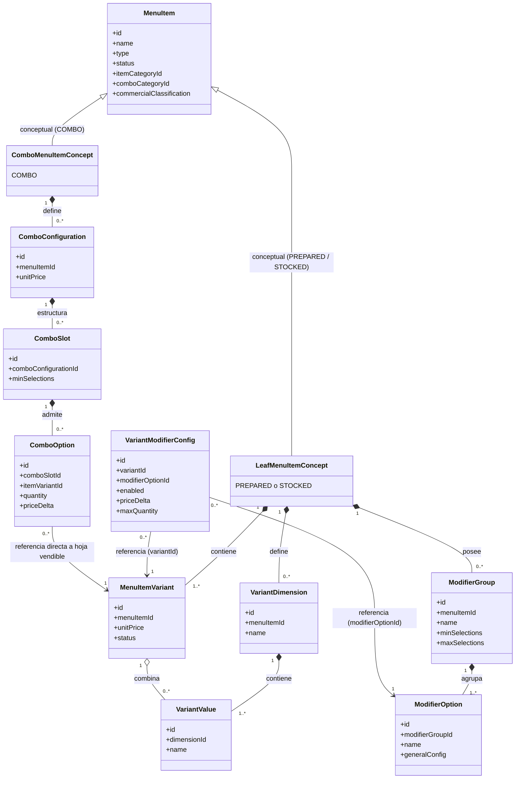
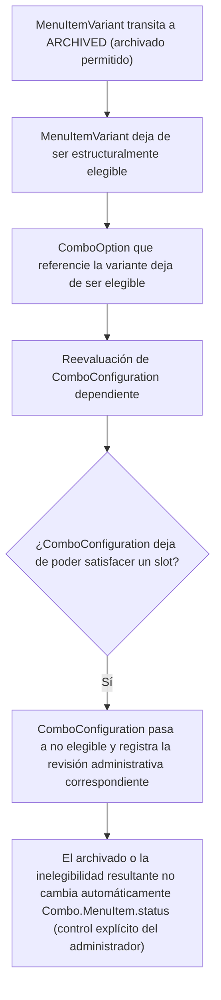
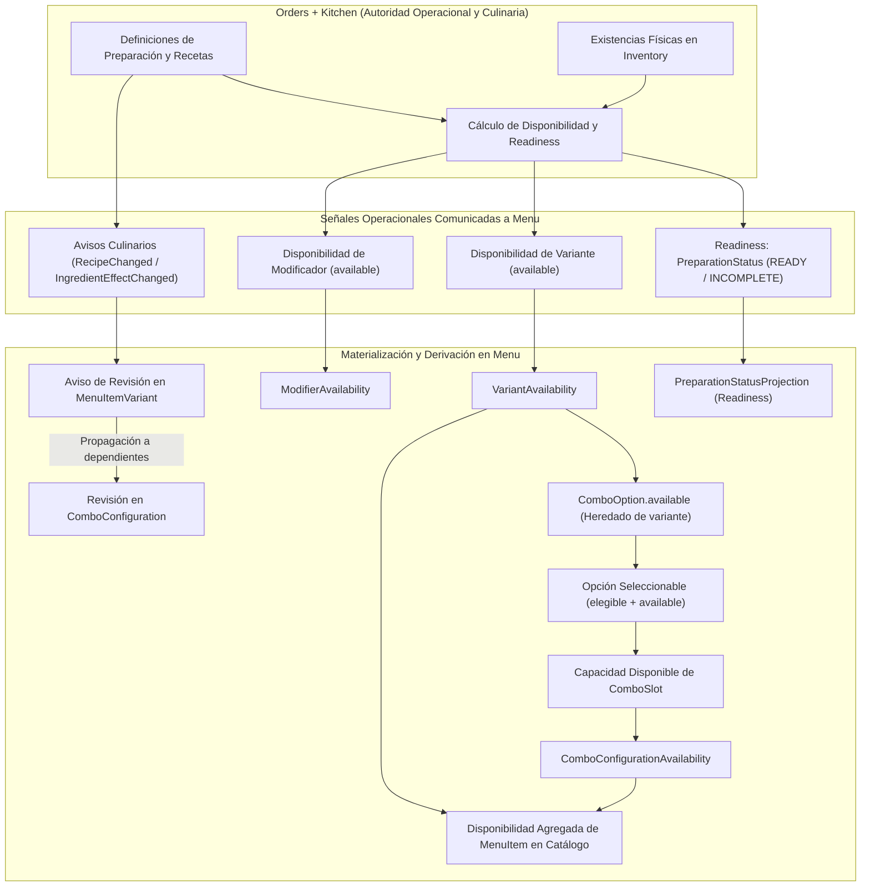
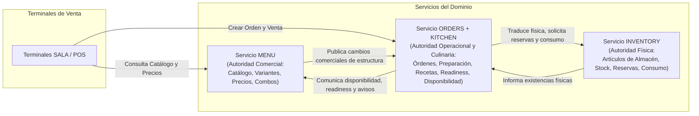

# Especificación Final Vigente del Servicio Menu

**Documento:** Especificación Técnica, Funcional y de Arquitectura de Dominio Consolidada  
**Servicio:** Menu (Sistema de Comandas para Restaurantes)  
**Versión:** 1.3.7 (Especificación Consolidada Vigente)
**Estado:** Vigente / Aprobado  
**Fecha:** 2026-09-20
**Fuente Normativa:** `docs/md/Auditoria-4.md`
---

## 1. Índice General

- [Especificación Final Vigente del Servicio Menu](#especificación-final-vigente-del-servicio-menu)
  - [1. Índice General](#1-índice-general)
  - [2. Configuración del Documento](#2-configuración-del-documento)
    - [2.1 Identificación y Propósito](#21-identificación-y-propósito)
    - [2.2 Autoridad Normativa Única](#22-autoridad-normativa-única)
    - [2.3 Alcance y Exclusiones](#23-alcance-y-exclusiones)
  - [3. Contexto, Alcance y Lenguaje del Dominio](#3-contexto-alcance-y-lenguaje-del-dominio)
    - [3.1 Separación General de Responsabilidades](#31-separación-general-de-responsabilidades)
    - [3.2 Límites de Contexto y Ownership de Datos](#32-límites-de-contexto-y-ownership-de-datos)
    - [3.3 Taxonomía Fundamental del Menú](#33-taxonomía-fundamental-del-menú)
    - [3.4 Ortogonalidad de Dimensiones del Dominio](#34-ortogonalidad-de-dimensiones-del-dominio)
    - [3.5 Glosario Normativo del Dominio](#35-glosario-normativo-del-dominio)
  - [4. Requisitos Funcionales Consolidados](#4-requisitos-funcionales-consolidados)
    - [4.1 Definición y Catálogo de MenuItems](#41-definición-y-catálogo-de-menuitems)
      - [REQ-MENU-ITM-001 — Definición del MenuItem Comercial](#req-menu-itm-001--definición-del-menuitem-comercial)
    - [4.2 Variantes de Productos Hoja y Dimensiones](#42-variantes-de-productos-hoja-y-dimensiones)
      - [REQ-MENU-VAR-001 — Presentación Vendible de Item Hoja](#req-menu-var-001--presentación-vendible-de-item-hoja)
      - [REQ-MENU-VAR-001B — Fallback Técnico de Variante DEFAULT](#req-menu-var-001b--fallback-técnico-de-variante-default)
      - [REQ-MENU-VAR-001C — VariantId No Nulo en Producto Hoja](#req-menu-var-001c--variantid-no-nulo-en-producto-hoja)
      - [REQ-MENU-VAR-002 — Definición de Dimensiones y Valores de Variante](#req-menu-var-002--definición-de-dimensiones-y-valores-de-variante)
      - [REQ-MENU-VAR-002B — Combinación Válida de Valores de Dimensiones](#req-menu-var-002b--combinación-válida-de-valores-de-dimensiones)
      - [REQ-MENU-VAR-002C — Exclusividad Comercial entre Item y Variante](#req-menu-var-002c--exclusividad-comercial-entre-item-y-variante)
      - [REQ-MENU-VAR-003 — Elegibilidad Estructural de Variante Hoja](#req-menu-var-003--elegibilidad-estructural-de-variante-hoja)
    - [4.3 Precios Autoritativos y Proyección de Catálogo](#43-precios-autoritativos-y-proyección-de-catálogo)
      - [REQ-MENU-PRC-001 — Precio Absoluto Autoritativo de la Variante](#req-menu-prc-001--precio-absoluto-autoritativo-de-la-variante)
      - [REQ-MENU-PRC-002 — Proyección de Precio de Catálogo para Producto Hoja con Una Variante Elegible](#req-menu-prc-002--proyección-de-precio-de-catálogo-para-producto-hoja-con-una-variante-elegible)
      - [REQ-MENU-PRC-002B — Proyección de Precio de Catálogo para Producto Hoja con Múltiples Variantes de Igual Precio](#req-menu-prc-002b--proyección-de-precio-de-catálogo-para-producto-hoja-con-múltiples-variantes-de-igual-precio)
      - [REQ-MENU-PRC-002C — Proyección de Catálogo «Desde $X» para Producto Hoja con Precios Distintos](#req-menu-prc-002c--proyección-de-catálogo-desde-x-para-producto-hoja-con-precios-distintos)
      - [REQ-MENU-PRC-002D — Conservación del Precio Comercial ante Indisponibilidad Operacional](#req-menu-prc-002d--conservación-del-precio-comercial-ante-indisponibilidad-operacional)
    - [4.4 Modificadores Comerciales y Especialización](#44-modificadores-comerciales-y-especialización)
      - [REQ-MENU-MOD-001 — Ownership y Cardinalidad de Grupos y Opciones en Productos Hoja](#req-menu-mod-001--ownership-y-cardinalidad-de-grupos-y-opciones-en-productos-hoja)
      - [REQ-MENU-MOD-001B — Límites de Selección en Grupos de Modificadores](#req-menu-mod-001b--límites-de-selección-en-grupos-de-modificadores)
      - [REQ-MENU-MOD-001C — Configuración Comercial General de Opciones de Modificador](#req-menu-mod-001c--configuración-comercial-general-de-opciones-de-modificador)
      - [REQ-MENU-MOD-001D — Restricción de Ausencia de Modificadores Globales en Combos](#req-menu-mod-001d--restricción-de-ausencia-de-modificadores-globales-en-combos)
      - [REQ-MENU-MOD-001E — Exclusión de Efectos Físicos y Culinarios en Modificadores de Menu](#req-menu-mod-001e--exclusión-de-efectos-físicos-y-culinarios-en-modificadores-de-menu)
      - [REQ-MENU-MOD-002 — Especialización Comercial de Modificador por Variante](#req-menu-mod-002--especialización-comercial-de-modificador-por-variante)
    - [4.5 Combos, Configuraciones, Slots y Opciones](#45-combos-configuraciones-slots-y-opciones)
      - [REQ-MENU-COM-001 — Configuración de Combo (ComboConfiguration)](#req-menu-com-001--configuración-de-combo-comboconfiguration)
      - [REQ-MENU-COM-002 — Definición de ComboSlot y Selección Mínima Respaldada](#req-menu-com-002--definición-de-comboslot-y-selección-mínima-respaldada)
      - [REQ-MENU-COM-002B — Referencia Directa de ComboOption a Variante Hoja](#req-menu-com-002b--referencia-directa-de-combooption-a-variante-hoja)
      - [REQ-MENU-COM-002C — Cantidad Entera Positiva en Unidades Completas y Rechazo de Fracciones en ComboOption](#req-menu-com-002c--cantidad-entera-positiva-en-unidades-completas-y-rechazo-de-fracciones-en-combooption)
      - [REQ-MENU-COM-002D — Ajuste Relativo de Precio (priceDelta) en ComboOption](#req-menu-com-002d--ajuste-relativo-de-precio-pricedelta-en-combooption)
      - [REQ-MENU-COM-002E — Modelado Previo de Porciones Diferenciadas como Variantes Hoja Concretas](#req-menu-com-002e--modelado-previo-de-porciones-diferenciadas-como-variantes-hoja-concretas)
      - [REQ-MENU-COM-003 — Tarificación Comercial del Combo](#req-menu-com-003--tarificación-comercial-del-combo)
      - [REQ-MENU-COM-003B — Exclusión de Precios Regulares de Variantes en Combos](#req-menu-com-003b--exclusión-de-precios-regulares-de-variantes-en-combos)
      - [REQ-MENU-COM-003C — Cobro Independiente de Modificadores Repetidos en Componentes](#req-menu-com-003c--cobro-independiente-de-modificadores-repetidos-en-componentes)
      - [REQ-MENU-COM-004 — Clonación Completa de Configuración de Combo](#req-menu-com-004--clonación-completa-de-configuración-de-combo)
      - [REQ-MENU-COM-005 — Copia hacia Configuración Existente con Mapeo Explícito de Slots](#req-menu-com-005--copia-hacia-configuración-existente-con-mapeo-explícito-de-slots)
      - [REQ-MENU-COM-006 — Atomicidad por Destino y Éxito Parcial en Copia de Combos](#req-menu-com-006--atomicidad-por-destino-y-éxito-parcial-en-copia-de-combos)
      - [REQ-MENU-COM-007 — Elegibilidad Estructural de Configuración de Combo](#req-menu-com-007--elegibilidad-estructural-de-configuración-de-combo)
    - [4.6 Categorías y Clasificación Comercial](#46-categorías-y-clasificación-comercial)
      - [REQ-MENU-CAT-001 — Clasificación Comercial de Productos Hoja](#req-menu-cat-001--clasificación-comercial-de-productos-hoja)
      - [REQ-MENU-CAT-001B — Categorías Comerciales Compartidas de Productos Hoja (ItemCategory)](#req-menu-cat-001b--categorías-comerciales-compartidas-de-productos-hoja-itemcategory)
      - [REQ-MENU-CAT-001C — Catálogo Separado de Categorías de Combos (ComboCategory) y No Herencia](#req-menu-cat-001c--catálogo-separado-de-categorías-de-combos-combocategory-y-no-herencia)
    - [4.7 Archivado y Ciclo de Vida](#47-archivado-y-ciclo-de-vida)
      - [REQ-MENU-LIF-001 — Operación de Archivado Permitido de Variante](#req-menu-lif-001--operación-de-archivado-permitido-de-variante)
      - [REQ-MENU-LIF-001B — Inelegibilidad Estructural de Variante Archivada](#req-menu-lif-001b--inelegibilidad-estructural-de-variante-archivada)
      - [REQ-MENU-LIF-001C — Inelegibilidad Estructural de Opciones de Combo Vinculadas a Variante Archivada](#req-menu-lif-001c--inelegibilidad-estructural-de-opciones-de-combo-vinculadas-a-variante-archivada)
      - [REQ-MENU-LIF-001D — Reevaluación de Configuraciones de Combo Dependientes](#req-menu-lif-001d--reevaluación-de-configuraciones-de-combo-dependientes)
      - [REQ-MENU-LIF-001E — Inelegibilidad y Registro de Revisión en Configuración de Combo no Satisfecha](#req-menu-lif-001e--inelegibilidad-y-registro-de-revisión-en-configuración-de-combo-no-satisfecha)
      - [REQ-MENU-LIF-001F — Conservación Explícita del Estado Administrativo de MenuItem Combo](#req-menu-lif-001f--conservación-explícita-del-estado-administrativo-de-menuitem-combo)
    - [4.8 Readiness de Preparación](#48-readiness-de-preparación)
      - [REQ-MENU-RDY-001 — Proyección de Readiness de Preparación de Variante](#req-menu-rdy-001--proyección-de-readiness-de-preparación-de-variante)
    - [4.9 Disponibilidad Granular y Propagada](#49-disponibilidad-granular-y-propagada)
      - [REQ-MENU-AVL-001 — Desacoplamiento y Exclusión del Cálculo Físico de Disponibilidad en Menu](#req-menu-avl-001--desacoplamiento-y-exclusión-del-cálculo-físico-de-disponibilidad-en-menu)
      - [REQ-MENU-AVL-001B — Recepción y Materialización de Disponibilidad Operacional de Variante (VariantAvailability)](#req-menu-avl-001b--recepción-y-materialización-de-disponibilidad-operacional-de-variante-variantavailability)
      - [REQ-MENU-AVL-001C — Recepción y Materialización de Disponibilidad Operacional de Modificadores (ModifierAvailability)](#req-menu-avl-001c--recepción-y-materialización-de-disponibilidad-operacional-de-modificadores-modifieravailability)
      - [REQ-MENU-AVL-001D — Carácter Opcional y No Autoritativo del Espejo Local de Disponibilidad](#req-menu-avl-001d--carácter-opcional-y-no-autoritativo-del-espejo-local-de-disponibilidad)
      - [REQ-MENU-AVL-001E — Preservación de Estado Administrativo, Elegibilidad y Precios ante Disponibilidad Operacional](#req-menu-avl-001e--preservación-de-estado-administrativo-elegibilidad-y-precios-ante-disponibilidad-operacional)
      - [REQ-MENU-AVL-002 — Disponibilidad de Modificadores Opcionales y No Bloqueo de Variante](#req-menu-avl-002--disponibilidad-de-modificadores-opcionales-y-no-bloqueo-de-variante)
      - [REQ-MENU-AVL-003 — Bloqueo de Variante por Grupos de Modificadores Obligatorios](#req-menu-avl-003--bloqueo-de-variante-por-grupos-de-modificadores-obligatorios)
      - [REQ-MENU-AVL-004 — Propagación de Disponibilidad Operacional a Opciones de Combo](#req-menu-avl-004--propagación-de-disponibilidad-operacional-a-opciones-de-combo)
      - [REQ-MENU-AVL-005 — Evaluación de Capacidad Disponible de ComboSlot](#req-menu-avl-005--evaluación-de-capacidad-disponible-de-comboslot)
      - [REQ-MENU-AVL-006 — Disponibilidad Resultante de Configuración de Combo](#req-menu-avl-006--disponibilidad-resultante-de-configuración-de-combo)
      - [REQ-MENU-AVL-007 — Derivación de Disponibilidad Agregada de MenuItem para Catálogo](#req-menu-avl-007--derivación-de-disponibilidad-agregada-de-menuitem-para-catálogo)
    - [4.10 Publicación y Consumo Conceptual de Cambios](#410-publicación-y-consumo-conceptual-de-cambios)
      - [REQ-MENU-INT-001 — Publicación Conceptual de Estructura Comercial hacia Orders + Kitchen](#req-menu-int-001--publicación-conceptual-de-estructura-comercial-hacia-orders--kitchen)
      - [REQ-MENU-INT-003 — Consumo Conceptual de Señales de Readiness de Preparación](#req-menu-int-003--consumo-conceptual-de-señales-de-readiness-de-preparación)
      - [REQ-MENU-INT-003B — Consumo Conceptual de Disponibilidad Operacional de Variante](#req-menu-int-003b--consumo-conceptual-de-disponibilidad-operacional-de-variante)
      - [REQ-MENU-INT-003C — Consumo Conceptual de Disponibilidad Operacional de Modificadores por Variante](#req-menu-int-003c--consumo-conceptual-de-disponibilidad-operacional-de-modificadores-por-variante)
      - [REQ-MENU-INT-003D — Consumo Conceptual de Avisos de Cambios Culinarios](#req-menu-int-003d--consumo-conceptual-de-avisos-de-cambios-culinarios)
    - [4.11 Revisiones Culinarias y Comerciales](#411-revisiones-culinarias-y-comerciales)
      - [REQ-MENU-REV-001 — Detección y Registro de Revisión Comercial](#req-menu-rev-001--detección-y-registro-de-revisión-comercial)
      - [REQ-MENU-REV-002 — Recepción y Registro de Revisión Culinaria con Propagación](#req-menu-rev-002--recepción-y-registro-de-revisión-culinaria-con-propagación)
      - [REQ-MENU-REV-003 — Condición de Revisión Requerida por Desfase de Revisiones](#req-menu-rev-003--condición-de-revisión-requerida-por-desfase-de-revisiones)
      - [REQ-MENU-REV-003B — Reconocimiento Administrativo de Revisión Observada](#req-menu-rev-003b--reconocimiento-administrativo-de-revisión-observada)
      - [REQ-MENU-REV-003C — Reaparición de Condición de Revisión ante Revisión Posterior](#req-menu-rev-003c--reaparición-de-condición-de-revisión-ante-revisión-posterior)
  - [5. Requisitos de Calidad y Rendimiento](#5-requisitos-de-calidad-y-rendimiento)
    - [5.1 Carácter Cualitativo de los Atributos de Calidad](#51-carácter-cualitativo-de-los-atributos-de-calidad)
    - [5.2 Principios de Operación y Resiliencia](#52-principios-de-operación-y-resiliencia)
  - [6. Reglas de Negocio e Invariantes del Dominio](#6-reglas-de-negocio-e-invariantes-del-dominio)
    - [6.1 Reglas de Negocio (BR-MENU)](#61-reglas-de-negocio-br-menu)
    - [6.2 Invariantes de Integridad del Dominio (INV-MENU)](#62-invariantes-de-integridad-del-dominio-inv-menu)
  - [7. Modelo de Dominio](#7-modelo-de-dominio)
    - [7.1 Agrupaciones Conceptuales del Menú](#71-agrupaciones-conceptuales-del-menú)
    - [7.2 Elementos y Atributos Conceptuales Respaldados](#72-elementos-y-atributos-conceptuales-respaldados)
      - [MenuItem](#menuitem)
      - [MenuItemVariant](#menuitemvariant)
      - [VariantDimension y VariantValue](#variantdimension-y-variantvalue)
      - [ModifierGroup y ModifierOption](#modifiergroup-y-modifieroption)
      - [ModifierOptionConfig](#modifieroptionconfig)
      - [VariantModifierConfig](#variantmodifierconfig)
      - [ComboConfiguration, ComboSlot y ComboOption](#comboconfiguration-comboslot-y-combooption)
    - [7.3 Proyecciones de Consulta (Read Models)](#73-proyecciones-de-consulta-read-models)
    - [7.4 Diagramas Estructurales y de Comportamiento](#74-diagramas-estructurales-y-de-comportamiento)
      - [Modelo Estructural de Dominio Comercial](#modelo-estructural-de-dominio-comercial)
      - [Ciclo de Vida y Ortogonalidad de Dimensiones](#ciclo-de-vida-y-ortogonalidad-de-dimensiones)
      - [Modelo de Propagación de Disponibilidad y Readiness](#modelo-de-propagación-de-disponibilidad-y-readiness)
  - [8. Arquitectura y Límites del Sistema](#8-arquitectura-y-límites-del-sistema)
    - [8.1 Diagrama de Contexto de Bounded Contexts](#81-diagrama-de-contexto-de-bounded-contexts)
    - [8.2 Patrones Conceptuales de Interacción y Comunicación](#82-patrones-conceptuales-de-interacción-y-comunicación)
    - [8.3 Aislamiento de Persistencia y Reglas de Integración](#83-aislamiento-de-persistencia-y-reglas-de-integración)
  - [9. Modelo de Datos Conceptual](#9-modelo-de-datos-conceptual)
    - [9.1 Agrupación Conceptual de Datos](#91-agrupación-conceptual-de-datos)
      - [Estructura Conceptual: MenuItem](#estructura-conceptual-menuitem)
      - [Estructura Conceptual: MenuItemVariant](#estructura-conceptual-menuitemvariant)
      - [Estructuras Conceptuales: VariantDimension y VariantValue](#estructuras-conceptuales-variantdimension-y-variantvalue)
      - [Estructura Conceptual: ModifierGroup](#estructura-conceptual-modifiergroup)
      - [Estructura Conceptual: ModifierOption](#estructura-conceptual-modifieroption)
      - [Estructura Conceptual: VariantModifierConfig](#estructura-conceptual-variantmodifierconfig)
      - [Estructura Conceptual: ComboConfiguration](#estructura-conceptual-comboconfiguration)
      - [Estructura Conceptual: ComboSlot](#estructura-conceptual-comboslot)
      - [Estructura Conceptual: ComboOption](#estructura-conceptual-combooption)
    - [9.2 Relaciones Conceptuales y Restricciones](#92-relaciones-conceptuales-y-restricciones)
    - [9.3 Delimitación de Persistencia y Proyecciones Locales](#93-delimitación-de-persistencia-y-proyecciones-locales)
  - [10. Interfaces Conceptuales](#10-interfaces-conceptuales)
    - [10.1 Interfaz Conceptual de Consulta de Catálogo](#101-interfaz-conceptual-de-consulta-de-catálogo)
    - [10.2 Interfaz Conceptual de Administración y Copia de Combos](#102-interfaz-conceptual-de-administración-y-copia-de-combos)
    - [10.3 Interfaz Conceptual de Gestión y Reconocimiento de Revisiones](#103-interfaz-conceptual-de-gestión-y-reconocimiento-de-revisiones)
  - [11. Eventos e Integración Asíncrona](#11-eventos-e-integración-asíncrona)
    - [11.1 Principios de Integración entre Bounded Contexts](#111-principios-de-integración-entre-bounded-contexts)
    - [11.2 Cambios Comerciales Comunicados por Menu](#112-cambios-comerciales-comunicados-por-menu)
    - [11.3 Eventos y Señales Recibidas por Menu](#113-eventos-y-señales-recibidas-por-menu)
  - [12. Delimitación de Responsabilidades y Ownership Externo](#12-delimitación-de-responsabilidades-y-ownership-externo)
    - [12.1 Responsabilidades de Orders + Kitchen](#121-responsabilidades-de-orders--kitchen)
    - [12.2 Responsabilidades de Inventory](#122-responsabilidades-de-inventory)
    - [12.3 Relación con SALA / POS](#123-relación-con-sala--pos)
  - [13. Cuestiones Abiertas (OPEN)](#13-cuestiones-abiertas-open)
    - [OPEN-INT-001 — Nombres, Contratos y Esquemas de Eventos Menu → Orders + Kitchen](#open-int-001--nombres-contratos-y-esquemas-de-eventos-menu--orders--kitchen)
    - [OPEN-INT-002 — Nombres, Contratos y Esquemas de Eventos Orders + Kitchen → Menu](#open-int-002--nombres-contratos-y-esquemas-de-eventos-orders--kitchen--menu)
    - [OPEN-REV-001 — Ubicación Persistente, Esquema Contractual y Operación de Reconocimiento de Revisiones](#open-rev-001--ubicación-persistente-esquema-contractual-y-operación-de-reconocimiento-de-revisiones)
    - [OPEN-NFR-001 — Requisitos Cuantitativos de Calidad, Rendimiento y Dimensionamiento](#open-nfr-001--requisitos-cuantitativos-de-calidad-rendimiento-y-dimensionamiento)
    - [OPEN-AVL-001 — Mecanismo, Estructura y Persistencia Concreta de Proyecciones de Disponibilidad y Readiness](#open-avl-001--mecanismo-estructura-y-persistencia-concreta-de-proyecciones-de-disponibilidad-y-readiness)
    - [OPEN-AVL-002 — Regla de Cálculo y Semántica Precisa de Capacidad Disponible (availableCapacity) en ComboSlot](#open-avl-002--regla-de-cálculo-y-semántica-precisa-de-capacidad-disponible-availablecapacity-en-comboslot)
    - [OPEN-CAT-001 — Comportamiento y Proyección de Catálogo ante Ausencia de Unidades Elegibles](#open-cat-001--comportamiento-y-proyección-de-catálogo-ante-ausencia-de-unidades-elegibles)
    - [OPEN-LIF-001 — Transiciones, Restauración o Comportamiento Posterior a ARCHIVED](#open-lif-001--transiciones-restauración-o-comportamiento-posterior-a-archived)
    - [OPEN-PRC-001 — Proyección de Precio de Catálogo para Combos](#open-prc-001--proyección-de-precio-de-catálogo-para-combos)
  - [14. Matriz de Trazabilidad](#14-matriz-de-trazabilidad)
    - [14.1 Trazabilidad de Requisitos Funcionales (63 Requisitos)](#141-trazabilidad-de-requisitos-funcionales-63-requisitos)
    - [14.2 Trazabilidad de Reglas de Negocio e Invariantes (24 BR-MENU y 5 INV-MENU)](#142-trazabilidad-de-reglas-de-negocio-e-invariantes-24-br-menu-y-5-inv-menu)
    - [14.3 Trazabilidad de Cuestiones Abiertas (9 Cuestiones)](#143-trazabilidad-de-cuestiones-abiertas-9-cuestiones)

---

## 2. Configuración del Documento

### 2.1 Identificación y Propósito

El presente documento constituye la especificación técnica, funcional, estructural y de arquitectura consolidada y vigente para el servicio **Menu**, componente central de oferta comercial dentro del sistema de comandas y gestión de restaurantes. Su objetivo es establecerse como un **modelo vigente, autosuficiente y directamente verificable**, sin narrativas históricas de cambios ni transcripciones de etapas transitorias previas.

La versión **1.3.7** consolida formalmente el modelo normativo del servicio Menu bajo la autoridad exclusiva de `docs/md/Auditoria-4.md`. El modelo vigente define integralmente:
1. La taxonomía comercial de `MenuItem` (`PREPARED`, `STOCKED` y `COMBO`), presentaciones vendibles hoja (`MenuItemVariant`) y configuraciones de combo (`ComboConfiguration`) con precios unitarios absolutos autoritativos.
2. La personalización comercial de productos hoja mediante grupos y opciones de modificadores con configuración general y especialización por variante.
3. La clasificación comercial independiente mediante categorías para items hoja y categorías para combos.
4. La estructura desacoplada de combos mediante configuraciones, slots y opciones con referencia directa a variantes hoja vendibles.
5. El ciclo de vida administrativo, archivado y la ortogonalidad estricta entre elegibilidad estructural, readiness de preparación, disponibilidad operacional y revisión.
6. La proyección local no autoritativa de disponibilidad operacional y readiness en Menu para atención eficiente a consultas de catálogo y terminales de venta SALA/POS.
7. El desacoplamiento estricto de persistencia e integración conceptual con Orders + Kitchen e Inventory.
8. Requisitos funcionales atómicos, verificables y trazables directamente a las disposiciones de `docs/md/Auditoria-4.md`.

### 2.2 Autoridad Normativa Única

La consolidación y vigencia de esta especificación se fundamenta con exclusividad en:

- **`docs/md/Auditoria-4.md`** (Síntesis consolidada del modelo: separación general de responsabilidades, modelo comercial de Menu, delimitación de Orders + Kitchen e Inventory, ortogonalidad de estados, disponibilidad granular, revisiones comerciales y culinarias, y simplificación de dominio).

`docs/md/Auditoria-4.md` constituye la única fuente normativa autorizada para esta versión. Se eliminan las referencias a autoridades anteriores, documentos transitorios o decisiones externas. Cualquier discrepancia se resuelve a favor de las disposiciones establecidas en `docs/md/Auditoria-4.md`.

### 2.3 Alcance y Exclusiones

- **Dentro del alcance del servicio Menu:**
  - Definición y administración del catálogo comercial: `MenuItem` caracterizado por su tipo comercial (`type`: `PREPARED`, `STOCKED` o `COMBO`), nombre comercial y estado administrativo respaldado.
  - Modelado de presentaciones vendibles hoja (`MenuItemVariant`) para productos `PREPARED` y `STOCKED`, incluyendo la variante técnica predeterminada `DEFAULT`.
  - Dimensiones y valores de diferenciación comercial vendible (`VariantDimension`, `VariantValue`).
  - Custodia de precios unitarios absolutos autoritativos en variantes (`MenuItemVariant.unitPrice`) y configuraciones de combo (`ComboConfiguration.unitPrice`), junto con la proyección de catálogo de productos hoja (`$X` o `Desde $X`).
  - Personalización comercial de productos hoja: grupos (`ModifierGroup`) y opciones (`ModifierOption`) con ajuste relativo de precio (`priceDelta`) y cantidad máxima (`maxQuantity`), configuración general (`generalConfig`) y especialización opcional por variante (`VariantModifierConfig`).
  - Posibilidad opcional de materializar la proyección comercial de modificadores resueltos (`ResolvedVariantModifier`) circunscrita a los datos comerciales efectivos indicados en la sección 12 de la fuente.
  - Composición de combos vendibles mediante configuraciones (`ComboConfiguration`), espacios de selección (`ComboSlot`) y opciones (`ComboOption`) referenciando directamente variantes hoja vendibles con cantidades enteras en unidades completas.
  - Clonación completa de configuraciones de combo con regeneración de identidades y copia hacia configuraciones existentes mediante mapeo explícito de slots.
  - Clasificación de productos hoja mediante categorías compartidas (`ItemCategory`) y organización de combos mediante categorías separadas (`ComboCategory`).
  - Evaluación y reporte de elegibilidad estructural independiente de condiciones físicas u operativas momentáneas.
  - Archivado administrativo de variantes y reevaluación no obstructiva de dependencias en combos, preservando el estado administrativo de la entidad combo.
  - Recepción, materialización y proyección local no autoritativa de readiness operacional (`PreparationStatus`) provisto por Orders + Kitchen.
  - Consumo y materialización local no autoritativa de proyecciones desacopladas de disponibilidad operacional granular (`VariantAvailability`, `ModifierAvailability`) calculadas por Orders + Kitchen, propagación a opciones de combo, evaluación de cobertura de slots y disponibilidad resultante de configuraciones.
  - Publicación conceptual de identidades y cambios comerciales estructurales hacia Orders + Kitchen y exposición de catálogo hacia terminales de venta (SALA/POS).
  - Detección de revisiones comerciales (originadas en Menu) y consumo de revisiones culinarias (originadas en Orders + Kitchen), con seguimiento formal de revisiones observadas y reconocidas (`observedRevision` vs `acknowledgedRevision`).

- **Fuera del alcance del servicio Menu (Exclusiones de Dominio):**
  - Recetas de cocina, ingredientes, componentes físicos, gramajes, fichas técnicas culinarias e instrucciones de elaboración (responsabilidad exclusiva de Orders + Kitchen).
  - Efectos físicos reales sobre ingredientes producidos por modificadores (responsabilidad de Orders + Kitchen).
  - Control de existencias físicas, artículos de inventario (`InventoryItem`), stock, reservas, consumo y movimientos (entradas, salidas, ajustes) (responsabilidad exclusiva de Inventory).
  - Cálculo transaccional de reservas de stock, imputación de consumo físico y deducciones de almacén (responsabilidad de Orders + Kitchen e Inventory).
  - Creación y gestión transaccional de órdenes (`Order`, `OrderLine`) y snapshots comerciales (responsabilidad de Orders + Kitchen).
  - Terminales de punto de venta y renderizado de interfaces gráficas.

---

## 3. Contexto, Alcance y Lenguaje del Dominio

### 3.1 Separación General de Responsabilidades

La solución arquitectónica se divide de forma estricta entre tres bounded contexts principales:

```text
+-------------------------------------------------------------------------+
|                                  MENU                                   |
| ¿Qué se vende?                                                          |
| ¿Cómo puede configurarlo comercialmente el cliente?                     |
| ¿Cuánto cuesta?                                                         |
+-------------------------------------------------------------------------+
                                     │
           Publicación conceptual    │ Proyección conceptual de readiness,
           de identidades vendibles  │ disponibilidad y avisos culinarios
                                     ▼
+-------------------------------------------------------------------------+
|                            ORDERS + KITCHEN                             |
| ¿Qué pidió el cliente? (Orders: ciclo de orden, OrderLine, snapshots)   |
| ¿Cómo se prepara o satisface físicamente? (Kitchen: recetas, gramajes,  |
|  efectos físicos, preparación, traducción física a insumos)             |
+-------------------------------------------------------------------------+
                                     │
           Traducción física         │ Información de existencias
           reservas y consumo        │ y movimientos
                                     ▼
+-------------------------------------------------------------------------+
|                                INVENTORY                                |
| ¿Qué recursos físicos existen?                                          |
| ¿Cuánto hay disponible? (Stock físico, movimientos, almacén)            |
+-------------------------------------------------------------------------+
```

La separación no implica duplicar entidades entre servicios. Cada bounded context mantiene únicamente los atributos e información necesarios para su propia responsabilidad de dominio, vinculándose mediante identificadores escalares opacos, contratos de servicio y eventos de negocio.

### 3.2 Límites de Contexto y Ownership de Datos

1. **Menu es la autoridad comercial exclusiva:** Custodia la identidad de los productos, sus variantes vendibles, sus dimensiones comerciales, sus modificadores comerciales, sus precios de venta y la estructura de sus combos. Menu desconoce recetas, ingredientes, gramajes y existencias físicas.
2. **Orders + Kitchen es la autoridad operacional y culinaria exclusiva:** Custodia las órdenes de venta, las selecciones confirmadas por el cliente, los snapshots comerciales en el instante de venta, las definiciones culinarias de preparación (`Recipe`), los ingredientes, las revisiones culinarias (`PreparationRevision`), los efectos físicos de las opciones, la verificación de readiness de preparación y el cálculo de la disponibilidad operacional contrastando las preparaciones con los datos de inventario.
3. **Inventory es la autoridad física exclusiva:** Custodia los artículos de inventario (`InventoryItem`), el stock actual, las cantidades reservadas, las existencias disponibles y el registro de movimientos de almacén. Desconoce la semántica comercial (precios, combos, categorías) y las reglas de preparación culinaria.
4. **Aislamiento absoluto de persistencia:** Cada servicio mantiene su propio almacenamiento aislado. No existen tablas compartidas ni asociaciones ORM entre bases de datos entre Menu, Orders + Kitchen e Inventory.

### 3.3 Taxonomía Fundamental del Menú

El catálogo de Menu estructura sus ofertas bajo tres tipos conceptuales:

```text
MenuItem (Definición Comercial de Catálogo)
├── PREPARED (Producto hoja elaborado mediante preparación culinaria externa)
├── STOCKED  (Producto hoja terminado abastecido físicamente en almacén)
└── COMBO    (Composición comercial estructurada de productos hoja)
```

1. **Productos Hoja (`PREPARED` y `STOCKED`):**
   - Son unidades vendibles directas del catálogo.
   - Poseen una o más presentaciones vendibles concretas (`MenuItemVariant`).
   - Poseen grupos de modificadores comerciales (`ModifierGroup`) que aplican a sus variantes.
   - Comparten el catálogo de categorías comerciales de hoja (`ItemCategory`) y pueden clasificarse comercialmente en `PLATILLO`, `BEBIDA`, `POSTRE` o `COMPLEMENTO`.
   - **`PREPARED`:** Es un producto que requiere preparación. Menu conoce su identidad comercial, variante, nombre, precio, categoría y modificadores comerciales; Orders + Kitchen conoce cómo se prepara esa variante (receta, ingredientes, instrucciones). Menu no almacena asociaciones autoritativas de recetas ni información culinaria.
   - **`STOCKED`:** Es un producto terminado comercializado directamente. Menu mantiene la identidad y semántica comercial; la resolución hacia artículos y cantidades de almacén pertenece a la interacción operacional entre Orders + Kitchen e Inventory. Menu no almacena referencias físicas de almacén ni cantidades físicas de retiro.
2. **Combos (`COMBO`):**
   - Representan paquetes o composiciones comerciales de productos hoja.
   - No son ni `PREPARED` ni `STOCKED`; no poseen recetas, no poseen artículos de almacén ni poseen `MenuItemVariant`.
   - Se estructuran exclusivamente mediante configuraciones comerciales (`ComboConfiguration`), espacios de elección (`ComboSlot`) y opciones vendibles (`ComboOption`).
   - Cada `ComboOption` apunta directamente a una `MenuItemVariant` hoja concreta.
   - Los combos no tienen modificadores comerciales globales propios. Las personalizaciones aplican directamente sobre los productos hoja seleccionados en sus slots.
   - Utilizan un catálogo de categorías comerciales independiente (`ComboCategory`) y no reciben clasificación comercial de hoja ni heredan categorías de sus componentes.
3. **Patrón de Variante Técnica `DEFAULT`:**
   - Todo producto hoja tiene al menos una variante vendible (`MenuItemVariant [1..N]`).
   - Cuando comercialmente un producto hoja no presenta variantes visibles para el cliente, Menu genera y mantiene una variante técnica `DEFAULT`.
   - Garantiza que hacia Orders y en toda comanda el identificador `variantId` sea siempre no nulo (`variantId != null`).
   - La variante técnica `DEFAULT` es un mecanismo estructural interno y no debe confundirse con una eventual selección de interfaz predeterminada (`defaultVariantId`).
4. **Dimensiones de Variante (`VariantDimension` y `VariantValue`):**
   - Representan características comerciales de diferenciación (ej. *Tamaño: Individual, Pareja, Familiar*; o *Volumen: 355 ml, 600 ml, 1 L*).
   - Cada `MenuItemVariant` representa una combinación válida de valores de las dimensiones definidas en su item.
   - Una misma oferta comercial no debe representarse simultáneamente como variante y como `MenuItem` independiente.
5. **Pricing de Productos Hoja y Proyección de Catálogo:**
   - El precio unitario autoritativo de un producto hoja pertenece a `MenuItemVariant.unitPrice` y es absoluto.
   - El atributo `MenuItem.basePrice` carece de validez normativa y no se utilizará como fuente autoritativa.
   - Las reglas de proyección de precio en catálogo aplican con exclusividad a productos hoja y no se generalizan a composiciones o configuraciones de combo:
     - Una sola variante elegible o varias con idéntico precio: proyecta `$X`.
     - Varias variantes elegibles con precios distintos: proyecta `Desde $X` (donde `$X` es el menor precio).
     - Sin variantes elegibles: el comportamiento y proyección de catálogo ante ausencia de unidades elegibles se mantiene como cuestión abierta (`OPEN-CAT-001`).
   - La proyección de precio en catálogo para combos no está definida en la fuente normativa y se registra formalmente como cuestión abierta (`OPEN-PRC-001`).
   - La indisponibilidad operacional momentánea no altera ni elimina el precio comercial de una variante.

### 3.4 Ortogonalidad de Dimensiones del Dominio

El dominio establece una distinción tajante entre cinco dimensiones estrictamente ortogonales que jamás deben fusionarse, sobrescribirse ni confundirse mutuamente:

| Dimensión | Pregunta que Responde | Autoridad / Origen | Estados / Expresión Conceptual | Impacto en el Dominio |
| :--- | :--- | :--- | :--- | :--- |
| **1. Estado Administrativo** | ¿El administrador comercial desea ofrecer esta definición en el catálogo? | **Menu** (Gestión de catálogo) | `ACTIVE`, `INACTIVE`, `ARCHIVED` (el archivado aplica a variantes). | Define la voluntad comercial; el archivado está permitido y sus efectos sobre elegibilidad y dependencias rigen normativamente, manteniéndose su comportamiento posterior como cuestión abierta (`OPEN-LIF-001`). No cambia automáticamente por fluctuaciones de inventario ni de disponibilidad. |
| **2. Elegibilidad Estructural** | ¿La definición comercial cumple todas las reglas de negocio e invariantes para participar en una nueva venta? | **Menu** (Lógica de dominio e invariantes) | Elegible (`true`) / No elegible (`false`). | Una variante archivada no es elegible. Un combo con un slot obligatorio que no alcanza `minSelections` con opciones elegibles deja de ser elegible. No depende del stock físico. |
| **3. Readiness de Preparación** | ¿Kitchen cuenta con una definición operacional válida de preparación para esta variante? | **Orders + Kitchen** (Definición operacional) | `READY`, `INCOMPLETE`. | Señal operacional consumida por Menu. Una variante puede ser estructuralmente elegible y estar comercialmente activa, pero hallarse en `INCOMPLETE` si cocina no ha completado su definición. No modifica la elegibilidad estructural. |
| **4. Disponibilidad Operacional** | ¿Puede esta unidad venderse, prepararse o entregarse en este momento según existencias físicas? | **Orders + Kitchen** (Cálculo a partir de Inventory) | Disponible (`available = true`) / No disponible (`available = false`), con límites momentáneos opcionales. | Proyección operacional calculada por Orders + Kitchen combinando recetas y stock de Inventory, recibida y materializada por Menu. Menu puede mantener un espejo local no autoritativo para responder con baja latencia a terminales SALA/POS. Semáforo granular que no muta el estado administrativo persistente ni la elegibilidad. |
| **5. Supervisión de Revisiones Administrativas** | ¿Existen cambios no atendidos (comerciales o culinarios) que requieran supervisión administrativa? | **Menu** (Detección de dependencias y avisos) | Condición `REVIEW_REQUIRED` expresada cuando `observedRevision > acknowledgedRevision`. | Aplica inicialmente a `MenuItemVariant` ante cambios culinarios externos (propagándose a `ComboConfiguration` dependientes), y aplica principalmente a `ComboConfiguration` ante cambios comerciales de componentes. Se gestiona comparando revisión observada y reconocida. No bloquea ventas automáticamente. |

**Reglas Fundamentales de Ortogonalidad:**
1. Ninguna proyección operacional es un estado administrativo persistente en Menu. Menu puede mantener un espejo local o proyecciones no autoritativas de disponibilidad operacional y readiness para atender consultas rápidamente; la estructura y tecnología concreta de este espejo permanecen abiertas (`OPEN-AVL-001`).
2. Los cambios operacionales de existencias físicas en Inventory o el agotamiento momentáneo de insumos no modifican el estado administrativo, no alteran la elegibilidad estructural ni disparan la condición de revisión administrativa.
3. La condición de revisión administrativa `REVIEW_REQUIRED` es un mecanismo de supervisión; no equivale a indisponibilidad operacional ni altera el estado administrativo de los productos ni de los combos.

### 3.5 Glosario Normativo del Dominio

- **`MenuItem`:** Entidad comercial de catálogo que agrupa presentaciones vendibles bajo una identidad de producto (`PREPARED`, `STOCKED` o `COMBO`).
- **`MenuItemVariant`:** Presentación vendible concreta de un producto hoja (`PREPARED` o `STOCKED`). Custodia el precio unitario absoluto autoritativo (`unitPrice`). Los combos no poseen variantes.
- **`Default Variant`:** Variante técnica obligatoria de un producto hoja cuando no existen presentaciones comerciales seleccionables por el cliente, garantizando `variantId != null`.
- **`VariantDimension`:** Característica comercial de diferenciación vendible dentro de un producto hoja (ej. *Tamaño*).
- **`VariantValue`:** Instancia concreta dentro de una dimensión (ej. *Familiar*). Cada variante vendible representa una combinación válida de valores de las dimensiones definidas para su item.
- **`ModifierGroup`:** Conjunto de opciones de personalización perteneciente a un `MenuItem` hoja, con restricciones de selección mínima (`minSelections`) y máxima (`maxSelections`). No existe en el modelo de Combo.
- **`ModifierOption`:** Opción de personalización comercial dentro de un grupo con nombre, ajuste de precio relativo (`priceDelta`) y cantidad máxima elegible (`maxQuantity`). Contiene una configuración comercial general (`generalConfig`). No almacena directivas físicas sobre ingredientes en Menu.
- **`VariantModifierConfig`:** Especialización comercial opcional de una `ModifierOption` para una `MenuItemVariant` específica. Sobrescribe `priceDelta`, `maxQuantity` o `enabled`. No contiene efectos culinarios en Menu.
- **`ResolvedVariantModifier`:** Proyección comercial opcional y no normativa que Menu puede materializar conteniendo únicamente los valores comerciales efectivos (`variantId`, `modifierOptionId`, `enabled`, `priceDelta`, `maxQuantity`), sin efectos culinarios ni disponibilidad operacional.
- **`ComboConfiguration`:** Configuración vendible coordinada de un combo con precio unitario absoluto propio (`unitPrice`) y un conjunto de slots. Puede utilizar una configuración técnica `DEFAULT` si no presenta alternativas visibles al cliente.
- **`ComboSlot`:** Espacio de selección comercial dentro de una configuración de combo con selección mínima requerida (`minSelections`).
- **`ComboOption`:** Opción elegible dentro de un slot que referencia directamente a una `MenuItemVariant` hoja, con cantidad física suministrada entera en unidades completas ($\text{quantity} \ge 1$) y delta de precio (`priceDelta`).
- **`Opción Seleccionable de Combo`:** Condición operacional sobre una `ComboOption` que exige copulativamente que su variante hoja referenciada sea estructuralmente elegible y operacionalmente disponible.
- **`Capacidad Disponible de ComboSlot`:** Evaluación de la cobertura de opciones seleccionables dentro de un slot para satisfacer `minSelections`. La fórmula o semántica de cálculo precisa de `availableCapacity` no está fijada en la fuente normativa y se mantiene como cuestión abierta (`OPEN-AVL-002`).
- **`PreparationStatus`:** Indicador de readiness operacional provisto por Orders + Kitchen para una variante (`READY` o `INCOMPLETE`).
- **`VariantAvailability`:** Proyección operacional de disponibilidad para una variante hoja calculada por Orders + Kitchen a partir de requerimientos de preparación y existencias de stock, recibida y materializada por Menu.
- **`ModifierAvailability`:** Proyección operacional de disponibilidad para una opción de modificador en una variante calculada por Orders + Kitchen, recibida y materializada por Menu.
- **`ComboConfigurationAvailability`:** Proyección operacional de disponibilidad para una configuración de combo calculada por Menu a partir de la cobertura de sus slots obligatorios ($\text{availableCapacity} \ge \text{minSelections}$).
- **`Espejo Local de Disponibilidad`:** Proyección o réplica local no autoritativa de disponibilidad operacional que Menu puede mantener como posibilidad para responder rápidamente al POS y consultas de catálogo, sin constituir una obligación ni una fuente autoritativa de estado físico.
- **`Revisión Administrativa`:** Mecanismo de detección y supervisión de cambios donde se registra la versión observada frente a la reconocida (`observedRevision` vs `acknowledgedRevision`), manifestando la condición `REVIEW_REQUIRED` mientras exista desfase.
- **`Disponibilidad Agregada de MenuItem`:** Señal proyectada de conveniencia para catálogo que indica si al menos una unidad vendible hija elegible se encuentra operacionalmente disponible. No constituye un estado autoritativo persistente.

---

## 4. Requisitos Funcionales Consolidados

Esta sección consolida formalmente los 63 requisitos normativos del servicio Menu bajo la autoridad exclusiva de `docs/md/Auditoria-4.md`.

### 4.1 Definición y Catálogo de MenuItems

#### REQ-MENU-ITM-001 — Definición del MenuItem Comercial

- **Obligación:** El servicio Menu deberá registrar y administrar entidades comerciales `MenuItem` caracterizadas por un identificador escalar único (`id`), nombre comercial (`name`), su tipo comercial (`type`: `PREPARED`, `STOCKED` o `COMBO`), su estado administrativo respaldado (`status`: `ACTIVE` o `INACTIVE` según corresponda), clasificación comercial aplicable para productos hoja y asociación a categoría comercial.
- **Tipo:** Funcional.
- **Fuente Autorizada:** `docs/md/Auditoria-4.md` (Secciones 1, 2, 6, 8, 13, 17, 21).
- **Verificación:** Demostración: Registrar un `MenuItem` para cada uno de los tres tipos comerciales permitidos con sus estados administrativos respaldados, verificando que los conceptos comerciales respaldados se registren conforme a la fuente.

---

### 4.2 Variantes de Productos Hoja y Dimensiones

#### REQ-MENU-VAR-001 — Presentación Vendible de Item Hoja

- **Obligación:** El servicio Menu deberá asegurar que todo `MenuItem` hoja (`PREPARED` o `STOCKED`) cuente en todo momento con al menos una presentación vendible concreta `MenuItemVariant` (`variants.count >= 1`).
- **Tipo:** Funcional.
- **Fuente Autorizada:** `docs/md/Auditoria-4.md` (Sección 3).
- **Verificación:** Demostración: Registrar productos hoja y constatar que cada uno posee al menos una variante vendible asociada.

#### REQ-MENU-VAR-001B — Fallback Técnico de Variante DEFAULT

- **Obligación:** Cuando comercialmente un producto hoja no posea presentaciones diferenciadas visibles para el cliente, el servicio Menu deberá crear y mantener una variante técnica con código `DEFAULT`, sin confundirla con una variante real preseleccionada por la interfaz de usuario.
- **Tipo:** Funcional.
- **Fuente Autorizada:** `docs/md/Auditoria-4.md` (Sección 3).
- **Verificación:** Demostración: Registrar un producto hoja sin dimensiones comerciales y verificar que se genera y asigna su `MenuItemVariant` técnica `DEFAULT`.

#### REQ-MENU-VAR-001C — VariantId No Nulo en Producto Hoja

- **Obligación:** El servicio Menu deberá garantizar que en todas las operaciones, referencias y consultas sobre presentaciones vendibles de productos hoja el identificador `variantId` sea estrictamente no nulo (`variantId != null`).
- **Tipo:** Funcional.
- **Fuente Autorizada:** `docs/md/Auditoria-4.md` (Sección 3).
- **Verificación:** Inspección: Comprobar en las referencias, proyecciones y operaciones de items hoja que el campo `variantId` resulta siempre accesible y no nulo.

#### REQ-MENU-VAR-002 — Definición de Dimensiones y Valores de Variante

- **Obligación:** El servicio Menu deberá permitir definir dimensiones de variante (`VariantDimension`) con nombre dentro de un `MenuItem` hoja y registrar valores con nombre (`VariantValue`) asociados a cada dimensión.
- **Tipo:** Funcional.
- **Fuente Autorizada:** `docs/md/Auditoria-4.md` (Sección 4).
- **Verificación:** Demostración: Crear dimensiones comerciales (ej. "Tamaño") y sus correspondientes valores ("Individual", "Pareja", "Familiar") en un item hoja.

#### REQ-MENU-VAR-002B — Combinación Válida de Valores de Dimensiones

- **Obligación:** Cada `MenuItemVariant` vendible de un producto hoja deberá representar una combinación válida de valores de las dimensiones definidas para dicho item.
- **Tipo:** Funcional.
- **Fuente Autorizada:** `docs/md/Auditoria-4.md` (Sección 4).
- **Verificación:** Prueba: Registrar variantes asociadas a valores de las dimensiones del item y verificar su correcta vinculación estructural como combinación válida.

#### REQ-MENU-VAR-002C — Exclusividad Comercial entre Item y Variante

- **Obligación:** El servicio Menu deberá asegurar que una misma oferta comercial no se represente simultáneamente como variante y como `MenuItem` independiente.
- **Tipo:** Funcional.
- **Fuente Autorizada:** `docs/md/Auditoria-4.md` (Sección 4).
- **Verificación:** Inspección: Validar en el catálogo que una oferta comercial determinada no coexista de forma duplicada como item independiente y como variante de otro item.

#### REQ-MENU-VAR-003 — Elegibilidad Estructural de Variante Hoja

- **Obligación:** El servicio Menu deberá evaluar la elegibilidad estructural de una `MenuItemVariant` hoja de forma estrictamente independiente de las recetas culinarias, de las existencias físicas de inventario y de la disponibilidad operacional reportada por Orders + Kitchen. Toda `MenuItemVariant` en estado `ARCHIVED` resultará estructuralmente no elegible (`eligible = false`). El servicio Menu no condicionará la elegibilidad estructural a la disponibilidad operacional ni al stock físico, ni considerará el resto de estados administrativos como condición suficiente de elegibilidad.
- **Tipo:** Funcional.
- **Fuente Autorizada:** `docs/md/Auditoria-4.md` (Secciones 2, 6, 8, 21, 22, 36).
- **Verificación:** Prueba: Comprobar que una variante en estado `ARCHIVED` resulta estructuralmente no elegible, y verificar que la ausencia de recetas, la falta de existencias físicas o el reporte de indisponibilidad operacional no alteran la elegibilidad estructural de la variante.

---

### 4.3 Precios Autoritativos y Proyección de Catálogo

#### REQ-MENU-PRC-001 — Precio Absoluto Autoritativo de la Variante

- **Obligación:** El servicio Menu deberá asignar a cada `MenuItemVariant` vendible un precio de venta unitario absoluto autoritativo (`MenuItemVariant.unitPrice`). El atributo histórico `MenuItem.basePrice` carece de validez normativa y no se utilizará como fuente autoritativa.
- **Tipo:** Funcional.
- **Fuente Autorizada:** `docs/md/Auditoria-4.md` (Sección 5).
- **Verificación:** Prueba: Registrar variantes con precios unitarios independientes (ej. Individual $140, Pareja $210, Familiar $290) y verificar que ningún cálculo o derivación comercial depende de un precio base a nivel de item.

#### REQ-MENU-PRC-002 — Proyección de Precio de Catálogo para Producto Hoja con Una Variante Elegible

- **Obligación:** El servicio Menu deberá proyectar en catálogo el precio `$X` para un `MenuItem` hoja (`PREPARED` o `STOCKED`) cuando este disponga de exactamente una presentación vendible `MenuItemVariant` estructuralmente elegible cuyo precio unitario autoritativo sea `$X`. Esta regla de proyección aplica exclusivamente a productos hoja y no se generaliza a configuraciones de combo.
- **Tipo:** Funcional.
- **Fuente Autorizada:** `docs/md/Auditoria-4.md` (Sección 5).
- **Verificación:** Prueba: Consultar la proyección de catálogo de un item hoja con una única variante elegible de precio `$X` y verificar que la vista comercial proyecta exactamente `$X`.

#### REQ-MENU-PRC-002B — Proyección de Precio de Catálogo para Producto Hoja con Múltiples Variantes de Igual Precio

- **Obligación:** El servicio Menu deberá proyectar en catálogo el precio común `$X` para un `MenuItem` hoja (`PREPARED` o `STOCKED`) cuando este disponga de múltiples variantes vendibles `MenuItemVariant` estructuralmente elegibles y todas ellas compartan el mismo precio unitario autoritativo `$X`. Esta proyección no se generaliza a configuraciones de combo.
- **Tipo:** Funcional.
- **Fuente Autorizada:** `docs/md/Auditoria-4.md` (Sección 5).
- **Verificación:** Prueba: Consultar la proyección de catálogo para un item hoja con varias variantes elegibles del mismo precio (ej. dos variantes a $140) y comprobar que la vista comercial muestra `$X`.

#### REQ-MENU-PRC-002C — Proyección de Catálogo «Desde $X» para Producto Hoja con Precios Distintos

- **Obligación:** El servicio Menu deberá proyectar en catálogo el formato «Desde $X» para un `MenuItem` hoja (`PREPARED` o `STOCKED`) cuando este cuente con múltiples variantes vendibles `MenuItemVariant` estructuralmente elegibles con precios unitarios autoritativos diferentes, donde `$X` corresponde al menor precio unitario absoluto entre dichas variantes. Esta proyección no se generaliza a configuraciones de combo.
- **Tipo:** Funcional.
- **Fuente Autorizada:** `docs/md/Auditoria-4.md` (Sección 5).
- **Verificación:** Prueba: Consultar la proyección de catálogo para un producto hoja con variantes elegibles de diferentes precios (ej. Individual $140, Pareja $210, Familiar $290) y verificar que proyecta «Desde $140».

#### REQ-MENU-PRC-002D — Conservación del Precio Comercial ante Indisponibilidad Operacional

- **Obligación:** El servicio Menu deberá conservar inalterado el precio de venta unitario autoritativo de una presentación vendible de producto hoja (`MenuItemVariant.unitPrice`) ante reportes de indisponibilidad operacional momentánea, sin eliminar su valor comercial ni condicionar su precio a la existencia de existencias físicas.
- **Tipo:** Funcional.
- **Fuente Autorizada:** `docs/md/Auditoria-4.md` (Sección 5).
- **Verificación:** Prueba: Simular la indisponibilidad operacional de una variante y comprobar que su precio unitario autoritativo se preserva y continúa consultable en el servicio.

---

### 4.4 Modificadores Comerciales y Especialización

#### REQ-MENU-MOD-001 — Ownership y Cardinalidad de Grupos y Opciones en Productos Hoja

- **Obligación:** El servicio Menu deberá permitir definir grupos de modificadores (`ModifierGroup [0..N]`) pertenecientes a un `MenuItem` hoja (`PREPARED` o `STOCKED`), conteniendo cada grupo una o más opciones comerciales de modificador (`ModifierOption [1..N]`).
- **Tipo:** Funcional.
- **Fuente Autorizada:** `docs/md/Auditoria-4.md` (Sección 9).
- **Verificación:** Demostración: Registrar grupos de modificadores y sus opciones dentro de un producto hoja y verificar su asociación estructural y pertenencia conceptual al item.

#### REQ-MENU-MOD-001B — Límites de Selección en Grupos de Modificadores

- **Obligación:** El servicio Menu deberá permitir configurar y validar en cada `ModifierGroup` los límites enteros de selección mínima (`minSelections`) y selección máxima (`maxSelections`), gobernando la cantidad de opciones seleccionables por el cliente en dicho grupo.
- **Tipo:** Funcional.
- **Fuente Autorizada:** `docs/md/Auditoria-4.md` (Sección 9).
- **Verificación:** Prueba: Registrar grupos de modificadores con límites de selección válidos (ej. minSelections = 1, maxSelections = 1) y comprobar que el servicio registra y hace cumplir dichas restricciones de selección.

#### REQ-MENU-MOD-001C — Configuración Comercial General de Opciones de Modificador

- **Obligación:** El servicio Menu deberá permitir registrar para cada `ModifierOption` su nombre comercial, ajuste relativo de precio (`priceDelta`) y cantidad máxima elegible (`maxQuantity`) dentro de su configuración general (`generalConfig`).
- **Tipo:** Funcional.
- **Fuente Autorizada:** `docs/md/Auditoria-4.md` (Sección 9).
- **Verificación:** Demostración: Registrar una opción de modificador con nombre comercial, delta de precio (ej. +$25) y cantidad máxima permitida (ej. 2) en su configuración general, constatando su persistencia en el catálogo.

#### REQ-MENU-MOD-001D — Restricción de Ausencia de Modificadores Globales en Combos

- **Obligación:** El servicio Menu deberá asegurar la ausencia de modificadores comerciales globales en productos de tipo `COMBO`, rechazando cualquier intento de definir o asociar grupos de modificadores comerciales a un combo.
- **Tipo:** Restricción.
- **Fuente Autorizada:** `docs/md/Auditoria-4.md` (Sección 14).
- **Verificación:** Prueba: Intentar registrar un grupo de modificadores en un `MenuItem` de tipo `COMBO` y verificar que la operación es rechazada categóricamente por el servicio.

#### REQ-MENU-MOD-001E — Exclusión de Efectos Físicos y Culinarios en Modificadores de Menu

- **Obligación:** El servicio Menu no definirá ni almacenará directivas físicas sobre ingredientes, gramajes ni efectos culinarios dentro de las opciones de modificador, limitando su modelo exclusivamente a atributos comerciales y delegando su interpretación física a Orders + Kitchen.
- **Tipo:** Restricción.
- **Fuente Autorizada:** `docs/md/Auditoria-4.md` (Secciones 9, 11).
- **Verificación:** Inspección: Comprobar en el modelo conceptual de datos e interfaces de modificadores de Menu la total ausencia de atributos culinarios o directivas físicas de insumos.

#### REQ-MENU-MOD-002 — Especialización Comercial de Modificador por Variante

- **Obligación:** Cuando el comportamiento comercial de una `ModifierOption` deba diferir en una variante específica respecto a la configuración general, el servicio Menu deberá permitir registrar una entidad `VariantModifierConfig` asociada a la tupla `(variantId, modifierOptionId)`, especificando `enabled`, `priceDelta` y `maxQuantity`. Para cualquier variante sin configuración específica regirá plenamente `generalConfig`. No se incluirán directivas culinarias ni efectos sobre ingredientes en la especialización de Menu.
- **Tipo:** Funcional.
- **Fuente Autorizada:** `docs/md/Auditoria-4.md` (Secciones 10, 11).
- **Verificación:** Prueba: Configurar una opción con `generalConfig` (+$25, max 2) y crear una excepción `VariantModifierConfig` para una variante específica (+$45, max 1); verificar que la variante especializada adopta la excepción y las demás variantes adoptan la configuración general sin duplicar modificadores.

---

### 4.5 Combos, Configuraciones, Slots y Opciones

#### REQ-MENU-COM-001 — Configuración de Combo (ComboConfiguration)

- **Obligación:** El servicio Menu deberá permitir definir configuraciones comerciales `ComboConfiguration` para un `MenuItem` de tipo `COMBO`. Cada configuración poseerá un precio unitario absoluto autoritativo base (`unitPrice`) y composición mediante espacios de selección (`ComboSlot`). Si un combo no presenta alternativas comerciales visibles al cliente, podrá utilizar internamente una configuración técnica `DEFAULT`.
- **Tipo:** Funcional.
- **Fuente Autorizada:** `docs/md/Auditoria-4.md` (Secciones 13.1, 15).
- **Verificación:** Demostración: Registrar un combo con una configuración comercial y precio unitario absoluto base; verificar su estructura de slots y la ausencia de variantes hoja en el combo.

#### REQ-MENU-COM-002 — Definición de ComboSlot y Selección Mínima Respaldada

- **Obligación:** El servicio Menu deberá permitir estructurar dentro de una configuración de combo espacios de selección comercial (`ComboSlot`) caracterizados por el requerimiento de selección mínima (`minSelections`).
- **Tipo:** Funcional.
- **Fuente Autorizada:** `docs/md/Auditoria-4.md` (Secciones 13.2, 26).
- **Verificación:** Demostración: Registrar un `ComboSlot` con selección mínima respaldada (`minSelections = 1`) dentro de una configuración de combo y comprobar que se configura y persiste correctamente.

#### REQ-MENU-COM-002B — Referencia Directa de ComboOption a Variante Hoja

- **Obligación:** El servicio Menu deberá vincular cada opción de selección (`ComboOption`) dentro de un `ComboSlot` directamente al identificador de una presentación vendible hoja concreta (`MenuItemVariant.id`), sin requerir entidades intermedias de variantes permitidas.
- **Tipo:** Funcional.
- **Fuente Autorizada:** `docs/md/Auditoria-4.md` (Sección 13.2).
- **Verificación:** Demostración: Asociar opciones a un slot asignando directamente el `variantId` de variantes hoja vendibles y verificar que no existen intermediarios ni conocimiento de preparación física en Menu.

#### REQ-MENU-COM-002C — Cantidad Entera Positiva en Unidades Completas y Rechazo de Fracciones en ComboOption

- **Obligación:** El servicio Menu deberá exigir que el atributo de cantidad (`quantity`) de cada `ComboOption` represente unidades físicas completas expresadas mediante un número entero estrictamente positivo ($\text{quantity} \ge 1$), rechazando cualquier valor fraccionario (ej. $0.5$) o no positivo.
- **Tipo:** Funcional.
- **Fuente Autorizada:** `docs/md/Auditoria-4.md` (Sección 16).
- **Verificación:** Prueba: Intentar registrar opciones de combo con cantidades fraccionarias (ej. $0.5$) o menores a $1$, verificando su rechazo inmediato; suministrar valores enteros positivos ($1, 2$) y comprobar su registro exitoso.

#### REQ-MENU-COM-002D — Ajuste Relativo de Precio (priceDelta) en ComboOption

- **Obligación:** El servicio Menu deberá permitir asignar a cada `ComboOption` un ajuste relativo de precio (`priceDelta`), representando el monto numérico a sumar al precio base de la configuración de combo cuando la opción sea elegida.
- **Tipo:** Funcional.
- **Fuente Autorizada:** `docs/md/Auditoria-4.md` (Sección 13.2, 15).
- **Verificación:** Demostración: Registrar opciones de combo con ajustes de precio relativos positivos, nulos o diferenciados y comprobar que el atributo `priceDelta` queda asignado a la opción.

#### REQ-MENU-COM-002E — Modelado Previo de Porciones Diferenciadas como Variantes Hoja Concretas

- **Obligación:** Cuando el negocio requiera ofrecer una porción diferenciada dentro de un combo (ej. media porción), el servicio Menu deberá exigir que dicha oferta se modele previamente como una presentación vendible hoja concreta (`MenuItemVariant`) independiente para poder ser referenciada por una `ComboOption`.
- **Tipo:** Funcional.
- **Fuente Autorizada:** `docs/md/Auditoria-4.md` (Sección 16).
- **Verificación:** Inspección: Comprobar en la definición de catálogo que porciones diferenciadas (ej. media orden) existen como variantes hoja independientes antes de ser vinculadas como opciones en un slot de combo.

#### REQ-MENU-COM-003 — Tarificación Comercial del Combo

- **Obligación:** El servicio Menu deberá tarificar las configuraciones de combo sumando al precio unitario base de la configuración (`ComboConfiguration.unitPrice`) los deltas de las opciones seleccionadas (`ComboOption.priceDelta`) y los deltas de los modificadores elegidos en sus componentes:
  $$\text{Precio Final} = \text{ComboConfiguration.unitPrice} + \sum \text{ComboOption.priceDelta} + \sum \text{modificadores seleccionados en componentes}$$
- **Tipo:** Funcional.
- **Fuente Autorizada:** `docs/md/Auditoria-4.md` (Sección 15).
- **Verificación:** Prueba: Calcular el precio total de una configuración de combo con deltas en opciones y modificadores en componentes y comprobar la correspondencia exacta con la fórmula.

#### REQ-MENU-COM-003B — Exclusión de Precios Regulares de Variantes en Combos

- **Obligación:** Al calcular el precio de un combo, el servicio Menu no deberá sumar en ningún caso los precios de venta unitarios regulares (`MenuItemVariant.unitPrice`) de las variantes hoja seleccionadas como componentes.
- **Tipo:** Funcional.
- **Fuente Autorizada:** `docs/md/Auditoria-4.md` (Sección 15).
- **Verificación:** Prueba: Configurar un combo con componentes cuyas variantes tengan precios unitarios asignados; verificar que el precio resultante no incorpora dichos precios unitarios regulares.

#### REQ-MENU-COM-003C — Cobro Independiente de Modificadores Repetidos en Componentes

- **Obligación:** Cuando un mismo modificador comercial se seleccione en componentes distintos dentro de un combo, el servicio Menu deberá tarificar cada instancia o multiplicidad de selección comercial de forma estrictamente independiente, sin atribuir cantidad ni efecto físico a los modificadores y sin deduplicación ni bonificación implícita.
- **Tipo:** Funcional.
- **Fuente Autorizada:** `docs/md/Auditoria-4.md` (Sección 15).
- **Verificación:** Prueba: Configurar un combo con dos componentes que incluyan el mismo modificador de pago; comprobar que se liquida de manera acumulada e independiente por cada selección comercial realizada.

#### REQ-MENU-COM-004 — Clonación Completa de Configuración de Combo

- **Obligación:** Al clonar una `ComboConfiguration` completa hacia un combo destino, el servicio Menu deberá generar nuevas identidades independientes para todos los `ComboSlot` y `ComboOption` creados en dicha configuración de destino.
- **Tipo:** Funcional.
- **Fuente Autorizada:** `docs/md/Auditoria-4.md` (Sección 37).
- **Verificación:** Prueba: Ejecutar la clonación de una configuración de combo completa y comprobar que los slots y opciones del destino poseen nuevos identificadores independientes y no comparten referencias con el origen.

#### REQ-MENU-COM-005 — Copia hacia Configuración Existente con Mapeo Explícito de Slots

- **Obligación:** Al copiar datos hacia una `ComboConfiguration` existente, el servicio Menu deberá exigir que la solicitud proporcione explícitamente el mapeo de correspondencia `sourceSlotId -> targetSlotId`, prohibiendo cualquier emparejamiento automático por nombre, posición o heurística inferida.
- **Tipo:** Funcional.
- **Fuente Autorizada:** `docs/md/Auditoria-4.md` (Sección 37).
- **Verificación:** Prueba: Intentar copiar hacia una configuración existente omitiendo el mapeo explícito de slots y verificar su rechazo; suministrar el mapeo explícito y constatar la asignación correcta.

#### REQ-MENU-COM-006 — Atomicidad por Destino y Éxito Parcial en Copia de Combos

- **Obligación:** El servicio Menu deberá ejecutar las operaciones de copia de configuraciones asegurando atomicidad estricta por cada configuración destino individual (confirmación íntegra o descarte total sin estados parciales en dicho destino), admitiendo éxito parcial entre destinos diferentes cuando la operación se invoque en lote.
- **Tipo:** Funcional.
- **Fuente Autorizada:** `docs/md/Auditoria-4.md` (Sección 37).
- **Verificación:** Prueba: Ejecutar una operación de copia en lote hacia dos configuraciones destino (una con mapeo válido y otra con error); constatar que el destino válido se actualiza íntegramente y el destino con error se descarta por completo sin alteraciones parciales.

#### REQ-MENU-COM-007 — Elegibilidad Estructural de Configuración de Combo

- **Obligación:** El servicio Menu deberá evaluar la elegibilidad estructural de una `ComboConfiguration` de forma estrictamente independiente de las existencias físicas y de la disponibilidad operacional reportada para sus componentes. Una `ComboConfiguration` resultará estructuralmente no elegible (`eligible = false`) cuando alguno de sus `ComboSlot` obligatorios (`minSelections > 0`) no pueda cubrir su selección mínima (`minSelections`) con opciones vinculadas a variantes hoja estructuralmente elegibles.
- **Tipo:** Funcional.
- **Fuente Autorizada:** `docs/md/Auditoria-4.md` (Secciones 21, 22, 36).
- **Verificación:** Prueba: Archivar variantes componentes referenciadas hasta que un slot obligatorio no pueda cubrir su `minSelections` con opciones estructuralmente elegibles; constatar que la configuración resulta no elegible, y verificar que la falta de existencias físicas o la indisponibilidad operacional de los componentes no alteran su elegibilidad estructural.

---

### 4.6 Categorías y Clasificación Comercial

#### REQ-MENU-CAT-001 — Clasificación Comercial de Productos Hoja

- **Obligación:** El servicio Menu deberá permitir clasificar comercialmente los productos hoja (`PREPARED` y `STOCKED`) mediante valores comerciales como `PLATILLO`, `BEBIDA`, `POSTRE` o `COMPLEMENTO`. Los productos de tipo `COMBO` no recibirán clasificación comercial de hoja, dado que su propio tipo expresa ya dicha naturaleza.
- **Tipo:** Funcional.
- **Fuente Autorizada:** `docs/md/Auditoria-4.md` (Sección 17).
- **Verificación:** Demostración: Asignar clasificaciones comerciales a productos hoja y verificar que los productos de tipo `COMBO` no reciben clasificación comercial de hoja.

#### REQ-MENU-CAT-001B — Categorías Comerciales Compartidas de Productos Hoja (ItemCategory)

- **Obligación:** El servicio Menu deberá organizar los productos hoja (`PREPARED` y `STOCKED`) mediante un catálogo compartido de categorías comerciales (`ItemCategory`), permitiendo que ambos tipos de productos hoja compartan las mismas categorías del catálogo.
- **Tipo:** Funcional.
- **Fuente Autorizada:** `docs/md/Auditoria-4.md` (Sección 17).
- **Verificación:** Demostración: Asignar categorías del catálogo compartido `ItemCategory` a productos preparados y productos de stock, comprobando su vinculación al catálogo común de hoja.

#### REQ-MENU-CAT-001C — Catálogo Separado de Categorías de Combos (ComboCategory) y No Herencia

- **Obligación:** El servicio Menu deberá organizar los productos de tipo `COMBO` mediante un catálogo de categorías comerciales separado (`ComboCategory`), asegurando que ningún combo herede las categorías comerciales de sus componentes hoja.
- **Tipo:** Funcional.
- **Fuente Autorizada:** `docs/md/Auditoria-4.md` (Sección 17).
- **Verificación:** Demostración: Asignar categorías de `ComboCategory` a combos y verificar que no heredan categorías comerciales de las variantes referenciadas en sus opciones.

---

### 4.7 Archivado y Ciclo de Vida

#### REQ-MENU-LIF-001 — Operación de Archivado Permitido de Variante

- **Obligación:** El servicio Menu deberá permitir la operación administrativa de archivar una presentación vendible `MenuItemVariant`, transitando su estado administrativo a `ARCHIVED` sin que dicha operación sea bloqueada por la existencia de configuraciones de combo dependientes.
- **Tipo:** Funcional.
- **Fuente Autorizada:** `docs/md/Auditoria-4.md` (Sección 36).
- **Verificación:** Demostración: Ejecutar la operación de archivado sobre una variante activa que forma parte de opciones en combos existentes y verificar que la transición a `ARCHIVED` procede exitosamente.

#### REQ-MENU-LIF-001B — Inelegibilidad Estructural de Variante Archivada

- **Obligación:** Al transitar una `MenuItemVariant` a estado `ARCHIVED`, el servicio Menu deberá determinar que dicha variante deja inmediatamente de ser estructuralmente elegible para nuevas ventas.
- **Tipo:** Funcional.
- **Fuente Autorizada:** `docs/md/Auditoria-4.md` (Sección 36).
- **Verificación:** Prueba: Constatar que tras transitar a `ARCHIVED`, la variante es marcada con elegibilidad estructural en falso (`eligible = false`).

#### REQ-MENU-LIF-001C — Inelegibilidad Estructural de Opciones de Combo Vinculadas a Variante Archivada

- **Obligación:** Cuando una `MenuItemVariant` pase a estado `ARCHIVED`, el servicio Menu deberá asegurar que toda `ComboOption` que referencie a dicha variante deje inmediatamente de ser considerada estructuralmente elegible dentro de su respectivo `ComboSlot`.
- **Tipo:** Funcional.
- **Fuente Autorizada:** `docs/md/Auditoria-4.md` (Sección 36).
- **Verificación:** Prueba: Archivar una variante componente y comprobar que todas las `ComboOption` que apuntan a su identificador son evaluadas como no elegibles.

#### REQ-MENU-LIF-001D — Reevaluación de Configuraciones de Combo Dependientes

- **Obligación:** Ante la inelegibilidad de una o más opciones de combo causada por el archivado de su variante referenciada, el servicio Menu deberá reevaluar la elegibilidad estructural de las entidades `ComboConfiguration` dependientes.
- **Tipo:** Funcional.
- **Fuente Autorizada:** `docs/md/Auditoria-4.md` (Sección 36).
- **Verificación:** Demostración: Comprobar que las configuraciones de combo dependientes son reevaluadas en su elegibilidad estructural ante la inelegibilidad de opciones causada por el archivado de su variante referenciada.

#### REQ-MENU-LIF-001E — Inelegibilidad y Registro de Revisión en Configuración de Combo no Satisfecha

- **Obligación:** Si tras la reevaluación estructural una `ComboConfiguration` dependiente ya no cuenta con opciones elegibles suficientes para satisfacer el límite `minSelections` de alguno de sus slots obligatorios, el servicio Menu deberá marcar la configuración como no elegible y registrar la correspondiente revisión administrativa.
- **Tipo:** Funcional.
- **Fuente Autorizada:** `docs/md/Auditoria-4.md` (Sección 36).
- **Verificación:** Prueba: Archivar variantes hasta dejar un slot obligatorio sin cobertura elegible suficiente; verificar que la configuración de combo transita a no elegible y registra necesidad de revisión administrativa.

#### REQ-MENU-LIF-001F — Conservación Explícita del Estado Administrativo de MenuItem Combo

- **Obligación:** El servicio Menu no deberá modificar automáticamente el estado administrativo (`MenuItem.status`) de un combo ante el archivado de variantes componentes o la inelegibilidad de sus configuraciones, garantizando que el estado del combo permanezca bajo el control explícito del administrador.
- **Tipo:** Funcional.
- **Fuente Autorizada:** `docs/md/Auditoria-4.md` (Sección 36).
- **Verificación:** Prueba: Archivar variantes hasta invalidar estructuralmente las configuraciones de un combo activo y constatar que el atributo `MenuItem.status` del combo permanece inalterado en `ACTIVE`.

---

### 4.8 Readiness de Preparación

#### REQ-MENU-RDY-001 — Proyección de Readiness de Preparación de Variante

- **Obligación:** El servicio Menu deberá recibir y materializar la proyección de readiness de preparación (`PreparationStatus`: `READY` o `INCOMPLETE`) comunicada por Orders + Kitchen para cada `MenuItemVariant` de tipo `PREPARED`. El servicio Menu mantendrá esta señal estrictamente separada de la elegibilidad estructural, permitiendo identificar definiciones comerciales que siendo estructuralmente válidas todavía no cuentan con definición operativa en cocina para venta.
- **Tipo:** Funcional.
- **Fuente Autorizada:** `docs/md/Auditoria-4.md` (Sección 23).
- **Verificación:** Prueba: Recibir señal de readiness con estado `INCOMPLETE` para una variante activa; verificar que la variante mantiene su elegibilidad estructural en `true` pero expone su condición operativa de preparación incompleta.

---

### 4.9 Disponibilidad Granular y Propagada

#### REQ-MENU-AVL-001 — Desacoplamiento y Exclusión del Cálculo Físico de Disponibilidad en Menu

- **Obligación:** El servicio Menu no calculará internamente la disponibilidad física a partir de recetas culinarias ni existencias de almacén, reconociendo el ownership exclusivo de Orders + Kitchen sobre la determinación operacional de disponibilidad y de Inventory sobre las existencias físicas.
- **Tipo:** Restricción.
- **Fuente Autorizada:** `docs/md/Auditoria-4.md` (Secciones 1, 20, 24, 40).
- **Verificación:** Inspección: Verificar en el diseño, código y esquemas de Menu la total ausencia de algoritmos de cálculo de stock, deducción de ingredientes o consultas autoritativas sobre existencias de almacén.

#### REQ-MENU-AVL-001B — Recepción y Materialización de Disponibilidad Operacional de Variante (VariantAvailability)

- **Obligación:** El servicio Menu deberá recibir y materializar localmente las proyecciones operacionales de disponibilidad de presentaciones vendibles (`VariantAvailability`: `variantId`, `available`) calculadas y provistas externamente por Orders + Kitchen.
- **Tipo:** Funcional.
- **Fuente Autorizada:** `docs/md/Auditoria-4.md` (Secciones 24, 25).
- **Verificación:** Demostración: Simular la recepción de señales de disponibilidad para variantes desde Orders + Kitchen y comprobar su materialización inmediata en las vistas operacionales de Menu.

#### REQ-MENU-AVL-001C — Recepción y Materialización de Disponibilidad Operacional de Modificadores (ModifierAvailability)

- **Obligación:** El servicio Menu deberá recibir y materializar localmente las proyecciones operacionales de disponibilidad de modificadores por variante (`ModifierAvailability`: `variantId`, `modifierOptionId`, `available`, `availableMaxQuantity` opcional) provistas externamente por Orders + Kitchen.
- **Tipo:** Funcional.
- **Fuente Autorizada:** `docs/md/Auditoria-4.md` (Secciones 24, 25).
- **Verificación:** Demostración: Simular la recepción de señales de disponibilidad de modificadores por variante y comprobar su materialización exacta en las vistas operacionales de Menu.

#### REQ-MENU-AVL-001D — Carácter Opcional y No Autoritativo del Espejo Local de Disponibilidad

- **Obligación:** El servicio Menu podrá mantener un espejo local de disponibilidad operacional exclusivamente como posibilidad opcional para responder con baja latencia al punto de venta (SALA/POS) y consultas de catálogo, sin constituir una obligación normativa ni transformar a Menu en propietario autoritativo del estado físico.
- **Tipo:** Restricción.
- **Fuente Autorizada:** `docs/md/Auditoria-4.md` (Secciones 24, 38).
- **Verificación:** Inspección: Comprobar que el espejo local de disponibilidad se documenta y expone exclusivamente como proyección derivada de optimización no autoritativa.

#### REQ-MENU-AVL-001E — Preservación de Estado Administrativo, Elegibilidad y Precios ante Disponibilidad Operacional

- **Obligación:** El servicio Menu deberá asegurar que la recepción, actualización o materialización de proyecciones de disponibilidad operacional no altere en ningún caso el estado administrativo (`MenuItem.status`, `MenuItemVariant.status`), la elegibilidad estructural (`eligible`) ni los precios unitarios autoritativos (`unitPrice`, `priceDelta`) de las entidades comerciales.
- **Tipo:** Funcional.
- **Fuente Autorizada:** `docs/md/Auditoria-4.md` (Secciones 5, 21, 22, 24, 35).
- **Verificación:** Prueba: Simular la transición a no disponible (`available = false`) de variantes y opciones de modificador; comprobar que sus estados administrativos persisten inalterados, que la elegibilidad estructural no varía y que sus precios comerciales continúan vigentes.

#### REQ-MENU-AVL-002 — Disponibilidad de Modificadores Opcionales y No Bloqueo de Variante

- **Obligación:** Reconociendo que Orders + Kitchen calcula la disponibilidad operacional de variantes y modificadores bajo la regla normativa de que la indisponibilidad de una opción de modificador perteneciente a un grupo opcional (`minSelections = 0`) no bloquea por sí sola a la variante, el servicio Menu no considerará dicha indisponibilidad opcional como causa suficiente de bloqueo operacional, conservando la disponibilidad final comunicada por Orders + Kitchen para la variante cuando existan otras causas de indisponibilidad.
- **Tipo:** Funcional.
- **Fuente Autorizada:** `docs/md/Auditoria-4.md` (Sección 25).
- **Verificación:** Prueba: Simular la indisponibilidad de una opción de modificador opcional provista por Orders + Kitchen; comprobar que no altera negativamente la disponibilidad de la variante cuando esta no tiene otras causas de bloqueo, y verificar que si concurre otra causa de indisponibilidad comunicada externamente para la variante, Menu materializa la condición final informada por Orders + Kitchen sin forzarla a disponible.

#### REQ-MENU-AVL-003 — Bloqueo de Variante por Grupos de Modificadores Obligatorios

- **Obligación:** Reconociendo que Orders + Kitchen es el propietario del cálculo de la disponibilidad operacional y determina el bloqueo operacional de una `MenuItemVariant` (`available = false`) cuando alguno de sus grupos de modificadores obligatorios (`minSelections > 0`) ya no puede satisfacer `minSelections` con sus opciones disponibles, el servicio Menu deberá consumir y materializar dicha señal de bloqueo operacional emitida por Orders + Kitchen, sin calcular internamente la disponibilidad física ni apropiarse de dicho cálculo.
- **Tipo:** Funcional.
- **Fuente Autorizada:** `docs/md/Auditoria-4.md` (Sección 25).
- **Verificación:** Prueba: Constatar que ante el reporte emitido por Orders + Kitchen informando el bloqueo de una variante por insatisfacción de un grupo obligatorio, Menu materializa localmente la condición indisponible de la variante (`available = false`).

#### REQ-MENU-AVL-004 — Propagación de Disponibilidad Operacional a Opciones de Combo

- **Obligación:** El servicio Menu deberá derivar la disponibilidad operacional de cada `ComboOption` propagando directamente la señal de disponibilidad operacional de la `MenuItemVariant` hoja que referencia.
- **Tipo:** Funcional.
- **Fuente Autorizada:** `docs/md/Auditoria-4.md` (Sección 26).
- **Verificación:** Prueba: Modificar la disponibilidad de una variante hoja y comprobar que todas las `ComboOption` en slots de combos que la referencian reflejan idéntica condición operacional.

#### REQ-MENU-AVL-005 — Evaluación de Capacidad Disponible de ComboSlot

- **Obligación:** El servicio Menu deberá determinar que un `ComboSlot` puede satisfacerse si y solo si su capacidad disponible es mayor o igual a la selección mínima requerida ($\text{availableCapacity} \ge \text{minSelections}$), considerando seleccionables a las opciones cuya variante referenciada sea estructuralmente elegible y operacionalmente disponible. El cálculo o fórmula matemática específica para determinar el valor numérico de `availableCapacity` queda explícitamente fuera del requisito verificable y se mantiene como cuestión abierta (`OPEN-AVL-002`).
- **Tipo:** Funcional.
- **Fuente Autorizada:** `docs/md/Auditoria-4.md` (Sección 26).
- **Verificación:** Prueba: Proporcionar valores parametrizados de `minSelections` y una `availableCapacity` dada; verificar que el slot se evalúa como satisfecho cuando $\text{availableCapacity} \ge \text{minSelections}$ y como no satisfecho en caso contrario, sin evaluar el cálculo interno de dicha capacidad.

#### REQ-MENU-AVL-006 — Disponibilidad Resultante de Configuración de Combo

- **Obligación:** El servicio Menu deberá derivar que una `ComboConfiguration` está operacionalmente disponible si y solo si todos sus `ComboSlot` obligatorios (`minSelections > 0`) cuentan con capacidad disponible suficiente para satisfacer sus restricciones ($\text{availableCapacity} \ge \text{minSelections}$), con una capacidad obtenida conforme a la resolución de `OPEN-AVL-002`, asegurando que una opción indisponible no bloquea por sí misma la configuración mientras se conserve dicha cobertura mínima.
- **Tipo:** Funcional.
- **Fuente Autorizada:** `docs/md/Auditoria-4.md` (Sección 26).
- **Verificación:** Prueba: Evaluar una configuración de combo configurando valores parametrizados de `minSelections` y una capacidad disponible obtenida conforme a la futura resolución de `OPEN-AVL-002`; verificar que la configuración se deriva como disponible mientras todos los slots obligatorios satisfacen $\text{availableCapacity} \ge \text{minSelections}$, y transita a indisponible en cuanto alguno de ellos resulte insatisfecho ($\text{availableCapacity} < \text{minSelections}$).

#### REQ-MENU-AVL-007 — Derivación de Disponibilidad Agregada de MenuItem para Catálogo

- **Obligación:** El servicio Menu deberá derivar la disponibilidad agregada de cada `MenuItem` para la vista de catálogo:
  1. Un `MenuItem` hoja estará disponible en catálogo si al menos una de sus variantes estructuralmente elegibles se encuentra disponible.
  2. Un `MenuItem` de tipo `COMBO` estará disponible en catálogo si al menos una de sus configuraciones estructuralmente elegibles se encuentra disponible.
  Esta señal se utilizará exclusivamente para presentación en catálogo, sin constituir un estado comercial autoritativo ni bloquear unidades hijas individualmente.
- **Tipo:** Funcional.
- **Fuente Autorizada:** `docs/md/Auditoria-4.md` (Sección 26).
- **Verificación:** Prueba:
  1. Caso de producto hoja: Consultar un producto hoja con dos variantes agotadas y una disponible; verificar que el catálogo proyecta el item como disponible y permite ordenar la variante disponible.
  2. Caso de combo: Consultar un `MenuItem` de tipo `COMBO` con múltiples configuraciones donde una o más configuraciones elegibles se encuentren disponibles y las restantes no; verificar que el catálogo proyecta el combo como disponible a partir de sus configuraciones, y que cuando todas sus configuraciones elegibles se encuentren indisponibles, el catálogo proyecta el combo como no disponible.

---

### 4.10 Publicación y Consumo Conceptual de Cambios

#### REQ-MENU-INT-001 — Publicación Conceptual de Estructura Comercial hacia Orders + Kitchen

- **Obligación:** El servicio Menu deberá exponer o publicar conceptualmente sus identidades comerciales y cambios estructurales relevantes hacia Orders + Kitchen (ilustrados conceptualmente en la fuente mediante cambios de variantes y modificadores, sin contemplar archivado de modificadores, bajo denominaciones orientativas como `VariantCreated`, `VariantChanged`, `ModifierChanged` y `VariantArchived`), permitiendo a cocina asociar definiciones de preparación sin compartir repositorios de datos. Los nombres definitivos de eventos, el mecanismo de transporte y los esquemas de contrato se mantienen formalmente abiertos (`OPEN-INT-001`).
- **Tipo:** Funcional.
- **Fuente Autorizada:** `docs/md/Auditoria-4.md` (Secciones 28, 38).
- **Verificación:** Demostración: Registrar cambios en variantes o modificadores y verificar la emisión conceptual de las señales comerciales correspondientes hacia Orders + Kitchen sin fijar nombres contractuales definitivos.

#### REQ-MENU-INT-003 — Consumo Conceptual de Señales de Readiness de Preparación

- **Obligación:** El servicio Menu deberá consumir conceptualmente las señales de readiness de preparación provistas por Orders + Kitchen para variantes de productos hoja preparados (ilustradas conceptualmente en la fuente bajo el nombre orientativo `PreparationStatusChanged`: `variantId`, `status = READY | INCOMPLETE`), manteniéndose abiertos sus nombres consolidados, transporte y esquemas contractuales (`OPEN-INT-002`).
- **Tipo:** Funcional.
- **Fuente Autorizada:** `docs/md/Auditoria-4.md` (Sección 23).
- **Verificación:** Demostración: Simular la recepción de señales de readiness con estados `READY` e `INCOMPLETE` y constatar la actualización de la proyección correspondiente en Menu.

#### REQ-MENU-INT-003B — Consumo Conceptual de Disponibilidad Operacional de Variante

- **Obligación:** El servicio Menu deberá consumir conceptualmente las señales de disponibilidad operacional de variante emitidas por Orders + Kitchen a partir de la evaluación de preparación e inventario (ilustradas conceptualmente en la fuente bajo el nombre orientativo `VariantAvailabilityChanged`: `variantId`, `available`), manteniéndose abiertos sus nombres consolidados, transporte y esquemas contractuales (`OPEN-INT-002`).
- **Tipo:** Funcional.
- **Fuente Autorizada:** `docs/md/Auditoria-4.md` (Sección 25).
- **Verificación:** Demostración: Simular la recepción de señales de disponibilidad para variantes calculadas por Orders + Kitchen y comprobar que Menu materializa localmente la disponibilidad operacional recibida.

#### REQ-MENU-INT-003C — Consumo Conceptual de Disponibilidad Operacional de Modificadores por Variante

- **Obligación:** El servicio Menu deberá consumir conceptualmente las señales de disponibilidad operacional de modificadores por variante emitidas por Orders + Kitchen (ilustradas conceptualmente en la fuente bajo el nombre orientativo `ModifierAvailabilityChanged`: `variantId`, `modifierOptionId`, `available`, `availableMaxQuantity`), manteniéndose abiertos sus nombres consolidados, transporte y esquemas contractuales (`OPEN-INT-002`).
- **Tipo:** Funcional.
- **Fuente Autorizada:** `docs/md/Auditoria-4.md` (Sección 25).
- **Verificación:** Demostración: Simular la recepción de señales de disponibilidad de modificadores calculadas por Orders + Kitchen y constatar su registro en las proyecciones de Menu.

#### REQ-MENU-INT-003D — Consumo Conceptual de Avisos de Cambios Culinarios

- **Obligación:** El servicio Menu deberá consumir conceptualmente los avisos de cambios culinarios emitidos por Orders + Kitchen con correlación suficiente (`variantId`, `preparationRevision`, `changeKind` y, cuando corresponda, `modifierOptionId`), sin requerir la recepción de recetas, ingredientes ni gramajes físicos.
- **Tipo:** Funcional.
- **Fuente Autorizada:** `docs/md/Auditoria-4.md` (Sección 29).
- **Verificación:** Inspección: Comprobar que el procesamiento de avisos culinarios opera exclusivamente con la información de correlación recibida sin exigir datos internos de cocina.

---

### 4.11 Revisiones Culinarias y Comerciales

#### REQ-MENU-REV-001 — Detección y Registro de Revisión Comercial

- **Obligación:** El servicio Menu deberá detectar y registrar la necesidad de revisión comercial ante modificaciones de precios comerciales en variantes componentes, incluyendo tanto cambios en `MenuItemVariant.unitPrice` como en `ModifierOption.priceDelta` conforme a la sección 31, teniendo como target principal a las `ComboConfiguration` dependientes para permitir la evaluación de sus precios de venta (`ComboConfiguration.unitPrice`) y deltas (`ComboOption.priceDelta`). Los cambios puramente operacionales de existencias físicas o disponibilidad no generarán revisión comercial.
- **Tipo:** Funcional.
- **Fuente Autorizada:** `docs/md/Auditoria-4.md` (Secciones 31, 34, 35).
- **Verificación:** Prueba: Modificar tanto el precio unitario de una variante (`MenuItemVariant.unitPrice`) como el delta de precio de un modificador (`ModifierOption.priceDelta`), verificando que las configuraciones de combo dependientes registran la necesidad de revisión comercial; simular cambios de stock o disponibilidad y constatar que no generan revisión.

#### REQ-MENU-REV-002 — Recepción y Registro de Revisión Culinaria con Propagación

- **Obligación:** El servicio Menu deberá recibir avisos de cambios culinarios originados en Orders + Kitchen y registrar la necesidad de revisión culinaria teniendo como target inicial a la `MenuItemVariant` afectada, propagando el aviso a las `ComboConfiguration` dependientes sin bloquear automáticamente la disponibilidad operacional de las entidades.
- **Tipo:** Funcional.
- **Fuente Autorizada:** `docs/md/Auditoria-4.md` (Secciones 30, 32, 34).
- **Verificación:** Prueba: Simular la recepción de un aviso culinario externo; verificar el registro de revisión en la variante afectada, su propagación hacia combos dependientes y la permanencia de la disponibilidad operacional.

#### REQ-MENU-REV-003 — Condición de Revisión Requerida por Desfase de Revisiones

- **Obligación:** El servicio Menu deberá manifestar formalmente la condición `REVIEW_REQUIRED` en una entidad objetivo siempre que su revisión observada sea estrictamente mayor que su revisión reconocida (`observedRevision > acknowledgedRevision`).
- **Tipo:** Funcional.
- **Fuente Autorizada:** `docs/md/Auditoria-4.md` (Sección 33).
- **Verificación:** Prueba: Configurar una entidad con revisión observada superior a la reconocida y comprobar que el sistema expone inmediatamente el estado `REVIEW_REQUIRED`.

#### REQ-MENU-REV-003B — Reconocimiento Administrativo de Revisión Observada

- **Obligación:** El servicio Menu deberá permitir al administrador confirmar o reconocer una revisión pendiente igualando la revisión reconocida a la observada (`acknowledgedRevision = observedRevision`), extinguiendo la condición `REVIEW_REQUIRED` para dicho estado sin alterar implícitamente precios comerciales ni estructuras.
- **Tipo:** Funcional.
- **Fuente Autorizada:** `docs/md/Auditoria-4.md` (Secciones 32, 33).
- **Verificación:** Prueba: Ejecutar la confirmación de revisión en una entidad con `REVIEW_REQUIRED`; comprobar que `acknowledgedRevision` toma el valor de `observedRevision`, que la condición `REVIEW_REQUIRED` desaparece y que precios y estructuras permanecen intactos.

#### REQ-MENU-REV-003C — Reaparición de Condición de Revisión ante Revisión Posterior

- **Obligación:** Si tras haberse efectuado un reconocimiento administrativo concurre una nueva revisión observada mayor (`observedRevision > acknowledgedRevision`), el servicio Menu deberá reactivar inmediatamente la condición `REVIEW_REQUIRED`, evitando que reconocimientos anteriores supriman revisiones concurrentes o posteriores.
- **Tipo:** Funcional.
- **Fuente Autorizada:** `docs/md/Auditoria-4.md` (Sección 33).
- **Verificación:** Prueba: Confirmar administrativamente una revisión observada previa y simular la llegada subsiguiente de una revisión observada mayor; constatar que la entidad vuelve a manifestar la condición `REVIEW_REQUIRED`.

---

## 5. Requisitos de Calidad y Rendimiento

### 5.1 Carácter Cualitativo de los Atributos de Calidad

En la fuente normativa autorizada (`docs/md/Auditoria-4.md`) no se establecen presupuestos cuantitativos de rendimiento, acuerdos de nivel de servicio (SLAs) de latencia por percentiles, capacidades numéricas de ráfaga, límites de concurrencia ni especificaciones concretas de infraestructura o caché para el servicio Menu.

Por consiguiente, la especificación técnica no define métricas arbitrarias y formaliza dichos parámetros cuantitativos como una cuestión abierta diferida a etapas de ingeniería operacional y despliegue físico (`OPEN-NFR-001`).

### 5.2 Principios de Operación y Resiliencia

El servicio Menu se rige por los siguientes principios cualitativos derivados de la fuente:

1. **Desacoplamiento de Responsabilidades:** Menu mantiene la autoridad exclusiva sobre la definición comercial del catálogo; las señales operacionales y culinarias externas actualizan proyecciones sin destruir la coherencia ni el control administrativo propio.
2. **Proyecciones y Vistas No Autoritativas:** La disponibilidad operacional física y el readiness culinario se procesan como proyecciones desacopladas. Menu puede materializar un espejo local para responder con baja latencia sin convertirse en la fuente autoritativa del estado físico.
3. **Idempotencia en Operaciones Físicas Externas:** Conforme a `docs/md/Auditoria-4.md` (Sección 27), las operaciones documentadas como idempotentes corresponden a reserva, liberación y consumo (`reserve`, `release`, `consume`) ejecutadas por Orders + Kitchen sobre Inventory, asegurando que reintentos de mensajes no originen duplicación física de recursos.
4. **Inmutabilidad de Snapshots Comerciales:** Toda orden confirmada conserva de forma inmutable la identidad y precios capturados en el instante de la venta en Orders, de modo que las modificaciones posteriores en Menu no afecten transacciones en curso ni históricas.

---

---

## 6. Reglas de Negocio e Invariantes del Dominio

### 6.1 Reglas de Negocio (BR-MENU)

- **BR-MENU-001 (Tipos Comerciales de MenuItem):** Todo `MenuItem` corresponde conceptualmente a uno de los tipos comerciales respaldados: `PREPARED`, `STOCKED` o `COMBO`.
- **BR-MENU-002 (Variantes Vendibles en Productos Hoja y Patrón Default Variant):** Todo producto hoja (`PREPARED` o `STOCKED`) cuenta con al menos una variante vendible (`MenuItemVariant [1..N]`). Si no existen variantes visibles para el cliente, se mantiene una variante técnica `DEFAULT` garantizando `variantId != null`. La variante técnica no se confunde con una selección de interfaz predeterminada.
- **BR-MENU-003 (Dimensiones y Valores de Variante):** Cada `MenuItemVariant` representa una combinación válida de valores de las dimensiones definidas en su item.
- **BR-MENU-004 (Exclusividad Comercial Item vs Variante):** Una misma presentación comercial no debe representarse simultáneamente como un `MenuItem` independiente y como una variante dentro de otro item.
- **BR-MENU-005 (Autoridad Absoluta de Precio Unitario):** El precio de venta unitario de una variante (`MenuItemVariant.unitPrice`) es absoluto y autoritativo. Se elimina cualquier derivación normativa a partir de un precio base a nivel de item.
- **BR-MENU-006 (Proyección de Precio de Catálogo para Productos Hoja):** El precio visible en catálogo para un producto hoja proyecta `$X` si hay una variante elegible o varias con idéntico precio; proyecta `Desde $X` si hay varias con precios distintos. Esta regla de proyección aplica exclusivamente a productos hoja y no se generaliza a configuraciones de combo. El comportamiento y proyección ante ausencia de unidades elegibles se mantiene como cuestión abierta (`OPEN-CAT-001`). La proyección de precio de combos en catálogo se mantiene como cuestión abierta (`OPEN-PRC-001`). La indisponibilidad operacional momentánea no elimina el precio comercial.
- **BR-MENU-007 (Modificadores Comerciales en Item Hoja):** Los grupos y opciones de modificadores pertenecen exclusivamente a los productos hoja y no se asocian a combos. Definen reglas comerciales sin directivas físicas sobre ingredientes ni efectos culinarios en Menu.
- **BR-MENU-008 (Especialización Comercial de Modificadores):** Si existe `VariantModifierConfig` para una tupla `(variantId, modifierOptionId)`, rige dicha configuración específica; en su defecto, rige `ModifierOption.generalConfig`. No duplica modificadores entre variantes.
- **BR-MENU-009 (Composición Comercial de Combo y Enteros Positivos):** Un combo se compone exclusivamente de configuraciones comerciales, slots y opciones. Cada opción apunta directamente a una `MenuItemVariant` hoja con cantidad entera positiva en unidades completas ($\text{quantity} \ge 1$) y delta de precio (`priceDelta`). Se prohíben factores fraccionarios en combos; cualquier porción diferenciada requerida debe modelarse previamente como una variante hoja concreta independiente.
- **BR-MENU-010 (Fórmula de Tarificación Comercial de Combo):** El precio del combo se calcula mediante:
  $$\text{Precio Final} = \text{ComboConfiguration.unitPrice} + \sum \text{ComboOption.priceDelta} + \sum \text{modificadores seleccionados en componentes}$$
  No se suman los precios regulares `MenuItemVariant.unitPrice` de las variantes seleccionadas.
- **BR-MENU-011 (Independencia de Modificadores Repetidos en Combo):** Modificadores repetidos en componentes distintos de un combo se cobran de forma independiente por cada instancia o multiplicidad de selección comercial, sin atribuir cantidad ni efecto físico a los modificadores y sin deduplicación ni bonificación implícita.
- **BR-MENU-012 (Copia de Configuraciones de Combo con Mapeo Explícito de Slots):** La clonación completa genera nuevas identidades para slots y opciones. La copia hacia una configuración existente exige el mapeo explícito `sourceSlotId -> targetSlotId`. Se prohíbe el emparejamiento automático por nombre, posición o semántica inferida.
- **BR-MENU-013 (Atomicidad por Destino y Éxito Parcial en Lotes):** Cada configuración destino constituye una unidad atómica indivisible. En operaciones en lote se admite éxito parcial entre destinos diferentes, sin tolerar configuraciones parcialmente modificadas.
- **BR-MENU-014 (Separación de Clasificaciones y Categorías Comerciales):** Las clasificaciones comerciales (`PLATILLO`, `BEBIDA`, `POSTRE`, `COMPLEMENTO`) aplican exclusivamente a productos hoja (`PREPARED` y `STOCKED`). Prepared y Stocked comparten `ItemCategory`. Los combos utilizan `ComboCategory` y no heredan categorías de sus componentes.
- **BR-MENU-015 (Archivado No Obstructivo de Variante):** Archivar una variante continúa estando permitido; la variante y sus opciones en combos dejan de ser elegibles; las configuraciones dependientes se reevalúan marcando revisión administrativa si incumplen algún slot, sin alterar automáticamente el estado administrativo del combo. Las transiciones, restauración o comportamiento posterior a `ARCHIVED` permanecen como cuestión abierta (`OPEN-LIF-001`).
- **BR-MENU-016 (Elegibilidad Estructural Independiente de Disponibilidad y Stock):** La elegibilidad estructural responde a la validez comercial de las reglas y no depende de las existencias físicas ni de la disponibilidad operacional momentánea.
- **BR-MENU-017 (Readiness de Preparación Desacoplado de Elegibilidad):** La señal `PreparationStatus` (`READY` o `INCOMPLETE`) emitida por Kitchen indica completitud operativa de preparación y es independiente de la elegibilidad estructural de la variante.
- **BR-MENU-018 (Disponibilidad Granular y Ownership Operacional Externo):** Orders + Kitchen calcula la disponibilidad operacional de variantes y modificadores. La indisponibilidad de un modificador opcional no bloquea por sí sola a la variante. Un grupo de modificadores obligatorio insatisfecho bloquea operacionalmente a la variante. Menu consume y materializa la disponibilidad final comunicada sin forzarla a disponible ni apropiarse del cálculo físico.
- **BR-MENU-019 (Propagación de Disponibilidad en Slots y Combo):** Menu deriva la disponibilidad operacional de opciones, slots y configuraciones de combo. Una opción de combo es seleccionable si su variante referenciada es estructuralmente elegible y está operacionalmente disponible. El slot evalúa si su capacidad disponible cubre la selección mínima ($\text{availableCapacity} \ge \text{minSelections}$), manteniéndose la fórmula de cálculo de dicha capacidad como cuestión abierta (`OPEN-AVL-002`). La configuración de combo queda indisponible si algún slot obligatorio no cubre su selección mínima.
- **BR-MENU-020 (Disponibilidad Agregada de MenuItem en Catálogo):** Un item hoja o combo se proyecta disponible en catálogo si cuenta con al menos una unidad vendible hija elegible y disponible operacionalmente. Es una proyección de conveniencia sin valor autoritativo.
- **BR-MENU-021 (Detección y Separación de Revisiones Comerciales y Culinarias):** La revisión comercial se origina en Menu y tiene como target principal a `ComboConfiguration`. La revisión culinaria se origina en Kitchen, tiene como target inicial a `MenuItemVariant` y se propaga a `ComboConfiguration` dependientes.
- **BR-MENU-022 (Seguimiento y Reconocimiento de Revisiones):** Se expresa la condición `REVIEW_REQUIRED` cuando `observedRevision > acknowledgedRevision`. La confirmación actualiza `acknowledgedRevision = observedRevision`. Nuevos cambios concurrentes mantienen pendiente la revisión.
- **BR-MENU-023 (Conservación Comercial al Confirmar Revisión):** El reconocimiento administrativo atiende la revisión sin modificar precios, slots ni selecciones comerciales.
- **BR-MENU-024 (Inalterabilidad Comercial ante Fluctuaciones Operacionales):** Los cambios operacionales de disponibilidad física no constituyen modificaciones comerciales ni generan revisión administrativa (`AvailabilityChanged != REVIEW_REQUIRED`).

### 6.2 Invariantes de Integridad del Dominio (INV-MENU)

- **INV-MENU-001 (Variante Vendible Obligatoria en Productos Hoja):**
  $$\forall \, i \in (\text{PREPARED} \cup \text{STOCKED}), \quad \text{count}(i.\text{variants}) \ge 1$$
- **INV-MENU-002 (VariantId No Nulo en Toda Línea u Orden):** En toda referencia u orden comercial vendible, el identificador `variantId` es estrictamente obligatorio y no nulo.
- **INV-MENU-003 (Cantidad Entera Positiva en Opciones de Combo):**
  $$\forall \, o \in \text{ComboOption}, \quad o.\text{quantity} \ge 1 \quad (\text{entero en unidades completas})$$
- **INV-MENU-004 (Aislamiento Absoluto de Persistencia):** El modelo conceptual de Menu mantendrá una separación confirmada de almacenamiento, tablas, asociaciones ORM y fuentes autoritativas, sin acoplamientos físicos con esquemas de Inventory u Orders + Kitchen.
- **INV-MENU-005 (Exclusión de Dominio Culinario y Físico en Menu):** Menu no almacena ni administra recetas, componentes de receta, gramajes, efectos físicos sobre insumos, artículos de inventario, stock físico, reservas ni consumos.

---

## 7. Modelo de Dominio

### 7.1 Agrupaciones Conceptuales del Menú

El dominio de Menu organiza sus conceptos en dos agrupaciones comerciales no normativas para estructurar la comprensión del catálogo, sin presuponer patrones DDD prescriptivos ni compromisos de consistencia no establecidos por la fuente normativa:

1. **Productos Hoja (`PREPARED` y `STOCKED`):**
   - Agrupa conceptualmente `MenuItem`, `MenuItemVariant`, `VariantDimension`, `VariantValue`, `ModifierGroup`, `ModifierOption` y `VariantModifierConfig`.
   - Organiza la relación entre dimensiones comerciales, presentaciones vendibles concretas, precios unitarios autoritativos y reglas de modificadores comerciales.
   - Recetas culinarias, ingredientes y existencias físicas no forman parte de este modelo ni de Menu.
2. **Composiciones de Combo (`COMBO`):**
   - Agrupa conceptualmente `MenuItem` (de tipo `COMBO`), `ComboConfiguration`, `ComboSlot` y `ComboOption`.
   - Organiza la relación entre configuraciones de venta, espacios de selección, cantidades de componentes, deltas de precio y seguimiento administrativo de revisiones.

### 7.2 Elementos y Atributos Conceptuales Respaldados

#### MenuItem

- `id`: Identificador escalar opaco.
- `name`: Nombre comercial.
- `type`: Tipo comercial (`PREPARED`, `STOCKED`, `COMBO`).
- `status`: Estado administrativo (`ACTIVE`, `INACTIVE` según corresponda).
- `itemCategoryId`: Referencia conceptual a categoría comercial de productos hoja (`ItemCategory`, exclusivo para hojas `PREPARED` y `STOCKED`).
- `comboCategoryId`: Referencia conceptual a categoría comercial de combos (`ComboCategory`, exclusivo para `COMBO`).
- `commercialClassification`: Clasificación comercial de producto hoja (`PLATILLO`, `BEBIDA`, `POSTRE`, `COMPLEMENTO`, nulo para `COMBO`).
- *Exclusiones explícitas e Invariante:* Se eliminan atributos no respaldados (como identificador de menú contenedor, descripción o localizadores de imagen); `MenuItem` no contiene atributos culinarios, listas de ingredientes ni referencias directas a inventario.

#### MenuItemVariant
*Exclusiva de hojas `PREPARED` y `STOCKED`.*
- `id`: Identificador escalar opaco.
- `menuItemId`: Referencia a `MenuItem` hoja propietario.
- `unitPrice`: Precio unitario absoluto autoritativo (monto numérico).
- `status`: Estado administrativo (`ACTIVE`, `INACTIVE`, `ARCHIVED`).
- *Seguimiento de revisión culinaria:* El target inicial de aviso culinario corresponde a la variante. La representación persistente y contractual del seguimiento se mantiene como cuestión abierta (`OPEN-REV-001`).
- *Exclusiones explícitas:* No contiene referencias a recetas, artículos de inventario ni existencias físicas.

#### VariantDimension y VariantValue

- `VariantDimension`: `id` (Identificador), `menuItemId` (Referencia a `MenuItem`), `name` (Nombre comercial).
- `VariantValue`: `id` (Identificador), `dimensionId` (Referencia a `VariantDimension`), `name` (Nombre comercial).

#### ModifierGroup y ModifierOption

- `ModifierGroup`: `id` (Identificador), `menuItemId` (Referencia a `MenuItem` hoja), `name` (Nombre comercial), `minSelections` (Entero de selección mínima), `maxSelections` (Entero de selección máxima).
- `ModifierOption`: `id` (Identificador), `modifierGroupId` (Referencia a `ModifierGroup`), `name` (Nombre comercial), `generalConfig` (`ModifierOptionConfig`).

#### ModifierOptionConfig

- `priceDelta`: Ajuste relativo de precio (monto numérico).
- `maxQuantity`: Cantidad máxima elegible (entero).
- *Exclusión explícita:* No contiene directivas sobre ingredientes ni efectos físicos.

#### VariantModifierConfig

- `id`: Identificador escalar opaco.
- `variantId`: Referencia a `MenuItemVariant`.
- `modifierOptionId`: Referencia a `ModifierOption`.
- `enabled`: Booleano (habilitación para la variante).
- `priceDelta`: Ajuste relativo de precio específico.
- `maxQuantity`: Cantidad máxima elegible específica (entero).

#### ComboConfiguration, ComboSlot y ComboOption

*Exclusivas de `COMBO`.*

- `ComboConfiguration`: `id` (Identificador), `menuItemId` (Referencia a `MenuItem` COMBO), `unitPrice` (Precio unitario absoluto). Sujeto al seguimiento de revisiones administrativas (`OPEN-REV-001`).
- `ComboSlot`: `id` (Identificador), `comboConfigurationId` (Referencia a `ComboConfiguration`), `minSelections` (Entero de selección mínima).
- `ComboOption`: `id` (Identificador), `comboSlotId` (Referencia a `ComboSlot`), `itemVariantId` (Referencia directa a `MenuItemVariant` hoja), `quantity` (Cantidad entera positiva en unidades completas), `priceDelta` (Ajuste relativo de precio).

### 7.3 Proyecciones de Consulta (Read Models)

Modelos de lectura desacoplados utilizados para optimizar la consulta de catálogo y terminales de venta:

- `ResolvedVariantModifier`: Proyección comercial opcional que Menu puede materializar con: `variantId`, `modifierOptionId`, `enabled`, `priceDelta`, `maxQuantity`. (Limitada a datos comerciales efectivos; sin efectos culinarios ni disponibilidad operacional).
- `VariantAvailability`: `variantId`, `available` (señal operacional externa provista por Orders + Kitchen, materializada en Menu).
- `ModifierAvailability`: `variantId`, `modifierOptionId`, `available`, `availableMaxQuantity` opcional.
- `PreparationStatusProjection`: `variantId`, `status` (`READY` o `INCOMPLETE` provisto externamente por Orders + Kitchen).
- `ComboConfigurationAvailability`: `configurationId`, `available` (derivado por Menu evaluando si los slots obligatorios cubren su selección mínima).
- `CatalogItemProjection`: `menuItemId`, `displayPrice` (proyección de precio exclusiva para productos hoja cuando existen variantes elegibles: `$X` con una variante o varias de igual precio, o `Desde $X` con precios distintos; ante la ausencia total de unidades elegibles en productos hoja, el comportamiento y proyección se remite a `OPEN-CAT-001`; la proyección de precio de catálogo para combos se mantiene formalmente abierta bajo `OPEN-PRC-001`), `isAvailable` (existencia de unidades hijas elegibles disponibles), colecciones de variantes, modificadores y configuraciones.

### 7.4 Diagramas Estructurales y de Comportamiento

#### Modelo Estructural de Dominio Comercial



#### Ciclo de Vida y Ortogonalidad de Dimensiones



#### Modelo de Propagación de Disponibilidad y Readiness



---

---

## 8. Arquitectura y Límites del Sistema

### 8.1 Diagrama de Contexto de Bounded Contexts



### 8.2 Patrones Conceptuales de Interacción y Comunicación

1. **Lectura de Catálogo y Administración:** Consultas de terminales SALA/POS y herramientas administrativas para explorar el catálogo y ejecutar operaciones de gestión comercial.
2. **Integración Asíncrona Orientada a Eventos:**
   - **Menu hacia Orders + Kitchen:** Menu comunica conceptualmente los cambios comerciales estructurales relevantes (ilustrados como cambios de variantes y modificadores bajo nombres conceptuales orientativos como `VariantCreated`, `VariantChanged`, `ModifierChanged` y `VariantArchived`, sin contemplar archivado de modificadores), cuyos nombres definitivos, transporte y esquemas permanecen abiertos (`OPEN-INT-001`), permitiendo a Orders + Kitchen asociar preparación sin compartir repositorios de datos.
   - **Orders + Kitchen hacia Menu:** Orders + Kitchen emite señales conceptuales de readiness (orientativamente `PreparationStatusChanged`), disponibilidad operacional granular (orientativamente `VariantAvailabilityChanged`, `ModifierAvailabilityChanged`) y avisos culinarios con correlación mínima (`variantId`, `preparationRevision`, `changeKind`, `modifierOptionId`), cuyos contratos consolidados permanecen abiertos (`OPEN-INT-002`).
3. **Snapshots en Orders:** Al registrar una venta, Orders captura y fija de forma inmutable la identidad comercial y precios de los productos vendidos. Modificaciones posteriores en Menu no afectan órdenes históricas.

### 8.3 Aislamiento de Persistencia y Reglas de Integración

- Cada bounded context opera sobre su propio repositorio de datos aislado.
- No existen dependencias físicas cruzadas entre Menu, Orders + Kitchen e Inventory.
- Las referencias inter-servicio se efectúan exclusivamente mediante identificadores escalares opacos.
- Toda información externa replicada en Menu tiene la naturaleza de **proyección desacoplada o réplica no autoritativa**, y bajo ninguna circunstancia se tratará como una segunda fuente autoritativa de verdad física.
- Menu puede mantener un espejo local no autoritativo de disponibilidad operacional y readiness para responder con baja latencia a terminales SALA/POS y catálogo; su mecanismo y persistencia concreta permanecen formalmente abiertos (`OPEN-AVL-001`).

---

## 9. Modelo de Datos Conceptual

### 9.1 Agrupación Conceptual de Datos

La agrupación conceptual de datos de Menu describe la organización conceptual de la oferta comercial vendible del catálogo sin atarse a esquemas relacionales físicos ni presuponer compromisos de persistencia no respaldados:

#### Estructura Conceptual: MenuItem
- `id`: Identificador conceptual escalar opaco.
- `name`: Nombre comercial.
- `type`: Clasificación comercial (`PREPARED`, `STOCKED`, `COMBO`).
- `status`: Estado administrativo (`ACTIVE`, `INACTIVE`).
- `itemCategoryId`: Referencia conceptual a categoría comercial de productos hoja (`ItemCategory`).
- `comboCategoryId`: Referencia conceptual a categoría comercial de combos (`ComboCategory`).
- `commercialClassification`: Clasificación comercial (`PLATILLO`, `BEBIDA`, `POSTRE`, `COMPLEMENTO`, nulo para `COMBO`).

#### Estructura Conceptual: MenuItemVariant
*Exclusiva de hojas `PREPARED` y `STOCKED`.*
- `id`: Identificador conceptual escalar opaco.
- `menuItemId`: Referencia conceptual a `MenuItem` hoja.
- `unitPrice`: Monto numérico absoluto autoritativo.
- `status`: Estado administrativo (`ACTIVE`, `INACTIVE`, `ARCHIVED`).
- *Nota sobre seguimiento de revisión:* La representación de seguimiento para revisiones culinarias en la variante se mantiene como cuestión abierta (`OPEN-REV-001`).
- *Exclusiones:* Se eliminan referencias a recetas, existencias de inventario o identificadores físicos de almacén.

#### Estructuras Conceptuales: VariantDimension y VariantValue
- `VariantDimension`: `id`, `menuItemId`, `name`.
- `VariantValue`: `id`, `dimensionId`, `name`.

#### Estructura Conceptual: ModifierGroup
- `id`: Identificador conceptual escalar opaco.
- `menuItemId`: Referencia conceptual a `MenuItem` hoja.
- `name`: Nombre comercial del grupo.
- `minSelections`: Límite entero de selección mínima.
- `maxSelections`: Límite entero de selección máxima.

#### Estructura Conceptual: ModifierOption
- `id`: Identificador conceptual escalar opaco.
- `modifierGroupId`: Referencia conceptual a `ModifierGroup`.
- `name`: Nombre comercial de la opción.
- `generalConfig`: Estructura conceptual con `priceDelta` (monto numérico) y `maxQuantity` (entero de cantidad máxima).
- *Exclusiones:* No almacena directivas sobre ingredientes ni referencias a inventario.

#### Estructura Conceptual: VariantModifierConfig
- `id`: Identificador conceptual escalar opaco.
- `variantId`: Referencia conceptual a `MenuItemVariant`.
- `modifierOptionId`: Referencia conceptual a `ModifierOption`.
- `enabled`: Booleano de habilitación específica.
- `priceDelta`: Ajuste relativo de precio específico.
- `maxQuantity`: Cantidad máxima elegible específica (entero).
- *Exclusiones:* No almacena efectos sobre ingredientes.

#### Estructura Conceptual: ComboConfiguration
*Exclusiva de `COMBO`.*
- `id`: Identificador conceptual escalar opaco.
- `menuItemId`: Referencia conceptual a `MenuItem` COMBO.
- `unitPrice`: Monto numérico absoluto autoritativo.
- *Nota sobre seguimiento de revisión:* El mecanismo de seguimiento de revisiones observadas y reconocidas se gestiona bajo `OPEN-REV-001`.

#### Estructura Conceptual: ComboSlot
- `id`: Identificador conceptual escalar opaco.
- `comboConfigurationId`: Referencia conceptual a `ComboConfiguration`.
- `minSelections`: Límite entero de selección mínima.

#### Estructura Conceptual: ComboOption
- `id`: Identificador conceptual escalar opaco.
- `comboSlotId`: Referencia conceptual a `ComboSlot`.
- `itemVariantId`: Referencia directa a `MenuItemVariant` hoja.
- `quantity`: Cantidad entera positiva en unidades completas ($\text{quantity} \ge 1$).
- `priceDelta`: Ajuste relativo de precio (monto numérico).

### 9.2 Relaciones Conceptuales y Restricciones

1. **Combinación Válida de Dimensiones:** Cada `MenuItemVariant` representa una combinación válida de valores de las dimensiones definidas para su item.
2. **Pertenencia Estricta al Item:** Las dimensiones y modificadores asociados a un item deben pertenecer conceptualmente a dicho item.
3. **Exclusividad de Oferta Comercial:** La misma oferta comercial no debe representarse simultáneamente como variante y como `MenuItem` independiente.

### 9.3 Delimitación de Persistencia y Proyecciones Locales

El servicio Menu es la autoridad exclusiva sobre la definición comercial del catálogo. Se describe el espejo local únicamente como una posibilidad para que Menu mantenga proyecciones no autoritativas de disponibilidad operacional (`VariantAvailability`, `ModifierAvailability`, `ComboConfigurationAvailability`) y readiness (`PreparationStatus`) y responder rápidamente al POS y consultas de catálogo, sin convertirlo en una obligación ni excluir mecanismos no definidos en la fuente.

Dicho espejo local no convierte a Menu en propietario autoritativo del estado físico ni de recetas. La tecnología concreta, modelo de almacenamiento, estructura y persistencia (en memoria, repositorio local o caché) de dichas proyecciones operacionales se declaran formalmente como cuestión abierta (`OPEN-AVL-001`).

Queda excluida del almacenamiento de Menu toda información culinaria interna (recetas, ingredientes, gramajes) e inventario físico (artículos de almacén, existencias, movimientos).

---

## 10. Interfaces Conceptuales

### 10.1 Interfaz Conceptual de Consulta de Catálogo

Interfaces conceptuales de lectura optimizadas para terminales de venta (SALA/POS):
- **Consulta de Catálogo Público:** Recupera el catálogo con proyecciones de precios y disponibilidad agregada.
- **Detalle de Item Comercial:** Recupera información de items hoja, sus presentaciones de variante, dimensiones y modificadores comerciales (incluyendo la proyección resuelta `ResolvedVariantModifier` únicamente como proyección opcional si Menu decide materializarla), junto con proyecciones de disponibilidad y readiness.
- **Detalle de Combo:** Recupera configuraciones de combo, slots y opciones vinculadas a variantes hoja, con proyecciones operacionales propagadas.

### 10.2 Interfaz Conceptual de Administración y Copia de Combos

Operaciones administrativas para estructuración y copia de combos:
- **Clonación de Configuración:** Permite duplicar una configuración completa hacia un combo destino, creando nuevas identidades para slots y opciones.
- **Copia sobre Configuración Existente:** Requiere suministrar un mapeo explícito de slots origen a destino (`sourceSlotId -> targetSlotId`).
- **Garantías Normativas:**
  - Prohibición categórica de emparejamiento automático por nombre o posición.
  - Cada destino individual actúa como una unidad atómica (confirmación completa o descarte total en dicho destino).
  - Admite éxito parcial entre destinos diferentes en operaciones por lote.

### 10.3 Interfaz Conceptual de Gestión y Reconocimiento de Revisiones

Operaciones para la supervisión y reconocimiento de cambios administrativos:
- **Monitoreo de Revisiones:** Expone las entidades que manifiestan la condición `REVIEW_REQUIRED` (`observedRevision > acknowledgedRevision`).
- **Confirmación de Revisión:** Actualiza la revisión reconocida al valor observado actual (`acknowledgedRevision = observedRevision`), despejando la condición de revisión si no surgieron cambios más recientes. La confirmación no modifica precios comerciales, slots ni selecciones.

---

---

## 11. Eventos e Integración Asíncrona

### 11.1 Principios de Integración entre Bounded Contexts

La colaboración entre Menu, Orders + Kitchen e Inventory se rige por:
1. Ningún servicio accede al almacenamiento interno de otro servicio.
2. Menu comunica conceptualmente cambios en su estructura comercial vendible para que Orders + Kitchen actualice sus definiciones culinarias y operacionales.
3. Orders + Kitchen comunica conceptualmente readiness, disponibilidad operacional y avisos culinarios para que Menu actualice sus proyecciones de catálogo y monitoreo.

### 11.2 Cambios Comerciales Comunicados por Menu

1. **Publicación Conceptual de Estructura Comercial hacia Orders + Kitchen:**
   - Menu expone o publica conceptualmente los cambios comerciales estructurales relevantes (ilustrados con propósitos orientativos mediante nombres como `VariantCreated`, `VariantChanged`, `ModifierChanged` y `VariantArchived`, relativos a creación, modificación y archivado de variantes, y modificación de modificadores, sin contemplar archivado de modificadores) para que Orders + Kitchen conozca las identidades comerciales vigentes sobre las que asociar definiciones culinarias y de preparación sin compartir base de datos.
   - Dichos nombres no constituyen contratos cerrados: los nombres definitivos de eventos, el mecanismo de transporte y los esquemas payload específicos quedan formalmente abiertos bajo `OPEN-INT-001`.

### 11.3 Eventos y Señales Recibidas por Menu

1. **Readiness de Preparación:**
   - Señal conceptual (ilustrada orientativamente como `PreparationStatusChanged`) que asocia `variantId` con el estado `PreparationStatus` (`READY` o `INCOMPLETE`), permitiendo a Menu materializar qué variantes cuentan con definición culinaria operativa. Sus contratos definitivos permanecen abiertos (`OPEN-INT-002`).
2. **Disponibilidad Operacional Granular:**
   - Señales conceptuales (ilustradas orientativamente como `VariantAvailabilityChanged` y `ModifierAvailabilityChanged`) que asocian `variantId` y `modifierOptionId` con su estado momentáneo disponible o no disponible, calculadas y provistas por Orders + Kitchen tras evaluar requerimientos culinarios y existencias de Inventory. Sus contratos definitivos permanecen abiertos (`OPEN-INT-002`).
3. **Avisos Culinarios:**
   - Avisos que informan modificaciones en recetas o efectos de ingredientes (ilustrados orientativamente como `RecipeChanged` o `IngredientEffectChanged`), con correlación mínima: `variantId`, `preparationRevision`, tipo de cambio (`changeKind`) y, cuando corresponda, `modifierOptionId`. Sus contratos definitivos permanecen abiertos (`OPEN-INT-002`).
4. **Frontera de Idempotencia Normativa:**
   - Conforme a `docs/md/Auditoria-4.md` (Sección 27), la idempotencia documentada se circunscribe a las operaciones de reserva, liberación y consumo (`reserve`, `release`, `consume`) entre Orders + Kitchen e Inventory para evitar reservas o consumos físicos duplicados ante reintentos de mensajes.

---

## 12. Delimitación de Responsabilidades y Ownership Externo

### 12.1 Responsabilidades de Orders + Kitchen

- **Gestión de Órdenes:** Creación y gestión de órdenes, conservación de las selecciones realizadas, líneas de orden (`OrderLine`) y captura de snapshots comerciales inmutables en el instante de venta.
- **Definiciones Culinarias y Recetas:** Creación, versionado inmutable y mantenimiento de recetas (`Recipe`), revisiones de preparación (`PreparationRevision`), gramajes e instrucciones de cocina.
- **Efectos Físicos de Modificadores:** Definición de adiciones u omisiones de insumos físicos sobre las preparaciones.
- **Readiness y Disponibilidad Operacional:** Verificación de la completitud de fichas técnicas (`PreparationStatus`) y cálculo continuo de la disponibilidad operacional contrastando requerimientos con Inventory.
- **Resolución Física e Interacción con Inventory:** Deducción, reserva, consumo e imputación física de insumos de almacén correspondientes a las órdenes confirmadas, mediante operaciones idempotentes (`reserve`, `release`, `consume`) sobre Inventory.

### 12.2 Responsabilidades de Inventory

- **Gestión Física de Recursos:** Artículos de almacén (`InventoryItem`), existencias reales, stock reservado y stock disponible.
- **Operaciones de Movimiento y Almacén:** Entradas, salidas, movimientos y ajustes de inventario físico.
- **Aislamiento Comercial:** Inventory desconoce conceptos comerciales como `MenuItem`, `Combo`, `ModifierGroup` o precios de venta. Responde sobre existencias y procesa reservas y consumos solicitados por Orders + Kitchen.

### 12.3 Relación con SALA / POS

- SALA / POS actúa como cliente consumidor del catálogo comercial y de las proyecciones de disponibilidad y precios de Menu.
- Al confirmar una venta, SALA / POS interactúa directamente con **Orders + Kitchen** para crear la orden y fijar los snapshots comerciales inmutables.
- Menu no administra terminales físicas de punto de venta ni preparación física en cocina.

---

## 13. Cuestiones Abiertas (OPEN)

Las siguientes cuestiones técnicas se registran formalmente como abiertas y deberán resolverse en etapas técnicas posteriores sin presuponer soluciones no respaldadas por la fuente normativa:

### OPEN-INT-001 — Nombres, Contratos y Esquemas de Eventos Menu → Orders + Kitchen

- **Descripción:** `Auditoria-4.md` (Sección 28) identifica la necesidad de que Menu exponga o publique cambios comerciales estructurales (utilizando denominaciones orientativas e ilustrativas como `VariantCreated`, `VariantChanged`, `ModifierChanged` y `VariantArchived`), pero declara expresamente que los nombres exactos de eventos, el mecanismo de transporte y los esquemas payload definitivos quedan diferidos como no resueltos para su consolidación técnica posterior.
- **Estado:** Abierta.
- **Fuente Autorizada:** `docs/md/Auditoria-4.md` (Sección 28).

### OPEN-INT-002 — Nombres, Contratos y Esquemas de Eventos Orders + Kitchen → Menu

- **Descripción:** `Auditoria-4.md` (Secciones 23, 25, 29) establece tres familias conceptuales de señales procedentes de Orders + Kitchen (utilizando denominaciones orientativas e ilustrativas como `PreparationStatusChanged`, `VariantAvailabilityChanged`, `ModifierAvailabilityChanged`, `RecipeChanged` e `IngredientEffectChanged`), señalando que los nombres consolidados, mecanismos de transporte y sobre de mensajería deben ser convenidos conjuntamente entre ambos servicios y permanecen como contratos abiertos.
- **Estado:** Abierta.
- **Fuente Autorizada:** `docs/md/Auditoria-4.md` (Secciones 23, 25, 29).

### OPEN-REV-001 — Ubicación Persistente, Esquema Contractual y Operación de Reconocimiento de Revisiones

- **Descripción:** `Auditoria-4.md` (Secciones 30, 33, 34) establece que la revisión culinaria tiene como target inicial a `MenuItemVariant` y se propaga a `ComboConfiguration` dependientes, mientras que la revisión comercial tiene como target principal a `ComboConfiguration`, gobernándose mediante la comparación de `observedRevision` y `acknowledgedRevision`. Sin embargo, la fuente no define columnas de base de datos concretas para la variante, tablas de asociación ni contratos de API específicos para ejecutar el reconocimiento, por lo que su ubicación persistente exacta, modelo de datos y operaciones contractuales se mantienen abiertas.
- **Estado:** Abierta.
- **Fuente Autorizada:** `docs/md/Auditoria-4.md` (Secciones 30, 33, 34).

### OPEN-NFR-001 — Requisitos Cuantitativos de Calidad, Rendimiento y Dimensionamiento

- **Descripción:** En `Auditoria-4.md` no se especifican presupuestos cuantitativos de rendimiento, límites de latencia por percentiles, capacidades de ráfaga ni perfiles nominales de carga para Menu. Dichas métricas e indicadores de nivel de servicio quedan diferidos para la etapa de definición de arquitectura de despliegue físico.
- **Estado:** Abierta.
- **Fuente Autorizada:** `docs/md/Auditoria-4.md` (Ausencia de compromisos cuantitativos en la fuente).

### OPEN-AVL-001 — Mecanismo, Estructura y Persistencia Concreta de Proyecciones de Disponibilidad y Readiness

- **Descripción:** Conforme a `Auditoria-4.md` (Secciones 24, 38), Menu puede mantener un espejo o proyección local no autoritativa de disponibilidad operacional y readiness para responder rápidamente a consultas de catálogo y terminales SALA/POS sin convertirse en propietario del estado físico. La tecnología, estructura de almacenamiento y mecanismo de persistencia concreta (en memoria, base local o caché) de dichas proyecciones no están definidos en la fuente y se declaran abiertos.
- **Estado:** Abierta.
- **Fuente Autorizada:** `docs/md/Auditoria-4.md` (Secciones 24, 38).

### OPEN-AVL-002 — Regla de Cálculo y Semántica Precisa de Capacidad Disponible (availableCapacity) en ComboSlot

- **Descripción:** `Auditoria-4.md` (Sección 26) establece que un `ComboSlot` puede satisfacerse mientras su capacidad disponible sea mayor o igual a la selección mínima requerida (`availableCapacity >= minSelections`), considerando seleccionables a las opciones cuya variante referenciada sea estructuralmente elegible y operacionalmente disponible. No obstante, la fuente normativa no define la fórmula matemática ni la semántica precisa para computar `availableCapacity` (por ejemplo, si cada opción aporta una unidad a la capacidad independientemente de su `quantity`, o si se calcula según multiplicidades, combinatorias o límites de existencias operacionales). Dicha fórmula y regla de cómputo se registran formalmente como cuestión abierta para su precisión técnica.
- **Estado:** Abierta.
- **Fuente Autorizada:** `docs/md/Auditoria-4.md` (Sección 26).

### OPEN-CAT-001 — Comportamiento y Proyección de Catálogo ante Ausencia de Unidades Elegibles

- **Descripción:** `Auditoria-4.md` (Sección 5) prescribe la proyección de precio en catálogo cuando existe una unidad elegible (`$X`), varias con mismo precio (`$X`) y varias con precios distintos (`Desde $X`), pero no define la regla de proyección ni el comportamiento observable del `MenuItem` en el catálogo cuando este carece totalmente de unidades vendibles estructuralmente elegibles. Dicho comportamiento se declara formalmente como cuestión abierta para su resolución técnica sin presuponer exclusión automática.
- **Estado:** Abierta.
- **Fuente Autorizada:** `docs/md/Auditoria-4.md` (Sección 5).

### OPEN-LIF-001 — Transiciones, Restauración o Comportamiento Posterior a ARCHIVED

- **Descripción:** `Auditoria-4.md` (Sección 36) establece que archivar una variante comercial está permitido y define sus efectos estructurales sobre la inelegibilidad de la variante y de sus opciones de combo, así como la reevaluación no obstructiva de configuraciones dependientes. Sin embargo, la fuente no define si el estado `ARCHIVED` es terminal o irreversible, ni especifica transiciones de restauración, desarchivado o comportamiento administrativo posterior. Dichas transiciones y comportamiento posterior se declaran formalmente como cuestión abierta.
- **Estado:** Abierta.
- **Fuente Autorizada:** `docs/md/Auditoria-4.md` (Sección 36).

### OPEN-PRC-001 — Proyección de Precio de Catálogo para Combos

- **Descripción:** `Auditoria-4.md` (Sección 15) establece la fórmula de cálculo del precio final de una configuración de combo a partir de su precio base y los deltas de opciones y modificadores, pero no define el formato, algoritmo ni regla de proyección de precio visible en el catálogo comercial (`displayPrice`) para items de tipo `COMBO` (por ejemplo, ante múltiples configuraciones vendibles o deltas variables). Dicha proyección se registra formalmente como cuestión abierta sin presuponer formato ni algoritmo.
- **Estado:** Abierta.
- **Fuente Autorizada:** `docs/md/Auditoria-4.md` (Secciones 5, 15).

---

## 14. Matriz de Trazabilidad

### 14.1 Trazabilidad de Requisitos Funcionales (63 Requisitos)

| Identificador | Título Normativo | Estado | Fuente de Consolidación (`Auditoria-4.md`) | Justificación y Relación con la Fuente |
| :--- | :--- | :---: | :--- | :--- |
| **REQ-MENU-ITM-001** | Definición del MenuItem Comercial | Vigente | Secciones 1, 2, 6, 8, 13, 17, 21 | Define atributos base y discriminador comercial `type` (`PREPARED`, `STOCKED`, `COMBO`) con estados administrativos respaldados. |
| **REQ-MENU-VAR-001** | Presentación Vendible de Item Hoja | Vigente | Sección 3 | Todo producto hoja cuenta con al menos una variante vendible (`variants.count >= 1`). |
| **REQ-MENU-VAR-001B** | Fallback Técnico de Variante DEFAULT | Vigente | Sección 3 | Crea variante técnica `DEFAULT` cuando comercialmente no hay variantes visibles. |
| **REQ-MENU-VAR-001C** | VariantId No Nulo en Producto Hoja | Vigente | Sección 3 | Garantiza `variantId != null` en todas las operaciones y referencias. |
| **REQ-MENU-VAR-002** | Definición de Dimensiones y Valores de Variante | Vigente | Sección 4 | Permite definir `VariantDimension` y `VariantValue` con nombre en items hoja. |
| **REQ-MENU-VAR-002B** | Combinación Válida de Valores de Dimensiones | Vigente | Sección 4 | Cada variante representa una combinación válida de valores de las dimensiones definidas. |
| **REQ-MENU-VAR-002C** | Exclusividad Comercial entre Item y Variante | Vigente | Sección 4 | Prohíbe que la misma oferta comercial se modele a la vez como item y como variante. |
| **REQ-MENU-VAR-003** | Elegibilidad Estructural de Variante Hoja | Vigente | Secciones 2, 6, 8, 21, 22, 36 | Independencia estricta de recetas culinarias, existencias de inventario y disponibilidad operacional. |
| **REQ-MENU-PRC-001** | Precio Absoluto Autoritativo de la Variante | Vigente | Sección 5 | `MenuItemVariant.unitPrice` absoluto autoritativo; descarte total de `basePrice`. |
| **REQ-MENU-PRC-002** | Proyección de Precio de Catálogo para Producto Hoja con Una Variante Elegible | Vigente | Sección 5 | Proyección de `$X` para producto hoja cuando existe una única variante vendible estructuralmente elegible con precio `$X`. |
| **REQ-MENU-PRC-002B** | Proyección de Precio de Catálogo para Producto Hoja con Múltiples Variantes de Igual Precio | Vigente | Sección 5 | Proyección de `$X` para producto hoja cuando múltiples variantes elegibles comparten idéntico precio unitario `$X`. |
| **REQ-MENU-PRC-002C** | Proyección de Catálogo «Desde $X» para Producto Hoja con Precios Distintos | Vigente | Sección 5 | Proyección «Desde $X» con el menor precio absoluto ante variantes elegibles de producto hoja con precios distintos. |
| **REQ-MENU-PRC-002D** | Conservación del Precio Comercial ante Indisponibilidad Operacional | Vigente | Sección 5 | Preservación del precio unitario comercial autoritativo de la variante ante reportes de indisponibilidad operacional. |
| **REQ-MENU-MOD-001** | Ownership y Cardinalidad de Grupos y Opciones en Productos Hoja | Vigente | Sección 9 | Definición de grupos `ModifierGroup [0..N]` y opciones `ModifierOption [1..N]` en items hoja. |
| **REQ-MENU-MOD-001B** | Límites de Selección en Grupos de Modificadores | Vigente | Sección 9 | Especificación y validación de límites enteros `minSelections` y `maxSelections` en cada grupo. |
| **REQ-MENU-MOD-001C** | Configuración Comercial General de Opciones de Modificador | Vigente | Sección 9 | Registro de nombre comercial, `priceDelta` y cantidad máxima comercial `maxQuantity` en `generalConfig`. |
| **REQ-MENU-MOD-001D** | Restricción de Ausencia de Modificadores Globales en Combos | Vigente | Sección 14 | Ausencia de modificadores comerciales en COMBO; rechazo de asociaciones a nivel de combo. |
| **REQ-MENU-MOD-001E** | Exclusión de Efectos Físicos y Culinarios en Modificadores de Menu | Vigente | Secciones 9, 11 | Exclusión de directivas físicas sobre ingredientes y efectos culinarios del modelo de modificadores de Menu. |
| **REQ-MENU-MOD-002** | Especialización Comercial de Modificador por Variante | Vigente | Secciones 10, 11 | `VariantModifierConfig` sobrescribe comercialmente (`priceDelta`, `maxQuantity`, `enabled`) sin duplicar modificadores ni efectos físicos. |
| **REQ-MENU-COM-001** | Configuración de Combo (ComboConfiguration) | Vigente | Secciones 13.1, 15 | `ComboConfiguration` con precio unitario absoluto base y slots estructurados; DEFAULT técnico si aplica. |
| **REQ-MENU-COM-002** | Definición de ComboSlot y Selección Mínima Respaldada | Vigente | Secciones 13.2, 26 | Estructuración de espacios de selección `ComboSlot` con selección mínima `minSelections` respaldada. |
| **REQ-MENU-COM-002B** | Referencia Directa de ComboOption a Variante Hoja | Vigente | Sección 13.2 | Vinculación directa de `ComboOption` a `MenuItemVariant.id` sin entidades intermedias ni conocimiento físico. |
| **REQ-MENU-COM-002C** | Cantidad Entera Positiva en Unidades Completas y Rechazo de Fracciones en ComboOption | Vigente | Sección 16 | Exigencia de `quantity >= 1` entero en unidades completas y rechazo categórico de valores fraccionarios. |
| **REQ-MENU-COM-002D** | Ajuste Relativo de Precio (priceDelta) en ComboOption | Vigente | Secciones 13.2, 15 | Asignación de `priceDelta` para sumar al precio base del combo cuando la opción sea elegida. |
| **REQ-MENU-COM-002E** | Modelado Previo de Porciones Diferenciadas como Variantes Hoja Concretas | Vigente | Sección 16 | Obligación de modelar porciones diferenciadas como variantes hoja previas para ser referenciadas en combos. |
| **REQ-MENU-COM-003** | Tarificación Comercial del Combo | Vigente | Sección 15 | Tarificación sumando precio base de configuración y deltas de opciones y modificadores en componentes. |
| **REQ-MENU-COM-003B** | Exclusión de Precios Regulares de Variantes en Combos | Vigente | Sección 15 | Prohíbe sumar precios regulares `MenuItemVariant.unitPrice` en el cálculo de venta del combo. |
| **REQ-MENU-COM-003C** | Cobro Independiente de Modificadores Repetidos en Componentes | Vigente | Sección 15 | Modificadores repetidos en componentes distintos se liquidan independientemente por cada instancia o multiplicidad de selección comercial, sin efectos físicos. |
| **REQ-MENU-COM-004** | Clonación Completa de Configuración de Combo | Vigente | Sección 37 | Clonación hacia combo destino genera nuevas identidades para `ComboSlot` y `ComboOption`. |
| **REQ-MENU-COM-005** | Copia hacia Configuración Existente con Mapeo Explícito de Slots | Vigente | Sección 37 | Copia a configuración existente exige `sourceSlotId -> targetSlotId`; prohíbe matching automático. |
| **REQ-MENU-COM-006** | Atomicidad por Destino y Éxito Parcial en Copia de Combos | Vigente | Sección 37 | Cada configuración destino es atómica; en lote admite éxito parcial entre destinos sin alteraciones parciales. |
| **REQ-MENU-COM-007** | Elegibilidad Estructural de Configuración de Combo | Vigente | Secciones 21, 22, 36 | Configuración resulta no elegible si un slot obligatorio no cubre minSelections con opciones elegibles; independiente de disponibilidad y stock. |
| **REQ-MENU-CAT-001** | Clasificación Comercial de Productos Hoja | Vigente | Sección 17 | Clasificaciones comerciales (`PLATILLO`, `BEBIDA`, `POSTRE`, `COMPLEMENTO`) exclusivas para productos hoja; no aplicables a COMBO. |
| **REQ-MENU-CAT-001B** | Categorías Comerciales Compartidas de Productos Hoja (ItemCategory) | Vigente | Sección 17 | Organización de productos hoja `PREPARED` y `STOCKED` en catálogo común `ItemCategory`. |
| **REQ-MENU-CAT-001C** | Catálogo Separado de Categorías de Combos (ComboCategory) y No Herencia | Vigente | Sección 17 | Combos organizados en `ComboCategory` independiente; prohibición de heredar categorías de componentes. |
| **REQ-MENU-LIF-001** | Operación de Archivado Permitido de Variante | Vigente | Sección 36 | Permite archivar variantes transitando a `ARCHIVED` sin bloqueo por dependencias en combos. |
| **REQ-MENU-LIF-001B** | Inelegibilidad Estructural de Variante Archivada | Vigente | Sección 36 | La variante archivada deja de ser estructuralmente elegible (`eligible = false`). |
| **REQ-MENU-LIF-001C** | Inelegibilidad Estructural de Opciones de Combo Vinculadas a Variante Archivada | Vigente | Sección 36 | Opciones de combo que referencian la variante archivada dejan de ser elegibles. |
| **REQ-MENU-LIF-001D** | Reevaluación de Configuraciones de Combo Dependientes | Vigente | Sección 36 | Reevaluación de la elegibilidad estructural de configuraciones de combo dependientes ante opciones inelegibles por archivado de variante. |
| **REQ-MENU-LIF-001E** | Inelegibilidad y Registro de Revisión en Configuración de Combo no Satisfecha | Vigente | Sección 36 | Configuración insatisfecha transita a no elegible y registra necesidad de revisión administrativa. |
| **REQ-MENU-LIF-001F** | Conservación Explícita del Estado Administrativo de MenuItem Combo | Vigente | Sección 36 | El estado administrativo `MenuItem.status` del combo permanece inalterado bajo control del administrador. |
| **REQ-MENU-RDY-001** | Proyección de Readiness de Preparación de Variante | Vigente | Sección 23 | Consumo y materialización de `PreparationStatus` (`READY` / `INCOMPLETE`) de Orders + Kitchen; separado de elegibilidad. |
| **REQ-MENU-AVL-001** | Desacoplamiento y Exclusión del Cálculo Físico de Disponibilidad en Menu | Vigente | Secciones 1, 20, 24, 40 | Ownership externo del cálculo físico en Orders + Kitchen e Inventory; exclusión de algoritmos de stock en Menu. |
| **REQ-MENU-AVL-001B** | Recepción y Materialización de Disponibilidad Operacional de Variante | Vigente | Secciones 24, 25 | Consumo y materialización local de señales `VariantAvailability` provistas por Orders + Kitchen. |
| **REQ-MENU-AVL-001C** | Recepción y Materialización de Disponibilidad Operacional de Modificadores | Vigente | Secciones 24, 25 | Consumo y materialización local de señales `ModifierAvailability` provistas por Orders + Kitchen. |
| **REQ-MENU-AVL-001D** | Carácter Opcional y No Autoritativo del Espejo Local de Disponibilidad | Vigente | Secciones 24, 38 | Posibilidad opcional de espejo local no autoritativo para baja latencia en SALA/POS sin compromisos físicos. |
| **REQ-MENU-AVL-001E** | Preservación de Estado Administrativo, Elegibilidad y Precios ante Disponibilidad Operacional | Vigente | Secciones 5, 21, 22, 24, 35 | No mutación de `status`, `eligible` ni precios comerciales ante fluctuaciones de disponibilidad operacional. |
| **REQ-MENU-AVL-002** | Disponibilidad de Modificadores Opcionales y No Bloqueo de Variante | Vigente | Sección 25 | Consumo de la regla donde el modificador opcional no es causa suficiente de bloqueo de la variante; conservación del estado final externo. |
| **REQ-MENU-AVL-003** | Bloqueo de Variante por Grupos de Modificadores Obligatorios | Vigente | Sección 25 | Consumo y materialización de señal de Kitchen donde grupo obligatorio insatisfecho bloquea operacionalmente a la variante (`available = false`). |
| **REQ-MENU-AVL-004** | Propagación de Disponibilidad Operacional a Opciones de Combo | Vigente | Sección 26 | Propaga disponibilidad operacional de variante hoja directamente a `ComboOption`. |
| **REQ-MENU-AVL-005** | Evaluación de Capacidad Disponible de ComboSlot | Vigente | Sección 26 | Criterio confirmado availableCapacity >= minSelections para satisfacción de slot; fórmula de cálculo diferida a `OPEN-AVL-002`. |
| **REQ-MENU-AVL-006** | Disponibilidad Resultante de Configuración de Combo | Vigente | Sección 26 | Configuración disponible si y solo si todos sus slots obligatorios cubren minSelections según `OPEN-AVL-002`; parametrizada sin ejemplos fijos. |
| **REQ-MENU-AVL-007** | Derivación de Disponibilidad Agregada de MenuItem para Catálogo | Vigente | Sección 26 | Proyección existencial de conveniencia en catálogo si al menos una unidad vendible hija elegible está disponible. |
| **REQ-MENU-INT-001** | Publicación Conceptual de Estructura Comercial hacia Orders + Kitchen | Vigente | Secciones 28, 38 | Publicación conceptual de cambios comerciales estructurales con nombres ilustrativos; contratos y transporte abiertos (`OPEN-INT-001`). |
| **REQ-MENU-INT-003** | Consumo Conceptual de Señales de Readiness de Preparación | Vigente | Sección 23 | Consumo de señal ilustrada como `PreparationStatusChanged` desde Orders + Kitchen; contratos abiertos (`OPEN-INT-002`). |
| **REQ-MENU-INT-003B** | Consumo Conceptual de Disponibilidad Operacional de Variante | Vigente | Sección 25 | Consumo de señal ilustrada como `VariantAvailabilityChanged` calculada por Orders + Kitchen; contratos abiertos (`OPEN-INT-002`). |
| **REQ-MENU-INT-003C** | Consumo Conceptual de Disponibilidad Operacional de Modificadores por Variante | Vigente | Sección 25 | Consumo de señal ilustrada como `ModifierAvailabilityChanged` calculada por Orders + Kitchen; contratos abiertos (`OPEN-INT-002`). |
| **REQ-MENU-INT-003D** | Consumo Conceptual de Avisos de Cambios Culinarios | Vigente | Sección 29 | Recepción de avisos culinarios con correlación mínima; contratos abiertos (`OPEN-INT-002`). |
| **REQ-MENU-REV-001** | Detección y Registro de Revisión Comercial | Vigente | Secciones 31, 34, 35 | Originada en Menu por cambios en `MenuItemVariant.unitPrice` o `ModifierOption.priceDelta`, con target principal en combos; stock no genera revisión. |
| **REQ-MENU-REV-002** | Recepción y Registro de Revisión Culinaria con Propagación | Vigente | Secciones 30, 32, 34 | Originada en Kitchen, target inicial en variante y propagación a combos; no bloquea disponibilidad. |
| **REQ-MENU-REV-003** | Condición de Revisión Requerida por Desfase de Revisiones | Vigente | Sección 33 | Condición formal `REVIEW_REQUIRED` manifestada cuando `observedRevision > acknowledgedRevision`. |
| **REQ-MENU-REV-003B** | Reconocimiento Administrativo de Revisión Observada | Vigente | Secciones 32, 33 | Reconocimiento administrativo iguala `acknowledgedRevision = observedRevision` extinguiendo `REVIEW_REQUIRED`. |
| **REQ-MENU-REV-003C** | Reaparición de Condición de Revisión ante Revisión Posterior | Vigente | Sección 33 | Concurrencia de revisión observada mayor reactiva la condición `REVIEW_REQUIRED`. |

---

### 14.2 Trazabilidad de Reglas de Negocio e Invariantes (24 BR-MENU y 5 INV-MENU)

| Identificador | Concepto Normativo | Fuente de Consolidación (`Auditoria-4.md`) | Justificación y Relación de Dominio |
| :--- | :--- | :--- | :--- |
| **BR-MENU-001** | Tipos comerciales de MenuItem | Secciones 2, 6, 8, 13 | Discriminador estructural `PREPARED`, `STOCKED`, `COMBO`. |
| **BR-MENU-002** | Variantes vendibles y Default Variant | Sección 3 | Garantiza al menos una variante y `variantId != null` para Orders. |
| **BR-MENU-003** | Dimensiones y Valores de Variante | Sección 4 | Cada variante representa una combinación válida de valores de dimensiones definidas. |
| **BR-MENU-004** | Exclusividad Item vs Variante | Sección 4 | Prohíbe doble representación de una misma oferta comercial. |
| **BR-MENU-005** | Precio unitario absoluto autoritativo | Sección 5 | Precio en `MenuItemVariant.unitPrice`; descarte total de `basePrice`. |
| **BR-MENU-006** | Proyección de precio de catálogo para productos hoja | Secciones 5, 22 | Formato `$X` o `Desde $X` exclusivo para productos hoja; catálogo sin elegibles abierto (`OPEN-CAT-001`); proyección para combos abierta (`OPEN-PRC-001`). |
| **BR-MENU-007** | Modificadores comerciales en hoja | Secciones 9, 11, 14 | Pertenecen a items hoja; ausentes de combos; sin efectos sobre ingredientes. |
| **BR-MENU-008** | Especialización comercial de modificadores | Secciones 10, 11 | Prevalencia de `VariantModifierConfig` sobre `generalConfig`. |
| **BR-MENU-009** | Composición de combo y enteros positivos | Secciones 13, 16 | Slots y opciones directas con $\text{quantity} \ge 1$ entero; porciones diferenciadas como hojas. |
| **BR-MENU-010** | Fórmula de tarificación de combo | Secciones 14, 15 | Precio base más deltas de opciones y modificadores en componentes; no suma precios de variantes. |
| **BR-MENU-011** | Modificadores repetidos independientes | Secciones 14, 15 | Tarificación independiente por instancia o multiplicidad de selección comercial sin deduplicación ni efectos físicos. |
| **BR-MENU-012** | Copia de combos y mapeo de slots | Sección 37 | Clonación regenera identidades; copia a existente exige mapeo explícito; prohíbe matching heurístico. |
| **BR-MENU-013** | Atomicidad por destino y éxito parcial | Sección 37 | Destinos atómicos individuales; admite éxito parcial entre destinos diferentes en lote. |
| **BR-MENU-014** | Separación de clasificaciones y categorías | Sección 17 | `ItemCategory` para hojas; `ComboCategory` para combos; clasificaciones solo en hojas. |
| **BR-MENU-015** | Archivado no obstructivo de variantes | Sección 36 | Archivado permitido; opciones inelegibles; reevaluación sin mutar `MenuItem.status`; post-archivado abierto (`OPEN-LIF-001`). |
| **BR-MENU-016** | Elegibilidad estructural independiente | Secciones 21, 22 | Independiente de disponibilidad física y de existencias de stock. |
| **BR-MENU-017** | Readiness de preparación | Sección 23 | Señal operacional externa separada de la elegibilidad estructural. |
| **BR-MENU-018** | Disponibilidad granular y ownership operacional externo | Sección 25 | Orders + Kitchen calcula disponibilidad de variantes y modificadores; modificador opcional no bloquea por sí solo; grupo obligatorio bloquea operacionalmente. |
| **BR-MENU-019** | Propagación de disponibilidad a combos | Sección 26 | Menu deriva disponibilidad de opciones, slots y combo; cobertura mínima; fórmula de `availableCapacity` abierta (`OPEN-AVL-002`). |
| **BR-MENU-020** | Disponibilidad agregada existencial | Sección 26 | Catálogo proyecta disponible si existe al menos una unidad vendible hija disponible. |
| **BR-MENU-021** | Detección de revisiones comerciales y culinarias | Secciones 30, 31, 34 | Culinaria inicial en variante con propagación a combo; comercial principal en combo. |
| **BR-MENU-022** | Seguimiento observado vs reconocido | Secciones 30, 33, 34 | Condición `REVIEW_REQUIRED` cuando `observedRevision > acknowledgedRevision`. |
| **BR-MENU-023** | Conservación comercial al confirmar | Secciones 32, 33 | El reconocimiento no altera precios, slots ni selecciones comerciales. |
| **BR-MENU-024** | Inalterabilidad ante cambios operacionales | Sección 35 | Fluctuaciones de stock o disponibilidad no generan revisión administrativa. |
| **INV-MENU-001** | Variante vendible obligatoria | Sección 3 | Todo producto hoja tiene al menos una variante ($\text{count} \ge 1$). |
| **INV-MENU-002** | VariantId no nulo | Sección 3 | En toda línea comercial u orden vendible, `variantId != null`. |
| **INV-MENU-003** | Cantidad entera positiva en opciones de combo | Secciones 13.2, 16 | $\text{quantity} \ge 1$ entero en unidades completas en cada `ComboOption`. |
| **INV-MENU-004** | Aislamiento absoluto de persistencia | Secciones 1, 38 | Separación de almacenamiento, tablas, asociaciones ORM y fuentes autoritativas. |
| **INV-MENU-005** | Exclusión culinaria y física en Menu | Secciones 2, 6, 8, 11, 20 | Menu no custodia recetas, ingredientes, gramajes, existencias, reservas ni consumos. |

---

### 14.3 Trazabilidad de Cuestiones Abiertas (9 Cuestiones)

| Identificador | Título de la Cuestión Abierta | Estado | Fuente de Consolidación (`Auditoria-4.md`) | Disposiciones y Justificación |
| :--- | :--- | :---: | :--- | :--- |
| **OPEN-INT-001** | Contratos de Eventos Menu → Orders + Kitchen | Abierta | Sección 28 | Identificación de cambios comerciales estructurales con nombres ilustrativos; nombres, transporte y esquemas definitivos diferidos. |
| **OPEN-INT-002** | Contratos de Eventos Orders + Kitchen → Menu | Abierta | Secciones 23, 25, 29 | Señales de readiness, disponibilidad granular y avisos culinarios con nombres ilustrativos; sobre de mensajería y transporte diferidos. |
| **OPEN-REV-001** | Persistencia y Contratos de Reconocimiento de Revisiones | Abierta | Secciones 30, 33, 34 | Seguimiento `observedRevision` vs `acknowledgedRevision` en `MenuItemVariant` y `ComboConfiguration`; ubicación persistente y contratos de API diferidos. |
| **OPEN-NFR-001** | Requisitos Cuantitativos de Calidad y Rendimiento | Abierta | Ausencia de métricas cuantitativas en la fuente | Parámetros numéricos de latencia, concurrencia y ráfaga diferidos a ingeniería operacional. |
| **OPEN-AVL-001** | Persistencia y Estructura de Proyecciones de Disponibilidad | Abierta | Secciones 24, 38 | Espejo local no autoritativo en Menu para baja latencia en SALA/POS; tecnología y persistencia concreta diferidas. |
| **OPEN-AVL-002** | Fórmula de Cálculo de Capacidad Disponible en ComboSlot | Abierta | Sección 26 | Cómputo de `availableCapacity >= minSelections`; fórmula matemática y semántica precisa diferidas. |
| **OPEN-CAT-001** | Proyección de Catálogo ante Ausencia de Unidades Elegibles | Abierta | Sección 5 | Comportamiento y proyección de catálogo ante items sin unidades vendibles elegibles diferidos a definición técnica. |
| **OPEN-LIF-001** | Comportamiento Posterior y Transiciones de ARCHIVED | Abierta | Sección 36 | Posibles transiciones, restauración o ciclo de vida posterior al estado `ARCHIVED` diferidos sin presuponer terminalidad. |
| **OPEN-PRC-001** | Proyección de Precio de Catálogo para Combos | Abierta | Secciones 5, 15 | Regla y formato de proyección de displayPrice en catálogo para items COMBO diferidos sin presuponer formato ni algoritmo. |

---

_Fin de la especificación técnica consolidada y vigente del servicio Menu._
