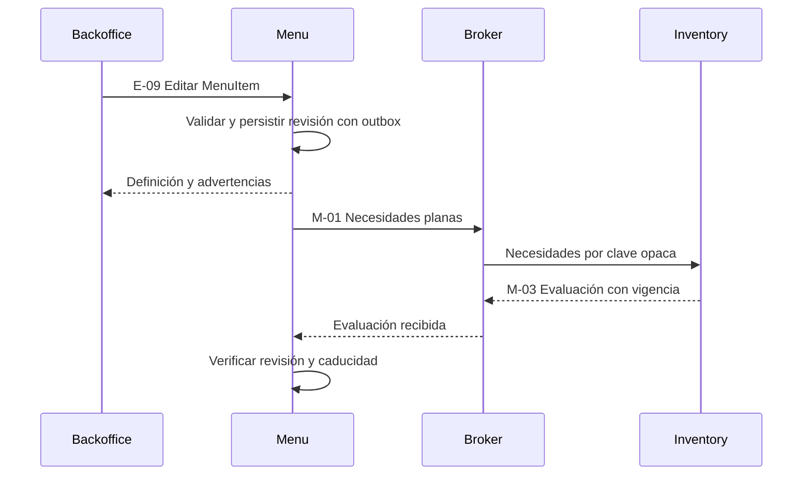
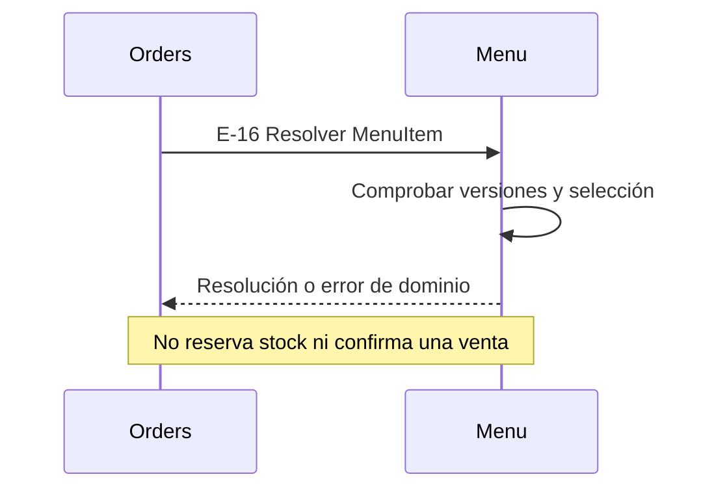
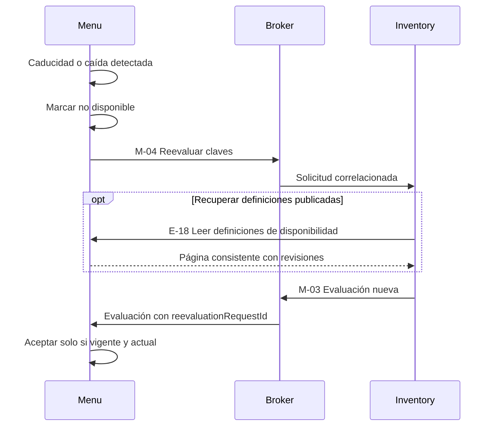

[Índice](./index.md)

# Interacciones de Menu

## Actualizar definición y recibir disponibilidad

Sin evaluación positiva vigente la nueva definición no se ofrece como disponible. La operación administrativa no espera una llamada HTTP a Inventory.

## Resolución interactiva solicitada por Orders

Orders solicita esta resolución por HTTP. M-05/M-06 se retiran del catálogo de mensajes. La disponibilidad sigue siendo temporal. La habilitación administrativa se observa al resolver, sin promesa de atomicidad con una futura venta externa.

## Recuperar evaluaciones

Los mensajes usan líneas separadas y evitan punto y coma literal en etiquetas. [Mermaid documenta](https://mermaid.js.org/syntax/sequenceDiagram) que ese carácter separa instrucciones y requiere escape si se incluye en un texto. El fallo reportado provenía de esa ambigüedad.

El flujo completo entre UI, Orders, Menu, Inventory y Kitchen está separado en [diagrama conceptual de ordenar](../../docs/diagrams/flujo-ordenar.md).

La respuesta E-16 contiene un único resumen pricing de la referencia vendible: unitPrice, extrasTotal, unitSubtotal y currency. Para COMBO, unitPrice corresponde a ComboConfiguration y unitSubtotal incorpora priceDelta de opciones y modificadores, nunca precios base de componentes. Las unidades de preparación no contienen desglose monetario.

## Revisión administrativa

Cambio relevante de variante componente → combos dependientes REVIEW_REQUIRED → lectura E-19/E-20 → confirmación E-21 de tokens observados. Cambios posteriores permanecen pendientes. Confirmación sin edición no emite M-07.
