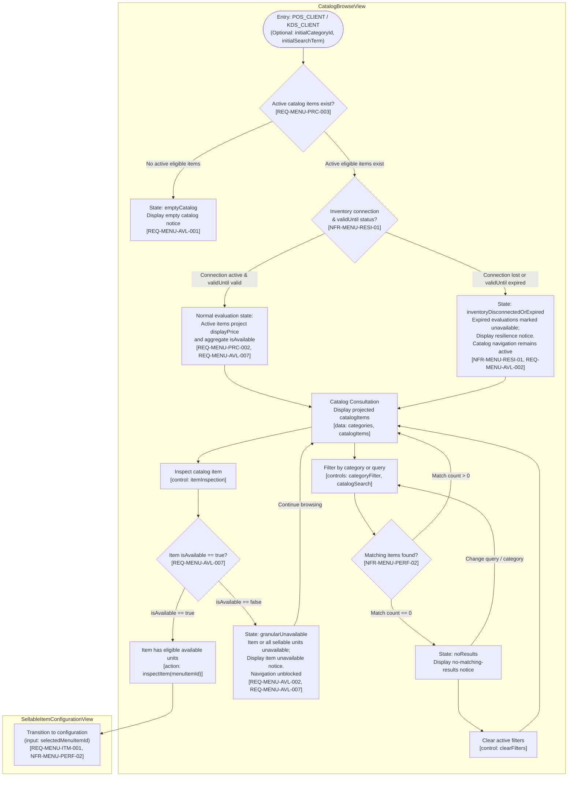

# Flow: Browse Menu Catalog

```mermaid
flowchart TD
    subgraph CatalogBrowseView["CatalogBrowseView"]
        Start(["Entry: POS_CLIENT / KDS_CLIENT<br/>(Optional: initialCategoryId, initialSearchTerm)"])
        CheckCatalog{"Active catalog items exist?<br/>[REQ-MENU-PRC-003]"}
        EmptyCatalog["State: emptyCatalog<br/>Display empty catalog notice<br/>[REQ-MENU-AVL-001]"]

        CheckInventory{"Inventory connection<br/>& validUntil status?<br/>[NFR-MENU-RESI-01]"}
        InventoryNormal["Normal evaluation state:<br/>Active items project displayPrice<br/>and aggregate isAvailable<br/>[REQ-MENU-PRC-002, REQ-MENU-AVL-007]"]
        InventoryDegraded["State: inventoryDisconnectedOrExpired<br/>Expired evaluations marked unavailable;<br/>Display resilience notice.<br/>Catalog navigation remains active<br/>[NFR-MENU-RESI-01, REQ-MENU-AVL-002]"]

        BrowseCatalog["Catalog Consultation<br/>Display projected catalogItems<br/>[data: categories, catalogItems]"]

        FilterAction["Filter by category or query<br/>[controls: categoryFilter, catalogSearch]"]
        CheckResults{"Matching items found?<br/>[NFR-MENU-PERF-02]"}
        NoResults["State: noResults<br/>Display no-matching-results notice"]
        ClearFilters["Clear active filters<br/>[control: clearFilters]"]

        InspectItem["Inspect catalog item<br/>[control: itemInspection]"]
        CheckAvailability{"Item isAvailable == true?<br/>[REQ-MENU-AVL-007]"}
        ItemUnavailable["State: granularUnavailable<br/>Item or all sellable units unavailable;<br/>Display item unavailable notice.<br/>Navigation unblocked<br/>[REQ-MENU-AVL-002, REQ-MENU-AVL-007]"]
        ItemEligible["Item has eligible available units<br/>[action: inspectItem(menuItemId)]"]
    end

    subgraph SellableItemConfigurationView["SellableItemConfigurationView"]
        TransitionToConfig["Transition to configuration<br/>(input: selectedMenuItemId)<br/>[REQ-MENU-ITM-001, NFR-MENU-PERF-02]"]
    end

    Start --> CheckCatalog
    CheckCatalog -->|No active eligible items| EmptyCatalog
    CheckCatalog -->|Active eligible items exist| CheckInventory

    CheckInventory -->|Connection active & validUntil valid| InventoryNormal
    CheckInventory -->|Connection lost or validUntil expired| InventoryDegraded

    InventoryNormal --> BrowseCatalog
    InventoryDegraded --> BrowseCatalog

    BrowseCatalog --> FilterAction
    FilterAction --> CheckResults
    CheckResults -->|Match count == 0| NoResults
    NoResults --> ClearFilters
    ClearFilters --> BrowseCatalog
    NoResults -->|Change query / category| FilterAction

    CheckResults -->|Match count > 0| BrowseCatalog

    BrowseCatalog --> InspectItem
    InspectItem --> CheckAvailability

    CheckAvailability -->|isAvailable == false| ItemUnavailable
    ItemUnavailable -->|Continue browsing| BrowseCatalog

    CheckAvailability -->|isAvailable == true| ItemEligible
    ItemEligible --> TransitionToConfig
```
