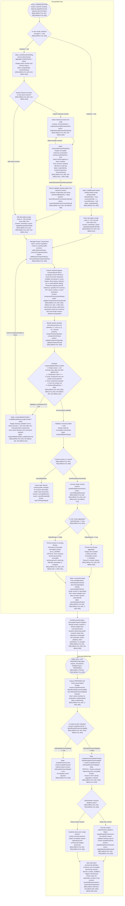

# Flow: Manage Recipe and Revision Lifecycle

```mermaid
flowchart TD
    subgraph RecipeEditorView["RecipeEditorView"]
        RecipeEntry(["Entry: ADMINISTRATOR<br/>(Inputs: optional recipeId, optional targetRevisionId, optional returnContext)<br/>[REQ-MENU-FUL-003, REQ-MENU-FUL-004]"])
        CheckCreationMode{"Is new recipe creation?<br/>(recipeId == null)<br/>[REQ-MENU-FUL-003]"}

        %% Initial Recipe Creation Path
        StateNewRecipe["State: initialRecipeCreation<br/>Initialize blank recipe working buffer (isNewRecipe = true).<br/>revisionNumber = 1, currentRevision = null.<br/>[data: recipeIdentity]<br/>[REQ-MENU-FUL-003]"]
        InputNewName["Enter descriptive recipe name (1..120 Unicode chars after trim)<br/>[control: nameInput, action: updateRecipeNameField]<br/>[REQ-MENU-FUL-003, INV-MENU-012]"]

        %% Existing Recipe Path
        LoadExistingRecipe["State: activeRevisionEditing<br/>Load existing Recipe aggregate (isNewRecipe = false).<br/>Display active revision and revision history.<br/>[data: recipeIdentity, revisionHistory]<br/>[REQ-MENU-FUL-004, INV-MENU-004]"]
        InspectOrEditChoice{"Inspect historical revision or edit active revision?<br/>[REQ-MENU-FUL-004, INV-MENU-004]"}

        %% Historical Inspection & Branching Sub-branch
        SelectHistoricalRevision["Select historical revision for audit<br/>[control: revisionSelector / inspectHistoricalRevisionAction,<br/>action: loadHistoricalRevisionReadOnly]<br/>[REQ-MENU-FUL-004, INV-MENU-004]"]
        StateHistoricalReadOnly["State: historicalRevisionReadOnly<br/>Display immutable historical composition (isHistoricalReadOnly = true).<br/>Inputs locked against in-place mutation.<br/>Prior revisions retained identical in audit log.<br/>[data: recipeIdentity, recipeComponents, revisionHistory]<br/>[REQ-MENU-FUL-004, INV-MENU-004, C-REC-006]"]
        BranchHistoricalRevision["Branch editable working buffer from historical revision<br/>(Clones components and name, isHistoricalReadOnly = false)<br/>[control: branchRevisionFromHistoricalAction,<br/>action: branchNewRevisionFromHistorical]<br/>[REQ-MENU-FUL-004, INV-MENU-004]"]

        %% Active Editing Sub-branch
        EditActiveRecipeName["Edit descriptive recipe name (1..120 Unicode chars after trim)<br/>[control: nameInput, action: updateRecipeNameField]<br/>[REQ-MENU-FUL-003, REQ-MENU-FUL-004, INV-MENU-012]"]

        %% Component Management (Definition & Editing)
        ManageComponents["Manage Recipe Components<br/>Add or remove ingredient entries in working buffer<br/>[controls: addComponentAction, removeComponentAction,<br/>actions: addRecipeComponentEntry, removeRecipeComponentEntry]<br/>[REQ-MENU-FUL-003]"]

        ConfigureOpaqueInventoryId["Acquire required opaque inventoryItemId (SKU)<br/>via design-neutral reference control (concrete interaction modality unresolved in issues tracker: direct typing, selection list, or search/picker dialog).<br/>Preserves required external reference; specifies NO inventory API, search, lookup, or stock verification.<br/>[control: componentInventoryItemIdInput,<br/>action: updateComponentInventoryItemId]<br/>[REQ-MENU-FUL-003, REQ-MENU-FUL-004, C-REC-004, docs/issues-tracker.md#human-interaction-choice-for-inventory-item-and-recipe-revision-reference-acquisition]"]

        ConfigureQuantityAndUnit["Specify positive quantity and measurement unit<br/>(quantity > 0, unit e.g. 'g', 'ml', 'piezas')<br/>[controls: componentQuantityInput, componentUnitInput,<br/>actions: updateComponentQuantity, updateComponentUnit]<br/>[REQ-MENU-FUL-003]"]

        %% Validation
        EvaluateRecipeValidation{"Evaluate recipeValidationStatus.isValid:<br/>1. Recipe name 1..120 Unicode chars after trim [INV-MENU-012]<br/>2. Component count >= 1<br/>3. Every component has non-empty inventoryItemId<br/>4. Every component quantity > 0 and non-empty unit<br/>5. isHistoricalReadOnly == false<br/>[REQ-MENU-FUL-003, REQ-MENU-FUL-004, INV-MENU-004, INV-MENU-012]"}

        RecipeValidationFailed["State: recipeValidationFailed / invalidRecipeNameLength (isValid = false)<br/>Display blocking validation errors (name bounds 1..120 chars after trim, missing/invalid components).<br/>Save action blocked until constraints satisfied.<br/>[data: recipeValidationStatus.validationErrors]<br/>[REQ-MENU-FUL-003, INV-MENU-004, INV-MENU-012]"]

        RecipeValidationPassed["Validation Passed (isValid = true)<br/>Recipe ready for immutable commitment<br/>[data: recipeValidationStatus]"]

        %% Commit or Discard
        SelectCommitAction{"Commit revision or cancel?<br/>[REQ-MENU-FUL-003, REQ-MENU-FUL-004]"}

        CancelRecipeEdit["Cancel edit: discard working buffer changes.<br/>No revision generated; earlier state untouched.<br/>[control: cancelEditAction, action: cancelRecipeEdit]<br/>(Emits returnToOriginSignal)"]

        CommitRecipeRevision["Commit recipe revision<br/>[control: saveRecipeRevisionAction, action: commitRecipeRevision]<br/>[REQ-MENU-FUL-003, REQ-MENU-FUL-004, INV-MENU-004, INV-MENU-012]"]

        CheckIsNewRecipe{"Is new recipe aggregate?<br/>(isNewRecipe == true)<br/>[REQ-MENU-FUL-003]"}

        GenerateInitialRevision["Persist new Recipe aggregate.<br/>Assign new recipeId (UUID) and initial immutable revision '1_ISO8601'.<br/>Record in revision history.<br/>[REQ-MENU-FUL-003, INV-MENU-004]"]

        GenerateIncrementedRevision["Persist revision to existing Recipe.<br/>Generate incremented immutable revision '(N+1)_ISO8601'.<br/>CRITICAL: Prior revisions remain permanently immutable<br/>and preserved in audit log (NEVER overwritten or mutated).<br/>[REQ-MENU-FUL-004, INV-MENU-004, C-REC-001]"]

        RecipeCommitSuccess["State: revisionPersisted<br/>Emit savedRecipeId, newRecipeRevisionId, returnToOriginSignal.<br/>Display variantAdoptionNotice: recipe revision is decoupled<br/>from variant adoption and does not alter variants automatically.<br/>[data: variantAdoptionNotice]<br/>[REQ-MENU-FUL-002, REQ-MENU-FUL-004, C-REC-003]"]
    end

    %% Decoupled Boundary / Notice Node
    DecoupledNoticeNode["Architectural Boundary: Decoupled Variant Adoption<br/>Recipe revision creation is strictly isolated from commercial items.<br/>Variants referencing earlier revisions retain their references unchanged.<br/>NO automatic variant updating, silent substitution, or cascade.<br/>[REQ-MENU-FUL-002, REQ-MENU-FUL-004, INV-MENU-004]"]

    subgraph MenuItemEditorView["MenuItemEditorView"]
        MenuItemEditorEntry(["Editor Entry: Leaf PREPARED MenuItem<br/>(Inputs: menuItemId, initialItemType = 'PREPARED')<br/>[REQ-MENU-ITM-001, REQ-MENU-FUL-002]"])

        InspectPreparedVariant["Inspect PREPARED leaf variant presentation<br/>Display variant.recipeRevisionId, latestRecipeRevisionAvailable,<br/>and isRecipeRevisionAdopted indicator.<br/>Each variant resolves its preparation independently.<br/>[data: leafVariants]<br/>[REQ-MENU-FUL-002, C-REC-005]"]

        CheckRevisionAdoptionStatus{"Is recipe revision adopted?<br/>(variant.recipeRevisionId == latestRecipeRevisionAvailable)<br/>[REQ-MENU-FUL-002, REQ-MENU-FUL-004]"}

        RevisionAlreadyCurrent["State: recipeRevisionCurrent<br/>variant.recipeRevisionId matches latest revision.<br/>isRecipeRevisionAdopted = true.<br/>No adoption action required.<br/>[REQ-MENU-FUL-002]"]

        RevisionPendingAdoption["State: recipeRevisionUpdatePending<br/>latestRecipeRevisionAvailable > variant.recipeRevisionId.<br/>isRecipeRevisionAdopted = false.<br/>CRITICAL: Variant continues referencing prior immutable revision.<br/>Variant is NOT silently upgraded or altered.<br/>[REQ-MENU-FUL-002, REQ-MENU-FUL-004]"]

        DecideAdoptionAction{"Administrator chooses adoption policy?<br/>[REQ-MENU-FUL-002, REQ-MENU-FUL-004]"}

        RetainPriorRevision["Explicitly retain prior recipe revision.<br/>Variant remains bound to earlier immutable revision.<br/>Operational and commercial integrity preserved.<br/>[REQ-MENU-FUL-002, REQ-MENU-FUL-004]"]

        ExecuteExplicitAdoption["Execute explicit administrative adoption:<br/>Select targetRecipeRevisionId for this specific variant.<br/>Updates working copy of variant.recipeRevisionId.<br/>[control: adoptRecipeRevisionAction, action: adoptNewRecipeRevision]<br/>[REQ-MENU-FUL-002, REQ-MENU-FUL-004]"]

        SaveMenuItem["Save MenuItem commercial definition.<br/>Produces new immutable commercial revision (format: number_ISO8601).<br/>Triggers downstream review notice for dependent combos if any.<br/>[control: saveDraftInactiveAction / saveAndActivateAction]<br/>[REQ-MENU-VER-001, INV-MENU-004, REQ-MENU-REV-001]"]
    end

    %% Transitions within RecipeEditorView
    RecipeEntry --> CheckCreationMode
    CheckCreationMode -->|recipeId == null| StateNewRecipe
    StateNewRecipe --> InputNewName
    InputNewName --> ManageComponents

    CheckCreationMode -->|recipeId != null| LoadExistingRecipe
    LoadExistingRecipe --> InspectOrEditChoice
    InspectOrEditChoice -->|Inspect historical revision| SelectHistoricalRevision
    SelectHistoricalRevision --> StateHistoricalReadOnly
    StateHistoricalReadOnly -->|branchRevisionFromHistoricalAction| BranchHistoricalRevision
    BranchHistoricalRevision --> EditActiveRecipeName
    StateHistoricalReadOnly -->|Select another revision| SelectHistoricalRevision
    InspectOrEditChoice -->|Edit active revision| EditActiveRecipeName
    EditActiveRecipeName --> ManageComponents

    ManageComponents --> ConfigureOpaqueInventoryId
    ConfigureOpaqueInventoryId --> ConfigureQuantityAndUnit
    ConfigureQuantityAndUnit --> EvaluateRecipeValidation

    EvaluateRecipeValidation -->|Validation constraints NOT met| RecipeValidationFailed
    RecipeValidationFailed -->|Correct component data or name| ManageComponents

    EvaluateRecipeValidation -->|All constraints satisfied| RecipeValidationPassed
    RecipeValidationPassed --> SelectCommitAction

    SelectCommitAction -->|cancelEditAction| CancelRecipeEdit
    SelectCommitAction -->|saveRecipeRevisionAction| CommitRecipeRevision

    CommitRecipeRevision --> CheckIsNewRecipe
    CheckIsNewRecipe -->|isNewRecipe == true| GenerateInitialRevision
    CheckIsNewRecipe -->|isNewRecipe == false| GenerateIncrementedRevision

    GenerateInitialRevision --> RecipeCommitSuccess
    GenerateIncrementedRevision --> RecipeCommitSuccess

    %% Cross-view decoupled boundary
    RecipeCommitSuccess --> DecoupledNoticeNode
    DecoupledNoticeNode --> MenuItemEditorEntry

    %% Transitions within MenuItemEditorView
    MenuItemEditorEntry --> InspectPreparedVariant
    InspectPreparedVariant --> CheckRevisionAdoptionStatus

    CheckRevisionAdoptionStatus -->|isRecipeRevisionAdopted == true| RevisionAlreadyCurrent
    CheckRevisionAdoptionStatus -->|isRecipeRevisionAdopted == false| RevisionPendingAdoption

    RevisionPendingAdoption --> DecideAdoptionAction
    DecideAdoptionAction -->|Retain earlier revision| RetainPriorRevision
    DecideAdoptionAction -->|Adopt new revision| ExecuteExplicitAdoption

    ExecuteExplicitAdoption --> SaveMenuItem
    RetainPriorRevision --> SaveMenuItem
```
