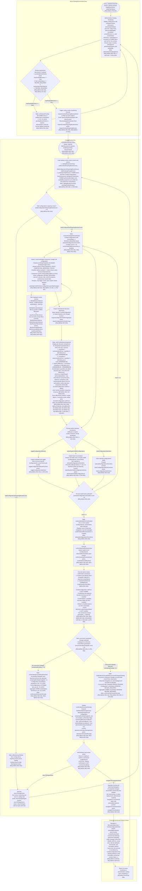

# Flow: Review and Confirm Combo Configurations

```mermaid
flowchart TD
    subgraph MenuCatalogAdministrationView["MenuCatalogAdministrationView"]
        CatalogEntry(["Entry: ADMINISTRATOR<br/>(Inputs: optional menuId, initialSearchTerm, initialFilterStatus)<br/>(REQ-MENU-ITM-001)"])

        CatalogMonitoring["Administrative Catalog Monitoring<br/>Display catalog items with orthogonal status dimensions:<br/>administrativeStatus (ACTIVE / INACTIVE), isStructurallyEligible, isAvailable,<br/>currentRevision (<number>_<ISO8601>), and reviewStatus.<br/>CRITICAL: reviewStatus is exclusive to COMBO items and null for non-combos.<br/>Review status is strictly orthogonal to administrativeStatus and availability.<br/>(data: administrativeCatalogItems)<br/>(REQ-MENU-REV-002, C-MCA-001, C-MCA-002)"]

        DiscoverReviews{"Review requirement discovered in catalog?<br/>1. pendingReviewNotice active (hasPendingReviews == true)<br/>2. Item reviewStatus == 'REVIEW_REQUIRED'<br/>3. reviewStatusFilterSelector == 'REVIEW_REQUIRED'<br/>(REQ-MENU-REV-002, REQ-MENU-LIF-001)"}

        NoReviewsPending["State: noReviewsPending<br/>All COMBO items in catalog have reviewStatus == UP_TO_DATE.<br/>pendingReviewNotice is inactive.<br/>Administrator continues normal catalog monitoring.<br/>(REQ-MENU-REV-002)"]

        TriggerReviewInspection["Trigger combo review monitoring:<br/>Execute inspectCombosRequiringReviewAction<br/>(or filter by review status).<br/>Emits openComboReviewSignal with returnContext: 'MenuCatalogAdministrationView'.<br/>(control: inspectCombosRequiringReviewAction, action: inspectCombosRequiringReview)<br/>(REQ-MENU-REV-002, REQ-MENU-LIF-001)"]
    end

    subgraph ComboReviewView["ComboReviewView"]
        ReviewEntry(["ComboReviewView Entry<br/>(Inputs: optional filterMenuItemId, optional initialReasonFilter, returnContext)<br/>(REQ-MENU-REV-001, REQ-MENU-REV-002)"])

        LoadReviewContext["Load catalog combo review context and metrics:<br/>1. catalogReviewSummary: totalCombosRequiringReviewCount,<br/>   totalConfigurationsRequiringReviewCount, totalPendingChangesCount<br/>2. pendingComboReviews: COMBO items and their ComboConfigurations<br/>Strictly preserves orthogonal dimensions: COMBO administrativeStatus and<br/>availability projections are visible but decoupled from reviewStatus.<br/>(data: catalogReviewSummary, pendingComboReviews)<br/>(REQ-MENU-REV-002, C-CRV-002)"]

        CheckCatalogReviewCounts{"Total configurations requiring review?<br/>(totalConfigurationsRequiringReviewCount > 0)<br/>(REQ-MENU-REV-002)"}

        StateAllUpToDate["State: allReviewsUpToDate<br/>Zero configurations requiring review across catalog.<br/>Display all-up-to-date informational status.<br/>(REQ-MENU-REV-002)"]

        StateReviewsPendingSelectionEmpty["State: reviewsPendingSelectionEmpty<br/>ComboConfigurations with reviewStatus == REVIEW_REQUIRED listed.<br/>selectedConfigurationsToConfirm is empty (count == 0).<br/>confirmSelectedReviewsAction is disabled.<br/>(REQ-MENU-REV-002, REQ-MENU-REV-003)"]

        %% ----------------- REASON INSPECTION & FILTERING -----------------
        InspectPendingChanges["Inspect unacknowledged component changes per configuration:<br/>Exposes pendingChangeIds and detailed pendingChanges items.<br/>Allowed reasons strictly restricted to: PRICE, COMPOSITION, MODIFIERS, STATUS.<br/>- Disabled options (enabled == false) remain active structural dependencies.<br/>- Component variant archival (REQ-MENU-LIF-001) marks configuration REVIEW_REQUIRED.<br/>- Ignored: cosmetic edits, stock fluctuations, unreferenced variant edits.<br/>- Recipes: only trigger review upon explicit variant adoption.<br/>(data: pendingComboReviews.configurations.pendingChanges)<br/>(REQ-MENU-REV-001, REQ-MENU-LIF-001, C-CRV-001)"]

        ApplyReviewFilters["Filter displayed combo reviews:<br/>1. filterByReasonSelector: 'PRICE', 'COMPOSITION', 'MODIFIERS', 'STATUS'<br/>2. filterByMenuItemSelector: filter by specific COMBO MenuItem<br/>3. clearReviewFiltersAction: reset all active review filters<br/>(controls: filterByReasonSelector, filterByMenuItemSelector, clearReviewFiltersAction,<br/>actions: filterReviewsByReason, filterReviewsByMenuItem, resetReviewFilters)<br/>(REQ-MENU-REV-001, REQ-MENU-REV-002)"]

        %% ----------------- INFORMATIONAL SLOT PRICE REFERENCES -----------------
        TriggerSlotPriceInspection["Inspect informational slot price references:<br/>Select specific ComboConfiguration to inspect baseline cost changes.<br/>(control: inspectConfigurationSlotPricingAction,<br/>action: selectConfigurationForSlotPricing)<br/>(REQ-MENU-REV-005)"]

        StateSlotPriceInspected["State: slotPriceReferenceInspected<br/>Display per-slot price comparisons for designated baseOptionIds in menu ISO 4217 currency:<br/>1. savedSum = sum(savedUnitPrice * quantity) in DECIMAL(12,2) (0.00..9999999999.99)<br/>2. currentSum = sum(currentUnitPrice * quantity) in DECIMAL(12,2) (0.00..9999999999.99)<br/>3. Signed difference = currentSum - savedSum in DECIMAL(12,2) (-9999999999.99..+9999999999.99)<br/>(ComboOption quantities are whole physical units 1..99 under INV-MENU-011).<br/>CRITICAL CONSTRAINT: isInformationalOnly = true.<br/>Informational component-price reference comparison only; mathematically distinct from the<br/>authoritative combo sale price resolved by OPEN-009 (ComboConfiguration.unitPrice + deltas),<br/>which strictly excludes component list prices (BR-MENU-008, INV-MENU-010).<br/>Price differences CANNOT mutate, adjust, or overwrite combo selling price (ComboConfiguration.unitPrice).<br/>(data: focusedSlotPriceReferences)<br/>(REQ-MENU-REV-005, REQ-MENU-COM-003, INV-MENU-007, INV-MENU-008, INV-MENU-009, INV-MENU-010, INV-MENU-011, BR-MENU-008, C-CRV-006, C-CRV-007)"]

        %% ----------------- EXPLICIT SELECTION OF PAIRS (NO WILDCARDS) -----------------
        SelectConfigurationsDecision{"Choose explicit selection mechanism:<br/>(Wildcard or implicit confirm-all tokens strictly prohibited)<br/>(REQ-MENU-REV-003, C-CRV-003)"}

        ToggleIndividualPair["Explicit individual pair toggle:<br/>Add or remove specific (configurationId, reviewToken) pair.<br/>(control: toggleConfigurationSelectionControl,<br/>action: toggleConfigurationSelection)<br/>(REQ-MENU-REV-003, C-CRV-003)"]

        SelectAllVisibleExplicitly["Explicit batch enumeration:<br/>Iterates and adds every currently visible (configurationId, reviewToken)<br/>pair explicitly to selectedConfigurationsToConfirm.<br/>Precludes wildcard tokens ('*', 'ALL') or backend confirm-all shortcuts.<br/>(control: selectExplicitVisibleConfigurationsAction,<br/>action: selectExplicitVisibleConfigurations)<br/>(REQ-MENU-REV-003, C-CRV-003)"]

        ClearSelections["Clear selected configurations buffer:<br/>Empties selectedConfigurationsToConfirm.<br/>(control: clearConfigurationSelectionsAction,<br/>action: clearConfigurationSelections)<br/>(REQ-MENU-REV-003)"]

        CheckSelectionState{"Are any explicit pairs selected?<br/>(selectedConfigurationsToConfirm.count > 0)<br/>(REQ-MENU-REV-003)"}

        StateReviewsSelected["State: reviewsSelectedForConfirmation<br/>One or more explicit (configurationId, reviewToken) pairs selected.<br/>Displays count of observed changeIds to be acknowledged.<br/>confirmSelectedReviewsAction is enabled.<br/>(data: selectedConfigurationsToConfirm)<br/>(REQ-MENU-REV-003)"]

        %% ----------------- ATOMIC CONFIRMATION TRANSACTION -----------------
        ExecuteConfirmationAction["Execute confirmSelectedReviewsAction:<br/>Submit explicit list of (configurationId, observedReviewToken) pairs.<br/>(control: confirmSelectedReviewsAction, action: confirmObservedReviews)<br/>(REQ-MENU-REV-003, REQ-MENU-REV-004)"]

        AtomicConfirmationTransaction["Execute atomic review confirmation transaction:<br/>1. Confirms and attends ONLY changeIds captured in observed reviewTokens.<br/>2. CONSERVATION OF COMMERCIAL CONFIGURATION (REQ-MENU-REV-004):<br/>   - ComboConfiguration.unitPrice is NOT modified.<br/>   - ComboSlots and selection bounds (min/max) are NOT modified.<br/>   - ComboOptions, quantities, and price deltas are NOT modified.<br/>   - Retired or disabled options are NOT reactivated.<br/>   - Parent MenuItem.administrativeStatus is NOT modified.<br/>   - NO commercial revision generated (<number>_<ISO8601> unaltered).<br/>(REQ-MENU-REV-003, REQ-MENU-REV-004, REQ-MENU-VER-001, C-CRV-004, C-CRV-005)"]

        %% ----------------- CONCURRENT CHANGE BRANCH -----------------
        EvaluateConcurrentChanges{"Were concurrent component changes detected<br/>subsequent to observed reviewToken generation?<br/>(concurrentLaterChangeIds.count > 0)<br/>(REQ-MENU-REV-003, C-CRV-004)"}

        FullyResolvedOutcome["State: confirmationExecutedFullyResolved<br/>All pending changeIds were observed and are now attended.<br/>- remainingPendingChangeIds = ()<br/>- Configuration reviewStatus transitions to UP_TO_DATE.<br/>- If all configurations of COMBO item are UP_TO_DATE,<br/>  aggregate COMBO reviewStatus transitions to UP_TO_DATE.<br/>(data: confirmationExecutionReceipt)<br/>(REQ-MENU-REV-002, REQ-MENU-REV-003)"]

        ConcurrentChangesPendingOutcome["State: confirmationExecutedWithConcurrentChangesPending<br/>Concurrent component changes occurred after reviewToken observation.<br/>- Observed changeIds are acknowledged and recorded as attended.<br/>- Concurrent later changeIds REMAIN PENDING.<br/>- Configuration reviewStatus REMAINS REVIEW_REQUIRED.<br/>- Aggregate COMBO reviewStatus REMAINS REVIEW_REQUIRED.<br/>(data: confirmationExecutionReceipt)<br/>(REQ-MENU-REV-002, REQ-MENU-REV-003, C-CRV-004)"]

        EmitAndInspectReceipt["Display confirmationExecutionReceipt:<br/>Exposes totalAttendedChangesCount, attendedChangeIds per configuration,<br/>remainingPendingChangeIds, and non-mutation confirmation flags:<br/>commercialRevisionUnaltered = true, unitPriceUnaltered = true,<br/>slotsAndOptionsUnaltered = true, administrativeStatusUnaltered = true.<br/>(control: dismissConfirmationReceiptAction, action: dismissConfirmationReceipt)<br/>(REQ-MENU-REV-003, REQ-MENU-REV-004)"]

        %% ----------------- POST-REVIEW ROUTING & SEPARATION -----------------
        DecidePostReviewAction{"Administrator post-review action:<br/>Return to catalog or perform commercial modifications?<br/>(CRITICAL: Review confirmation is NOT commercial editing)<br/>(REQ-MENU-REV-002, REQ-MENU-REV-004)"}

        ReturnToOriginExecution["Execute returnToOriginAction:<br/>Exit review monitoring and return to calling view.<br/>Emits returnToOriginSignal.<br/>(control: returnToOriginAction, action: returnToOrigin)<br/>(docs/ui-spec-arch.md)"]

        NavigateToCommercialEdit["Separate Commercial Authoring Navigation:<br/>If component changes necessitate commercial price updates,<br/>slot restructuring, or option replacement, administrator explicitly<br/>navigates to commercial editor with selectedMenuItemId.<br/>(control: navigateToComboItemAction, action: navigateToComboItem)<br/>(REQ-MENU-REV-002)"]
    end

    subgraph ExternalCommercialAuthoring["External Commercial Editing Context"]
        TransitionToComboEditor["Navigate to MenuItemEditorView / ComboConfigurationView<br/>(Inputs: selectedMenuItemId, returnContext: ComboReviewView)<br/>Commercial authoring performed separately under manage-combo flow:<br/>- Modify unitPrice, create slots, edit slot attributes and bounds, and reconfigure options.<br/>- Destructive slot removal is not defined by ComboConfigurationView.<br/>- Saving produces a new immutable commercial revision token (<number>_<ISO8601>).<br/>(REQ-MENU-COM-001, REQ-MENU-VER-001)"]

        ReturnFromCommercialEdit["Return to review monitoring or administrative catalog<br/>upon completing or cancelling commercial edits."]
    end

    %% ----------------- EDGES & TRANSITIONS -----------------

    %% Catalog Monitoring & Discovery
    CatalogEntry --> CatalogMonitoring
    CatalogMonitoring --> DiscoverReviews

    DiscoverReviews -->|hasPendingReviews == false| NoReviewsPending
    NoReviewsPending --> CatalogMonitoring

    DiscoverReviews -->|hasPendingReviews == true| TriggerReviewInspection
    TriggerReviewInspection --> ReviewEntry

    %% Combo Review View Entry & Initial State
    ReviewEntry --> LoadReviewContext
    LoadReviewContext --> CheckCatalogReviewCounts

    CheckCatalogReviewCounts -->|totalConfigurationsRequiringReviewCount == 0| StateAllUpToDate
    StateAllUpToDate --> ReturnToOriginExecution

    CheckCatalogReviewCounts -->|totalConfigurationsRequiringReviewCount > 0| StateReviewsPendingSelectionEmpty

    %% Inspection & Filtering
    StateReviewsPendingSelectionEmpty --> InspectPendingChanges
    InspectPendingChanges --> ApplyReviewFilters
    ApplyReviewFilters --> InspectPendingChanges

    %% Slot Price References
    InspectPendingChanges --> TriggerSlotPriceInspection
    TriggerSlotPriceInspection --> StateSlotPriceInspected
    StateSlotPriceInspected --> SelectConfigurationsDecision

    %% Selection Workflow
    StateReviewsPendingSelectionEmpty --> SelectConfigurationsDecision
    SelectConfigurationsDecision -->|toggleConfigurationSelection| ToggleIndividualPair
    SelectConfigurationsDecision -->|selectExplicitVisibleConfigurations| SelectAllVisibleExplicitly
    SelectConfigurationsDecision -->|clearConfigurationSelections| ClearSelections

    ToggleIndividualPair --> CheckSelectionState
    SelectAllVisibleExplicitly --> CheckSelectionState
    ClearSelections --> CheckSelectionState

    CheckSelectionState -->|count == 0| StateReviewsPendingSelectionEmpty
    CheckSelectionState -->|count > 0| StateReviewsSelected

    %% Confirmation Execution
    StateReviewsSelected --> ExecuteConfirmationAction
    ExecuteConfirmationAction --> AtomicConfirmationTransaction
    AtomicConfirmationTransaction --> EvaluateConcurrentChanges

    %% Concurrent Change Branch
    EvaluateConcurrentChanges -->|"No concurrent changes (remainingPending == 0)"| FullyResolvedOutcome
    EvaluateConcurrentChanges -->|"Concurrent changes detected (remainingPending > 0)"| ConcurrentChangesPendingOutcome

    FullyResolvedOutcome --> EmitAndInspectReceipt
    ConcurrentChangesPendingOutcome --> EmitAndInspectReceipt

    %% Post-Review Routing
    EmitAndInspectReceipt --> DecidePostReviewAction

    DecidePostReviewAction -->|returnToOriginAction| ReturnToOriginExecution
    ReturnToOriginExecution --> CatalogMonitoring

    DecidePostReviewAction -->|navigateToComboItemAction| NavigateToCommercialEdit
    NavigateToCommercialEdit --> TransitionToComboEditor
    TransitionToComboEditor --> ReturnFromCommercialEdit
    ReturnFromCommercialEdit --> LoadReviewContext
```
