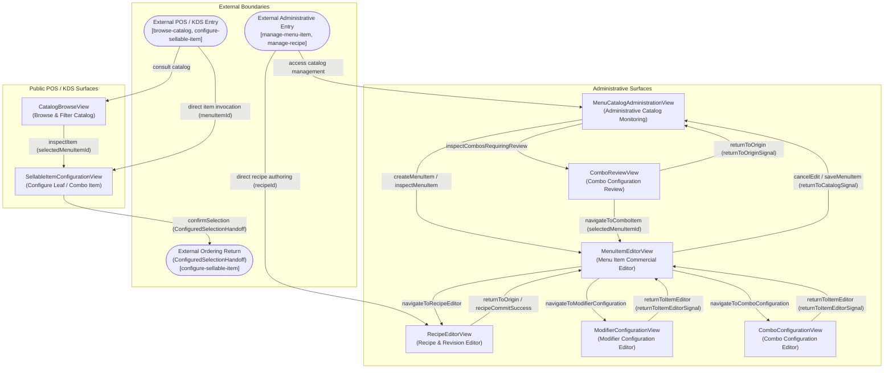

# Screen Navigation Topology

## 1. Overview and Scope

This document defines the canonical global navigation topology of the Menu Management user interface, modeled according to the principles of the [UI Specification Architecture](/docs/ui-spec-arch.md).

The navigation model captures **only reachable relationships established by canonical interaction flows**. It expresses topological adjacency and semantic handoffs between views independently of a single user scenario, without prescribing visual navigation widgets, application shells, layout containers, routing hierarchies, or unapproved architectural domains.

### Key Principles

1. **Topological Purity**: Represents reachability and transitions between views only. It does not define presentation layout (e.g. split pane, modal dialog, sliding drawer, tabs) or application shells (e.g. top bar, hamburger menu, persistent sidebar).
2. **Surface Partitioning**: Clearly partitions public POS/KDS consumer-facing surfaces from administrative management surfaces without imposing navigation implementations.
3. **External Context Boundaries**: Explicitly models entry from external actors and returns to external calling contexts (such as external POS/KDS ordering handoff), while strictly avoiding the invention of unapproved screens (e.g. cart screens, checkout destinations, authentication screens, or user account management).
4. **Zero Orphan Invariant**: All eight planned views are reachable from valid external entries or upstream views. Every transition edge is justified by a corresponding canonical flow.

---

## 2. Specification Metadata

### 2.1 Referenced Views

| View Identifier | Surface | Responsibility Summary | Source Specification |
| :--- | :--- | :--- | :--- |
| **`CatalogBrowseView`** | Public POS / KDS | Browse, filter, and search active catalog items and check operational availability projections. | [`CatalogBrowseView.yaml`](../views/CatalogBrowseView.yaml) |
| **`SellableItemConfigurationView`** | Public POS / KDS | Configure leaf variants, modifiers, and combo package slots into a valid commercial selection payload. | [`SellableItemConfigurationView.yaml`](../views/SellableItemConfigurationView.yaml) |
| **`MenuCatalogAdministrationView`** | Administrative | Monitor catalog items across orthogonal status dimensions, toggle lifecycle states, and locate items requiring review. | [`MenuCatalogAdministrationView.yaml`](../views/MenuCatalogAdministrationView.yaml) |
| **`MenuItemEditorView`** | Administrative | Edit MenuItem commercial identity, dimensions, presentations, supply linkage, and trigger specialized editors. | [`MenuItemEditorView.yaml`](../views/MenuItemEditorView.yaml) |
| **`ComboReviewView`** | Administrative | Monitor unacknowledged component changes requiring combo review and execute atomic token-bound confirmations. | [`ComboReviewView.yaml`](../views/ComboReviewView.yaml) |
| **`RecipeEditorView`** | Administrative | Author culinary recipe components and commit immutable recipe revisions without mutating earlier revisions. | [`RecipeEditorView.yaml`](../views/RecipeEditorView.yaml) |
| **`ModifierConfigurationView`** | Administrative | Configure modifier groups, baseline general options, per-variant overrides, and copy specializations. | [`ModifierConfigurationView.yaml`](../views/ModifierConfigurationView.yaml) |
| **`ComboConfigurationView`** | Administrative | Author combo configurations, slots, direct leaf variant options, copy configurations, and bulk option assignments. | [`ComboConfigurationView.yaml`](../views/ComboConfigurationView.yaml) |

### 2.2 Supporting Canonical Flows

| Flow Identifier | Flow Name | Primary Actors | Involved Views |
| :--- | :--- | :--- | :--- |
| **`browse-catalog`** | Browse Menu Catalog | POS_CLIENT, KDS_CLIENT | `CatalogBrowseView`, `SellableItemConfigurationView` |
| **`configure-sellable-item`** | Configure Sellable Item | POS_CLIENT, KDS_CLIENT | `SellableItemConfigurationView` |
| **`manage-menu-item`** | Manage Menu Item | ADMINISTRATOR | `MenuCatalogAdministrationView`, `MenuItemEditorView`, `RecipeEditorView`, `ModifierConfigurationView`, `ComboConfigurationView`, `ComboReviewView` |
| **`manage-combo`** | Manage Combo Configurations, Slots, and Options | ADMINISTRATOR | `ComboConfigurationView`, `MenuItemEditorView` |
| **`manage-modifiers`** | Manage Modifiers and Specializations | ADMINISTRATOR | `ModifierConfigurationView`, `MenuItemEditorView` |
| **`manage-recipe`** | Manage Recipe and Revision Lifecycle | ADMINISTRATOR | `RecipeEditorView`, `MenuItemEditorView` |
| **`review-combo`** | Review and Confirm Combo Configurations | ADMINISTRATOR | `MenuCatalogAdministrationView`, `ComboReviewView`, `MenuItemEditorView` |

---

## 3. Global Navigation Map

---

## 4. Edge and Transition Directory

Every edge in the topology corresponds directly to transitions specified within the canonical flows:

| Source View / Node | Target View / Node | Trigger Control / Action | Payload / Handoff | Supporting Flow ID |
| :--- | :--- | :--- | :--- | :--- |
| `PosEntry` | `CatalogBrowseView` | External client entry | Optional `initialCategoryId`, `initialSearchTerm` | `browse-catalog` |
| `PosEntry` | `SellableItemConfigurationView` | Direct configuration shortcut | `menuItemId`, optional `initialVariantId` / `initialComboConfigurationId` | `configure-sellable-item` |
| `CatalogBrowseView` | `SellableItemConfigurationView` | `inspectItem` action (`itemInspection` control) | `selectedMenuItemId` | `browse-catalog` |
| `SellableItemConfigurationView` | `OrderHandoff` | `confirmSelection` action (`confirmSelection` control) | Valid `ConfiguredSelectionHandoff` (commercial selection without cart lines) | `configure-sellable-item` |
| `AdminEntry` | `MenuCatalogAdministrationView` | Administrative portal entry | Optional `initialSearchTerm`, `initialFilterStatus` | `manage-menu-item`, `review-combo` |
| `AdminEntry` | `RecipeEditorView` | Direct culinary management entry | Optional `recipeId`, `targetRevisionId` | `manage-recipe` |
| `MenuCatalogAdministrationView` | `MenuItemEditorView` | `createMenuItem` / `inspectMenuItem` actions | `createItemSignal` (creation) or `selectedMenuItemId` (inspection) | `manage-menu-item` |
| `MenuItemEditorView` | `MenuCatalogAdministrationView` | `cancelEdit` / `saveMenuItemInactive` / `saveAndActivateMenuItem` | `returnToCatalogSignal`, `savedMenuItemId`, `newRevisionToken` | `manage-menu-item` |
| `MenuCatalogAdministrationView` | `ComboReviewView` | `inspectCombosRequiringReview` action | `openComboReviewSignal`, `returnContext: MenuCatalogAdministrationView` | `manage-menu-item`, `review-combo` |
| `ComboReviewView` | `MenuCatalogAdministrationView` | `returnToOrigin` action (`returnToOriginAction` control) | `returnToOriginSignal` | `review-combo` |
| `ComboReviewView` | `MenuItemEditorView` | `navigateToComboItem` action (`navigateToComboItemAction` control) | `selectedMenuItemId`, `returnContext: ComboReviewView` | `review-combo` |
| `MenuItemEditorView` | `RecipeEditorView` | `navigateToRecipeEditor` action (`navigateToRecipeEditorAction` control) | `navigateToRecipeEditorSignal` (optional `recipeId` / `recipeRevisionId`, `returnContext: MenuItemEditorView`) | `manage-menu-item` |
| `RecipeEditorView` | `MenuItemEditorView` | `commitRecipeRevision` / `cancelRecipeEdit` | `returnToOriginSignal`, `savedRecipeId`, `newRecipeRevisionId` | `manage-menu-item`, `manage-recipe` |
| `MenuItemEditorView` | `ModifierConfigurationView` | `navigateToModifierConfiguration` action | `menuItemId`, optional `initialVariantId`, `returnContext: MenuItemEditorView` | `manage-menu-item`, `manage-modifiers` |
| `ModifierConfigurationView` | `MenuItemEditorView` | `cancelConfiguration` / `saveModifierConfigurationInactive` / `saveModifierConfigurationAndActivate` | `returnToItemEditorSignal`, `savedMenuItemId`, `newRevisionToken` | `manage-menu-item`, `manage-modifiers` |
| `MenuItemEditorView` | `ComboConfigurationView` | `navigateToComboConfiguration` action | `menuItemId`, optional `initialConfigurationId`, `returnContext: MenuItemEditorView` | `manage-menu-item`, `manage-combo` |
| `ComboConfigurationView` | `MenuItemEditorView` | `cancelConfiguration` / `saveComboConfigurationsInactive` / `saveComboConfigurationsAndActivate` | `returnToItemEditorSignal`, `savedMenuItemId`, `newRevisionToken` | `manage-menu-item`, `manage-combo` |

---

## 5. Reachability and Invariant Verification

1. **Completeness and Reachability**:
   - Every one of the 8 planned views has at least one inbound transition and at least one outbound transition.
   - There are zero orphan or disconnected views.
   - Public POS/KDS views are reachable by consumer client actors without administrative privileges.
   - Administrative views are reachable by administrative actors.
2. **Traceability to Flows**:
   - No speculative or auxiliary navigation paths exist.
   - Every directional edge is supported by an explicit action or event in the canonical flow models (`browse-catalog.md`, `configure-sellable-item.md`, `manage-menu-item.md`, `manage-combo.md`, `manage-modifiers.md`, `manage-recipe.md`, `review-combo.md`).
3. **Decoupling and Non-Assumption Rules**:
   - Does not invent an application shell (no top bar, sidebar navigation, drawer, or breadcrumbs).
   - Does not invent authentication, login, or session recovery views.
   - Does not invent Orders-owned screens (e.g. cart table, checkout flow, payment processing, or KDS line status).
   - Respects the strict separation between supervisory review confirmation (`ComboReviewView`) and commercial entity editing (`MenuItemEditorView` / `ComboConfigurationView`).
