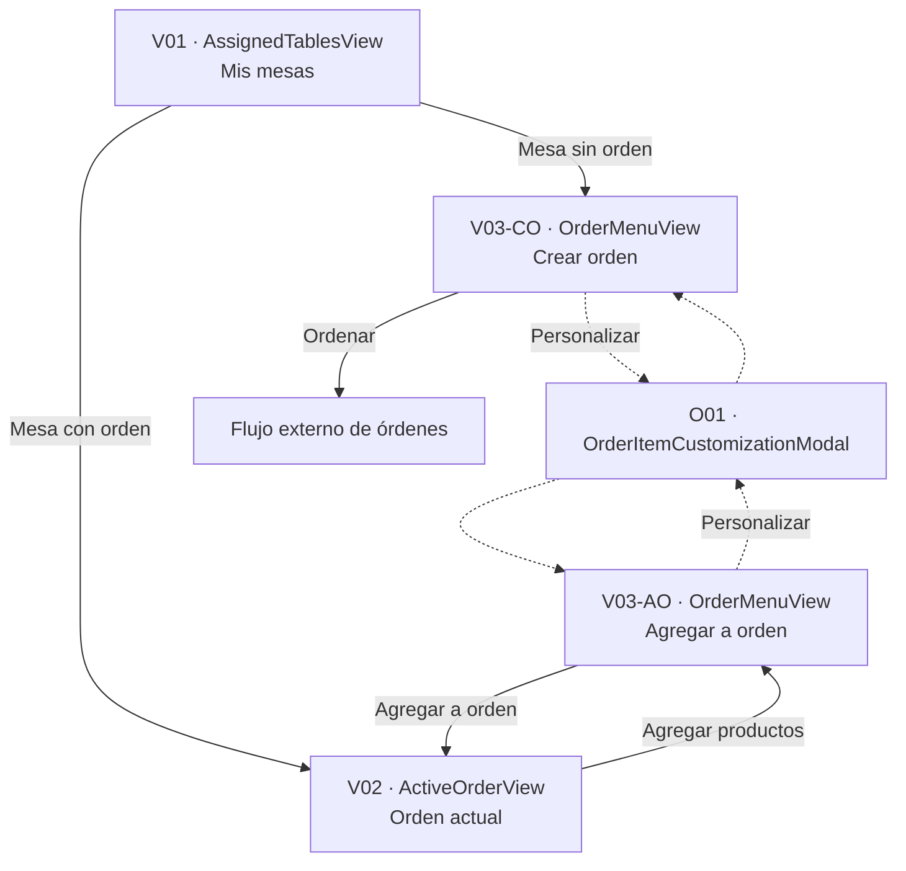
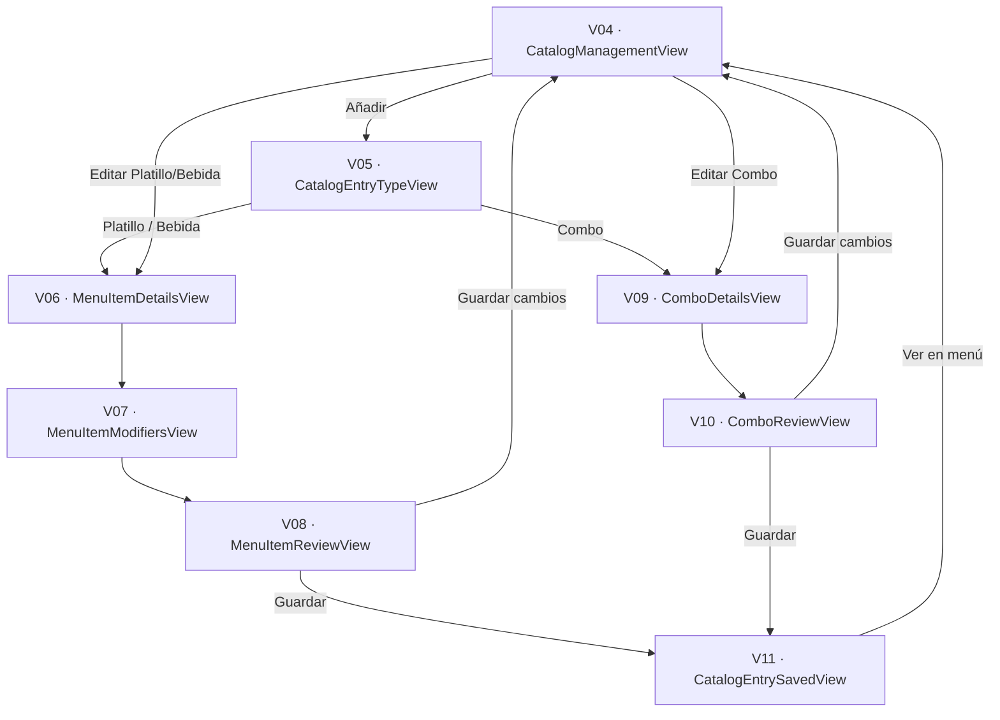

# Especificación de Vistas, Flujos y Mockups — Menú

**Versión:** Fase 1 — v5  
**Objetivo:** separar de forma inequívoca qué elementos son **vistas/mockups**, qué elementos son **variantes visuales**, y qué elementos existen únicamente como **estado, componente o especificación de flujo**.

---

# 0. Cómo leer este documento

Esta versión separa cinco categorías documentales. **No deben mezclarse.**

| Nivel | Qué representa | ¿Requiere mockup? | Ejemplo |
|---|---|---:|---|
| **View** | Pantalla navegable con una responsabilidad propia. | Sí | `OrderMenuView` |
| **Visual Variant** | Versión visual de una View causada por un modo o estado importante. Sigue siendo la misma View. | Sí, cuando cambia información o controles relevantes | `OrderMenuView · APPEND_TO_ORDER` |
| **Overlay** | Modal/drawer sobre una View. No forma parte de la navegación principal. | Sí | `OrderItemCustomizationModal` |
| **Component / UI State** | Elemento o estado interno de una View. | No como pantalla independiente | `DraftOrderLine` |
| **Flow** | Secuencia que conecta Views. | No | `AppendToOrderFlow` |

## 0.1 Regla principal

> Solo los elementos registrados en **# 1. Catálogo de Views** o **# 2. Catálogo de Overlays** son diseños de pantalla/interfaz independientes.

Por ejemplo:

```text
OrderMenuView                         = VIEW / MOCKUP
OrderItemCustomizationModal          = OVERLAY / MOCKUP
PendingOrderSelection                = ESTADO INTERNO, NO VIEW
DraftOrderLine                       = COMPONENTE/DATO, NO VIEW
CommittedOrderLine                   = COMPONENTE/DATO, NO VIEW
AppendToOrderFlow                    = FLUJO, NO VIEW
```

## 0.2 Nomenclatura

```text
Vxx = View navegable
Oxx = Overlay
-C  = variante CREATE
-E  = variante EDIT
-A  = variante ACTIVE
-I  = variante INACTIVE
-CO = variante CREATE_ORDER
-AO = variante APPEND_TO_ORDER
```

Una variante puede requerir su propio mockup sin convertirse en una View diferente.

---

# 1. Catálogo canónico de Views

Esta sección funciona como **inventario oficial de pantallas navegables**.

| ID | View | Nombre visible | Responsabilidad | Variantes visuales |
|---|---|---|---|---|
| `V01` | `AssignedTablesView` | Mis mesas | Seleccionar una mesa asignada y entrar al flujo correcto según tenga o no orden. | Una base; tabs son estado interno. |
| `V02` | `ActiveOrderView` | Orden actual | Consultar una orden ya confirmada y decidir si se desean agregar más productos. | Una. |
| `V03` | `OrderMenuView` | Menú de orden | Seleccionar, personalizar y agregar explícitamente productos al borrador de captura. | `V03-CO`, `V03-AO`. |
| `V04` | `CatalogManagementView` | Gestión de menú | Consultar y administrar elementos del catálogo. | `V04-A`, `V04-I`. |
| `V05` | `CatalogEntryTypeView` | Seleccionar tipo | Elegir Platillo, Bebida o Combo al crear un elemento. | Una. |
| `V06` | `MenuItemDetailsView` | Información del ítem | Capturar/editar información general, receta, precio y descuento. | `V06-C`, `V06-E`. |
| `V07` | `MenuItemModifiersView` | Modificadores | Configurar las reglas Quitar, Aumentar y Cambiar. | `V07-C`, `V07-E`. |
| `V08` | `MenuItemReviewView` | Revisar ítem | Revisar la configuración de un Platillo/Bebida antes de guardar. | `V08-C`, `V08-E`. |
| `V09` | `ComboDetailsView` | Información del combo | Capturar/editar datos, productos incluidos y precio del Combo. | `V09-C`, `V09-E`. |
| `V10` | `ComboReviewView` | Revisar combo | Revisar la configuración del Combo antes de guardar. | `V10-C`, `V10-E`. |
| `V11` | `CatalogEntrySavedView` | Elemento guardado | Confirmar un alta exitosa y volver al catálogo. | Una. |

**Total lógico:** 11 Views navegables.

## 1.1 Variantes visuales que sí deben representarse

Una View puede necesitar más de un frame/mockup. Esto **no aumenta el número de Views**.

| Mockup | View base | Diferencia que debe verse |
|---|---|---|
| `V03-CO` | `OrderMenuView` | Creación de una orden nueva. No existe total previo. |
| `V03-AO` | `OrderMenuView` | Agregado a una orden existente. Muestra total actual, subtotal nuevo y total proyectado. |
| `V04-A` | `CatalogManagementView` | Catálogo activo: editar/desactivar. |
| `V04-I` | `CatalogManagementView` | Catálogo inactivo: reactivar/eliminar. |
| `V06-C` | `MenuItemDetailsView` | Creación: stepper visible, paso 2/4. |
| `V06-E` | `MenuItemDetailsView` | Edición: sin stepper; datos precargados. |
| `V07-C` | `MenuItemModifiersView` | Creación: stepper visible, paso 3/4. |
| `V07-E` | `MenuItemModifiersView` | Edición: sin stepper; reglas precargadas. |
| `V08-C` | `MenuItemReviewView` | Creación: stepper visible, paso 4/4; acción Guardar. |
| `V08-E` | `MenuItemReviewView` | Edición: sin stepper; acción Guardar cambios. |
| `V09-C` | `ComboDetailsView` | Creación: stepper visible, paso 2/3. |
| `V09-E` | `ComboDetailsView` | Edición: sin stepper; datos precargados. |
| `V10-C` | `ComboReviewView` | Creación: stepper visible, paso 3/3; acción Guardar. |
| `V10-E` | `ComboReviewView` | Edición: sin stepper; acción Guardar cambios. |

Las Views `V01`, `V02`, `V05` y `V11` requieren un mockup base cada una.

Por tanto, el diseño contempla **18 variantes/frame de Views**, pero siguen existiendo **11 Views lógicas**.

---

# 2. Catálogo de Overlays

| ID | Overlay | View anfitriona | Variantes visuales |
|---|---|---|---|
| `O01` | `OrderItemCustomizationModal` | `V03 OrderMenuView` | `O01-I` MenuItem y `O01-C` Combo. |

`EDIT_PENDING_SELECTION` y `EDIT_DRAFT_LINE` son **modos de aplicación del mismo overlay**, no diseños completamente diferentes. El contenido base es el mismo; cambia el origen/destino de la modificación.

**Total:** 1 Overlay lógico, con 2 composiciones relevantes.

---

# 3. Elementos que NO son Views

Esta sección existe para evitar que los conceptos de flujo vuelvan a confundirse con mockups.

| Concepto | Clasificación | Vive dentro de |
|---|---|---|
| `PendingOrderSelection` | UI State | `V03 OrderMenuView` |
| `DraftOrderLine` | Componente + dato temporal | Sidebar/panel de `V03` |
| `CommittedOrderLine` | Componente + dato confirmado | `V02 ActiveOrderView` |
| `CatalogEntryCard` | Componente | `V03` y `V04` |
| `TableCard` | Componente | `V01` |
| `ModifierRule` | Modelo de formulario | `V07` y `O01` |
| `CREATE_ORDER` | Mode | `V03` |
| `APPEND_TO_ORDER` | Mode | `V03` |
| `ACTIVE / INACTIVE` | UI State | `V04` |
| `CreateOrderFlow` | Flow | Conecta Views |
| `AppendToOrderFlow` | Flow | Conecta Views |
| `CreateMenuItemFlow` | Flow | Conecta Views |
| `EditMenuItemFlow` | Flow | Conecta Views |
| `CreateComboFlow` | Flow | Conecta Views |
| `EditComboFlow` | Flow | Conecta Views |

---

# 4. Mapa de navegación — Mesero

El diagrama contiene **solo Views**. El modal aparece como overlay, pero los borradores y líneas no aparecen como nodos de navegación.



---

# 5. Flujos del mesero

## 5.1 `CreateOrderFlow`

```text
V01 AssignedTablesView
  -- seleccionar mesa sin orden -->
V03-CO OrderMenuView
  -- configurar productos -->
  -- Agregar cada selección al panel de nuevos productos -->
  -- Ordenar -->
Flujo externo de órdenes
```

No existe una pantalla intermedia llamada “Borrador”. El borrador es el contenido editable del panel lateral de `V03`.

## 5.2 `ViewActiveOrderFlow`

```text
V01 AssignedTablesView
  -- seleccionar mesa con orden -->
V02 ActiveOrderView
```

`V02` es de consulta. Las líneas existentes son de solo lectura.

## 5.3 `AppendToOrderFlow`

```text
V01 AssignedTablesView
  -- seleccionar mesa con orden -->
V02 ActiveOrderView
  -- Agregar productos -->
V03-AO OrderMenuView
  -- agregar nuevas líneas -->
  -- Agregar a orden -->
V02 ActiveOrderView actualizada
```

La orden previa y el nuevo borrador nunca se mezclan como si ambos fueran editables.

---

# 6. Comportamiento interno de `V03 OrderMenuView`

> Todo lo definido en esta sección ocurre **dentro de V03**. Ninguno de sus estados internos crea una nueva View.

## 6.1 Regla principal

A partir de v4/v5:

```text
Cambiar cantidad     != agregar a la orden
Personalizar         != agregar a la orden
Presionar "Agregar"  = crear una DraftOrderLine
```

La tarjeta representa una **selección pendiente para el siguiente agregado**.

## 6.2 Selección pendiente

```text
PendingOrderSelection
├── catalogEntryId
├── quantity = 1
└── customizationSnapshot = DEFAULT
```

Ejemplo visual dentro de una tarjeta:

```text
Hamburguesa clásica
$120

[-] 2 [+]
[Personalizar]
[Agregar 2]
```

Hasta presionar `Agregar 2`, las dos hamburguesas todavía **no existen en el borrador**.

## 6.3 Agregar explícitamente

```text
CatalogEntryCard
  -- Button[Agregar N] -->
DraftOrderLine
```

Después del agregado:

```text
pending.quantity      = 1
pending.customization = DEFAULT
```

El reinicio es obligatorio para evitar reutilizar por accidente una configuración anterior.

## 6.4 Varias líneas del mismo producto

Cada presión de `Agregar` crea una línea independiente.

```text
Hamburguesa x2
  Sin cebolla

Hamburguesa x3
  Queso extra
  Sustituir aderezo
```

Aunque ambas líneas compartan el mismo `catalogEntryId`, no se fusionan automáticamente.

## 6.5 `DraftOrderLine`

Una línea del borrador contiene conceptualmente:

```text
DraftOrderLine
├── draftLineId
├── catalogEntryId
├── quantity
├── customizationSnapshot
├── unitFinalPrice
└── lineTotal
```

Acciones permitidas en el panel lateral:

```text
Cambiar cantidad
Personalizar
Quitar
```

La cantidad mínima de una línea es `1`. Llevarla a `0` no elimina la línea; se usa el botón `Quitar`.

## 6.6 Personalizar desde una tarjeta

```text
V03
  -- Personalizar CatalogEntryCard -->
O01 OrderItemCustomizationModal
  -- Aplicar -->
V03 con PendingOrderSelection actualizada
```

Todavía no se crea una `DraftOrderLine`.

## 6.7 Personalizar una línea ya agregada

```text
V03 · DraftOrderLine
  -- Personalizar -->
O01 OrderItemCustomizationModal
  -- Aplicar -->
V03 · DraftOrderLine actualizada
```

No se crea una línea nueva; se actualiza específicamente el `draftLineId` seleccionado.

## 6.8 Envío en `V03-CO`

```text
Button[Ordenar]
  [draftLines not empty]
  -> createOrder(tableId, draftLines)
```

## 6.9 Envío en `V03-AO`

```text
Button[Agregar a orden]
  [draftLines not empty]
  -> appendOrderLines(orderId, draftLines)
  -> V02 ActiveOrderView actualizada
```

Solo se envían las líneas nuevas. Las líneas ya confirmadas no se reenvían ni se editan.

---

# 7. Regla de orden existente

## 7.1 `CommittedOrderLine`

Las líneas mostradas en `V02 ActiveOrderView` ya fueron confirmadas:

```text
CommittedOrderLine
  edit      = DISABLED
  customize = DISABLED
  remove    = DISABLED
```

Una corrección o cancelación de una línea confirmada no forma parte de este flujo.

## 7.2 Separación económica al agregar

`V03-AO` debe mostrar tres importes distintos:

```text
Total actual de la orden   = existingCommittedTotal
Nuevos productos           = draftSubtotal
Total al confirmar         = existingCommittedTotal + draftSubtotal
```

Los importes de la orden existente son informativos y de solo lectura.

---

# 8. Mapa de navegación — Administración



---

# 9. Flujos administrativos

## 9.1 `CreateMenuItemFlow`

```text
V04 CatalogManagementView
  -> V05 CatalogEntryTypeView
  -> V06-C MenuItemDetailsView · paso 2/4
  -> V07-C MenuItemModifiersView · paso 3/4
  -> V08-C MenuItemReviewView · paso 4/4
  -> V11 CatalogEntrySavedView
  -> V04 CatalogManagementView
```

El paso 1 del wizard es `V05`.

## 9.2 `EditMenuItemFlow`

```text
V04 CatalogManagementView
  -> V06-E MenuItemDetailsView
  -> V07-E MenuItemModifiersView
  -> V08-E MenuItemReviewView
  -> V04 CatalogManagementView
```

En edición:

```text
stepper = HIDDEN
```

No se vuelve a `V05` porque el tipo ya está definido.

## 9.3 `CreateComboFlow`

```text
V04 CatalogManagementView
  -> V05 CatalogEntryTypeView
  -> V09-C ComboDetailsView · paso 2/3
  -> V10-C ComboReviewView · paso 3/3
  -> V11 CatalogEntrySavedView
  -> V04 CatalogManagementView
```

## 9.4 `EditComboFlow`

```text
V04 CatalogManagementView
  -> V09-E ComboDetailsView
  -> V10-E ComboReviewView
  -> V04 CatalogManagementView
```

También se oculta el stepper.

---

# 10. Reglas del catálogo

## 10.1 Modelo conceptual

```text
CatalogEntry
├── MenuItem
│   ├── kind = DISH
│   └── kind = BEVERAGE
│       └── categoryId = categoría gastronómica predefinida
└── Combo
    └── items[] = MenuItem + quantity
```

`CatalogEntry` es únicamente un término de UI/documentación para poder hablar conjuntamente de Platillos, Bebidas y Combos.

## 10.2 Filtros

Tanto el catálogo administrativo como el catálogo de orden utilizan:

```text
Tipo:
Todos | Platillos | Bebidas | Combos

Categoría gastronómica:
Select de categorías predefinidas

Búsqueda:
Texto libre por nombre/coincidencia
```

La categoría gastronómica aplica a `MenuItem`; el filtro debe resolver correctamente cómo se muestran los Combos cuando existe una categoría seleccionada.

## 10.3 Disponibilidad en orden

`V03 OrderMenuView` presenta únicamente elementos disponibles para ser ordenados según la información de disponibilidad recibida por el módulo.

---

# 11. Reglas de receta y modificadores

## 11.1 Receta

La receta de un `MenuItem` contiene ingredientes provenientes de Inventario:

```text
RecipeItem
├── ingredientId
├── quantity
└── unit              // proviene de Inventario
```

## 11.2 `REMOVE`

```text
Ingrediente de receta
-> puede omitirse
-> cantidad resultante = 0
-> precio extra = 0
```

Quitar un ingrediente no disminuye el precio base.

## 11.3 `INCREASE`

Al configurar el modificador se define:

```text
sourceIngredientId
portionSize
extraPricePerPortion
```

Durante la orden, el mesero selecciona cuántas porciones extra agregar.

## 11.4 `REPLACE`

Al configurar:

```text
sourceIngredientId
replacements[]
  ├── inventoryIngredientId
  └── extraPrice
```

Los sustitutos provienen de Inventario y pueden ser ingredientes que no forman parte de la receta original. Durante la orden pueden seleccionarse varios de los sustitutos permitidos.

## 11.5 Combo

Un Combo:

```text
- agrupa Platillos/Bebidas con cantidades
- no permite intercambiar los productos que lo forman
- no configura modificadores propios
- expone los modificadores ya configurados por cada MenuItem contenido
```

---

# 12. Reglas de precio del Combo

```text
ComboPricingMode = AUTO | MANUAL | DISCOUNT
```

| Modo | Comportamiento |
|---|---|
| `AUTO` | El precio final es el total calculado de los productos incluidos. |
| `MANUAL` | El administrador escribe un precio final absoluto. |
| `DISCOUNT` | Se usa el total calculado y se aplica un porcentaje de descuento con vigencia. |

`MANUAL` y `DISCOUNT` no se aplican simultáneamente.

---

# 13. Notación de transición

Cuando sea necesario especificar una interacción exacta se usa:

```text
View -> Component[Element] -> Event => Result
```

Ejemplo:

```text
V03 OrderMenuView
  -> CatalogEntryCard[Hamburguesa].Button[Agregar 2]
  -> Press
  => Add:DraftOrderLine[Hamburguesa, quantity=2]
```

Para navegación:

```text
SourceView -- event [guard] --> TargetView
```

Ejemplo:

```text
V01 AssignedTablesView
  -- selectTable [hasActiveOrder=true] -->
V02 ActiveOrderView
```

---

# 14. Matriz resumida de navegación

| Origen | Acción | Destino |
|---|---|---|
| `V01` | Mesa sin orden | `V03-CO` |
| `V01` | Mesa con orden | `V02` |
| `V02` | Agregar productos | `V03-AO` |
| `V03-CO` | Ordenar | Flujo externo de órdenes |
| `V03-AO` | Agregar a orden | `V02` actualizada |
| `V03` | Personalizar | `O01` overlay |
| `V04` | Añadir | `V05` |
| `V05` | Platillo/Bebida | `V06-C` |
| `V06-C` | Siguiente | `V07-C` |
| `V07-C` | Siguiente | `V08-C` |
| `V08-C` | Guardar | `V11` |
| `V04` | Editar Platillo/Bebida | `V06-E` |
| `V06-E` | Siguiente | `V07-E` |
| `V07-E` | Siguiente | `V08-E` |
| `V08-E` | Guardar cambios | `V04` |
| `V05` | Combo | `V09-C` |
| `V09-C` | Siguiente | `V10-C` |
| `V10-C` | Guardar | `V11` |
| `V04` | Editar Combo | `V09-E` |
| `V09-E` | Siguiente | `V10-E` |
| `V10-E` | Guardar cambios | `V04` |
| `V11` | Ver en menú | `V04` |

---

# 15. ESPECIFICACIÓN DE MOCKUPS

> Esta es la sección que debe usarse directamente para construir los wireframes/mockups. Cada ficha indica **qué debe existir visualmente**. Cuando una View tiene variantes, se especifica qué cambia entre ellas.

## 15.1 `V01 — AssignedTablesView` — Mis mesas

### Objetivo visual

Permitir al mesero identificar rápidamente sus mesas y entrar al flujo correcto.

### Estructura

```text
Header
├── Título: Mis mesas
└── Identidad del mesero (si forma parte del shell general)

Zona de filtros
└── Tabs: Sin orden | Con orden

Contenido
└── Grid de TableCard
```

### Datos por `TableCard`

| Dato | Tipo visual | Obligatorio |
|---|---|---:|
| Número/nombre de mesa | Texto principal | Sí |
| Estado | Badge `Sin orden` / `Con orden` | Sí |
| Acción | Botón | Sí |

### Acciones

```text
Mesa sin orden -> Button[Crear orden]
Mesa con orden -> Button[Ver orden]
```

### Estados que debe contemplar el mockup

```text
Tab Sin orden seleccionado
Tab Con orden seleccionado
Lista vacía para cualquiera de los tabs
```

No requiere otro mockup por tab; son estados del mismo layout.

---

## 15.2 `V02 — ActiveOrderView` — Orden actual

### Objetivo visual

Mostrar claramente **qué ya fue ordenado** sin presentar controles que sugieran que esas líneas pueden modificarse.

### Header

```text
Back: Mis mesas
Título: Orden actual
Mesa: {tableLabel}
Identificador de orden: {orderId visible si es útil para operación}
```

### Cuerpo

Lista de `CommittedOrderLine` de solo lectura.

Cada línea debe mostrar:

| Dato | Tipo visual |
|---|---|
| Nombre del producto | Texto principal |
| Cantidad | `xN` |
| Personalización aplicada | Lista/resumen secundario |
| Precio de la línea | Moneda |

### Resumen económico

```text
Total actual: $X
```

### Acciones

```text
[Agregar productos]   // primaria
[Volver]              // navegación
```

### Controles prohibidos

```text
No mostrar Editar
No mostrar Personalizar
No mostrar Quitar
No mostrar +/- para líneas confirmadas
```

---

## 15.3 `V03-CO — OrderMenuView` — Crear orden

### Objetivo visual

Explorar el catálogo y construir explícitamente las líneas de una orden nueva.

### Layout recomendado

```text
┌────────────────────────────────────┬────────────────────────┐
│ Catálogo                           │ Nueva orden            │
│                                    │                        │
│ filtros                            │ DraftOrderLine[]       │
│ búsqueda                           │                        │
│ cards                              │ resumen económico      │
│                                    │ acción principal       │
└────────────────────────────────────┴────────────────────────┘
```

El panel derecho puede ser **sidebar fijo** en escritorio y **drawer** en layouts estrechos.

### Barra de catálogo

| Control | Tipo |
|---|---|
| Búsqueda | Text input / SearchBox |
| Todos / Platillos / Bebidas / Combos | Segmented buttons / pills |
| Categoría gastronómica | Select |

### `CatalogEntryCard`

Debe contener:

| Elemento | Tipo visual | Regla |
|---|---|---|
| Imagen | Thumbnail | Cuando exista |
| Nombre | Texto | Obligatorio |
| Tipo/categoría | Badge/texto secundario | Según diseño |
| Precio | Moneda | Obligatorio |
| Cantidad | Stepper `[-] N [+]` | Default `1`; mínimo `1` |
| Personalizar | Botón secundario | Cuando tenga opciones configuradas |
| Estado personalizado | Badge `Personalizado` | Solo si la selección pendiente cambió |
| Agregar | Botón primario | Acción explícita |

El texto del botón puede reflejar la cantidad:

```text
quantity = 1 -> Agregar
quantity > 1 -> Agregar {quantity}
```

### Sidebar `Nueva orden`

Solo contiene `DraftOrderLine` creadas después de pulsar `Agregar`.

Cada línea debe mostrar:

```text
Nombre
Cantidad
Resumen de personalización
Precio/subtotal de línea
[-] N [+] o control equivalente
[Personalizar]
[Quitar]
```

### Resumen económico

```text
Subtotal / Total de la nueva orden: $draftSubtotal
```

### Acción principal

```text
[Ordenar]
```

Debe estar deshabilitada si `draftLines` está vacío.

### Estado vacío del sidebar

Debe explicar que todavía no se han agregado productos, por ejemplo:

```text
Aún no has agregado productos a la orden.
```

---

## 15.4 `V03-AO — OrderMenuView` — Agregar a orden existente

### Base visual

Utiliza el mismo catálogo y las mismas `CatalogEntryCard` que `V03-CO`.

### Diferenciadores obligatorios

El encabezado y el sidebar deben dejar inequívoco que se está **añadiendo** a una orden ya existente.

```text
Título: Agregar productos
Mesa: {tableLabel}
Indicador: Orden existente
```

### Sidebar

El panel editable contiene **solo productos nuevos**.

```text
Nuevos productos
└── DraftOrderLine[]
```

No deben copiarse las `CommittedOrderLine` dentro de esta lista editable.

### Resumen económico obligatorio

```text
Orden actual        $existingCommittedTotal    // read-only
Nuevos productos    $draftSubtotal
────────────────────────────────────────────
Total al confirmar  $projectedTotal
```

`Total al confirmar` debe recalcularse al modificar una línea nueva.

### Acción principal

```text
[Agregar a orden]
```

Deshabilitada si no existen `DraftOrderLine`.

### Acción secundaria

```text
[Cancelar / Volver a orden]
```

Regresa a `V02` sin alterar la orden confirmada.

---

## 15.5 `O01-I — OrderItemCustomizationModal` — Personalizar Platillo/Bebida

### Objetivo visual

Modificar únicamente las opciones previamente configuradas para el producto.

### Header del modal

```text
Título: Personalizar {nombreProducto}
Cerrar: X
```

### Cuerpo

Las secciones se generan según las reglas disponibles.

#### Quitar

```text
Ingrediente
[ ] Quitar
```

Debe comunicar que no existe reducción de precio.

#### Aumentar

```text
Ingrediente
Porción: {portionSize} {unit}
Precio por porción: +$X
[-] 0 [+] porciones extra
```

#### Cambiar

```text
Ingrediente original
Sustitutos disponibles:
[ ] Sustituto A       +$0
[ ] Sustituto B       +$X
[ ] Sustituto C       +$Y
```

La selección puede ser múltiple cuando así esté configurada.

### Footer

```text
[Cancelar]
[Aplicar]
```

### No debe existir

```text
Textarea de Notas / Observaciones
```

---

## 15.6 `O01-C — OrderItemCustomizationModal` — Personalizar Combo

### Base

Usa el mismo modal `O01`, pero el contenido se agrupa por los `MenuItem` incluidos en el Combo.

### Cuerpo

```text
Producto 1 del combo
  ├── Quitar...
  ├── Aumentar...
  └── Cambiar...

Producto 2 del combo
  ├── Quitar...
  └── ...
```

Cada producto puede presentarse como **accordion/sección colapsable** para evitar un modal excesivamente largo.

### Restricción visual

No mostrar controles para:

```text
Cambiar producto completo
Eliminar producto del combo
Agregar otro producto al combo
```

La composición del Combo es fija durante la orden.

---

## 15.7 `V04-A — CatalogManagementView` — Activos

### Header

```text
Título: Gestión de menú
Button[Añadir]
```

### Filtros

```text
Tabs: Activos | Inactivos
Tipo: Todos | Platillos | Bebidas | Combos
Categoría gastronómica: Select
Búsqueda: SearchBox
```

### Cards activas

Cada `CatalogEntryCard` debe mostrar:

```text
Imagen
Nombre
Tipo
Categoría cuando aplique
Precio vigente/relevante
[Editar]
[Desactivar]
```

No mostrar `Eliminar` directamente en activos.

---

## 15.8 `V04-I — CatalogManagementView` — Inactivos

Mantiene el mismo layout y filtros de `V04-A`.

### Cards inactivas

```text
Imagen
Nombre
Tipo
Categoría cuando aplique
Estado: Inactivo
[Reactivar]
[Eliminar]
```

Las acciones deben distinguir visualmente `Reactivar` de la acción destructiva `Eliminar`.

---

## 15.9 `V05 — CatalogEntryTypeView` — Seleccionar tipo

### Objetivo visual

Ser el paso 1 del alta y definir el tipo antes de mostrar formularios específicos.

### Stepper

```text
Paso 1
```

El indicador debe corresponder al wizard que se inicia según la selección.

### Opciones

Tres tarjetas grandes:

```text
[Platillo]
[Bebida]
[Combo]
```

Cada una debe tener nombre, iconografía y una descripción breve si se desea explicar la diferencia.

### Navegación

```text
Platillo -> V06-C con kind=DISH
Bebida   -> V06-C con kind=BEVERAGE
Combo    -> V09-C
```

---

## 15.10 `V06-C — MenuItemDetailsView` — Crear Platillo/Bebida

### Header

```text
Título: Crear platillo / Crear bebida
Stepper visible: paso 2 de 4
```

### Sección: Información general

| Campo | Control | Regla |
|---|---|---|
| Tipo | Texto/badge bloqueado | Viene de `V05` |
| Nombre | Text input | Obligatorio |
| Categoría gastronómica | Select | Catálogo predefinido |
| Descripción | Textarea | Texto descriptivo |
| Imagen | Image picker/upload control | Según validación definida |

### Sección: Receta

Control de alta de ingrediente:

```text
Select[Ingrediente de inventario]
NumberInput[Cantidad]
ReadOnly[Unidad]
Button[Añadir ingrediente]
```

La unidad mostrada proviene de Inventario.

Lista/tabla de receta:

```text
Ingrediente | Cantidad | Unidad | Acción quitar
```

### Sección: Precio

```text
CurrencyInput[Precio base]
```

### Sección: Descuento opcional

```text
Toggle/Checkbox[Aplicar descuento]
```

Cuando está desactivado, no se muestran o permanecen deshabilitados:

```text
PercentageInput[Porcentaje]
DateInput[Fecha inicio]
DateInput[Fecha fin]
```

Cuando se activa, los tres controles quedan habilitados.

### Footer

```text
[Atrás]
[Siguiente]
```

`Siguiente` navega a `V07-C`.

---

## 15.11 `V06-E — MenuItemDetailsView` — Editar Platillo/Bebida

Utiliza exactamente el formulario de `V06-C`, con estas diferencias:

```text
Stepper = HIDDEN
Título = Editar {nombreProducto}
Campos = precargados
Tipo = bloqueado
```

### Footer

```text
[Cancelar]
[Siguiente]
```

`Siguiente` navega a `V07-E`.

No vuelve a `V05`.

---

## 15.12 `V07-C — MenuItemModifiersView` — Crear modificadores

### Header

```text
Título: Configurar modificadores
Stepper visible: paso 3 de 4
```

### Organización recomendada

Mostrar una tarjeta/fila por ingrediente de la receta. Dentro de cada ingrediente se habilitan las reglas permitidas.

```text
Ingrediente: Carne de res

Toggle[Permitir quitar]

Toggle[Permitir aumentar]
  ├── NumberInput[Tamaño de porción]
  ├── ReadOnly[Unidad]
  └── CurrencyInput[Precio por porción]

Toggle[Permitir cambiar]
  └── Lista de sustitutos
```

### Configuración de `REPLACE`

Para añadir sustitutos:

```text
Select[Ingrediente de Inventario]
CurrencyInput[Precio extra]
Button[Añadir sustituto]
```

Lista asociada:

```text
Sustituto | Precio extra | Quitar
```

El precio extra puede ser `0`.

### Footer

```text
[Atrás]
[Siguiente]
```

`Siguiente` -> `V08-C`.

---

## 15.13 `V07-E — MenuItemModifiersView` — Editar modificadores

Mismo layout de `V07-C`.

Diferencias:

```text
Stepper = HIDDEN
Reglas = precargadas
Título = Editar modificadores
```

### Footer

```text
[Atrás]
[Siguiente]
```

`Siguiente` -> `V08-E`.

---

## 15.14 `V08-C — MenuItemReviewView` — Revisar creación

### Header

```text
Título: Revisa el ítem
Stepper visible: paso 4 de 4
```

### Contenido de solo lectura

Debe agrupar claramente:

```text
Información general
  Nombre
  Tipo
  Categoría
  Descripción
  Imagen

Receta
  Ingredientes + cantidades + unidades

Modificadores
  Quitar
  Aumentar: porción + precio
  Cambiar: sustitutos + precios

Precio
  Precio base
  Descuento
  Vigencia
```

No debe parecer un formulario editable.

### Footer

```text
[Atrás]
[Guardar]
```

`Guardar` -> `V11`.

---

## 15.15 `V08-E — MenuItemReviewView` — Revisar edición

Mismo contenido de revisión que `V08-C`.

Diferencias:

```text
Stepper = HIDDEN
Título = Revisar cambios
PrimaryAction = Guardar cambios
```

### Footer

```text
[Atrás]
[Guardar cambios]
```

Al guardar -> `V04`.

---

## 15.16 `V09-C — ComboDetailsView` — Crear Combo

### Header

```text
Título: Crear combo
Stepper visible: paso 2 de 3
```

### Información general

| Campo | Control |
|---|---|
| Nombre | Text input |
| Descripción | Textarea |
| Imagen | Image picker/upload |

### Selector de productos

Debe permitir buscar Platillos/Bebidas disponibles para componer el Combo.

```text
SearchBox[Buscar producto]
Filter[Platillos | Bebidas | Todos]
Resultado de productos
NumberInput/Stepper[Cantidad]
Button[Añadir]
```

### Productos incluidos

Lista/tabla:

```text
Producto | Tipo | Cantidad | Precio base | Subtotal | Quitar
```

No hay controles de modificadores en esta View.

### Precio

Debe mostrar siempre:

```text
Total calculado: $X
```

Control de estrategia de precio recomendado:

```text
Radio/SegmentedControl:
( ) Usar total calculado
( ) Precio manual
( ) Aplicar descuento
```

#### Usar total calculado

No muestra campos adicionales.

#### Precio manual

```text
CurrencyInput[Precio final]
```

#### Aplicar descuento

```text
PercentageInput[Porcentaje]
DateInput[Fecha inicio]
DateInput[Fecha fin]
ReadOnly[Total final]
```

Los modos son excluyentes.

### Footer

```text
[Atrás]
[Siguiente]
```

`Siguiente` -> `V10-C`.

---

## 15.17 `V09-E — ComboDetailsView` — Editar Combo

Mismo formulario de `V09-C`.

Diferencias:

```text
Stepper = HIDDEN
Datos = precargados
Título = Editar combo
```

### Footer

```text
[Cancelar]
[Siguiente]
```

`Siguiente` -> `V10-E`.

---

## 15.18 `V10-C — ComboReviewView` — Revisar Combo

### Header

```text
Título: Revisa el combo
Stepper visible: paso 3 de 3
```

### Contenido de solo lectura

```text
Información general
  Nombre
  Descripción
  Imagen

Productos incluidos
  Producto
  Cantidad
  Precio
  Subtotal

Precio
  Total calculado
  Modo seleccionado
  Precio manual, si aplica
  Descuento y vigencia, si aplica
  Total final
```

### Nota visual

No es necesario desplegar los modificadores heredados de cada producto; el Combo no los configura.

### Footer

```text
[Atrás]
[Guardar]
```

`Guardar` -> `V11`.

---

## 15.19 `V10-E — ComboReviewView` — Revisar edición

Mismo contenido de `V10-C`.

Diferencias:

```text
Stepper = HIDDEN
Título = Revisar cambios del combo
PrimaryAction = Guardar cambios
```

### Footer

```text
[Atrás]
[Guardar cambios]
```

Al guardar -> `V04`.

---

## 15.20 `V11 — CatalogEntrySavedView` — Elemento guardado

### Objetivo visual

Comunicar el éxito del alta sin añadir decisiones innecesarias.

### Contenido

```text
Icono/estado de éxito
Título: Elemento guardado correctamente
Texto breve de confirmación
```

Puede adaptar el copy según el tipo:

```text
Platillo guardado correctamente
Bebida guardada correctamente
Combo guardado correctamente
```

### Acción principal

```text
[Ver en menú]
```

Navega a `V04 CatalogManagementView`.

---

# 16. Checklist transversal para todos los mockups

Cada mockup debe dejar resueltos, cuando apliquen, los siguientes puntos:

```text
[ ] Título de la View
[ ] Identificación de la mesa/elemento cuando exista contexto
[ ] Acción primaria inequívoca
[ ] Acción de volver/cancelar cuando corresponda
[ ] Estado vacío
[ ] Estado de controles deshabilitados
[ ] Errores/validaciones junto al campo correspondiente
[ ] Inputs con unidad cuando sea relevante
[ ] Moneda diferenciada de cantidades numéricas
[ ] Fechas con inicio/fin claramente etiquetados
[ ] Elementos read-only visualmente distinguibles de inputs
[ ] Acciones destructivas diferenciadas de acciones primarias
[ ] Stepper visible únicamente en CREATE
[ ] Stepper oculto en EDIT
[ ] Sidebar de V03 con scroll independiente si la lista crece
[ ] Modal O01 con scroll interno si los modificadores exceden el alto disponible
[ ] Ninguna línea confirmada parece editable
[ ] Ninguna selección de tarjeta parece agregada antes de pulsar Agregar
```

---

# 17. Conteo final de diseño

```text
Views lógicas navegables:       11
Overlays lógicos:                1

Frames/variantes de Views:      18
Frames relevantes de Overlay:    2
-----------------------------------
Frames de mockup especificados: 20
```

Este conteo **no significa que existan 20 Views**. Los 20 frames representan estados/variantes visuales que permiten documentar correctamente las 11 Views y el único Overlay sin esconder diferencias importantes como CREATE vs EDIT o CREATE_ORDER vs APPEND_TO_ORDER.

